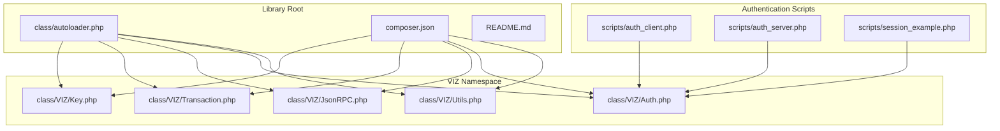
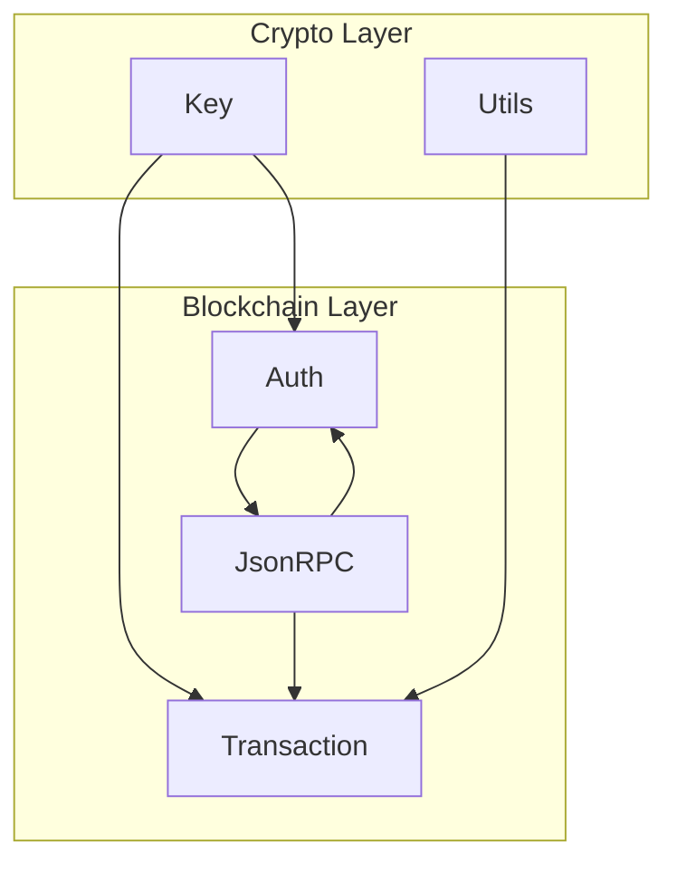
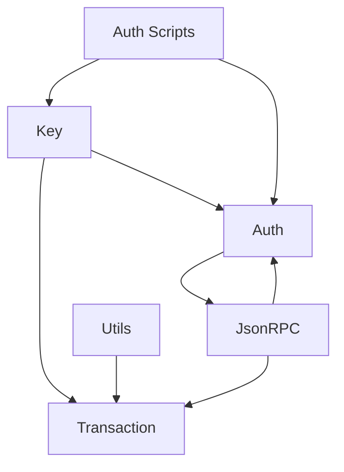

# API Reference

<cite>
**Referenced Files in This Document**
- [README.md](file://README.md)
- [composer.json](file://composer.json)
- [class/autoloader.php](file://class/autoloader.php)
- [class/VIZ/Key.php](file://class/VIZ/Key.php)
- [class/VIZ/Transaction.php](file://class/VIZ/Transaction.php)
- [class/VIZ/JsonRPC.php](file://class/VIZ/JsonRPC.php)
- [class/VIZ/Auth.php](file://class/VIZ/Auth.php)
- [class/VIZ/Utils.php](file://class/VIZ/Utils.php)
- [scripts/auth_client.php](file://scripts/auth_client.php)
- [scripts/auth_server.php](file://scripts/auth_server.php)
- [scripts/session_example.php](file://scripts/session_example.php)
</cite>

## Update Summary
**Changes Made**
- Added comprehensive documentation for the new authentication system components
- Updated Auth class API documentation with complete method specifications
- Added Key.auth() method documentation with detailed parameter descriptions
- Included authentication workflow examples and usage patterns
- Enhanced integration examples with client-server authentication patterns
- Added session management documentation and cloud operations patterns

## Table of Contents
1. [Introduction](#introduction)
2. [Project Structure](#project-structure)
3. [Core Components](#core-components)
4. [Architecture Overview](#architecture-overview)
5. [Detailed Component Analysis](#detailed-component-analysis)
6. [Authentication System](#authentication-system)
7. [Dependency Analysis](#dependency-analysis)
8. [Performance Considerations](#performance-considerations)
9. [Troubleshooting Guide](#troubleshooting-guide)
10. [Conclusion](#conclusion)
11. [Appendices](#appendices)

## Introduction
This API reference documents the public interfaces of the VIZ PHP Library, focusing on the Key, Transaction, JsonRPC, Auth, and Utils classes. It provides method specifications, parameter types, return values, exceptions, usage examples, integration patterns, error handling strategies, and performance considerations. The library now includes a comprehensive authentication system with passwordless authentication capabilities, enabling secure blockchain-based authentication for applications.

## Project Structure
The library follows a PSR-4-compatible structure with a classmap fallback and autoloading support. The primary namespace is VIZ, with supporting namespaces for elliptic curve cryptography and big integer arithmetic. The authentication system includes dedicated scripts demonstrating client-server interaction patterns.

**Diagram sources**
- [class/autoloader.php](file://class/autoloader.php#L1-L14)
- [composer.json](file://composer.json#L19-L29)
- [scripts/auth_client.php](file://scripts/auth_client.php#L1-L82)
- [scripts/auth_server.php](file://scripts/auth_server.php#L1-L195)
- [scripts/session_example.php](file://scripts/session_example.php#L1-L244)

**Section sources**
- [README.md](file://README.md#L1-L455)
- [composer.json](file://composer.json#L1-L32)
- [class/autoloader.php](file://class/autoloader.php#L1-L14)

## Core Components
This section summarizes the responsibilities and public interfaces of each core class, including the new authentication system components.

- Key: Cryptographic key management, signing, verification, shared key derivation, memo encryption/decryption, and **passwordless authentication challenge generation**.
- Transaction: Build and broadcast blockchain transactions, multi-operation queues, multi-signature support, and encoding helpers for operation payloads.
- JsonRPC: Low-level JSON-RPC client with HTTP(S)/WS(S) transport, header customization, SSL/TLS control, and result parsing.
- Auth: **Passwordless authentication verification against VIZ chain authorities**, validating authentication challenges and session tokens.
- Utils: Utility functions for Voice protocol posts, Base58 encoding/decoding, AES-256-CBC encryption/decryption, VLQ encoding/decoding, and address conversions.

**Section sources**
- [class/VIZ/Key.php](file://class/VIZ/Key.php#L1-L353)
- [class/VIZ/Transaction.php](file://class/VIZ/Transaction.php#L1-L1416)
- [class/VIZ/JsonRPC.php](file://class/VIZ/JsonRPC.php#L1-L354)
- [class/VIZ/Auth.php](file://class/VIZ/Auth.php#L1-L70)
- [class/VIZ/Utils.php](file://class/VIZ/Utils.php#L1-L413)

## Architecture Overview
The library integrates cryptographic primitives, transaction builders, and JSON-RPC clients to interact with VIZ nodes. The Transaction class composes JsonRPC and Key to construct, sign, and broadcast transactions. **The Auth class provides passwordless authentication verification against chain authority configurations, working in conjunction with the Key class for challenge generation and signature recovery.** Utils provides reusable helpers for encoding, encryption, and Voice protocol operations.

**Diagram sources**
- [class/VIZ/Key.php](file://class/VIZ/Key.php#L1-L353)
- [class/VIZ/Transaction.php](file://class/VIZ/Transaction.php#L1-L1416)
- [class/VIZ/JsonRPC.php](file://class/VIZ/JsonRPC.php#L1-L354)
- [class/VIZ/Auth.php](file://class/VIZ/Auth.php#L1-L70)
- [class/VIZ/Utils.php](file://class/VIZ/Utils.php#L1-L413)

## Detailed Component Analysis

### Key Class API
The Key class manages private/public keys, shared key derivation, signing, verification, signature recovery, and memo encryption/decryption. **It now includes passwordless authentication challenge generation capabilities.**

- Constructor
  - Parameters: data (string), private (bool)
  - Behavior: Initializes elliptic curve context and imports key based on input format.
  - Exceptions: None documented; returns false on import failure.
  - Returns: Instance of Key.

- get_shared_key(public_key_encoded)
  - Parameters: public_key_encoded (string)
  - Behavior: Derives shared secret using ECDH with secp256k1.
  - Returns: Hex-encoded shared key or false on failure.

- encode_memo(public_key_encoded, memo)
  - Parameters: public_key_encoded (string), memo (string)
  - Behavior: Encrypts memo using shared key and VLQ encoding; produces Base58-encoded structure compatible with js-lib.
  - Returns: Encrypted memo string or false on failure.

- decode_memo(memo)
  - Parameters: memo (string)
  - Behavior: Decodes Base58 structure, derives shared key, validates checksum, and decrypts payload.
  - Returns: Decrypted memo string or false on failure.

- gen(seed, salt)
  - Parameters: seed (string), salt (mixed)
  - Behavior: Generates deterministic key pair from seed and salt; returns seed, WIF, encoded public key, and public key object.
  - Returns: Array [seed, wif, encoded_public_key, public_key_object].

- gen_pair(seed, salt)
  - Parameters: seed (string), salt (string)
  - Behavior: Similar to gen but returns WIF and public key pair.
  - Returns: Array [wif, encoded_public_key, public_key_object].

- import_hex(hex)
  - Parameters: hex (string)
  - Behavior: Sets internal binary and hex representations.
  - Returns: void.

- import_bin(bin)
  - Parameters: bin (string)
  - Behavior: Sets internal binary and hex representations.
  - Returns: void.

- import_wif(wif)
  - Parameters: wif (string)
  - Behavior: Decodes WIF, validates checksum and version, sets private key state.
  - Returns: bool.

- import_public(key)
  - Parameters: key (string)
  - Behavior: Decodes public key, validates checksum, sets public key state.
  - Returns: bool.

- to_public()
  - Behavior: Converts private key to compressed public key representation.
  - Returns: bool.

- get_public_key()
  - Behavior: Returns a copy of the key as a public key object.
  - Returns: Key (public).

- get_public_key_hex()
  - Behavior: Returns compressed public key hex.
  - Returns: string.

- get_full_public_key_hex()
  - Behavior: Returns uncompressed public key hex.
  - Returns: string.

- encode(prefix)
  - Parameters: prefix (string)
  - Behavior: Encodes private key as WIF or public key with prefix.
  - Returns: string.

- sign(data)
  - Parameters: data (string)
  - Behavior: Hashes data and signs with canonical signature.
  - Returns: Hex-encoded compact signature or false.

- verify(data, signature)
  - Parameters: data (string), signature (string)
  - Behavior: Verifies signature against public key.
  - Returns: bool.

- recover_public_key(data, signature)
  - Parameters: data (string), signature (string)
  - Behavior: Recovers public key from signature.
  - Returns: Encoded public key string or false.

- **auth(account, domain, action='auth', authority='regular')**
  - **Parameters**: account (string), domain (string), action (string), authority (string)
  - **Behavior**: Generates passwordless authentication challenge data including domain, action, account, authority, timestamp, and nonce; creates signature using private key.
  - **Returns**: Array [$data, $signature] where data format is "domain:action:account:authority:timestamp:nonce".
  - **Notes**: Uses timezone-aware timestamp calculation and includes nonce incrementation for signature generation.

Usage examples and integration patterns are demonstrated in the README under Keys, Memo Encryption/Decryption, and Auth sections.

**Section sources**
- [class/VIZ/Key.php](file://class/VIZ/Key.php#L1-L353)
- [README.md](file://README.md#L40-L222)

### Transaction Class API
The Transaction class builds and executes blockchain operations. It supports queueing multiple operations, multi-signature signing, and broadcasting via JsonRPC.

- Constructor
  - Parameters: endpoint (string), private_key (string)
  - Behavior: Initializes JsonRPC client and adds private key(s).
  - Returns: Instance of Transaction.

- set_private_key(private_key)
  - Parameters: private_key (string)
  - Behavior: Replaces last private key slot.
  - Returns: void.

- add_private_key(private_key)
  - Parameters: private_key (string)
  - Behavior: Adds a new private key.
  - Returns: void.

- __call(name, attr)
  - Parameters: name (string), attr (array)
  - Behavior: Dynamically dispatches to build_* methods and either queues or immediately builds and returns transaction data.
  - Returns: Transaction data array or immediate result.

- execute(transaction_json, synchronous)
  - Parameters: transaction_json (string), synchronous (bool)
  - Behavior: Broadcasts transaction synchronously or asynchronously.
  - Returns: Result from JsonRPC or block number if synchronous.

- build(operations_json, operations_data, operations_count)
  - Parameters: operations_json (string), operations_data (string), operations_count (int)
  - Behavior: Fetches dynamic global properties, resolves TAPoS, constructs raw transaction, signs with all private keys, and returns transaction metadata.
  - Returns: Array ['id', 'data', 'json', 'signatures'].

- add_signature(json, data, private_key)
  - Parameters: json (string), data (string), private_key (string)
  - Behavior: Signs raw transaction data and injects signature into JSON.
  - Returns: Updated transaction data array or false.

- Operation Builders
  - Methods: build_account_create, build_account_update, build_request_account_recovery, build_recover_account, build_account_metadata, build_account_witness_vote, build_change_recovery_account, build_account_witness_proxy, build_set_withdraw_vesting_route, build_award, build_fixed_award, build_create_invite, build_escrow_transfer, build_escrow_dispute, build_escrow_release, build_escrow_approve, build_transfer, build_transfer_to_vesting, build_withdraw_vesting, build_delegate_vesting_shares, build_committee_worker_create_request, build_committee_worker_cancel_request, build_committee_vote_request, build_claim_invite_balance, build_invite_registration, build_use_invite_balance, build_versioned_chain_properties_update, build_custom, build_witness_update, build_set_paid_subscription, build_paid_subscribe, build_set_account_price, build_target_account_sale, build_set_subaccount_price, build_buy_account, build_proposal_create, build_proposal_update, build_proposal_delete.
  - Parameters: Vary by operation; see method definitions for exact signatures.
  - Returns: Array [json, raw_hex].

- Queue Management
  - start_queue(): Enables queuing mode.
  - end_queue(): Flushes queued operations into a single transaction and returns built transaction data.

- Encoding Helpers
  - encode_asset(input), encode_public_key(input), encode_string(input), encode_timestamp(input), encode_unixtime(input), encode_bool(input), encode_int16(input), encode_uint8(input), encode_uint16(input), encode_uint32(input), encode_uint64(input), encode_int(input, bytes), encode_array(array, type, structured=false).
  - Parameters: As indicated; types reflect operation payload encoding rules.
  - Returns: Hex-encoded serialized data.

Usage examples and integration patterns are demonstrated in the README under JsonRPC, Transaction, and Multi-Operations sections.

**Section sources**
- [class/VIZ/Transaction.php](file://class/VIZ/Transaction.php#L1-L1416)
- [README.md](file://README.md#L69-L308)

### JsonRPC Class API
The JsonRPC class provides a low-level client for VIZ JSON-RPC endpoints over HTTP/HTTPS and WebSocket variants.

- Constructor
  - Parameters: endpoint (string), debug (bool)
  - Behavior: Initializes endpoint and debug flags; prepares request/result arrays.
  - Returns: Instance of JsonRPC.

- set_header(name, value)
  - Parameters: name (string), value (string)
  - Behavior: Sets or removes HTTP headers.
  - Returns: void.

- get_url(url, post, debug)
  - Parameters: url (string), post (array|string), debug (bool)
  - Behavior: Resolves host/port, establishes connection, sends request, reads response, handles redirects and chunked/gzip decoding.
  - Returns: Raw HTTP response string or false on error.

- check_redirect(data, post, debug)
  - Parameters: data (string), post (array), debug (bool)
  - Behavior: Extracts Location header and retries GET/POST to redirected URL.
  - Returns: Response string.

- clear_chunked(data)
  - Parameters: data (string)
  - Behavior: Removes chunked transfer markers.
  - Returns: Cleaned body string.

- parse_web_result(data)
  - Parameters: data (string)
  - Behavior: Splits headers and body, handles chunked and gzip.
  - Returns: Array [headers, body].

- raw_method(method, params)
  - Parameters: method (string), params (string)
  - Behavior: Builds JSON-RPC call for raw parameter string.
  - Returns: JSON-RPC query string or false if method not mapped.

- build_method(method, params)
  - Parameters: method (string), params (array)
  - Behavior: Builds JSON-RPC call with typed parameters.
  - Returns: JSON-RPC query string or false if method not mapped.

- execute_method(method, params, debug)
  - Parameters: method (string), params (array|string), debug (bool)
  - Behavior: Selects raw or typed builder, sends request, parses result, checks HTTP status, and returns result or extended array depending on return_only_result flag.
  - Returns: Result value or false on error.

Publicly mapped API methods include database_api, network_broadcast_api, account_history, committee_api, invite_api, operation_history, paid_subscription_api, witness_api, and others as defined in the internal mapping.

Usage examples and integration patterns are demonstrated in the README under JsonRPC and Transaction sections.

**Section sources**
- [class/VIZ/JsonRPC.php](file://class/VIZ/JsonRPC.php#L1-L354)
- [README.md](file://README.md#L69-L135)

### Auth Class API
**The Auth class provides passwordless authentication verification against VIZ chain authority thresholds, working in conjunction with the Key class for challenge generation and signature validation.**

- Constructor
  - Parameters: node (string), domain (string), action (string), authority (string), range (int)
  - Behavior: Initializes JsonRPC client, Key object, and policy parameters.
  - Returns: Instance of Auth.

- check(data, signature)
  - Parameters: data (string), signature (string)
  - Behavior: Parses challenge, recovers public key, validates domain/action/authority/time window, fetches account, sums key weights, and compares to threshold.
  - Returns: bool.
  - **Validation Process**:
    - Parses challenge data format "domain:action:account:authority:timestamp:nonce"
    - Recovers public key from signature
    - Validates domain, action, and authority match configured values
    - Checks timestamp against configured time range with timezone adjustment
    - Fetches account from blockchain and validates key weights meet threshold
    - Returns true if authentication succeeds, false otherwise

**Section sources**
- [class/VIZ/Auth.php](file://class/VIZ/Auth.php#L1-L70)
- [README.md](file://README.md#L206-L222)

### Utils Class API
The Utils class provides utility functions for Voice protocol posts, Base58 encoding/decoding, AES-256-CBC encryption/decryption, VLQ encoding/decoding, and address conversions.

- Static Methods
  - prepare_voice_text_data(text, reply=false, share=false, beneficiaries=false)
    - Parameters: text (string), reply (bool|string), share (bool|string), beneficiaries (array)
    - Returns: Array with voice text data structure.

  - prepare_voice_text(previous, text, reply=false, share=false, beneficiaries=false)
    - Parameters: previous (int), text (string), reply (bool|string), share (bool|string), beneficiaries (array)
    - Returns: Array representing voice text object.

  - voice_text(endpoint, key, account, text, reply=false, share=false, beneficiaries=false, loop=false, synchronous=false, return_raw=false)
    - Parameters: endpoint (string), key (mixed), account (string), text (string), reply (bool|string), share (bool|string), beneficiaries (array), loop (int|bool), synchronous (bool), return_raw (bool)
    - Behavior: Builds and executes a Voice text operation; returns status or raw transaction.
    - Returns: bool or int (block number) or raw transaction array.

  - prepare_voice_publication_data(title, markdown, description, image, reply=false, share=false, beneficiaries=false)
    - Parameters: title (string), markdown (string), description (string), image (string), reply (bool|string), share (bool|string), beneficiaries (array)
    - Returns: Array with voice publication data structure.

  - prepare_voice_publication(previous, title, markdown, description, image, reply=false, share=false, beneficiaries=false)
    - Parameters: previous (int), title (string), markdown (string), description (string), image (string), reply (bool|string), share (bool|string), beneficiaries (array)
    - Returns: Array representing voice publication object.

  - voice_publication(endpoint, key, account, title, markdown, description, image, reply=false, share=false, beneficiaries=false, loop=false, synchronous=false, return_raw=false)
    - Parameters: endpoint (string), key (mixed), account (string), title (string), markdown (string), description (string), image (string), reply (bool|string), share (bool|string), beneficiaries (array), loop (int|bool), synchronous (bool), return_raw (bool)
    - Behavior: Builds and executes a Voice publication operation; returns status or raw transaction.
    - Returns: bool or int (block number) or raw transaction array.

  - prepare_voice_event(previous, event)
    - Parameters: previous (int), event (string)
    - Returns: Array representing voice event object.

  - voice_event(endpoint, key, account, event_type, target_account=false, target_block, data_type=false, data=false, synchronous=false, return_raw=false)
    - Parameters: endpoint (string), key (mixed), account (string), event_type (string), target_account (string), target_block (int), data_type (string), data (array), synchronous (bool), return_raw (bool)
    - Behavior: Builds and executes a Voice event operation; returns status or raw transaction.
    - Returns: bool or int (block number) or raw transaction array.

  - base58_encode(string, alphabet='...')
    - Parameters: string (string), alphabet (string)
    - Behavior: Encodes binary string to Base58 using custom alphabet.
    - Returns: Encoded string or empty string.

  - base58_decode(base58, alphabet='...')
    - Parameters: base58 (string), alphabet (string)
    - Behavior: Decodes Base58 string to binary.
    - Returns: Decoded binary string or false on invalid input.

  - aes_256_cbc_encrypt(data_bin, key_bin, iv=false)
    - Parameters: data_bin (string), key_bin (string), iv (string|false)
    - Behavior: Encrypts data with AES-256-CBC; returns preset IV or array with iv and data.
    - Returns: Hex-encoded ciphertext or array [iv, data] or false.

  - aes_256_cbc_decrypt(data_bin, key_bin, iv)
    - Parameters: data_bin (string), key_bin (string), iv (string)
    - Behavior: Decrypts data with AES-256-CBC.
    - Returns: Decrypted binary string or false.

  - vlq_create(data)
    - Parameters: data (string)
    - Behavior: Creates VLQ encoding for length-prefixed data.
    - Returns: VLQ bytes.

  - vlq_extract(data, as_bytes=false)
    - Parameters: data (string), as_bytes (bool)
    - Behavior: Extracts digits from VLQ.
    - Returns: Array of digits or bytes.

  - vlq_calculate(digits, as_bytes=false)
    - Parameters: digits (array), as_bytes (bool)
    - Behavior: Calculates original length from VLQ digits.
    - Returns: Integer length.

  - privkey_hex_to_btc_wif(hex, compressed=false)
    - Parameters: hex (string), compressed (bool)
    - Returns: BTC WIF string.

  - privkey_hex_to_ltc_wif(hex)
    - Parameters: hex (string)
    - Returns: LTC WIF string.

  - full_pubkey_hex_to_btc_address(hex, network_id)
    - Parameters: hex (string), network_id (string)
    - Returns: BTC address string.

  - full_pubkey_hex_to_ltc_address(hex, network_id)
    - Parameters: hex (string), network_id (string)
    - Returns: LTC address string.

  - full_pubkey_hex_to_eth_address(hex)
    - Parameters: hex (string)
    - Returns: ETH address string.

  - full_pubkey_hex_to_trx_address(hex)
    - Parameters: hex (string)
    - Returns: TRX address string.

Usage examples and integration patterns are demonstrated in the README under Voice protocol sections.

**Section sources**
- [class/VIZ/Utils.php](file://class/VIZ/Utils.php#L1-L413)
- [README.md](file://README.md#L310-L453)

## Authentication System

**The VIZ PHP Library includes a comprehensive passwordless authentication system that enables secure authentication against VIZ blockchain authority configurations.**

### Authentication Workflow

The authentication system operates through a client-server interaction pattern:

1. **Client Side**: Generates authentication challenge using Key.auth() method
2. **Server Side**: Validates challenge using Auth.check() method
3. **Session Management**: Creates session tokens for subsequent authenticated requests

### Client-Side Authentication

**Key.auth() Method**
- Generates passwordless authentication challenge data
- Creates signature using private key
- Returns [$data, $signature] tuple

**Client Script Examples**
- [auth_client.php](file://scripts/auth_client.php): Demonstrates complete client-side authentication workflow
- [session_example.php](file://scripts/session_example.php): Shows end-to-end authentication and session management

### Server-Side Authentication

**Auth.check() Method**
- Validates authentication challenge against blockchain authority
- Handles timezone-aware timestamp validation
- Verifies key weights meet authority thresholds
- Returns boolean authentication status

**Server Script Examples**
- [auth_server.php](file://scripts/auth_server.php): Complete server-side authentication implementation
- Supports both signature-based and session-based authentication

### Session Management

**Session Patterns**
- File-based session storage for development
- Database-backed sessions for production
- Automatic session cleanup and expiration
- Cloud operations pattern for scalable deployments

**Section sources**
- [class/VIZ/Key.php](file://class/VIZ/Key.php#L339-L352)
- [class/VIZ/Auth.php](file://class/VIZ/Auth.php#L1-L70)
- [scripts/auth_client.php](file://scripts/auth_client.php#L1-L82)
- [scripts/auth_server.php](file://scripts/auth_server.php#L1-L195)
- [scripts/session_example.php](file://scripts/session_example.php#L1-L244)

## Dependency Analysis
The following diagram shows the primary dependencies among the core classes, including the new authentication system components.

**Diagram sources**
- [class/VIZ/Key.php](file://class/VIZ/Key.php#L1-L353)
- [class/VIZ/Transaction.php](file://class/VIZ/Transaction.php#L1-L1416)
- [class/VIZ/JsonRPC.php](file://class/VIZ/JsonRPC.php#L1-L354)
- [class/VIZ/Auth.php](file://class/VIZ/Auth.php#L1-L70)
- [class/VIZ/Utils.php](file://class/VIZ/Utils.php#L1-L413)
- [scripts/auth_client.php](file://scripts/auth_client.php#L1-L82)
- [scripts/auth_server.php](file://scripts/auth_server.php#L1-L195)
- [scripts/session_example.php](file://scripts/session_example.php#L1-L244)

**Section sources**
- [class/VIZ/Key.php](file://class/VIZ/Key.php#L1-L353)
- [class/VIZ/Transaction.php](file://class/VIZ/Transaction.php#L1-L1416)
- [class/VIZ/JsonRPC.php](file://class/VIZ/JsonRPC.php#L1-L354)
- [class/VIZ/Auth.php](file://class/VIZ/Auth.php#L1-L70)
- [class/VIZ/Utils.php](file://class/VIZ/Utils.php#L1-L413)

## Performance Considerations
- Signing and verification: Canonical signature generation may retry until a suitable nonce is found; batching operations and reusing keys can reduce overhead.
- Transaction building: Using queue mode reduces multiple round-trips to the node for TAPoS resolution and signing.
- Network I/O: JsonRPC timeouts and SSL verification can impact latency; tune read_timeout and disable SSL verification only in controlled environments.
- Encoding: VLQ and AES operations are lightweight but can add overhead for large payloads; consider splitting large Voice objects into multiple transactions.
- Memory usage: Large transaction payloads and repeated signing can increase memory consumption; process in batches and free references when possible.
- **Authentication**: Timezone calculations and blockchain queries add overhead; cache frequently accessed account data and use appropriate time ranges.

## Troubleshooting Guide
Common issues and resolutions:

- Invalid WIF or public key import
  - Symptoms: Import methods return false.
  - Causes: Incorrect format, checksum mismatch, or unsupported version.
  - Resolution: Verify input format and checksums; ensure correct prefix and encoding.

- Canonical signature not found
  - Symptoms: sign() returns false.
  - Causes: Difficulty finding canonical signature for given data hash.
  - Resolution: Retry signing; ensure deterministic input hashing.

- Transaction broadcast failures
  - Symptoms: execute() returns false or extended result contains error.
  - Causes: Invalid signatures, expired expiration, malformed operations, or node errors.
  - Resolution: Validate signatures, adjust expiration, rebuild operations, and check node health.

- **Authentication verification fails**
  - **Symptoms**: check() returns false.
  - **Causes**: Out-of-range timestamps, wrong domain/action/authority, missing or insufficient key weights, incorrect timezone configuration.
  - **Resolution**: Align server timezone offset, verify domain/action/authority, ensure sufficient key weights, and check authentication data format.

- **Memo decryption errors**
  - **Symptoms**: decode_memo() returns false.
  - **Causes**: Invalid Base58 structure, checksum mismatch, or wrong shared key.
  - **Resolution**: Ensure correct shared key derivation and Base58 validity.

- **Session management issues**
  - **Symptoms**: Session validation fails or expires prematurely.
  - **Causes**: Incorrect session storage, expired timestamps, or session file corruption.
  - **Resolution**: Implement proper session cleanup, validate session data integrity, and use appropriate TTL values.

**Section sources**
- [class/VIZ/Key.php](file://class/VIZ/Key.php#L179-L242)
- [class/VIZ/Transaction.php](file://class/VIZ/Transaction.php#L53-L59)
- [class/VIZ/JsonRPC.php](file://class/VIZ/JsonRPC.php#L311-L353)
- [class/VIZ/Auth.php](file://class/VIZ/Auth.php#L25-L69)
- [class/VIZ/Utils.php](file://class/VIZ/Utils.php#L291-L320)

## Conclusion
The VIZ PHP Library provides a cohesive set of classes for cryptographic operations, transaction construction, JSON-RPC communication, authentication, and utility functions. **The new authentication system enables secure passwordless authentication against VIZ blockchain authority configurations, with comprehensive client-server interaction patterns and session management capabilities.** By leveraging the APIs documented here, developers can integrate with the VIZ blockchain efficiently, handle multi-signature scenarios, implement advanced features like Voice protocol posts and memo encryption, and deploy secure authentication systems for their applications.

## Appendices

### Integration Examples Index
- Keys: Initialization, signing, verification, memo encryption/decryption, and **authentication challenge generation**.
- JsonRPC: Endpoint configuration, method invocation, and result handling.
- Transaction: Single and multi-operation workflows, queue mode, and multi-signature addition.
- **Auth**: Passwordless authentication verification against chain authorities, including domain/action/authority validation.
- **Authentication Scripts**: Complete client-server authentication workflows, session management, and cloud operations patterns.
- Utils: Voice protocol posts (text, publication, event), Base58 encoding/decryption, AES encryption/decryption, and address conversions.

### Authentication Usage Patterns

**Basic Authentication Flow**
1. Client generates challenge: `$private_key->auth($account, $domain, $action, $authority)`
2. Server validates: `$auth->check($data, $signature)`
3. Session creation: `$auth->check($data, $signature)` then create session token

**Advanced Configuration**
- Custom time ranges: Configure acceptable time window for authentication
- Authority thresholds: Set weight thresholds for different authority types
- Domain restrictions: Limit authentication to specific domains
- Action scoping: Differentiate between authentication actions

**Section sources**
- [README.md](file://README.md#L36-L453)
- [scripts/auth_client.php](file://scripts/auth_client.php#L1-L82)
- [scripts/auth_server.php](file://scripts/auth_server.php#L1-L195)
- [scripts/session_example.php](file://scripts/session_example.php#L1-L244)