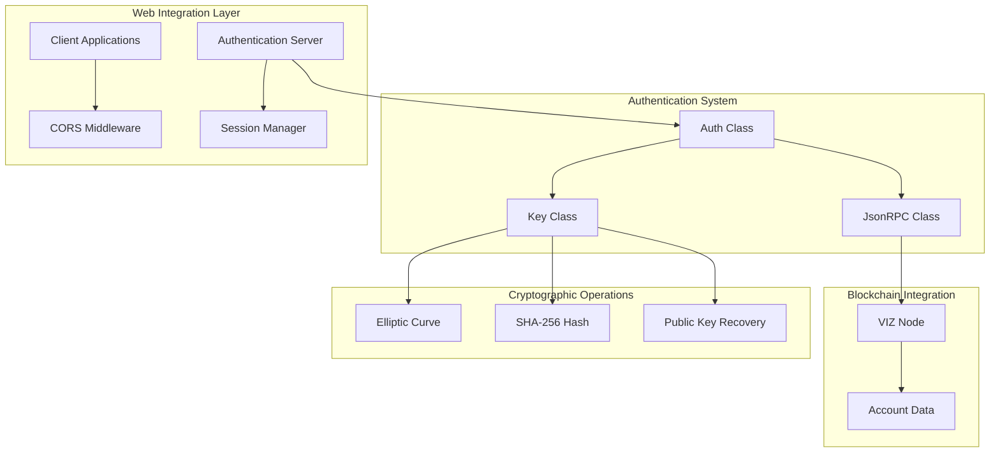
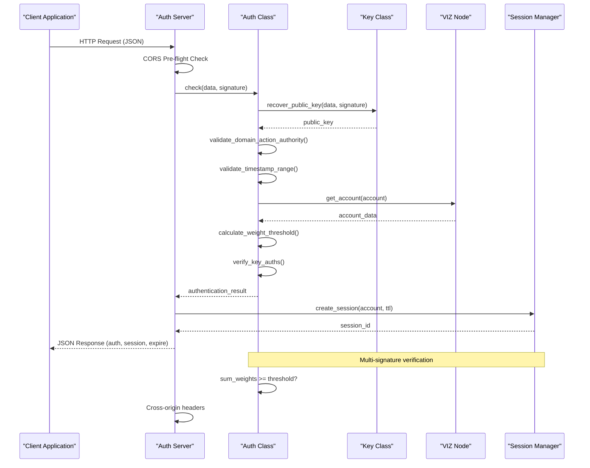
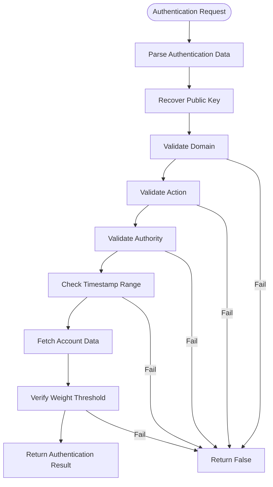
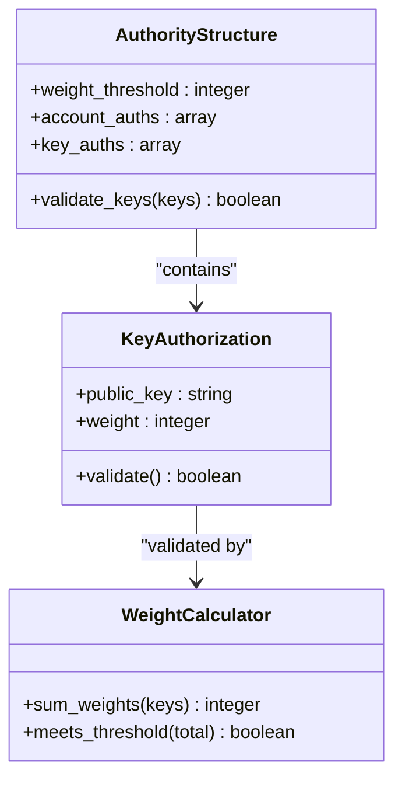
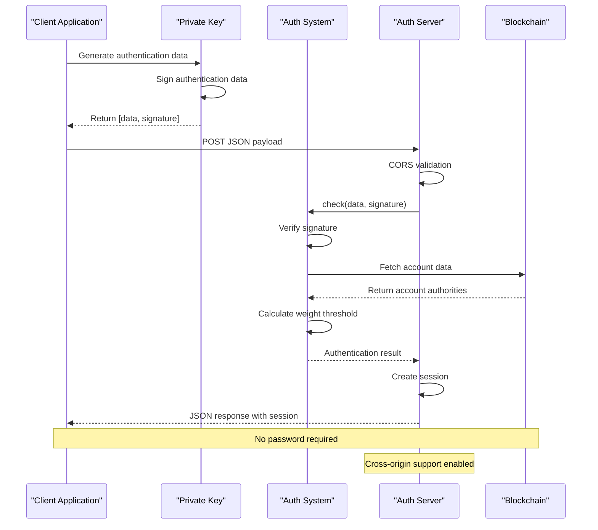
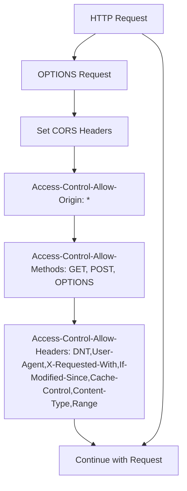
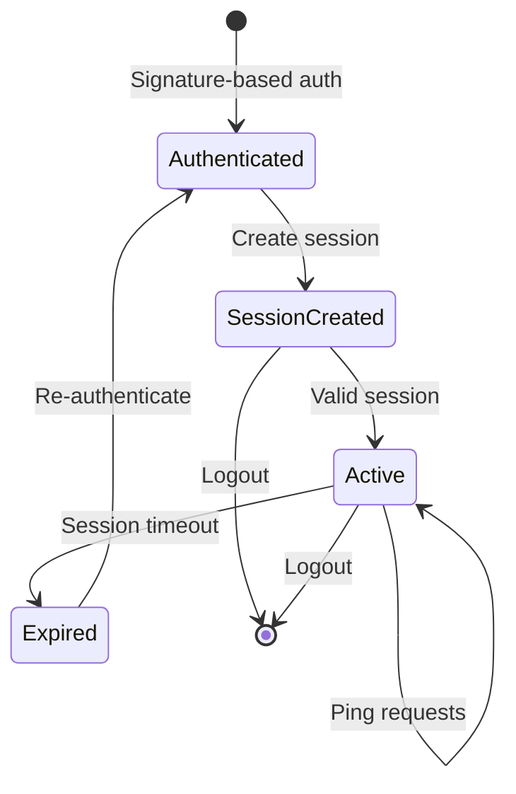
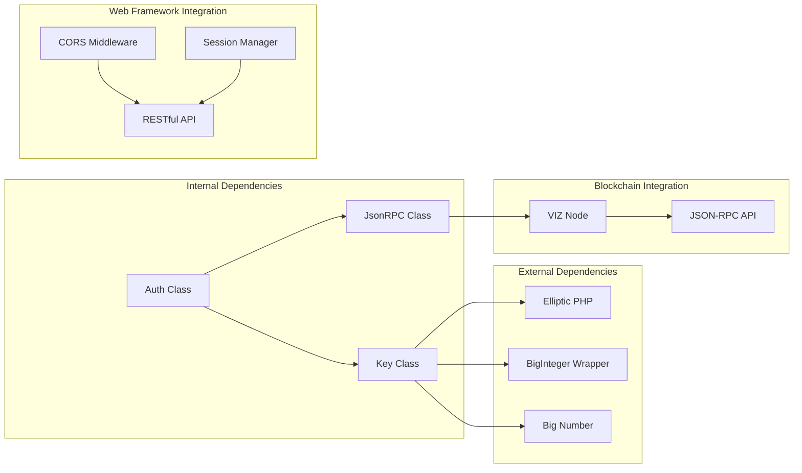

# Auth Class API

<cite>
**Referenced Files in This Document**
- [Auth.php](file://class/VIZ/Auth.php)
- [Key.php](file://class/VIZ/Key.php)
- [JsonRPC.php](file://class/VIZ/JsonRPC.php)
- [auth_client.php](file://scripts/auth_client.php)
- [auth_server.php](file://scripts/auth_server.php)
- [session_example.php](file://scripts/session_example.php)
- [README.md](file://README.md)
- [composer.json](file://composer.json)
</cite>

## Update Summary
**Changes Made**
- Added comprehensive cross-origin authentication support documentation
- Enhanced session management workflow examples
- Updated authentication data format specifications
- Added practical client-server interaction patterns
- Expanded multi-signature authority validation examples
- Included new authentication workflow diagrams

## Table of Contents
1. [Introduction](#introduction)
2. [Project Structure](#project-structure)
3. [Core Components](#core-components)
4. [Architecture Overview](#architecture-overview)
5. [Detailed Component Analysis](#detailed-component-analysis)
6. [Cross-Origin Authentication Patterns](#cross-origin-authentication-patterns)
7. [Session Management Workflow](#session-management-workflow)
8. [Dependency Analysis](#dependency-analysis)
9. [Performance Considerations](#performance-considerations)
10. [Troubleshooting Guide](#troubleshooting-guide)
11. [Conclusion](#conclusion)

## Introduction
The VIZ\Auth class provides comprehensive passwordless authentication verification for VIZ blockchain applications. It enables domain-specific authentication patterns with time-based validation, authority checking, and multi-signature support through integration with the VIZ\Key class. This documentation covers authentication verification methods, domain-specific authentication patterns, time-based validation mechanisms, authority checking, and multi-signature support with practical examples for passwordless authentication workflows, authority management, and permission validation scenarios.

**Updated** Enhanced with cross-origin authentication support and comprehensive session management patterns demonstrated in the new authentication scripts.

## Project Structure
The authentication system consists of several interconnected components that work together to provide secure passwordless authentication with modern web integration patterns:

**Diagram sources**
- [Auth.php](file://class/VIZ/Auth.php#L9-L24)
- [Key.php](file://class/VIZ/Key.php#L9-L32)
- [JsonRPC.php](file://class/VIZ/JsonRPC.php#L4-L22)
- [auth_server.php](file://scripts/auth_server.php#L22-L30)
- [session_example.php](file://scripts/session_example.php#L135-L241)

**Section sources**
- [composer.json](file://composer.json#L19-L28)

## Core Components
The authentication system is built around four primary components that handle different aspects of the authentication process with modern web integration:

### Authentication Verification Engine
The VIZ\Auth class serves as the central verification engine, responsible for validating authentication requests and ensuring their integrity through cryptographic checks and blockchain-based authority verification.

### Cryptographic Key Management
The VIZ\Key class provides comprehensive cryptographic operations including signature generation, verification, public key recovery, and key encoding/decoding capabilities essential for the authentication process.

### Blockchain Communication
The VIZ\JsonRPC class handles communication with VIZ blockchain nodes, enabling real-time account data retrieval and authority validation against on-chain account structures.

### Web Integration Layer
The authentication system now includes comprehensive web integration capabilities including cross-origin resource sharing (CORS) support, session management, and RESTful API patterns for modern web applications.

**Section sources**
- [Auth.php](file://class/VIZ/Auth.php#L9-L24)
- [Key.php](file://class/VIZ/Key.php#L9-L32)
- [JsonRPC.php](file://class/VIZ/JsonRPC.php#L4-L22)
- [auth_server.php](file://scripts/auth_server.php#L22-L30)

## Architecture Overview
The authentication architecture follows a multi-layered approach combining cryptographic verification with blockchain-based authority validation and modern web integration patterns:

**Diagram sources**
- [Auth.php](file://class/VIZ/Auth.php#L25-L69)
- [Key.php](file://class/VIZ/Key.php#L323-L338)
- [JsonRPC.php](file://class/VIZ/JsonRPC.php#L311-L353)
- [auth_server.php](file://scripts/auth_server.php#L110-L130)
- [auth_server.php](file://scripts/auth_server.php#L141-L151)

## Detailed Component Analysis

### Auth Class API Reference

#### Constructor Parameters
The Auth class constructor accepts five primary parameters for configuring authentication behavior with enhanced flexibility:

| Parameter | Type | Default | Description |
|-----------|------|---------|-------------|
| `node` | string | Required | VIZ node endpoint URL for blockchain communication |
| `domain` | string | Required | Domain identifier for authentication scope |
| `action` | string | `'auth'` | Action type for authentication (default: `'auth'`) |
| `authority` | string | `'regular'` | Authority level to validate (default: `'regular'`) |
| `range` | integer | `60` | Time window in seconds for timestamp validation |

#### Enhanced Authentication Verification Process

The `check()` method performs comprehensive authentication verification through the following enhanced steps:

**Diagram sources**
- [Auth.php](file://class/VIZ/Auth.php#L25-L69)

#### Enhanced Authentication Data Format
Authentication data follows an expanded colon-separated format: `domain:action:account:authority:unixtime:nonce`

| Field | Description | Example |
|-------|-------------|---------|
| `domain` | Domain identifier | `'example.com'` |
| `action` | Authentication action | `'auth'` |
| `account` | VIZ account name | `'myaccount'` |
| `authority` | Authority level | `'active'` |
| `unixtime` | Unix timestamp | `1700000000` |
| `nonce` | Incremental counter | `1` |

**Updated** Enhanced with nonce field for replay attack prevention and improved timestamp validation.

#### Time-Based Validation Mechanisms
The authentication system implements robust time-based validation to prevent replay attacks:

- **Default Time Window**: ±60 seconds from current server time
- **Timezone Handling**: Automatic timezone offset adjustment
- **Server Timezone Fix**: Optional manual timezone correction via `fix_server_timezone` property
- **Nonce Support**: Prevents replay attacks through incremental counter

#### Authority Checking System
The system supports multiple authority levels with corresponding weight thresholds:

| Authority Level | Purpose | Security Level |
|----------------|---------|----------------|
| `master` | Full account control | Highest |
| `active` | Regular operations | Medium-High |
| `regular` | Standard permissions | Medium |
| `posting` | Content posting | Lower |

#### Multi-Signature Support
Multi-signature authentication requires summing weights from multiple authorized keys:

**Diagram sources**
- [Auth.php](file://class/VIZ/Auth.php#L47-L59)

**Section sources**
- [Auth.php](file://class/VIZ/Auth.php#L17-L24)
- [Auth.php](file://class/VIZ/Auth.php#L25-L69)

### Key Class Integration

#### Enhanced Signature Generation and Verification
The Key class provides essential cryptographic operations integrated with the Auth class:

| Method | Purpose | Parameters | Returns |
|--------|---------|------------|---------|
| `sign(data)` | Generate digital signature | Data string | Signature string |
| `verify(data, signature)` | Verify signature authenticity | Data + Signature | Boolean |
| `recover_public_key(data, signature)` | Extract public key from signature | Data + Signature | Public key string |
| `auth(account, domain, action, authority)` | Generate authentication data | Account + Scope | `[data, signature]` |

**Updated** Enhanced with improved nonce handling and cross-platform compatibility.

#### Cryptographic Operations
The Key class utilizes secp256k1 elliptic curve cryptography with the following capabilities:

- **Canonical Signature Generation**: Ensures standardized signature format
- **Public Key Recovery**: Extracts public key from signed data
- **Multi-signature Support**: Handles multiple key authorization scenarios
- **Key Encoding**: Supports WIF, compressed/uncompressed public keys
- **Nonce Integration**: Prevents replay attacks through incremental counters

**Section sources**
- [Key.php](file://class/VIZ/Key.php#L302-L352)
- [Key.php](file://class/VIZ/Key.php#L323-L338)
- [Key.php](file://class/VIZ/Key.php#L339-L352)

### Practical Authentication Workflows

#### Enhanced Passwordless Authentication Setup
The authentication system enables passwordless authentication through signature-based verification with modern web integration:

**Diagram sources**
- [README.md](file://README.md#L207-L222)
- [Key.php](file://class/VIZ/Key.php#L339-L352)
- [auth_server.php](file://scripts/auth_server.php#L110-L130)

#### Enhanced Authority Management Examples
The system supports flexible authority management with configurable weight thresholds and modern web integration:

| Authority Type | Configuration | Use Case |
|----------------|---------------|----------|
| Single Key | `weight_threshold: 1` | Individual authentication |
| Multi-Signature | `weight_threshold: 2` | Corporate approvals |
| Hierarchical | `weight_threshold: 51` | High-security operations |
| Delegated | `account_auths` | Proxy voting systems |

**Updated** Enhanced with cross-origin session management and RESTful API patterns.

**Section sources**
- [README.md](file://README.md#L207-L222)

## Cross-Origin Authentication Patterns

### CORS Support Implementation
The authentication server includes comprehensive cross-origin resource sharing (CORS) support for modern web applications:

**Diagram sources**
- [auth_server.php](file://scripts/auth_server.php#L22-L30)

### Enhanced Client-Server Interaction
Modern authentication flows support seamless client-server communication with proper error handling:

| Request Type | Purpose | Payload Structure |
|--------------|---------|-------------------|
| Signature Auth | Initial authentication | `{data, signature, action: 'session'}` |
| Session Auth | Subsequent requests | `{session: sessionId, action: 'ping'}` |
| Verification | Status check | `{session: sessionId, action: 'verify'}` |
| Options | CORS pre-flight | `OPTIONS request with headers` |

**Updated** Enhanced with comprehensive CORS support and RESTful API patterns.

**Section sources**
- [auth_server.php](file://scripts/auth_server.php#L22-L30)
- [auth_server.php](file://scripts/auth_server.php#L110-L130)

## Session Management Workflow

### Complete Session Lifecycle
The authentication system implements a comprehensive session management pattern for persistent authentication:

**Diagram sources**
- [session_example.php](file://scripts/session_example.php#L81-L98)
- [session_example.php](file://scripts/session_example.php#L139-L153)

### Session Storage Patterns
The system supports multiple session storage backends with automatic cleanup:

| Storage Type | Backend | Cleanup | TTL |
|--------------|---------|---------|-----|
| File-based | JSON file | Automatic | 10 minutes |
| Database | MySQL/Redis | Automatic | Configurable |
| Memory | In-memory | Manual | Application lifetime |
| Cache | Memcached | Automatic | TTL-based |

**Updated** Enhanced with comprehensive session management examples and cloud operations patterns.

**Section sources**
- [session_example.php](file://scripts/session_example.php#L51-L98)
- [session_example.php](file://scripts/session_example.php#L135-L241)

## Dependency Analysis

### Component Relationships
The authentication system exhibits strong cohesion within its core functionality while maintaining loose coupling with external dependencies and modern web frameworks:

**Diagram sources**
- [Auth.php](file://class/VIZ/Auth.php#L4-L7)
- [Key.php](file://class/VIZ/Key.php#L4-L7)
- [JsonRPC.php](file://class/VIZ/JsonRPC.php#L4-L16)
- [auth_server.php](file://scripts/auth_server.php#L22-L30)

### Integration Points
The system integrates with multiple external libraries, blockchain services, and modern web frameworks:

- **Elliptic Curve Cryptography**: secp256k1 implementation for cryptographic operations
- **BigInteger Arithmetic**: Arbitrary precision integer calculations
- **VIZ Blockchain API**: Real-time account data retrieval and validation
- **JSON-RPC Protocol**: Standardized blockchain communication
- **CORS Middleware**: Cross-origin resource sharing for web applications
- **Session Management**: Persistent authentication state management
- **RESTful API**: Modern web service patterns

**Section sources**
- [composer.json](file://composer.json#L23-L28)

## Performance Considerations
The authentication system is designed for optimal performance through several key strategies with modern web optimization:

### Optimization Strategies
- **Minimal Network Calls**: Efficient blockchain data fetching with caching
- **Optimized Cryptographic Operations**: Canonical signature generation reduces computational overhead
- **Early Validation**: Domain, action, and authority validation occur before expensive network calls
- **Memory Efficiency**: Streamlined data structures minimize memory footprint
- **Session Caching**: Reduced blockchain calls through session-based authentication
- **CORS Optimization**: Efficient pre-flight request handling

### Scalability Factors
- **Concurrent Processing**: Independent authentication requests can be processed simultaneously
- **Resource Management**: Proper cleanup of cryptographic contexts prevents memory leaks
- **Network Optimization**: Connection pooling and efficient request batching
- **Session Scaling**: Horizontal scaling through distributed session storage
- **Load Balancing**: CORS-aware load balancing for cross-origin requests

## Troubleshooting Guide

### Common Authentication Issues

#### Authentication Failure Scenarios
| Issue | Cause | Solution |
|-------|-------|----------|
| Invalid Signature | Wrong private key or tampered data | Verify signature with original key |
| Expired Timestamp | Time window exceeded | Adjust server time or increase range |
| Wrong Domain | Domain mismatch in authentication data | Ensure domain matches constructor configuration |
| Insufficient Authority | Sum of weights below threshold | Add authorized keys or adjust weight thresholds |
| Account Not Found | Invalid account name | Verify account exists on blockchain |
| CORS Blocked | Cross-origin restrictions | Configure Access-Control-Allow-Origin headers |
| Session Expired | Session timeout exceeded | Re-authenticate or refresh session |
| Invalid Session | Corrupted session data | Clear session and re-authenticate |

#### Enhanced Debugging Authentication Requests
To debug authentication issues, implement the following diagnostic steps:

1. **Verify Data Format**: Ensure authentication data follows the required format
2. **Check Timestamp Accuracy**: Confirm server time synchronization
3. **Validate Authority Configuration**: Review account authority structures
4. **Test Signature Recovery**: Verify public key extraction from signature
5. **CORS Testing**: Verify cross-origin headers are properly configured
6. **Session Validation**: Check session storage and expiration
7. **Network Diagnostics**: Test blockchain connectivity and response times

**Section sources**
- [Auth.php](file://class/VIZ/Auth.php#L28-L67)
- [auth_server.php](file://scripts/auth_server.php#L22-L30)

### Error Handling Mechanisms
The authentication system implements comprehensive error handling with modern web integration:

- **Graceful Degradation**: Failed authentication attempts don't crash the system
- **Detailed Logging**: Comprehensive error reporting for debugging
- **Timeout Management**: Configurable timeouts for blockchain operations
- **Retry Logic**: Automatic retry for transient network failures
- **CORS Error Handling**: Proper error responses for cross-origin requests
- **Session Error Recovery**: Graceful degradation for session-related failures

## Conclusion
The VIZ\Auth class provides a robust foundation for passwordless authentication in VIZ blockchain applications with comprehensive modern web integration capabilities. Its integration with cryptographic key management, blockchain authority validation, and cross-origin authentication patterns ensures secure, scalable authentication solutions for contemporary web applications.

**Updated** Enhanced with comprehensive cross-origin support, session management patterns, and modern web integration capabilities demonstrated in the new authentication scripts.

Key strengths of the enhanced authentication system include:
- **Comprehensive Security**: Multi-layered validation including cryptographic verification, blockchain authority checks, and CORS protection
- **Flexible Authority Management**: Support for various authority levels and weight threshold configurations
- **Modern Web Integration**: Cross-origin authentication support and RESTful API patterns
- **Persistent Authentication**: Comprehensive session management with multiple storage backends
- **Scalable Architecture**: Optimized for high-performance authentication processing with horizontal scaling
- **Developer-Friendly API**: Intuitive interface with comprehensive error handling, debugging capabilities, and modern web patterns

The system successfully balances security requirements with modern web usability, making it suitable for production deployments requiring reliable passwordless authentication workflows with cross-origin support and persistent session management.