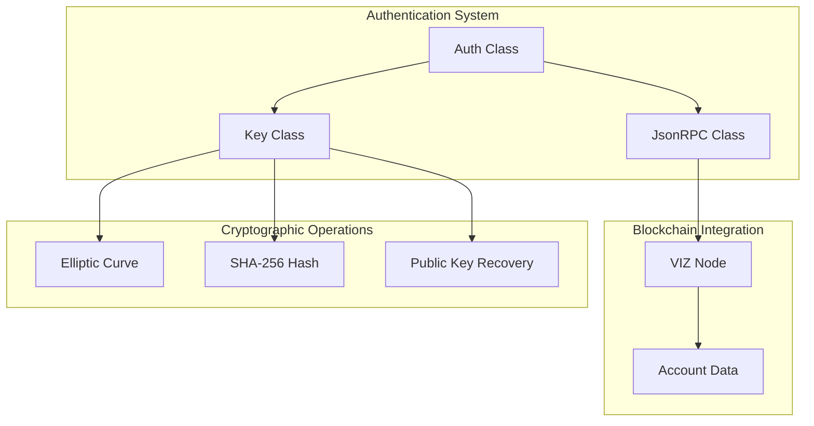
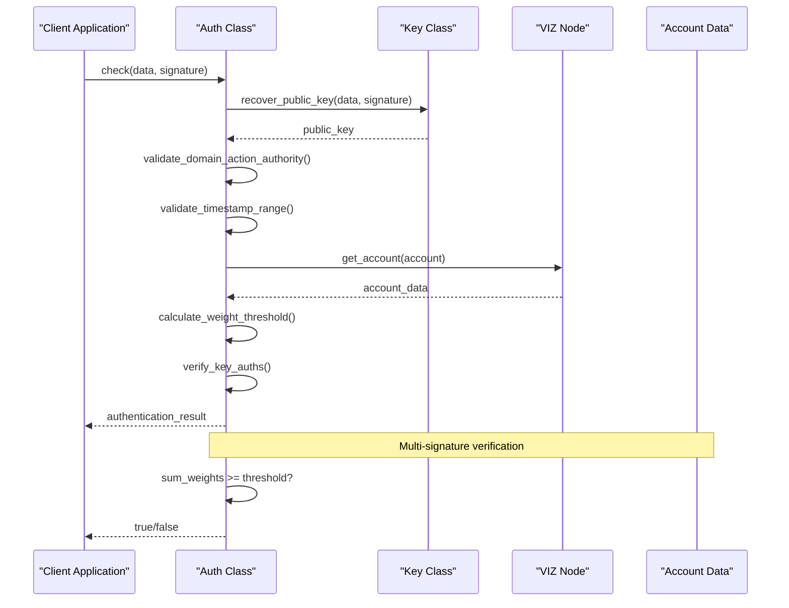
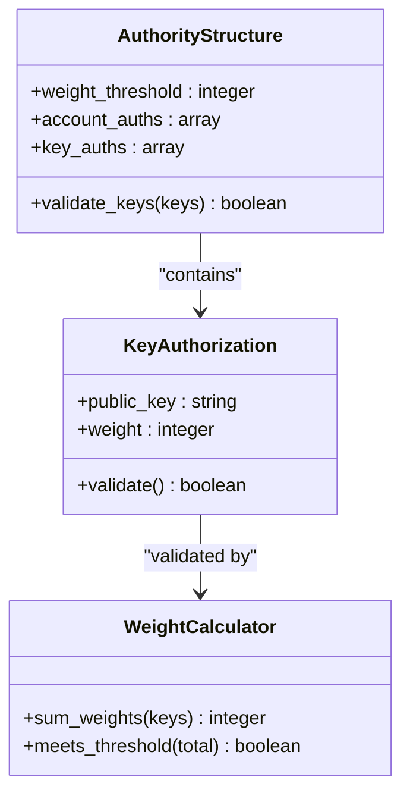
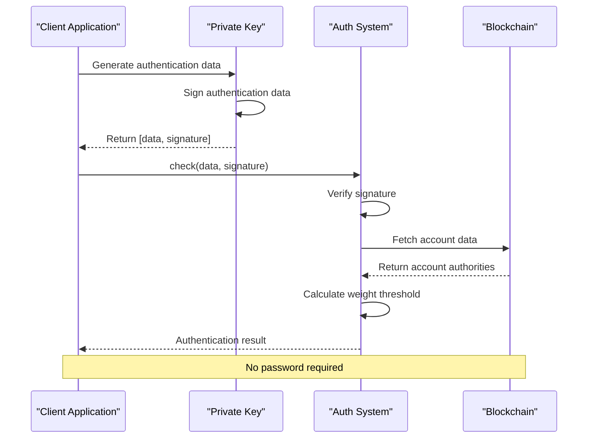
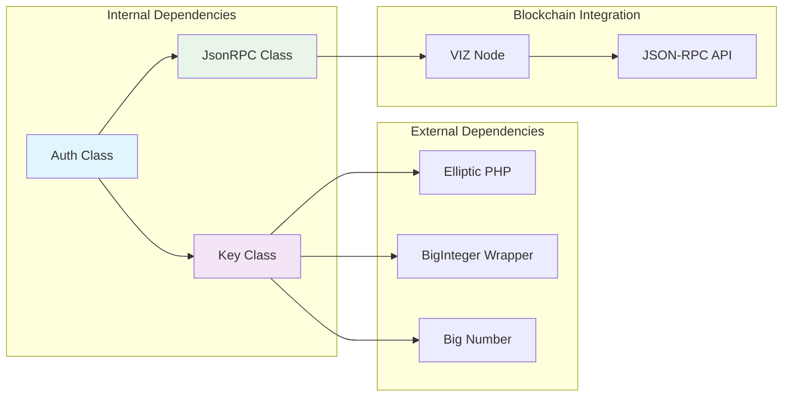

# Auth Class API

<cite>
**Referenced Files in This Document**
- [Auth.php](file://class/VIZ/Auth.php)
- [Key.php](file://class/VIZ/Key.php)
- [JsonRPC.php](file://class/VIZ/JsonRPC.php)
- [README.md](file://README.md)
- [composer.json](file://composer.json)
</cite>

## Table of Contents
1. [Introduction](#introduction)
2. [Project Structure](#project-structure)
3. [Core Components](#core-components)
4. [Architecture Overview](#architecture-overview)
5. [Detailed Component Analysis](#detailed-component-analysis)
6. [Dependency Analysis](#dependency-analysis)
7. [Performance Considerations](#performance-considerations)
8. [Troubleshooting Guide](#troubleshooting-guide)
9. [Conclusion](#conclusion)

## Introduction
The VIZ\Auth class provides passwordless authentication verification for VIZ blockchain applications. It enables domain-specific authentication patterns with time-based validation, authority checking, and multi-signature support through integration with the VIZ\Key class. This documentation covers authentication verification methods, domain-specific authentication patterns, time-based validation mechanisms, authority checking, and multi-signature support with practical examples for passwordless authentication workflows, authority management, and permission validation scenarios.

## Project Structure
The authentication system consists of several interconnected components that work together to provide secure passwordless authentication:

**Diagram sources**
- [Auth.php](file://class/VIZ/Auth.php#L9-L24)
- [Key.php](file://class/VIZ/Key.php#L9-L32)
- [JsonRPC.php](file://class/VIZ/JsonRPC.php#L4-L22)

**Section sources**
- [composer.json](file://composer.json#L19-L28)

## Core Components
The authentication system is built around three primary components that handle different aspects of the authentication process:

### Authentication Verification Engine
The VIZ\Auth class serves as the central verification engine, responsible for validating authentication requests and ensuring their integrity through cryptographic checks and blockchain-based authority verification.

### Cryptographic Key Management
The VIZ\Key class provides comprehensive cryptographic operations including signature generation, verification, public key recovery, and key encoding/decoding capabilities essential for the authentication process.

### Blockchain Communication
The VIZ\JsonRPC class handles communication with VIZ blockchain nodes, enabling real-time account data retrieval and authority validation against on-chain account structures.

**Section sources**
- [Auth.php](file://class/VIZ/Auth.php#L9-L24)
- [Key.php](file://class/VIZ/Key.php#L9-L32)
- [JsonRPC.php](file://class/VIZ/JsonRPC.php#L4-L22)

## Architecture Overview
The authentication architecture follows a multi-layered approach combining cryptographic verification with blockchain-based authority validation:

**Diagram sources**
- [Auth.php](file://class/VIZ/Auth.php#L25-L69)
- [Key.php](file://class/VIZ/Key.php#L323-L338)
- [JsonRPC.php](file://class/VIZ/JsonRPC.php#L311-L353)

## Detailed Component Analysis

### Auth Class API Reference

#### Constructor Parameters
The Auth class constructor accepts four primary parameters for configuring authentication behavior:

| Parameter | Type | Default | Description |
|-----------|------|---------|-------------|
| `node` | string | Required | VIZ node endpoint URL for blockchain communication |
| `domain` | string | Required | Domain identifier for authentication scope |
| `action` | string | `'auth'` | Action type for authentication (default: `'auth'`) |
| `authority` | string | `'regular'` | Authority level to validate (default: `'regular'`) |
| `range` | integer | `60` | Time window in seconds for timestamp validation |

#### Authentication Verification Process

The `check()` method performs comprehensive authentication verification through the following steps:

**Diagram sources**
- [Auth.php](file://class/VIZ/Auth.php#L25-L69)

#### Authentication Data Format
Authentication data follows a colon-separated format: `domain:action:account:authority:unixtime:nonce`

| Field | Description | Example |
|-------|-------------|---------|
| `domain` | Domain identifier | `'example.com'` |
| `action` | Authentication action | `'auth'` |
| `account` | VIZ account name | `'myaccount'` |
| `authority` | Authority level | `'active'` |
| `unixtime` | Unix timestamp | `1700000000` |
| `nonce` | Incremental counter | `1` |

#### Time-Based Validation Mechanisms
The authentication system implements robust time-based validation to prevent replay attacks:

- **Default Time Window**: ±60 seconds from current server time
- **Timezone Handling**: Automatic timezone offset adjustment
- **Server Timezone Fix**: Optional manual timezone correction via `fix_server_timezone` property

#### Authority Checking System
The system supports multiple authority levels with corresponding weight thresholds:

| Authority Level | Purpose | Security Level |
|----------------|---------|----------------|
| `master` | Full account control | Highest |
| `active` | Regular operations | Medium-High |
| `regular` | Standard permissions | Medium |
| `posting` | Content posting | Lower |

#### Multi-Signature Support
Multi-signature authentication requires summing weights from multiple authorized keys:

**Diagram sources**
- [Auth.php](file://class/VIZ/Auth.php#L47-L59)

**Section sources**
- [Auth.php](file://class/VIZ/Auth.php#L17-L24)
- [Auth.php](file://class/VIZ/Auth.php#L25-L69)

### Key Class Integration

#### Signature Generation and Verification
The Key class provides essential cryptographic operations integrated with the Auth class:

| Method | Purpose | Parameters | Returns |
|--------|---------|------------|---------|
| `sign(data)` | Generate digital signature | Data string | Signature string |
| `verify(data, signature)` | Verify signature authenticity | Data + Signature | Boolean |
| `recover_public_key(data, signature)` | Extract public key from signature | Data + Signature | Public key string |
| `auth(account, domain, action, authority)` | Generate authentication data | Account + Scope | `[data, signature]` |

#### Cryptographic Operations
The Key class utilizes secp256k1 elliptic curve cryptography with the following capabilities:

- **Canonical Signature Generation**: Ensures standardized signature format
- **Public Key Recovery**: Extracts public key from signed data
- **Multi-signature Support**: Handles multiple key authorization scenarios
- **Key Encoding**: Supports WIF, compressed/uncompressed public keys

**Section sources**
- [Key.php](file://class/VIZ/Key.php#L302-L352)
- [Key.php](file://class/VIZ/Key.php#L323-L338)

### Practical Authentication Workflows

#### Passwordless Authentication Setup
The authentication system enables passwordless authentication through signature-based verification:

**Diagram sources**
- [README.md](file://README.md#L207-L222)
- [Key.php](file://class/VIZ/Key.php#L339-L352)

#### Authority Management Examples
The system supports flexible authority management with configurable weight thresholds:

| Authority Type | Configuration | Use Case |
|----------------|---------------|----------|
| Single Key | `weight_threshold: 1` | Individual authentication |
| Multi-Signature | `weight_threshold: 2` | Corporate approvals |
| Hierarchical | `weight_threshold: 51` | High-security operations |
| Delegated | `account_auths` | Proxy voting systems |

**Section sources**
- [README.md](file://README.md#L207-L222)

## Dependency Analysis

### Component Relationships
The authentication system exhibits strong cohesion within its core functionality while maintaining loose coupling with external dependencies:

**Diagram sources**
- [Auth.php](file://class/VIZ/Auth.php#L4-L7)
- [Key.php](file://class/VIZ/Key.php#L4-L7)
- [JsonRPC.php](file://class/VIZ/JsonRPC.php#L4-L16)

### Integration Points
The system integrates with multiple external libraries and blockchain services:

- **Elliptic Curve Cryptography**: secp256k1 implementation for cryptographic operations
- **BigInteger Arithmetic**: Arbitrary precision integer calculations
- **VIZ Blockchain API**: Real-time account data retrieval and validation
- **JSON-RPC Protocol**: Standardized blockchain communication

**Section sources**
- [composer.json](file://composer.json#L23-L28)

## Performance Considerations
The authentication system is designed for optimal performance through several key strategies:

### Optimization Strategies
- **Minimal Network Calls**: Efficient blockchain data fetching with caching
- **Optimized Cryptographic Operations**: Canonical signature generation reduces computational overhead
- **Early Validation**: Domain, action, and authority validation occur before expensive network calls
- **Memory Efficiency**: Streamlined data structures minimize memory footprint

### Scalability Factors
- **Concurrent Processing**: Independent authentication requests can be processed simultaneously
- **Resource Management**: Proper cleanup of cryptographic contexts prevents memory leaks
- **Network Optimization**: Connection pooling and efficient request batching

## Troubleshooting Guide

### Common Authentication Issues

#### Authentication Failure Scenarios
| Issue | Cause | Solution |
|-------|-------|----------|
| Invalid Signature | Wrong private key or tampered data | Verify signature with original key |
| Expired Timestamp | Time window exceeded | Adjust server time or increase range |
| Wrong Domain | Domain mismatch in authentication data | Ensure domain matches constructor configuration |
| Insufficient Authority | Sum of weights below threshold | Add authorized keys or adjust weight thresholds |
| Account Not Found | Invalid account name | Verify account exists on blockchain |

#### Debugging Authentication Requests
To debug authentication issues, implement the following diagnostic steps:

1. **Verify Data Format**: Ensure authentication data follows the required format
2. **Check Timestamp Accuracy**: Confirm server time synchronization
3. **Validate Authority Configuration**: Review account authority structures
4. **Test Signature Recovery**: Verify public key extraction from signature

**Section sources**
- [Auth.php](file://class/VIZ/Auth.php#L28-L67)

### Error Handling Mechanisms
The authentication system implements comprehensive error handling:

- **Graceful Degradation**: Failed authentication attempts don't crash the system
- **Detailed Logging**: Comprehensive error reporting for debugging
- **Timeout Management**: Configurable timeouts for blockchain operations
- **Retry Logic**: Automatic retry for transient network failures

## Conclusion
The VIZ\Auth class provides a robust foundation for passwordless authentication in VIZ blockchain applications. Its integration with cryptographic key management and blockchain authority validation ensures secure, scalable authentication solutions. The system's modular design enables flexible deployment across various use cases while maintaining high security standards through multi-signature support and time-based validation mechanisms.

Key strengths of the authentication system include:
- **Comprehensive Security**: Multi-layered validation including cryptographic verification and blockchain authority checks
- **Flexible Authority Management**: Support for various authority levels and weight threshold configurations
- **Scalable Architecture**: Optimized for high-performance authentication processing
- **Developer-Friendly API**: Intuitive interface with comprehensive error handling and debugging capabilities

The system successfully balances security requirements with usability, making it suitable for production deployments requiring reliable passwordless authentication workflows.