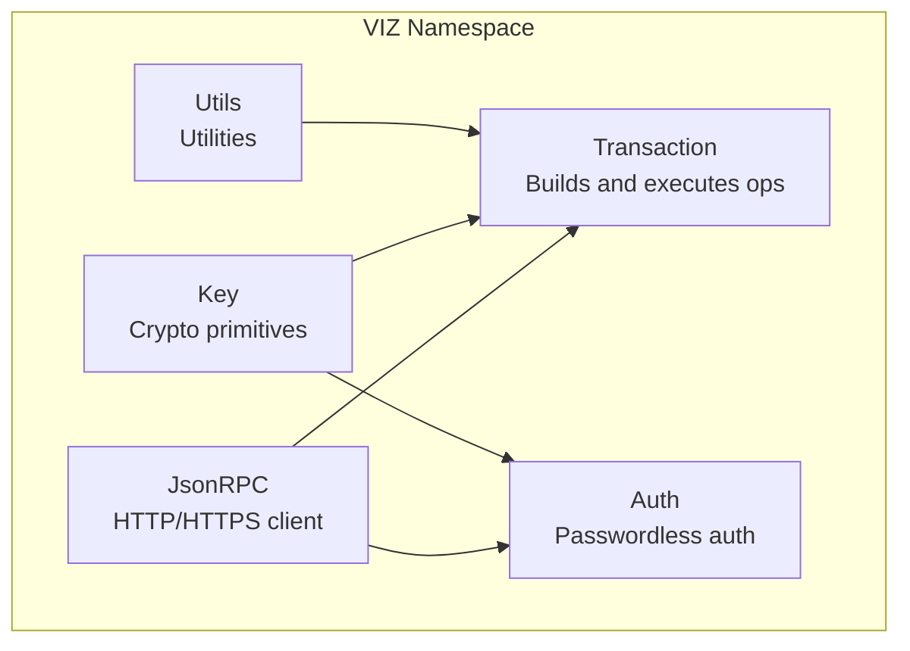
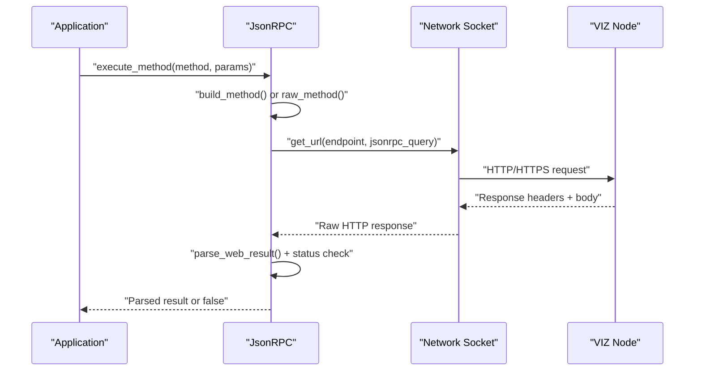
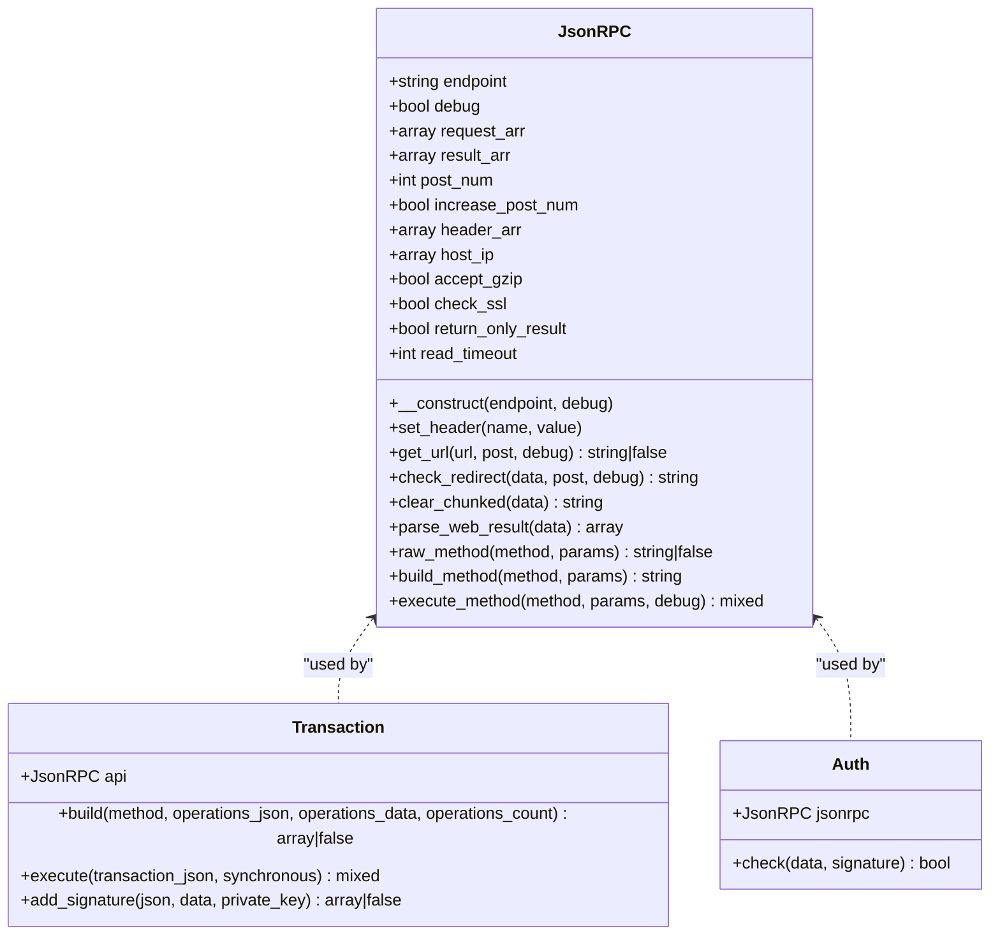
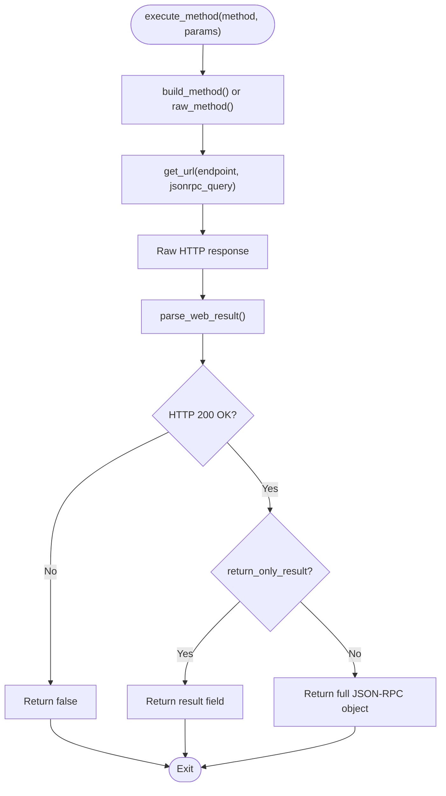
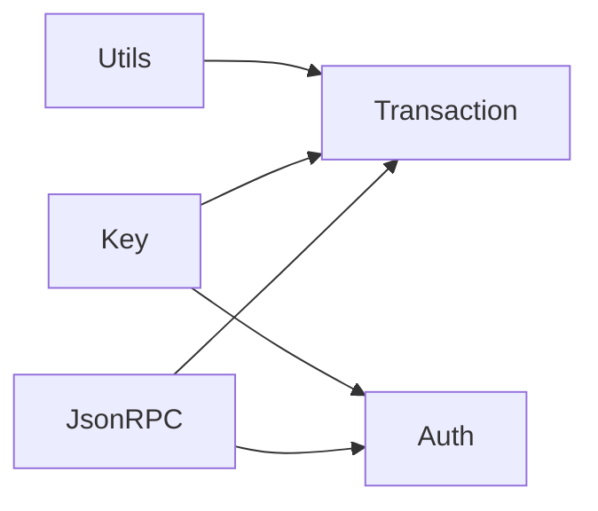

# JsonRPC Class API

<cite>
**Referenced Files in This Document**
- [JsonRPC.php](file://class/VIZ/JsonRPC.php)
- [Auth.php](file://class/VIZ/Auth.php)
- [Transaction.php](file://class/VIZ/Transaction.php)
- [Key.php](file://class/VIZ/Key.php)
- [Utils.php](file://class/VIZ/Utils.php)
- [README.md](file://README.md)
- [composer.json](file://composer.json)
</cite>

## Update Summary
**Changes Made**
- Added documentation for new JSON-RPC API methods: `get_master_history`, `get_block_info`, `get_blocks_with_info`, `get_raw_block`, and `check_authority_signature`
- Updated plugin routing mechanism section to reflect new specialized plugin integrations
- Enhanced API specifications with expanded method coverage
- Updated practical examples to include new method usage patterns

## Table of Contents
1. [Introduction](#introduction)
2. [Project Structure](#project-structure)
3. [Core Components](#core-components)
4. [Architecture Overview](#architecture-overview)
5. [Detailed Component Analysis](#detailed-component-analysis)
6. [Dependency Analysis](#dependency-analysis)
7. [Performance Considerations](#performance-considerations)
8. [Troubleshooting Guide](#troubleshooting-guide)
9. [Conclusion](#conclusion)
10. [Appendices](#appendices)

## Introduction
This document provides comprehensive API documentation for the VIZ\JsonRPC class, focusing on connection management, HTTP/HTTPS and WebSocket support, method execution patterns, plugin routing mechanisms, request/response handling, and error management. It also covers endpoint configuration, SSL/TLS setup, timeout handling, authentication methods, and response parsing. Practical examples demonstrate common RPC operations, error handling strategies, and integration patterns with transaction execution and authentication workflows.

**Updated** Added documentation for new specialized VIZ node plugin methods including master account history tracking, block information retrieval, raw block data access, and authority signature verification.

## Project Structure
The VIZ PHP library organizes blockchain-related functionality into cohesive classes under the VIZ namespace. The JsonRPC class handles low-level JSON-RPC communication with VIZ nodes, while higher-level classes like Transaction and Auth integrate with JsonRPC for building and broadcasting transactions and performing authentication checks.

**Diagram sources**
- [JsonRPC.php](file://class/VIZ/JsonRPC.php#L1-L368)
- [Transaction.php](file://class/VIZ/Transaction.php#L1-L1458)
- [Auth.php](file://class/VIZ/Auth.php#L1-L70)
- [Key.php](file://class/VIZ/Key.php#L1-L353)
- [Utils.php](file://class/VIZ/Utils.php#L1-L413)

**Section sources**
- [composer.json](file://composer.json#L19-L29)
- [README.md](file://README.md#L1-L455)

## Core Components
- JsonRPC: Low-level JSON-RPC client that manages HTTP/HTTPS connections, SSL/TLS verification, timeouts, and request/response parsing. It routes API calls to specific plugins based on a method-to-plugin mapping.
- Transaction: Higher-level class that builds blockchain operations and executes them via JsonRPC, handling Tapos, expiration, signatures, and broadcasting.
- Auth: Performs passwordless authentication by validating signed data against on-chain account authorities using JsonRPC to fetch account details.
- Key: Cryptographic utilities for signing, verification, key derivation, and authentication data generation.
- Utils: Utility functions for Voice protocol posts, encryption, encoding, and other helpers.

**Section sources**
- [JsonRPC.php](file://class/VIZ/JsonRPC.php#L1-L368)
- [Transaction.php](file://class/VIZ/Transaction.php#L1-L1458)
- [Auth.php](file://class/VIZ/Auth.php#L1-L70)
- [Key.php](file://class/VIZ/Key.php#L1-L353)
- [Utils.php](file://class/VIZ/Utils.php#L1-L413)

## Architecture Overview
The JsonRPC class encapsulates network communication and JSON-RPC serialization. It supports HTTP and HTTPS endpoints, with optional WebSocket URLs for secure connections. Requests are constructed according to the VIZ JSON-RPC specification and sent over sockets with configurable timeouts and SSL verification.

**Diagram sources**
- [JsonRPC.php](file://class/VIZ/JsonRPC.php#L325-L368)

## Detailed Component Analysis

### JsonRPC Class API Reference
- Purpose: Provides a lightweight JSON-RPC client for interacting with VIZ nodes over HTTP/HTTPS and WebSocket. Handles request construction, SSL/TLS verification, timeouts, and response parsing.
- Namespace: VIZ
- Methods:
  - __construct(endpoint = '', debug = false): Initializes endpoint, debug flag, and internal arrays.
  - set_header(name, value): Adds or removes HTTP headers for outgoing requests.
  - get_url(url, post = array(), debug = false): Sends HTTP/HTTPS requests and returns raw response or false on failure.
  - check_redirect(data, post = array(), debug = false): Follows Location redirects if present.
  - clear_chunked(data): Removes chunked transfer encoding artifacts.
  - parse_web_result(data): Splits headers and body, handles gzip decoding and chunked transfer.
  - raw_method(method, params): Builds a JSON-RPC call with raw string parameters.
  - build_method(method, params): Builds a JSON-RPC call with structured parameters.
  - execute_method(method, params = array(), debug = false): Executes a method via get_url and parses the result.
- Properties:
  - endpoint: Target node URL (HTTP/HTTPS/WebSocket).
  - debug: Enables request/response logging.
  - request_arr: Stores sent requests when debug is enabled.
  - result_arr: Stores received responses when debug is enabled.
  - post_num: Incrementing ID for JSON-RPC requests.
  - increase_post_num: Controls whether post_num increments automatically.
  - header_arr: Custom HTTP headers.
  - host_ip: Hostname-to-IP cache.
  - accept_gzip: Enables gzip compression acceptance.
  - check_ssl: Enables SSL peer verification.
  - return_only_result: Controls whether to return only the result field or the full JSON-RPC response.
  - read_timeout: Socket read timeout in seconds.

**Updated** Enhanced plugin routing mechanism to include new specialized VIZ node plugins for master account tracking, block information retrieval, raw block access, and authority signature verification.

Plugin Routing Mechanism
- The class maintains a mapping from method names to plugin namespaces. When building a JSON-RPC call, it selects the appropriate plugin based on this mapping.
- **New Specialized Plugins**:
  - `database_api`: Now includes `get_master_history` for tracking master account changes
  - `block_info`: New plugin for block metadata and information retrieval
  - `raw_block`: New plugin for accessing raw block data
  - `auth_util`: New plugin for authority signature verification

Endpoint Configuration
- HTTP/HTTPS: Use http:// or https:// URLs. The class detects scheme and sets port accordingly (80 for HTTP, 443 for HTTPS).
- WebSocket: The class recognizes wss:// URLs and treats them similarly to HTTPS, using SSL/TLS contexts.

SSL/TLS Setup
- SSL verification is controlled by the check_ssl property. When disabled, peer verification and self-signed certificates are allowed.
- stream_context_set_option is used to configure peer_name and verification options.

Timeout Handling
- Socket connection and read timeouts are configured via stream_socket_client and stream_set_timeout. The read timeout is governed by the read_timeout property.

Request/Response Handling
- Requests are built as HTTP/1.1 messages with Content-Length and optional gzip encoding.
- Responses are parsed to separate headers and body, with automatic gzip decompression and chunked transfer cleanup.
- Status code validation ensures only "200 OK" responses are considered successful.

Error Management
- Returns false on socket errors, timeouts, or non-200 responses.
- In extended mode (return_only_result = false), returns the full JSON-RPC response including error details.

Integration Patterns
- Transaction: Uses JsonRPC to fetch dynamic global properties, build Tapos, and broadcast transactions.
- Auth: Uses JsonRPC to fetch account details and verify authority weights.

**Section sources**
- [JsonRPC.php](file://class/VIZ/JsonRPC.php#L1-L368)

### Connection Management
- Hostname Resolution: Hostnames are resolved once and cached to reduce DNS overhead.
- Port Detection: Explicit ports in URLs override defaults; otherwise, 80 for HTTP and 443 for HTTPS/WSS.
- SSL Context: Stream context is created with peer_name and verification options based on check_ssl.

**Section sources**
- [JsonRPC.php](file://class/VIZ/JsonRPC.php#L187-L209)

### HTTP/HTTPS and WebSocket Support
- HTTP: Scheme detection sets port 80 and sends plain TCP requests.
- HTTPS: Scheme detection sets port 443 and wraps the socket with SSL/TLS.
- WebSocket: wss:// is treated like HTTPS with SSL/TLS.

**Section sources**
- [JsonRPC.php](file://class/VIZ/JsonRPC.php#L189-L201)

### Method Execution Patterns
- Raw vs Structured Parameters:
  - raw_method: For methods expecting a single raw string parameter.
  - build_method: For methods with structured parameters (arrays, objects, booleans, integers).
- Plugin Routing:
  - The api mapping associates each method with a plugin namespace. Calls are routed accordingly during JSON-RPC construction.

**Section sources**
- [JsonRPC.php](file://class/VIZ/JsonRPC.php#L272-L324)

### Request/Response Handling
- Header Parsing: Extracts headers and body, handles Transfer-Encoding: chunked and Content-Encoding: gzip.
- Status Validation: Ensures HTTP 200 OK before considering the response valid.
- Result Extraction: In simple mode, returns only the result field; in extended mode, returns the full JSON-RPC object.

**Section sources**
- [JsonRPC.php](file://class/VIZ/JsonRPC.php#L248-L271)
- [JsonRPC.php](file://class/VIZ/JsonRPC.php#L325-L368)

### Error Management
- Socket Errors: Returns false when stream_socket_client fails.
- Timeouts: Returns false if read timeout occurs before receiving a complete response.
- Non-200 Responses: Returns false when the HTTP status is not 200 OK.
- Missing Result: Returns false if the result field is absent in the response.

**Section sources**
- [JsonRPC.php](file://class/VIZ/JsonRPC.php#L210-L231)
- [JsonRPC.php](file://class/VIZ/JsonRPC.php#L346-L367)

### Authentication Integration
- Passwordless Authentication:
  - Key generates signed authentication data.
  - Auth validates the signature against on-chain account authorities using JsonRPC to fetch account details and verify weights.

**Section sources**
- [Auth.php](file://class/VIZ/Auth.php#L25-L69)
- [Key.php](file://class/VIZ/Key.php#L339-L352)

### Transaction Execution Integration
- Transaction builds operations and uses JsonRPC to:
  - Fetch dynamic global properties for Tapos.
  - Build Tapos references from last irreversible block.
  - Sign transactions and broadcast via network_broadcast_api.

**Section sources**
- [Transaction.php](file://class/VIZ/Transaction.php#L53-L59)
- [Transaction.php](file://class/VIZ/Transaction.php#L61-L157)

## Architecture Overview

**Diagram sources**
- [JsonRPC.php](file://class/VIZ/JsonRPC.php#L1-L368)
- [Transaction.php](file://class/VIZ/Transaction.php#L1-L1458)
- [Auth.php](file://class/VIZ/Auth.php#L1-L70)

## Detailed Component Analysis

### JsonRPC Class Implementation Details
- Constructor initializes endpoint and debug flags, and resets internal arrays.
- Header management allows adding/removing headers for requests.
- URL handling constructs HTTP/1.1 requests, resolves hostnames, and applies SSL/TLS when needed.
- Response parsing handles gzip and chunked transfer encoding, and validates HTTP status.
- Method building supports both raw and structured parameters, with automatic incrementing IDs.

**Section sources**
- [JsonRPC.php](file://class/VIZ/JsonRPC.php#L17-L22)
- [JsonRPC.php](file://class/VIZ/JsonRPC.php#L23-L28)
- [JsonRPC.php](file://class/VIZ/JsonRPC.php#L136-L236)
- [JsonRPC.php](file://class/VIZ/JsonRPC.php#L248-L271)
- [JsonRPC.php](file://class/VIZ/JsonRPC.php#L272-L324)
- [JsonRPC.php](file://class/VIZ/JsonRPC.php#L325-L368)

### Plugin Routing Mechanism
- The api mapping defines which plugin namespace each method belongs to. During JSON-RPC construction, the class selects the appropriate plugin based on this mapping.
- **Enhanced Method Coverage**:
  - Database API: Comprehensive account and blockchain data access
  - Block Info API: New specialized methods for block metadata
  - Raw Block API: Direct block data access
  - Auth Util API: Authority signature verification

**Section sources**
- [JsonRPC.php](file://class/VIZ/JsonRPC.php#L29-L135)

### Request/Response Flow

**Diagram sources**
- [JsonRPC.php](file://class/VIZ/JsonRPC.php#L325-L368)

## Dependency Analysis
- JsonRPC depends on PHP streams for networking and basic JSON decoding.
- Transaction depends on JsonRPC for node interactions and on Key for cryptographic operations.
- Auth depends on JsonRPC for account lookups and on Key for signature recovery and verification.
- Utils provides auxiliary functions used by higher-level components.

**Diagram sources**
- [JsonRPC.php](file://class/VIZ/JsonRPC.php#L1-L368)
- [Transaction.php](file://class/VIZ/Transaction.php#L1-L1458)
- [Auth.php](file://class/VIZ/Auth.php#L1-L70)
- [Key.php](file://class/VIZ/Key.php#L1-L353)
- [Utils.php](file://class/VIZ/Utils.php#L1-L413)

**Section sources**
- [composer.json](file://composer.json#L19-L29)

## Performance Considerations
- Hostname caching reduces DNS lookups for repeated requests to the same endpoint.
- gzip acceptance can reduce bandwidth usage for large responses.
- Chunked transfer handling avoids memory issues with large payloads.
- Read timeout prevents indefinite blocking on slow or unresponsive nodes.

## Troubleshooting Guide
Common Issues and Resolutions:
- Socket Timeout: Increase read_timeout or switch to a closer node.
- SSL Verification Failure: Disable check_ssl only for testing; enable it in production.
- Non-200 Response: Verify endpoint correctness and node availability.
- Missing Result Field: Enable return_only_result=false to inspect error details.
- Redirects: The class follows Location headers automatically.

**Section sources**
- [JsonRPC.php](file://class/VIZ/JsonRPC.php#L210-L231)
- [JsonRPC.php](file://class/VIZ/JsonRPC.php#L237-L247)
- [JsonRPC.php](file://class/VIZ/JsonRPC.php#L346-L367)

## Conclusion
The VIZ\JsonRPC class offers a robust foundation for interacting with VIZ nodes, supporting HTTP/HTTPS and WebSocket endpoints, SSL/TLS verification, and flexible request/response handling. Its integration with Transaction and Auth enables end-to-end workflows for building, signing, and broadcasting transactions and for passwordless authentication. Proper configuration of endpoints, SSL settings, and timeouts ensures reliable operation across diverse environments.

**Updated** The recent additions of specialized plugin methods significantly expand the library's capabilities for advanced blockchain data access, enabling sophisticated applications for master account monitoring, block analysis, and authority verification workflows.

## Appendices

### Practical Examples
- Basic API Call: Initialize JsonRPC with an endpoint and call get_dynamic_global_properties.
- Extended Mode: Switch return_only_result to false to receive full JSON-RPC responses including errors.
- Authentication Workflow: Generate signed authentication data with Key and validate it with Auth using JsonRPC to fetch account details.
- **New Specialized Methods**:
  - Master History Tracking: Use `get_master_history` to monitor master account changes
  - Block Information Retrieval: Use `get_block_info` and `get_blocks_with_info` for block metadata
  - Raw Block Access: Use `get_raw_block` for direct block data extraction
  - Authority Verification: Use `check_authority_signature` for signature validation

**Section sources**
- [README.md](file://README.md#L69-L95)
- [README.md](file://README.md#L207-L222)

### API Specifications
- Endpoint Configuration:
  - HTTP: http://node.example/
  - HTTPS: https://node.example/
  - WebSocket: wss://node.example/
- SSL/TLS:
  - check_ssl: true (default) enables peer verification; false disables verification.
  - accept_gzip: true enables gzip acceptance.
- Timeout:
  - read_timeout: integer seconds for socket read timeout.
- Authentication:
  - Domain, action, authority, and time-based nonce are included in signed data.
  - On-chain authority thresholds are verified via get_account.
- **New Specialized Methods**:
  - `get_master_history`: Database API method for master account history tracking
  - `get_block_info`: Block info API method for individual block metadata
  - `get_blocks_with_info`: Block info API method for batch block metadata retrieval
  - `get_raw_block`: Raw block API method for direct block data access
  - `check_authority_signature`: Auth util API method for signature verification

**Section sources**
- [JsonRPC.php](file://class/VIZ/JsonRPC.php#L14-L16)
- [JsonRPC.php](file://class/VIZ/JsonRPC.php#L189-L209)
- [Auth.php](file://class/VIZ/Auth.php#L25-L69)
- [Key.php](file://class/VIZ/Key.php#L339-L352)