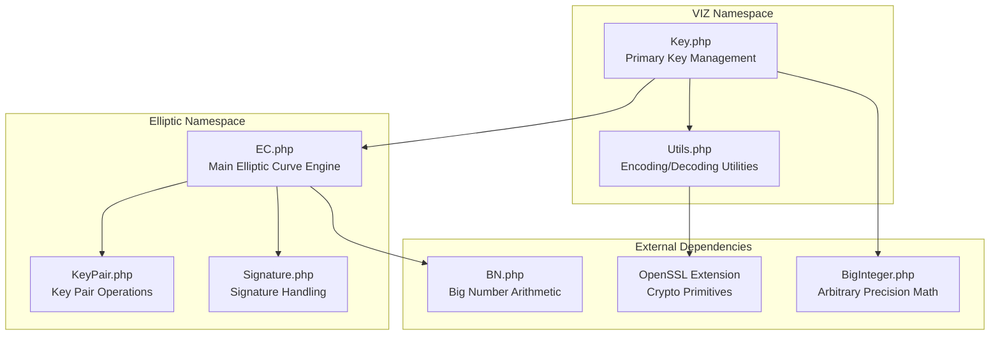
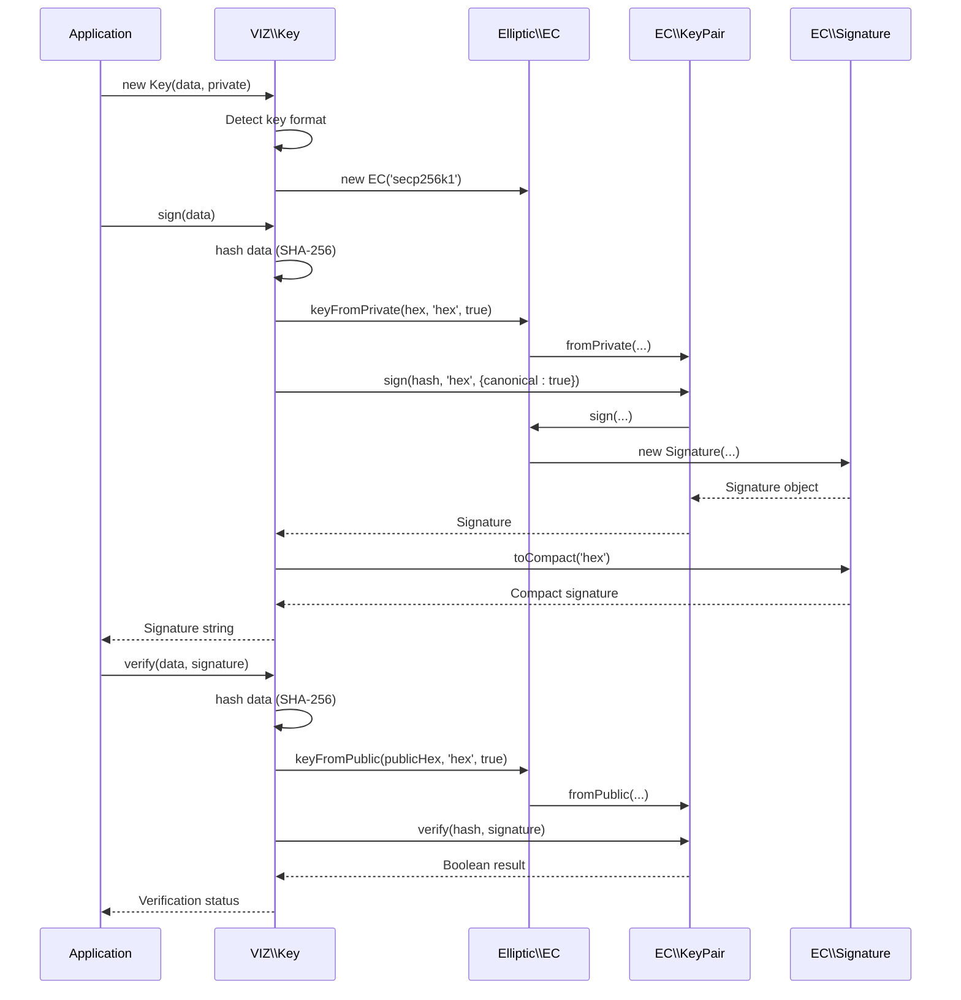
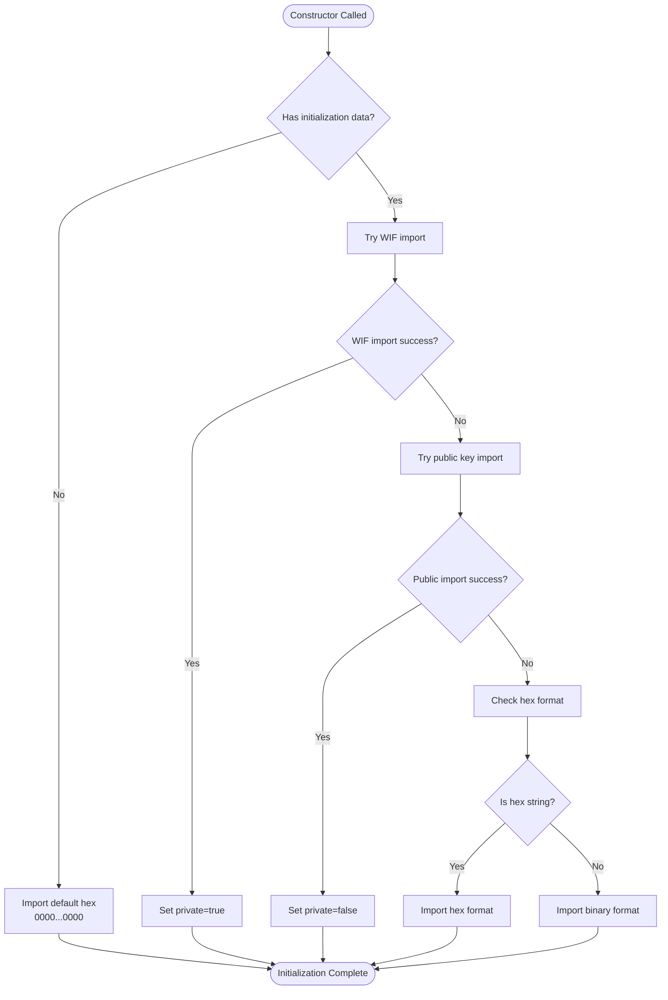
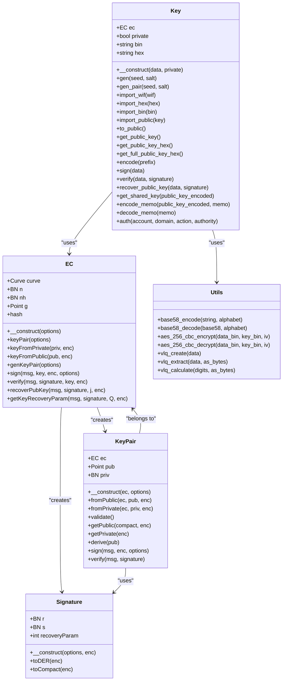

# Key Class API

<cite>
**Referenced Files in This Document**
- [Key.php](file://class/VIZ/Key.php)
- [EC.php](file://class/Elliptic/EC.php)
- [KeyPair.php](file://class/Elliptic/EC/KeyPair.php)
- [Signature.php](file://class/Elliptic/EC/Signature.php)
- [Utils.php](file://class/VIZ/Utils.php)
- [TestKeys.php](file://tests/TestKeys.php)
- [README.md](file://README.md)
</cite>

## Table of Contents
1. [Introduction](#introduction)
2. [Project Structure](#project-structure)
3. [Core Components](#core-components)
4. [Architecture Overview](#architecture-overview)
5. [Detailed Component Analysis](#detailed-component-analysis)
6. [Dependency Analysis](#dependency-analysis)
7. [Performance Considerations](#performance-considerations)
8. [Troubleshooting Guide](#troubleshooting-guide)
9. [Conclusion](#conclusion)

## Introduction
This document provides comprehensive API documentation for the VIZ\Key class, which implements elliptic curve cryptography for the VIZ blockchain. The Key class serves as a unified interface for key generation, import/export, cryptographic operations, and memo encryption/decryption. It integrates tightly with the Elliptic\EC class for core cryptographic operations and uses VIZ\Utils for encoding/decoding utilities.

The VIZ\Key class supports multiple key formats including WIF (Wallet Import Format), hexadecimal, binary, and compressed/uncompressed public key representations. It provides methods for generating new key pairs, importing existing keys from various formats, performing digital signatures, verifying signatures, recovering public keys from signatures, and implementing secure memo encryption compatible with the VIZ JavaScript library.

## Project Structure
The VIZ key system is organized into several interconnected components:

**Diagram sources**
- [Key.php](file://class/VIZ/Key.php#L1-L353)
- [EC.php](file://class/Elliptic/EC.php#L1-L272)
- [Utils.php](file://class/VIZ/Utils.php#L1-L413)

**Section sources**
- [Key.php](file://class/VIZ/Key.php#L1-L353)
- [EC.php](file://class/Elliptic/EC.php#L1-L272)
- [Utils.php](file://class/VIZ/Utils.php#L1-L413)

## Core Components
The VIZ\Key class consists of several core components that handle different aspects of key management and cryptographic operations:

### Constructor and Initialization
The Key class constructor accepts initialization data and automatically detects the key format. It creates an EC secp256k1 curve instance and sets up the key state accordingly.

### Key Import/Export System
The class provides comprehensive import/export capabilities supporting:
- WIF format for private keys
- Hexadecimal format for both private and public keys
- Binary format for raw key data
- Public key encoding with compressed/uncompressed variants

### Cryptographic Operations
Built-in support for:
- ECDSA signatures using secp256k1 curve
- Signature verification
- Public key recovery from signatures
- ECDH shared key derivation

### Memo Encryption/Decryption
Advanced secure messaging capabilities with compatibility to VIZ JavaScript library:
- AES-256-CBC encryption
- Variable-length quantity encoding
- Base58 encoding for transport

**Section sources**
- [Key.php](file://class/VIZ/Key.php#L14-L32)
- [Key.php](file://class/VIZ/Key.php#L211-L301)

## Architecture Overview
The VIZ\Key class follows a layered architecture pattern where cryptographic operations are delegated to the Elliptic\EC class:

**Diagram sources**
- [Key.php](file://class/VIZ/Key.php#L302-L322)
- [EC.php](file://class/Elliptic/EC.php#L89-L177)
- [KeyPair.php](file://class/Elliptic/EC/KeyPair.php#L122-L128)

## Detailed Component Analysis

### Constructor and Key Detection
The Key constructor provides flexible initialization from multiple formats:

**Diagram sources**
- [Key.php](file://class/VIZ/Key.php#L14-L32)

**Section sources**
- [Key.php](file://class/VIZ/Key.php#L14-L32)

### Key Generation Methods

#### gen() Method
Generates a new key pair from a seed with optional salt:

**Method Signature**: `gen($seed = '', $salt = true)`
**Parameters**:
- `$seed`: String seed for key generation
- `$salt`: Boolean or String salt value (auto-generated if true)

**Returns**: Array containing [seed, WIF private key, encoded public key, public key object]

**Behavior**:
1. Generates salt if not provided
2. Combines seed and salt
3. Hashes with SHA-256 to create private key
4. Imports hex key and marks as private
5. Encodes to WIF format
6. Generates corresponding public key
7. Returns comprehensive key information

**Section sources**
- [Key.php](file://class/VIZ/Key.php#L185-L197)

#### gen_pair() Method
Creates a new key pair with configurable salt placement:

**Method Signature**: `gen_pair($seed = '', $salt = '')`
**Parameters**:
- `$seed`: String seed for key generation
- `$salt`: String salt value (auto-generated if empty)

**Returns**: Array containing [WIF private key, encoded public key, public key object]

**Behavior**:
1. Generates salt if empty
2. Combines salt and seed in specific order
3. Hashes with SHA-256 to create private key
4. Imports hex key and marks as private
5. Encodes to WIF format
6. Generates and returns public key information

**Section sources**
- [Key.php](file://class/VIZ/Key.php#L198-L210)

### Import/Export Methods

#### import_wif() Method
Imports a private key from Wallet Import Format:

**Method Signature**: `import_wif($wif)`
**Parameters**:
- `$wif`: String WIF-encoded private key

**Returns**: Boolean indicating success/failure

**Validation Process**:
1. Decodes base58 string
2. Extracts checksum and clear data
3. Validates SHA-256 double hash checksum
4. Verifies version byte (0x80)
5. Extracts private key data
6. Sets internal state as private key

**Section sources**
- [Key.php](file://class/VIZ/Key.php#L219-L242)

#### import_hex() Method
Imports a key from hexadecimal format:

**Method Signature**: `import_hex($hex)`
**Parameters**:
- `$hex`: String hexadecimal representation

**Returns**: Void

**Behavior**:
1. Converts hex to binary
2. Stores both binary and hex representations
3. No format validation performed

**Section sources**
- [Key.php](file://class/VIZ/Key.php#L211-L214)

#### import_bin() Method
Imports a key from binary format:

**Method Signature**: `import_bin($bin)`
**Parameters**:
- `$bin`: Binary string key data

**Returns**: Void

**Behavior**:
1. Stores binary data
2. Converts to hexadecimal
3. Updates both representations

**Section sources**
- [Key.php](file://class/VIZ/Key.php#L215-L218)

#### import_public() Method
Imports a public key from encoded format:

**Method Signature**: `import_public($key)`
**Parameters**:
- `$key`: String public key (without prefix)

**Returns**: Boolean indicating success/failure

**Validation Process**:
1. Removes 3-character prefix
2. Decodes base58 string
3. Validates RIPEMD-160 checksum against SHA-256
4. Extracts public key data
5. Sets internal state as public key

**Section sources**
- [Key.php](file://class/VIZ/Key.php#L243-L260)

#### encode() Method
Encodes keys to appropriate format:

**Method Signature**: `encode($prefix = 'VIZ')`
**Parameters**:
- `$prefix`: String prefix for public keys (default: 'VIZ')

**Returns**: String encoded key

**Behavior**:
- Private keys: WIF format with version byte and checksum
- Public keys: Base58 encoded with RIPEMD-160 checksum

**Section sources**
- [Key.php](file://class/VIZ/Key.php#L287-L301)

### Cryptographic Operations

#### sign() Method
Creates ECDSA signature using deterministic nonce generation:

**Method Signature**: `sign($data)`
**Parameters**:
- `$data`: String data to sign

**Returns**: String compact signature or boolean false

**Process**:
1. Hashes data with SHA-256
2. Creates EC key pair from private key
3. Generates signature with canonical form
4. Returns compact signature format

**Section sources**
- [Key.php](file://class/VIZ/Key.php#L302-L311)

#### verify() Method
Verifies ECDSA signatures:

**Method Signature**: `verify($data, $signature)`
**Parameters**:
- `$data`: String signed data
- `$signature`: String signature to verify

**Returns**: Boolean indicating signature validity

**Process**:
1. Hashes data with SHA-256
2. Creates EC public key from current key (private/public)
3. Uses Elliptic\EC verify method
4. Returns verification result

**Section sources**
- [Key.php](file://class/VIZ/Key.php#L312-L322)

#### recover_public_key() Method
Recovers public key from signature and message:

**Method Signature**: `recover_public_key($data, $signature)`
**Parameters**:
- `$data`: String original signed data
- `$signature`: String signature

**Returns**: String encoded public key or boolean false

**Process**:
1. Extracts recovery parameter from signature
2. Uses Elliptic\EC recoverPubKey method
3. Converts recovered point to public key
4. Encodes and returns public key

**Section sources**
- [Key.php](file://class/VIZ/Key.php#L323-L338)

### Key Manipulation Methods

#### to_public() Method
Converts private key to public key:

**Method Signature**: `to_public()`
**Parameters**: None

**Returns**: Boolean indicating success/failure

**Process**:
1. Creates EC key pair from private key
2. Extracts public key coordinates
3. Updates internal state to public key
4. Marks as uncompressed public key

**Section sources**
- [Key.php](file://class/VIZ/Key.php#L261-L267)

#### get_public_key() Method
Creates a copy of current key as public key:

**Method Signature**: `get_public_key()`
**Parameters**: None

**Returns**: New Key object representing public key

**Process**:
1. Creates copy of current key
2. Extracts public key from private key
3. Returns new Key object with public key state

**Section sources**
- [Key.php](file://class/VIZ/Key.php#L268-L276)

#### get_public_key_hex() Method
Returns compressed public key in hex format:

**Method Signature**: `get_public_key_hex()`
**Parameters**: None

**Returns**: String hexadecimal public key

**Process**:
1. Creates EC key pair from private key
2. Returns compressed public key (33 bytes)

**Section sources**
- [Key.php](file://class/VIZ/Key.php#L277-L281)

#### get_full_public_key_hex() Method
Returns uncompressed public key in hex format:

**Method Signature**: `get_full_public_key_hex()`
**Parameters**: None

**Returns**: String hexadecimal public key

**Process**:
1. Creates EC key pair from private key
2. Returns uncompressed public key (65 bytes)

**Section sources**
- [Key.php](file://class/VIZ/Key.php#L282-L286)

### Shared Key Derivation

#### get_shared_key() Method
Derives shared secret using ECDH:

**Method Signature**: `get_shared_key($public_key_encoded)`
**Parameters**:
- `$public_key_encoded`: String encoded public key

**Returns**: String shared key hash or boolean false

**Process**:
1. Validates private key state
2. Creates public key object from encoded input
3. Uses Elliptic\EC keyFromPublic/keyFromPrivate
4. Performs ECDH derivation
5. Hashes result with SHA-512

**Section sources**
- [Key.php](file://class/VIZ/Key.php#L33-L44)

### Memo Encryption/Decryption

#### encode_memo() Method
Encrypts memo data with shared key:

**Method Signature**: `encode_memo($public_key_encoded, $memo)`
**Parameters**:
- `$public_key_encoded`: String encoded public key
- `$memo`: String memo text to encrypt

**Returns**: String base58-encoded encrypted memo or boolean false

**Process**:
1. Validates private key state
2. Derives shared key with recipient public key
3. Extracts sender and recipient public keys
4. Generates random nonce and checksum
5. Creates encryption key from shared key + nonce
6. Encrypts memo with AES-256-CBC
7. Encodes complete structure with base58

**Section sources**
- [Key.php](file://class/VIZ/Key.php#L45-L86)

#### decode_memo() Method
Decrypts memo data:

**Method Signature**: `decode_memo($memo)`
**Parameters**:
- `$memo`: String base58-encoded encrypted memo

**Returns**: String decrypted memo or boolean false

**Process**:
1. Decodes base58 string
2. Extracts sender and recipient public keys
3. Determines current public key ownership
4. Derives shared key based on ownership
5. Extracts nonce and checksum
6. Validates checksum
7. Decrypts memo with AES-256-CBC
8. Removes variable-length quantity prefix

**Section sources**
- [Key.php](file://class/VIZ/Key.php#L87-L176)

### Authentication Method

#### auth() Method
Generates authentication data and signature:

**Method Signature**: `auth($account, $domain, $action = 'auth', $authority = 'regular')`
**Parameters**:
- `$account`: String account name
- `$domain`: String domain for authentication
- `$action`: String action type (default: 'auth')
- `$authority`: String authority level (default: 'regular')

**Returns**: Array containing [data string, signature string]

**Process**:
1. Generates timestamp and nonce
2. Constructs authentication data string
3. Attempts to sign with retry mechanism
4. Returns data and signature pair

**Section sources**
- [Key.php](file://class/VIZ/Key.php#L339-L352)

## Dependency Analysis

**Diagram sources**
- [Key.php](file://class/VIZ/Key.php#L9-L353)
- [EC.php](file://class/Elliptic/EC.php#L9-L272)
- [KeyPair.php](file://class/Elliptic/EC/KeyPair.php#L6-L138)
- [Signature.php](file://class/Elliptic/EC/Signature.php#L7-L208)
- [Utils.php](file://class/VIZ/Utils.php#L7-L413)

**Section sources**
- [Key.php](file://class/VIZ/Key.php#L6-L7)
- [EC.php](file://class/Elliptic/EC.php#L4-L7)

## Performance Considerations
The VIZ\Key class implements several performance optimizations:

### Memory Management
- Uses binary storage for efficient key operations
- Minimizes string conversions during cryptographic operations
- Reuses EC key pair instances when possible

### Cryptographic Efficiency
- Implements canonical signature format for optimal verification
- Uses compressed public keys by default to reduce bandwidth
- Leverages deterministic nonce generation for reproducible signatures

### Error Handling
- Early validation prevents unnecessary computation
- Graceful failure modes with boolean returns
- Exception handling for signature recovery operations

## Troubleshooting Guide

### Common Issues and Solutions

#### Invalid WIF Format
**Symptoms**: `import_wif()` returns false
**Causes**: 
- Invalid base58 characters
- Incorrect checksum validation
- Wrong version byte

**Solution**: Verify WIF string format and ensure proper base58 encoding

#### Signature Verification Failures
**Symptoms**: `verify()` returns false
**Causes**:
- Data mismatch between signing and verification
- Corrupted signature data
- Wrong public key used for verification

**Solution**: Ensure identical data and correct public key selection

#### Memo Decryption Errors
**Symptoms**: `decode_memo()` returns false
**Causes**:
- Wrong recipient private key
- Tampered encrypted data
- Invalid memo structure

**Solution**: Verify recipient key ownership and data integrity

#### Authentication Failures
**Symptoms**: `auth()` method requires retries
**Causes**:
- Non-canonical signature generation
- Timing issues with nonce generation

**Solution**: Allow retry mechanism to handle non-canonical signatures

**Section sources**
- [Key.php](file://class/VIZ/Key.php#L219-L242)
- [Key.php](file://class/VIZ/Key.php#L302-L322)
- [Key.php](file://class/VIZ/Key.php#L87-L176)

## Conclusion
The VIZ\Key class provides a comprehensive and secure interface for elliptic curve cryptography operations in the VIZ blockchain ecosystem. Its design emphasizes flexibility through multiple key formats, robust security through standardized cryptographic protocols, and practical usability through convenient import/export methods and memo encryption capabilities.

The class successfully integrates with the Elliptic\EC library to provide industry-standard cryptographic operations while maintaining compatibility with VIZ JavaScript libraries through shared key derivation and memo encryption standards. The implementation demonstrates careful consideration of performance, security, and developer experience through its comprehensive API design and extensive error handling mechanisms.