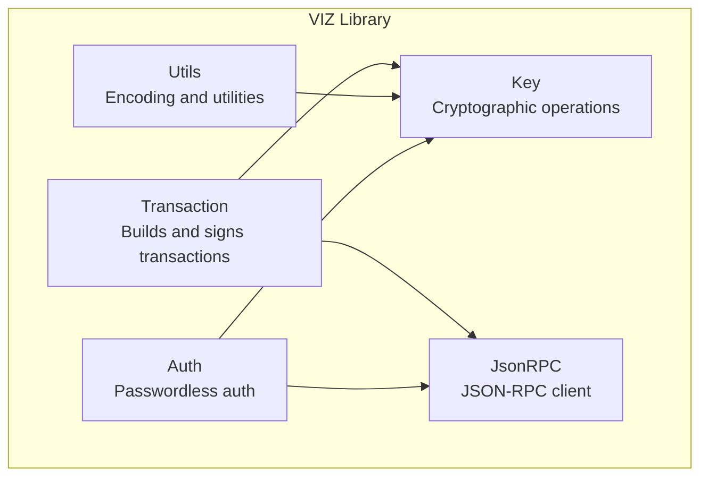
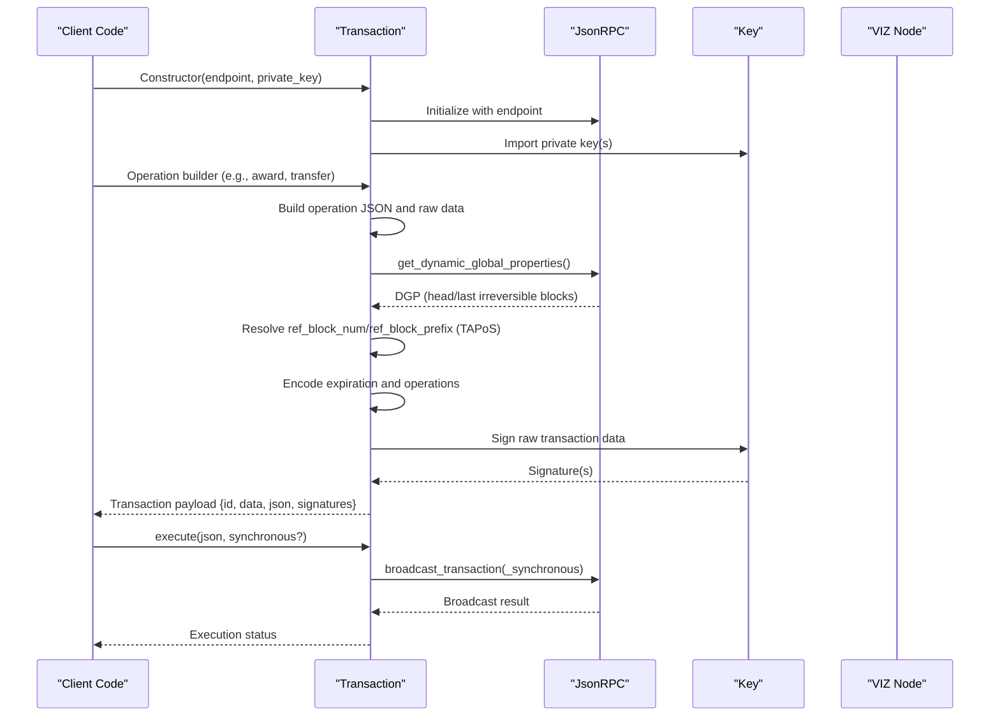
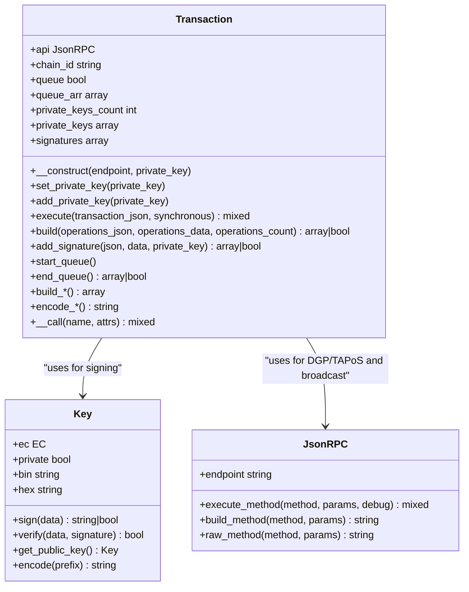

# Transaction Class API

<cite>
**Referenced Files in This Document**
- [Transaction.php](file://class/VIZ/Transaction.php)
- [Key.php](file://class/VIZ/Key.php)
- [JsonRPC.php](file://class/VIZ/JsonRPC.php)
- [Utils.php](file://class/VIZ/Utils.php)
- [Auth.php](file://class/VIZ/Auth.php)
- [README.md](file://README.md)
</cite>

## Table of Contents
1. [Introduction](#introduction)
2. [Project Structure](#project-structure)
3. [Core Components](#core-components)
4. [Architecture Overview](#architecture-overview)
5. [Detailed Component Analysis](#detailed-component-analysis)
6. [Dependency Analysis](#dependency-analysis)
7. [Performance Considerations](#performance-considerations)
8. [Troubleshooting Guide](#troubleshooting-guide)
9. [Conclusion](#conclusion)
10. [Appendices](#appendices)

## Introduction
This document provides comprehensive API documentation for the VIZ Transaction class, focusing on constructing blockchain transactions, adding operations, handling TAPoS (Transaction as Proof-of-Stake), managing expiration, supporting multi-signatures, and executing transactions via JSON-RPC. It covers constructor parameters, transaction building methods, operation builders for transfers, account creation, proposals, and custom operations, along with queue-based processing, raw data encoding, and integration patterns with Key and JsonRPC classes.

## Project Structure
The VIZ PHP library organizes core functionality into focused classes:
- Transaction: Builds and signs transactions, manages TAPoS, expiration, and multi-signatures
- Key: Handles cryptographic operations (signing, verification, key derivation)
- JsonRPC: Provides native HTTP/HTTPS JSON-RPC client for interacting with VIZ nodes
- Utils: Utility functions for encoding, encryption, and Voice protocol helpers
- Auth: Passwordless authentication verification against blockchain authorities

**Diagram sources**
- [Transaction.php](file://class/VIZ/Transaction.php#L10-L24)
- [Key.php](file://class/VIZ/Key.php#L9-L32)
- [JsonRPC.php](file://class/VIZ/JsonRPC.php#L4-L22)
- [Utils.php](file://class/VIZ/Utils.php#L7-L10)
- [Auth.php](file://class/VIZ/Auth.php#L9-L24)

**Section sources**
- [Transaction.php](file://class/VIZ/Transaction.php#L1-L24)
- [Key.php](file://class/VIZ/Key.php#L1-L32)
- [JsonRPC.php](file://class/VIZ/JsonRPC.php#L1-L22)
- [Utils.php](file://class/VIZ/Utils.php#L1-L10)
- [Auth.php](file://class/VIZ/Auth.php#L1-L24)

## Core Components
- Transaction class: Central orchestrator for building, encoding, signing, and executing transactions
- Key class: Manages private/public keys, signatures, and shared key derivation
- JsonRPC class: Encapsulates network communication with VIZ nodes
- Utils class: Provides encoding utilities and Voice protocol helpers
- Auth class: Verifies passwordless authentication requests

Key responsibilities:
- Transaction: TAPoS resolution, expiration calculation, raw data encoding, multi-signature aggregation, broadcast execution
- Key: Signing, verification, public key derivation, memo encryption/decryption
- JsonRPC: Endpoint configuration, method routing, result parsing, error handling
- Utils: VLQ encoding, Base58 encoding/decoding, AES-256-CBC encryption/decryption
- Auth: Domain/action/authority/time-range validation, authority weight threshold checks

**Section sources**
- [Transaction.php](file://class/VIZ/Transaction.php#L10-L24)
- [Key.php](file://class/VIZ/Key.php#L9-L32)
- [JsonRPC.php](file://class/VIZ/JsonRPC.php#L4-L22)
- [Utils.php](file://class/VIZ/Utils.php#L7-L10)
- [Auth.php](file://class/VIZ/Auth.php#L9-L24)

## Architecture Overview
The Transaction class integrates with Key and JsonRPC to produce signed transactions ready for broadcast. It resolves TAPoS blocks, encodes operations in a compact binary format, signs with private keys, and constructs the final transaction payload.

**Diagram sources**
- [Transaction.php](file://class/VIZ/Transaction.php#L21-L24)
- [Transaction.php](file://class/VIZ/Transaction.php#L61-L157)
- [Transaction.php](file://class/VIZ/Transaction.php#L53-L60)
- [JsonRPC.php](file://class/VIZ/JsonRPC.php#L311-L353)
- [Key.php](file://class/VIZ/Key.php#L302-L311)

**Section sources**
- [Transaction.php](file://class/VIZ/Transaction.php#L21-L24)
- [Transaction.php](file://class/VIZ/Transaction.php#L61-L157)
- [Transaction.php](file://class/VIZ/Transaction.php#L53-L60)
- [JsonRPC.php](file://class/VIZ/JsonRPC.php#L311-L353)
- [Key.php](file://class/VIZ/Key.php#L302-L311)

## Detailed Component Analysis

### Constructor and Initialization
- Parameters:
  - endpoint: String URL of the VIZ node
  - private_key: String WIF or public key string; optional
- Behavior:
  - Initializes JsonRPC client with the provided endpoint
  - Adds the private key to internal key storage if provided
  - Sets chain_id constant used for signing

Return value:
- Instance of Transaction with initialized API and key storage

Error handling:
- No explicit exceptions; invalid private key input leads to inability to sign

Practical example:
- See README example initializing Transaction with endpoint and private key

**Section sources**
- [Transaction.php](file://class/VIZ/Transaction.php#L21-L24)
- [README.md](file://README.md#L97-L111)

### Private Key Management
Methods:
- set_private_key(private_key): Replace the last added private key
- add_private_key(private_key): Append another private key for multi-signature

Behavior:
- Creates Key instances from WIF, hex, or public key strings
- Maintains an array of private keys and counts

Return value:
- None (mutates internal state)

Error handling:
- No explicit errors; invalid inputs lead to inability to sign

**Section sources**
- [Transaction.php](file://class/VIZ/Transaction.php#L25-L41)
- [Key.php](file://class/VIZ/Key.php#L14-L32)

### Queue-Based Processing
Methods:
- start_queue(): Enable queue mode
- end_queue(): Disable queue mode and build combined transaction

Behavior:
- In queue mode, operation builders enqueue operations instead of immediately building and signing
- end_queue() concatenates all queued operations, builds a single transaction, and returns the transaction payload

Return value:
- Transaction payload with id, data, json, signatures

Error handling:
- Returns false if TAPoS resolution fails during build phase

**Section sources**
- [Transaction.php](file://class/VIZ/Transaction.php#L1310-L1328)

### Transaction Building and Signing
Method:
- build(operations_json, operations_data, operations_count): Core transaction builder

Processing:
- Fetch dynamic global properties (DGP) from node
- Resolve TAPoS block reference (prefer last irreversible block)
- Compute expiration timestamp (+10 minutes plus nonce)
- Construct raw transaction data (chain_id + TAPoS + expiration + operations count + operations + extensions)
- Sign raw data with each private key
- Assemble final JSON payload with signatures

Return value:
- Array containing:
  - id: Transaction ID (first 40 chars of sha256 hash)
  - data: Hex-encoded raw transaction data
  - json: JSON payload for broadcasting
  - signatures: Array of signature strings

Error handling:
- Returns false if DGP is unavailable or TAPoS block header retrieval fails

**Section sources**
- [Transaction.php](file://class/VIZ/Transaction.php#L61-L157)

### TAPoS Handling
Resolution logic:
- Prefer last irreversible block reference if available
- Otherwise compute TAPoS block as last irreversible block + 1
- Retrieve block header to extract previous hash and derive ref_block_prefix
- Derive ref_block_num from TAPoS block number

Return value:
- ref_block_num and ref_block_prefix used in transaction header

Error handling:
- Returns false if block header retrieval fails after retries

**Section sources**
- [Transaction.php](file://class/VIZ/Transaction.php#L69-L113)

### Expiration Settings
- Expiration calculated as current UTC time + 600 seconds (+10 minutes) + nonce
- Nonce increments until all signatures are produced successfully
- Expiration formatted as ISO-like string in UTC

Return value:
- Expiration string embedded in transaction JSON

**Section sources**
- [Transaction.php](file://class/VIZ/Transaction.php#L117-L144)

### Multi-Signature Support
- Multiple private keys can be added via add_private_key
- Each key signs the raw transaction data independently
- All signatures included in final JSON payload

Return value:
- Array of signature strings in the transaction payload

Error handling:
- If any signature fails, nonce increments and signing retries until successful

**Section sources**
- [Transaction.php](file://class/VIZ/Transaction.php#L132-L144)
- [Key.php](file://class/VIZ/Key.php#L302-L311)

### Raw Data Encoding Utilities
Methods:
- encode_asset(input): Encodes asset amounts (precision, number, asset symbol)
- encode_string(input): Encodes strings with VLQ length prefix
- encode_timestamp(input): Encodes ISO timestamp to uint32 Unix time
- encode_unixtime(input): Encodes Unix time to uint32
- encode_bool(input): Encodes booleans to single byte
- encode_int16/uint8/uint16/uint32/uint64(input): Encodes integers to little-endian hex
- encode_int(input, bytes): Encodes arbitrary integer with specified byte width
- encode_array(array, type, structured=false): Recursively encodes arrays and nested structures

Return value:
- Hex-encoded raw data strings appended to operation payloads

Error handling:
- encode_int handles padding and endianness for fixed-width integers

**Section sources**
- [Transaction.php](file://class/VIZ/Transaction.php#L1329-L1415)

### Operation Builders

#### Transfer
- Method: build_transfer(from, to, amount, memo)
- Parameters:
  - from: Account initiating transfer
  - to: Recipient account
  - amount: Asset amount string (e.g., "1.000 VIZ")
  - memo: Memo string
- Return value: Array of [operation_json, operation_raw]

**Section sources**
- [Transaction.php](file://class/VIZ/Transaction.php#L866-L878)

#### Transfer to Vesting
- Method: build_transfer_to_vesting(from, to, amount)
- Parameters:
  - from: Account initiating transfer
  - to: Recipient account
  - amount: Asset amount string
- Return value: Array of [operation_json, operation_raw]

**Section sources**
- [Transaction.php](file://class/VIZ/Transaction.php#L880-L890)

#### Withdraw Vesting
- Method: build_withdraw_vesting(account, vesting_shares)
- Parameters:
  - account: Account requesting withdrawal
  - vesting_shares: Amount to withdraw
- Return value: Array of [operation_json, operation_raw]

**Section sources**
- [Transaction.php](file://class/VIZ/Transaction.php#L892-L900)

#### Delegate Vesting Shares
- Method: build_delegate_vesting_shares(delegator, delegatee, vesting_shares)
- Parameters:
  - delegator: Account delegating
  - delegatee: Account receiving delegation
  - vesting_shares: Amount delegated
- Return value: Array of [operation_json, operation_raw]

**Section sources**
- [Transaction.php](file://class/VIZ/Transaction.php#L902-L912)

#### Award
- Method: build_award(initiator, receiver, energy, custom_sequence, memo, beneficiaries)
- Parameters:
  - initiator: Account initiating award
  - receiver: Recipient account
  - energy: Energy amount (int16)
  - custom_sequence: Sequence number (int64)
  - memo: Memo string
  - beneficiaries: Array of ["account", weight] pairs
- Return value: Array of [operation_json, operation_raw]

**Section sources**
- [Transaction.php](file://class/VIZ/Transaction.php#L726-L748)

#### Fixed Award
- Method: build_fixed_award(initiator, receiver, reward_amount, max_energy, custom_sequence, memo, beneficiaries)
- Parameters:
  - reward_amount: Asset amount string
  - max_energy: Maximum energy (int16)
  - others as above
- Return value: Array of [operation_json, operation_raw]

**Section sources**
- [Transaction.php](file://class/VIZ/Transaction.php#L750-L774)

#### Create Invite
- Method: build_create_invite(creator, balance, invite_key)
- Parameters:
  - creator: Account creating invite
  - balance: Asset amount string
  - invite_key: Public key string
- Return value: Array of [operation_json, operation_raw]

**Section sources**
- [Transaction.php](file://class/VIZ/Transaction.php#L776-L786)

#### Escrow Operations
- Methods: build_escrow_transfer, build_escrow_dispute, build_escrow_release, build_escrow_approve
- Parameters correspond to escrow lifecycle events
- Return value: Array of [operation_json, operation_raw]

**Section sources**
- [Transaction.php](file://class/VIZ/Transaction.php#L788-L810)
- [Transaction.php](file://class/VIZ/Transaction.php#L812-L826)
- [Transaction.php](file://class/VIZ/Transaction.php#L828-L846)
- [Transaction.php](file://class/VIZ/Transaction.php#L848-L864)

#### Account Metadata
- Method: build_account_metadata(account, json_metadata)
- Parameters:
  - account: Account to update metadata
  - json_metadata: JSON string
- Return value: Array of [operation_json, operation_raw]

**Section sources**
- [Transaction.php](file://class/VIZ/Transaction.php#L665-L674)

#### Account Witness Vote
- Method: build_account_witness_vote(account, witness, approve=true)
- Parameters:
  - account: Voter account
  - witness: Witness to vote for
  - approve: Boolean approval
- Return value: Array of [operation_json, operation_raw]

**Section sources**
- [Transaction.php](file://class/VIZ/Transaction.php#L676-L687)

#### Change Recovery Account
- Method: build_change_recovery_account(account_to_recover, new_recovery_account)
- Parameters:
  - account_to_recover: Account whose recovery is changing
  - new_recovery_account: New recovery account
- Return value: Array of [operation_json, operation_raw]

**Section sources**
- [Transaction.php](file://class/VIZ/Transaction.php#L689-L698)

#### Account Witness Proxy
- Method: build_account_witness_proxy(account, proxy)
- Parameters:
  - account: Account setting proxy
  - proxy: Proxy account
- Return value: Array of [operation_json, operation_raw]

**Section sources**
- [Transaction.php](file://class/VIZ/Transaction.php#L700-L709)

#### Set Withdraw Vesting Route
- Method: build_set_withdraw_vesting_route(from_account, to_account, percent, auto_vest=true)
- Parameters:
  - from_account: Account initiating route
  - to_account: Destination account
  - percent: Percent allocation (int16)
  - auto_vest: Boolean auto-vest flag
- Return value: Array of [operation_json, operation_raw]

**Section sources**
- [Transaction.php](file://class/VIZ/Transaction.php#L711-L724)

#### Committee Worker Requests
- Methods: build_committee_worker_create_request, build_committee_worker_cancel_request, build_committee_vote_request
- Parameters:
  - Creator, worker details, amounts, duration, vote_percent
- Return value: Array of [operation_json, operation_raw]

**Section sources**
- [Transaction.php](file://class/VIZ/Transaction.php#L914-L930)
- [Transaction.php](file://class/VIZ/Transaction.php#L932-L940)
- [Transaction.php](file://class/VIZ/Transaction.php#L942-L952)

#### Claim Invite Balance
- Method: build_claim_invite_balance(initiator, receiver, invite_secret)
- Parameters:
  - Secret used to claim invite balance
- Return value: Array of [operation_json, operation_raw]

**Section sources**
- [Transaction.php](file://class/VIZ/Transaction.php#L954-L964)

#### Invite Registration
- Method: build_invite_registration(initiator, new_account_name, invite_secret, new_account_key)
- Parameters:
  - New account registration using invite secret and key
- Return value: Array of [operation_json, operation_raw]

**Section sources**
- [Transaction.php](file://class/VIZ/Transaction.php#L966-L978)

#### Use Invite Balance
- Method: build_use_invite_balance(initiator, receiver, invite_secret)
- Parameters:
  - Secret used to spend invite balance
- Return value: Array of [operation_json, operation_raw]

**Section sources**
- [Transaction.php](file://class/VIZ/Transaction.php#L980-L990)

#### Versioned Chain Properties Update
- Method: build_versioned_chain_properties_update(owner, props)
- Parameters:
  - Owner account and property map
- Return value: Array of [operation_json, operation_raw]

**Section sources**
- [Transaction.php](file://class/VIZ/Transaction.php#L992-L1059)

#### Custom Operation
- Method: build_custom(required_active_auths, required_regular_auths, id, json_str)
- Parameters:
  - Authorizations and custom JSON payload
- Return value: Array of [operation_json, operation_raw]

**Section sources**
- [Transaction.php](file://class/VIZ/Transaction.php#L1061-L1085)

#### Witness Update
- Method: build_witness_update(owner, url, block_signing_key)
- Parameters:
  - Witness owner, URL, signing key
- Return value: Array of [operation_json, operation_raw]

**Section sources**
- [Transaction.php](file://class/VIZ/Transaction.php#L1087-L1097)

#### Paid Subscription Operations
- Methods: build_set_paid_subscription, build_paid_subscribe
- Parameters:
  - Account, URL, levels, amount, period, auto_renewal
- Return value: Array of [operation_json, operation_raw]

**Section sources**
- [Transaction.php](file://class/VIZ/Transaction.php#L1099-L1131)

#### Account and Subaccount Sale Operations
- Methods: build_set_account_price, build_target_account_sale, build_set_subaccount_price, build_buy_account
- Parameters:
  - Account sale details, buyer, seller, offer price, on-sale flags
- Return value: Array of [operation_json, operation_raw]

**Section sources**
- [Transaction.php](file://class/VIZ/Transaction.php#L1133-L1191)

#### Proposal Operations
- Methods: build_proposal_create, build_proposal_update, build_proposal_delete
- Parameters:
  - Author, title, memo, expiration_time, proposed_operations, review_period_time
  - Update/delete parameters for approvals and keys
- Return value: Array of [operation_json, operation_raw]

**Section sources**
- [Transaction.php](file://class/VIZ/Transaction.php#L1193-L1226)
- [Transaction.php](file://class/VIZ/Transaction.php#L1228-L1294)
- [Transaction.php](file://class/VIZ/Transaction.php#L1296-L1307)

### Additional Methods

#### Signature Addition
- Method: add_signature(json, data, private_key='')
- Behavior:
  - Signs raw transaction data with provided or last added private key
  - Injects signature into existing JSON payload
- Return value:
  - Updated transaction payload with new signature or false on failure

**Section sources**
- [Transaction.php](file://class/VIZ/Transaction.php#L158-L190)

#### Transaction Execution
- Method: execute(transaction_json, synchronous=false)
- Behavior:
  - Broadcasts transaction via network_broadcast_api
  - Synchronous mode returns block number where transaction was witnessed
- Return value:
  - Broadcast result or block number depending on mode

**Section sources**
- [Transaction.php](file://class/VIZ/Transaction.php#L53-L60)
- [JsonRPC.php](file://class/VIZ/JsonRPC.php#L91-L96)

### Dynamic Operation Builder Invocation
- Magic method __call(name, attrs):
  - Translates dynamic calls (e.g., award, transfer) into build_* methods
  - Enqueues operations when queue mode is enabled
  - Immediately builds and returns transaction when queue mode is disabled

**Section sources**
- [Transaction.php](file://class/VIZ/Transaction.php#L42-L52)

## Dependency Analysis
The Transaction class depends on:
- Key: For signing and public key handling
- JsonRPC: For fetching DGP, resolving TAPoS, and broadcasting transactions
- Utils: For VLQ encoding used in string encoding

**Diagram sources**
- [Transaction.php](file://class/VIZ/Transaction.php#L10-L24)
- [Transaction.php](file://class/VIZ/Transaction.php#L61-L157)
- [Key.php](file://class/VIZ/Key.php#L9-L32)
- [JsonRPC.php](file://class/VIZ/JsonRPC.php#L4-L22)

**Section sources**
- [Transaction.php](file://class/VIZ/Transaction.php#L10-L24)
- [Transaction.php](file://class/VIZ/Transaction.php#L61-L157)
- [Key.php](file://class/VIZ/Key.php#L9-L32)
- [JsonRPC.php](file://class/VIZ/JsonRPC.php#L4-L22)

## Performance Considerations
- TAPoS resolution involves multiple API calls; caching DGP results locally can reduce latency
- Multi-signature signing iterates through all private keys; batching operations reduces repeated signing overhead
- Expiration calculation includes a nonce retry mechanism; ensure sufficient time budget for signing retries
- Raw data encoding uses fixed-width integers and VLQ; keep operation payloads minimal to reduce transaction size

[No sources needed since this section provides general guidance]

## Troubleshooting Guide
Common issues and resolutions:
- Invalid private key: Ensure WIF or hex format; verify key correctness before signing
- TAPoS resolution failures: Network connectivity or node downtime; retry with exponential backoff
- Signature canonical form not found: Increase nonce or adjust signing process; ensure secp256k1 compliance
- Broadcast errors: Verify endpoint URL, SSL settings, and node availability; check return_only_result flag
- Authority weight threshold mismatch: Confirm account authorities and weights match expected thresholds

**Section sources**
- [Transaction.php](file://class/VIZ/Transaction.php#L117-L144)
- [Transaction.php](file://class/VIZ/Transaction.php#L69-L113)
- [Key.php](file://class/VIZ/Key.php#L302-L311)
- [JsonRPC.php](file://class/VIZ/JsonRPC.php#L311-L353)

## Conclusion
The Transaction class provides a robust, extensible framework for building and executing VIZ blockchain transactions. Its integration with Key and JsonRPC enables secure, efficient transaction construction with multi-signature support, TAPoS handling, and flexible operation builders. Following the patterns outlined here ensures reliable transaction workflows across diverse use cases.

[No sources needed since this section summarizes without analyzing specific files]

## Appendices

### Practical Examples from README
- Simple award operation and execution
- Queue-based multi-operation workflow
- Multi-signature signature addition
- Custom operation with synchronous broadcast
- Account creation with flexible authority structures
- Proposal operations with build_* helpers

**Section sources**
- [README.md](file://README.md#L97-L111)
- [README.md](file://README.md#L113-L135)
- [README.md](file://README.md#L224-L239)
- [README.md](file://README.md#L241-L283)
- [README.md](file://README.md#L285-L308)