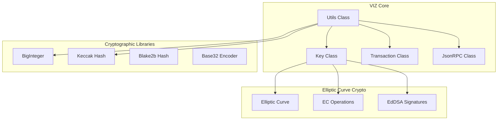
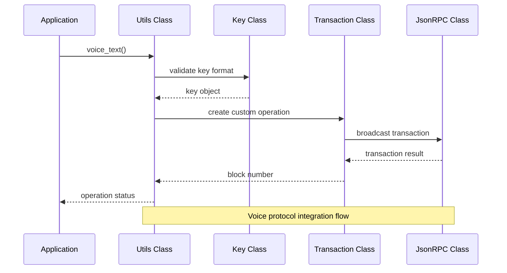
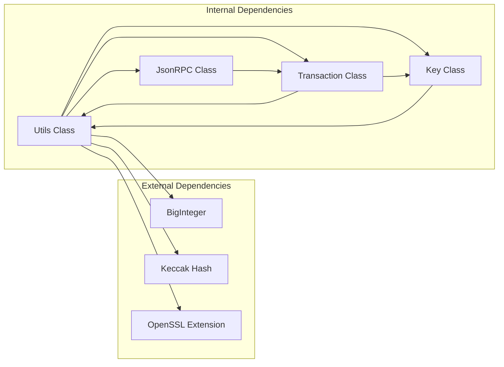

# Utils Class API

<cite>
**Referenced Files in This Document**
- [Utils.php](file://class/VIZ/Utils.php)
- [Key.php](file://class/VIZ/Key.php)
- [Transaction.php](file://class/VIZ/Transaction.php)
- [JsonRPC.php](file://class/VIZ/JsonRPC.php)
- [Keccak.php](file://class/kornrunner/Keccak.php)
- [BigInteger.php](file://class/BI/BigInteger.php)
- [README.md](file://README.md)
</cite>

## Table of Contents
1. [Introduction](#introduction)
2. [Project Structure](#project-structure)
3. [Core Components](#core-components)
4. [Architecture Overview](#architecture-overview)
5. [Detailed Component Analysis](#detailed-component-analysis)
6. [Dependency Analysis](#dependency-analysis)
7. [Performance Considerations](#performance-considerations)
8. [Troubleshooting Guide](#troubleshooting-guide)
9. [Conclusion](#conclusion)

## Introduction

The VIZ Utils class provides essential cryptographic utilities and blockchain integration functions for the VIZ PHP Library. This comprehensive utility class handles Base58 encoding/decoding, AES encryption/decryption, variable-length quantity encoding, cross-chain address generation, and Voice protocol integration functions. The class serves as a foundation for secure key management, transaction building, and blockchain communication within the VIZ ecosystem.

The Utils class is designed to work seamlessly with other VIZ components including the Key class for cryptographic operations, Transaction class for blockchain interactions, and JsonRPC for network communication. It provides both standalone utility functions and integrated blockchain-specific operations that enable developers to build robust VIZ blockchain applications.

## Project Structure

The VIZ Utils class is part of a larger ecosystem of blockchain utilities and cryptographic tools. The project follows a modular architecture with clear separation of concerns:

**Diagram sources**
- [Utils.php](file://class/VIZ/Utils.php#L1-L413)
- [Key.php](file://class/VIZ/Key.php#L1-L353)
- [Transaction.php](file://class/VIZ/Transaction.php#L1-L1416)

**Section sources**
- [Utils.php](file://class/VIZ/Utils.php#L1-L413)
- [README.md](file://README.md#L1-L455)

## Core Components

The VIZ Utils class consists of several distinct functional groups that serve different purposes in blockchain development:

### Cryptographic Utility Functions
- **Base58 Encoding/Decoding**: Secure encoding for blockchain addresses and keys
- **AES Encryption/Decryption**: Symmetric encryption for secure data transmission
- **Variable-Length Quantity (VLQ)**: Efficient data serialization for blockchain operations

### Cross-Chain Address Generation
- **Bitcoin Address Generation**: WIF format and P2PKH/P2SH address creation
- **Litecoin Address Generation**: Litecoin-specific address encoding
- **Ethereum Address Generation**: Keccak hashing for Ethereum-style addresses
- **Tron Address Generation**: TRX address creation with checksum validation

### Voice Protocol Integration
- **Text Object Creation**: Voice protocol text posts with metadata
- **Publication Object Creation**: Rich media content with markdown support
- **Event Management**: Object visibility and modification events

### Blockchain-Specific Operations
- **Memo Encryption/Decryption**: Secure messaging between VIZ users
- **Shared Key Derivation**: ECDH key exchange for secure communications

**Section sources**
- [Utils.php](file://class/VIZ/Utils.php#L209-L413)
- [Key.php](file://class/VIZ/Key.php#L45-L176)

## Architecture Overview

The VIZ Utils class operates as a central utility hub that integrates with multiple blockchain components:

**Diagram sources**
- [Utils.php](file://class/VIZ/Utils.php#L36-L73)
- [Transaction.php](file://class/VIZ/Transaction.php#L1061-L1085)
- [JsonRPC.php](file://class/VIZ/JsonRPC.php#L311-L353)

The architecture ensures loose coupling between components while maintaining strong integration capabilities for blockchain operations.

## Detailed Component Analysis

### Base58 Encoding/Decoding Functions

The Base58 encoding system provides secure encoding for blockchain addresses and keys, avoiding ambiguous characters that could cause confusion.

#### Base58 Encode Function
The `base58_encode` function converts binary data to Base58 format using a custom alphabet optimized for blockchain applications.

**Parameters:**
- `$string`: Binary data to encode
- `$alphabet`: Custom alphabet (default: VIZ-compatible Base58 alphabet)

**Return Value:** Base58-encoded string or empty string for empty input

**Error Handling:** Returns `false` for invalid input types, empty string for empty input

**Complexity Analysis:**
- Time Complexity: O(n) where n is the length of input data
- Space Complexity: O(n) for output string construction

#### Base58 Decode Function
The `base58_decode` function validates and decodes Base58-encoded data.

**Parameters:**
- `$base58`: Base58-encoded string to decode
- `$alphabet`: Custom alphabet (default: VIZ-compatible Base58 alphabet)

**Return Value:** Decoded binary data or `false` for invalid input

**Error Handling:** Returns `false` for invalid characters or malformed Base58 strings

**Complexity Analysis:**
- Time Complexity: O(n) where n is the length of encoded string
- Space Complexity: O(n) for decoded binary data

**Section sources**
- [Utils.php](file://class/VIZ/Utils.php#L212-L290)

### AES Encryption/Decryption Functions

The AES encryption system provides symmetric encryption for secure data transmission and memo functionality.

#### AES-256-CBC Encrypt Function
The `aes_256_cbc_encrypt` function performs AES-256-CBC encryption with automatic IV generation.

**Parameters:**
- `$data_bin`: Binary data to encrypt
- `$key_bin`: 32-byte encryption key
- `$iv`: Optional initialization vector (auto-generated if not provided)

**Return Value:** Hex-encoded encrypted data or array containing `iv` and `data` components

**Error Handling:** Returns `false` for encryption failures

**Complexity Analysis:**
- Time Complexity: O(n) where n is the length of input data
- Space Complexity: O(n) for encrypted output

#### AES-256-CBC Decrypt Function
The `aes_256_cbc_decrypt` function decrypts AES-256-CBC encrypted data.

**Parameters:**
- `$data_bin`: Hex-encoded encrypted data
- `$key_bin`: 32-byte decryption key
- `$iv`: Initialization vector used during encryption

**Return Value:** Decrypted binary data or `false` for decryption failures

**Error Handling:** Returns `false` for invalid data or incorrect keys

**Complexity Analysis:**
- Time Complexity: O(n) where n is the length of encrypted data
- Space Complexity: O(n) for decrypted output

**Section sources**
- [Utils.php](file://class/VIZ/Utils.php#L291-L320)

### Variable-Length Quantity (VLQ) Functions

VLQ encoding provides efficient variable-length integer encoding for blockchain data structures.

#### VLQ Create Function
The `vlq_create` function encodes integers into variable-length quantity format.

**Parameters:**
- `$data`: Input data to encode

**Return Value:** VLQ-encoded binary string

**Error Handling:** No explicit error handling for invalid input types

**Complexity Analysis:**
- Time Complexity: O(k) where k is the number of digits processed
- Space Complexity: O(k) for output encoding

#### VLQ Extract Function
The `vlq_extract` function extracts digits from VLQ-encoded data.

**Parameters:**
- `$data`: VLQ-encoded data
- `$as_bytes`: Return individual bytes instead of numeric values

**Return Value:** Array of extracted digits or bytes

**Complexity Analysis:**
- Time Complexity: O(k) where k is the number of digits processed
- Space Complexity: O(k) for extracted digits

#### VLQ Calculate Function
The `vlq_calculate` function reconstructs original values from VLQ digits.

**Parameters:**
- `$digits`: Array of VLQ digits
- `$as_bytes`: Input provided as bytes

**Return Value:** Calculated integer value

**Complexity Analysis:**
- Time Complexity: O(k) where k is the number of digits processed
- Space Complexity: O(1) for calculation result

**Section sources**
- [Utils.php](file://class/VIZ/Utils.php#L322-L383)

### Cross-Chain Address Generation Functions

The address generation functions create blockchain addresses for various cryptocurrency networks.

#### Bitcoin Address Functions
The `privkey_hex_to_btc_wif` and `full_pubkey_hex_to_btc_address` functions handle Bitcoin address creation.

**Bitcoin WIF Generation:**
- Uses version byte `0x80` for private keys
- Applies double SHA-256 hashing for checksum validation
- Encodes result using Base58 alphabet

**Bitcoin Address Generation:**
- Uses RIPEMD-160(SHA-256(public_key)) for address hash
- Network identifier `\x00` for mainnet addresses
- Double SHA-256 checksum validation

#### Litecoin Address Functions
The `privkey_hex_to_ltc_wif` and `full_pubkey_hex_to_ltc_address` functions handle Litecoin address creation.

**Litecoin WIF Generation:**
- Uses version byte `0xb0` for private keys
- Similar checksum validation as Bitcoin

**Litecoin Address Generation:**
- Network identifier `\x30` for mainnet addresses
- RIPEMD-160(SHA-256(public_key)) hash computation

#### Ethereum Address Function
The `full_pubkey_hex_to_eth_address` function generates Ethereum-style addresses.

**Process:**
- Removes the first byte from uncompressed public key
- Applies Keccak-256 hashing
- Takes last 20 bytes as Ethereum address
- Prepends `0x` prefix for Ethereum format

#### Tron Address Function
The `full_pubkey_hex_to_trx_address` function creates Tron addresses.

**Process:**
- Uses `41` prefix for Tron addresses
- Applies Keccak-256 hashing to uncompressed public key
- Adds checksum validation using double SHA-256
- Encodes result using Base58 alphabet

**Section sources**
- [Utils.php](file://class/VIZ/Utils.php#L384-L412)

### Voice Protocol Integration Functions

The Voice protocol integration functions enable posting content to the VIZ blockchain with rich metadata and social features.

#### Voice Text Functions
The `voice_text` function creates text-based Voice objects with comprehensive metadata support.

**Function Workflow:**
1. Validates and processes key input (accepts Key objects or WIF strings)
2. Retrieves account information to determine custom sequence
3. Builds Voice text object with optional reply/share/beneficiaries
4. Creates custom transaction with Voice protocol data
5. Executes transaction synchronously or asynchronously

**Parameters:**
- `$endpoint`: VIZ node endpoint URL
- `$key`: Private key (WIF string or Key object)
- `$account`: Account name posting the content
- `$text`: Main text content
- `$reply`: Optional reply context link
- `$share`: Optional share context link
- `$beneficiaries`: Optional beneficiary array
- `$loop`: Optional loop block number
- `$synchronous`: Return block number instead of boolean
- `$return_raw`: Return raw transaction data instead of executing

**Return Value:** Boolean success status or block number depending on parameters

**Error Handling:** Returns `false` for invalid keys, failed API calls, or transaction errors

#### Voice Publication Functions
The `voice_publication` function creates rich media content with markdown support.

**Features:**
- Supports title, markdown content, description, and image preview
- Comprehensive reply/share/beneficiaries support
- Advanced Voice protocol publication object creation

**Parameters:**
- `$endpoint`: VIZ node endpoint URL
- `$key`: Private key (WIF string or Key object)
- `$account`: Account name posting the content
- `$title`: Publication title
- `$markdown`: Markdown-formatted content
- `$description`: Optional short description
- `$image`: Optional image URL for preview
- Other parameters identical to voice_text function

**Return Value:** Boolean success status or block number

#### Voice Event Functions
The `voice_event` function manages object visibility and modifications.

**Supported Event Types:**
- **Hide Event (`h`)**: Hide content from user feeds
- **Add Event (`a`)**: Add additional content to existing objects
- **Edit Event (`e`)**: Modify existing content (supports text and publication types)

**Parameters:**
- `$endpoint`: VIZ node endpoint URL
- `$key`: Private key (WIF string or Key object)
- `$account`: Account name managing the event
- `$event_type`: Event type (h, a, e)
- `$target_account`: Optional target account for multi-account events
- `$target_block`: Target object block number
- `$data_type`: Data type for edit events (t=text, p=publication)
- `$data`: Event-specific data
- Other parameters identical to voice_text function

**Return Value:** Boolean success status or block number

**Section sources**
- [Utils.php](file://class/VIZ/Utils.php#L8-L73)
- [Utils.php](file://class/VIZ/Utils.php#L74-L148)
- [Utils.php](file://class/VIZ/Utils.php#L156-L208)

### Memo Encryption/Decryption Functions

The memo encryption system provides secure messaging between VIZ users using ECDH key exchange.

#### Memo Encryption Function
The `encode_memo` function encrypts messages using shared secrets and VLQ encoding.

**Process:**
1. Generates shared secret using ECDH key exchange
2. Creates unique nonce and encryption key
3. Computes checksum for integrity verification
4. Encrypts memo using AES-256-CBC
5. Encodes result using Base58 for transport

**Parameters:**
- `$public_key_encoded`: Recipient's public key
- `$memo`: Plain text memo message

**Return Value:** Base58-encoded encrypted memo string

#### Memo Decryption Function
The `decode_memo` function decrypts and verifies memo messages.

**Process:**
1. Validates Base58 input and extracts components
2. Determines current user's role (sender/receiver)
3. Recovers shared secret using appropriate key
4. Verifies checksum integrity
5. Decrypts memo using AES-256-CBC

**Parameters:**
- `$memo`: Base58-encoded encrypted memo

**Return Value:** Decrypted plain text message or `false` for invalid input

**Section sources**
- [Key.php](file://class/VIZ/Key.php#L45-L86)
- [Key.php](file://class/VIZ/Key.php#L87-L176)

## Dependency Analysis

The VIZ Utils class has strategic dependencies that enable its comprehensive functionality:

**Diagram sources**
- [Utils.php](file://class/VIZ/Utils.php#L4-L5)
- [Key.php](file://class/VIZ/Key.php#L6-L7)
- [Transaction.php](file://class/VIZ/Transaction.php#L6-L8)

### External Dependencies
- **BigInteger**: Arbitrary precision arithmetic for Base58 conversions
- **Keccak**: Cryptographic hashing for Ethereum and Tron address generation
- **OpenSSL**: AES encryption/decryption functionality

### Internal Dependencies
- **Key Class**: Provides cryptographic operations and shared key derivation
- **Transaction Class**: Handles blockchain transaction construction and execution
- **JsonRPC Class**: Manages network communication with VIZ nodes

**Section sources**
- [Utils.php](file://class/VIZ/Utils.php#L4-L5)
- [Key.php](file://class/VIZ/Key.php#L6-L7)
- [Transaction.php](file://class/VIZ/Transaction.php#L6-L8)

## Performance Considerations

The VIZ Utils class is designed with performance optimization in mind:

### Memory Management
- All utility functions operate on binary data streams to minimize memory overhead
- VLQ encoding uses iterative processing to handle large datasets efficiently
- Base58 operations avoid unnecessary string concatenations

### Cryptographic Efficiency
- AES operations leverage PHP's built-in OpenSSL extension for optimal performance
- Keccak hashing utilizes optimized bit manipulation operations
- BigInteger operations benefit from GMP or BCMath extensions when available

### Network Optimization
- Voice protocol functions support asynchronous execution to reduce latency
- Memo encryption/decryption operations are optimized for minimal computational overhead
- Transaction building functions minimize redundant API calls

## Troubleshooting Guide

### Common Issues and Solutions

#### Base58 Encoding/Decoding Failures
**Problem:** `base58_decode` returns `false`
**Solution:** Verify input contains only valid Base58 characters and proper checksum

#### AES Encryption/Decryption Errors
**Problem:** `aes_256_cbc_encrypt` returns `false`
**Solution:** Ensure 32-byte key length and valid initialization vector

#### Voice Protocol Transaction Failures
**Problem:** Voice operations return `false`
**Solution:** Verify account has sufficient VIZ balance and proper authority

#### Memo Encryption Issues
**Problem:** `encode_memo` fails with `false`
**Solution:** Confirm both parties have valid public keys and shared secret derivation succeeds

**Section sources**
- [Utils.php](file://class/VIZ/Utils.php#L212-L290)
- [Key.php](file://class/VIZ/Key.php#L45-L86)

## Conclusion

The VIZ Utils class provides a comprehensive suite of cryptographic utilities and blockchain integration functions essential for VIZ blockchain development. Its modular design enables seamless integration with other VIZ components while maintaining strong security guarantees through industry-standard cryptographic practices.

The class successfully bridges the gap between low-level cryptographic operations and high-level blockchain functionality, enabling developers to build sophisticated VIZ applications with ease. Its support for cross-chain address generation, Voice protocol integration, and secure memo functionality makes it an indispensable tool for the VIZ ecosystem.

Future enhancements could include additional cryptographic algorithms, improved error reporting, and expanded blockchain protocol support. The current implementation provides a solid foundation for building secure and scalable VIZ blockchain applications.