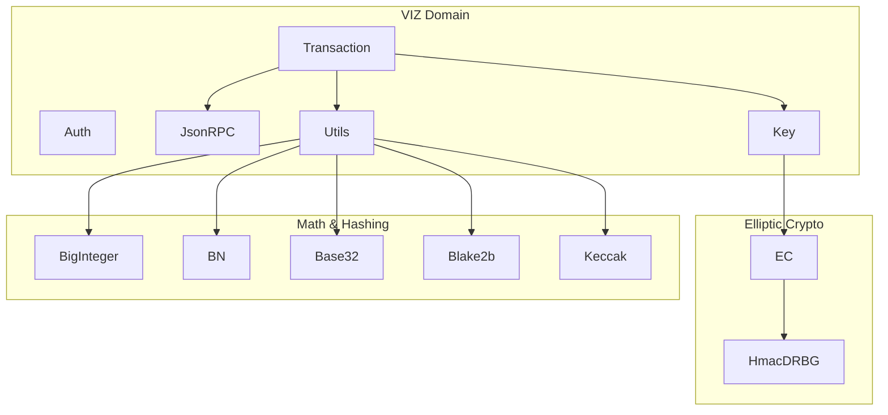
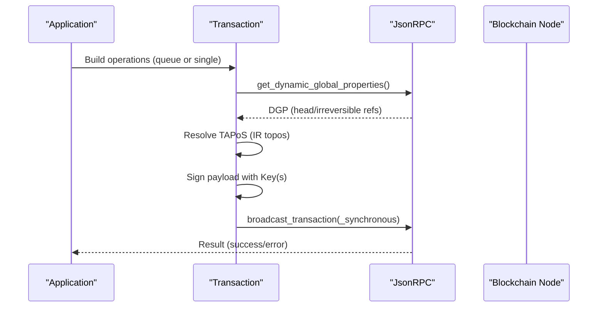
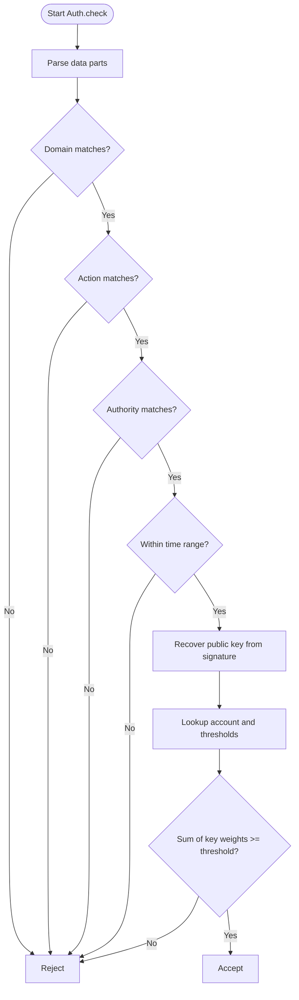
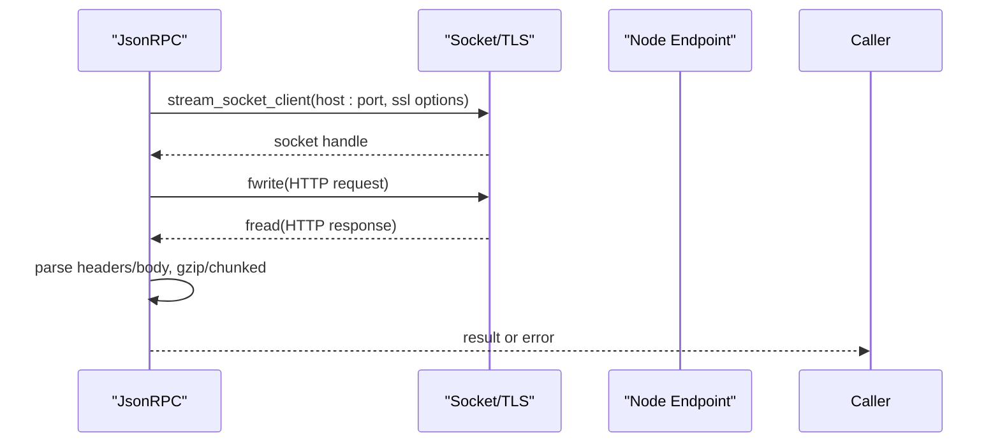
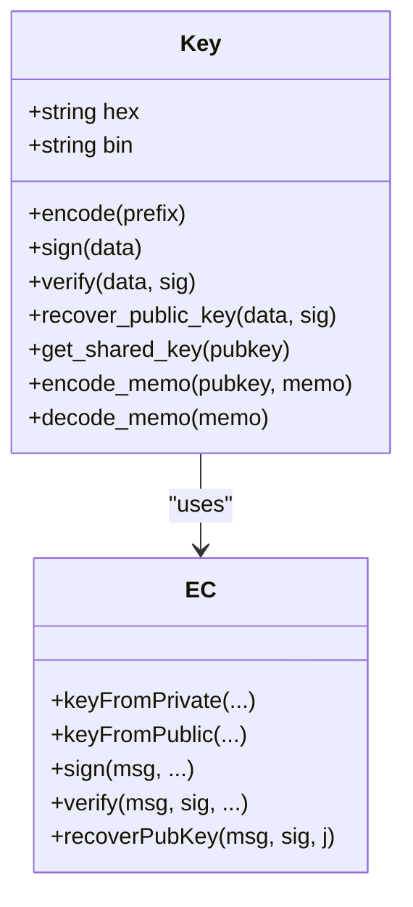
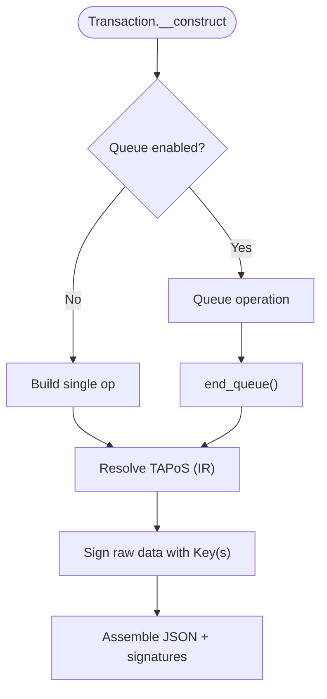
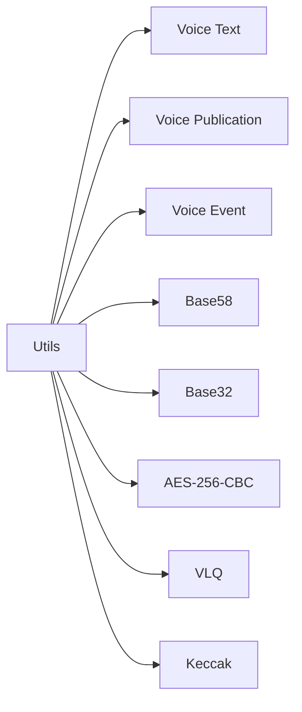
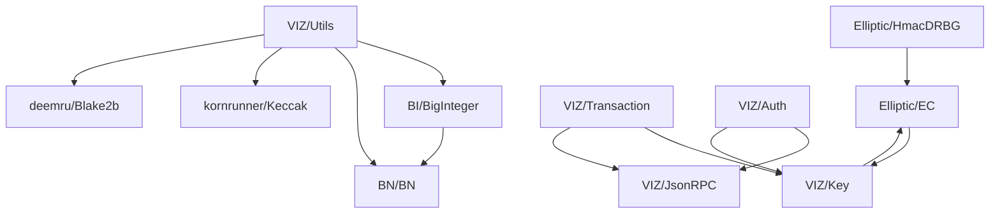

# Advanced Topics

<cite>
**Referenced Files in This Document**
- [README.md](file://README.md)
- [composer.json](file://composer.json)
- [class/autoloader.php](file://class/autoloader.php)
- [class/VIZ/Auth.php](file://class/VIZ/Auth.php)
- [class/VIZ/JsonRPC.php](file://class/VIZ/JsonRPC.php)
- [class/VIZ/Key.php](file://class/VIZ/Key.php)
- [class/VIZ/Transaction.php](file://class/VIZ/Transaction.php)
- [class/VIZ/Utils.php](file://class/VIZ/Utils.php)
- [class/Elliptic/EC.php](file://class/Elliptic/EC.php)
- [class/Elliptic/HmacDRBG.php](file://class/Elliptic/HmacDRBG.php)
- [class/BI/BigInteger.php](file://class/BI/BigInteger.php)
- [class/BN/BN.php](file://class/BN/BN.php)
- [class/Base32/Base32.php](file://class/Base32/Base32.php)
- [class/deemru/Blake2b.php](file://class/deemru/Blake2b.php)
- [class/kornrunner/Keccak.php](file://class/kornrunner/Keccak.php)
</cite>

## Table of Contents
1. [Introduction](#introduction)
2. [Project Structure](#project-structure)
3. [Core Components](#core-components)
4. [Architecture Overview](#architecture-overview)
5. [Detailed Component Analysis](#detailed-component-analysis)
6. [Dependency Analysis](#dependency-analysis)
7. [Performance Considerations](#performance-considerations)
8. [Security Considerations](#security-considerations)
9. [Extension Development Patterns](#extension-development-patterns)
10. [Expert-Level Usage Scenarios](#expert-level-usage-scenarios)
11. [Troubleshooting Guide](#troubleshooting-guide)
12. [Conclusion](#conclusion)

## Introduction
This document provides advanced guidance for the VIZ PHP Library, focusing on performance optimization, security hardening, extension development, and expert usage patterns. It synthesizes the repository’s cryptographic primitives, networking stack, transaction building, and utility helpers into practical advice for production-grade deployments.

## Project Structure
The library is organized around three primary domains:
- VIZ domain: authentication, JSON-RPC client, key management, transaction builder, and utilities.
- Elliptic cryptography: ECDSA and deterministic randomness for signatures.
- Supporting math and hashing: big integer arithmetic, base encodings, and cryptographic hashes.

**Diagram sources**
- [class/VIZ/Auth.php](file://class/VIZ/Auth.php#L1-L70)
- [class/VIZ/JsonRPC.php](file://class/VIZ/JsonRPC.php#L1-L354)
- [class/VIZ/Key.php](file://class/VIZ/Key.php#L1-L353)
- [class/VIZ/Transaction.php](file://class/VIZ/Transaction.php#L1-L1416)
- [class/VIZ/Utils.php](file://class/VIZ/Utils.php#L1-L413)
- [class/Elliptic/EC.php](file://class/Elliptic/EC.php#L1-L272)
- [class/Elliptic/HmacDRBG.php](file://class/Elliptic/HmacDRBG.php#L1-L132)
- [class/BI/BigInteger.php](file://class/BI/BigInteger.php#L1-L634)
- [class/BN/BN.php](file://class/BN/BN.php#L1-L765)
- [class/Base32/Base32.php](file://class/Base32/Base32.php#L1-L130)
- [class/deemru/Blake2b.php](file://class/deemru/Blake2b.php#L1-L326)
- [class/kornrunner/Keccak.php](file://class/kornrunner/Keccak.php#L1-L307)

**Section sources**
- [README.md](file://README.md#L1-L455)
- [composer.json](file://composer.json#L1-L32)
- [class/autoloader.php](file://class/autoloader.php#L1-L14)

## Core Components
- Authentication: passwordless verification against blockchain authority.
- JSON-RPC client: low-level HTTP(S) transport with plugin routing and result parsing.
- Key management: ECDSA key generation, encoding/decoding, shared secret derivation, and memo encryption/decryption.
- Transaction builder: TAPoS resolution, operation encoding, multi-signature assembly, and broadcasting.
- Utilities: Voice protocol posting, memo encryption, base encodings, and cryptographic helpers.

**Section sources**
- [class/VIZ/Auth.php](file://class/VIZ/Auth.php#L1-L70)
- [class/VIZ/JsonRPC.php](file://class/VIZ/JsonRPC.php#L1-L354)
- [class/VIZ/Key.php](file://class/VIZ/Key.php#L1-L353)
- [class/VIZ/Transaction.php](file://class/VIZ/Transaction.php#L1-L1416)
- [class/VIZ/Utils.php](file://class/VIZ/Utils.php#L1-L413)

## Architecture Overview
The system integrates cryptographic primitives with a blockchain JSON-RPC client and a transaction builder. The EC library provides deterministic signatures via HMAC_DRBG, while BigInteger/BN abstracts large-number arithmetic. Utilities encapsulate encoding and hashing for interoperability.

**Diagram sources**
- [class/VIZ/Transaction.php](file://class/VIZ/Transaction.php#L61-L157)
- [class/VIZ/JsonRPC.php](file://class/VIZ/JsonRPC.php#L311-L353)

## Detailed Component Analysis

### Authentication and Passwordless Verification
- Validates domain, action, authority, and time window.
- Recovers public key from signature and checks account authority weights.

**Diagram sources**
- [class/VIZ/Auth.php](file://class/VIZ/Auth.php#L25-L69)

**Section sources**
- [class/VIZ/Auth.php](file://class/VIZ/Auth.php#L1-L70)

### JSON-RPC Client and Transport
- Manages endpoint, headers, SSL verification, timeouts, and result parsing.
- Maps API methods to plugin namespaces and supports GET/POST and chunked/gzip responses.

**Diagram sources**
- [class/VIZ/JsonRPC.php](file://class/VIZ/JsonRPC.php#L122-L222)
- [class/VIZ/JsonRPC.php](file://class/VIZ/JsonRPC.php#L251-L257)

**Section sources**
- [class/VIZ/JsonRPC.php](file://class/VIZ/JsonRPC.php#L1-L354)

### Key Management and Memo Encryption
- Generates deterministic keys, encodes/decodes WIF/public keys, and computes shared ECDH secrets.
- Implements memo encryption compatible with viz-js-lib using AES-256-CBC and base58 encoding.

**Diagram sources**
- [class/VIZ/Key.php](file://class/VIZ/Key.php#L9-L353)
- [class/Elliptic/EC.php](file://class/Elliptic/EC.php#L42-L272)

**Section sources**
- [class/VIZ/Key.php](file://class/VIZ/Key.php#L1-L353)
- [class/Elliptic/EC.php](file://class/Elliptic/EC.php#L1-L272)

### Transaction Builder and Multi-Signature
- Resolves TAPoS from last irreversible block, constructs raw transaction bytes, signs with private keys, and builds JSON.
- Supports batching via operation queues and adding signatures to existing transactions.

**Diagram sources**
- [class/VIZ/Transaction.php](file://class/VIZ/Transaction.php#L1310-L1328)
- [class/VIZ/Transaction.php](file://class/VIZ/Transaction.php#L61-L157)

**Section sources**
- [class/VIZ/Transaction.php](file://class/VIZ/Transaction.php#L1-L1416)

### Utilities: Voice Protocol and Encoding
- Voice text/publication/event construction and posting.
- Base58/base32 encoders/decoders, AES-256-CBC, VLQ encoding, and Keccak hashing.

**Diagram sources**
- [class/VIZ/Utils.php](file://class/VIZ/Utils.php#L36-L208)
- [class/Base32/Base32.php](file://class/Base32/Base32.php#L1-L130)
- [class/kornrunner/Keccak.php](file://class/kornrunner/Keccak.php#L291-L307)

**Section sources**
- [class/VIZ/Utils.php](file://class/VIZ/Utils.php#L1-L413)
- [class/Base32/Base32.php](file://class/Base32/Base32.php#L1-L130)
- [class/kornrunner/Keccak.php](file://class/kornrunner/Keccak.php#L1-L307)

## Dependency Analysis
- Cryptographic backbone: EC (elliptic curves), HmacDRBG (deterministic nonce), BigInteger/BN (arithmetic), Keccak/Blake2b (hashing).
- VIZ domain depends on elliptic crypto and utilities; Transaction composes JsonRPC and Key; Auth composes JsonRPC and Key.

**Diagram sources**
- [class/Elliptic/EC.php](file://class/Elliptic/EC.php#L1-L272)
- [class/Elliptic/HmacDRBG.php](file://class/Elliptic/HmacDRBG.php#L1-L132)
- [class/BI/BigInteger.php](file://class/BI/BigInteger.php#L1-L634)
- [class/BN/BN.php](file://class/BN/BN.php#L1-L765)
- [class/VIZ/Key.php](file://class/VIZ/Key.php#L1-L353)
- [class/VIZ/Transaction.php](file://class/VIZ/Transaction.php#L1-L1416)
- [class/VIZ/JsonRPC.php](file://class/VIZ/JsonRPC.php#L1-L354)
- [class/VIZ/Auth.php](file://class/VIZ/Auth.php#L1-L70)
- [class/VIZ/Utils.php](file://class/VIZ/Utils.php#L1-L413)
- [class/kornrunner/Keccak.php](file://class/kornrunner/Keccak.php#L1-L307)
- [class/deemru/Blake2b.php](file://class/deemru/Blake2b.php#L1-L326)

**Section sources**
- [composer.json](file://composer.json#L19-L31)

## Performance Considerations
- Memory management
  - Prefer streaming reads and avoid accumulating large buffers; JsonRPC reads response in chunks and supports gzip decoding to reduce memory footprint.
  - Use queue mode for batching operations to minimize repeated API calls and signature computations.
  - Reuse Key instances for repeated signing operations to avoid repeated EC context initialization.
- Computational efficiency
  - Choose GMP or BCMath via BigInteger for optimal big-integer performance depending on environment.
  - Minimize VLQ and base58/base32 conversions by batching data and avoiding redundant encodings.
  - Cache resolved TAPoS values per session to avoid repeated get_dynamic_global_properties calls.
- Caching strategies
  - Cache node IP lookups and hostname-to-IP mapping in JsonRPC to reduce DNS overhead.
  - Cache account and authority data locally when performing frequent Auth checks.
- Batch processing
  - Use Transaction queue mode to combine multiple operations into a single transaction.
  - Batch memo encryption/decryption operations by grouping messages and reusing derived keys.
- Network optimization
  - Enable gzip where supported and keep connections closed after each request.
  - Tune read timeouts and consider connection pooling at higher layers if integrating with frameworks.

[No sources needed since this section provides general guidance]

## Security Considerations
- Cryptographic security
  - Deterministic signatures via HMAC_DRBG ensure nonces are derived securely; ensure entropy sources are strong and persistent across runs.
  - Use secp256k1 keys exclusively and avoid uncompressed forms unless required for compatibility.
- Key storage best practices
  - Never log private keys or intermediate values; sanitize logs and avoid echoing sensitive data.
  - Store keys in environment variables or secure secret managers; never embed in source code.
  - Rotate keys regularly and enforce minimum key lifetimes.
- Network security
  - Enforce SSL verification; disable only in controlled environments and with explicit opt-out flags.
  - Validate endpoints and consider certificate pinning for critical integrations.
- Input validation
  - Validate operation parameters and asset amounts before building transactions.
  - Sanitize memo payloads and enforce size limits to prevent abuse.
  - For Voice protocol, validate metadata and ensure proper escaping of JSON.

**Section sources**
- [class/Elliptic/HmacDRBG.php](file://class/Elliptic/HmacDRBG.php#L15-L49)
- [class/VIZ/JsonRPC.php](file://class/VIZ/JsonRPC.php#L189-L196)
- [class/VIZ/Transaction.php](file://class/VIZ/Transaction.php#L1329-L1416)

## Extension Development Patterns
- Custom operation builders
  - Follow the Transaction pattern: implement a build_* method that returns [json, raw] pair and append to the encoder suite.
  - Use encode_* helpers for primitives and encode_array for nested structures.
- Plugin development
  - Extend JsonRPC to add new API method mappings and plugin routing; ensure return_only_result toggling is respected.
- Custom encoding formats
  - Introduce new encode_* methods in Transaction and maintain parity in raw serialization.
  - Provide companion decode_* utilities in Key/Utils when applicable.
- Integration patterns
  - Compose VIZ/Transaction with external schedulers or workers to batch operations.
  - Wrap VIZ/JsonRPC with retry/backoff and circuit-breaker logic for resilience.

**Section sources**
- [class/VIZ/Transaction.php](file://class/VIZ/Transaction.php#L1061-L1086)
- [class/VIZ/Transaction.php](file://class/VIZ/Transaction.php#L1329-L1416)
- [class/VIZ/JsonRPC.php](file://class/VIZ/JsonRPC.php#L29-L121)

## Expert-Level Usage Scenarios
- High-throughput signing
  - Pre-generate keys and reuse Key instances; batch sign multiple payloads with a single Key object.
- Multi-signature orchestration
  - Use add_signature to append additional signatures to partially signed transactions; coordinate with external signers.
- Large memo encryption
  - Split long memos into chunks and assemble with VLQ framing; reuse shared keys across sessions.
- Voice protocol automation
  - Build Voice text/publication events with metadata; schedule events and manage loops for content curation.
- Production hardening
  - Instrument JsonRPC with metrics and structured logging; monitor timeouts and SSL handshake failures.
  - Implement rate limiting and backpressure for API calls; cache frequently accessed account data.

**Section sources**
- [class/VIZ/Transaction.php](file://class/VIZ/Transaction.php#L158-L190)
- [class/VIZ/Utils.php](file://class/VIZ/Utils.php#L36-L208)

## Troubleshooting Guide
- Signature not found
  - Canonical signature fallback loop; increase nonce tolerance or adjust signing parameters.
- TAPoS resolution failure
  - Verify get_dynamic_global_properties availability; ensure last irreversible block is recent.
- SSL/TLS errors
  - Disable verification only temporarily; confirm certificates and hostnames; check firewall/proxy.
- Base58/base32 decoding failures
  - Validate input alphabet and padding; ensure checksums match expected formats.
- Keccak/Blake2b mismatches
  - Confirm digest sizes and raw vs hex outputs; ensure consistent bit-endian handling.

**Section sources**
- [class/VIZ/Key.php](file://class/VIZ/Key.php#L302-L352)
- [class/VIZ/Transaction.php](file://class/VIZ/Transaction.php#L61-L113)
- [class/VIZ/JsonRPC.php](file://class/VIZ/JsonRPC.php#L189-L217)
- [class/Base32/Base32.php](file://class/Base32/Base32.php#L114-L129)
- [class/kornrunner/Keccak.php](file://class/kornrunner/Keccak.php#L291-L307)
- [class/deemru/Blake2b.php](file://class/deemru/Blake2b.php#L38-L43)

## Conclusion
This guide distilled advanced practices for performance, security, and extensibility in the VIZ PHP Library. By leveraging batching, deterministic randomness, robust transport, and careful key handling, teams can operate reliably in production while maintaining compatibility and interoperability across the VIZ ecosystem.