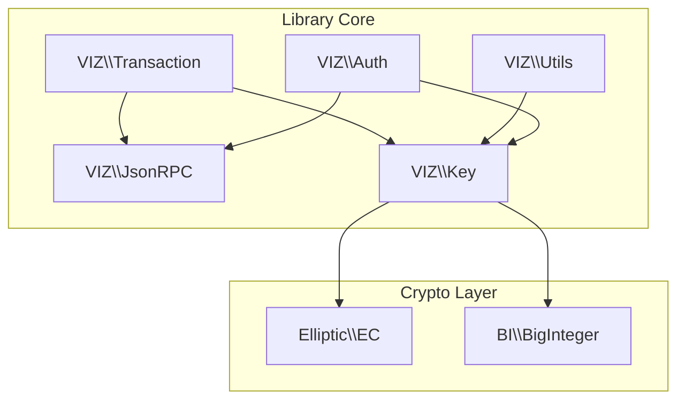
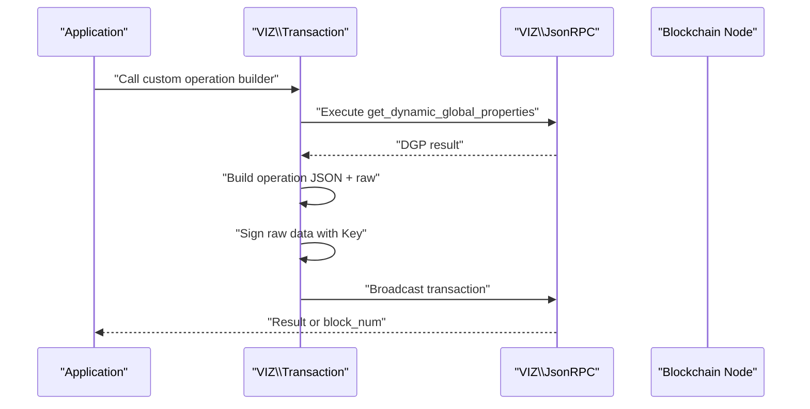
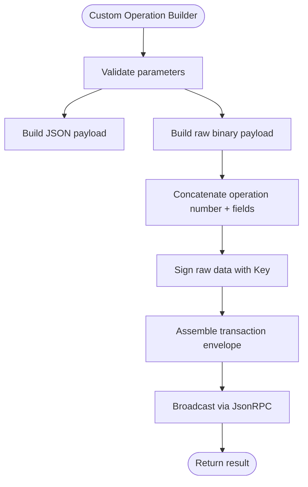
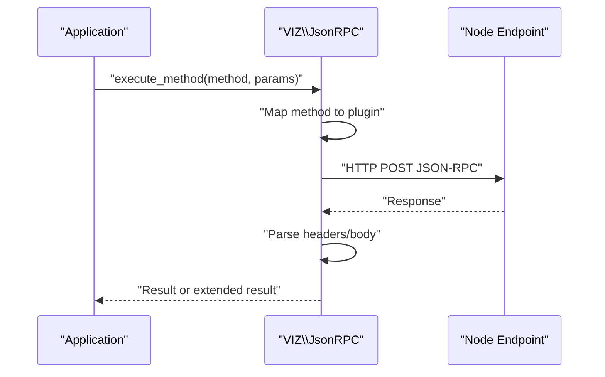
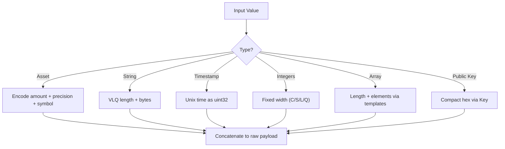
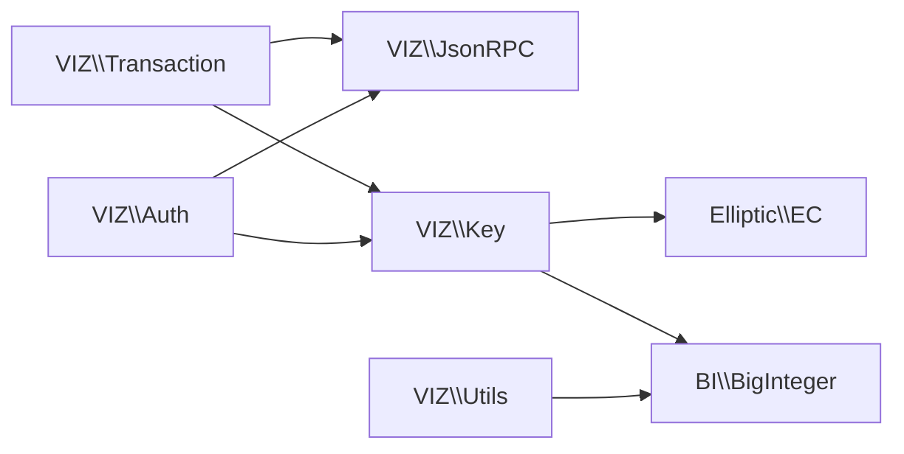

# Extension Development

<cite>
**Referenced Files in This Document**
- [README.md](file://README.md)
- [composer.json](file://composer.json)
- [class/autoloader.php](file://class/autoloader.php)
- [class/VIZ/Transaction.php](file://class/VIZ/Transaction.php)
- [class/VIZ/JsonRPC.php](file://class/VIZ/JsonRPC.php)
- [class/VIZ/Auth.php](file://class/VIZ/Auth.php)
- [class/VIZ/Key.php](file://class/VIZ/Key.php)
- [class/VIZ/Utils.php](file://class/VIZ/Utils.php)
- [class/Elliptic/EC.php](file://class/Elliptic/EC.php)
- [class/BI/BigInteger.php](file://class/BI/BigInteger.php)
- [tests/TestKeys.php](file://tests/TestKeys.php)
</cite>

## Table of Contents
1. [Introduction](#introduction)
2. [Project Structure](#project-structure)
3. [Core Components](#core-components)
4. [Architecture Overview](#architecture-overview)
5. [Detailed Component Analysis](#detailed-component-analysis)
6. [Dependency Analysis](#dependency-analysis)
7. [Performance Considerations](#performance-considerations)
8. [Troubleshooting Guide](#troubleshooting-guide)
9. [Conclusion](#conclusion)
10. [Appendices](#appendices)

## Introduction
This document explains extension development patterns for the VIZ PHP Library. It focuses on:
- Extending the Transaction class to add new operation builders, parameter validation, and serialization logic
- Developing plugins for JSON-RPC extensions, custom endpoint handlers, and protocol enhancements
- Creating custom encoding formats (data type encoders, compression algorithms, blockchain-specific formats)
- Integrating third-party libraries, custom authentication mechanisms, and external services
- Practical extension architecture, dependency management, backward compatibility, testing strategies, and deployment best practices

The guide is designed for both experienced developers and newcomers, with diagrams and references to concrete source files.

## Project Structure
The library is organized around a small set of cohesive classes under namespaces VIZ, BI, BN, and Elliptic. Composer autoloaders and a simple autoloader facilitate loading. The primary building blocks are:
- Transaction: constructs and signs blockchain operations
- JsonRPC: low-level JSON-RPC client with endpoint routing
- Key: cryptographic primitives for signing, verification, and key derivation
- Utils: convenience utilities for encoding, encryption, and Voice protocol helpers
- Auth: passwordless authentication verification against the blockchain

**Diagram sources**
- [class/VIZ/Transaction.php](file://class/VIZ/Transaction.php#L10-L24)
- [class/VIZ/JsonRPC.php](file://class/VIZ/JsonRPC.php#L4-L22)
- [class/VIZ/Key.php](file://class/VIZ/Key.php#L9-L16)
- [class/VIZ/Utils.php](file://class/VIZ/Utils.php#L7-L7)
- [class/VIZ/Auth.php](file://class/VIZ/Auth.php#L9-L18)
- [class/Elliptic/EC.php](file://class/Elliptic/EC.php#L9-L40)
- [class/BI/BigInteger.php](file://class/BI/BigInteger.php#L24-L30)

**Section sources**
- [README.md](file://README.md#L9-L18)
- [composer.json](file://composer.json#L19-L29)
- [class/autoloader.php](file://class/autoloader.php#L3-L12)

## Core Components
- Transaction: central orchestrator for building operations, TAPoS resolution, signing, and broadcasting
- JsonRPC: endpoint abstraction with plugin routing and raw method construction
- Key: cryptographic operations, WIF/base58 encoding, shared-key derivation, memo encryption/decryption
- Utils: Base58, AES-256-CBC, VLQ encoding, Voice protocol helpers
- Auth: passwordless authentication verification against the blockchain

Key responsibilities:
- Transaction builds operation JSON and raw binary, computes signatures, and serializes transactions
- JsonRPC maps API methods to plugin endpoints and executes requests
- Key encapsulates ECDSA secp256k1 operations and key formats
- Utils provides reusable encoding and cryptographic helpers
- Auth validates domain-authenticated signatures against account authorities

**Section sources**
- [class/VIZ/Transaction.php](file://class/VIZ/Transaction.php#L10-L24)
- [class/VIZ/JsonRPC.php](file://class/VIZ/JsonRPC.php#L29-L121)
- [class/VIZ/Key.php](file://class/VIZ/Key.php#L9-L32)
- [class/VIZ/Utils.php](file://class/VIZ/Utils.php#L7-L7)
- [class/VIZ/Auth.php](file://class/VIZ/Auth.php#L9-L24)

## Architecture Overview
The extension architecture centers on composition and delegation:
- Extend Transaction with new operation builders that produce both JSON and raw binary encodings
- Extend JsonRPC to route new API methods to appropriate plugins
- Extend Key and Utils to add new encoders, compression, or protocol helpers
- Integrate third-party libraries via Composer or PSR-4 autoloaders

**Diagram sources**
- [class/VIZ/Transaction.php](file://class/VIZ/Transaction.php#L61-L157)
- [class/VIZ/JsonRPC.php](file://class/VIZ/JsonRPC.php#L311-L353)

## Detailed Component Analysis

### Extending the Transaction Class: Custom Operation Builders
Transaction exposes a dynamic call mechanism and a queue system. New operations are added by implementing a builder method that returns both JSON and raw binary encodings. Serialization logic follows a consistent pattern:
- Encode operation number
- Encode fields according to type-specific encoders
- Concatenate raw bytes to form the operation payload
- Build JSON representation for broadcast

Implementation patterns:
- Dynamic builder invocation: the magic method delegates to a build_* method
- Queue mode: operations accumulate until end_queue builds a single transaction
- Encoding helpers: asset, string, timestamp, boolean, integers, arrays, and public keys

Validation and serialization logic:
- Parameter validation occurs inside each builder (e.g., authority structures, asset formats)
- Raw encoding uses fixed-width integers, VLQ-prefixed strings, and explicit arrays
- JSON encoding mirrors raw layout for clarity and debugging

Backward compatibility:
- New operations must preserve the existing transaction envelope structure
- Operation numbers must be unique and documented
- Existing encoding helpers can be reused to minimize drift

**Diagram sources**
- [class/VIZ/Transaction.php](file://class/VIZ/Transaction.php#L42-L52)
- [class/VIZ/Transaction.php](file://class/VIZ/Transaction.php#L1329-L1415)
- [class/VIZ/Transaction.php](file://class/VIZ/Transaction.php#L158-L190)

**Section sources**
- [class/VIZ/Transaction.php](file://class/VIZ/Transaction.php#L42-L52)
- [class/VIZ/Transaction.php](file://class/VIZ/Transaction.php#L1310-L1328)
- [class/VIZ/Transaction.php](file://class/VIZ/Transaction.php#L1329-L1415)

### JSON-RPC Extensions: Plugin Routing and Custom Endpoints
JsonRPC maps API methods to plugin endpoints and supports raw and structured method construction. To extend:
- Add new API methods to the internal mapping
- Implement raw or structured method builders
- Optionally add custom headers or endpoint switching

Plugin routing:
- Methods are mapped to plugin names (e.g., database_api, network_broadcast_api)
- execute_method handles HTTP transport, redirects, chunked responses, and gzip decoding
- return_only_result toggles simplified vs extended responses

Custom endpoint handlers:
- Endpoint switching is supported via property updates
- Header manipulation allows custom authentication or tracing

**Diagram sources**
- [class/VIZ/JsonRPC.php](file://class/VIZ/JsonRPC.php#L29-L121)
- [class/VIZ/JsonRPC.php](file://class/VIZ/JsonRPC.php#L311-L353)

**Section sources**
- [class/VIZ/JsonRPC.php](file://class/VIZ/JsonRPC.php#L29-L121)
- [class/VIZ/JsonRPC.php](file://class/VIZ/JsonRPC.php#L122-L257)
- [class/VIZ/JsonRPC.php](file://class/VIZ/JsonRPC.php#L258-L310)
- [class/VIZ/JsonRPC.php](file://class/VIZ/JsonRPC.php#L311-L353)

### Custom Encoding Formats: Data Types, Compression, and Blockchain-Specific Encoders
Encoding helpers in Transaction and Utils enable extensibility:
- Asset encoding: precision-aware 64-bit amount plus asset symbol
- String encoding: VLQ-prefixed variable-length strings
- Timestamps and integers: fixed-width encoders with endianness handling
- Arrays: length-prefixed sequences with per-element encoders
- Public keys: compact representation via Key

Compression and blockchain-specific formats:
- Memo encryption/decryption uses AES-256-CBC with shared ECDH key
- Base58 encoding/decoding for WIF and public key formats
- VLQ for variable-length quantities in Voice protocol

**Diagram sources**
- [class/VIZ/Transaction.php](file://class/VIZ/Transaction.php#L1329-L1415)
- [class/VIZ/Utils.php](file://class/VIZ/Utils.php#L321-L383)

**Section sources**
- [class/VIZ/Transaction.php](file://class/VIZ/Transaction.php#L1329-L1415)
- [class/VIZ/Utils.php](file://class/VIZ/Utils.php#L209-L290)
- [class/VIZ/Utils.php](file://class/VIZ/Utils.php#L321-L383)

### Third-Party Libraries, Authentication, and External Services
Integration patterns:
- Elliptic and BI/BigInteger provide cryptographic primitives with GMP/bcmath fallbacks
- Base58 and AES-256-CBC are used for key and memo handling
- External services can be integrated via JsonRPC custom endpoints and custom operations

Authentication:
- Passwordless authentication uses domain-action-account-authority-time-nonce tuples
- Verification checks domain, action, authority, time window, and account authority weights

External service integration:
- Use JsonRPC to call custom endpoints and map them to plugin routes
- Wrap external APIs with custom operation builders to keep serialization consistent

**Section sources**
- [class/Elliptic/EC.php](file://class/Elliptic/EC.php#L9-L40)
- [class/BI/BigInteger.php](file://class/BI/BigInteger.php#L24-L30)
- [class/VIZ/Utils.php](file://class/VIZ/Utils.php#L209-L290)
- [class/VIZ/Auth.php](file://class/VIZ/Auth.php#L25-L69)

### Practical Extension Architecture
Recommended patterns:
- Operation builders return [json, raw] consistently
- Use existing encoding helpers to minimize divergence
- Keep parameter validation close to builder logic
- Expose queue mode for batching operations
- Maintain backward compatibility by preserving transaction envelope fields

Dependency management:
- Composer PSR-4 autoloaders load VIZ, BI, BN, and Elliptic namespaces
- Autoloader fallback ensures smooth loading in minimal environments

Backward compatibility considerations:
- Preserve chain_id, TAPoS fields, expiration, and signature arrays
- Avoid changing operation numbering or field positions
- Provide migration paths for new fields via extensions or versioned operations

Testing strategies:
- Unit tests validate key derivation, signing, and verification
- Integration tests exercise JsonRPC routing and transaction building
- Mock endpoints can simulate plugin responses during testing

Deployment best practices:
- Pin compatible versions of third-party libraries
- Use semantic versioning for extensions
- Document new operation builders and encoding changes
- Provide migration guides for breaking changes

**Section sources**
- [composer.json](file://composer.json#L19-L29)
- [class/autoloader.php](file://class/autoloader.php#L3-L12)
- [tests/TestKeys.php](file://tests/TestKeys.php#L7-L28)

## Dependency Analysis
The core dependencies are:
- VIZ\Transaction depends on VIZ\JsonRPC and VIZ\Key
- VIZ\Key depends on Elliptic\EC and BI\BigInteger
- VIZ\Utils depends on BI\BigInteger and kornrunner\Keccak
- VIZ\Auth depends on VIZ\JsonRPC and VIZ\Key

**Diagram sources**
- [class/VIZ/Transaction.php](file://class/VIZ/Transaction.php#L6-L8)
- [class/VIZ/Key.php](file://class/VIZ/Key.php#L6-L7)
- [class/VIZ/Utils.php](file://class/VIZ/Utils.php#L4-L5)
- [class/VIZ/Auth.php](file://class/VIZ/Auth.php#L4-L7)

**Section sources**
- [class/VIZ/Transaction.php](file://class/VIZ/Transaction.php#L6-L8)
- [class/VIZ/Key.php](file://class/VIZ/Key.php#L6-L7)
- [class/VIZ/Utils.php](file://class/VIZ/Utils.php#L4-L5)
- [class/VIZ/Auth.php](file://class/VIZ/Auth.php#L4-L7)

## Performance Considerations
- Prefer GMP or BCMath for large integer arithmetic
- Minimize repeated JSON parsing; reuse results where possible
- Batch operations via queue mode to reduce network round-trips
- Avoid unnecessary base conversions; operate in binary where feasible
- Use VLQ encoding for variable-length strings to reduce overhead

## Troubleshooting Guide
Common issues and resolutions:
- Signature not found: retry signing with a nonce increment in transaction building
- API method not found: ensure the method is present in the JsonRPC mapping
- SSL/TLS errors: disable SSL checking only for testing; otherwise configure certificates
- Timeouts: increase read timeout or switch endpoints
- Incorrect authority weights: verify account authority structures and key weights

**Section sources**
- [class/VIZ/Transaction.php](file://class/VIZ/Transaction.php#L118-L144)
- [class/VIZ/JsonRPC.php](file://class/VIZ/JsonRPC.php#L175-L217)
- [class/VIZ/Auth.php](file://class/VIZ/Auth.php#L25-L69)

## Conclusion
The VIZ PHP Library provides a robust foundation for extension development. By leveraging the Transaction builder pattern, JsonRPC plugin routing, and cryptographic utilities, developers can introduce new operations, endpoints, and encoding formats while maintaining backward compatibility. Following the patterns outlined here ensures reliable integration with the blockchain and third-party systems.

## Appendices

### Example Workflows
- Custom operation builder: implement a build_* method that returns [json, raw], then call it via the dynamic method or queue mode
- JSON-RPC extension: add a new API method to the mapping and implement raw or structured method construction
- Encoding format: reuse existing helpers or extend with new type encoders and VLQ utilities
- Authentication: integrate passwordless auth verification using domain-action-account-authority-time-nonce tuples

[No sources needed since this section provides general guidance]