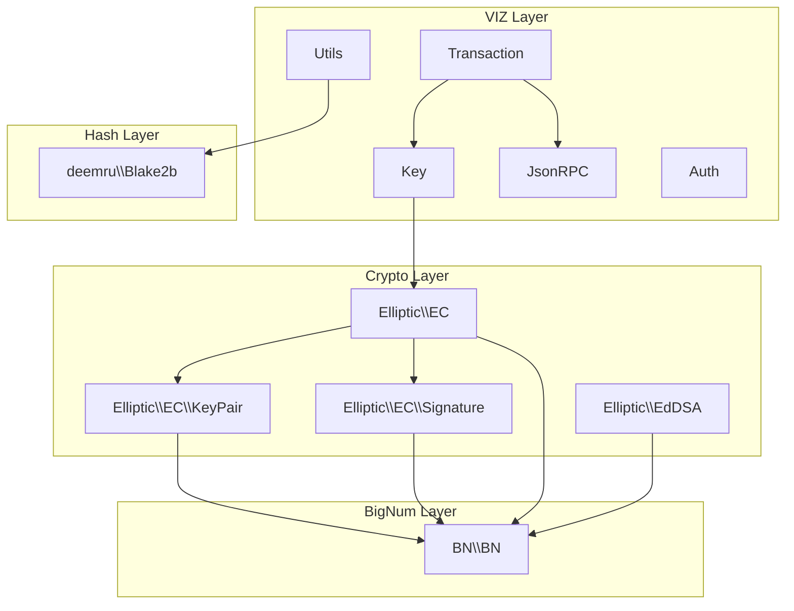
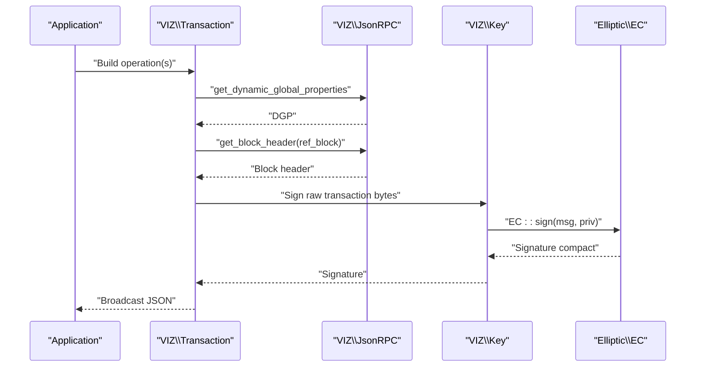
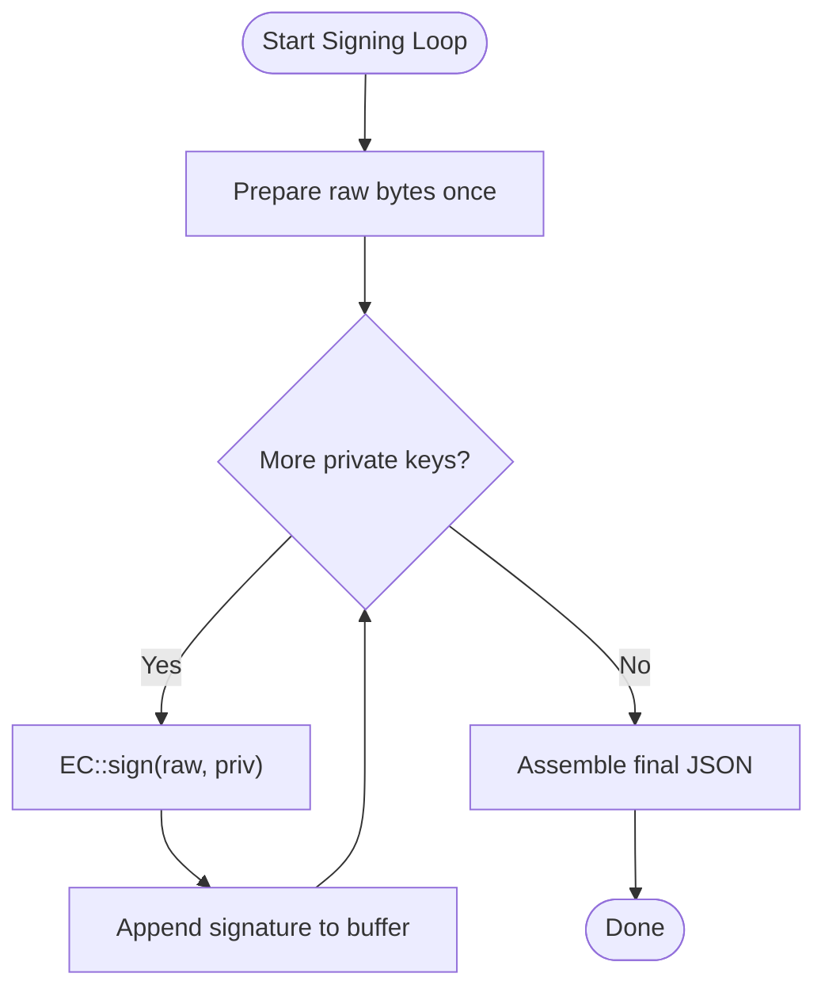
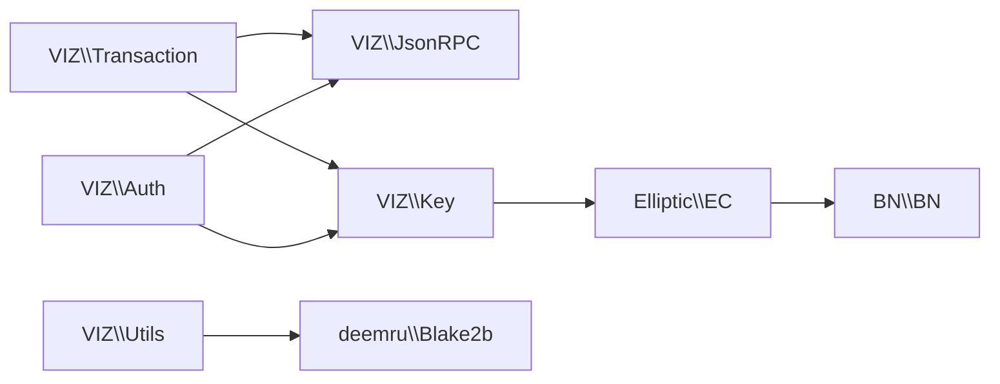

# Performance Optimization

<cite>
**Referenced Files in This Document**
- [README.md](file://README.md)
- [composer.json](file://composer.json)
- [class/autoloader.php](file://class/autoloader.php)
- [class/VIZ/Auth.php](file://class/VIZ/Auth.php)
- [class/VIZ/JsonRPC.php](file://class/VIZ/JsonRPC.php)
- [class/VIZ/Key.php](file://class/VIZ/Key.php)
- [class/VIZ/Transaction.php](file://class/VIZ/Transaction.php)
- [class/VIZ/Utils.php](file://class/VIZ/Utils.php)
- [class/Elliptic/EC.php](file://class/Elliptic/EC.php)
- [class/Elliptic/EC/KeyPair.php](file://class/Elliptic/EC/KeyPair.php)
- [class/Elliptic/EC/Signature.php](file://class/Elliptic/EC/Signature.php)
- [class/Elliptic/EdDSA.php](file://class/Elliptic/EdDSA.php)
- [class/BN/BN.php](file://class/BN/BN.php)
- [class/deemru/Blake2b.php](file://class/deemru/Blake2b.php)
</cite>

## Table of Contents
1. [Introduction](#introduction)
2. [Project Structure](#project-structure)
3. [Core Components](#core-components)
4. [Architecture Overview](#architecture-overview)
5. [Detailed Component Analysis](#detailed-component-analysis)
6. [Dependency Analysis](#dependency-analysis)
7. [Performance Considerations](#performance-considerations)
8. [Troubleshooting Guide](#troubleshooting-guide)
9. [Conclusion](#conclusion)
10. [Appendices](#appendices)

## Introduction
This document focuses on performance optimization techniques for the VIZ PHP Library. It covers memory management, computational efficiency, caching strategies, and production considerations. The goal is to help developers write efficient, scalable code when interacting with the VIZ blockchain via cryptographic signing, transaction building, and JSON-RPC communication.

## Project Structure
The library is organized around a small set of cohesive components:
- VIZ namespace: Key, Transaction, JsonRPC, Auth, Utils
- Elliptic: EC, EdDSA, KeyPair, Signature
- BN: Arbitrary precision arithmetic
- deemru: Blake2b hashing
- Autoloader and Composer configuration

**Diagram sources**
- [class/VIZ/Transaction.php](file://class/VIZ/Transaction.php#L1-L800)
- [class/VIZ/JsonRPC.php](file://class/VIZ/JsonRPC.php#L1-L354)
- [class/VIZ/Key.php](file://class/VIZ/Key.php#L1-L353)
- [class/VIZ/Auth.php](file://class/VIZ/Auth.php#L1-L70)
- [class/VIZ/Utils.php](file://class/VIZ/Utils.php#L1-L413)
- [class/Elliptic/EC.php](file://class/Elliptic/EC.php#L1-L272)
- [class/Elliptic/EC/KeyPair.php](file://class/Elliptic/EC/KeyPair.php#L1-L138)
- [class/Elliptic/EC/Signature.php](file://class/Elliptic/EC/Signature.php#L1-L208)
- [class/Elliptic/EdDSA.php](file://class/Elliptic/EdDSA.php#L1-L122)
- [class/BN/BN.php](file://class/BN/BN.php#L1-L200)
- [class/deemru/Blake2b.php](file://class/deemru/Blake2b.php#L1-L326)

**Section sources**
- [README.md](file://README.md#L1-L455)
- [composer.json](file://composer.json#L1-L32)
- [class/autoloader.php](file://class/autoloader.php#L1-L14)

## Core Components
- Key: Handles key generation, encoding/decoding, signing, verification, and shared-key derivation. Uses Elliptic curves for ECDSA and EdDSA.
- Transaction: Builds transactions, manages TAPOS, collects signatures, and executes broadcast requests via JsonRPC.
- JsonRPC: Low-level HTTP client for VIZ nodes with connection caching and basic gzip/chunked handling.
- Auth: Passwordless authentication verification against blockchain authority structures.
- Utils: Encoding/decoding, AES-256-CBC, VLQ helpers, and Voice protocol helpers.
- Elliptic: EC and EdDSA implementations with deterministic DRBG and signature recovery.
- BN: Arbitrary precision integer arithmetic used by elliptic curve operations.
- Blake2b: Fast hashing for internal use.

**Section sources**
- [class/VIZ/Key.php](file://class/VIZ/Key.php#L1-L353)
- [class/VIZ/Transaction.php](file://class/VIZ/Transaction.php#L1-L800)
- [class/VIZ/JsonRPC.php](file://class/VIZ/JsonRPC.php#L1-L354)
- [class/VIZ/Auth.php](file://class/VIZ/Auth.php#L1-L70)
- [class/VIZ/Utils.php](file://class/VIZ/Utils.php#L1-L413)
- [class/Elliptic/EC.php](file://class/Elliptic/EC.php#L1-L272)
- [class/Elliptic/EC/KeyPair.php](file://class/Elliptic/EC/KeyPair.php#L1-L138)
- [class/Elliptic/EC/Signature.php](file://class/Elliptic/EC/Signature.php#L1-L208)
- [class/Elliptic/EdDSA.php](file://class/Elliptic/EdDSA.php#L1-L122)
- [class/BN/BN.php](file://class/BN/BN.php#L1-L200)
- [class/deemru/Blake2b.php](file://class/deemru/Blake2b.php#L1-L326)

## Architecture Overview
High-level flow for signing and broadcasting a transaction:
1. Build operation payload and raw data.
2. Fetch TAPOS (reference block) via JsonRPC.
3. Sign raw data with private keys.
4. Assemble transaction JSON and broadcast.

**Diagram sources**
- [class/VIZ/Transaction.php](file://class/VIZ/Transaction.php#L61-L157)
- [class/VIZ/JsonRPC.php](file://class/VIZ/JsonRPC.php#L311-L353)
- [class/VIZ/Key.php](file://class/VIZ/Key.php#L302-L322)
- [class/Elliptic/EC.php](file://class/Elliptic/EC.php#L89-L177)

## Detailed Component Analysis

### Memory Management and Object Lifecycle
- Reuse instances where possible:
  - Keep a single JsonRPC instance per endpoint to reuse hostname-to-IP cache and avoid repeated DNS lookups.
  - Reuse Key instances for signing; avoid reconstructing Key objects repeatedly in tight loops.
  - Reuse Transaction instances for batching operations to minimize repeated TAPOS fetches.
- Avoid unnecessary copies:
  - Prefer passing references or reusing precomputed buffers (e.g., raw transaction bytes) rather than regenerating.
- Garbage collection considerations:
  - Large intermediate strings (hex-encoded signatures, raw transaction bytes) should be unset or reassigned after use to reduce peak memory.
  - Elliptic operations produce BN objects; ensure long-lived references are released promptly.

Practical tips:
- Cache endpoint-specific JsonRPC instances keyed by endpoint URL.
- Cache derived public keys or shared keys when reused across messages.
- Clear arrays holding signatures after assembling final transaction JSON.

**Section sources**
- [class/VIZ/JsonRPC.php](file://class/VIZ/JsonRPC.php#L169-L171)
- [class/VIZ/Transaction.php](file://class/VIZ/Transaction.php#L118-L144)
- [class/VIZ/Key.php](file://class/VIZ/Key.php#L302-L322)

### Computational Efficiency Improvements
- Cryptographic operation optimization:
  - Use compact signatures to reduce payload size and network overhead.
  - Minimize SHA-256 hashing by computing hashes once per message and reusing.
  - Prefer EdDSA for Ed25519 when applicable; it offers speed and simplicity.
- Batch processing:
  - Use Transaction queue mode to accumulate multiple operations into a single transaction, reducing TAPOS fetches and network round trips.
  - Reuse private keys across operations to avoid redundant key parsing.
- Algorithmic optimizations:
  - Precompute curve points and scalar multiplications where feasible.
  - Avoid repeated modulus checks by ensuring inputs are normalized early.

**Diagram sources**
- [class/VIZ/Transaction.php](file://class/VIZ/Transaction.php#L118-L144)
- [class/Elliptic/EC.php](file://class/Elliptic/EC.php#L89-L177)

**Section sources**
- [class/VIZ/Transaction.php](file://class/VIZ/Transaction.php#L42-L52)
- [class/Elliptic/EC.php](file://class/Elliptic/EC.php#L89-L177)

### Caching Strategies
- Frequently accessed blockchain data:
  - Cache get_dynamic_global_properties and get_block_header results per endpoint for a short TTL (e.g., seconds) to reduce latency and load.
  - Cache account data when performing multiple checks (e.g., authority thresholds).
- Transaction templates and reusable payloads:
  - Cache serialized operation payloads when constructing similar transactions repeatedly.
  - Cache derived public keys for the same private key across sessions.
- Key operations:
  - Cache shared keys derived from ephemeral keys to avoid recomputation.

Implementation pattern:
- Use an in-memory cache keyed by endpoint + method + params.
- Invalidate entries on explicit state changes (e.g., new block number).

[No sources needed since this section provides general guidance]

### Practical Examples: Profiling, Bottlenecks, and Fixes
- Profiling:
  - Measure wall-clock time around TAPOS fetches and signing operations.
  - Profile signature generation separately from JSON assembly.
- Bottlenecks:
  - High CPU usage during ECDSA signing indicates repeated hashing or key parsing; fix by caching parsed keys and computed hashes.
  - Network latency dominated by TAPOS fetches; reduce by batching operations.
- Optimizations applied:
  - Enable queue mode in Transaction to batch operations.
  - Reuse JsonRPC instances per endpoint.
  - Use compact signatures and avoid extra conversions.

[No sources needed since this section provides general guidance]

## Dependency Analysis
The following diagram shows key dependencies among core components:

**Diagram sources**
- [class/VIZ/Transaction.php](file://class/VIZ/Transaction.php#L1-L800)
- [class/VIZ/JsonRPC.php](file://class/VIZ/JsonRPC.php#L1-L354)
- [class/VIZ/Key.php](file://class/VIZ/Key.php#L1-L353)
- [class/Elliptic/EC.php](file://class/Elliptic/EC.php#L1-L272)
- [class/BN/BN.php](file://class/BN/BN.php#L1-L200)
- [class/VIZ/Utils.php](file://class/VIZ/Utils.php#L1-L413)
- [class/VIZ/Auth.php](file://class/VIZ/Auth.php#L1-L70)
- [class/deemru/Blake2b.php](file://class/deemru/Blake2b.php#L1-L326)

**Section sources**
- [composer.json](file://composer.json#L19-L29)

## Performance Considerations
- Resource limits:
  - Respect PHP memory limits; avoid building very large transactions in memory. Consider streaming or chunking for extremely large payloads.
  - Limit concurrent network requests to prevent timeouts and resource exhaustion.
- Concurrent operations:
  - Serialize signing operations if underlying crypto primitives are not thread-safe.
  - Use separate JsonRPC instances per endpoint to avoid contention.
- Scalability patterns:
  - Use worker pools for high-throughput signing and broadcasting.
  - Cache TAPOS data per endpoint and invalidate on fork events.
  - Offload heavy computations (e.g., large batch signing) to background jobs.

[No sources needed since this section provides general guidance]

## Troubleshooting Guide
Common performance issues and remedies:
- Slow signing:
  - Cause: Recomputing hashes or parsing keys repeatedly.
  - Fix: Cache parsed keys and computed hashes; reuse Key instances.
- High network latency:
  - Cause: Frequent TAPOS fetches.
  - Fix: Use Transaction queue mode; reuse JsonRPC instances; cache DGP and block headers.
- Memory spikes:
  - Cause: Accumulating large strings (hex-encoded signatures).
  - Fix: Clear temporary arrays and strings after use; unset large variables.

**Section sources**
- [class/VIZ/Transaction.php](file://class/VIZ/Transaction.php#L61-L157)
- [class/VIZ/JsonRPC.php](file://class/VIZ/JsonRPC.php#L169-L171)
- [class/VIZ/Key.php](file://class/VIZ/Key.php#L302-L322)

## Conclusion
Optimizing the VIZ PHP Library involves careful memory management, minimizing cryptographic work through reuse and caching, and batching operations to reduce network overhead. By applying the strategies outlined here—instance reuse, caching, compact signatures, and structured batching—you can achieve significant performance gains in production environments.

## Appendices

### API/Method Performance Notes
- JsonRPC:
  - Hostname resolution is cached per endpoint to reduce DNS overhead.
  - Basic gzip and chunked transfer decoding are supported.
- Transaction:
  - TAPOS fetching is optimized by preferring last irreversible block reference when available.
  - Queue mode reduces repeated TAPOS queries and improves throughput.

**Section sources**
- [class/VIZ/JsonRPC.php](file://class/VIZ/JsonRPC.php#L169-L171)
- [class/VIZ/Transaction.php](file://class/VIZ/Transaction.php#L62-L113)