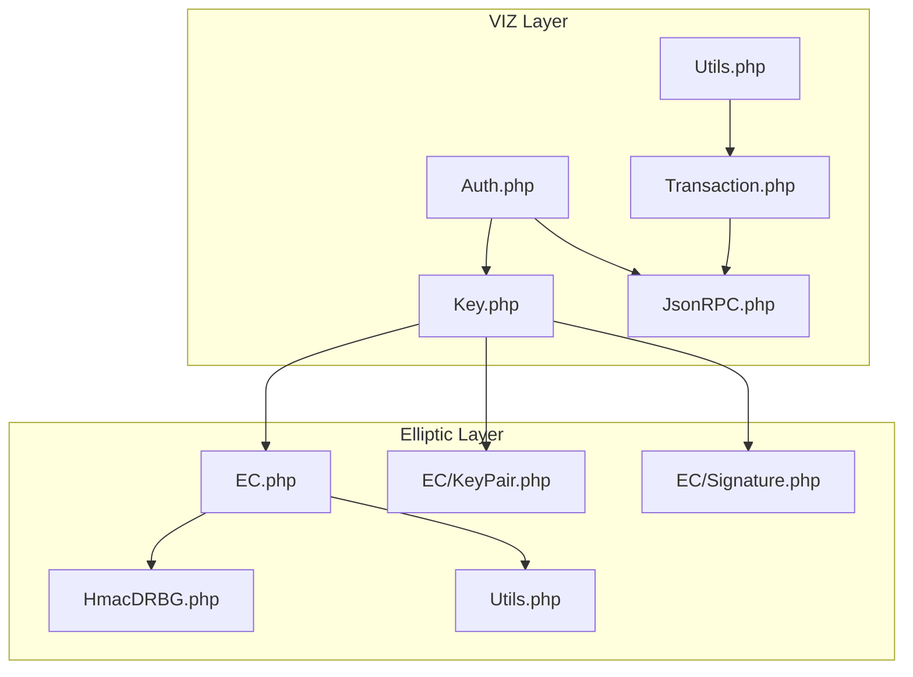
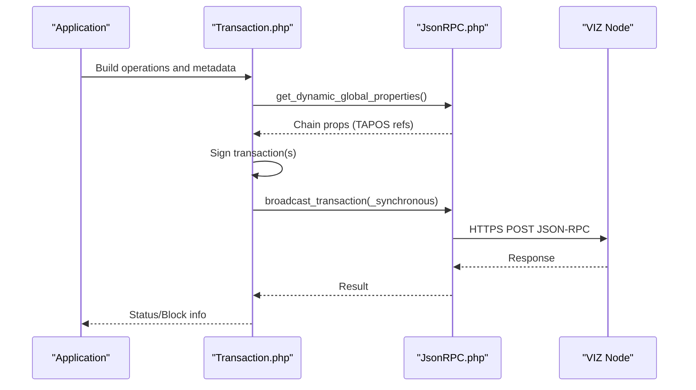
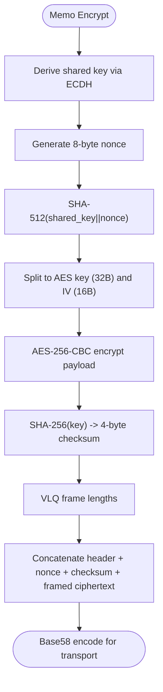
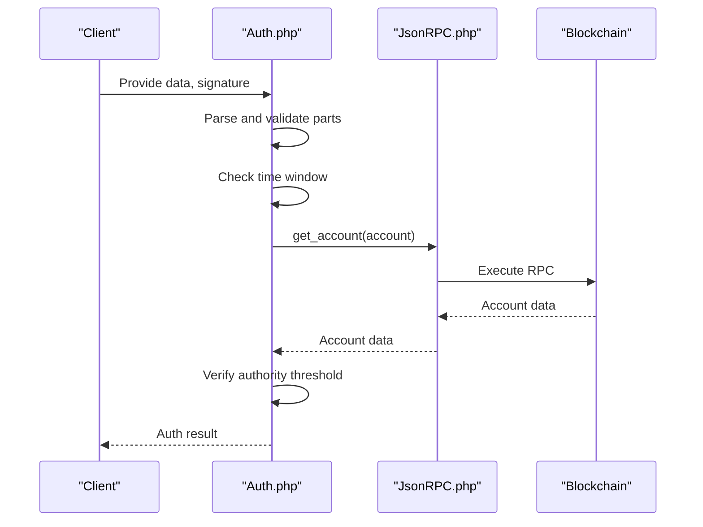
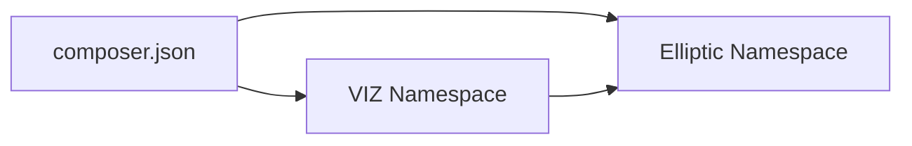

# Security Considerations

<cite>
**Referenced Files in This Document**
- [Auth.php](file://class/VIZ/Auth.php)
- [Key.php](file://class/VIZ/Key.php)
- [Utils.php](file://class/VIZ/Utils.php)
- [JsonRPC.php](file://class/VIZ/JsonRPC.php)
- [Transaction.php](file://class/VIZ/Transaction.php)
- [EC.php](file://class/Elliptic/EC.php)
- [HmacDRBG.php](file://class/Elliptic/HmacDRBG.php)
- [Utils.php](file://class/Elliptic/Utils.php)
- [KeyPair.php](file://class/Elliptic/EC/KeyPair.php)
- [Signature.php](file://class/Elliptic/EC/Signature.php)
- [composer.json](file://composer.json)
- [README.md](file://README.md)
- [TestKeys.php](file://tests/TestKeys.php)
</cite>

## Table of Contents
1. [Introduction](#introduction)
2. [Project Structure](#project-structure)
3. [Core Components](#core-components)
4. [Architecture Overview](#architecture-overview)
5. [Detailed Component Analysis](#detailed-component-analysis)
6. [Dependency Analysis](#dependency-analysis)
7. [Performance Considerations](#performance-considerations)
8. [Troubleshooting Guide](#troubleshooting-guide)
9. [Conclusion](#conclusion)
10. [Appendices](#appendices)

## Introduction
This document provides comprehensive security considerations for the VIZ PHP Library. It focuses on cryptographic security best practices, secure key generation and storage, network security, input validation, and operational security practices such as audits, assessments, and incident response. The goal is to help maintainers and users apply robust security controls when integrating and operating the library.

## Project Structure
The library is organized around cryptographic primitives, key management, transaction building, JSON-RPC communication, and utilities. The most relevant security-relevant modules are:
- VIZ namespace: Key, Auth, Utils, JsonRPC, Transaction
- Elliptic namespace: EC, EC KeyPair, EC Signature, HmacDRBG, Utils
- Tests: Basic unit tests for key and signature verification

**Diagram sources**
- [Key.php](file://class/VIZ/Key.php#L1-L353)
- [Auth.php](file://class/VIZ/Auth.php#L1-L70)
- [Utils.php](file://class/VIZ/Utils.php#L1-L413)
- [JsonRPC.php](file://class/VIZ/JsonRPC.php#L1-L354)
- [Transaction.php](file://class/VIZ/Transaction.php#L1-L800)
- [EC.php](file://class/Elliptic/EC.php#L1-L272)
- [KeyPair.php](file://class/Elliptic/EC/KeyPair.php#L1-L138)
- [Signature.php](file://class/Elliptic/EC/Signature.php#L1-L208)
- [HmacDRBG.php](file://class/Elliptic/HmacDRBG.php#L1-L132)
- [Utils.php](file://class/Elliptic/Utils.php#L1-L163)

**Section sources**
- [composer.json](file://composer.json#L1-L32)
- [README.md](file://README.md#L1-L455)

## Core Components
- Key management and cryptography: secp256k1 ECDSA signing/verification, ECDH shared key derivation, memo encryption/decryption, WIF/base58 encoding/decoding, deterministic signature generation with HMAC_DRBG.
- Authentication: passwordless auth data generation and verification against blockchain authority thresholds.
- Network transport: JSON-RPC client with SSL/TLS configuration and optional strict verification.
- Transactions: TAPOS-based transaction construction, multi-signature assembly, and broadcast to nodes.

Security-relevant highlights:
- ECDSA signatures use deterministic nonce generation via HMAC_DRBG to avoid nonce reuse vulnerabilities.
- Memo encryption uses AES-256-CBC with a per-message nonce and checksum for integrity.
- JSON-RPC supports SSL/TLS and peer verification controls.

**Section sources**
- [Key.php](file://class/VIZ/Key.php#L1-L353)
- [Auth.php](file://class/VIZ/Auth.php#L1-L70)
- [JsonRPC.php](file://class/VIZ/JsonRPC.php#L1-L354)
- [Transaction.php](file://class/VIZ/Transaction.php#L1-L800)
- [EC.php](file://class/Elliptic/EC.php#L1-L272)
- [HmacDRBG.php](file://class/Elliptic/HmacDRBG.php#L1-L132)
- [Utils.php](file://class/VIZ/Utils.php#L291-L320)

## Architecture Overview
The library’s security-critical flows involve:
- Cryptographic operations (signing, verification, shared key derivation)
- Transport security (TLS configuration and verification)
- Authentication checks (domain/action/authority/time-bound)
- Transaction lifecycle (TAPOS, signing, broadcasting)

**Diagram sources**
- [Transaction.php](file://class/VIZ/Transaction.php#L61-L157)
- [JsonRPC.php](file://class/VIZ/JsonRPC.php#L311-L353)

## Detailed Component Analysis

### Cryptographic Security Best Practices
- Secure key generation and randomness:
  - Deterministic ECDSA nonce generation via HMAC_DRBG ensures resistance to nonce reuse and improves timing-attack resilience.
  - Randomness for memo encryption uses a per-message nonce and a 64-bit integer, combined with a shared ECDH key to derive a 512-bit key for SHA-512, then split into AES key and IV.
- Timing attack considerations:
  - EC sign routine adjusts bit-length of intermediate values to prevent timing leakage during scalar multiplication.
  - Signature verification uses constant-time comparisons and avoids early exits on invalid inputs.

Recommendations:
- Prefer deterministic nonce generation for all ECDSA operations.
- Ensure all comparisons (checksums, thresholds) are performed in constant time.
- Use cryptographically secure RNG for any non-cryptographic randomness needs.

**Section sources**
- [EC.php](file://class/Elliptic/EC.php#L89-L177)
- [EC.php](file://class/Elliptic/EC.php#L189-L219)
- [HmacDRBG.php](file://class/Elliptic/HmacDRBG.php#L98-L131)
- [Key.php](file://class/VIZ/Key.php#L45-L86)
- [Key.php](file://class/VIZ/Key.php#L106-L176)

### Secure Key Generation and Storage
- Key generation:
  - Hash-based key derivation from seeds/salts produces deterministic WIF-encoded private keys and corresponding public keys.
  - Public key extraction uses compressed encoding for compactness and compatibility.
- Key storage:
  - Private keys are held in memory as binary/hex internally; no plaintext persistence is performed by the library.
  - Base58 encoding/decoding is used for WIF and public key representations.

Recommendations:
- Store private keys encrypted at rest using strong symmetric ciphers (e.g., AES-256-GCM) with hardware-backed key derivation (PBKDF2/Argon2).
- Use OS keychains/secrets managers (e.g., Vault, OS keystore) for ephemeral secrets.
- Avoid logging sensitive keys or signatures; sanitize logs and environment variables.
- Apply secure deletion mechanisms (overwrite memory, zeroize buffers) after use.

**Section sources**
- [Key.php](file://class/VIZ/Key.php#L185-L210)
- [Key.php](file://class/VIZ/Key.php#L261-L286)
- [Utils.php](file://class/VIZ/Utils.php#L212-L290)

### Memo Encryption and Integrity
- Encryption flow:
  - ECDH shared key derived from local private and remote public key.
  - Per-message 8-byte nonce concatenated with shared key hashed to 512 bits; first 32 bytes as AES key, next 16 bytes as IV.
  - SHA-256 checksum of the encryption key is truncated to 4 bytes and stored with ciphertext.
  - VLQ framing is applied to lengths for compatibility.
- Decryption flow:
  - Validates checksum before attempting decryption.
  - Uses extracted AES key/IV to decrypt and reconstruct original payload.

Recommendations:
- Always verify checksum prior to decryption.
- Use authenticated encryption (AEAD) where possible (e.g., AES-256-GCM) to protect against tampering.
- Ensure nonce uniqueness per message; consider a counter or random nonce with collision detection.

**Diagram sources**
- [Key.php](file://class/VIZ/Key.php#L45-L86)
- [Utils.php](file://class/VIZ/Utils.php#L291-L320)

**Section sources**
- [Key.php](file://class/VIZ/Key.php#L45-L86)
- [Key.php](file://class/VIZ/Key.php#L87-L176)
- [Utils.php](file://class/VIZ/Utils.php#L321-L383)

### Passwordless Authentication
- Data format: domain:action:account:authority:unixtime:nonce
- Verification steps:
  - Time window validation against configured range.
  - Authority threshold check against account’s authority weights.
  - Public key recovered from signature and matched against account’s key_auths.

Recommendations:
- Enforce strict time windows and reject stale tokens.
- Validate domain/action/authority precisely; avoid wildcard matches.
- Store and compare authority identifiers securely; ensure thresholds are fetched fresh from the chain.

**Diagram sources**
- [Auth.php](file://class/VIZ/Auth.php#L25-L69)
- [JsonRPC.php](file://class/VIZ/JsonRPC.php#L311-L353)

**Section sources**
- [Auth.php](file://class/VIZ/Auth.php#L17-L69)
- [JsonRPC.php](file://class/VIZ/JsonRPC.php#L311-L353)

### Network Security Considerations
- TLS configuration:
  - JSON-RPC client supports HTTPS/WSS and sets peer name for SNI.
  - Peer verification can be disabled via a flag; default behavior verifies peers.
- Endpoint validation:
  - Hostname resolution is cached; ensure endpoints are validated before use.
- Man-in-the-Middle (MITM) prevention:
  - Keep peer verification enabled in production.
  - Pin trusted CAs or use certificate validation policies.

Recommendations:
- Disable insecure mode only in controlled environments.
- Validate node endpoints against known good lists.
- Monitor for certificate errors and enforce strict failure modes.

**Section sources**
- [JsonRPC.php](file://class/VIZ/JsonRPC.php#L175-L222)
- [JsonRPC.php](file://class/VIZ/JsonRPC.php#L332-L353)

### Input Validation, Sanitization, and Injection Protection
- Transaction builders assemble JSON and raw encodings from inputs; care must be taken to:
  - Validate numeric fields, asset strings, and public keys before encoding.
  - Reject malformed or out-of-range values.
- Memo encryption/decryption relies on binary-safe operations; ensure inputs are properly sanitized before framing.

Recommendations:
- Validate and normalize all inputs (strings, amounts, weights, authorities).
- Use strict type checks and length limits for all fields.
- Escape or reject special characters in textual fields where applicable.

**Section sources**
- [Transaction.php](file://class/VIZ/Transaction.php#L191-L350)
- [Utils.php](file://class/VIZ/Utils.php#L291-L320)

### Security Audit Guidelines
- Cryptographic review:
  - Confirm deterministic nonce usage and HMAC_DRBG configuration.
  - Verify signature encoding/decoding correctness and recovery parameters.
- Operational hygiene:
  - Review key lifecycle (generation, rotation, deletion).
  - Validate transport security settings and CA trust policies.
- Compliance readiness:
  - Maintain audit logs for signing events and transaction broadcasts.
  - Implement segregation of duties for multi-signature workflows.

[No sources needed since this section provides general guidance]

### Vulnerability Assessment Procedures
- Static analysis:
  - Scan for hardcoded secrets, weak randomness, and unsafe string operations.
- Dynamic testing:
  - Fuzz transaction builders with malformed inputs.
  - Test authentication with expired/expired tokens and mismatched domains/actions.
- Penetration testing:
  - Validate TLS pinning and certificate validation.
  - Assess resilience against timing side channels in signature routines.

[No sources needed since this section provides general guidance]

### Incident Response Protocols
- Immediate actions:
  - Revoke compromised keys and rotate secrets.
  - Audit logs for suspicious signing or broadcast attempts.
- Forensic steps:
  - Preserve transaction traces and request/response logs.
  - Isolate affected systems and review access controls.
- Recovery:
  - Restore from backups with hardened credentials.
  - Update configurations to enforce stricter security policies.

[No sources needed since this section provides general guidance]

## Dependency Analysis
External dependencies and their security relevance:
- Elliptic curve libraries (BN, BI) and Keccak hashing are used for cryptographic operations.
- OpenSSL is used for AES-256-CBC and TLS operations.

**Diagram sources**
- [composer.json](file://composer.json#L19-L28)

**Section sources**
- [composer.json](file://composer.json#L1-L32)

## Performance Considerations
- ECDSA signing and verification performance depends on curve operations; ensure adequate entropy sources and avoid excessive retries.
- Memo encryption/decryption adds overhead proportional to message size; consider streaming for large payloads.
- JSON-RPC calls should batch where possible and leverage caching for repeated queries.

[No sources needed since this section provides general guidance]

## Troubleshooting Guide
Common security-related issues and mitigations:
- Signature not found during signing:
  - The signing routine retries with incremented nonce until a canonical signature is produced; ensure sufficient iterations are allowed.
- Authentication failures:
  - Verify time synchronization and timezone handling; adjust server timezone offset if needed.
  - Confirm authority thresholds and key weights match the account configuration.
- Transport errors:
  - Check TLS settings and peer verification; ensure certificates are valid and not self-signed unless explicitly permitted.

**Section sources**
- [Key.php](file://class/VIZ/Key.php#L340-L352)
- [Auth.php](file://class/VIZ/Auth.php#L25-L69)
- [JsonRPC.php](file://class/VIZ/JsonRPC.php#L189-L222)

## Conclusion
The VIZ PHP Library implements sound cryptographic foundations with deterministic nonce generation, secure memo encryption, and robust authentication flows. To maintain strong security posture, adopt encrypted storage for keys, enforce strict TLS verification, validate all inputs, and establish continuous auditing and incident response procedures.

[No sources needed since this section summarizes without analyzing specific files]

## Appendices

### Security Testing Methodologies
- Unit tests for key and signature verification:
  - Validate deterministic key derivation and signature verification.
- Integration tests for authentication:
  - Simulate time window violations and authority mismatches.
- Fuzzing:
  - Inject malformed transaction payloads and RPC responses.

**Section sources**
- [TestKeys.php](file://tests/TestKeys.php#L9-L27)
- [README.md](file://README.md#L40-L67)