# Authentication Flow

<cite>
**Referenced Files in This Document**
- [Auth.php](file://class/VIZ/Auth.php)
- [Key.php](file://class/VIZ/Key.php)
- [JsonRPC.php](file://class/VIZ/JsonRPC.php)
- [Transaction.php](file://class/VIZ/Transaction.php)
- [Utils.php](file://class/VIZ/Utils.php)
- [EC.php](file://class/Elliptic/EC.php)
- [EC/Signature.php](file://class/Elliptic/EC/Signature.php)
- [README.md](file://README.md)
</cite>

## Table of Contents
1. [Introduction](#introduction)
2. [Authentication Architecture](#authentication-architecture)
3. [Core Components](#core-components)
4. [Authentication Workflow](#authentication-workflow)
5. [Data Generation Process](#data-generation-process)
6. [Signature Creation](#signature-creation)
7. [Public Key Recovery](#public-key-recovery)
8. [Account Validation](#account-validation)
9. [Authority Verification](#authority-verification)
10. [Error Handling](#error-handling)
11. [Integration Patterns](#integration-patterns)
12. [Synchronous vs Asynchronous Implementation](#synchronous-vs-asynchronous-implementation)
13. [Security Considerations](#security-considerations)
14. [Troubleshooting Guide](#troubleshooting-guide)
15. [Conclusion](#conclusion)

## Introduction

The Authentication Flow in the VIZ PHP Library provides a comprehensive passwordless authentication mechanism that leverages cryptographic signatures and blockchain-based account validation. This system enables secure authentication without traditional passwords by combining private key signatures with blockchain account verification.

The authentication process follows a structured workflow that includes data generation, cryptographic signing, public key recovery, account validation via JSON-RPC, and authority verification against blockchain-stored account permissions.

## Authentication Architecture

The authentication system is built around several interconnected components that work together to provide secure passwordless authentication:

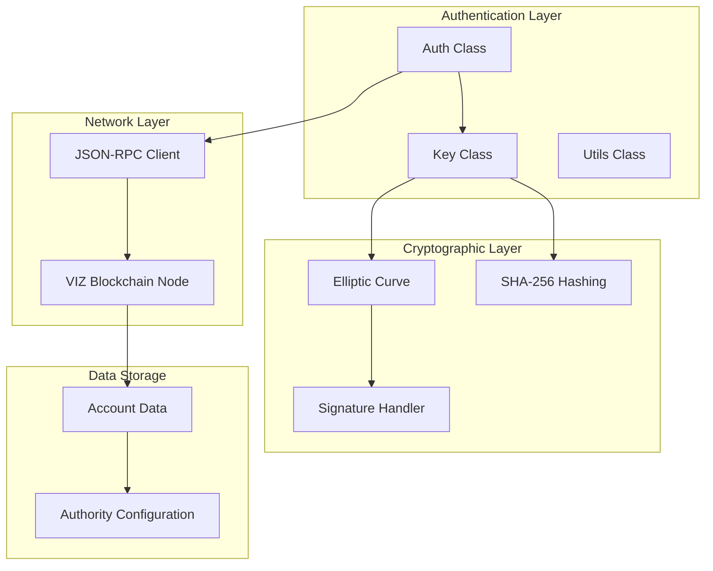

**Diagram sources**
- [Auth.php](file://class/VIZ/Auth.php#L9-L24)
- [Key.php](file://class/VIZ/Key.php#L9-L32)
- [JsonRPC.php](file://class/VIZ/JsonRPC.php#L4-L22)

## Core Components

### Authentication Class (Auth)

The [`Auth`](file://class/VIZ/Auth.php#L9-L70) class serves as the primary interface for authentication operations. It manages the authentication lifecycle, validates received authentication data, and performs comprehensive account verification.

Key responsibilities include:
- Managing authentication parameters (domain, action, authority, time range)
- Validating authentication data format and timestamps
- Performing public key recovery from signatures
- Executing account validation via JSON-RPC
- Verifying authority thresholds and weights

### Key Management (Key)

The [`Key`](file://class/VIZ/Key.php#L9-L353) class provides comprehensive cryptographic operations including:
- Private key generation and management
- Public key derivation from private keys
- Digital signature creation and verification
- Public key recovery from signatures
- Key encoding and decoding (WIF format, compressed/uncompressed)

### Cryptographic Engine

The system utilizes the [`Elliptic`](file://class/Elliptic/EC.php#L9-L272) class for elliptic curve cryptography operations, specifically secp256k1 curve operations for Bitcoin-compatible signatures.

**Section sources**
- [Auth.php](file://class/VIZ/Auth.php#L9-L70)
- [Key.php](file://class/VIZ/Key.php#L9-L353)
- [EC.php](file://class/Elliptic/EC.php#L9-L272)

## Authentication Workflow

The authentication process follows a systematic workflow that ensures security and reliability:

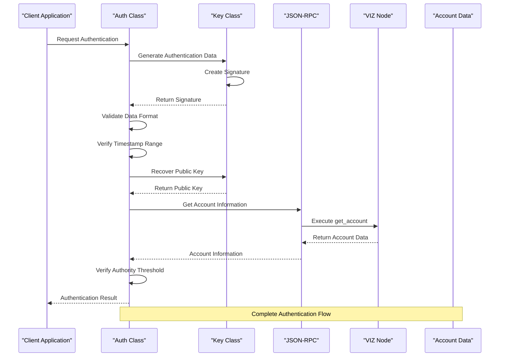

**Diagram sources**
- [Auth.php](file://class/VIZ/Auth.php#L25-L69)
- [Key.php](file://class/VIZ/Key.php#L323-L352)
- [JsonRPC.php](file://class/VIZ/JsonRPC.php#L311-L353)

## Data Generation Process

The authentication data generation process creates a structured string containing all necessary authentication parameters:

### Data Format Structure

The authentication data follows this format:
```
domain:action:account:authority:unixtime:nonce
```

Where:
- **domain**: Application domain identifier
- **action**: Authentication action type (default: 'auth')
- **account**: Target account name
- **authority**: Authority level ('regular', 'active', 'master')
- **unixtime**: Current Unix timestamp
- **nonce**: Incremental counter for uniqueness

### Generation Process

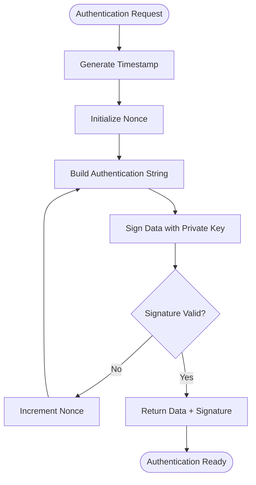

**Diagram sources**
- [Key.php](file://class/VIZ/Key.php#L339-L352)

**Section sources**
- [Key.php](file://class/VIZ/Key.php#L339-L352)

## Signature Creation

The signature creation process involves multiple cryptographic steps to ensure security and compliance:

### Cryptographic Operations

1. **Data Hashing**: SHA-256 hashing of the authentication data
2. **Private Key Signing**: ECDSA signature using secp256k1 curve
3. **Canonical Signature**: Ensuring standardized signature format
4. **Compact Encoding**: Optimized signature representation

### Signature Generation Flow

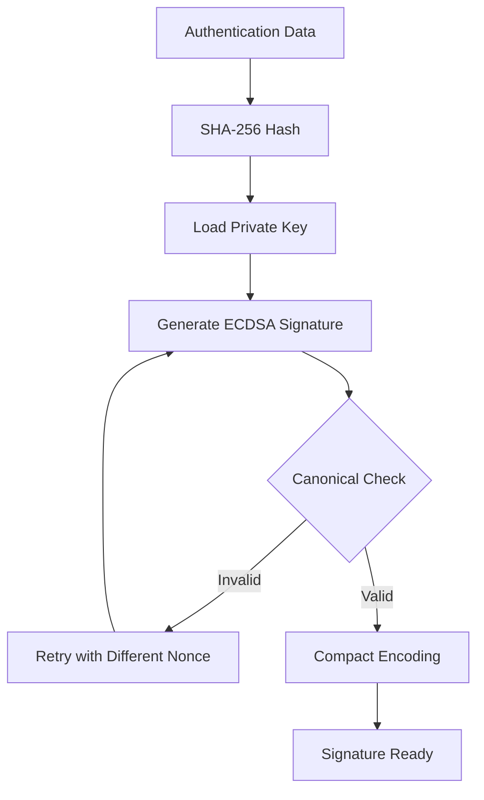

**Diagram sources**
- [Key.php](file://class/VIZ/Key.php#L302-L311)
- [EC.php](file://class/Elliptic/EC.php#L89-L177)

**Section sources**
- [Key.php](file://class/VIZ/Key.php#L302-L311)
- [EC.php](file://class/Elliptic/EC.php#L89-L177)

## Public Key Recovery

Public key recovery is a critical step that allows verification without requiring the original public key:

### Recovery Process

The system uses the signature's recovery parameter to reconstruct the public key:

1. **Signature Analysis**: Extract recovery parameter from signature header
2. **Curve Point Reconstruction**: Use elliptic curve mathematics to recover public key
3. **Validation**: Verify recovered key matches signature
4. **Encoding**: Convert to standard VIZ public key format

### Recovery Algorithm

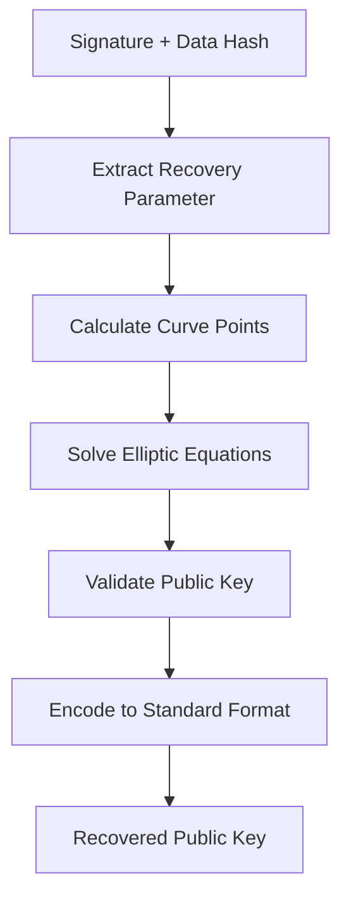

**Diagram sources**
- [Key.php](file://class/VIZ/Key.php#L323-L338)
- [EC.php](file://class/Elliptic/EC.php#L221-L249)

**Section sources**
- [Key.php](file://class/VIZ/Key.php#L323-L338)
- [EC.php](file://class/Elliptic/EC.php#L221-L249)

## Account Validation

Account validation ensures the target account exists and is properly configured on the blockchain:

### Validation Steps

1. **Account Lookup**: Query blockchain for account information
2. **Existence Verification**: Confirm account name matches expected value
3. **Authority Configuration**: Retrieve authority thresholds and key weights
4. **Key Matching**: Verify recovered public key matches account authorities

### Account Data Retrieval

The system queries the blockchain using the JSON-RPC interface to retrieve account information:

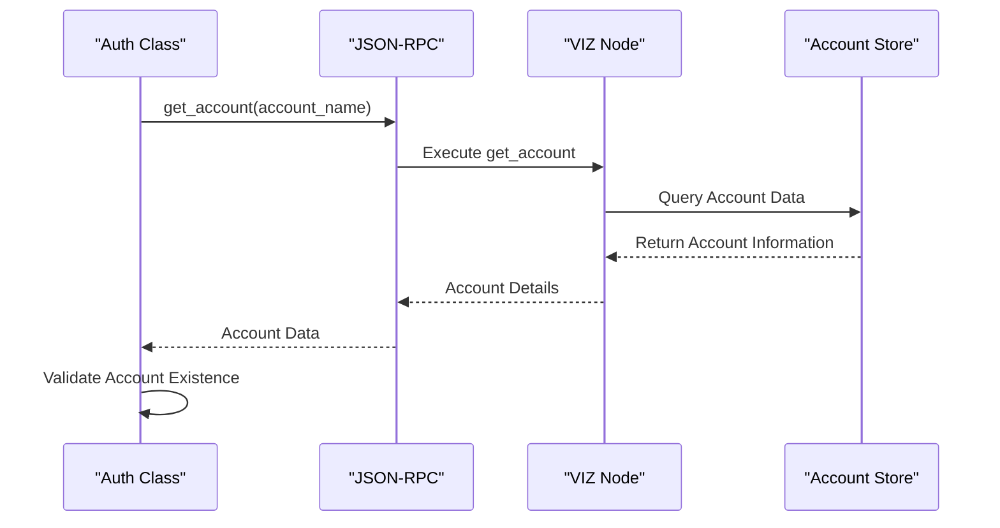

**Diagram sources**
- [Auth.php](file://class/VIZ/Auth.php#L44-L61)
- [JsonRPC.php](file://class/VIZ/JsonRPC.php#L311-L353)

**Section sources**
- [Auth.php](file://class/VIZ/Auth.php#L44-L61)
- [JsonRPC.php](file://class/VIZ/JsonRPC.php#L311-L353)

## Authority Verification

Authority verification ensures that the recovered public key meets the required authority threshold:

### Verification Process

1. **Threshold Comparison**: Compare total weight against required threshold
2. **Key Authorization**: Match recovered public key against authorized keys
3. **Weight Accumulation**: Sum weights of matching authorized keys
4. **Authorization Decision**: Determine if authorization is satisfied

### Authority Structure

The system supports multiple authority levels:
- **Regular**: Standard operational authority
- **Active**: Administrative operations
- **Master**: Highest level authority

**Section sources**
- [Auth.php](file://class/VIZ/Auth.php#L47-L59)

## Error Handling

The authentication system implements comprehensive error handling to manage various failure scenarios:

### Common Error Scenarios

| Error Type | Cause | Resolution |
|------------|--------|------------|
| Invalid Signature | Malformed signature or wrong curve | Regenerate signature with correct parameters |
| Expired Timestamp | Time outside acceptable range | Adjust system time or increase range |
| Unknown Account | Account doesn't exist on blockchain | Verify account name and network connectivity |
| Insufficient Authority | Weight below threshold | Add authorized keys or adjust weights |
| Network Failure | Node connectivity issues | Retry connection or switch node |

### Error Handling Flow

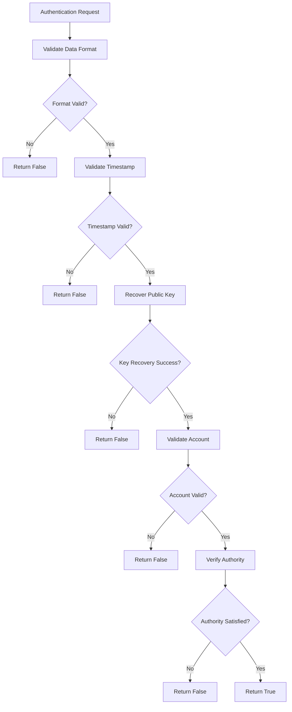

**Diagram sources**
- [Auth.php](file://class/VIZ/Auth.php#L25-L69)

**Section sources**
- [Auth.php](file://class/VIZ/Auth.php#L25-L69)

## Integration Patterns

The authentication system supports multiple integration patterns for different application architectures:

### Web Application Integration

For web applications, the authentication flow typically follows this pattern:

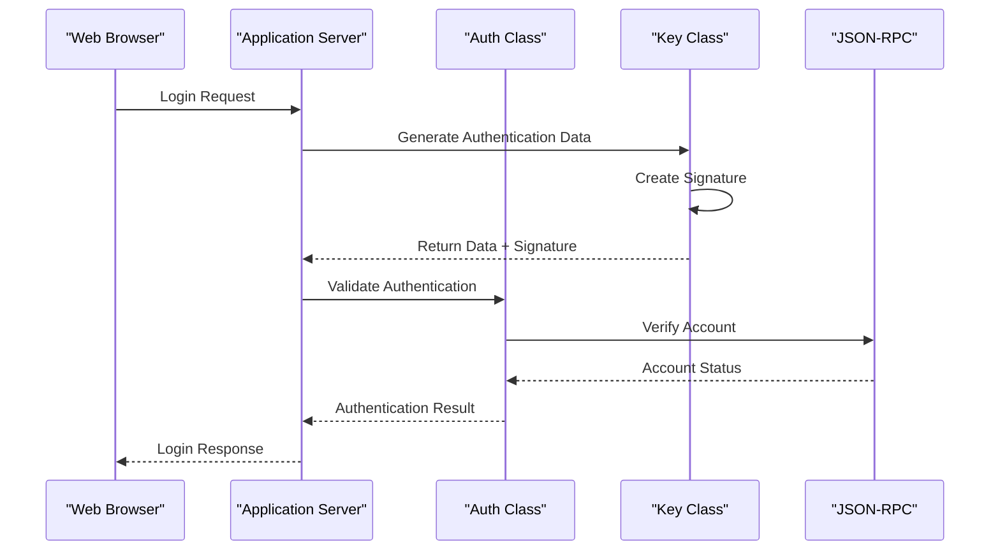

### Mobile Application Integration

Mobile applications can implement authentication with local key storage and periodic validation:

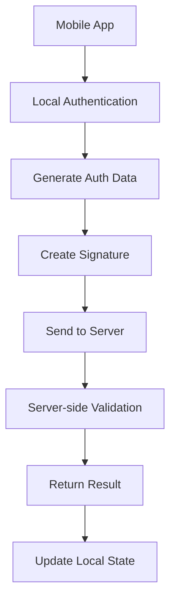

### Microservice Architecture

In microservice environments, authentication can be distributed across services:

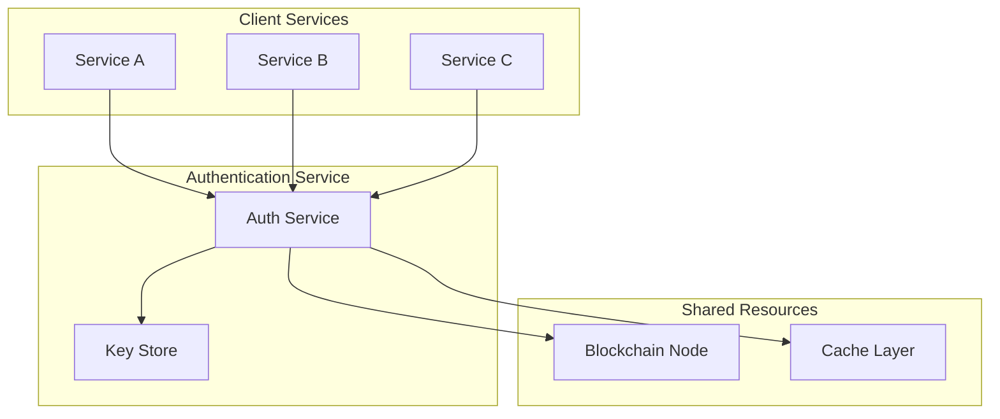

## Synchronous vs Asynchronous Implementation

The authentication system supports both synchronous and asynchronous execution patterns:

### Synchronous Authentication

Synchronous authentication waits for the complete validation process to complete:

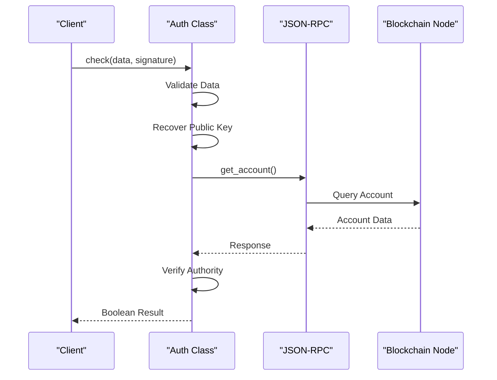

### Asynchronous Authentication

Asynchronous authentication allows non-blocking operation:

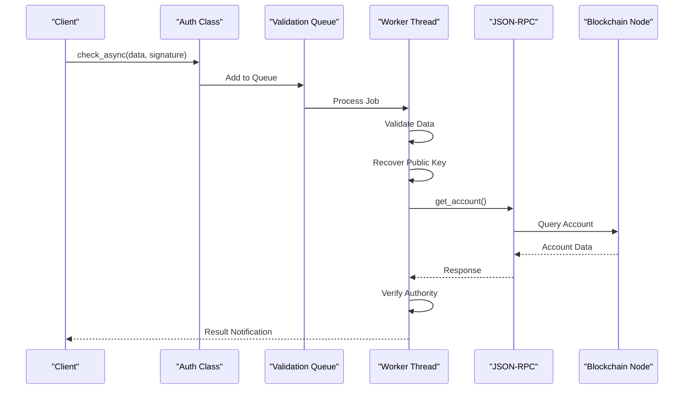

**Section sources**
- [Auth.php](file://class/VIZ/Auth.php#L25-L69)

## Security Considerations

The authentication system implements several security measures:

### Time-based Security

- **Timestamp Validation**: Prevents replay attacks through time window validation
- **Configurable Range**: Allows adjustment of acceptable time differences
- **Server Timezone Handling**: Automatic timezone offset correction

### Cryptographic Security

- **Standard ECDSA**: Uses proven secp256k1 curve cryptography
- **Canonical Signatures**: Ensures consistent signature format
- **Secure Randomness**: Utilizes cryptographically secure random number generation

### Network Security

- **JSON-RPC Validation**: Validates all RPC responses
- **Error Handling**: Comprehensive error detection and reporting
- **Timeout Management**: Prevents hanging connections

## Troubleshooting Guide

Common issues and their solutions:

### Authentication Fails Immediately

**Symptoms**: Authentication returns false immediately
**Causes**: 
- Incorrect data format
- Expired timestamp
- Wrong authority level
**Solutions**:
- Verify data format matches expected structure
- Check system clock synchronization
- Confirm authority level matches account configuration

### Network Connectivity Issues

**Symptoms**: Authentication hangs or fails with timeout
**Causes**:
- Node unavailability
- Network connectivity problems
- SSL certificate issues
**Solutions**:
- Test node connectivity separately
- Verify SSL certificate validity
- Check firewall and proxy settings

### Signature Verification Failures

**Symptoms**: Public key recovery fails or signature verification errors
**Causes**:
- Corrupted signature data
- Wrong private key used
- Data modification during transmission
**Solutions**:
- Re-generate signature using original private key
- Verify signature integrity during transmission
- Check for data encoding/decoding issues

**Section sources**
- [Auth.php](file://class/VIZ/Auth.php#L25-L69)
- [Key.php](file://class/VIZ/Key.php#L323-L338)

## Conclusion

The VIZ PHP Library's Authentication Flow provides a robust, secure, and flexible solution for passwordless authentication. By combining cryptographic signatures with blockchain-based account validation, it offers enterprise-grade security while maintaining ease of integration.

The system's modular architecture allows for various integration patterns, from simple web applications to complex microservice environments. Its comprehensive error handling and security measures ensure reliable operation in production environments.

Key benefits include:
- **Enhanced Security**: Eliminates password-related vulnerabilities
- **Blockchain Integration**: Leverages decentralized trust model
- **Flexible Architecture**: Supports multiple deployment patterns
- **Comprehensive Validation**: Multi-layered security checks
- **Developer Friendly**: Clear APIs and extensive documentation

The authentication system represents a modern approach to identity verification that leverages the strengths of blockchain technology while maintaining the simplicity and reliability expected in production applications.