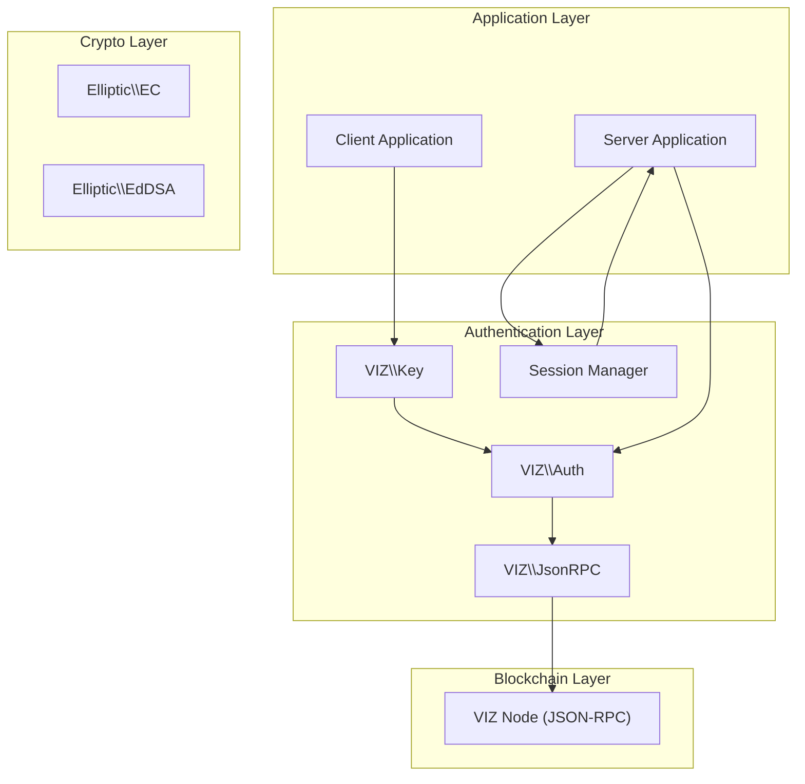
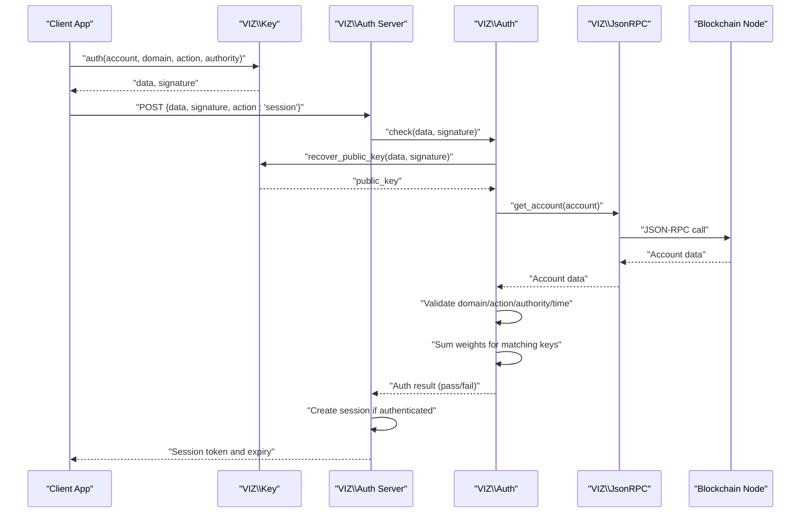
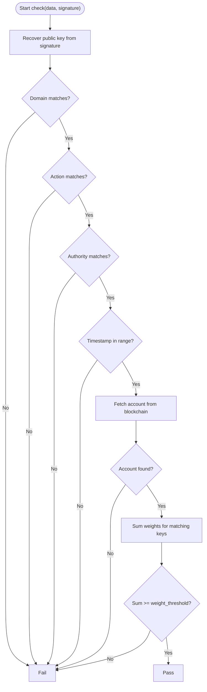
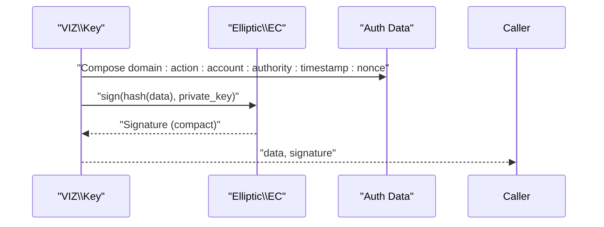
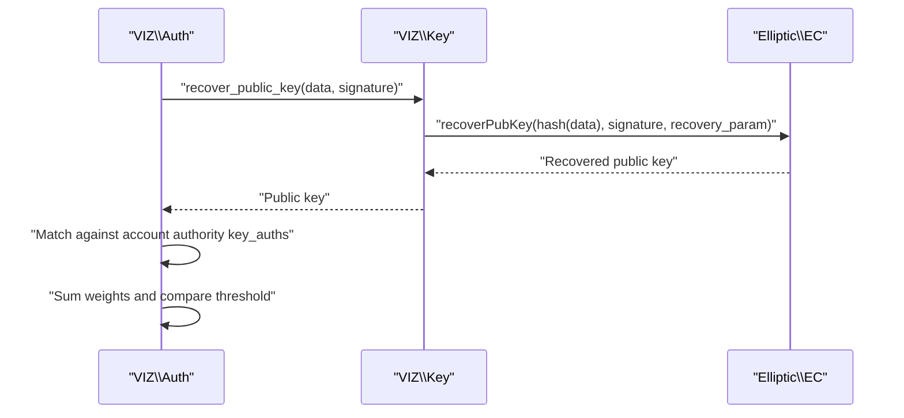
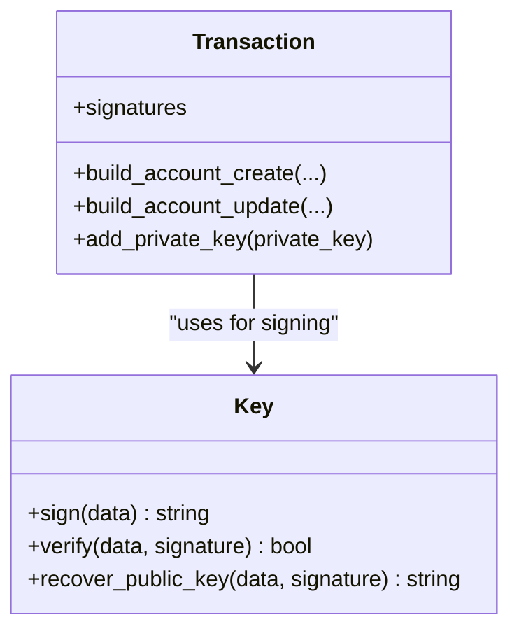
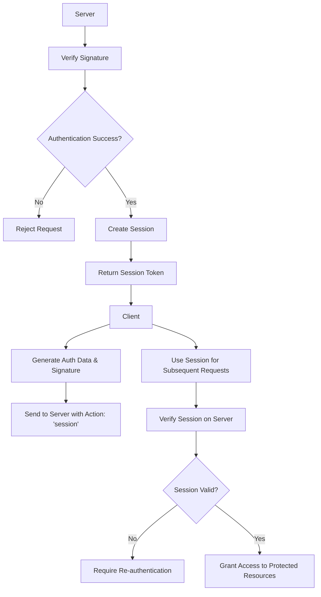
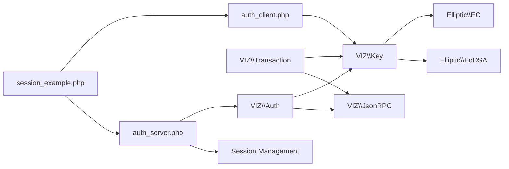

# Authentication System

<cite>
**Referenced Files in This Document**
- [Auth.php](file://class/VIZ/Auth.php)
- [Key.php](file://class/VIZ/Key.php)
- [JsonRPC.php](file://class/VIZ/JsonRPC.php)
- [Transaction.php](file://class/VIZ/Transaction.php)
- [EC.php](file://class/Elliptic/EC.php)
- [EC/Signature.php](file://class/Elliptic/EC/Signature.php)
- [EdDSA.php](file://class/Elliptic/EdDSA.php)
- [EdDSA/Signature.php](file://class/Elliptic/EdDSA/Signature.php)
- [Utils.php](file://class/VIZ/Utils.php)
- [README.md](file://README.md)
- [autoloader.php](file://class/autoloader.php)
- [auth_client.php](file://scripts/auth_client.php)
- [auth_server.php](file://scripts/auth_server.php)
- [session_example.php](file://scripts/session_example.php)
</cite>

## Update Summary
**Changes Made**
- Added comprehensive client-server architecture documentation with practical examples
- Enhanced session management capabilities with file-based storage patterns
- Integrated complete authentication lifecycle from signature generation to session establishment
- Added practical integration patterns for web applications and APIs
- Updated authentication flow diagrams to reflect the new client-server model

## Table of Contents
1. [Introduction](#introduction)
2. [Project Structure](#project-structure)
3. [Core Components](#core-components)
4. [Architecture Overview](#architecture-overview)
5. [Detailed Component Analysis](#detailed-component-analysis)
6. [Client-Server Authentication Flow](#client-server-authentication-flow)
7. [Session Management](#session-management)
8. [Practical Integration Examples](#practical-integration-examples)
9. [Dependency Analysis](#dependency-analysis)
10. [Performance Considerations](#performance-considerations)
11. [Troubleshooting Guide](#troubleshooting-guide)
12. [Conclusion](#conclusion)
13. [Appendices](#appendices)

## Introduction
This document explains the Authentication System implemented in the VIZ PHP Library. It focuses on passwordless authentication using cryptographic signatures, including domain-scoped authentication, time-based validation, authority verification, and multi-signature support. The system now includes a complete client-server architecture with session management capabilities, practical integration examples, and comprehensive authentication lifecycle coverage from signature generation to session establishment.

## Project Structure
The authentication system spans several core classes and scripts:
- VIZ\Auth: orchestrates passwordless authentication checks against the blockchain.
- VIZ\Key: manages cryptographic keys, signing, verification, and public key recovery.
- VIZ\JsonRPC: provides JSON-RPC client access to the blockchain node.
- VIZ\Transaction: demonstrates multi-signature workflows and authority structures.
- Elliptic EC and EdDSA: underlying elliptic curve cryptography for signatures and recovery.
- VIZ\Utils: utilities for encoding, encryption, and interoperability helpers.
- Scripts: complete client-server examples demonstrating practical authentication implementation.
- README.md: includes working examples for passwordless authentication.



**Diagram sources**
- [Auth.php](file://class/VIZ/Auth.php#L9-L24)
- [Key.php](file://class/VIZ/Key.php#L9-L32)
- [JsonRPC.php](file://class/VIZ/JsonRPC.php#L17-L22)
- [EC.php](file://class/Elliptic/EC.php#L9-L40)
- [EdDSA.php](file://class/Elliptic/EdDSA.php#L7-L27)
- [auth_client.php](file://scripts/auth_client.php#L1-L82)
- [auth_server.php](file://scripts/auth_server.php#L1-L195)

**Section sources**
- [README.md](file://README.md#L207-L222)
- [autoloader.php](file://class/autoloader.php#L1-L14)
- [auth_client.php](file://scripts/auth_client.php#L1-L82)
- [auth_server.php](file://scripts/auth_server.php#L1-L195)

## Core Components
- VIZ\Auth
  - Validates passwordless authentication requests by reconstructing the public key from a signature, verifying domain/action/authority/time constraints, and confirming account authority weights against the blockchain.
  - Provides configurable time window range and timezone handling.
- VIZ\Key
  - Implements ECDSA signing and verification using secp256k1.
  - Supports compact signature recovery to derive the public key from a signature and data.
  - Generates domain-scoped authentication data and produces signatures suitable for VIZ\Auth.
- VIZ\JsonRPC
  - Executes blockchain queries such as retrieving account details and authority structures.
- VIZ\Transaction
  - Demonstrates multi-signature workflows and authority structures (master, active, regular) used during authentication and permission checks.
- Authentication Scripts
  - auth_client.php: Complete client-side implementation for generating authentication data and signatures.
  - auth_server.php: Complete server-side implementation with session management and action handlers.
  - session_example.php: End-to-end workflow demonstration from signature generation to session establishment.

**Section sources**
- [Auth.php](file://class/VIZ/Auth.php#L9-L24)
- [Key.php](file://class/VIZ/Key.php#L339-L352)
- [JsonRPC.php](file://class/VIZ/JsonRPC.php#L311-L353)
- [Transaction.php](file://class/VIZ/Transaction.php#L191-L350)
- [auth_client.php](file://scripts/auth_client.php#L1-L82)
- [auth_server.php](file://scripts/auth_server.php#L1-L195)
- [session_example.php](file://scripts/session_example.php#L1-L244)

## Architecture Overview
The authentication flow follows a three-phase process with client-server architecture:
1. **Data Generation**: The client constructs a domain-scoped authentication string with account, authority, timestamp, and nonce.
2. **Signature Creation**: The client signs the data with their private key to produce a compact signature.
3. **Verification and Session Establishment**: The server reconstructs the public key from the signature and data, validates domain/action/authority/time constraints, fetches the account's authority structure from the blockchain, sums weighted keys, and creates a session upon successful authentication.



**Diagram sources**
- [Key.php](file://class/VIZ/Key.php#L339-L352)
- [Auth.php](file://class/VIZ/Auth.php#L25-L69)
- [JsonRPC.php](file://class/VIZ/JsonRPC.php#L311-L353)
- [auth_server.php](file://scripts/auth_server.php#L110-L151)

## Detailed Component Analysis

### Passwordless Authentication Mechanism
- Domain-specific authentication
  - The authentication string includes a domain, action, account, authority, timestamp, and nonce. The verifier enforces exact matches for domain and action and supports configurable authority scopes.
- Time-based validation
  - A configurable time window around the current server time ensures freshness. The verifier rejects timestamps outside the allowed range.
- Authority verification
  - The verifier fetches the account's authority structure from the blockchain and checks whether the recovered public key exists in the specified authority's key_auths list.
- Weight threshold validation
  - The verifier sums the weights of matched keys and compares against the authority's weight_threshold. Only if the sum meets or exceeds the threshold is the authentication considered valid.



**Diagram sources**
- [Auth.php](file://class/VIZ/Auth.php#L25-L69)

**Section sources**
- [Auth.php](file://class/VIZ/Auth.php#L25-L69)

### Data Generation and Signature Creation
- Data generation
  - The signer composes a colon-separated string containing domain, action, account, authority, timestamp, and nonce. The timestamp is adjusted for server timezone if enabled.
- Signature creation
  - The signer hashes the data and generates a canonical ECDSA signature using secp256k1. The resulting compact signature encodes the recovery parameter and signature components.



**Diagram sources**
- [Key.php](file://class/VIZ/Key.php#L339-L352)
- [EC.php](file://class/Elliptic/EC.php#L89-L177)

**Section sources**
- [Key.php](file://class/VIZ/Key.php#L339-L352)
- [EC.php](file://class/Elliptic/EC.php#L89-L177)

### Public Key Recovery and Verification
- Public key recovery
  - Using the signature and data, the system recovers the public key. This enables verification without requiring the original public key to be transmitted.
- Verification
  - The recovered public key is compared against the account's authority key list. The verifier aggregates weights and enforces the threshold.



**Diagram sources**
- [Auth.php](file://class/VIZ/Auth.php#L35-L67)
- [Key.php](file://class/VIZ/Key.php#L323-L338)
- [EC.php](file://class/Elliptic/EC.php#L221-L249)

**Section sources**
- [Key.php](file://class/VIZ/Key.php#L323-L338)
- [EC.php](file://class/Elliptic/EC.php#L221-L249)

### Authority Structures and Multi-Signature Support
- Authority structures
  - Accounts define authorities (master, active, regular) with weight thresholds and key_auths. The authentication system verifies against the selected authority.
- Multi-signature support
  - Transactions demonstrate multi-signature workflows and authority composition. Multiple private keys can contribute signatures to satisfy thresholds.



**Diagram sources**
- [Transaction.php](file://class/VIZ/Transaction.php#L191-L350)
- [Key.php](file://class/VIZ/Key.php#L302-L322)

**Section sources**
- [Transaction.php](file://class/VIZ/Transaction.php#L191-L350)
- [README.md](file://README.md#L241-L283)

### Permission Checking and Recovery Mechanisms
- Permission checking
  - The verifier ensures the recovered public key belongs to the specified authority and that the aggregated weight meets or exceeds the threshold.
- Recovery mechanisms
  - The library supports account recovery operations via transaction builders, enabling recovery authority workflows when needed.

**Section sources**
- [Auth.php](file://class/VIZ/Auth.php#L47-L59)
- [Transaction.php](file://class/VIZ/Transaction.php#L503-L561)

## Client-Server Authentication Flow

### Complete Authentication Lifecycle
The system now provides a complete client-server authentication flow with practical implementation examples:

1. **Client-Side Authentication**
   - Generate authentication data and signature using VIZ\Key
   - Send data and signature to server with action parameter
   - Receive session token upon successful authentication

2. **Server-Side Processing**
   - Validate signature using VIZ\Auth.check()
   - Create session with expiration time
   - Provide session-based authentication for subsequent requests

3. **Session-Based Access Control**
   - Verify session tokens for protected endpoints
   - Maintain session storage with automatic cleanup



**Diagram sources**
- [auth_client.php](file://scripts/auth_client.php#L35-L73)
- [auth_server.php](file://scripts/auth_server.php#L110-L151)
- [session_example.php](file://scripts/session_example.php#L67-L133)

**Section sources**
- [auth_client.php](file://scripts/auth_client.php#L1-L82)
- [auth_server.php](file://scripts/auth_server.php#L1-L195)
- [session_example.php](file://scripts/session_example.php#L1-L244)

## Session Management

### Session Storage and Lifecycle
The authentication system includes comprehensive session management capabilities:

- **File-Based Storage**: Simple implementation using JSON files for session persistence
- **Automatic Cleanup**: Expired sessions are automatically removed
- **Configurable TTL**: Session time-to-live can be customized
- **Session Validation**: Secure session verification with expiration checks

### Session Storage Pattern
```php
// Store session after authentication
$session = [
    'id' => $session_id,
    'account' => $account,
    'expire' => $expire
];
file_put_contents('session.json', json_encode($session));

// Load session for subsequent requests
$session = json_decode(file_get_contents('session.json'), true);
if ($session['expire'] > time()) {
    // Session is valid, use $session['id'] for requests
} else {
    // Session expired, re-authenticate
}
```

**Section sources**
- [auth_server.php](file://scripts/auth_server.php#L56-L99)
- [session_example.php](file://scripts/session_example.php#L135-L153)

## Practical Integration Examples

### Client-Side Implementation
The client example demonstrates complete authentication workflow:
- Private key loading and validation
- Authentication data generation with domain scoping
- Signature creation and verification
- Server communication using cURL
- Self-verification testing

### Server-Side Implementation
The server example provides production-ready authentication service:
- CORS support for cross-origin requests
- Multiple action handlers (session, ping, verify)
- Session-based authentication
- Error handling and response formatting
- Configurable security parameters

### End-to-End Workflow
The session example demonstrates complete authentication lifecycle:
- Private key initialization
- Authentication signature generation
- Session creation and validation
- Subsequent request using session tokens
- Cloud operations pattern implementation

**Section sources**
- [auth_client.php](file://scripts/auth_client.php#L1-L82)
- [auth_server.php](file://scripts/auth_server.php#L1-L195)
- [session_example.php](file://scripts/session_example.php#L1-L244)

## Dependency Analysis
The authentication system relies on:
- VIZ\Auth depends on VIZ\Key for signature recovery and VIZ\JsonRPC for account retrieval.
- VIZ\Key depends on Elliptic EC for signing and recovery.
- VIZ\Transaction demonstrates authority structures and multi-signature workflows.
- Authentication scripts depend on the core authentication classes for complete implementation.



**Diagram sources**
- [Auth.php](file://class/VIZ/Auth.php#L9-L24)
- [Key.php](file://class/VIZ/Key.php#L9-L32)
- [JsonRPC.php](file://class/VIZ/JsonRPC.php#L17-L22)
- [EC.php](file://class/Elliptic/EC.php#L9-L40)
- [EdDSA.php](file://class/Elliptic/EdDSA.php#L7-L27)
- [Transaction.php](file://class/VIZ/Transaction.php#L21-L41)
- [auth_client.php](file://scripts/auth_client.php#L15-L33)
- [auth_server.php](file://scripts/auth_server.php#L33-L54)
- [session_example.php](file://scripts/session_example.php#L16-L60)

**Section sources**
- [Auth.php](file://class/VIZ/Auth.php#L9-L24)
- [Key.php](file://class/VIZ/Key.php#L9-L32)
- [JsonRPC.php](file://class/VIZ/JsonRPC.php#L17-L22)
- [EC.php](file://class/Elliptic/EC.php#L9-L40)
- [EdDSA.php](file://class/Elliptic/EdDSA.php#L7-L27)
- [Transaction.php](file://class/VIZ/Transaction.php#L21-L41)
- [auth_client.php](file://scripts/auth_client.php#L15-L33)
- [auth_server.php](file://scripts/auth_server.php#L33-L54)
- [session_example.php](file://scripts/session_example.php#L16-L60)

## Performance Considerations
- Time window sizing
  - Adjust the range parameter to balance usability and security. A larger range increases tolerance for clock skew but broadens the validation window.
- Signature generation retries
  - The signer attempts to produce a canonical signature; in rare cases, it may increment the nonce until a valid signature is found.
- Network latency
  - JsonRPC calls introduce latency. Consider caching account authority data when appropriate and batching requests where feasible.
- Session storage optimization
  - For production use, replace file-based storage with database or Redis for better performance and scalability.
- Client-server communication
  - Implement connection pooling and keep-alive for improved server performance under load.

## Troubleshooting Guide
Common issues and resolutions:
- Authentication fails due to time mismatch
  - Ensure server timezone handling is configured correctly. The verifier can adjust for local timezone offsets.
- Invalid signature or public key mismatch
  - Verify that the signature was produced using the same data and private key. Confirm the correct curve (secp256k1) and canonical signature format.
- Authority threshold not met
  - Confirm the account's authority structure and ensure the recovered public key is present in the authority's key_auths with sufficient weight.
- Network errors
  - Check endpoint availability and SSL settings. Review JsonRPC debug output for request/response details.
- Session validation failures
  - Verify session file permissions and ensure proper cleanup of expired sessions.
- CORS issues
  - Configure proper CORS headers for cross-origin requests from web applications.

**Section sources**
- [Auth.php](file://class/VIZ/Auth.php#L29-L31)
- [Key.php](file://class/VIZ/Key.php#L302-L322)
- [JsonRPC.php](file://class/VIZ/JsonRPC.php#L311-L353)
- [auth_server.php](file://scripts/auth_server.php#L22-L30)

## Conclusion
The VIZ PHP Library provides a robust, domain-scoped, time-bound, and authority-aware passwordless authentication mechanism with complete client-server architecture and session management capabilities. By leveraging ECDSA signatures, public key recovery, and blockchain-backed authority structures, it enables secure and flexible authentication flows. The system now includes practical integration examples, comprehensive session management, and production-ready server implementations that enable developers to integrate these components into web applications and APIs to authenticate users without traditional passwords, while maintaining strong security guarantees through weight thresholds and multi-signature support.

## Appendices

### Practical Implementation Examples
- Passwordless authentication example
  - See the example in the repository that generates data and signature, then verifies it using VIZ\Auth.
- Multi-signature transaction example
  - The library includes examples of building transactions with multiple operations and adding additional signatures.
- Client-server authentication example
  - Complete implementation showing authentication workflow from client to server with session management.
- Session management example
  - End-to-end demonstration of authentication lifecycle from signature generation to session establishment.

**Section sources**
- [README.md](file://README.md#L207-L222)
- [README.md](file://README.md#L113-L135)
- [auth_client.php](file://scripts/auth_client.php#L1-L82)
- [auth_server.php](file://scripts/auth_server.php#L1-L195)
- [session_example.php](file://scripts/session_example.php#L1-L244)

### Security Considerations
- Use canonical signatures to avoid ambiguity.
- Protect private keys and ensure secure storage.
- Validate domains and actions to prevent cross-domain replay attacks.
- Monitor and rotate keys regularly; leverage recovery mechanisms when necessary.
- Keep the time window reasonable to minimize exposure windows.
- Implement proper session storage and cleanup mechanisms.
- Use HTTPS for all authentication communications.
- Validate session tokens and handle expiration appropriately.