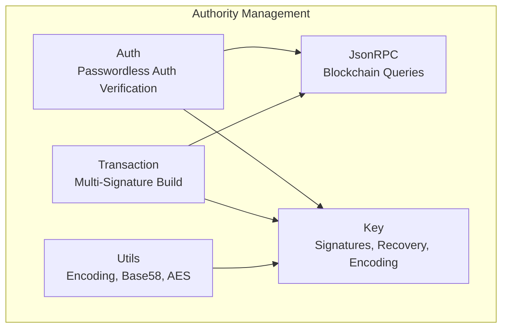
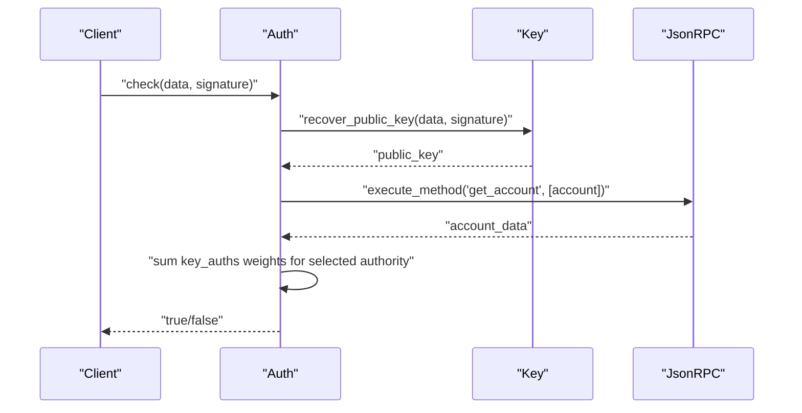
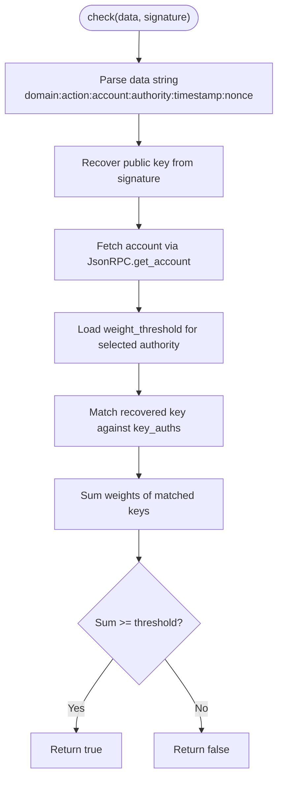
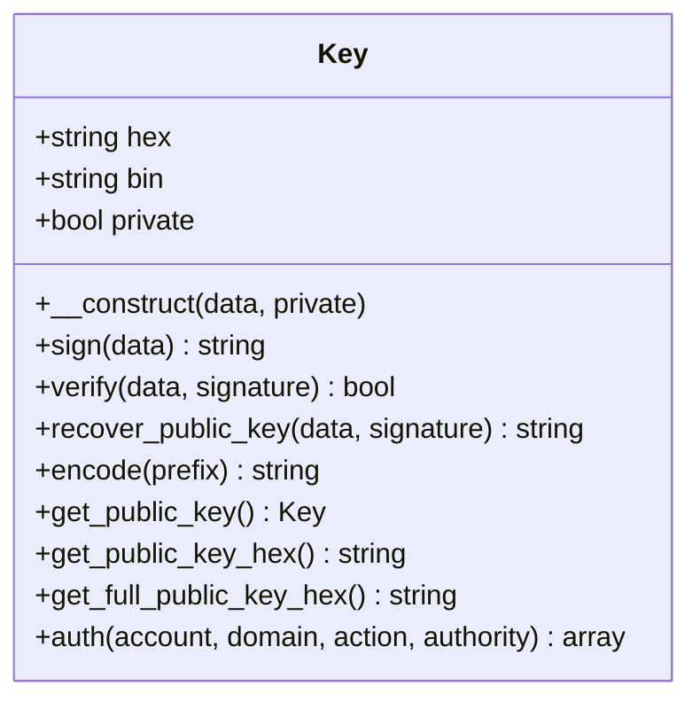
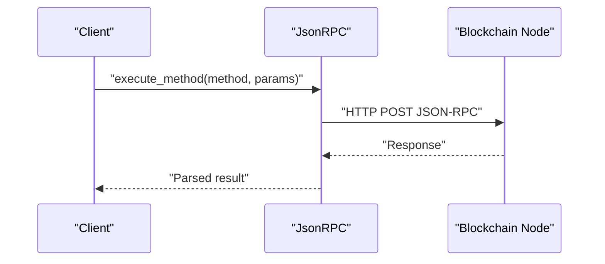
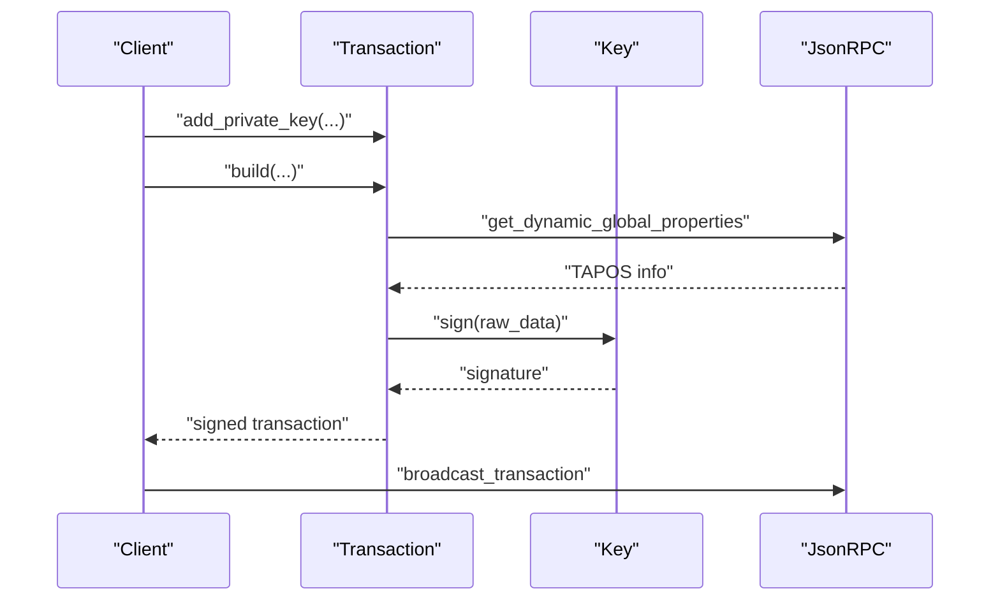
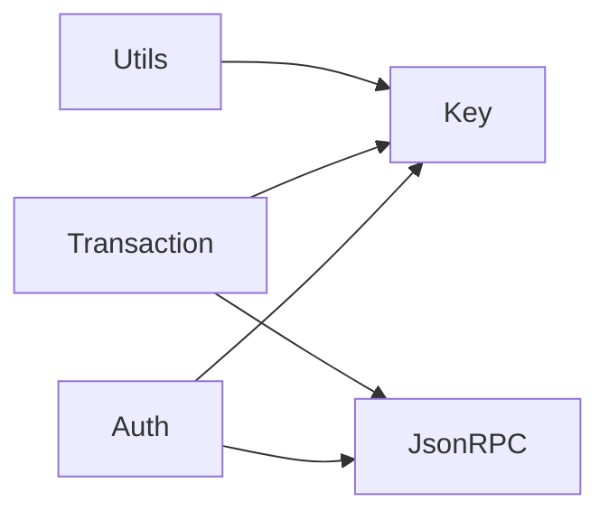

# Authority Management

<cite>
**Referenced Files in This Document**
- [Auth.php](file://class/VIZ/Auth.php)
- [JsonRPC.php](file://class/VIZ/JsonRPC.php)
- [Key.php](file://class/VIZ/Key.php)
- [Transaction.php](file://class/VIZ/Transaction.php)
- [Utils.php](file://class/VIZ/Utils.php)
- [README.md](file://README.md)
</cite>

## Table of Contents
1. [Introduction](#introduction)
2. [Project Structure](#project-structure)
3. [Core Components](#core-components)
4. [Architecture Overview](#architecture-overview)
5. [Detailed Component Analysis](#detailed-component-analysis)
6. [Dependency Analysis](#dependency-analysis)
7. [Performance Considerations](#performance-considerations)
8. [Troubleshooting Guide](#troubleshooting-guide)
9. [Conclusion](#conclusion)

## Introduction
This document explains the Authority Management subsystem of the VIZ PHP Library. It focuses on how the library validates authority structures, supports multi-signature workflows, and integrates with the VIZ blockchain’s JSON-RPC APIs for account authority lookup. It covers:
- Authority types: regular, active, and owner (via the active authority path in examples)
- Weight threshold validation and key authorization mechanisms
- Multi-signature support during transaction building and signature collection
- Account authority lookup via JSON-RPC
- Public key matching and weight summation calculations
- Practical examples for configuring authority levels, managing multi-signature requirements, and handling authority inheritance patterns

## Project Structure
The Authority Management functionality spans several core classes:
- Authentication and verification: [Auth.php](file://class/VIZ/Auth.php)
- Cryptographic primitives and key operations: [Key.php](file://class/VIZ/Key.php)
- JSON-RPC client for blockchain queries: [JsonRPC.php](file://class/VIZ/JsonRPC.php)
- Transaction construction and multi-signature support: [Transaction.php](file://class/VIZ/Transaction.php)
- Utility helpers for encoding and compatibility: [Utils.php](file://class/VIZ/Utils.php)
- Example usage and integration patterns: [README.md](file://README.md)

**Diagram sources**
- [Auth.php](file://class/VIZ/Auth.php#L9-L70)
- [Key.php](file://class/VIZ/Key.php#L9-L353)
- [JsonRPC.php](file://class/VIZ/JsonRPC.php#L4-L354)
- [Transaction.php](file://class/VIZ/Transaction.php#L10-L1416)
- [Utils.php](file://class/VIZ/Utils.php#L7-L413)

**Section sources**
- [Auth.php](file://class/VIZ/Auth.php#L9-L70)
- [Key.php](file://class/VIZ/Key.php#L9-L353)
- [JsonRPC.php](file://class/VIZ/JsonRPC.php#L4-L354)
- [Transaction.php](file://class/VIZ/Transaction.php#L10-L1416)
- [Utils.php](file://class/VIZ/Utils.php#L7-L413)

## Core Components
- Auth: Validates passwordless authentication requests by recovering a public key from a signature, fetching account authority thresholds, and verifying that the recovered key’s weight meets the threshold for the requested authority level.
- Key: Provides cryptographic operations including signing, signature verification, public key recovery, and encoding/decoding of keys.
- JsonRPC: Implements a lightweight JSON-RPC client to query blockchain endpoints, including account retrieval and authority-related methods.
- Transaction: Builds transactions and supports multi-signature workflows by collecting signatures from multiple private keys and assembling the final signed transaction.

**Section sources**
- [Auth.php](file://class/VIZ/Auth.php#L25-L69)
- [Key.php](file://class/VIZ/Key.php#L302-L352)
- [JsonRPC.php](file://class/VIZ/JsonRPC.php#L311-L353)
- [Transaction.php](file://class/VIZ/Transaction.php#L53-L190)

## Architecture Overview
The Authority Management subsystem orchestrates three primary flows:
1. Passwordless authentication verification: Recover public key from signature, fetch account authority thresholds, match keys, sum weights, and validate against threshold.
2. Transaction multi-signature: Collect signatures from multiple private keys, assemble transaction, and broadcast.
3. Authority configuration: Build operations with explicit authority structures (master, active, regular) and manage key weights and thresholds.

**Diagram sources**
- [Auth.php](file://class/VIZ/Auth.php#L25-L69)
- [Key.php](file://class/VIZ/Key.php#L323-L338)
- [JsonRPC.php](file://class/VIZ/JsonRPC.php#L311-L353)

## Detailed Component Analysis

### Passwordless Authentication Flow (Auth)
The Auth class implements a passwordless authentication mechanism:
- Parses the incoming data string into components: domain, action, account, authority, timestamp, nonce.
- Recovers the public key from the signature.
- Fetches the account data from the blockchain.
- Matches the recovered public key against the account’s key authorizations for the requested authority.
- Sums up the weights of matched keys and compares against the authority’s weight threshold.
- Returns true if the threshold is met, false otherwise.

**Diagram sources**
- [Auth.php](file://class/VIZ/Auth.php#L25-L69)

**Section sources**
- [Auth.php](file://class/VIZ/Auth.php#L25-L69)

### Key Operations (Key)
The Key class provides:
- Signing and signature verification for arbitrary data.
- Public key recovery from a signature and message hash.
- Encoding/decoding of private/public keys in various formats (WIF, compressed/uncompressed hex, Base58-encoded public keys).
- Shared key derivation for memo encryption compatibility.

**Diagram sources**
- [Key.php](file://class/VIZ/Key.php#L9-L353)

**Section sources**
- [Key.php](file://class/VIZ/Key.php#L302-L352)

### JSON-RPC Integration (JsonRPC)
The JsonRPC class:
- Maps method names to plugin namespaces.
- Executes JSON-RPC queries against a configured endpoint.
- Supports account retrieval and authority-related methods such as get_account.

**Diagram sources**
- [JsonRPC.php](file://class/VIZ/JsonRPC.php#L258-L353)

**Section sources**
- [JsonRPC.php](file://class/VIZ/JsonRPC.php#L29-L121)
- [JsonRPC.php](file://class/VIZ/JsonRPC.php#L311-L353)

### Transaction Multi-Signature Support (Transaction)
The Transaction class:
- Builds operations and raw transaction data.
- Collects signatures from multiple private keys.
- Assembles the final signed transaction with signatures.
- Broadcasts transactions via JSON-RPC.

**Diagram sources**
- [Transaction.php](file://class/VIZ/Transaction.php#L61-L190)
- [JsonRPC.php](file://class/VIZ/JsonRPC.php#L311-L353)

**Section sources**
- [Transaction.php](file://class/VIZ/Transaction.php#L53-L190)

### Authority Structures and Threshold Validation
The library supports three authority levels commonly used in VIZ:
- Regular authority: Used for general operations requiring lower privileges.
- Active authority: Used for operations requiring higher privileges, often used for passwordless authentication examples.
- Owner authority: Typically reserved for sensitive operations like changing master keys; the library’s examples demonstrate active authority usage.

Weight threshold validation:
- Each authority level defines a weight_threshold.
- key_auths entries associate public keys with weights.
- The system sums the weights of keys that match the recovered public key and compares against the threshold.

Multi-signature support:
- Transactions can be built with multiple private keys, each contributing a signature.
- The Transaction class collects signatures and assembles the final signed transaction.

Public key matching and weight summation:
- The Auth.check method iterates over key_auths for the selected authority and sums weights for keys that match the recovered public key.

**Section sources**
- [Auth.php](file://class/VIZ/Auth.php#L47-L59)
- [Transaction.php](file://class/VIZ/Transaction.php#L132-L144)

### Configuring Authority Levels and Managing Multi-Signature Requirements
Examples in the repository demonstrate:
- Building account creation with explicit authority structures for master, active, and regular authorities.
- Using arrays to define key_auths and account_auths with associated weights and thresholds.
- Managing multi-signature requirements by adding multiple private keys and collecting signatures.

Practical patterns:
- Define authority structures as arrays with weight_threshold, account_auths, and key_auths.
- Ensure public keys are sorted consistently to satisfy node validation rules.
- Use the Transaction class to collect signatures from multiple parties and assemble the final transaction.

**Section sources**
- [README.md](file://README.md#L207-L222)
- [Transaction.php](file://class/VIZ/Transaction.php#L191-L349)
- [Transaction.php](file://class/VIZ/Transaction.php#L351-L501)

### Authority Inheritance Patterns
Authority inheritance in VIZ typically follows:
- Owner authority can modify master and active authorities.
- Active authority controls day-to-day operations and can be used for passwordless authentication.
- Regular authority handles general operations with minimal privileges.

The library’s examples show active authority usage for passwordless authentication, while authority structures for master and regular are constructed similarly.

**Section sources**
- [README.md](file://README.md#L207-L222)
- [Transaction.php](file://class/VIZ/Transaction.php#L191-L349)

## Dependency Analysis
The Authority Management subsystem exhibits the following dependencies:
- Auth depends on Key for signature recovery and JsonRPC for account retrieval.
- Transaction depends on Key for signing and JsonRPC for TAPOS and broadcasting.
- Utils provides encoding utilities used across Key and Transaction.

**Diagram sources**
- [Auth.php](file://class/VIZ/Auth.php#L9-L24)
- [Key.php](file://class/VIZ/Key.php#L9-L32)
- [JsonRPC.php](file://class/VIZ/JsonRPC.php#L4-L22)
- [Transaction.php](file://class/VIZ/Transaction.php#L6-L24)
- [Utils.php](file://class/VIZ/Utils.php#L7-L8)

**Section sources**
- [Auth.php](file://class/VIZ/Auth.php#L9-L24)
- [Key.php](file://class/VIZ/Key.php#L9-L32)
- [JsonRPC.php](file://class/VIZ/JsonRPC.php#L4-L22)
- [Transaction.php](file://class/VIZ/Transaction.php#L6-L24)
- [Utils.php](file://class/VIZ/Utils.php#L7-L8)

## Performance Considerations
- Signature recovery and verification are computationally intensive; caching recovered public keys and minimizing repeated network calls can improve performance.
- Batch operations and queued transactions reduce the overhead of multiple round-trips to the node.
- Ensure efficient key encoding/decoding and avoid unnecessary conversions between formats.

## Troubleshooting Guide
Common issues and resolutions:
- Signature recovery fails: Verify the signature format and ensure the correct recovery parameter is used.
- Account not found: Confirm the account name and endpoint correctness; check network connectivity.
- Threshold not met: Verify that the recovered public key matches a key_auth and that the total weight meets or exceeds the threshold.
- Multi-signature assembly errors: Ensure all private keys are added before signing and that signatures are appended in the correct order.

**Section sources**
- [Auth.php](file://class/VIZ/Auth.php#L35-L67)
- [Key.php](file://class/VIZ/Key.php#L323-L338)
- [JsonRPC.php](file://class/VIZ/JsonRPC.php#L311-L353)
- [Transaction.php](file://class/VIZ/Transaction.php#L158-L190)

## Conclusion
The VIZ PHP Library’s Authority Management subsystem provides robust support for passwordless authentication, multi-signature transactions, and authority configuration. By leveraging cryptographic primitives, JSON-RPC queries, and structured authority definitions, applications can securely enforce permission policies and manage complex multi-signature workflows on the VIZ blockchain.