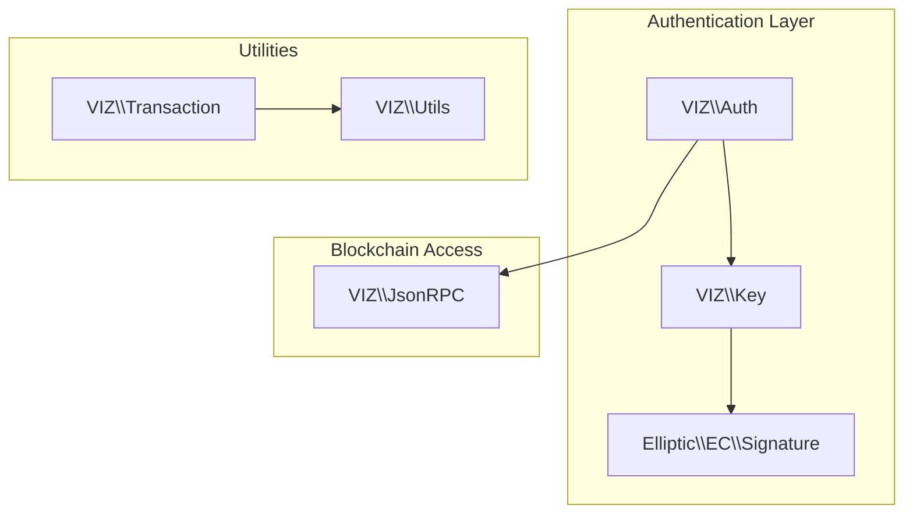
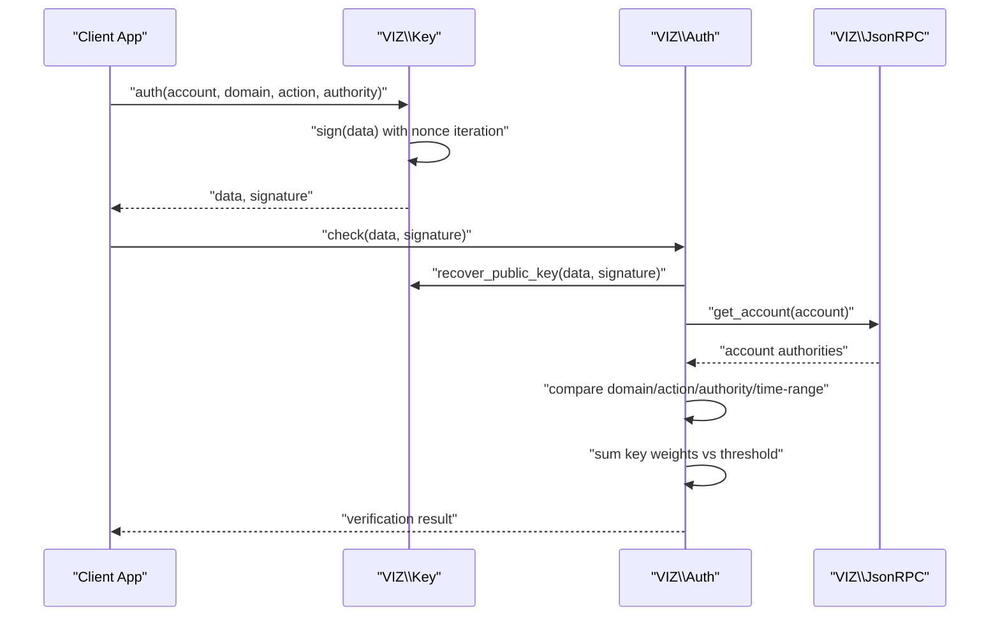
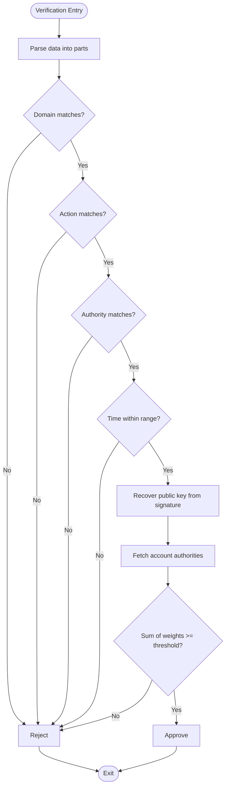
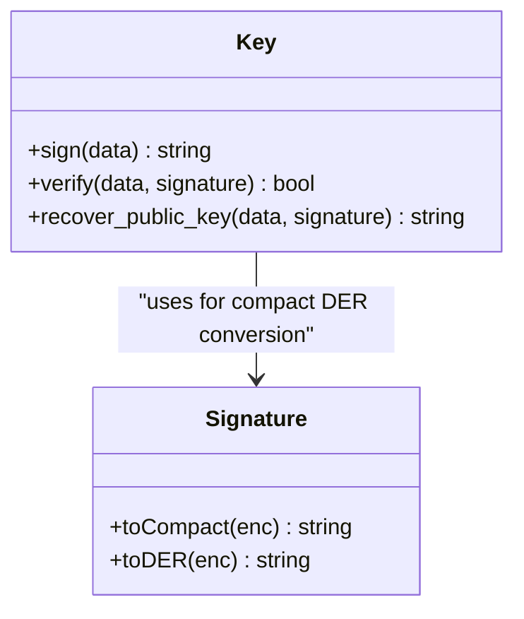
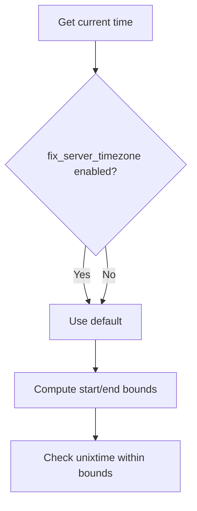
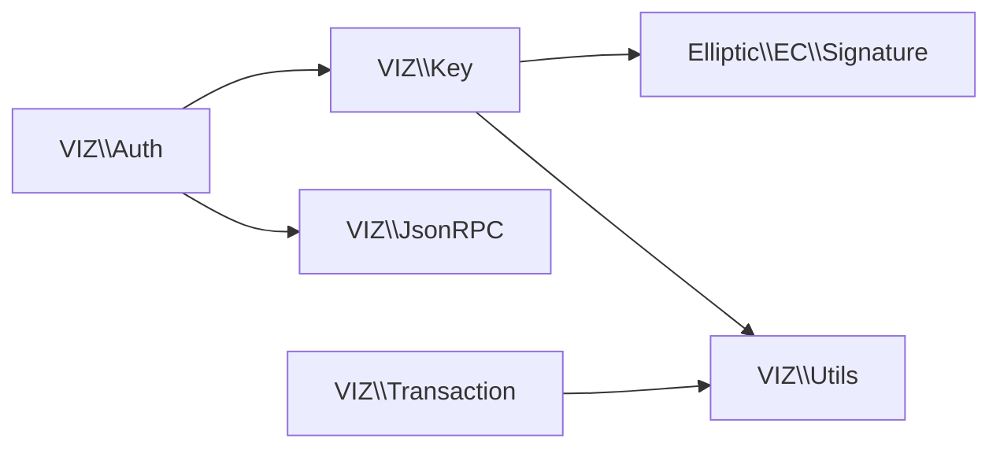

# Passwordless Authentication

<cite>
**Referenced Files in This Document**
- [Auth.php](file://class/VIZ/Auth.php)
- [Key.php](file://class/VIZ/Key.php)
- [Signature.php](file://class/Elliptic/EC/Signature.php)
- [Utils.php](file://class/VIZ/Utils.php)
- [JsonRPC.php](file://class/VIZ/JsonRPC.php)
- [Transaction.php](file://class/VIZ/Transaction.php)
- [README.md](file://README.md)
- [autoloader.php](file://class/autoloader.php)
</cite>

## Table of Contents
1. [Introduction](#introduction)
2. [Project Structure](#project-structure)
3. [Core Components](#core-components)
4. [Architecture Overview](#architecture-overview)
5. [Detailed Component Analysis](#detailed-component-analysis)
6. [Dependency Analysis](#dependency-analysis)
7. [Performance Considerations](#performance-considerations)
8. [Troubleshooting Guide](#troubleshooting-guide)
9. [Conclusion](#conclusion)
10. [Appendices](#appendices)

## Introduction
This document explains the Passwordless Authentication mechanism implemented in the library. It focuses on the domain-specific authentication data format, time-based validation, nonce generation, signature creation, and verification workflow. It also covers practical integration patterns for web applications, API endpoints, and mobile applications, along with timezone handling, range validation, and security best practices to prevent replay attacks.

## Project Structure
The passwordless authentication feature spans several core classes:
- VIZ\Auth: orchestrates verification against the blockchain
- VIZ\Key: cryptographic operations, signing, signature recovery, and passwordless data generation
- Elliptic\EC\Signature: signature parsing and compact signature handling
- VIZ\Utils: utility functions used by other components
- VIZ\JsonRPC: blockchain API access for account validation
- VIZ\Transaction: transaction building and encoding utilities (used by the custom operation pathway)
- README.md: example usage of passwordless authentication
- autoloader.php: class autoloading

**Diagram sources**
- [Auth.php](file://class/VIZ/Auth.php#L9-L70)
- [Key.php](file://class/VIZ/Key.php#L9-L353)
- [Signature.php](file://class/Elliptic/EC/Signature.php#L7-L208)
- [JsonRPC.php](file://class/VIZ/JsonRPC.php#L4-L354)
- [Transaction.php](file://class/VIZ/Transaction.php#L10-L1416)
- [Utils.php](file://class/VIZ/Utils.php#L7-L413)

**Section sources**
- [Auth.php](file://class/VIZ/Auth.php#L9-L70)
- [Key.php](file://class/VIZ/Key.php#L9-L353)
- [Signature.php](file://class/Elliptic/EC/Signature.php#L7-L208)
- [Utils.php](file://class/VIZ/Utils.php#L7-L413)
- [JsonRPC.php](file://class/VIZ/JsonRPC.php#L4-L354)
- [Transaction.php](file://class/VIZ/Transaction.php#L10-L1416)
- [README.md](file://README.md#L207-L222)
- [autoloader.php](file://class/autoloader.php#L1-L14)

## Core Components
- Authentication data format: domain:action:account:authority:unixtime:nonce
- Time-based validation: verification window around current time
- Nonce generation: iterative attempts to produce a valid signature
- Signature creation: SHA-256 hashing of data, EC secp256k1 signing with canonical form
- Verification workflow: recover public key from signature, compare against account authorities, and enforce thresholds

Key implementation references:
- Data format parsing and validation: [Auth.php](file://class/VIZ/Auth.php#L25-L68)
- Nonce-based signing loop: [Key.php](file://class/VIZ/Key.php#L339-L352)
- Signature recovery and verification: [Key.php](file://class/VIZ/Key.php#L323-L338), [Signature.php](file://class/Elliptic/EC/Signature.php#L112-L142)
- Account authority threshold enforcement: [Auth.php](file://class/VIZ/Auth.php#L47-L56)

**Section sources**
- [Auth.php](file://class/VIZ/Auth.php#L25-L68)
- [Key.php](file://class/VIZ/Key.php#L323-L352)
- [Signature.php](file://class/Elliptic/EC/Signature.php#L112-L142)

## Architecture Overview
Passwordless authentication is implemented as a custom operation on the blockchain. The client generates a signed payload containing a domain, action, account, authority, unix timestamp, and nonce. The server verifies the signature, ensures the timestamp falls within a configurable range, and confirms that the recovered public key matches the account’s authority weights.

**Diagram sources**
- [Key.php](file://class/VIZ/Key.php#L339-L352)
- [Auth.php](file://class/VIZ/Auth.php#L25-L68)
- [JsonRPC.php](file://class/VIZ/JsonRPC.php#L311-L353)

## Detailed Component Analysis

### Authentication Data Format and Validation
- Format: domain:action:account:authority:unixtime:nonce
- Parsing and validation steps:
  - Domain match
  - Action match
  - Authority match
  - Unixtime within configured range around current time
  - Account existence and authority structure validated via blockchain

**Diagram sources**
- [Auth.php](file://class/VIZ/Auth.php#L25-L68)

**Section sources**
- [Auth.php](file://class/VIZ/Auth.php#L25-L68)

### Nonce Generation and Signature Creation
- Nonce starts at 1 and increments until a canonical signature is produced
- Data hashed with SHA-256 before signing
- Compact signature format is used for recovery

**Diagram sources**
- [Key.php](file://class/VIZ/Key.php#L339-L352)
- [Signature.php](file://class/Elliptic/EC/Signature.php#L188-L207)

**Section sources**
- [Key.php](file://class/VIZ/Key.php#L339-L352)
- [Signature.php](file://class/Elliptic/EC/Signature.php#L188-L207)

### Signature Recovery and Verification
- Recover public key from signature and data hash
- Verify signature against the recovered public key
- Compare recovered public key with account’s authority keys

**Diagram sources**
- [Key.php](file://class/VIZ/Key.php#L302-L338)
- [Signature.php](file://class/Elliptic/EC/Signature.php#L188-L207)

**Section sources**
- [Key.php](file://class/VIZ/Key.php#L302-L338)
- [Signature.php](file://class/Elliptic/EC/Signature.php#L188-L207)

### Timezone Handling and Range Validation
- Current time is normalized using the server’s timezone offset when configured
- Verification window is symmetric around current time using a configurable range

**Diagram sources**
- [Auth.php](file://class/VIZ/Auth.php#L28-L33)

**Section sources**
- [Auth.php](file://class/VIZ/Auth.php#L28-L33)

### Practical Implementation Patterns

#### Web Application Integration
- Client-side: generate the passwordless payload and signature using the Key class
- Server-side: verify using the Auth class against the blockchain
- Example usage is demonstrated in the README under the “passwordless authentication” section

References:
- [README.md](file://README.md#L207-L222)

**Section sources**
- [README.md](file://README.md#L207-L222)

#### API Endpoint Design
- Endpoint receives data and signature
- Server instantiates VIZ\Auth and calls check
- Returns boolean result indicating successful authentication

References:
- [Auth.php](file://class/VIZ/Auth.php#L25-L68)

**Section sources**
- [Auth.php](file://class/VIZ/Auth.php#L25-L68)

#### Mobile Application Integration
- Mobile app signs the payload locally using the Key class
- Sends data and signature to backend for verification
- Backend uses VIZ\Auth.check to validate

References:
- [Key.php](file://class/VIZ/Key.php#L339-L352)
- [Auth.php](file://class/VIZ/Auth.php#L25-L68)

**Section sources**
- [Key.php](file://class/VIZ/Key.php#L339-L352)
- [Auth.php](file://class/VIZ/Auth.php#L25-L68)

## Dependency Analysis
- VIZ\Auth depends on:
  - VIZ\Key for signature recovery
  - VIZ\JsonRPC for account authority retrieval
- VIZ\Key depends on:
  - Elliptic\EC for EC secp256k1 operations
  - VIZ\Utils for base58 encoding/decoding and cryptographic helpers
- VIZ\Transaction provides auxiliary encoding utilities used by higher-level operations

**Diagram sources**
- [Auth.php](file://class/VIZ/Auth.php#L9-L24)
- [Key.php](file://class/VIZ/Key.php#L9-L32)
- [Signature.php](file://class/Elliptic/EC/Signature.php#L7-L12)
- [JsonRPC.php](file://class/VIZ/JsonRPC.php#L4-L17)
- [Transaction.php](file://class/VIZ/Transaction.php#L10-L24)

**Section sources**
- [Auth.php](file://class/VIZ/Auth.php#L9-L24)
- [Key.php](file://class/VIZ/Key.php#L9-L32)
- [Signature.php](file://class/Elliptic/EC/Signature.php#L7-L12)
- [JsonRPC.php](file://class/VIZ/JsonRPC.php#L4-L17)
- [Transaction.php](file://class/VIZ/Transaction.php#L10-L24)

## Performance Considerations
- Nonce iteration: the signing loop increments the nonce until a canonical signature is produced; this is bounded and typically succeeds quickly
- Timezone normalization: minimal overhead using DateTimeZone offset calculation
- Network latency: verification depends on blockchain API calls; consider caching account authority data when feasible and using asynchronous verification where appropriate

[No sources needed since this section provides general guidance]

## Troubleshooting Guide
Common issues and resolutions:
- Invalid signature: ensure the data string exactly matches the original and that the correct private key is used
- Time mismatch: confirm server timezone configuration and network time synchronization
- Authority mismatch: verify the account’s authority structure and ensure the recovered public key exists in the target authority’s key_auths
- Replay detection: rely on the time window and nonce increment to mitigate repeated requests

References:
- [Auth.php](file://class/VIZ/Auth.php#L25-L68)
- [Key.php](file://class/VIZ/Key.php#L339-L352)

**Section sources**
- [Auth.php](file://class/VIZ/Auth.php#L25-L68)
- [Key.php](file://class/VIZ/Key.php#L339-L352)

## Conclusion
The passwordless authentication mechanism leverages ECDSA signatures over a structured data payload, validated against blockchain authority thresholds. By combining precise time-based validation, nonce-based signature generation, and robust signature recovery, the system provides secure, replay-resistant authentication suitable for web, API, and mobile environments.

[No sources needed since this section summarizes without analyzing specific files]

## Appendices

### Security Best Practices
- Enforce strict time windows and reject stale requests
- Use strong randomness for nonces and private keys
- Store private keys securely and avoid exposing them to clients
- Monitor and log authentication attempts for anomaly detection
- Validate domain and action parameters to prevent misuse

[No sources needed since this section provides general guidance]