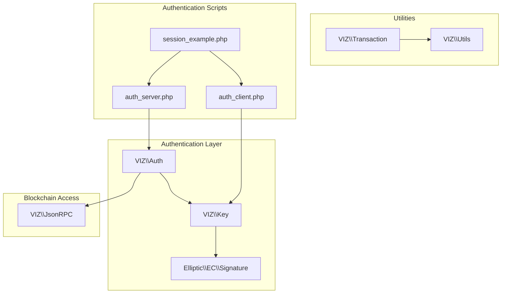
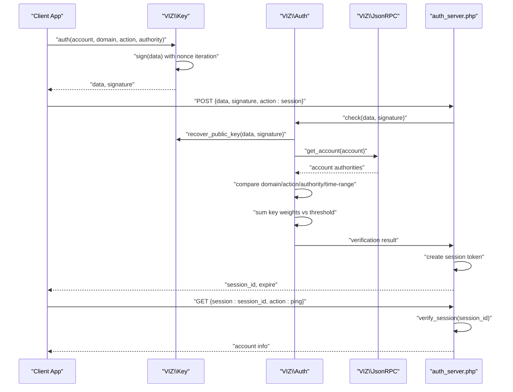
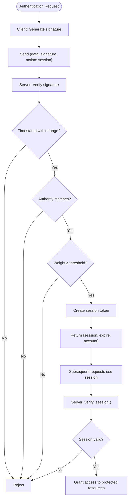
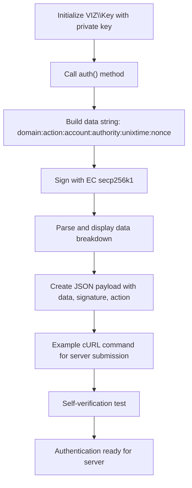
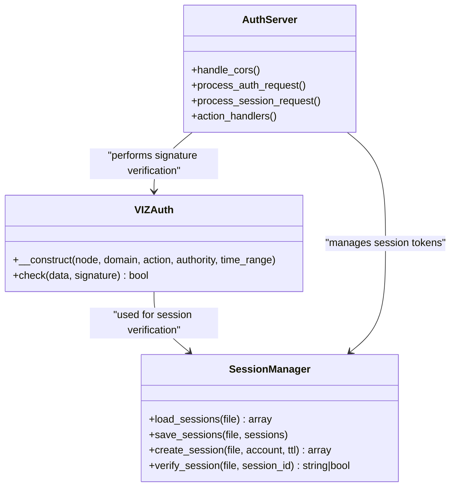
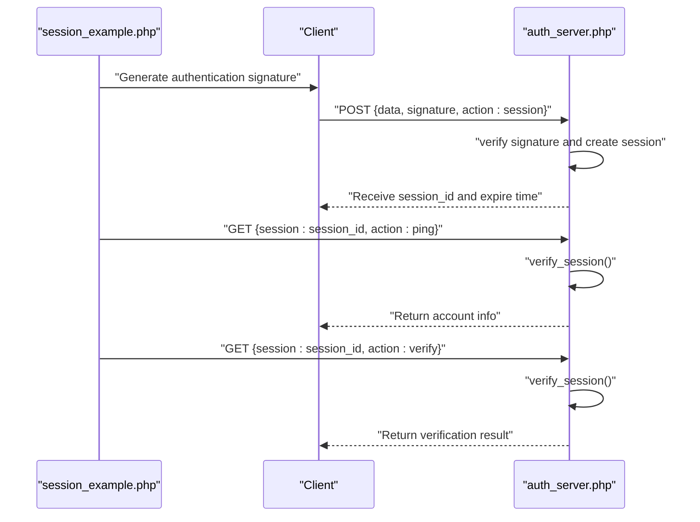
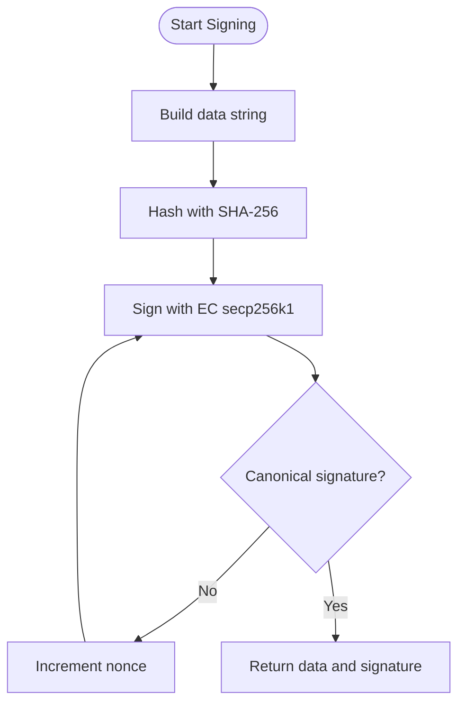
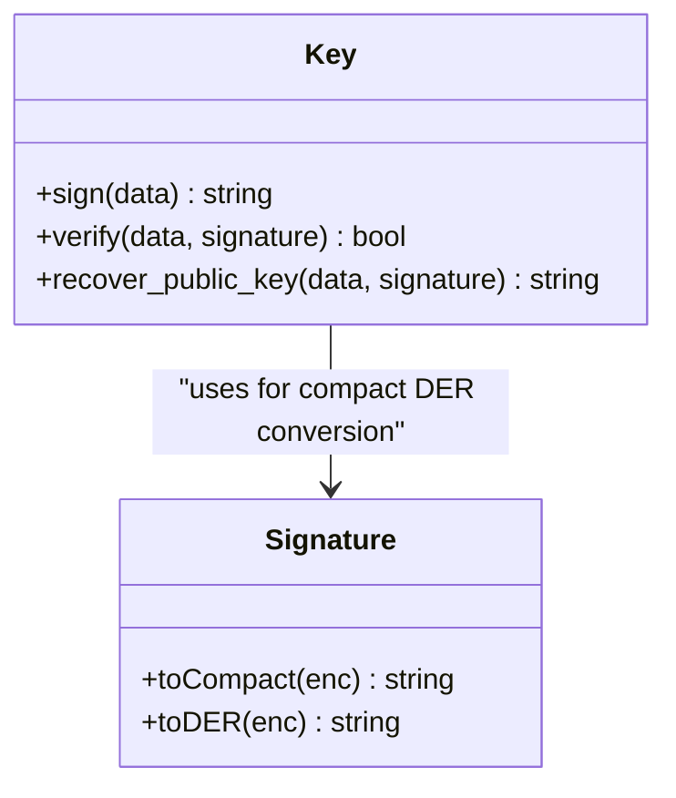
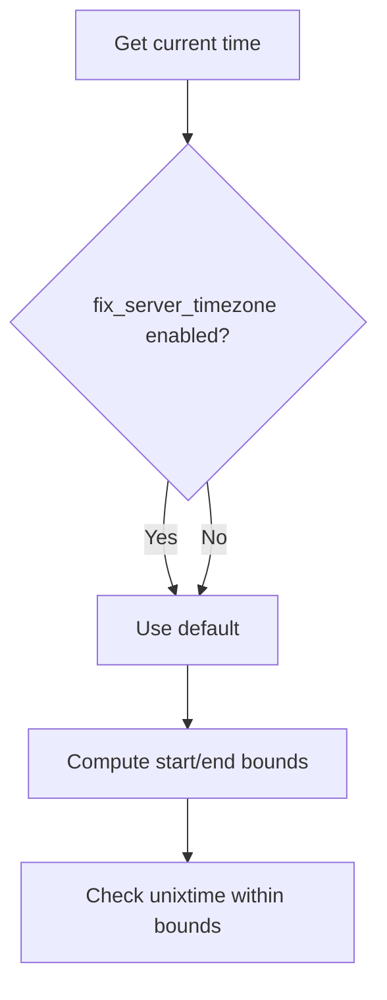
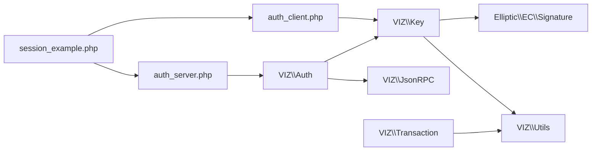

# Passwordless Authentication

<cite>
**Referenced Files in This Document**
- [Auth.php](file://class/VIZ/Auth.php)
- [Key.php](file://class/VIZ/Key.php)
- [Signature.php](file://class/Elliptic/EC/Signature.php)
- [Utils.php](file://class/VIZ/Utils.php)
- [JsonRPC.php](file://class/VIZ/JsonRPC.php)
- [Transaction.php](file://class/VIZ/Transaction.php)
- [README.md](file://README.md)
- [autoloader.php](file://class/autoloader.php)
- [auth_client.php](file://scripts/auth_client.php)
- [auth_server.php](file://scripts/auth_server.php)
- [session_example.php](file://scripts/session_example.php)
</cite>

## Update Summary
**Changes Made**
- Added comprehensive client-server authentication workflow documentation
- Integrated practical implementation examples from new authentication scripts
- Enhanced session management patterns for VIZ blockchain applications
- Added detailed workflow diagrams for complete authentication lifecycle
- Expanded practical implementation sections with real-world examples

## Table of Contents
1. [Introduction](#introduction)
2. [Project Structure](#project-structure)
3. [Core Components](#core-components)
4. [Architecture Overview](#architecture-overview)
5. [Complete Authentication Workflow](#complete-authentication-workflow)
6. [Practical Implementation Examples](#practical-implementation-examples)
7. [Session Management Patterns](#session-management-patterns)
8. [Detailed Component Analysis](#detailed-component-analysis)
9. [Dependency Analysis](#dependency-analysis)
10. [Performance Considerations](#performance-considerations)
11. [Troubleshooting Guide](#troubleshooting-guide)
12. [Conclusion](#conclusion)
13. [Appendices](#appendices)

## Introduction
This document explains the Passwordless Authentication mechanism implemented in the VIZ PHP library. It focuses on the domain-specific authentication data format, time-based validation, nonce generation, signature creation, and verification workflow. The documentation now includes comprehensive client-server authentication workflows with practical implementation examples for web applications, API endpoints, and mobile applications, along with timezone handling, range validation, and security best practices to prevent replay attacks.

## Project Structure
The passwordless authentication feature spans several core classes and includes new authentication scripts:
- VIZ\Auth: orchestrates verification against the blockchain
- VIZ\Key: cryptographic operations, signing, signature recovery, and passwordless data generation
- Elliptic\EC\Signature: signature parsing and compact signature handling
- VIZ\Utils: utility functions used by other components
- VIZ\JsonRPC: blockchain API access for account validation
- VIZ\Transaction: transaction building and encoding utilities
- scripts/auth_client.php: client-side authentication example
- scripts/auth_server.php: server-side authentication implementation
- scripts/session_example.php: complete authentication workflow demonstration
- README.md: example usage of passwordless authentication
- autoloader.php: class autoloading

**Diagram sources**
- [Auth.php](file://class/VIZ/Auth.php#L9-L70)
- [Key.php](file://class/VIZ/Key.php#L9-L353)
- [Signature.php](file://class/Elliptic/EC/Signature.php#L7-L208)
- [JsonRPC.php](file://class/VIZ/JsonRPC.php#L4-L354)
- [Transaction.php](file://class/VIZ/Transaction.php#L10-L1416)
- [Utils.php](file://class/VIZ/Utils.php#L7-L413)
- [auth_client.php](file://scripts/auth_client.php#L1-L82)
- [auth_server.php](file://scripts/auth_server.php#L1-L195)
- [session_example.php](file://scripts/session_example.php#L1-L244)

**Section sources**
- [Auth.php](file://class/VIZ/Auth.php#L9-L70)
- [Key.php](file://class/VIZ/Key.php#L9-L353)
- [Signature.php](file://class/Elliptic/EC/Signature.php#L7-L208)
- [Utils.php](file://class/VIZ/Utils.php#L7-L413)
- [JsonRPC.php](file://class/VIZ/JsonRPC.php#L4-L354)
- [Transaction.php](file://class/VIZ/Transaction.php#L10-L1416)
- [README.md](file://README.md#L207-L222)
- [autoloader.php](file://class/autoloader.php#L1-L14)
- [auth_client.php](file://scripts/auth_client.php#L1-L82)
- [auth_server.php](file://scripts/auth_server.php#L1-L195)
- [session_example.php](file://scripts/session_example.php#L1-L244)

## Core Components
- Authentication data format: domain:action:account:authority:unixtime:nonce
- Time-based validation: verification window around current time
- Nonce generation: iterative attempts to produce a valid signature
- Signature creation: SHA-256 hashing of data, EC secp256k1 signing with canonical form
- Verification workflow: recover public key from signature, compare against account authorities, and enforce thresholds
- Session management: token-based authentication for subsequent requests

Key implementation references:
- Data format parsing and validation: [Auth.php](file://class/VIZ/Auth.php#L25-L68)
- Nonce-based signing loop: [Key.php](file://class/VIZ/Key.php#L339-L352)
- Signature recovery and verification: [Key.php](file://class/VIZ/Key.php#L323-L338), [Signature.php](file://class/Elliptic/EC/Signature.php#L112-L142)
- Account authority threshold enforcement: [Auth.php](file://class/VIZ/Auth.php#L47-L56)
- Client-side authentication generation: [auth_client.php](file://scripts/auth_client.php#L35-L46)
- Server-side authentication verification: [auth_server.php](file://scripts/auth_server.php#L123-L130)
- Session creation and management: [auth_server.php](file://scripts/auth_server.php#L141-L151), [session_example.php](file://scripts/session_example.php#L88-L97)

**Section sources**
- [Auth.php](file://class/VIZ/Auth.php#L25-L68)
- [Key.php](file://class/VIZ/Key.php#L323-L352)
- [Signature.php](file://class/Elliptic/EC/Signature.php#L112-L142)
- [auth_client.php](file://scripts/auth_client.php#L35-L46)
- [auth_server.php](file://scripts/auth_server.php#L123-L151)
- [session_example.php](file://scripts/session_example.php#L88-L97)

## Architecture Overview
Passwordless authentication is implemented as a custom operation on the VIZ blockchain. The client generates a signed payload containing a domain, action, account, authority, unix timestamp, and nonce. The server verifies the signature, ensures the timestamp falls within a configurable range, and confirms that the recovered public key matches the account's authority weights. The system supports both signature-based authentication and session-based authentication for subsequent requests.

**Diagram sources**
- [Key.php](file://class/VIZ/Key.php#L339-L352)
- [Auth.php](file://class/VIZ/Auth.php#L25-L68)
- [JsonRPC.php](file://class/VIZ/JsonRPC.php#L311-L353)
- [auth_server.php](file://scripts/auth_server.php#L110-L185)
- [session_example.php](file://scripts/session_example.php#L67-L133)

## Complete Authentication Workflow
The authentication process consists of three main phases: client-side signature generation, server-side verification, and session management for subsequent requests.

### Phase 1: Client-Side Authentication
The client generates an authentication signature using the private key and sends it to the server along with the authentication data.

### Phase 2: Server-Side Verification
The server validates the signature against the blockchain, checks the timestamp range, and ensures the recovered public key matches the account's authority structure.

### Phase 3: Session Management
Upon successful authentication, the server creates a session token that can be used for subsequent authenticated requests without re-signing.

**Diagram sources**
- [auth_client.php](file://scripts/auth_client.php#L35-L66)
- [auth_server.php](file://scripts/auth_server.php#L123-L185)
- [session_example.php](file://scripts/session_example.php#L67-L133)

**Section sources**
- [auth_client.php](file://scripts/auth_client.php#L35-L66)
- [auth_server.php](file://scripts/auth_server.php#L123-L185)
- [session_example.php](file://scripts/session_example.php#L67-L133)

## Practical Implementation Examples

### Client-Side Implementation
The client-side implementation demonstrates how to generate authentication signatures and prepare payloads for server communication.

**Updated** Added comprehensive client-side example with self-verification capabilities

**Diagram sources**
- [auth_client.php](file://scripts/auth_client.php#L26-L81)

**Section sources**
- [auth_client.php](file://scripts/auth_client.php#L26-L81)

### Server-Side Implementation
The server-side implementation provides a complete authentication service with session management and multiple action handlers.

**Updated** Enhanced server implementation with CORS support, session storage, and action handlers

**Diagram sources**
- [auth_server.php](file://scripts/auth_server.php#L48-L54)
- [auth_server.php](file://scripts/auth_server.php#L62-L99)
- [auth_server.php](file://scripts/auth_server.php#L140-L185)

**Section sources**
- [auth_server.php](file://scripts/auth_server.php#L48-L195)

### Complete Workflow Example
The session_example.php demonstrates the complete authentication workflow from signature generation to session-based access.

**Updated** Added comprehensive workflow example showing end-to-end authentication process

**Diagram sources**
- [session_example.php](file://scripts/session_example.php#L51-L133)
- [auth_server.php](file://scripts/auth_server.php#L110-L185)

**Section sources**
- [session_example.php](file://scripts/session_example.php#L51-L244)

## Session Management Patterns
The library provides flexible session management patterns suitable for different deployment scenarios, from simple file-based storage to production-ready database implementations.

### File-Based Session Storage
For development and testing, the library includes file-based session storage that automatically cleans expired sessions.

### Production Session Storage
For production deployments, the server implementation supports pluggable session storage backends including databases and Redis.

### Cloud Operations Pattern
The session_example.php demonstrates a reusable pattern for cloud operations that handles session caching, automatic renewal, and error handling.

**Section sources**
- [auth_server.php](file://scripts/auth_server.php#L56-L99)
- [session_example.php](file://scripts/session_example.php#L155-L241)

## Detailed Component Analysis

### Authentication Data Format and Validation
- Format: domain:action:account:authority:unixtime:nonce
- Parsing and validation steps:
  - Domain match
  - Action match
  - Authority match
  - Unixtime within configured range around current time
  - Account existence and authority structure validated via blockchain

**Diagram sources**
- [Auth.php](file://class/VIZ/Auth.php#L25-L68)

**Section sources**
- [Auth.php](file://class/VIZ/Auth.php#L25-L68)

### Nonce Generation and Signature Creation
- Nonce starts at 1 and increments until a canonical signature is produced
- Data hashed with SHA-256 before signing
- Compact signature format is used for recovery

**Diagram sources**
- [Key.php](file://class/VIZ/Key.php#L339-L352)
- [Signature.php](file://class/Elliptic/EC/Signature.php#L188-L207)

**Section sources**
- [Key.php](file://class/VIZ/Key.php#L339-L352)
- [Signature.php](file://class/Elliptic/EC/Signature.php#L188-L207)

### Signature Recovery and Verification
- Recover public key from signature and data hash
- Verify signature against the recovered public key
- Compare recovered public key with account's authority keys

**Diagram sources**
- [Key.php](file://class/VIZ/Key.php#L302-L338)
- [Signature.php](file://class/Elliptic/EC/Signature.php#L188-L207)

**Section sources**
- [Key.php](file://class/VIZ/Key.php#L302-L338)
- [Signature.php](file://class/Elliptic/EC/Signature.php#L188-L207)

### Timezone Handling and Range Validation
- Current time is normalized using the server's timezone offset when configured
- Verification window is symmetric around current time using a configurable range

**Diagram sources**
- [Auth.php](file://class/VIZ/Auth.php#L28-L33)

**Section sources**
- [Auth.php](file://class/VIZ/Auth.php#L28-L33)

### Practical Implementation Patterns

#### Web Application Integration
- Client-side: generate the passwordless payload and signature using the Key class
- Server-side: verify using the Auth class against the blockchain
- Example usage is demonstrated in the README under the "passwordless authentication" section

**Updated** Enhanced with new client-server examples and session management

References:
- [README.md](file://README.md#L207-L222)
- [auth_client.php](file://scripts/auth_client.php#L35-L66)
- [auth_server.php](file://scripts/auth_server.php#L123-L185)

**Section sources**
- [README.md](file://README.md#L207-L222)
- [auth_client.php](file://scripts/auth_client.php#L35-L66)
- [auth_server.php](file://scripts/auth_server.php#L123-L185)

#### API Endpoint Design
- Endpoint receives data and signature
- Server instantiates VIZ\Auth and calls check
- Returns boolean result indicating successful authentication
- Supports session-based authentication for subsequent requests

**Updated** Added session-based authentication support

References:
- [Auth.php](file://class/VIZ/Auth.php#L25-L68)
- [auth_server.php](file://scripts/auth_server.php#L123-L185)

**Section sources**
- [Auth.php](file://class/VIZ/Auth.php#L25-L68)
- [auth_server.php](file://scripts/auth_server.php#L123-L185)

#### Mobile Application Integration
- Mobile app signs the payload locally using the Key class
- Sends data and signature to backend for verification
- Backend uses VIZ\Auth.check to validate
- Implements session management for offline scenarios

**Updated** Added session management patterns for mobile applications

References:
- [Key.php](file://class/VIZ/Key.php#L339-L352)
- [Auth.php](file://class/VIZ/Auth.php#L25-L68)
- [session_example.php](file://scripts/session_example.php#L155-L241)

**Section sources**
- [Key.php](file://class/VIZ/Key.php#L339-L352)
- [Auth.php](file://class/VIZ/Auth.php#L25-L68)
- [session_example.php](file://scripts/session_example.php#L155-L241)

## Dependency Analysis
- VIZ\Auth depends on:
  - VIZ\Key for signature recovery
  - VIZ\JsonRPC for account authority retrieval
- VIZ\Key depends on:
  - Elliptic\EC for EC secp256k1 operations
  - VIZ\Utils for base58 encoding/decoding and cryptographic helpers
- VIZ\Transaction provides auxiliary encoding utilities used by higher-level operations
- Authentication scripts depend on the core library classes for complete functionality

**Diagram sources**
- [Auth.php](file://class/VIZ/Auth.php#L9-L24)
- [Key.php](file://class/VIZ/Key.php#L9-L32)
- [Signature.php](file://class/Elliptic/EC/Signature.php#L7-L12)
- [JsonRPC.php](file://class/VIZ/JsonRPC.php#L4-L17)
- [Transaction.php](file://class/VIZ/Transaction.php#L10-L24)
- [auth_client.php](file://scripts/auth_client.php#L15-L36)
- [auth_server.php](file://scripts/auth_server.php#L32-L54)
- [session_example.php](file://scripts/session_example.php#L16-L63)

**Section sources**
- [Auth.php](file://class/VIZ/Auth.php#L9-L24)
- [Key.php](file://class/VIZ/Key.php#L9-L32)
- [Signature.php](file://class/Elliptic/EC/Signature.php#L7-L12)
- [JsonRPC.php](file://class/VIZ/JsonRPC.php#L4-L17)
- [Transaction.php](file://class/VIZ/Transaction.php#L10-L24)
- [auth_client.php](file://scripts/auth_client.php#L15-L36)
- [auth_server.php](file://scripts/auth_server.php#L32-L54)
- [session_example.php](file://scripts/session_example.php#L16-L63)

## Performance Considerations
- Nonce iteration: the signing loop increments the nonce until a canonical signature is produced; this is bounded and typically succeeds quickly
- Timezone normalization: minimal overhead using DateTimeZone offset calculation
- Network latency: verification depends on blockchain API calls; consider caching account authority data when feasible and using asynchronous verification where appropriate
- Session caching: file-based session storage provides efficient lookup for subsequent requests
- Memory usage: session data is stored in memory during processing and written to disk periodically

## Troubleshooting Guide
Common issues and resolutions:
- Invalid signature: ensure the data string exactly matches the original and that the correct private key is used
- Time mismatch: confirm server timezone configuration and network time synchronization
- Authority mismatch: verify the account's authority structure and ensure the recovered public key exists in the target authority's key_auths
- Replay detection: rely on the time window and nonce increment to mitigate repeated requests
- Session expiration: implement automatic session renewal and handle expired session errors gracefully
- CORS issues: ensure proper headers are set for cross-origin requests
- File permissions: verify write permissions for session storage directory

**Updated** Added troubleshooting for session management and CORS issues

References:
- [Auth.php](file://class/VIZ/Auth.php#L25-L68)
- [Key.php](file://class/VIZ/Key.php#L339-L352)
- [auth_server.php](file://scripts/auth_server.php#L22-L30)
- [auth_server.php](file://scripts/auth_server.php#L56-L99)

**Section sources**
- [Auth.php](file://class/VIZ/Auth.php#L25-L68)
- [Key.php](file://class/VIZ/Key.php#L339-L352)
- [auth_server.php](file://scripts/auth_server.php#L22-L30)
- [auth_server.php](file://scripts/auth_server.php#L56-L99)

## Conclusion
The passwordless authentication mechanism leverages ECDSA signatures over a structured data payload, validated against blockchain authority thresholds. The addition of comprehensive client-server authentication scripts and session management capabilities provides a complete solution for secure, replay-resistant authentication suitable for web, API, and mobile environments. The system now supports both signature-based authentication for individual requests and session-based authentication for ongoing access to protected resources.

## Appendices

### Security Best Practices
- Enforce strict time windows and reject stale requests
- Use strong randomness for nonces and private keys
- Store private keys securely and avoid exposing them to clients
- Monitor and log authentication attempts for anomaly detection
- Validate domain and action parameters to prevent misuse
- Implement proper session storage with encryption and expiration
- Use HTTPS for all authentication communications
- Regularly rotate session tokens and implement session timeout policies

**Updated** Enhanced with session management security recommendations

### Configuration Options
- Node endpoint: VIZ blockchain node URL for account validation
- Domain: expected domain in authentication data
- Action: expected action type (default: 'auth')
- Authority: required authority level (default: 'regular')
- Time range: acceptable time window in seconds (default: 60)
- Session TTL: session token lifetime in seconds (default: 600)

**Section sources**
- [auth_server.php](file://scripts/auth_server.php#L37-L45)