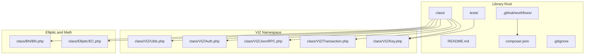
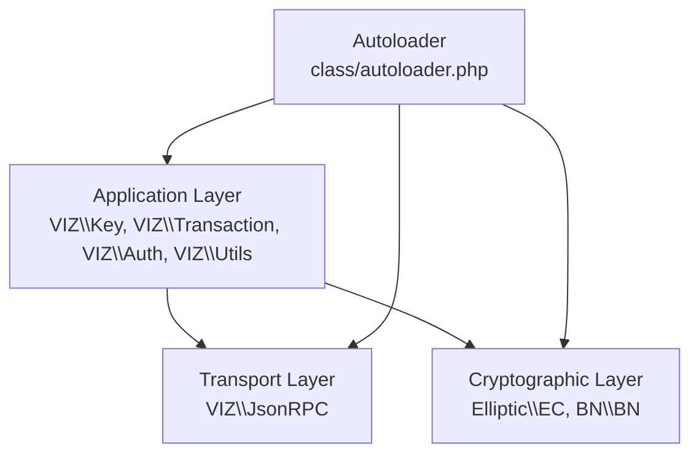
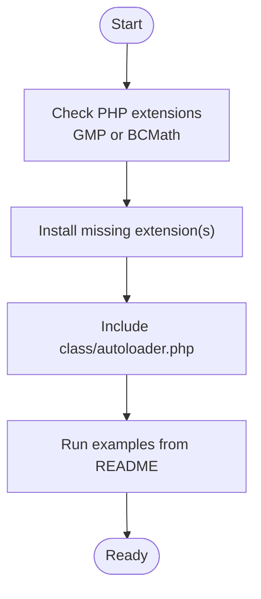
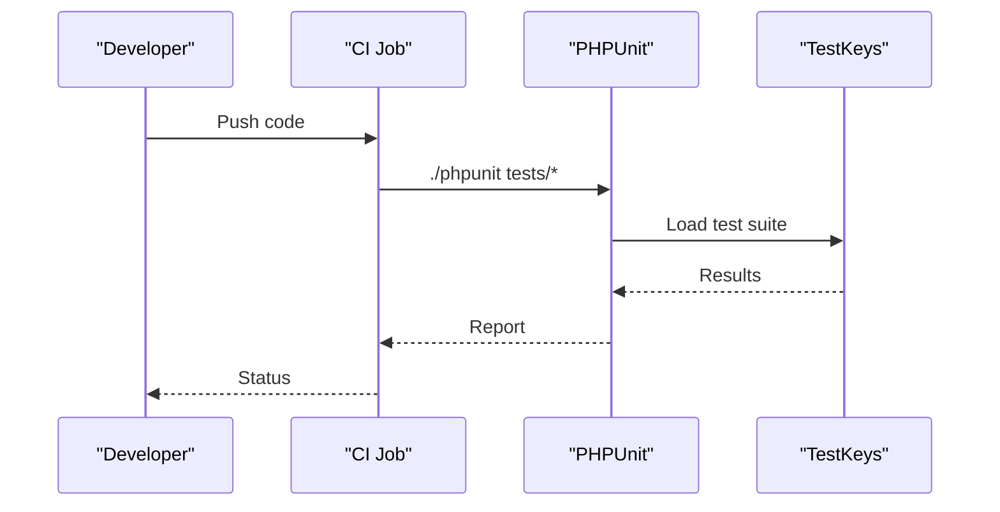

# Contributing and Development

<cite>
**Referenced Files in This Document**
- [README.md](file://README.md)
- [composer.json](file://composer.json)
- [.github/workflows/ci.yml](file://.github/workflows/ci.yml)
- [class/autoloader.php](file://class/autoloader.php)
- [class/VIZ/Key.php](file://class/VIZ/Key.php)
- [class/VIZ/Transaction.php](file://class/VIZ/Transaction.php)
- [class/VIZ/Auth.php](file://class/VIZ/Auth.php)
- [class/VIZ/JsonRPC.php](file://class/VIZ/JsonRPC.php)
- [class/VIZ/Utils.php](file://class/VIZ/Utils.php)
- [class/Elliptic/EC.php](file://class/Elliptic/EC.php)
- [class/BN/BN.php](file://class/BN/BN.php)
- [tests/TestKeys.php](file://tests/TestKeys.php)
- [.gitignore](file://.gitignore)
- [LICENSE](file://LICENSE)
</cite>

## Table of Contents
1. [Introduction](#introduction)
2. [Project Structure](#project-structure)
3. [Core Components](#core-components)
4. [Architecture Overview](#architecture-overview)
5. [Development Environment Setup](#development-environment-setup)
6. [Coding Standards and Conventions](#coding-standards-and-conventions)
7. [Testing Requirements](#testing-requirements)
8. [Contribution Procedures](#contribution-procedures)
9. [Pull Request Process](#pull-request-process)
10. [Release Procedures](#release-procedures)
11. [Version Management](#version-management)
12. [Documentation Updates](#documentation-updates)
13. [Community Contribution Guidelines](#community-contribution-guidelines)
14. [Governance and Decision-Making](#governance-and-decision-making)
15. [Troubleshooting Guide](#troubleshooting-guide)
16. [Conclusion](#conclusion)

## Introduction
This document provides comprehensive contributing and development guidelines for the VIZ PHP Library. It covers environment setup, code standards, testing requirements, contribution procedures, pull request and release processes, development workflow, version management, documentation updates, and community participation. The goal is to help contributors develop, test, and improve the library efficiently and consistently.

## Project Structure
The repository is organized around a small, self-contained PHP library with a clear namespace hierarchy and minimal external dependencies. The primary runtime classes live under the class/VIZ namespace, with supporting libraries for elliptic curve math and big integers located under class/Elliptic and class/BN respectively. Third-party compatibility classes are included directly in the repository.

**Diagram sources**
- [README.md](file://README.md#L1-L455)
- [composer.json](file://composer.json#L1-L32)
- [class/VIZ/Key.php](file://class/VIZ/Key.php#L1-L353)
- [class/VIZ/Transaction.php](file://class/VIZ/Transaction.php#L1-L800)
- [class/VIZ/JsonRPC.php](file://class/VIZ/JsonRPC.php#L1-L354)
- [class/VIZ/Auth.php](file://class/VIZ/Auth.php#L1-L70)
- [class/VIZ/Utils.php](file://class/VIZ/Utils.php#L1-L413)
- [class/Elliptic/EC.php](file://class/Elliptic/EC.php#L1-L272)
- [class/BN/BN.php](file://class/BN/BN.php#L1-L765)

**Section sources**
- [README.md](file://README.md#L1-L455)
- [composer.json](file://composer.json#L1-L32)

## Core Components
- VIZ\Key: Private/public key generation, encoding/decoding, signing, verification, shared key derivation, and memo encryption/decryption.
- VIZ\Transaction: Transaction building, Tapos resolution, multi-signature handling, broadcasting, and queue-mode operations.
- VIZ\JsonRPC: Low-level JSON-RPC client with socket-based transport, header management, and result parsing.
- VIZ\Auth: Passwordless authentication verification against blockchain authority structures.
- VIZ\Utils: Utility functions for Voice protocol posts, memo encryption, base58 encoding/decoding, AES-256-CBC, and cross-chain address helpers.
- Elliptic\EC and BN\BN: Elliptic curve operations and big integer arithmetic used by cryptographic routines.

**Section sources**
- [class/VIZ/Key.php](file://class/VIZ/Key.php#L1-L353)
- [class/VIZ/Transaction.php](file://class/VIZ/Transaction.php#L1-L800)
- [class/VIZ/JsonRPC.php](file://class/VIZ/JsonRPC.php#L1-L354)
- [class/VIZ/Auth.php](file://class/VIZ/Auth.php#L1-L70)
- [class/VIZ/Utils.php](file://class/VIZ/Utils.php#L1-L413)
- [class/Elliptic/EC.php](file://class/Elliptic/EC.php#L1-L272)
- [class/BN/BN.php](file://class/BN/BN.php#L1-L765)

## Architecture Overview
The library follows a layered design:
- Application layer: VIZ\Key, VIZ\Transaction, VIZ\Auth, VIZ\Utils
- Transport layer: VIZ\JsonRPC
- Cryptographic layer: Elliptic\EC and BN\BN
- Autoloading: class/autoloader.php registers a simple PSR-compatible loader

**Diagram sources**
- [class/VIZ/Key.php](file://class/VIZ/Key.php#L1-L353)
- [class/VIZ/Transaction.php](file://class/VIZ/Transaction.php#L1-L800)
- [class/VIZ/JsonRPC.php](file://class/VIZ/JsonRPC.php#L1-L354)
- [class/VIZ/Auth.php](file://class/VIZ/Auth.php#L1-L70)
- [class/VIZ/Utils.php](file://class/VIZ/Utils.php#L1-L413)
- [class/Elliptic/EC.php](file://class/Elliptic/EC.php#L1-L272)
- [class/BN/BN.php](file://class/BN/BN.php#L1-L765)
- [class/autoloader.php](file://class/autoloader.php#L1-L14)

## Development Environment Setup
- PHP runtime and extensions: The project requires either GMP or BCMath extensions. See the README for installation hints.
- Local execution: Include the autoloader and instantiate classes directly as shown in the examples.
- Composer: The repository defines autoload rules for namespaces VIZ, BN, BI, and Elliptic. While the library is classmap-based, Composer metadata is present for distribution and tooling compatibility.

**Diagram sources**
- [README.md](file://README.md#L20-L28)
- [class/autoloader.php](file://class/autoloader.php#L1-L14)
- [composer.json](file://composer.json#L19-L29)

**Section sources**
- [README.md](file://README.md#L20-L28)
- [class/autoloader.php](file://class/autoloader.php#L1-L14)
- [composer.json](file://composer.json#L19-L29)

## Coding Standards and Conventions
- Namespaces and autoloading: Use VIZ, BN, BI, Elliptic namespaces; rely on classmap and PSR-4 autoload entries.
- Strict typing: Test files demonstrate strict types declaration.
- Class design: Prefer single-responsibility classes with clear methods for cryptographic operations, transaction building, and RPC communication.
- Error handling: Methods often return false or arrays; callers should guard against falsy results and handle exceptions where applicable.
- Encoding and hashing: Base58, SHA-256, RIPEMD-160, AES-256-CBC, and Keccak are used for interoperability and compatibility.

**Section sources**
- [composer.json](file://composer.json#L19-L29)
- [tests/TestKeys.php](file://tests/TestKeys.php#L1-L29)
- [class/VIZ/Key.php](file://class/VIZ/Key.php#L1-L353)
- [class/VIZ/Utils.php](file://class/VIZ/Utils.php#L1-L413)

## Testing Requirements
- Test framework: PHPUnit is used. The CI workflow installs PHPUnit phar and executes tests.
- Test coverage: Current tests exercise key derivation and signature verification.
- Execution: Run tests locally using the installed PHPUnit binary or via Composer if configured.

**Diagram sources**
- [.github/workflows/ci.yml](file://.github/workflows/ci.yml#L1-L27)
- [tests/TestKeys.php](file://tests/TestKeys.php#L1-L29)

**Section sources**
- [.github/workflows/ci.yml](file://.github/workflows/ci.yml#L1-L27)
- [tests/TestKeys.php](file://tests/TestKeys.php#L1-L29)

## Contribution Procedures
- Fork and branch: Create a feature branch for changes.
- Implement: Follow existing code style and add unit tests where appropriate.
- Verify: Ensure examples from README still work and local tests pass.
- Commit: Keep commits focused and descriptive.
- Push and open PR: Submit a pull request targeting the default branch.

[No sources needed since this section provides general guidance]

## Pull Request Process
- Branch naming: Use descriptive names for feature branches.
- PR checklist: Include rationale, changes summary, and test coverage updates.
- Review: Address reviewer feedback promptly and update the PR accordingly.
- Merge: Maintainers will merge after approval and successful checks.

[No sources needed since this section provides general guidance]

## Release Procedures
- Version tagging: Tag releases according to semantic versioning.
- Changelog: Summarize breaking changes, new features, and fixes.
- Distribution: Publish artifacts via Composer or package managers as maintained.

[No sources needed since this section provides general guidance]

## Version Management
- Semantic versioning: Adopt MAJOR.MINOR.PATCH semantics.
- Backward compatibility: Respect API stability; deprecate rather than remove methods.
- Breaking changes: Document clearly in release notes and migration guides.

[No sources needed since this section provides general guidance]

## Documentation Updates
- Inline examples: Keep README examples current with API changes.
- API docs: Maintain accurate signatures and behavior descriptions.
- Tutorials: Add usage scenarios for new features.

[No sources needed since this section provides general guidance]

## Community Contribution Guidelines
- Code of conduct: Follow respectful communication and inclusive participation.
- Issue reporting: Provide reproducible examples and environment details.
- Feature requests: Describe use cases and potential impact.

[No sources needed since this section provides general guidance]

## Governance and Decision-Making
- Maintainers: Core contributors with merge permissions.
- Decisions: Major changes discussed openly; consensus preferred; maintainers have final say on releases and breaking changes.

[No sources needed since this section provides general guidance]

## Troubleshooting Guide
Common issues and resolutions:
- Missing extensions: Install GMP or BCMath as indicated in the README.
- Socket timeouts: Adjust JsonRPC read timeout or endpoint selection.
- Signature errors: Ensure canonical signature generation and correct data hashing.
- Memo decryption failures: Verify shared key derivation and checksum validation.

**Section sources**
- [README.md](file://README.md#L20-L28)
- [class/VIZ/JsonRPC.php](file://class/VIZ/JsonRPC.php#L16-L17)
- [class/VIZ/Key.php](file://class/VIZ/Key.php#L302-L338)
- [class/VIZ/Utils.php](file://class/VIZ/Utils.php#L129-L175)

## Conclusion
This guide consolidates the essential steps to contribute effectively to the VIZ PHP Library. By following the environment setup, coding conventions, testing practices, and contribution workflows outlined here, contributors can collaborate efficiently and sustain the library’s quality and reliability.