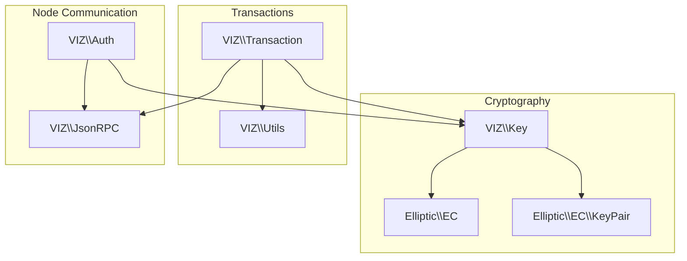
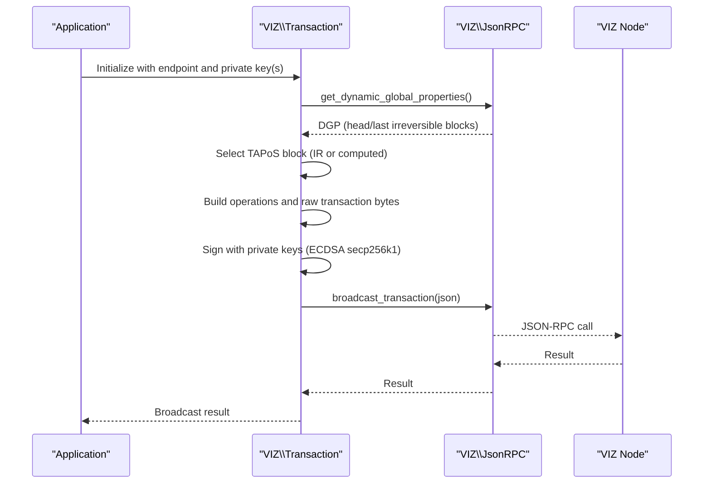
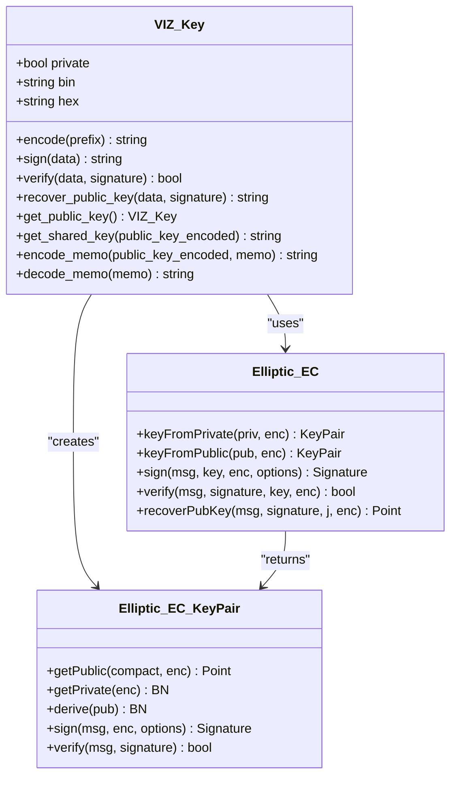
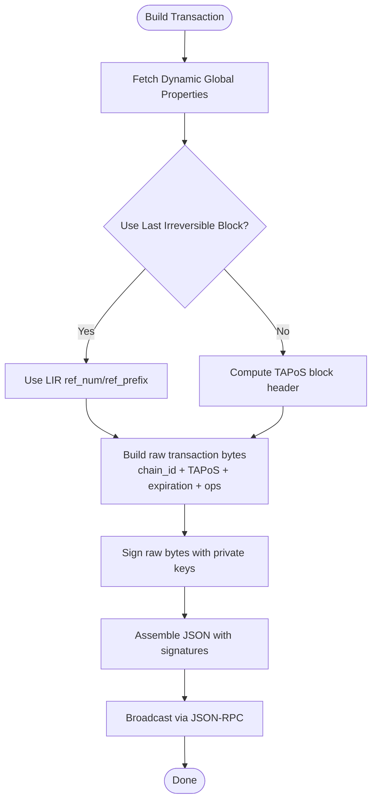
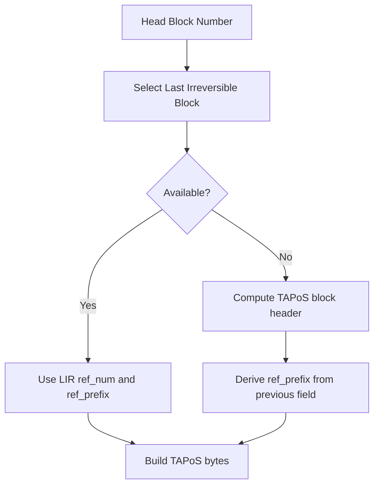
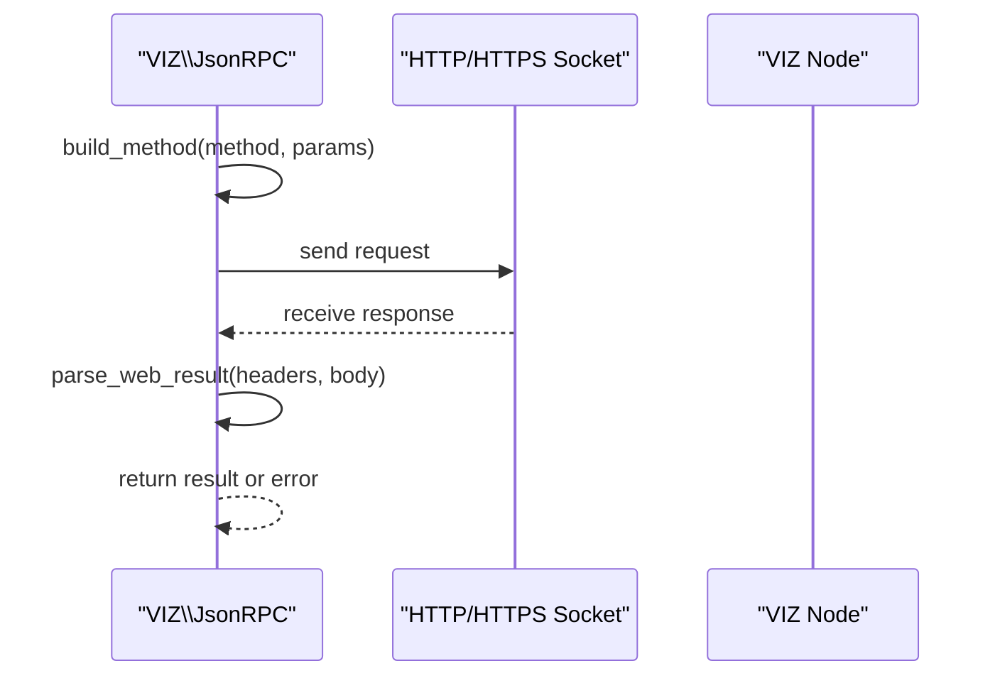
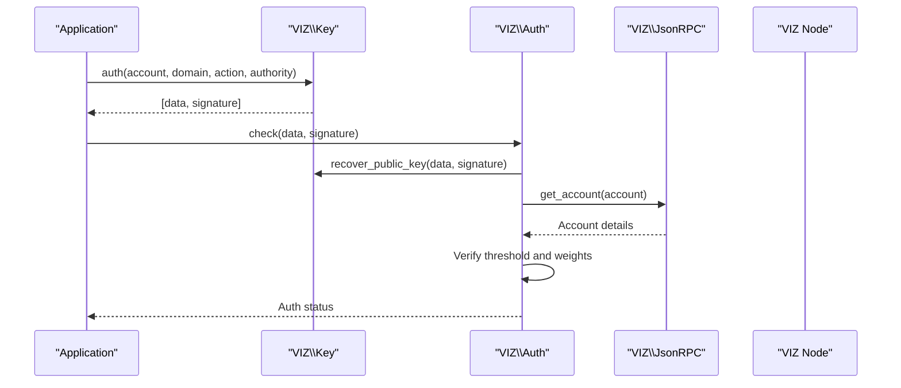

# Core Concepts

<cite>
**Referenced Files in This Document**
- [README.md](file://README.md)
- [composer.json](file://composer.json)
- [class/autoloader.php](file://class/autoloader.php)
- [class/VIZ/Key.php](file://class/VIZ/Key.php)
- [class/Elliptic/EC.php](file://class/Elliptic/EC.php)
- [class/Elliptic/EC/KeyPair.php](file://class/Elliptic/EC/KeyPair.php)
- [class/VIZ/Transaction.php](file://class/VIZ/Transaction.php)
- [class/VIZ/JsonRPC.php](file://class/VIZ/JsonRPC.php)
- [class/VIZ/Auth.php](file://class/VIZ/Auth.php)
- [class/VIZ/Utils.php](file://class/VIZ/Utils.php)
</cite>

## Table of Contents
1. [Introduction](#introduction)
2. [Project Structure](#project-structure)
3. [Core Components](#core-components)
4. [Architecture Overview](#architecture-overview)
5. [Detailed Component Analysis](#detailed-component-analysis)
6. [Dependency Analysis](#dependency-analysis)
7. [Performance Considerations](#performance-considerations)
8. [Troubleshooting Guide](#troubleshooting-guide)
9. [Conclusion](#conclusion)

## Introduction
This document explains the core concepts of the VIZ PHP Library with a focus on cryptographic foundations, transaction construction, TAPoS (Time Access to Payment of Service) blocks, and JSON-RPC protocol basics. It connects how keys, transactions, and node communication work together in the library’s architecture, and provides conceptual diagrams to help both technical and non-technical readers understand how VIZ blockchain primitives are implemented in PHP.

## Project Structure
The library is organized around three primary domains:
- Cryptography: elliptic curve key management, signatures, and shared secrets
- Transactions: building, signing, and broadcasting operations
- Node Communication: JSON-RPC client for interacting with VIZ nodes



**Diagram sources**
- [class/VIZ/Key.php](file://class/VIZ/Key.php#L1-L353)
- [class/Elliptic/EC.php](file://class/Elliptic/EC.php#L1-L272)
- [class/Elliptic/EC/KeyPair.php](file://class/Elliptic/EC/KeyPair.php#L1-L138)
- [class/VIZ/Transaction.php](file://class/VIZ/Transaction.php#L1-L1416)
- [class/VIZ/JsonRPC.php](file://class/VIZ/JsonRPC.php#L1-L354)
- [class/VIZ/Auth.php](file://class/VIZ/Auth.php#L1-L70)
- [class/VIZ/Utils.php](file://class/VIZ/Utils.php#L1-L413)

**Section sources**
- [README.md](file://README.md#L1-L455)
- [composer.json](file://composer.json#L1-L32)
- [class/autoloader.php](file://class/autoloader.php#L1-L14)

## Core Components
- VIZ\Key: Manages private/public keys, WIF encoding, signing, signature verification, public key recovery, shared key derivation, and memo encryption/decryption.
- Elliptic\EC and Elliptic\EC\KeyPair: Provide the underlying elliptic curve cryptography (secp256k1) for key generation, signing, verification, and public key recovery.
- VIZ\Transaction: Builds transactions, computes TAPoS, signs with private keys, and broadcasts via JSON-RPC.
- VIZ\JsonRPC: Implements JSON-RPC 2.0 over HTTP/HTTPS sockets, mapping method names to plugin APIs and handling responses.
- VIZ\Auth: Validates passwordless authentication requests against node authority checks.
- VIZ\Utils: Provides helpers for memo encryption, Base58 encoding/decoding, AES-256-CBC, VLQ encoding, and Voice protocol utilities.

**Section sources**
- [class/VIZ/Key.php](file://class/VIZ/Key.php#L1-L353)
- [class/Elliptic/EC.php](file://class/Elliptic/EC.php#L1-L272)
- [class/Elliptic/EC/KeyPair.php](file://class/Elliptic/EC/KeyPair.php#L1-L138)
- [class/VIZ/Transaction.php](file://class/VIZ/Transaction.php#L1-L1416)
- [class/VIZ/JsonRPC.php](file://class/VIZ/JsonRPC.php#L1-L354)
- [class/VIZ/Auth.php](file://class/VIZ/Auth.php#L1-L70)
- [class/VIZ/Utils.php](file://class/VIZ/Utils.php#L1-L413)

## Architecture Overview
The library composes cryptographic primitives with transaction builders and a JSON-RPC client to enable secure, verifiable interactions with VIZ nodes. The flow below shows how a signed transaction is constructed and broadcast.



**Diagram sources**
- [class/VIZ/Transaction.php](file://class/VIZ/Transaction.php#L61-L157)
- [class/VIZ/JsonRPC.php](file://class/VIZ/JsonRPC.php#L311-L353)

## Detailed Component Analysis

### Cryptographic Principles and Keys
- Private/public key pairs: The library uses secp256k1 via Elliptic\EC and Elliptic\EC\KeyPair. Private keys can be imported from hex/bin/WIF or generated, and public keys derived from private keys.
- Digital signatures: ECDSA signatures are produced deterministically with canonical form and verified using the public key.
- Public key recovery: Signatures carry a recovery parameter allowing reconstruction of the public key from the signature and message hash.
- Shared secrets and memo encryption: ECDH-derived shared keys enable AES-256-CBC encryption/decryption compatible with the VIZ JavaScript libraries.



**Diagram sources**
- [class/VIZ/Key.php](file://class/VIZ/Key.php#L1-L353)
- [class/Elliptic/EC.php](file://class/Elliptic/EC.php#L1-L272)
- [class/Elliptic/EC/KeyPair.php](file://class/Elliptic/EC/KeyPair.php#L1-L138)

**Section sources**
- [class/VIZ/Key.php](file://class/VIZ/Key.php#L1-L353)
- [class/Elliptic/EC.php](file://class/Elliptic/EC.php#L1-L272)
- [class/Elliptic/EC/KeyPair.php](file://class/Elliptic/EC/KeyPair.php#L1-L138)

### Transaction Structure and Signing
- Operations: The library supports building numerous VIZ operations (e.g., account creation, awards, custom operations) and serializing them into raw binary and JSON.
- TAPoS: The transaction includes a reference block number and a reference block prefix derived from the selected block header. The library prefers the last irreversible block for robustness.
- Expiration: A future expiration time is included to prevent replay attacks.
- Multi-signature: Multiple private keys can sign the same transaction payload, producing multiple signatures appended to the transaction JSON.
- Broadcasting: Uses JSON-RPC methods to broadcast either synchronously or asynchronously.



**Diagram sources**
- [class/VIZ/Transaction.php](file://class/VIZ/Transaction.php#L61-L157)

**Section sources**
- [class/VIZ/Transaction.php](file://class/VIZ/Transaction.php#L1-L1416)

### TAPoS (Time Access to Payment of Service) Blocks
- Purpose: Prevents transaction replay by anchoring each transaction to a recent block.
- Selection: The library prefers the last irreversible block number and its block ID prefix for maximum safety. If unavailable, it computes a TAPoS block header and derives the prefix accordingly.
- Encoding: The reference block number and prefix are concatenated into the transaction’s TAPoS field.



**Diagram sources**
- [class/VIZ/Transaction.php](file://class/VIZ/Transaction.php#L61-L113)

**Section sources**
- [class/VIZ/Transaction.php](file://class/VIZ/Transaction.php#L61-L113)

### JSON-RPC Protocol Basics
- Transport: HTTP/HTTPS sockets with manual request assembly and response parsing.
- Methods: Methods are mapped to plugin APIs (e.g., database_api, network_broadcast_api). The client builds JSON-RPC 2.0 envelopes and sends them to the configured endpoint.
- Responses: Supports simple mode (only result) and extended mode (includes errors). Handles redirects, chunked transfer, and gzip decoding.



**Diagram sources**
- [class/VIZ/JsonRPC.php](file://class/VIZ/JsonRPC.php#L258-L353)

**Section sources**
- [class/VIZ/JsonRPC.php](file://class/VIZ/JsonRPC.php#L1-L354)

### Passwordless Authentication and Node Authority Checks
- Data generation: The library constructs a canonical string including domain, action, account, authority, timestamp, and nonce.
- Signing: The account’s private key signs the data to produce a signature.
- Verification: The library recovers the public key from the signature, fetches the account from the node, and checks thresholds and weights for the specified authority level.



**Diagram sources**
- [class/VIZ/Auth.php](file://class/VIZ/Auth.php#L25-L69)
- [class/VIZ/Key.php](file://class/VIZ/Key.php#L339-L352)
- [class/VIZ/JsonRPC.php](file://class/VIZ/JsonRPC.php#L311-L353)

**Section sources**
- [class/VIZ/Auth.php](file://class/VIZ/Auth.php#L1-L70)
- [class/VIZ/Key.php](file://class/VIZ/Key.php#L339-L352)

### Practical Examples and Workflows
- Signing and verifying messages: Demonstrates canonical signature generation and verification.
- Building and broadcasting transactions: Shows constructing operations, signing, and broadcasting.
- Multi-signature and queued operations: Demonstrates queuing multiple operations and adding additional signatures.
- Memo encryption/decryption: Uses shared keys and AES-256-CBC for secure messaging.
- Passwordless authentication: Generates and validates domain-scoped auth requests.

These examples are documented in the repository’s README and serve as practical references for integrating the library.

**Section sources**
- [README.md](file://README.md#L36-L455)

## Dependency Analysis
The library’s dependencies are minimal and focused:
- PSR-4 autoloading maps namespaces to class directories.
- Third-party libraries are embedded locally for portability and customization (elliptic-php, bn-php, bigint-wrapper-php, keccak-php).
- No external Composer dependencies are required.

```mermaid
graph TB
Root["Repository Root"]
Autoload["class/autoloader.php"]
PSR["composer.json (PSR-4)"]
Root --> Autoload
Root --> PSR
PSR --> |"classmap"| Root
PSR --> |"VIZ\\"| "class/VIZ/"
PSR --> |"BN\\"| "class/BN/"
PSR --> |"BI\\"| "class/BI/"
PSR --> |"Elliptic\\"| "class/Elliptic/"
```

**Diagram sources**
- [composer.json](file://composer.json#L19-L29)
- [class/autoloader.php](file://class/autoloader.php#L1-L14)

**Section sources**
- [composer.json](file://composer.json#L1-L32)
- [class/autoloader.php](file://class/autoloader.php#L1-L14)

## Performance Considerations
- Canonical signature generation: The signing process retries until a canonical signature is found; this may require multiple attempts under rare conditions.
- Network latency: JSON-RPC calls depend on node responsiveness; consider timeouts and retry strategies for production deployments.
- Transaction size limits: For Voice protocol posts, consider splitting long content into multiple events to stay within size constraints.
- Memory usage: Large transactions and batch operations should be handled carefully to avoid excessive memory consumption.

[No sources needed since this section provides general guidance]

## Troubleshooting Guide
- Signature verification failures: Ensure the correct public key is used and that the data matches exactly what was signed.
- TAPoS mismatch: Confirm the node’s last irreversible block and ensure the transaction expiration is set appropriately.
- JSON-RPC errors: Enable extended mode to capture error details from the node; verify endpoint URLs and SSL settings.
- Authentication failures: Check authority thresholds and key weights on the account; ensure the domain/action/authority match the intended scope.

**Section sources**
- [class/VIZ/Key.php](file://class/VIZ/Key.php#L312-L338)
- [class/VIZ/Transaction.php](file://class/VIZ/Transaction.php#L61-L157)
- [class/VIZ/JsonRPC.php](file://class/VIZ/JsonRPC.php#L335-L353)
- [class/VIZ/Auth.php](file://class/VIZ/Auth.php#L25-L69)

## Conclusion
The VIZ PHP Library provides a cohesive implementation of cryptographic primitives, transaction construction with TAPoS, and JSON-RPC node communication. By combining secure key management, deterministic signing, and robust node interaction, it enables reliable and verifiable interactions with the VIZ blockchain. The included examples and modular design facilitate integration across diverse applications.