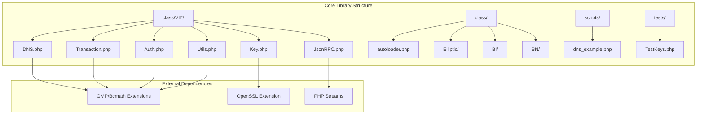
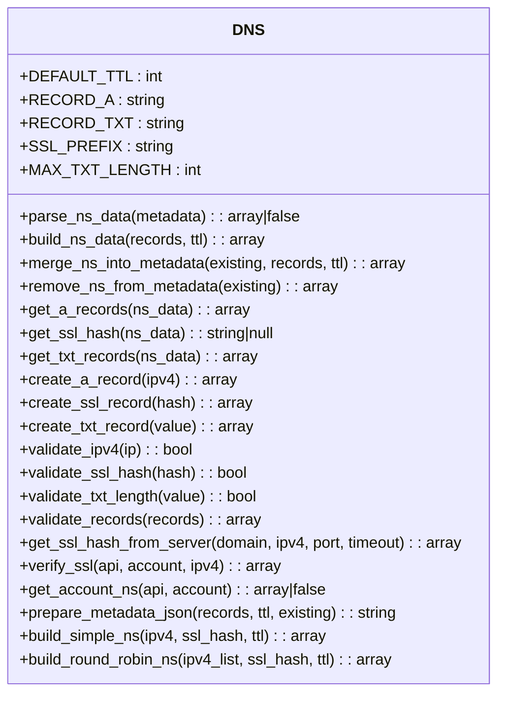
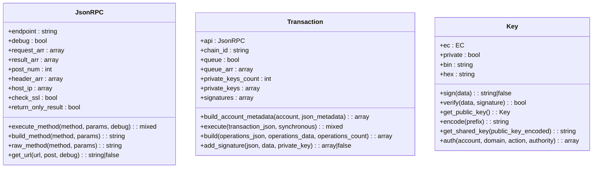
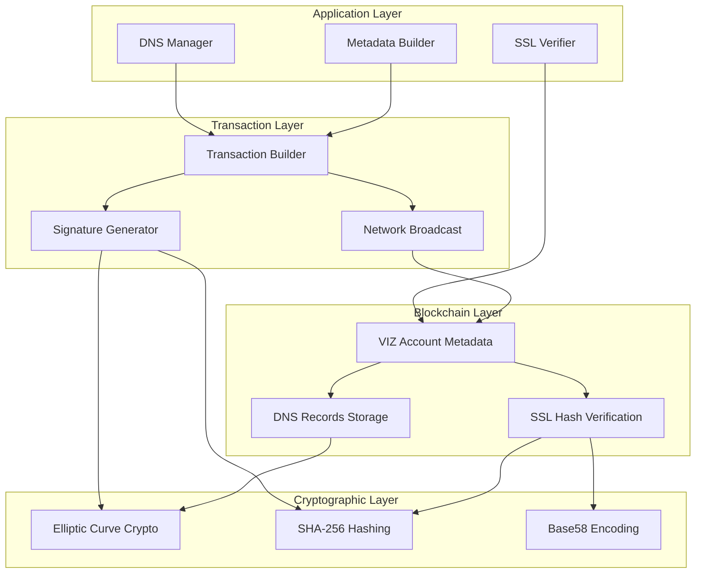
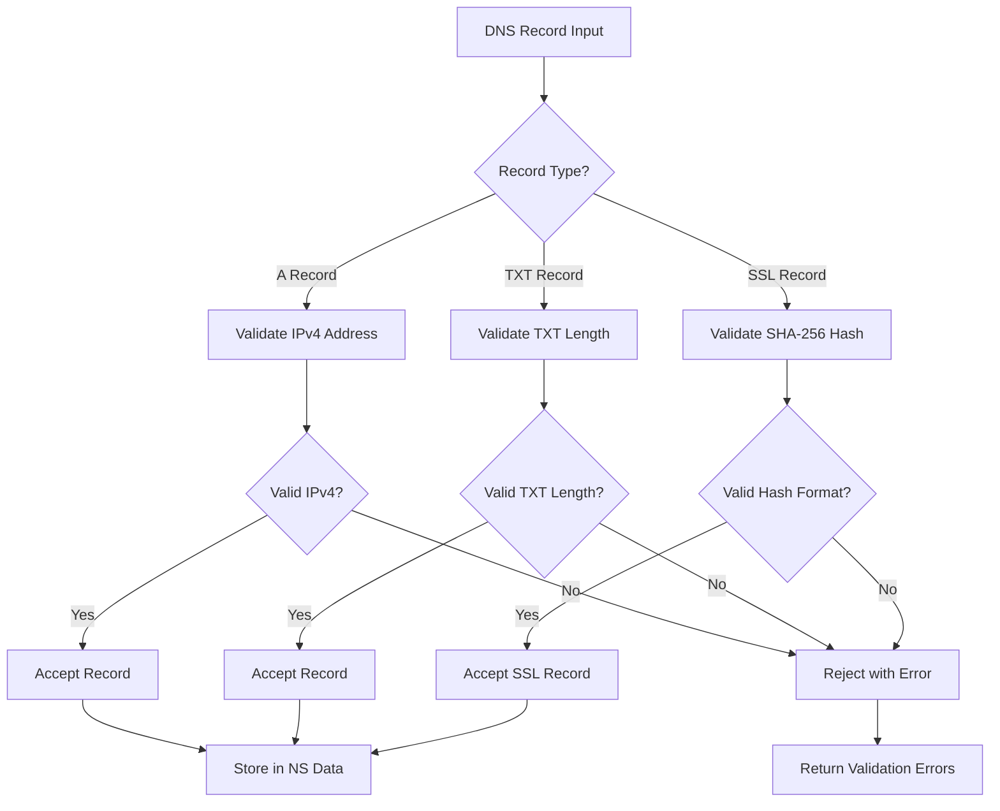
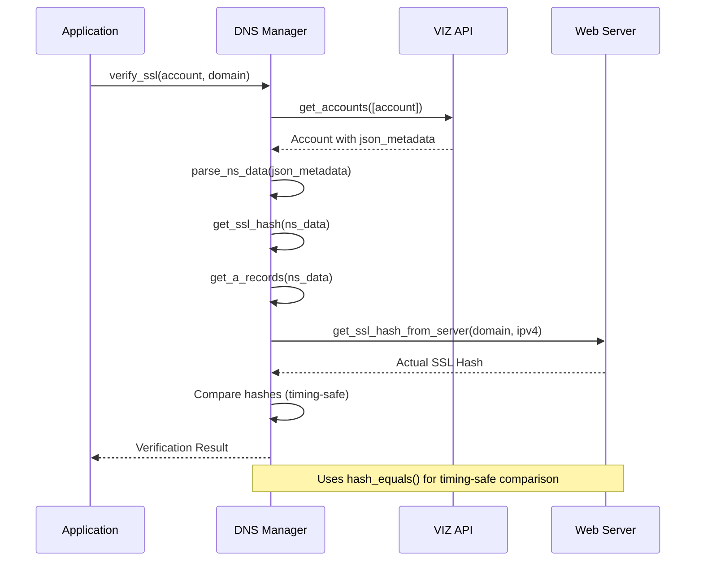
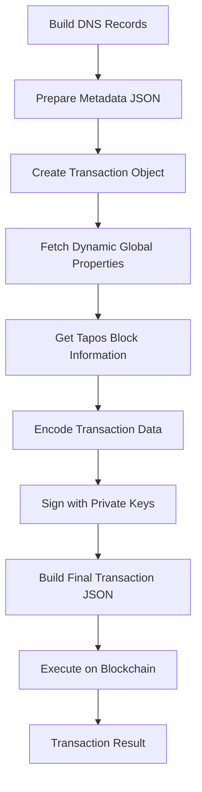
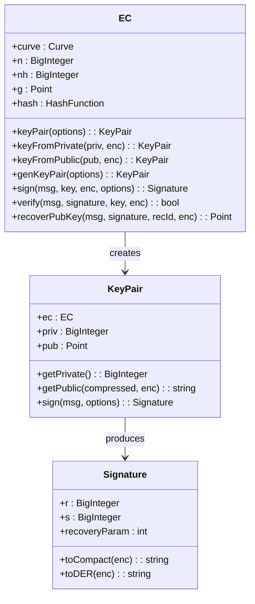
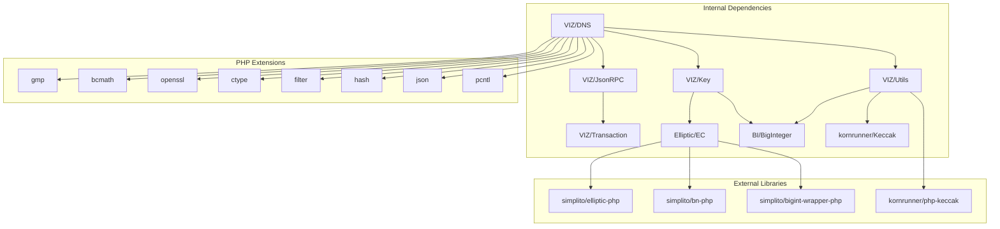

# VIZ DNS Nameserver

<cite>
**Referenced Files in This Document**
- [README.md](file://README.md)
- [composer.json](file://composer.json)
- [class/VIZ/DNS.php](file://class/VIZ/DNS.php)
- [class/VIZ/JsonRPC.php](file://class/VIZ/JsonRPC.php)
- [class/VIZ/Transaction.php](file://class/VIZ/Transaction.php)
- [class/VIZ/Key.php](file://class/VIZ/Key.php)
- [class/VIZ/Auth.php](file://class/VIZ/Auth.php)
- [class/VIZ/Utils.php](file://class/VIZ/Utils.php)
- [class/autoloader.php](file://class/autoloader.php)
- [scripts/dns_example.php](file://scripts/dns_example.php)
</cite>

## Table of Contents
1. [Introduction](#introduction)
2. [Project Structure](#project-structure)
3. [Core Components](#core-components)
4. [Architecture Overview](#architecture-overview)
5. [Detailed Component Analysis](#detailed-component-analysis)
6. [Dependency Analysis](#dependency-analysis)
7. [Performance Considerations](#performance-considerations)
8. [Troubleshooting Guide](#troubleshooting-guide)
9. [Conclusion](#conclusion)

## Introduction

The VIZ DNS Nameserver is a specialized PHP library designed to provide DNS-like functionality for the VIZ blockchain ecosystem. This library enables domain owners to publish and manage DNS records directly on the blockchain, creating a decentralized and tamper-proof naming system that integrates seamlessly with VIZ account metadata.

The library focuses on three primary DNS record types:
- **A records**: IPv4 address resolution for domains
- **TXT records**: Text-based data storage including SSL certificate hashes
- **SSL verification**: Cryptographically secure certificate validation against blockchain-stored hashes

Built on top of the VIZ blockchain's account metadata system, this library provides a comprehensive solution for decentralized domain management, enabling secure and verifiable DNS resolution without traditional centralized DNS infrastructure.

## Project Structure

The VIZ DNS Nameserver library follows a modular architecture organized around core blockchain interaction components and specialized DNS functionality:

**Diagram sources**
- [class/VIZ/DNS.php](file://class/VIZ/DNS.php#L1-L511)
- [class/VIZ/JsonRPC.php](file://class/VIZ/JsonRPC.php#L1-L368)
- [class/VIZ/Transaction.php](file://class/VIZ/Transaction.php#L1-L800)

**Section sources**
- [composer.json](file://composer.json#L19-L29)
- [class/autoloader.php](file://class/autoloader.php#L1-L14)

The project is structured with clear separation of concerns:
- **VIZ namespace classes**: Core blockchain integration and cryptographic operations
- **Elliptic curve cryptography**: Secure key generation and signature verification
- **BigInteger arithmetic**: High-precision mathematical operations for cryptographic functions
- **Example scripts**: Demonstration of practical usage scenarios
- **Unit tests**: Comprehensive testing framework for cryptographic operations

## Core Components

The VIZ DNS Nameserver library consists of several interconnected components that work together to provide comprehensive DNS functionality on the blockchain:

### DNS Management System

The central `DNS` class provides a complete toolkit for managing DNS records within VIZ blockchain accounts:

**Diagram sources**
- [class/VIZ/DNS.php](file://class/VIZ/DNS.php#L12-L511)

### Blockchain Interaction Layer

The library integrates with the VIZ blockchain through specialized classes that handle transaction building, signing, and API communication:

**Diagram sources**
- [class/VIZ/JsonRPC.php](file://class/VIZ/JsonRPC.php#L4-L368)
- [class/VIZ/Transaction.php](file://class/VIZ/Transaction.php#L10-L800)
- [class/VIZ/Key.php](file://class/VIZ/Key.php#L9-L353)

**Section sources**
- [class/VIZ/DNS.php](file://class/VIZ/DNS.php#L12-L511)
- [class/VIZ/JsonRPC.php](file://class/VIZ/JsonRPC.php#L4-L368)
- [class/VIZ/Transaction.php](file://class/VIZ/Transaction.php#L10-L800)
- [class/VIZ/Key.php](file://class/VIZ/Key.php#L9-L353)

## Architecture Overview

The VIZ DNS Nameserver implements a layered architecture that separates blockchain interaction from DNS record management:

**Diagram sources**
- [class/VIZ/DNS.php](file://class/VIZ/DNS.php#L368-L435)
- [class/VIZ/Transaction.php](file://class/VIZ/Transaction.php#L61-L157)
- [class/VIZ/Key.php](file://class/VIZ/Key.php#L302-L352)

The architecture follows these key principles:

1. **Separation of Concerns**: DNS management is isolated from blockchain operations
2. **Layered Security**: Cryptographic operations are handled at the lowest level
3. **Transaction Abstraction**: Complex blockchain operations are simplified through high-level APIs
4. **Extensible Design**: New record types and validation rules can be easily added

## Detailed Component Analysis

### DNS Record Management System

The DNS component provides comprehensive functionality for managing various DNS record types within VIZ blockchain accounts:

#### Record Types and Validation

The system supports three primary record types with strict validation mechanisms:

**Diagram sources**
- [class/VIZ/DNS.php](file://class/VIZ/DNS.php#L241-L277)
- [class/VIZ/DNS.php](file://class/VIZ/DNS.php#L211-L233)

#### SSL Certificate Verification Workflow

The SSL verification process ensures cryptographic integrity between blockchain-stored certificate hashes and actual server certificates:

**Diagram sources**
- [class/VIZ/DNS.php](file://class/VIZ/DNS.php#L368-L435)
- [class/VIZ/DNS.php](file://class/VIZ/DNS.php#L288-L358)

#### Metadata Management Operations

The library provides sophisticated metadata manipulation capabilities:

| Operation | Purpose | Implementation |
|-----------|---------|----------------|
| `parse_ns_data()` | Extract DNS data from account metadata | JSON parsing with fallback handling |
| `build_ns_data()` | Create DNS metadata structure | Array construction with TTL |
| `merge_ns_into_metadata()` | Combine DNS with existing metadata | Safe merging with validation |
| `remove_ns_from_metadata()` | Clean DNS data from metadata | Array cleanup |

**Section sources**
- [class/VIZ/DNS.php](file://class/VIZ/DNS.php#L32-L108)
- [class/VIZ/DNS.php](file://class/VIZ/DNS.php#L116-L203)

### Transaction Building and Execution

The transaction system handles the complex process of creating and broadcasting DNS-related operations to the VIZ blockchain:

#### Transaction Construction Process

**Diagram sources**
- [class/VIZ/Transaction.php](file://class/VIZ/Transaction.php#L61-L157)
- [class/VIZ/DNS.php](file://class/VIZ/DNS.php#L461-L469)

#### Multi-Signature Support

The transaction system supports advanced multi-signature configurations:

| Authority Level | Weight Threshold | Key Authentication |
|----------------|------------------|-------------------|
| Master | Typically 1 | Primary account keys |
| Active | Configurable | Secondary account keys |
| Regular | Configurable | General operations keys |

**Section sources**
- [class/VIZ/Transaction.php](file://class/VIZ/Transaction.php#L191-L350)
- [class/VIZ/Transaction.php](file://class/VIZ/Transaction.php#L351-L502)

### Cryptographic Foundation

The library leverages robust cryptographic primitives for secure operations:

#### Elliptic Curve Cryptography

The implementation uses the secp256k1 curve for all cryptographic operations:

**Diagram sources**
- [class/Elliptic/EC.php](file://class/Elliptic/EC.php#L9-L200)
- [class/VIZ/Key.php](file://class/VIZ/Key.php#L9-L353)

**Section sources**
- [class/VIZ/Key.php](file://class/VIZ/Key.php#L14-L32)
- [class/Elliptic/EC.php](file://class/Elliptic/EC.php#L46-L75)

## Dependency Analysis

The VIZ DNS Nameserver library has a carefully managed dependency structure that balances functionality with minimal external requirements:

**Diagram sources**
- [composer.json](file://composer.json#L19-L29)
- [class/VIZ/DNS.php](file://class/VIZ/DNS.php#L1-L12)

### External Dependencies and Requirements

The library requires specific PHP extensions for optimal performance:

| Extension | Purpose | Alternative |
|-----------|---------|-------------|
| GMP | High-precision arithmetic | BCMath |
| BCMath | Mathematical operations | GMP |
| OpenSSL | SSL/TLS operations | None |
| Filter | Input validation | None |
| Hash | Cryptographic hashing | None |
| JSON | Data serialization | None |

**Section sources**
- [README.md](file://README.md#L20-L28)
- [composer.json](file://composer.json#L19-L29)

## Performance Considerations

The VIZ DNS Nameserver library is optimized for both security and performance:

### Cryptographic Performance

- **Elliptic Curve Operations**: Optimized using the secp256k1 curve for efficient signature generation and verification
- **BigInteger Arithmetic**: Automatic selection between GMP and BCMath based on availability
- **Memory Management**: Efficient handling of large cryptographic values and signatures

### Network Optimization

- **Connection Pooling**: Reuse of network connections for API requests
- **Response Caching**: Temporary caching of frequently accessed blockchain data
- **Timeout Management**: Configurable timeouts for reliable operation

### Transaction Efficiency

- **Batch Operations**: Support for multiple DNS record updates in single transactions
- **Queue System**: Asynchronous processing of multiple operations
- **Signature Optimization**: Efficient multi-signature aggregation

## Troubleshooting Guide

Common issues and their solutions when working with the VIZ DNS Nameserver:

### SSL Verification Issues

**Problem**: SSL verification fails despite correct configuration
**Solution**: 
1. Verify DNS records are properly published to blockchain
2. Check network connectivity to VIZ nodes
3. Confirm SSL certificate matches blockchain-stored hash

**Section sources**
- [class/VIZ/DNS.php](file://class/VIZ/DNS.php#L368-L435)

### Transaction Broadcasting Problems

**Problem**: Transactions fail to broadcast or confirm
**Solution**:
1. Verify sufficient VIZ balance for fees
2. Check transaction expiration settings
3. Ensure proper private key formatting

**Section sources**
- [class/VIZ/Transaction.php](file://class/VIZ/Transaction.php#L53-L60)

### Metadata Encoding Errors

**Problem**: Metadata fails to encode properly for blockchain storage
**Solution**:
1. Validate JSON structure compliance
2. Check character encoding issues
3. Verify escape sequence handling

**Section sources**
- [class/VIZ/DNS.php](file://class/VIZ/DNS.php#L461-L469)

## Conclusion

The VIZ DNS Nameserver represents a sophisticated solution for decentralized domain management, combining blockchain technology with familiar DNS concepts. The library provides:

- **Complete DNS Functionality**: Support for A records, TXT records, and SSL verification
- **Robust Security**: Cryptographically secure operations using proven elliptic curve cryptography
- **Flexible Integration**: Easy-to-use APIs that integrate seamlessly with existing applications
- **Production Ready**: Comprehensive error handling, validation, and performance optimization

The modular architecture ensures maintainability and extensibility, while the comprehensive example scripts demonstrate practical usage patterns. The library serves as a foundation for building decentralized applications that require reliable, tamper-proof domain resolution services.

Future enhancements could include support for additional DNS record types, improved caching mechanisms, and expanded SSL certificate validation features. The solid architectural foundation makes such extensions straightforward to implement while maintaining backward compatibility.