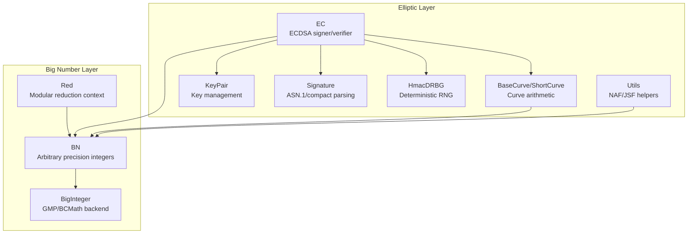
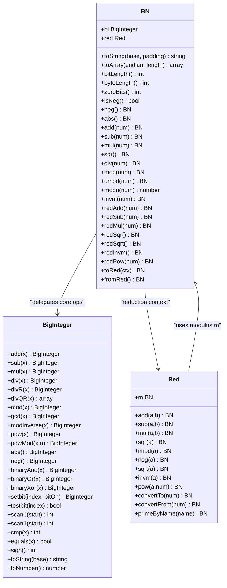
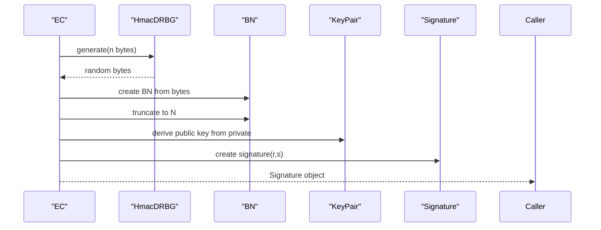
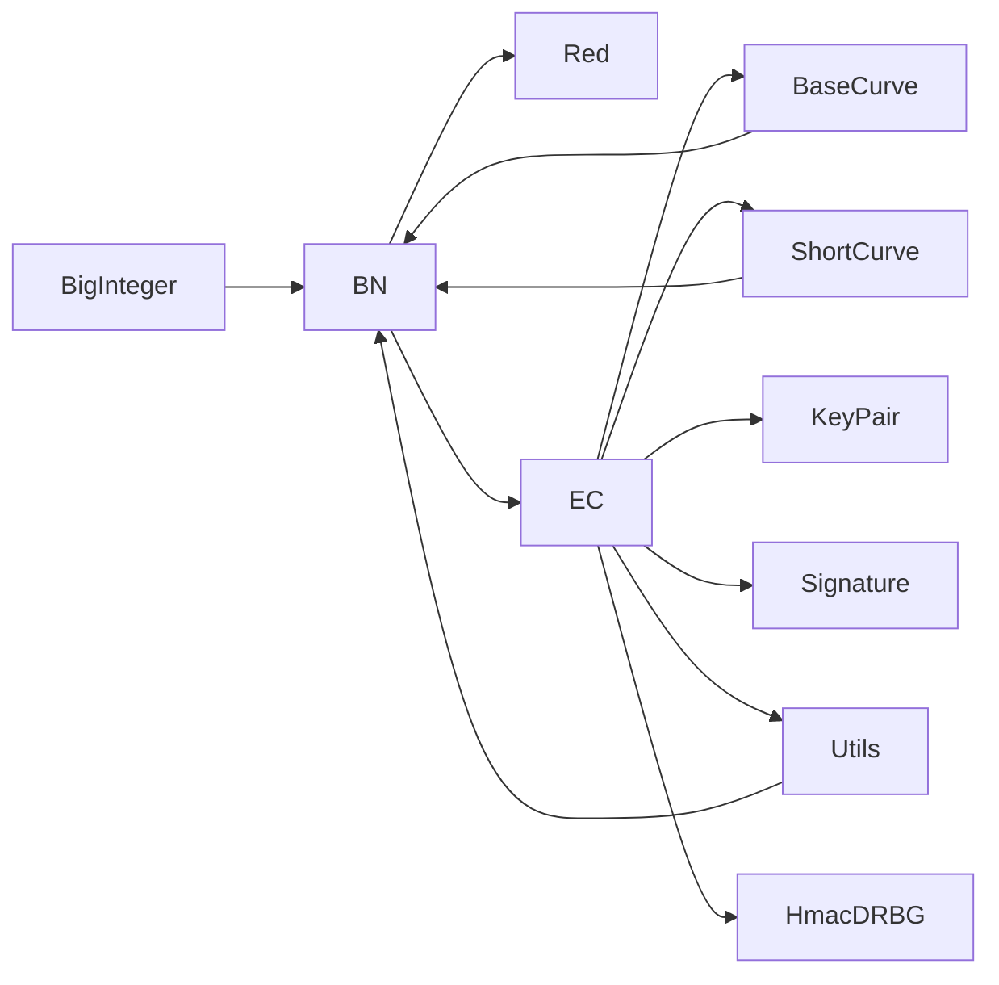

# Big Number Arithmetic

<cite>
**Referenced Files in This Document**
- [BN.php](file://class/BN/BN.php)
- [Red.php](file://class/BN/Red.php)
- [BigInteger.php](file://class/BI/BigInteger.php)
- [EC.php](file://class/Elliptic/EC.php)
- [Utils.php](file://class/Elliptic/Utils.php)
- [HmacDRBG.php](file://class/Elliptic/HmacDRBG.php)
- [KeyPair.php](file://class/Elliptic/EC/KeyPair.php)
- [Signature.php](file://class/Elliptic/EC/Signature.php)
- [Curves.php](file://class/Elliptic/Curves.php)
- [BaseCurve.php](file://class/Elliptic/Curve/BaseCurve.php)
- [ShortCurve.php](file://class/Elliptic/Curve/ShortCurve.php)
- [README.md](file://README.md)
</cite>

## Table of Contents
1. [Introduction](#introduction)
2. [Project Structure](#project-structure)
3. [Core Components](#core-components)
4. [Architecture Overview](#architecture-overview)
5. [Detailed Component Analysis](#detailed-component-analysis)
6. [Dependency Analysis](#dependency-analysis)
7. [Performance Considerations](#performance-considerations)
8. [Troubleshooting Guide](#troubleshooting-guide)
9. [Conclusion](#conclusion)
10. [Appendices](#appendices)

## Introduction
This document provides a comprehensive guide to the Big Number Arithmetic subsystem used for cryptographic operations in the VIZ PHP Library. It focuses on the BN class for arbitrary precision integer arithmetic, modular operations, finite field arithmetic, and integration with elliptic curve cryptography. The BN class wraps the BigInteger engine (either GMP or BCMath) and provides optimized algorithms for cryptographic computations, including modular exponentiation, inversion, and square roots in finite fields. The document explains the mathematical foundations, performance characteristics, memory management strategies, and practical applications within the VIZ blockchain context.

## Project Structure
The big number arithmetic stack is organized around three primary layers:
- BN: Arbitrary precision integer arithmetic with modular operations and reduction contexts
- BigInteger: Backend engine abstraction over GMP or BCMath
- Elliptic: Elliptic curve operations built on top of BN

**Diagram sources**
- [BN.php](file://class/BN/BN.php#L8-L765)
- [Red.php](file://class/BN/Red.php#L7-L216)
- [BigInteger.php](file://class/BI/BigInteger.php#L24-L634)
- [EC.php](file://class/Elliptic/EC.php#L9-L272)
- [BaseCurve.php](file://class/Elliptic/Curve/BaseCurve.php#L8-L318)
- [ShortCurve.php](file://class/Elliptic/Curve/ShortCurve.php#L9-L301)
- [KeyPair.php](file://class/Elliptic/EC/KeyPair.php#L6-L138)
- [Signature.php](file://class/Elliptic/EC/Signature.php#L7-L208)
- [Utils.php](file://class/Elliptic/Utils.php#L7-L163)
- [HmacDRBG.php](file://class/Elliptic/HmacDRBG.php#L4-L132)

**Section sources**
- [BN.php](file://class/BN/BN.php#L8-L765)
- [Red.php](file://class/BN/Red.php#L7-L216)
- [BigInteger.php](file://class/BI/BigInteger.php#L24-L634)
- [EC.php](file://class/Elliptic/EC.php#L9-L272)
- [BaseCurve.php](file://class/Elliptic/Curve/BaseCurve.php#L8-L318)
- [ShortCurve.php](file://class/Elliptic/Curve/ShortCurve.php#L9-L301)
- [KeyPair.php](file://class/Elliptic/EC/KeyPair.php#L6-L138)
- [Signature.php](file://class/Elliptic/EC/Signature.php#L7-L208)
- [Utils.php](file://class/Elliptic/Utils.php#L7-L163)
- [HmacDRBG.php](file://class/Elliptic/HmacDRBG.php#L4-L132)

## Core Components
- BN: Provides arbitrary precision integer arithmetic with modular operations, bitwise operations, shifts, comparisons, and conversion utilities. It integrates with Red for finite field arithmetic and delegates core operations to BigInteger.
- Red: Implements modular arithmetic over primes and specialized algorithms like Tonelli-Shanks for square roots and optimized power/modular inversion.
- BigInteger: Backend abstraction that selects GMP or BCMath at runtime, providing arithmetic, comparison, conversion, and modular operations.

Key capabilities:
- Modular addition/subtraction/multiplication/square and inversion
- Modular exponentiation and square root in finite fields
- Bitwise operations and shifts
- Conversion between bases and byte arrays
- Optimized windowed NAF multiplication for elliptic curves

**Section sources**
- [BN.php](file://class/BN/BN.php#L8-L765)
- [Red.php](file://class/BN/Red.php#L7-L216)
- [BigInteger.php](file://class/BI/BigInteger.php#L24-L634)

## Architecture Overview
The BN class acts as a facade over BigInteger, exposing a rich API for cryptographic operations. Red provides a reduction context that ensures all arithmetic stays within a modulus. Elliptic curve operations rely on BN for scalar and field arithmetic, with curve-specific optimizations.

**Diagram sources**
- [BN.php](file://class/BN/BN.php#L8-L765)
- [Red.php](file://class/BN/Red.php#L7-L216)
- [BigInteger.php](file://class/BI/BigInteger.php#L24-L634)

## Detailed Component Analysis

### BN Class Implementation
The BN class encapsulates arbitrary precision integers and provides:
- Construction from various formats (string, hex, array, number)
- Basic arithmetic and comparison operators
- Bitwise operations and shifts
- Modular arithmetic via Red context
- Conversion utilities to/from strings and byte arrays

Notable methods:
- Constructor supports hex strings, arrays, and endian conversions
- toString supports padding and base selection
- toArray supports big-endian and little-endian output
- Bit operations: bitLength, zeroBits, byteLength
- Arithmetic: add, sub, mul, sqr, div, mod, invm
- Red context: toRed, fromRed, redAdd, redSub, redMul, redSqr, redSqrt, redInvm, redPow

Optimization highlights:
- Shifts use optimized paths for small vs large shifts
- Modular operations leverage Red context for constant-time reductions
- Binary bitwise operations operate on underlying BigInteger

**Section sources**
- [BN.php](file://class/BN/BN.php#L13-L46)
- [BN.php](file://class/BN/BN.php#L74-L127)
- [BN.php](file://class/BN/BN.php#L129-L140)
- [BN.php](file://class/BN/BN.php#L259-L337)
- [BN.php](file://class/BN/BN.php#L339-L396)
- [BN.php](file://class/BN/BN.php#L404-L417)
- [BN.php](file://class/BN/BN.php#L455-L521)
- [BN.php](file://class/BN/BN.php#L602-L765)

### Red Context and Finite Field Operations
Red provides a reduction context for finite field arithmetic:
- Prime selection via primeByName for standardized curves
- Modular arithmetic: add, sub, mul, sqr, neg
- Square root using Tonelli-Shanks algorithm
- Modular inversion and exponentiation
- Conversion helpers to/from red representation

Key algorithms:
- Tonelli-Shanks for square roots in prime fields
- Optimized pow using BigInteger::powMod
- Extended GCD for modular inverses

**Section sources**
- [Red.php](file://class/BN/Red.php#L11-L19)
- [Red.php](file://class/BN/Red.php#L22-L36)
- [Red.php](file://class/BN/Red.php#L50-L52)
- [Red.php](file://class/BN/Red.php#L130-L193)
- [Red.php](file://class/BN/Red.php#L195-L204)
- [Red.php](file://class/BN/Red.php#L206-L215)

### BigInteger Engine (GMP/BCMath)
BigInteger abstracts the underlying engine:
- Runtime detection of GMP or BCMath availability
- String and integer initialization with base support
- Full arithmetic suite: add, sub, mul, div, mod, pow, powMod
- Comparison, sign, and conversion utilities
- Bitwise operations and scanning functions

Performance characteristics:
- GMP offers superior performance for large integers
- BCMath provides fallback for environments without GMP
- powMod leverages native modular exponentiation

**Section sources**
- [BigInteger.php](file://class/BI/BigInteger.php#L4-L16)
- [BigInteger.php](file://class/BI/BigInteger.php#L28-L84)
- [BigInteger.php](file://class/BI/BigInteger.php#L134-L178)
- [BigInteger.php](file://class/BI/BigInteger.php#L238-L634)

### Elliptic Curve Integration
Elliptic operations depend heavily on BN:
- ECDSA signing and verification
- Key pair generation with deterministic randomness
- Point operations on curves (short, montgomery, edwards)
- Windowed NAF multiplication and joint sparse forms

Integration points:
- EC.sign uses BN for message hashing, nonce generation, and scalar arithmetic
- KeyPair manages private/public key derivation using BN
- BaseCurve and ShortCurve use BN for field arithmetic and point validation
- Utils provides NAF and JSF helpers for optimized scalar multiplication

**Section sources**
- [EC.php](file://class/Elliptic/EC.php#L17-L40)
- [EC.php](file://class/Elliptic/EC.php#L54-L75)
- [EC.php](file://class/Elliptic/EC.php#L89-L177)
- [EC.php](file://class/Elliptic/EC.php#L179-L219)
- [KeyPair.php](file://class/Elliptic/EC/KeyPair.php#L12-L24)
- [KeyPair.php](file://class/Elliptic/EC/KeyPair.php#L90-L97)
- [BaseCurve.php](file://class/Elliptic/Curve/BaseCurve.php#L25-L60)
- [ShortCurve.php](file://class/Elliptic/Curve/ShortCurve.php#L20-L35)
- [Utils.php](file://class/Elliptic/Utils.php#L59-L88)
- [Utils.php](file://class/Elliptic/Utils.php#L90-L135)

### Practical Examples in VIZ Context
- Deterministic nonce generation for signatures using HmacDRBG
- Private key generation constrained to curve order
- Message truncation to curve order before signing
- Public key recovery and signature verification

**Diagram sources**
- [EC.php](file://class/Elliptic/EC.php#L54-L75)
- [EC.php](file://class/Elliptic/EC.php#L89-L177)
- [HmacDRBG.php](file://class/Elliptic/HmacDRBG.php#L98-L131)
- [KeyPair.php](file://class/Elliptic/EC/KeyPair.php#L90-L97)
- [Signature.php](file://class/Elliptic/EC/Signature.php#L13-L40)

**Section sources**
- [EC.php](file://class/Elliptic/EC.php#L54-L75)
- [EC.php](file://class/Elliptic/EC.php#L89-L177)
- [HmacDRBG.php](file://class/Elliptic/HmacDRBG.php#L98-L131)
- [KeyPair.php](file://class/Elliptic/EC/KeyPair.php#L90-L97)
- [Signature.php](file://class/Elliptic/EC/Signature.php#L13-L40)

## Dependency Analysis
The BN subsystem exhibits layered dependencies:
- BN depends on BigInteger for core arithmetic
- Red depends on BN for modulus and arithmetic operations
- Elliptic components depend on BN for scalars and field elements
- Utils provides shared helpers for NAF/JSF computations

**Diagram sources**
- [BN.php](file://class/BN/BN.php#L8-L765)
- [Red.php](file://class/BN/Red.php#L7-L216)
- [BigInteger.php](file://class/BI/BigInteger.php#L24-L634)
- [EC.php](file://class/Elliptic/EC.php#L9-L272)
- [BaseCurve.php](file://class/Elliptic/Curve/BaseCurve.php#L8-L318)
- [ShortCurve.php](file://class/Elliptic/Curve/ShortCurve.php#L9-L301)
- [KeyPair.php](file://class/Elliptic/EC/KeyPair.php#L6-L138)
- [Signature.php](file://class/Elliptic/EC/Signature.php#L7-L208)
- [Utils.php](file://class/Elliptic/Utils.php#L7-L163)
- [HmacDRBG.php](file://class/Elliptic/HmacDRBG.php#L4-L132)

**Section sources**
- [BN.php](file://class/BN/BN.php#L8-L765)
- [Red.php](file://class/BN/Red.php#L7-L216)
- [BigInteger.php](file://class/BI/BigInteger.php#L24-L634)
- [EC.php](file://class/Elliptic/EC.php#L9-L272)
- [BaseCurve.php](file://class/Elliptic/Curve/BaseCurve.php#L8-L318)
- [ShortCurve.php](file://class/Elliptic/Curve/ShortCurve.php#L9-L301)
- [KeyPair.php](file://class/Elliptic/EC/KeyPair.php#L6-L138)
- [Signature.php](file://class/Elliptic/EC/Signature.php#L7-L208)
- [Utils.php](file://class/Elliptic/Utils.php#L7-L163)
- [HmacDRBG.php](file://class/Elliptic/HmacDRBG.php#L4-L132)

## Performance Considerations
- Engine selection: GMP provides significantly better performance than BCMath for large integers; the library automatically selects the available engine.
- Modular arithmetic: Using Red context avoids repeated modulus checks and enables optimized reduction routines.
- Scalar multiplication: NAF and JSF methods reduce the number of point additions, improving performance for EC operations.
- Memory management: BN and BigInteger reuse internal buffers where possible; avoid unnecessary cloning for intermediate results.
- Bit shifts: Small shifts (<54 bits) use multiplication by powers of two; larger shifts use BigInteger::pow for correctness.
- Modular exponentiation: BigInteger::powMod performs constant-time modular exponentiation, essential for cryptographic security.

[No sources needed since this section provides general guidance]

## Troubleshooting Guide
Common issues and resolutions:
- Missing extensions: Ensure either GMP or BCMath is enabled; the library throws explicit exceptions if neither is available.
- Unsupported bases: BigInteger supports bases 2, 10, 16, and 256; attempting unsupported bases raises errors.
- Negative numbers in red context: Red operations require positive numbers; ensure inputs are converted to red form before arithmetic.
- Tonelli-Shanks failures: The square root algorithm requires modulus conditions; verify modulus properties before calling sqrt.
- Assertion failures: Some methods include assertions for internal consistency; ensure inputs meet preconditions.

**Section sources**
- [BigInteger.php](file://class/BI/BigInteger.php#L4-L16)
- [BigInteger.php](file://class/BI/BigInteger.php#L67-L84)
- [Red.php](file://class/BN/Red.php#L17-L18)
- [Red.php](file://class/BN/Red.php#L134-L135)
- [BN.php](file://class/BN/BN.php#L602-L608)

## Conclusion
The Big Number Arithmetic subsystem in the VIZ PHP Library provides a robust foundation for cryptographic operations. The BN class, backed by BigInteger and enhanced by Red, delivers efficient modular arithmetic suitable for elliptic curve cryptography. The integration with elliptic curve operations demonstrates practical applications in signing, verification, and key management within the VIZ blockchain context. Proper use of reduction contexts, optimized scalar multiplication, and careful handling of modular arithmetic ensures both correctness and performance.

[No sources needed since this section summarizes without analyzing specific files]

## Appendices

### Mathematical Foundations
- Modular arithmetic: Addition, subtraction, multiplication, inversion, and exponentiation modulo a prime
- Square roots in finite fields: Tonelli-Shanks algorithm for prime moduli
- Elliptic curve scalar multiplication: Windowed NAF and joint sparse forms for efficiency
- Deterministic randomness: HMAC-based DRBG for nonce generation

**Section sources**
- [Red.php](file://class/BN/Red.php#L130-L193)
- [Utils.php](file://class/Elliptic/Utils.php#L59-L135)
- [HmacDRBG.php](file://class/Elliptic/HmacDRBG.php#L15-L49)

### Practical Cryptographic Calculations
- Modular exponentiation: Use BN::redPow for ECDSA signatures and key operations
- Inversion: BN::invm and BN::redInvm for scalar and field element inversion
- Square roots: BN::redSqrt for point decompression and recovery
- Randomness: HmacDRBG for deterministic nonce generation in signatures

**Section sources**
- [EC.php](file://class/Elliptic/EC.php#L89-L177)
- [Red.php](file://class/BN/Red.php#L195-L204)
- [HmacDRBG.php](file://class/Elliptic/HmacDRBG.php#L98-L131)

### Integration with VIZ Blockchain
- Curve definitions: Standardized curves (p192, p224, p256, p384, p521, curve25519, ed25519)
- Key encoding: Compressed/uncompressed public keys and WIF private keys
- Transaction signing: ECDSA signatures integrated with transaction building

**Section sources**
- [Curves.php](file://class/Elliptic/Curves.php#L32-L155)
- [README.md](file://README.md#L36-L67)