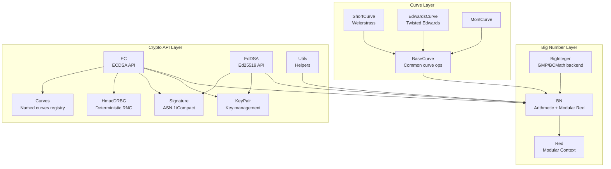
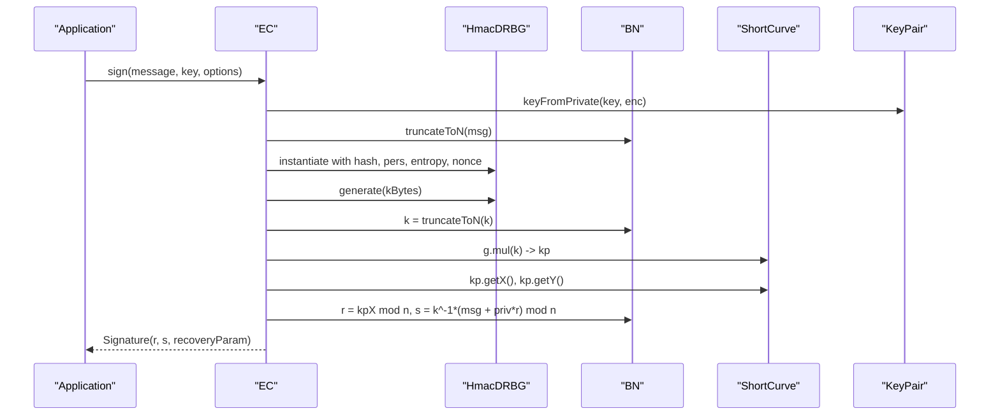
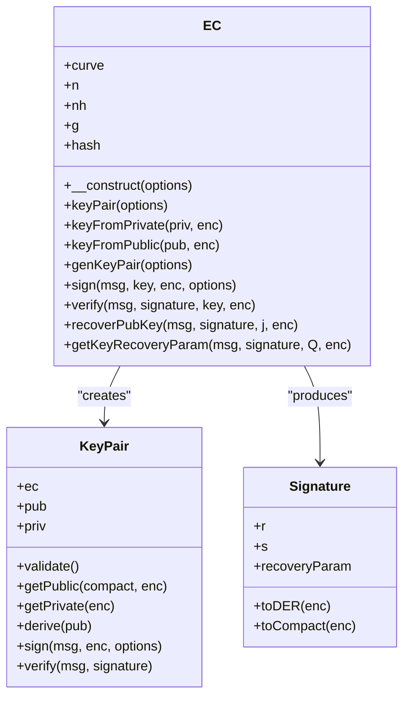
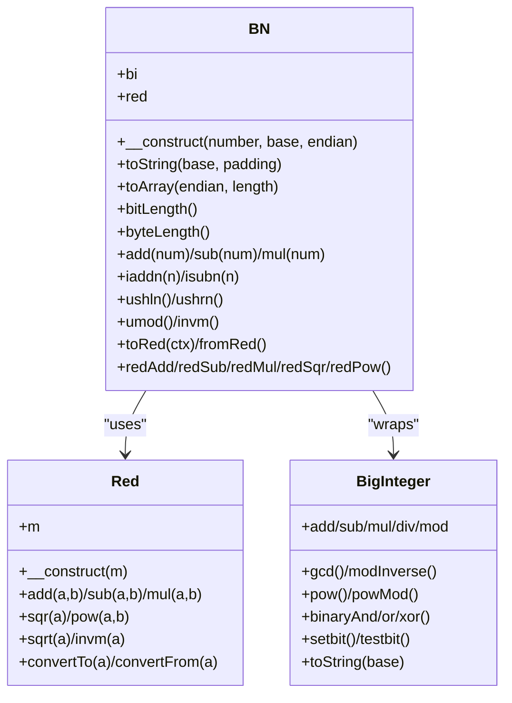
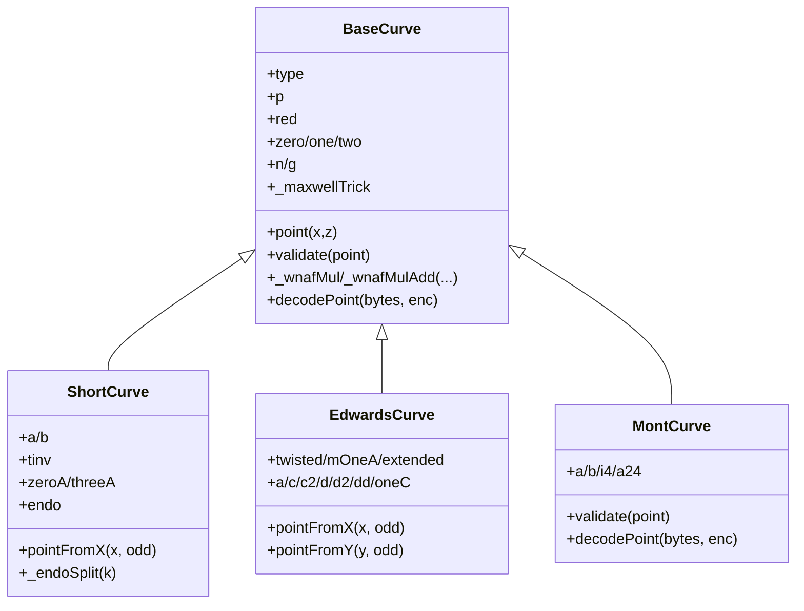
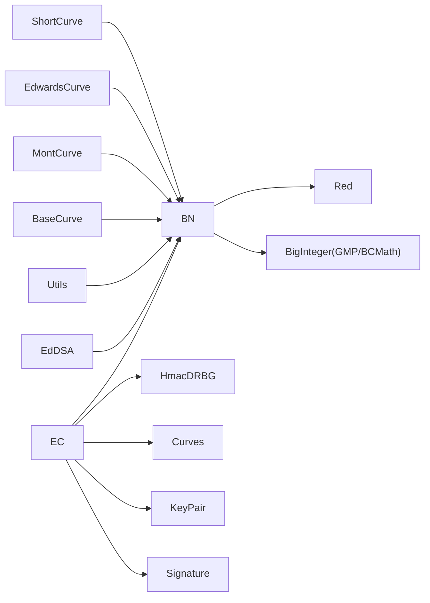

# Cryptographic Libraries

<cite>
**Referenced Files in This Document**
- [EC.php](file://class/Elliptic/EC.php)
- [KeyPair.php](file://class/Elliptic/EC/KeyPair.php)
- [Signature.php](file://class/Elliptic/EC/Signature.php)
- [BN.php](file://class/BN/BN.php)
- [BigInteger.php](file://class/BI/BigInteger.php)
- [Red.php](file://class/BN/Red.php)
- [BaseCurve.php](file://class/Elliptic/Curve/BaseCurve.php)
- [ShortCurve.php](file://class/Elliptic/Curve/ShortCurve.php)
- [EdwardsCurve.php](file://class/Elliptic/Curve/EdwardsCurve.php)
- [MontCurve.php](file://class/Elliptic/Curve/MontCurve.php)
- [Curves.php](file://class/Elliptic/Curves.php)
- [Utils.php](file://class/Elliptic/Utils.php)
- [HmacDRBG.php](file://class/Elliptic/HmacDRBG.php)
- [EdDSA.php](file://class/Elliptic/EdDSA.php)
- [README.md](file://README.md)
</cite>

## Table of Contents
1. [Introduction](#introduction)
2. [Project Structure](#project-structure)
3. [Core Components](#core-components)
4. [Architecture Overview](#architecture-overview)
5. [Detailed Component Analysis](#detailed-component-analysis)
6. [Dependency Analysis](#dependency-analysis)
7. [Performance Considerations](#performance-considerations)
8. [Troubleshooting Guide](#troubleshooting-guide)
9. [Conclusion](#conclusion)

## Introduction
This document describes the cryptographic libraries powering elliptic curve operations, big number arithmetic, and modular mathematics in the VIZ PHP Library. It explains the EC class implementation for ECDSA, key pair management, signature algorithms, and curve operations. It also documents the BN and BigInteger implementations for high-precision arithmetic and field operations, and outlines integration patterns with the broader VIZ library components.

## Project Structure
The cryptographic subsystem is organized around three primary layers:
- Big number arithmetic and modular arithmetic (BN, BI)
- Elliptic curve infrastructure (BaseCurve, ShortCurve, EdwardsCurve, MontCurve)
- ECDSA and EdDSA APIs (EC, EdDSA), key pairs, and signatures

**Diagram sources**
- [BN.php](file://class/BN/BN.php#L8-L765)
- [BigInteger.php](file://class/BI/BigInteger.php#L24-L634)
- [Red.php](file://class/BN/Red.php#L7-L216)
- [BaseCurve.php](file://class/Elliptic/Curve/BaseCurve.php#L8-L318)
- [ShortCurve.php](file://class/Elliptic/Curve/ShortCurve.php#L9-L301)
- [EdwardsCurve.php](file://class/Elliptic/Curve/EdwardsCurve.php#L7-L130)
- [MontCurve.php](file://class/Elliptic/Curve/MontCurve.php#L8-L46)
- [EC.php](file://class/Elliptic/EC.php#L9-L272)
- [EdDSA.php](file://class/Elliptic/EdDSA.php#L7-L122)
- [KeyPair.php](file://class/Elliptic/EC/KeyPair.php#L6-L138)
- [Signature.php](file://class/Elliptic/EC/Signature.php#L7-L208)
- [Utils.php](file://class/Elliptic/Utils.php#L7-L163)
- [HmacDRBG.php](file://class/Elliptic/HmacDRBG.php#L4-L132)
- [Curves.php](file://class/Elliptic/Curves.php#L6-L972)

**Section sources**
- [README.md](file://README.md#L1-L455)

## Core Components
- BN: Arbitrary precision integer with modular arithmetic support, conversions, bitwise ops, and redc (Montgomery or named primes).
- BigInteger: Backend adapter for GMP or BCMath with portable arithmetic.
- Red: Modular reduction context provider for fast field operations.
- BaseCurve/ShortCurve/EdwardsCurve/MontCurve: Curve abstractions and implementations for Weierstrass, twisted Edwards, and Montgomery forms.
- EC: ECDSA API for key generation, signing, verification, and public key recovery.
- EdDSA: Ed25519 signature API.
- KeyPair/Signature: Key management and signature encodings (DER, compact).
- Utils/HmacDRBG: Utility helpers and deterministic RNG for ECDSA nonce generation.

**Section sources**
- [BN.php](file://class/BN/BN.php#L8-L765)
- [BigInteger.php](file://class/BI/BigInteger.php#L24-L634)
- [Red.php](file://class/BN/Red.php#L7-L216)
- [BaseCurve.php](file://class/Elliptic/Curve/BaseCurve.php#L8-L318)
- [ShortCurve.php](file://class/Elliptic/Curve/ShortCurve.php#L9-L301)
- [EdwardsCurve.php](file://class/Elliptic/Curve/EdwardsCurve.php#L7-L130)
- [MontCurve.php](file://class/Elliptic/Curve/MontCurve.php#L8-L46)
- [EC.php](file://class/Elliptic/EC.php#L9-L272)
- [EdDSA.php](file://class/Elliptic/EdDSA.php#L7-L122)
- [KeyPair.php](file://class/Elliptic/EC/KeyPair.php#L6-L138)
- [Signature.php](file://class/Elliptic/EC/Signature.php#L7-L208)
- [Utils.php](file://class/Elliptic/Utils.php#L7-L163)
- [HmacDRBG.php](file://class/Elliptic/HmacDRBG.php#L4-L132)

## Architecture Overview
The EC class orchestrates ECDSA operations using BN for arithmetic, Red for modular field math, and HmacDRBG for deterministic nonces. Curves are registered in Curves and resolved by name. ShortCurve implements Weierstrass curves with optional GLV endomorphism optimization. EdwardsCurve and MontCurve provide specialized forms. EdDSA provides Ed25519 signatures.

**Diagram sources**
- [EC.php](file://class/Elliptic/EC.php#L89-L177)
- [HmacDRBG.php](file://class/Elliptic/HmacDRBG.php#L15-L132)
- [ShortCurve.php](file://class/Elliptic/Curve/ShortCurve.php#L9-L301)
- [KeyPair.php](file://class/Elliptic/EC/KeyPair.php#L6-L138)

## Detailed Component Analysis

### ECDSA API (EC)
- Construction: Accepts curve name or preset, initializes curve, order n, base point g, and hash function.
- Key management: keyPair, keyFromPrivate, keyFromPublic, genKeyPair using HMAC_DRBG.
- Signing: Deterministic nonce via HMAC_DRBG keyed by private and message; ensures canonical s and recovery param; truncates message to curve order.
- Verification: Uses double-add ladder or Maxwell’s trick for affine/Jacobian; validates r,s range.
- Public key recovery: Recovers candidate points given signature and message; derives recoveryParam parity.

**Diagram sources**
- [EC.php](file://class/Elliptic/EC.php#L9-L272)
- [KeyPair.php](file://class/Elliptic/EC/KeyPair.php#L6-L138)
- [Signature.php](file://class/Elliptic/EC/Signature.php#L7-L208)

**Section sources**
- [EC.php](file://class/Elliptic/EC.php#L17-L272)
- [KeyPair.php](file://class/Elliptic/EC/KeyPair.php#L12-L138)
- [Signature.php](file://class/Elliptic/EC/Signature.php#L13-L208)

### Big Number Arithmetic (BN) and Modular Operations
- BN wraps BigInteger and adds modular arithmetic via Red contexts.
- Supports conversion to/from hex/bytes, shifts, bitwise ops, comparisons, and modular inversion.
- Red provides add/sub/mul/sqr/pow/sqrt/invm with modulus m and conversion helpers.
- BN::mont and BN::red are factory methods for Montgomery reduction or named primes.

**Diagram sources**
- [BN.php](file://class/BN/BN.php#L8-L765)
- [Red.php](file://class/BN/Red.php#L7-L216)
- [BigInteger.php](file://class/BI/BigInteger.php#L24-L634)

**Section sources**
- [BN.php](file://class/BN/BN.php#L13-L765)
- [Red.php](file://class/BN/Red.php#L11-L216)
- [BigInteger.php](file://class/BI/BigInteger.php#L28-L634)

### Elliptic Curve Infrastructure
- BaseCurve: Defines curve parameters (p, n, g), redc context, Maxwell’s trick optimization, and NAF/JSF helpers.
- ShortCurve: Implements Weierstrass curve arithmetic, endomorphism detection and splitting, point validation, and efficient scalar multiplication with GLV.
- EdwardsCurve: Implements twisted Edwards curves, point arithmetic, and validation.
- MontCurve: Implements Montgomery curves for Diffie-Hellman-like operations.

**Diagram sources**
- [BaseCurve.php](file://class/Elliptic/Curve/BaseCurve.php#L8-L318)
- [ShortCurve.php](file://class/Elliptic/Curve/ShortCurve.php#L9-L301)
- [EdwardsCurve.php](file://class/Elliptic/Curve/EdwardsCurve.php#L7-L130)
- [MontCurve.php](file://class/Elliptic/Curve/MontCurve.php#L8-L46)

**Section sources**
- [BaseCurve.php](file://class/Elliptic/Curve/BaseCurve.php#L25-L318)
- [ShortCurve.php](file://class/Elliptic/Curve/ShortCurve.php#L20-L301)
- [EdwardsCurve.php](file://class/Elliptic/Curve/EdwardsCurve.php#L20-L130)
- [MontCurve.php](file://class/Elliptic/Curve/MontCurve.php#L15-L46)

### Named Curves Registry
- Curves defines and registers standard curves (P-192, P-224, P-256, P-384, P-521, Curve25519, Ed25519) with parameters, generators, and hash configs.

**Section sources**
- [Curves.php](file://class/Elliptic/Curves.php#L32-L155)

### Deterministic Randomness (HmacDRBG)
- Provides HMAC-based deterministic randomness for ECDSA nonce generation with entropy, nonce, and personalization support.

**Section sources**
- [HmacDRBG.php](file://class/Elliptic/HmacDRBG.php#L15-L132)

### EdDSA (Ed25519)
- EdDSA class implements Ed25519 signature scheme with point encoding/decoding, hash-to-scalar, and verification equation.

**Section sources**
- [EdDSA.php](file://class/Elliptic/EdDSA.php#L15-L122)

## Dependency Analysis
- EC depends on BN, KeyPair, Signature, HmacDRBG, and Curves.
- Curves resolves preset configurations for named curves.
- ShortCurve/EdwardsCurve/MontCurve depend on BN and Red for field arithmetic.
- BN depends on BigInteger (GMP or BCMath).
- Utils provides shared helpers for encoding, NAF/JSF, and random bytes.

**Diagram sources**
- [EC.php](file://class/Elliptic/EC.php#L4-L7)
- [Curves.php](file://class/Elliptic/Curves.php#L4-L5)
- [ShortCurve.php](file://class/Elliptic/Curve/ShortCurve.php#L4-L7)
- [EdwardsCurve.php](file://class/Elliptic/Curve/EdwardsCurve.php#L4-L6)
- [MontCurve.php](file://class/Elliptic/Curve/MontCurve.php#L4-L7)
- [BaseCurve.php](file://class/Elliptic/Curve/BaseCurve.php#L4-L7)
- [BN.php](file://class/BN/BN.php#L4-L7)
- [Red.php](file://class/BN/Red.php#L4-L6)
- [BigInteger.php](file://class/BI/BigInteger.php#L4-L7)
- [Utils.php](file://class/Elliptic/Utils.php#L4-L6)
- [EdDSA.php](file://class/Elliptic/EdDSA.php#L4-L6)

**Section sources**
- [EC.php](file://class/Elliptic/EC.php#L4-L7)
- [Curves.php](file://class/Elliptic/Curves.php#L4-L5)
- [ShortCurve.php](file://class/Elliptic/Curve/ShortCurve.php#L4-L7)
- [EdwardsCurve.php](file://class/Elliptic/Curve/EdwardsCurve.php#L4-L6)
- [MontCurve.php](file://class/Elliptic/Curve/MontCurve.php#L4-L7)
- [BaseCurve.php](file://class/Elliptic/Curve/BaseCurve.php#L4-L7)
- [BN.php](file://class/BN/BN.php#L4-L7)
- [Red.php](file://class/BN/Red.php#L4-L6)
- [BigInteger.php](file://class/BI/BigInteger.php#L4-L7)
- [Utils.php](file://class/Elliptic/Utils.php#L4-L6)
- [EdDSA.php](file://class/Elliptic/EdDSA.php#L4-L6)

## Performance Considerations
- Field arithmetic: Red contexts enable constant-time modular operations and reduce overhead for repeated operations.
- Scalar multiplication: NAF and JSF windowing, precomputation, and Maxwell’s trick accelerate EC operations.
- Endomorphism optimization: ShortCurve detects GLV endomorphism for P-256-like curves to halve scalar bit length.
- Hash choice: Larger hash outputs (SHA-256/384/512) improve security margins; SHA-1 is discouraged.
- Backend selection: Prefer GMP for production environments; BCMath fallback available but slower.

[No sources needed since this section provides general guidance]

## Troubleshooting Guide
- BigInteger backend not available: Ensure either GMP or BCMath PHP extensions are enabled; otherwise, exceptions are thrown during initialization.
- Invalid signature or point: Verify DER/compact encoding and ensure r,s are within [1, n-1].
- Recovery failure: Ensure recoveryParam is valid and signature matches the message and public key.
- Deterministic nonce issues: Confirm HmacDRBG parameters (hash, entropy, nonce, pers) meet minimum entropy requirements.

**Section sources**
- [BigInteger.php](file://class/BI/BigInteger.php#L18-L23)
- [Signature.php](file://class/Elliptic/EC/Signature.php#L72-L142)
- [EC.php](file://class/Elliptic/EC.php#L179-L219)
- [HmacDRBG.php](file://class/Elliptic/HmacDRBG.php#L15-L49)

## Conclusion
The VIZ PHP Library’s cryptographic stack combines BN-backed big number arithmetic with modular reduction, robust elliptic curve implementations, and secure ECDSA/EdDSA APIs. The design emphasizes performance (NAF/JSF, GLV, Maxwell’s trick), portability (GMP/BCMath), and correctness (deterministic nonces, strict range checks). Integration with the VIZ library enables blockchain-specific workflows such as transaction signing and verification.