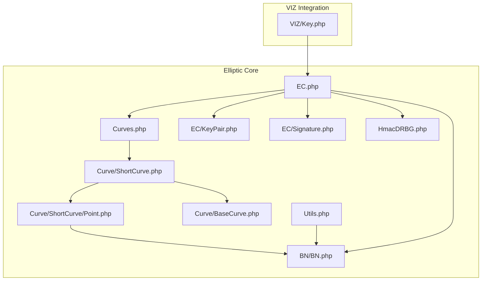
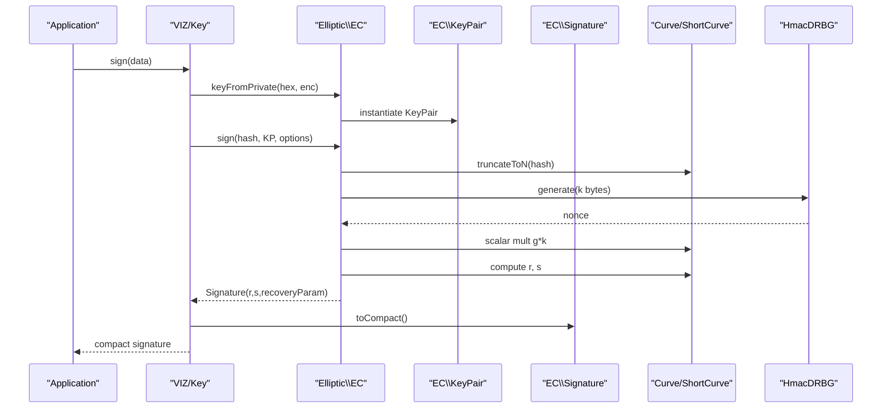
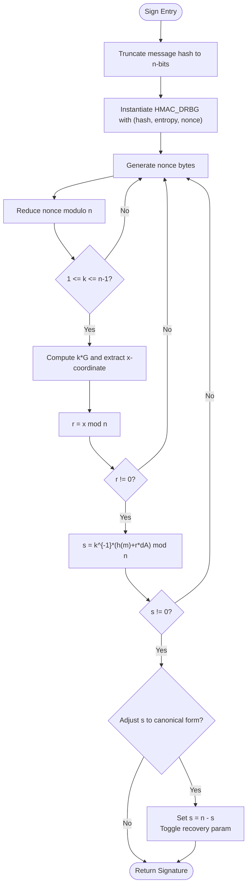
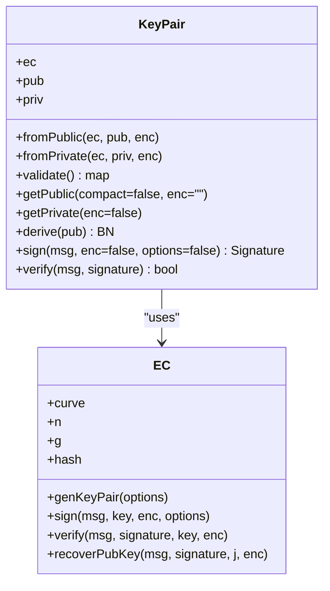
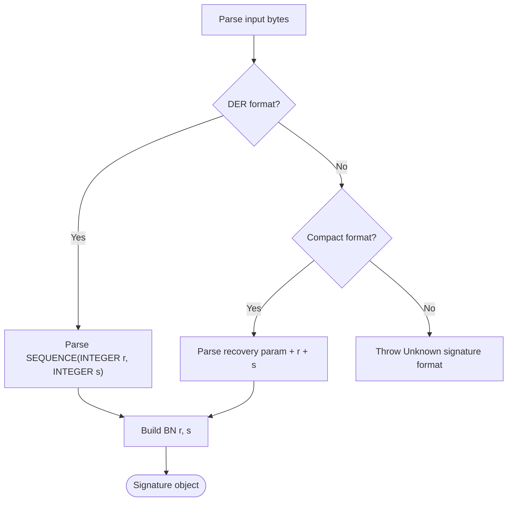
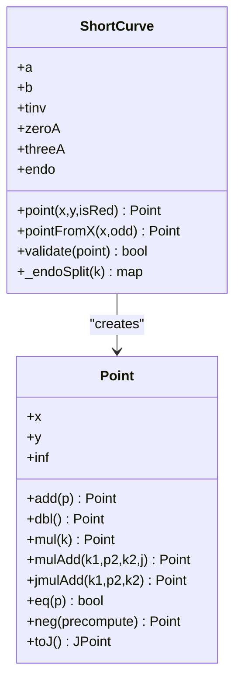
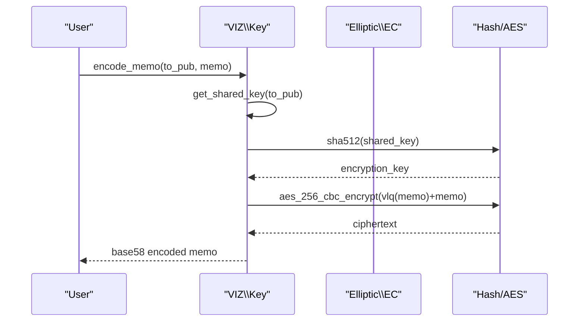
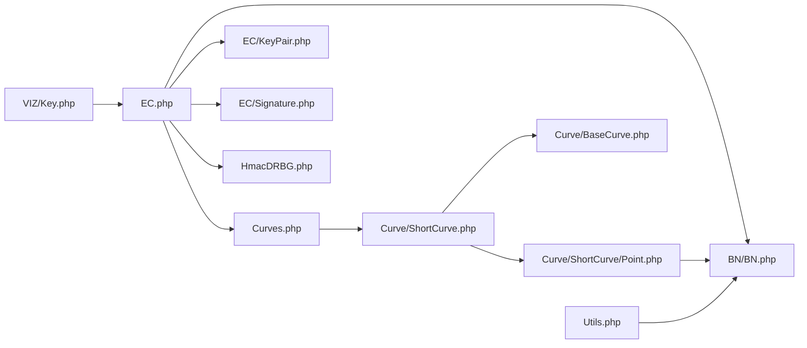

# Elliptic Curve Cryptography

<cite>
**Referenced Files in This Document**
- [EC.php](file://class/Elliptic/EC.php)
- [KeyPair.php](file://class/Elliptic/EC/KeyPair.php)
- [Signature.php](file://class/Elliptic/EC/Signature.php)
- [Curves.php](file://class/Elliptic/Curves.php)
- [ShortCurve.php](file://class/Elliptic/Curve/ShortCurve.php)
- [BaseCurve.php](file://class/Elliptic/Curve/BaseCurve.php)
- [Point.php](file://class/Elliptic/Curve/ShortCurve/Point.php)
- [Utils.php](file://class/Elliptic/Utils.php)
- [HmacDRBG.php](file://class/Elliptic/HmacDRBG.php)
- [BN.php](file://class/BN/BN.php)
- [Key.php](file://class/VIZ/Key.php)
</cite>

## Table of Contents
1. [Introduction](#introduction)
2. [Project Structure](#project-structure)
3. [Core Components](#core-components)
4. [Architecture Overview](#architecture-overview)
5. [Detailed Component Analysis](#detailed-component-analysis)
6. [Dependency Analysis](#dependency-analysis)
7. [Performance Considerations](#performance-considerations)
8. [Troubleshooting Guide](#troubleshooting-guide)
9. [Conclusion](#conclusion)
10. [Appendices](#appendices)

## Introduction
This document explains the Elliptic Curve Cryptography (ECC) implementation in the VIZ PHP library, focusing on the EC class for SECP256K1 curve operations, key pair management, ECDSA signatures, and public key recovery. It covers the mathematical foundations of ECC, curve parameters, point arithmetic, and integration patterns with the VIZ blockchain key management system. Practical examples and performance characteristics are included to help developers use the library effectively.

## Project Structure
The ECC subsystem is organized around the EC class and supporting curve, point, and utility modules. The VIZ integration is encapsulated in the Key class, which uses EC for signing, verification, and public key recovery.

**Diagram sources**
- [EC.php](file://class/Elliptic/EC.php#L1-L272)
- [KeyPair.php](file://class/Elliptic/EC/KeyPair.php#L1-L138)
- [Signature.php](file://class/Elliptic/EC/Signature.php#L1-L208)
- [Curves.php](file://class/Elliptic/Curves.php#L938-L972)
- [ShortCurve.php](file://class/Elliptic/Curve/ShortCurve.php#L1-L301)
- [BaseCurve.php](file://class/Elliptic/Curve/BaseCurve.php#L1-L318)
- [Point.php](file://class/Elliptic/Curve/ShortCurve/Point.php#L1-L313)
- [Utils.php](file://class/Elliptic/Utils.php#L1-L163)
- [HmacDRBG.php](file://class/Elliptic/HmacDRBG.php#L1-L132)
- [BN.php](file://class/BN/BN.php#L1-L200)
- [Key.php](file://class/VIZ/Key.php#L1-L353)

**Section sources**
- [EC.php](file://class/Elliptic/EC.php#L1-L272)
- [Key.php](file://class/VIZ/Key.php#L1-L353)

## Core Components
- EC: Main interface for EC operations on a named curve (SECP256K1). Provides key generation, signing, verification, and public key recovery.
- KeyPair: Manages a private/public key pair, including validation, ECDH derivation, and ECDSA operations.
- Signature: Encodes/decodes ECDSA signatures in DER and compact formats, with recovery parameter support.
- Curves: Defines supported curves, including SECP256K1 with curve parameters and precomputed data.
- ShortCurve and Point: Implement short Weierstrass curve arithmetic, point addition/doubling, scalar multiplication, and recovery helpers.
- Utils and HmacDRBG: Provide utility conversions, NAF/JSF representations, and deterministic randomness for ECDSA nonce generation.
- BN: Arbitrary precision integer arithmetic used throughout ECC computations.

**Section sources**
- [EC.php](file://class/Elliptic/EC.php#L9-L40)
- [KeyPair.php](file://class/Elliptic/EC/KeyPair.php#L6-L24)
- [Signature.php](file://class/Elliptic/EC/Signature.php#L7-L40)
- [Curves.php](file://class/Elliptic/Curves.php#L938-L972)
- [ShortCurve.php](file://class/Elliptic/Curve/ShortCurve.php#L9-L35)
- [Point.php](file://class/Elliptic/Curve/ShortCurve/Point.php#L7-L40)
- [Utils.php](file://class/Elliptic/Utils.php#L7-L27)
- [HmacDRBG.php](file://class/Elliptic/HmacDRBG.php#L4-L49)
- [BN.php](file://class/BN/BN.php#L8-L46)

## Architecture Overview
The EC class orchestrates curve selection, key generation, signing, and verification. It delegates curve-specific arithmetic to ShortCurve/Point and uses BN for big integer operations. Deterministic nonce generation is handled by HmacDRBG seeded from the private key and message hash. VIZ’s Key class wraps EC for blockchain-specific operations like WIF encoding, public key derivation, memo encryption/decryption, and authentication.

**Diagram sources**
- [Key.php](file://class/VIZ/Key.php#L302-L311)
- [EC.php](file://class/Elliptic/EC.php#L89-L177)
- [ShortCurve.php](file://class/Elliptic/Curve/ShortCurve.php#L217-L235)
- [HmacDRBG.php](file://class/Elliptic/HmacDRBG.php#L98-L131)

## Detailed Component Analysis

### EC Class: SECP256K1 Operations
The EC class initializes a curve (SECP256K1), precomputes the generator point, and exposes key management and signature primitives.

- Curve initialization:
  - Accepts a curve name or preset curve object.
  - Loads curve parameters (field modulus p, curve constants a/b, order n, cofactor h, generator g).
  - Precomputes generator for efficient scalar multiplication.
- KeyPair factory:
  - Creates KeyPair instances from private/public keys.
- Key generation:
  - Uses HMAC_DRBG with hash derived from the curve and optional personalization/entropy.
  - Generates random scalars in [1, n-1] and wraps them in KeyPair.
- Signing:
  - Truncates message hash to n-bit length.
  - Derives deterministic nonce using HMAC_DRBG keyed by private key and message hash.
  - Computes scalar multiplication with generator, extracts affine x-coordinate, reduces modulo n to obtain r.
  - Computes s = k^{-1} (h(m) + r d_A) mod n.
  - Applies canonical form adjustment to minimize s and toggles recovery parameter accordingly.
  - Returns Signature object with r, s, and recoveryParam.
- Verification:
  - Validates signature bounds and recomputes u1 = s^{-1} h(m), u2 = s^{-1} r.
  - Uses Maxwell’s trick for mixed addition to compute u1 G + u2 Q and compares x coordinate modulo n.
- Public key recovery:
  - Recovers candidate point from signature r, s, and recovery parameter j.
  - Determines y parity and whether r was offset by n for the second key candidate.
  - Computes Q = r^{-1}(s R - e G) and validates against provided public key.

**Diagram sources**
- [EC.php](file://class/Elliptic/EC.php#L77-L177)
- [HmacDRBG.php](file://class/Elliptic/HmacDRBG.php#L15-L49)

**Section sources**
- [EC.php](file://class/Elliptic/EC.php#L17-L40)
- [EC.php](file://class/Elliptic/EC.php#L54-L75)
- [EC.php](file://class/Elliptic/EC.php#L89-L177)
- [EC.php](file://class/Elliptic/EC.php#L179-L219)
- [EC.php](file://class/Elliptic/EC.php#L221-L271)

### KeyPair Class: Private/Public Key Management
KeyPair encapsulates a private scalar and its derived public point. It supports importing private/public keys, validating public points, deriving shared secrets via ECDH, and performing ECDSA sign/verify.

- Construction:
  - Imports private key (optional encoding) and/or public key (optional encoding).
  - Ensures private key is reduced modulo curve order n.
- Validation:
  - Checks that the public point is not at infinity and lies on the curve.
  - Verifies that n · Q = O.
- Public key export:
  - Supports compressed (0x02/0x03 prefix) and uncompressed (0x04 prefix) encodings.
- ECDH:
  - Computes shared x-coordinate from peer public point and local private key.
- ECDSA:
  - Delegates signing and verification to the EC instance.

**Diagram sources**
- [KeyPair.php](file://class/Elliptic/EC/KeyPair.php#L6-L138)
- [EC.php](file://class/Elliptic/EC.php#L42-L52)

**Section sources**
- [KeyPair.php](file://class/Elliptic/EC/KeyPair.php#L12-L24)
- [KeyPair.php](file://class/Elliptic/EC/KeyPair.php#L48-L62)
- [KeyPair.php](file://class/Elliptic/EC/KeyPair.php#L64-L88)
- [KeyPair.php](file://class/Elliptic/EC/KeyPair.php#L116-L129)

### Signature Class: ECDSA Encoding and Recovery
The Signature class handles DER and compact (IEEE P1363) encodings, with recovery parameter support for public key recovery.

- Construction:
  - Accepts raw r/s integers, DER-encoded bytes, or compact-encoded bytes.
  - Parses DER and compact formats, extracting r, s, and recovery parameter.
- DER encoding:
  - Constructs ASN.1 SEQUENCE with INTEGER r and INTEGER s, padding leading zeros appropriately.
- Compact encoding:
  - Encodes recovery parameter in the first byte, followed by 32-byte r and 32-byte s.
  - Supports conversion to/from DER.

**Diagram sources**
- [Signature.php](file://class/Elliptic/EC/Signature.php#L13-L40)
- [Signature.php](file://class/Elliptic/EC/Signature.php#L72-L110)
- [Signature.php](file://class/Elliptic/EC/Signature.php#L112-L142)

**Section sources**
- [Signature.php](file://class/Elliptic/EC/Signature.php#L13-L40)
- [Signature.php](file://class/Elliptic/EC/Signature.php#L159-L186)
- [Signature.php](file://class/Elliptic/EC/Signature.php#L188-L208)

### SECP256K1 Curve Parameters and Arithmetic
SECP256K1 is defined as a short Weierstrass curve with a = 0 and b = 7 over the prime field p. The generator point g is provided with precomputed data for efficient scalar multiplication.

- Curve parameters:
  - Field modulus p, curve constants a and b, order n, cofactor h, hash function configuration.
  - Endomorphism parameters (beta, lambda, basis) enable optimized scalar multiplication.
- Point arithmetic:
  - Addition and doubling formulas implemented in Point.
  - Scalar multiplication uses NAF windowing and optional endomorphism splitting.
  - Recovery helper computes y-coordinate from x and parity.

**Diagram sources**
- [Curves.php](file://class/Elliptic/Curves.php#L938-L972)
- [ShortCurve.php](file://class/Elliptic/Curve/ShortCurve.php#L9-L35)
- [Point.php](file://class/Elliptic/Curve/ShortCurve/Point.php#L7-L40)

**Section sources**
- [Curves.php](file://class/Elliptic/Curves.php#L938-L972)
- [ShortCurve.php](file://class/Elliptic/Curve/ShortCurve.php#L217-L235)
- [Point.php](file://class/Elliptic/Curve/ShortCurve/Point.php#L177-L261)

### Mathematical Foundations and Point Operations
- Elliptic curve group law:
  - Addition of two distinct points involves slope computation and point reflection.
  - Doubling uses tangent slope and point reflection.
- Scalar multiplication:
  - Implemented via NAF (Non-Adjacent Form) windowing to reduce digit count.
  - For endomorphic curves, split scalar k = k1 + k2·lambda for faster computation.
- Deterministic nonce generation:
  - HMAC_DRBG instantiated with hash, entropy (private key), nonce (message hash), and personalization.
  - Generates uniform random bytes sized to n’s byte length.

**Section sources**
- [ShortCurve.php](file://class/Elliptic/Curve/ShortCurve.php#L196-L215)
- [BaseCurve.php](file://class/Elliptic/Curve/BaseCurve.php#L104-L152)
- [Utils.php](file://class/Elliptic/Utils.php#L59-L88)
- [HmacDRBG.php](file://class/Elliptic/HmacDRBG.php#L15-L49)

### VIZ Blockchain Integration
The VIZ Key class integrates EC for blockchain operations:
- Key encoding/decoding:
  - WIF for private keys, Base58Check for public keys with version prefix.
- Memo encryption/decryption:
  - Uses ECDH shared secret to derive AES-256-CBC key and IV.
  - Prepends sender/receiver public keys and includes nonce/checksum.
- Authentication:
  - Generates signed challenge-response with time-based domain/action/account/authority.

**Diagram sources**
- [Key.php](file://class/VIZ/Key.php#L45-L86)

**Section sources**
- [Key.php](file://class/VIZ/Key.php#L14-L32)
- [Key.php](file://class/VIZ/Key.php#L33-L44)
- [Key.php](file://class/VIZ/Key.php#L45-L86)
- [Key.php](file://class/VIZ/Key.php#L302-L322)
- [Key.php](file://class/VIZ/Key.php#L323-L338)
- [Key.php](file://class/VIZ/Key.php#L339-L352)

## Dependency Analysis
The EC subsystem exhibits strong cohesion around curve arithmetic and signature operations, with clear separation of concerns:
- EC depends on Curves for parameter resolution, BN for arithmetic, and HmacDRBG for deterministic nonce generation.
- ShortCurve/Point depend on BN and Utils for NAF/JSF representations and modular arithmetic.
- VIZ Key depends on EC for cryptographic operations and on VIZ utilities for encoding and crypto primitives.

**Diagram sources**
- [EC.php](file://class/Elliptic/EC.php#L4-L7)
- [Curves.php](file://class/Elliptic/Curves.php#L4-L5)
- [ShortCurve.php](file://class/Elliptic/Curve/ShortCurve.php#L4-L6)
- [Point.php](file://class/Elliptic/Curve/ShortCurve/Point.php#L4-L6)
- [Utils.php](file://class/Elliptic/Utils.php#L4-L6)
- [HmacDRBG.php](file://class/Elliptic/HmacDRBG.php#L4-L6)
- [BN.php](file://class/BN/BN.php#L6)
- [Key.php](file://class/VIZ/Key.php#L7)

**Section sources**
- [EC.php](file://class/Elliptic/EC.php#L4-L7)
- [ShortCurve.php](file://class/Elliptic/Curve/ShortCurve.php#L4-L6)
- [Point.php](file://class/Elliptic/Curve/ShortCurve/Point.php#L4-L6)
- [Key.php](file://class/VIZ/Key.php#L7)

## Performance Considerations
- Scalar multiplication:
  - Uses NAF windowing and precomputed tables for generator and points.
  - For endomorphic curves (SECP256K1), endomorphism splitting reduces scalar size, improving performance.
- Deterministic nonce:
  - HMAC_DRBG generates uniform random bytes efficiently; ensure sufficient entropy is provided.
- Encoding/decoding:
  - DER and compact encodings are constant-time in structure; avoid leaking timing via early exits.
- Public key recovery:
  - Avoids expensive trial-and-error by leveraging recovery parameter; ensure parameter validation.

[No sources needed since this section provides general guidance]

## Troubleshooting Guide
- Invalid signature bounds:
  - Verify r and s are in [1, n-1] during verification.
- Public key validation failures:
  - Ensure public point is not at infinity and satisfies the curve equation.
  - Confirm n · Q = O.
- Recovery parameter errors:
  - Ensure recovery parameter is exactly 0..3; handle exceptions when second key candidate is invalid.
- Encoding issues:
  - DER parsing requires correct ASN.1 structure; compact format requires 65-byte payload with valid recovery byte.
- Entropy and nonce:
  - HMAC_DRBG requires adequate entropy; ensure personalization and nonce are correctly supplied.

**Section sources**
- [EC.php](file://class/Elliptic/EC.php#L189-L192)
- [KeyPair.php](file://class/Elliptic/EC/KeyPair.php#L48-L62)
- [EC.php](file://class/Elliptic/EC.php#L223-L235)
- [Signature.php](file://class/Elliptic/EC/Signature.php#L72-L110)
- [HmacDRBG.php](file://class/Elliptic/HmacDRBG.php#L15-L49)

## Conclusion
The VIZ PHP ECC implementation provides a robust, efficient, and secure foundation for SECP256K1 operations. The EC class centralizes curve-specific logic, while KeyPair and Signature offer clean abstractions for key management and signature handling. The integration with VIZ Key enables practical blockchain operations such as memo encryption, authentication, and public key derivation. By leveraging precomputed data, endomorphisms, and deterministic nonce generation, the library balances security and performance.

[No sources needed since this section summarizes without analyzing specific files]

## Appendices

### Practical Examples
- Generate a key pair and sign data:
  - Initialize EC with "secp256k1".
  - Generate KeyPair via EC::genKeyPair.
  - Sign a SHA-256 digest with EC::sign and convert to compact format via Signature::toCompact.
- Recover public key from signature:
  - Use EC::recoverPubKey with message hash, signature, and recovery parameter.
  - Encode recovered public key for comparison or storage.
- VIZ authentication:
  - Use VIZ Key::auth to produce a signed challenge string and compact signature.

**Section sources**
- [EC.php](file://class/Elliptic/EC.php#L54-L75)
- [EC.php](file://class/Elliptic/EC.php#L89-L177)
- [EC.php](file://class/Elliptic/EC.php#L221-L249)
- [Key.php](file://class/VIZ/Key.php#L302-L322)
- [Key.php](file://class/VIZ/Key.php#L339-L352)