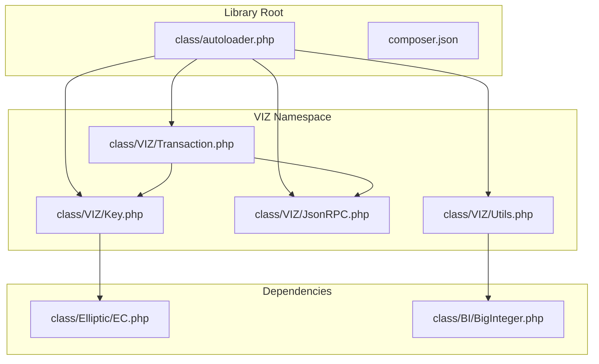
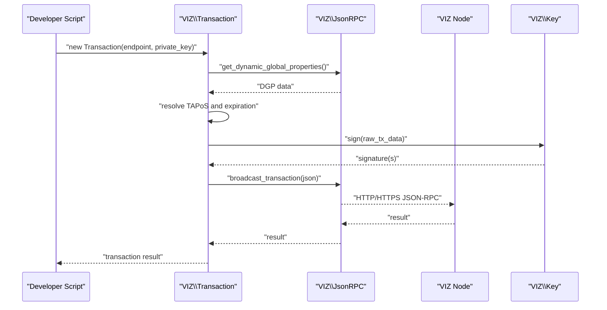
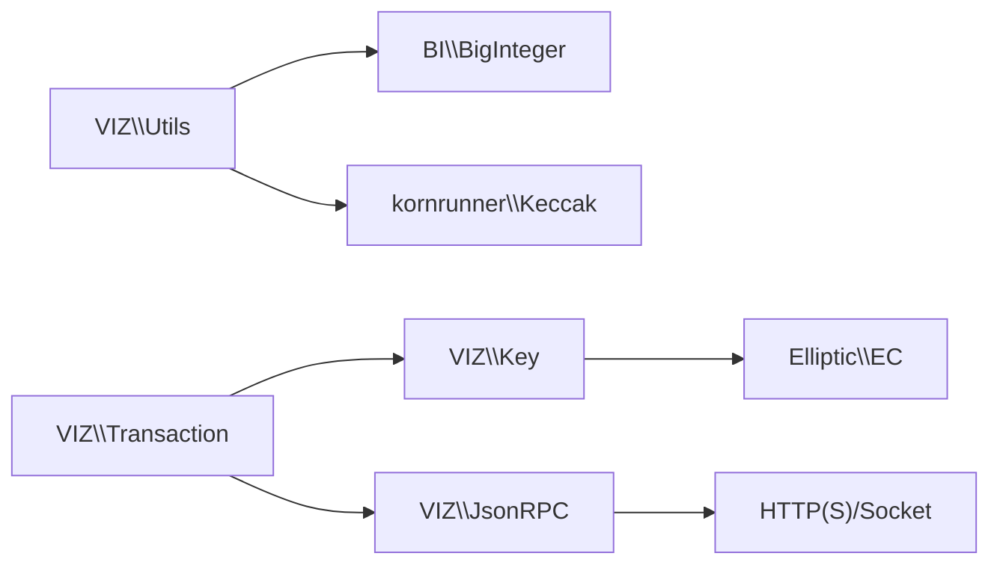

# Getting Started

<cite>
**Referenced Files in This Document**
- [README.md](file://README.md)
- [composer.json](file://composer.json)
- [class/autoloader.php](file://class/autoloader.php)
- [class/VIZ/Key.php](file://class/VIZ/Key.php)
- [class/VIZ/Transaction.php](file://class/VIZ/Transaction.php)
- [class/VIZ/JsonRPC.php](file://class/VIZ/JsonRPC.php)
- [class/VIZ/Utils.php](file://class/VIZ/Utils.php)
- [class/Elliptic/EC.php](file://class/Elliptic/EC.php)
- [class/BI/BigInteger.php](file://class/BI/BigInteger.php)
- [tests/TestKeys.php](file://tests/TestKeys.php)
</cite>

## Table of Contents
1. [Introduction](#introduction)
2. [Project Structure](#project-structure)
3. [Core Components](#core-components)
4. [Architecture Overview](#architecture-overview)
5. [Detailed Component Analysis](#detailed-component-analysis)
6. [Dependency Analysis](#dependency-analysis)
7. [Performance Considerations](#performance-considerations)
8. [Troubleshooting Guide](#troubleshooting-guide)
9. [Conclusion](#conclusion)
10. [Appendices](#appendices)

## Introduction
This guide helps you quickly install and use the VIZ PHP Library to work with VIZ blockchain keys, transactions, and JSON-RPC communication. It covers prerequisites, environment setup, autoloading, and step-by-step tutorials for key generation, building and broadcasting transactions, and communicating with nodes. It also includes troubleshooting tips and verification steps to ensure a smooth developer experience.

## Project Structure
The library is organized around a small set of core classes under the VIZ namespace, plus cryptographic helpers and autoloading. The main components are:
- Key management and signatures
- Transaction building and signing
- JSON-RPC client for node communication
- Utility functions for encoding, encryption, and Voice protocol posts

**Diagram sources**
- [class/autoloader.php](file://class/autoloader.php#L1-L14)
- [composer.json](file://composer.json#L19-L29)
- [class/VIZ/Key.php](file://class/VIZ/Key.php#L1-L353)
- [class/VIZ/Transaction.php](file://class/VIZ/Transaction.php#L1-L800)
- [class/VIZ/JsonRPC.php](file://class/VIZ/JsonRPC.php#L1-L354)
- [class/VIZ/Utils.php](file://class/VIZ/Utils.php#L1-L413)
- [class/Elliptic/EC.php](file://class/Elliptic/EC.php#L1-L200)
- [class/BI/BigInteger.php](file://class/BI/BigInteger.php#L1-L200)

**Section sources**
- [README.md](file://README.md#L1-L455)
- [composer.json](file://composer.json#L1-L32)
- [class/autoloader.php](file://class/autoloader.php#L1-L14)

## Core Components
- Key: Private/public key generation, WIF encoding, public key derivation, signing, verification, and memo encryption/decryption.
- Transaction: Build operations, TAPoS resolution, multi-signature preparation, broadcast via JSON-RPC, and multi-operation queues.
- JsonRPC: Low-level JSON-RPC client with plugin routing, SSL/TLS support, gzip decoding, and result parsing.
- Utils: Base58 encoding/decoding, AES-256-CBC encryption/decryption, VLQ helpers, and Voice protocol helpers.

**Section sources**
- [class/VIZ/Key.php](file://class/VIZ/Key.php#L1-L353)
- [class/VIZ/Transaction.php](file://class/VIZ/Transaction.php#L1-L800)
- [class/VIZ/JsonRPC.php](file://class/VIZ/JsonRPC.php#L1-L354)
- [class/VIZ/Utils.php](file://class/VIZ/Utils.php#L1-L413)

## Architecture Overview
The library composes cryptographic primitives and network communication to enable secure and efficient blockchain interactions.

**Diagram sources**
- [class/VIZ/Transaction.php](file://class/VIZ/Transaction.php#L53-L157)
- [class/VIZ/JsonRPC.php](file://class/VIZ/JsonRPC.php#L311-L353)
- [class/VIZ/Key.php](file://class/VIZ/Key.php#L302-L322)

## Detailed Component Analysis

### Installation and Environment Setup
- Prerequisites: Install one of the following PHP extensions:
  - GMP (GNU Multiple Precision)
  - BCMath
- Verify availability on your hosting provider or local environment.
- Composer is supported but the library also ships with a simple autoloader and PSR-4 mappings.

What to expect:
- The BigInteger wrapper detects and uses either GMP or BCMath automatically.
- If neither is present, initialization will fail early with an explicit error.

Verification steps:
- Confirm the presence of GMP or BCMath.
- Run a minimal script that instantiates a Key to ensure no exceptions occur.

**Section sources**
- [README.md](file://README.md#L20-L28)
- [class/BI/BigInteger.php](file://class/BI/BigInteger.php#L4-L16)

### Autoloader and PSR-4 Configuration
Two ways to load the library:
- Include the provided autoloader to register a simple classmap loader.
- Use Composer’s autoload to leverage PSR-4 mappings for VIZ, BN, BI, and Elliptic namespaces.

Composer autoload configuration:
- VIZ -> class/VIZ
- BN -> class/BN
- BI -> class/BI
- Elliptic -> class/Elliptic

Example usage:
- Include the autoloader once per script.
- Use fully qualified class names (e.g., VIZ\Key, VIZ\Transaction).

**Section sources**
- [class/autoloader.php](file://class/autoloader.php#L1-L14)
- [composer.json](file://composer.json#L19-L29)
- [README.md](file://README.md#L42-L67)

### Step-by-Step Tutorial: Key Generation
Goal: Generate a new key pair and derive the public key.

Steps:
1. Include the autoloader.
2. Create a new Key instance without arguments to generate a random key.
3. Retrieve the encoded WIF private key and the encoded public key.
4. Optionally verify the derived public key matches expectations.

Notes:
- The Key class supports importing from hex, WIF, or public key encodings.
- Signing requires a private key; verification works with a public key.

**Section sources**
- [class/VIZ/Key.php](file://class/VIZ/Key.php#L185-L197)
- [README.md](file://README.md#L137-L162)

### Step-by-Step Tutorial: Basic Transaction Creation and Broadcasting
Goal: Build and broadcast a simple transaction (e.g., award).

Steps:
1. Include the autoloader.
2. Initialize a Transaction with a node endpoint and a private key (WIF).
3. Build an operation (e.g., award) with required parameters.
4. Execute the transaction (optionally synchronous).
5. Inspect the result.

Notes:
- The Transaction class resolves TAPoS and expiration automatically.
- Multi-signatures and multi-operation queues are supported.

**Section sources**
- [class/VIZ/Transaction.php](file://class/VIZ/Transaction.php#L53-L157)
- [README.md](file://README.md#L97-L111)

### Step-by-Step Tutorial: Node Communication
Goal: Query dynamic global properties and account information.

Steps:
1. Include the autoloader.
2. Initialize a JsonRPC client with a node endpoint.
3. Execute methods like get_dynamic_global_properties and get_account.
4. Toggle return_only_result to receive extended results including errors.

Notes:
- The client supports HTTPS and gzipped responses.
- Plugin routing is handled internally.

**Section sources**
- [class/VIZ/JsonRPC.php](file://class/VIZ/JsonRPC.php#L311-L353)
- [README.md](file://README.md#L69-L95)

### Advanced Scenario: Multi-Operation Queue and Multi-Signature
Goal: Queue multiple operations, broadcast, and add an additional signature.

Steps:
1. Initialize a Transaction with a node endpoint and private key.
2. Start queue mode, add multiple operations, then end queue to get the prepared transaction.
3. Broadcast the transaction (optionally synchronous).
4. Add another signature using a different private key.

Notes:
- Queue mode collects operations and builds a single transaction.
- Additional signatures can be appended to the transaction JSON.

**Section sources**
- [class/VIZ/Transaction.php](file://class/VIZ/Transaction.php#L158-L190)
- [README.md](file://README.md#L113-L135)

### Advanced Scenario: Memo Encryption and Decryption
Goal: Derive a shared key and encrypt/decrypt memo data compatible with VIZ JS library.

Steps:
1. Generate two private keys and extract their public keys.
2. Compute shared keys from each side.
3. Encrypt memo with AES-256-CBC using the shared key.
4. Decode memo using the other side’s private key.

Notes:
- The library implements the same structure as the VIZ JS library for compatibility.
- Nonce and checksum handling is included.

**Section sources**
- [class/VIZ/Key.php](file://class/VIZ/Key.php#L33-L44)
- [class/VIZ/Key.php](file://class/VIZ/Key.php#L45-L86)
- [README.md](file://README.md#L164-L205)

### Advanced Scenario: Passwordless Authentication
Goal: Generate challenge data and signature for domain auth and verify on-chain.

Steps:
1. Create a Key from a private key.
2. Generate challenge data and signature for a given account, domain, action, and authority.
3. Initialize a VIZ\Auth with a node endpoint and the same domain/action/authority.
4. Call check(data, signature) to verify the signature against the account’s authority.

Notes:
- The Auth class validates domain, action, authority, time window, and weight thresholds.

**Section sources**
- [class/VIZ/Key.php](file://class/VIZ/Key.php#L339-L352)
- [class/VIZ/Auth.php](file://class/VIZ/Auth.php#L1-L70)
- [README.md](file://README.md#L207-L222)

### Advanced Scenario: Voice Protocol Posts
Goal: Post Voice text or publication objects and manage events.

Steps:
1. Use Utils::voice_text or Utils::voice_publication to prepare and broadcast a Voice object.
2. Optionally retrieve the resulting block number synchronously.
3. Use Utils::voice_event to add/edit/remove Voice events.

Notes:
- Voice protocol uses custom operations with structured data.
- Utilities handle serialization and broadcasting via Transaction.

**Section sources**
- [class/VIZ/Utils.php](file://class/VIZ/Utils.php#L36-L73)
- [class/VIZ/Utils.php](file://class/VIZ/Utils.php#L111-L148)
- [class/VIZ/Utils.php](file://class/VIZ/Utils.php#L156-L208)
- [README.md](file://README.md#L310-L400)

## Dependency Analysis
The library depends on:
- PHP extensions: GMP or BCMath (via BI\BigInteger)
- Third-party cryptographic libraries (Elliptic curves, BN math, Keccak hashing)
- OpenSSL for AES-256-CBC and base58 encoding/decoding

**Diagram sources**
- [class/VIZ/Key.php](file://class/VIZ/Key.php#L1-L353)
- [class/VIZ/Utils.php](file://class/VIZ/Utils.php#L1-L413)
- [class/VIZ/Transaction.php](file://class/VIZ/Transaction.php#L1-L800)
- [class/VIZ/JsonRPC.php](file://class/VIZ/JsonRPC.php#L1-L354)
- [class/Elliptic/EC.php](file://class/Elliptic/EC.php#L1-L200)
- [class/BI/BigInteger.php](file://class/BI/BigInteger.php#L1-L200)

**Section sources**
- [README.md](file://README.md#L29-L35)
- [class/BI/BigInteger.php](file://class/BI/BigInteger.php#L4-L16)

## Performance Considerations
- Prefer GMP over BCMath for heavy arithmetic operations; the BigInteger wrapper selects the fastest available backend.
- Minimize repeated node queries by caching results locally where appropriate.
- Use synchronous broadcast only when you need the block number immediately; asynchronous broadcast reduces latency.
- Batch operations using queue mode to reduce overhead.

[No sources needed since this section provides general guidance]

## Troubleshooting Guide
Common issues and resolutions:
- Missing GMP or BCMath:
  - Symptom: Exception during BigInteger initialization.
  - Resolution: Enable the extension in php.ini or install the package via your OS package manager.
- Socket timeouts or SSL errors:
  - Symptom: JsonRPC returns false or times out.
  - Resolution: Verify endpoint URL, network connectivity, and SSL certificate validity. Adjust read timeout or disable SSL checks only for testing.
- Invalid signatures or canonical signature not found:
  - Symptom: Signatures rejected or canonical signature generation fails.
  - Resolution: Retry signing; the Key class attempts multiple nonces until a canonical signature is produced.
- Incorrect authority or threshold mismatch:
  - Symptom: Auth verification fails.
  - Resolution: Ensure the account’s authority weights and keys match the signature’s public key.
- Base58 or AES failures:
  - Symptom: Encoding/decoding or encryption/decryption returns false.
  - Resolution: Validate inputs and ensure OpenSSL and Keccak are available.

Verification steps:
- Run the provided test suite to confirm key derivation and signature verification.
- Manually execute a simple get_dynamic_global_properties call to validate node connectivity.

**Section sources**
- [class/BI/BigInteger.php](file://class/BI/BigInteger.php#L4-L16)
- [class/VIZ/JsonRPC.php](file://class/VIZ/JsonRPC.php#L196-L221)
- [class/VIZ/Key.php](file://class/VIZ/Key.php#L302-L322)
- [tests/TestKeys.php](file://tests/TestKeys.php#L1-L29)

## Conclusion
You now have the essentials to install the VIZ PHP Library, configure your environment, and perform common tasks such as key generation, transaction building, and node communication. Use the advanced scenarios for multi-signatures, memo encryption, and Voice protocol posts. If you encounter issues, consult the troubleshooting section and verify your environment and node connectivity.

[No sources needed since this section summarizes without analyzing specific files]

## Appendices

### Quick Reference: Common Methods
- Key
  - gen(seed, salt)
  - encode(prefix)
  - get_public_key()
  - sign(data)
  - verify(data, signature)
  - get_shared_key(public_key_encoded)
  - encode_memo(public_key_encoded, memo)
  - decode_memo(memo)
- Transaction
  - __construct(endpoint, private_key)
  - execute(json, synchronous=false)
  - add_signature(json, data, private_key='')
  - __call(name, attrs) for operation builders
- JsonRPC
  - execute_method(method, params=[], debug=false)
  - set_header(name, value)
- Utils
  - base58_encode(string)
  - base58_decode(base58)
  - aes_256_cbc_encrypt(data, key, iv=false)
  - aes_256_cbc_decrypt(data, key, iv)
  - vlq_create(data)
  - vlq_extract(data, as_bytes=false)
  - vlq_calculate(digits, as_bytes=false)
  - voice_text(...)
  - voice_publication(...)
  - voice_event(...)

**Section sources**
- [class/VIZ/Key.php](file://class/VIZ/Key.php#L185-L353)
- [class/VIZ/Transaction.php](file://class/VIZ/Transaction.php#L21-L190)
- [class/VIZ/JsonRPC.php](file://class/VIZ/JsonRPC.php#L258-L353)
- [class/VIZ/Utils.php](file://class/VIZ/Utils.php#L209-L413)