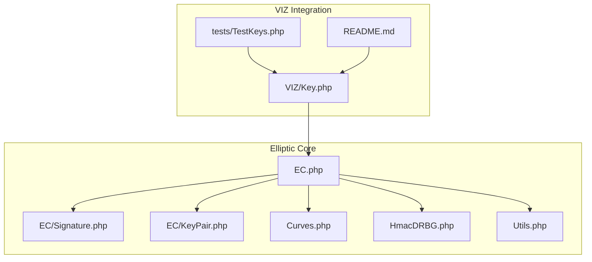
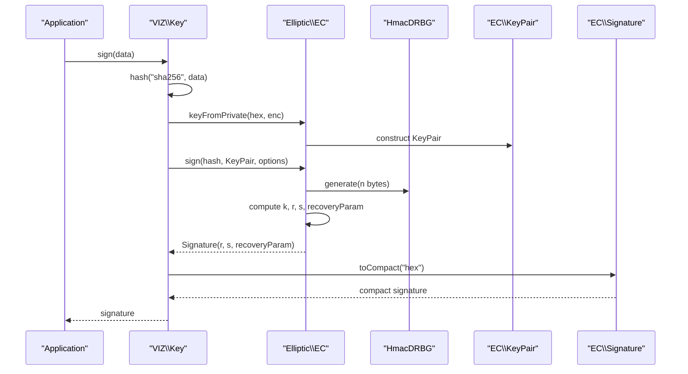
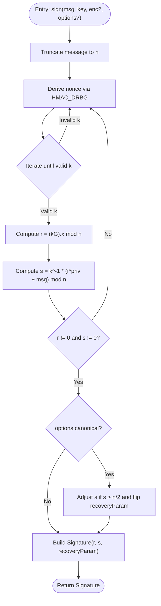
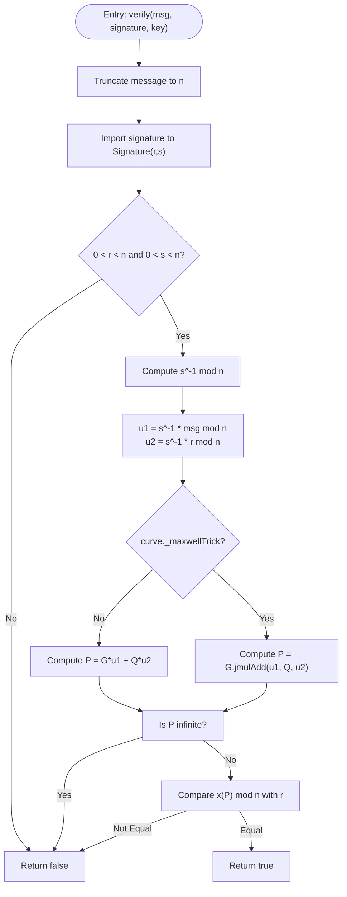
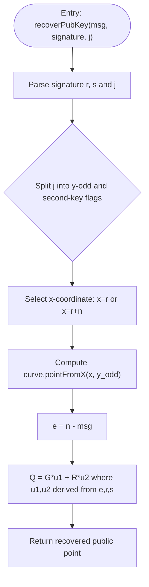
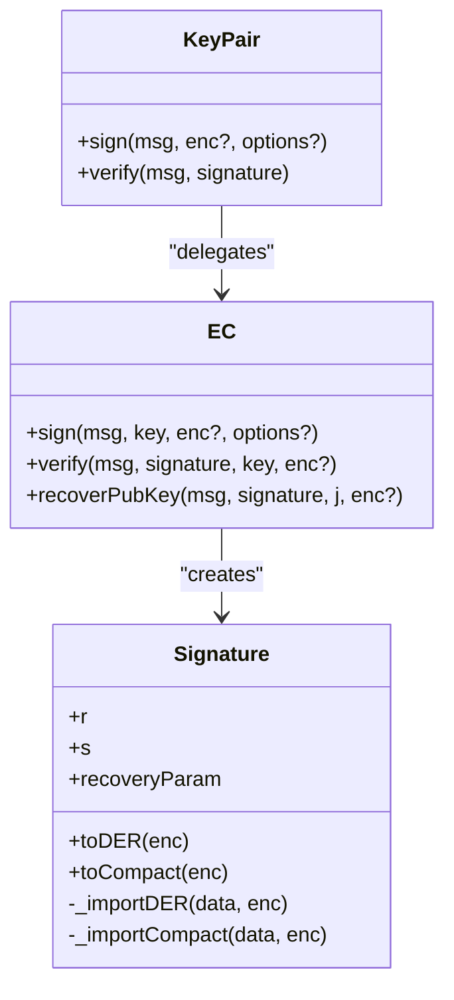
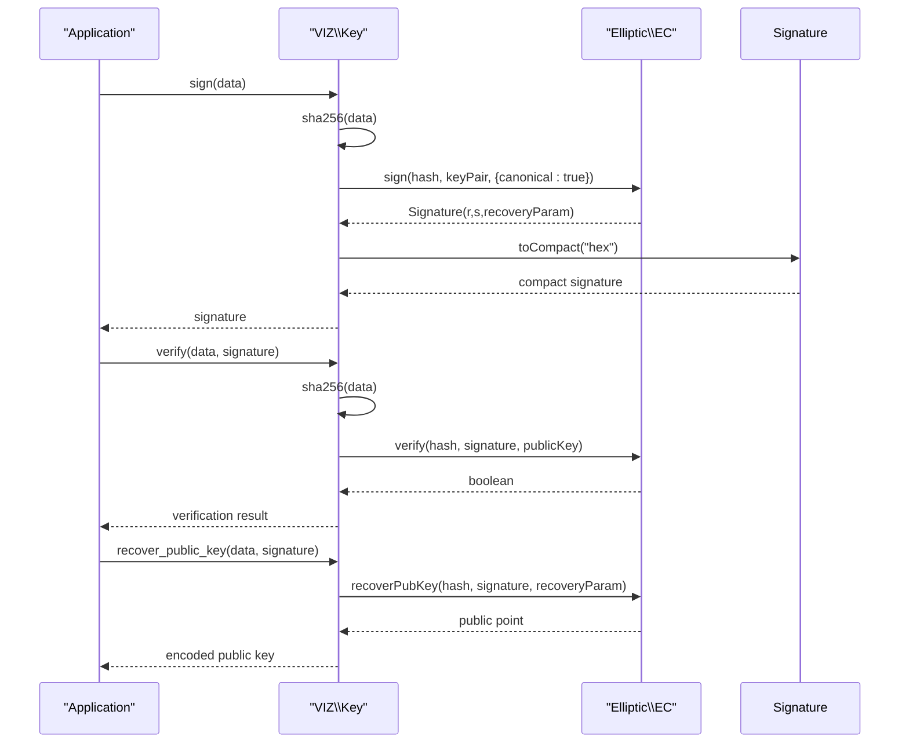
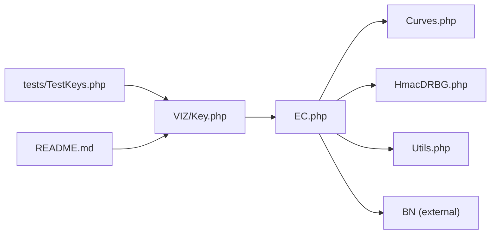

# Cryptographic Operations

<cite>
**Referenced Files in This Document**
- [EC.php](file://class/Elliptic/EC.php)
- [Signature.php](file://class/Elliptic/EC/Signature.php)
- [KeyPair.php](file://class/Elliptic/EC/KeyPair.php)
- [Curves.php](file://class/Elliptic/Curves.php)
- [HmacDRBG.php](file://class/Elliptic/HmacDRBG.php)
- [Utils.php](file://class/Elliptic/Utils.php)
- [Key.php](file://class/VIZ/Key.php)
- [TestKeys.php](file://tests/TestKeys.php)
- [README.md](file://README.md)
</cite>

## Table of Contents
1. [Introduction](#introduction)
2. [Project Structure](#project-structure)
3. [Core Components](#core-components)
4. [Architecture Overview](#architecture-overview)
5. [Detailed Component Analysis](#detailed-component-analysis)
6. [Dependency Analysis](#dependency-analysis)
7. [Performance Considerations](#performance-considerations)
8. [Troubleshooting Guide](#troubleshooting-guide)
9. [Conclusion](#conclusion)
10. [Appendices](#appendices)

## Introduction
This document explains the cryptographic operations implemented in the library, focusing on ECDSA signature creation, verification, and public key recovery using the secp256k1 elliptic curve. It details the sign() method’s use of SHA-256 hashing and canonical signature encoding, the verify() method for validating signatures, and the recoverPubKey() method for deriving public keys from signatures. It also covers the underlying elliptic curve mathematics, curve parameters, and practical integration patterns for external verification systems. Security considerations and performance optimization strategies are included.

## Project Structure
The cryptographic stack is organized around:
- Elliptic curve cryptography primitives and ECDSA operations
- Curve definitions and utilities
- HMAC-based deterministic random generation
- VIZ blockchain-specific key handling and examples

**Diagram sources**
- [EC.php](file://class/Elliptic/EC.php#L1-L272)
- [Signature.php](file://class/Elliptic/EC/Signature.php#L1-L208)
- [KeyPair.php](file://class/Elliptic/EC/KeyPair.php#L1-L138)
- [Curves.php](file://class/Elliptic/Curves.php#L938-L972)
- [HmacDRBG.php](file://class/Elliptic/HmacDRBG.php#L1-L132)
- [Utils.php](file://class/Elliptic/Utils.php#L1-L163)
- [Key.php](file://class/VIZ/Key.php#L1-L353)
- [TestKeys.php](file://tests/TestKeys.php#L1-L29)
- [README.md](file://README.md#L36-L67)

**Section sources**
- [EC.php](file://class/Elliptic/EC.php#L1-L272)
- [Curves.php](file://class/Elliptic/Curves.php#L938-L972)
- [Key.php](file://class/VIZ/Key.php#L1-L353)

## Core Components
- EC: Implements ECDSA signing, verification, and public key recovery over a configured curve. It uses SHA-256 hashing and HMAC_DRBG for deterministic nonce generation.
- EC/Signature: Encodes and decodes signatures in DER and compact formats, enforces canonical encoding when requested.
- EC/KeyPair: Wraps private/public key material and delegates ECDSA operations to EC.
- Curves: Defines secp256k1 parameters and precomputed data for efficient scalar multiplication.
- HmacDRBG: Deterministic random bit generator used for nonce derivation during signing.
- VIZ/Key: Provides convenience methods for signing, verification, and public key recovery, including SHA-256 hashing of messages and compact signature encoding.

**Section sources**
- [EC.php](file://class/Elliptic/EC.php#L89-L177)
- [EC.php](file://class/Elliptic/EC.php#L179-L219)
- [EC.php](file://class/Elliptic/EC.php#L221-L249)
- [Signature.php](file://class/Elliptic/EC/Signature.php#L1-L208)
- [KeyPair.php](file://class/Elliptic/EC/KeyPair.php#L122-L128)
- [Curves.php](file://class/Elliptic/Curves.php#L938-L972)
- [HmacDRBG.php](file://class/Elliptic/HmacDRBG.php#L1-L132)
- [Key.php](file://class/VIZ/Key.php#L302-L338)

## Architecture Overview
The EC class orchestrates ECDSA operations:
- Signing: Hashes message with SHA-256, generates deterministic nonce via HMAC_DRBG, computes signature with canonical encoding, and derives recovery parameter.
- Verification: Validates signature bounds and checks the equality of computed point’s x-coordinate with r modulo n.
- Public key recovery: Recovers candidate public points from signature and message, selecting the correct one using recovery parameter.

**Diagram sources**
- [Key.php](file://class/VIZ/Key.php#L302-L311)
- [EC.php](file://class/Elliptic/EC.php#L89-L177)
- [HmacDRBG.php](file://class/Elliptic/HmacDRBG.php#L98-L131)
- [Signature.php](file://class/Elliptic/EC/Signature.php#L188-L207)

## Detailed Component Analysis

### ECDSA Signing (sign)
The sign() method performs:
- Message hashing with SHA-256 and truncation to curve order n.
- Deterministic nonce generation using HMAC_DRBG seeded by private key and message hash.
- Scalar arithmetic to compute r and s, ensuring non-zero values and canonical encoding when requested.
- Recovery parameter computation based on parity of y-coordinate and x-coordinate equivalence.

**Diagram sources**
- [EC.php](file://class/Elliptic/EC.php#L89-L177)

**Section sources**
- [EC.php](file://class/Elliptic/EC.php#L89-L177)

### ECDSA Verification (verify)
The verify() method validates:
- Bounds of r and s against curve order n.
- Uses either standard point addition or Maxwell’s trick (jacobian coordinates) to compute u1*G + u2*Q and compares x-coordinate with r modulo n.

**Diagram sources**
- [EC.php](file://class/Elliptic/EC.php#L179-L219)

**Section sources**
- [EC.php](file://class/Elliptic/EC.php#L179-L219)

### Public Key Recovery (recoverPubKey)
The recoverPubKey() method reconstructs the public key from a signature and message:
- Interprets recovery parameter to select correct y-oddness and whether r corresponds to original x or x + n.
- Computes Q = r^-1 * (sR - eG) using point arithmetic.

**Diagram sources**
- [EC.php](file://class/Elliptic/EC.php#L221-L249)

**Section sources**
- [EC.php](file://class/Elliptic/EC.php#L221-L249)

### Signature Encoding and Decoding
The EC/Signature class supports:
- DER encoding/decoding for interoperability with standards.
- Compact encoding for blockchain use (65-byte format with recovery byte).
- Canonical encoding enforcement for deterministic signatures.

**Diagram sources**
- [Signature.php](file://class/Elliptic/EC/Signature.php#L1-L208)
- [EC.php](file://class/Elliptic/EC.php#L89-L177)
- [KeyPair.php](file://class/Elliptic/EC/KeyPair.php#L122-L128)

**Section sources**
- [Signature.php](file://class/Elliptic/EC/Signature.php#L1-L208)
- [EC.php](file://class/Elliptic/EC.php#L89-L177)
- [KeyPair.php](file://class/Elliptic/EC/KeyPair.php#L122-L128)

### Practical Examples and Integration
- Creating a signature:
  - Hash message with SHA-256.
  - Sign using VIZ/Key.sign(), which internally uses EC.sign() with canonical encoding.
  - Encode signature compactly for blockchain use.
- Verifying a signature:
  - Hash message with SHA-256.
  - Verify using VIZ/Key.verify() with the public key.
- Recovering a public key:
  - Use VIZ/Key.recover_public_key() to derive the public key from signature and message.

**Diagram sources**
- [Key.php](file://class/VIZ/Key.php#L302-L338)
- [EC.php](file://class/Elliptic/EC.php#L89-L177)
- [EC.php](file://class/Elliptic/EC.php#L179-L219)
- [EC.php](file://class/Elliptic/EC.php#L221-L249)

**Section sources**
- [Key.php](file://class/VIZ/Key.php#L302-L338)
- [README.md](file://README.md#L36-L67)
- [TestKeys.php](file://tests/TestKeys.php#L9-L27)

## Dependency Analysis
- EC depends on:
  - Curve parameters from Curves.php (secp256k1).
  - HMAC_DRBG for deterministic nonce generation.
  - BN for big integer arithmetic.
  - Utils for encoding/decoding helpers.
- VIZ/Key depends on EC for cryptographic operations and provides convenience methods for hashing and encoding.

**Diagram sources**
- [EC.php](file://class/Elliptic/EC.php#L1-L40)
- [Curves.php](file://class/Elliptic/Curves.php#L938-L972)
- [HmacDRBG.php](file://class/Elliptic/HmacDRBG.php#L1-L49)
- [Utils.php](file://class/Elliptic/Utils.php#L1-L57)
- [Key.php](file://class/VIZ/Key.php#L1-L32)
- [TestKeys.php](file://tests/TestKeys.php#L1-L29)
- [README.md](file://README.md#L36-L67)

**Section sources**
- [EC.php](file://class/Elliptic/EC.php#L1-L40)
- [Curves.php](file://class/Elliptic/Curves.php#L938-L972)
- [HmacDRBG.php](file://class/Elliptic/HmacDRBG.php#L1-L49)
- [Utils.php](file://class/Elliptic/Utils.php#L1-L57)
- [Key.php](file://class/VIZ/Key.php#L1-L32)

## Performance Considerations
- Precomputation and windowed arithmetic:
  - The secp256k1 curve definition includes precomputed data for doubles and NAF/Jacobian optimizations, enabling fast scalar multiplication.
- Timing resistance:
  - The sign() method ensures fixed-bit-length random nonce selection to prevent timing leaks.
- Canonical encoding:
  - Enforcing canonical s-values reduces signature malleability and improves interoperability.
- Hashing:
  - Using SHA-256 for message hashing is efficient and standardized for ECDSA.

[No sources needed since this section provides general guidance]

## Troubleshooting Guide
Common issues and resolutions:
- Invalid signature bounds:
  - Ensure r and s are within [1, n-1]; verification returns false otherwise.
- Non-invertible k or zero r/s:
  - The sign() loop retries with new nonce until valid values are produced.
- Incorrect recovery parameter:
  - Ensure the recovery parameter matches the intended public key candidate; use getKeyRecoveryParam() to deduce it if unknown.
- Encoding mismatches:
  - Use compact encoding for blockchain compatibility; DER for standards compliance.

**Section sources**
- [EC.php](file://class/Elliptic/EC.php#L179-L219)
- [EC.php](file://class/Elliptic/EC.php#L221-L249)
- [Signature.php](file://class/Elliptic/EC/Signature.php#L188-L207)

## Conclusion
The library provides a robust, standards-aligned implementation of ECDSA over secp256k1 with deterministic nonce generation, canonical signature encoding, and efficient public key recovery. It integrates cleanly with VIZ blockchain workflows and offers practical examples for signing, verification, and public key recovery. Adhering to the security and performance recommendations ensures reliable cryptographic operations in production environments.

[No sources needed since this section summarizes without analyzing specific files]

## Appendices

### Mathematical Foundations
- Elliptic curve group operations over finite fields.
- Scalar multiplication using precomputed windows and NAF/Jacobian optimizations.
- ECDSA signature generation and verification equations.
- Public key recovery using signature components and message hash.

[No sources needed since this section provides general guidance]

### Security Considerations
- Use canonical encoding to prevent signature malleability.
- Ensure deterministic nonce generation via HMAC_DRBG to avoid nonce reuse.
- Validate signature bounds and curve point validity before acceptance.
- Prefer compact encoding for blockchain signatures and DER for interoperability.

[No sources needed since this section provides general guidance]