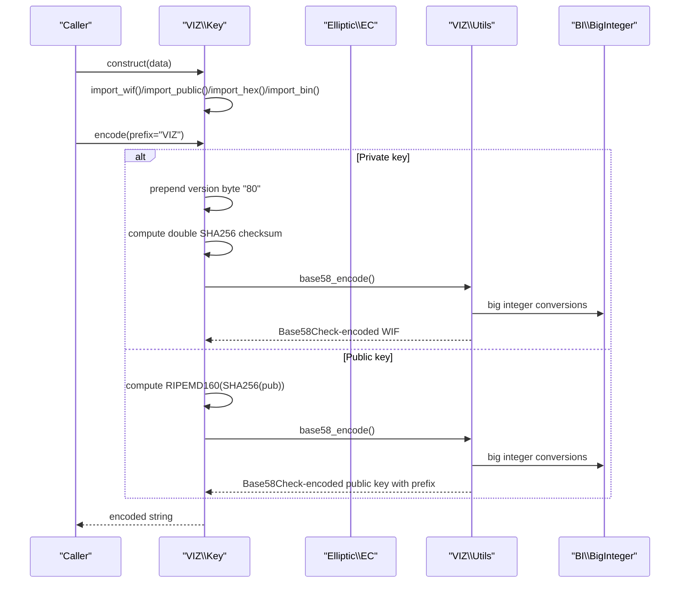
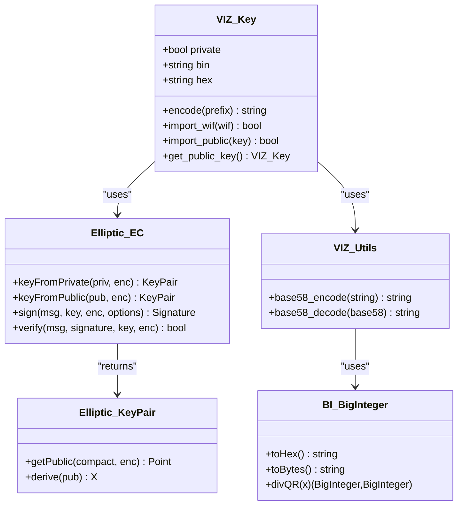

# Key Encoding and Formats

<cite>
**Referenced Files in This Document**
- [Key.php](file://class/VIZ/Key.php)
- [Utils.php](file://class/VIZ/Utils.php)
- [EC.php](file://class/Elliptic/EC.php)
- [KeyPair.php](file://class/Elliptic/EC/KeyPair.php)
- [BigInteger.php](file://class/BI/BigInteger.php)
- [TestKeys.php](file://tests/TestKeys.php)
</cite>

## Table of Contents
1. [Introduction](#introduction)
2. [Project Structure](#project-structure)
3. [Core Components](#core-components)
4. [Architecture Overview](#architecture-overview)
5. [Detailed Component Analysis](#detailed-component-analysis)
6. [Dependency Analysis](#dependency-analysis)
7. [Performance Considerations](#performance-considerations)
8. [Troubleshooting Guide](#troubleshooting-guide)
9. [Conclusion](#conclusion)

## Introduction
This document explains key encoding and format conversion in the VIZ PHP library, focusing on:
- WIF (Wallet Import Format) encoding and decoding
- Base58 encoding for public keys
- Hexadecimal and binary representations
- Compressed vs uncompressed public keys
- Version bytes and checksums in WIF format
- Base58Check encoding algorithm
- Practical examples and validation
- Security implications of different key representations
- Behavior of the encode() method and prefix handling

## Project Structure
The relevant components for key encoding and cryptography are organized as follows:
- VIZ namespace: Key and Utils classes handle key import, export, signing, verification, memo encryption/decryption, and Base58 encoding/decoding.
- Elliptic namespace: EC and KeyPair classes implement secp256k1 elliptic curve operations, key derivation, and signature primitives.
- BI namespace: BigInteger provides arbitrary precision arithmetic used by Base58 encoding.

```mermaid
graph TB
subgraph "VIZ"
K["Key.php"]
U["Utils.php"]
end
subgraph "Elliptic"
EC["EC.php"]
KP["KeyPair.php"]
end
subgraph "BI"
BI["BigInteger.php"]
end
subgraph "Tests"
T["TestKeys.php"]
end
K --> EC
K --> U
U --> BI
EC --> KP
T --> K
```

**Diagram sources**
- [Key.php](file://class/VIZ/Key.php#L1-L353)
- [Utils.php](file://class/VIZ/Utils.php#L1-L413)
- [EC.php](file://class/Elliptic/EC.php#L1-L272)
- [KeyPair.php](file://class/Elliptic/EC/KeyPair.php#L1-L138)
- [BigInteger.php](file://class/BI/BigInteger.php#L1-L200)
- [TestKeys.php](file://tests/TestKeys.php#L1-L29)

**Section sources**
- [Key.php](file://class/VIZ/Key.php#L1-L353)
- [Utils.php](file://class/VIZ/Utils.php#L1-L413)
- [EC.php](file://class/Elliptic/EC.php#L1-L272)
- [KeyPair.php](file://class/Elliptic/EC/KeyPair.php#L1-L138)
- [BigInteger.php](file://class/BI/BigInteger.php#L1-L200)
- [TestKeys.php](file://tests/TestKeys.php#L1-L29)

## Core Components
- Key: Manages private/public keys, WIF import/export, public key derivation, signatures, and memo encryption/decryption. Provides encode() for WIF or Base58 public key output.
- Utils: Implements Base58 encode/decode and Base58Check helpers for various address formats.
- EC and KeyPair: Provide secp256k1 keypair creation, public key derivation, ECDH shared secret computation, ECDSA signing, and signature verification.
- BigInteger: Arbitrary precision integer arithmetic used by Base58 conversions.

Key responsibilities:
- WIF import/export validates version bytes and double SHA256 checksums.
- Public key import/export validates RIPEMD160 checksums.
- encode() returns WIF for private keys and Base58Check-prefixed public keys for public keys.
- Base58Check is implemented via Utils::base58_encode with manual checksum calculation.

**Section sources**
- [Key.php](file://class/VIZ/Key.php#L14-L301)
- [Utils.php](file://class/VIZ/Utils.php#L209-L290)
- [EC.php](file://class/Elliptic/EC.php#L46-L52)
- [KeyPair.php](file://class/Elliptic/EC/KeyPair.php#L64-L80)
- [BigInteger.php](file://class/BI/BigInteger.php#L24-L124)

## Architecture Overview
The encoding pipeline integrates cryptographic operations with Base58Check encoding:



**Diagram sources**
- [Key.php](file://class/VIZ/Key.php#L14-L301)
- [Utils.php](file://class/VIZ/Utils.php#L209-L290)
- [BigInteger.php](file://class/BI/BigInteger.php#L24-L124)

## Detailed Component Analysis

### WIF Encoding and Decoding
WIF is used to import/export private keys. The process includes:
- Version byte: "80" for mainnet private keys
- Private key data: 32-byte secret scalar
- Compression flag: optional "01" appended for compressed public key output
- Double SHA256 checksum: last 4 bytes of SHA256(SHA256(version+key+flag))

Import flow:
- Decode Base58 to binary
- Verify double SHA256 checksum over the decoded payload
- Validate version byte "80"
- Strip version byte and checksum to obtain private key data

Export flow:
- Prepend version byte "80"
- Optionally append compression flag "01"
- Compute double SHA256 checksum and append last 4 bytes
- Encode with Base58

Security implications:
- Version byte ensures correct network semantics
- Double SHA256 checksum protects against typos and corruption
- Compression flag affects derived public key representation

Practical example:
- Import a WIF string and verify it decodes to the expected private key hex
- Export a private key to WIF and confirm the checksum validates

Validation steps:
- Checksum verification using double SHA256
- Version byte validation ("80")

**Section sources**
- [Key.php](file://class/VIZ/Key.php#L219-L242)
- [Key.php](file://class/VIZ/Key.php#L287-L294)
- [Utils.php](file://class/VIZ/Utils.php#L209-L290)

### Base58 Encoding for Public Keys
Public keys are represented as Base58Check strings prefixed with a human-readable prefix (default "VIZ"):
- Payload: public key data (compressed or uncompressed)
- Checksum: RIPEMD160(SHA256(payload)) truncated to 4 bytes
- Prefix: "VIZ" concatenated before Base58Check encoding

Import flow:
- Remove prefix and decode Base58
- Verify RIPEMD160 checksum
- Extract raw public key data

Export flow:
- Compute RIPEMD160(SHA256(public key))
- Prepend public key data and append checksum
- Encode with Base58 and prepend prefix

Compressed vs uncompressed public keys:
- Compressed: "x02" or "x03" + 32-byte x-coordinate
- Uncompressed: "x04" + 32-byte x + 32-byte y
- The Key class derives compressed public keys by default for compact representation

**Section sources**
- [Key.php](file://class/VIZ/Key.php#L243-L260)
- [Key.php](file://class/VIZ/Key.php#L261-L286)
- [Key.php](file://class/VIZ/Key.php#L287-L300)
- [KeyPair.php](file://class/Elliptic/EC/KeyPair.php#L64-L80)

### Base58Check Algorithm
Base58Check combines Base58 encoding with a checksum:
- Base58 encoding converts binary data to an alphabetic string using a 58-character alphabet
- Checksum is appended to detect errors
- Decoding validates the checksum before returning raw data

Implementation details:
- Utils::base58_encode converts binary to Base58 using arbitrary precision arithmetic
- Leading zero detection preserves leading zeros during conversion
- Utils::base58_decode validates characters and reconstructs binary

**Section sources**
- [Utils.php](file://class/VIZ/Utils.php#L209-L290)
- [BigInteger.php](file://class/BI/BigInteger.php#L24-L124)

### Hexadecimal and Binary Representation
- Hex import/export: Converts between hex strings and binary buffers
- Binary import/export: Converts between binary buffers and hex strings
- Used extensively for private keys, public keys, and intermediate computations

**Section sources**
- [Key.php](file://class/VIZ/Key.php#L211-L218)

### Elliptic Curve Operations
- KeyPair::getPublic(compact, enc): Returns compressed or uncompressed public key
- EC::keyFromPrivate/keyFromPublic: Creates keypair objects from hex/private key data
- ECDH shared secret computation and ECDSA signing/verification

Compressed vs uncompressed:
- Compressed public keys reduce size and bandwidth
- Uncompressed public keys include both x and y coordinates
- The Key class defaults to compressed public keys for compactness

**Section sources**
- [KeyPair.php](file://class/Elliptic/EC/KeyPair.php#L64-L80)
- [EC.php](file://class/Elliptic/EC.php#L46-L52)
- [Key.php](file://class/VIZ/Key.php#L261-L286)

### Memo Encryption/Decryption and Base58
- Memo encryption uses ECDH shared secret, AES-256-CBC, and Base58 encoding for transport
- Decryption reverses the process and validates a 4-byte checksum derived from the encryption key

**Section sources**
- [Key.php](file://class/VIZ/Key.php#L45-L86)
- [Key.php](file://class/VIZ/Key.php#L87-L176)
- [Utils.php](file://class/VIZ/Utils.php#L291-L320)

### Practical Examples and Validation
- Import a private key from hex and export as WIF; verify checksum
- Import a public key from Base58 and export as hex; verify RIPEMD160 checksum
- Generate a new key pair and encode both private and public keys
- Sign and verify messages using the generated keys

Validation checklist:
- WIF import/export checksum validation
- Public key import/export checksum validation
- ECDSA signature verification
- Memo encryption/decryption integrity

**Section sources**
- [TestKeys.php](file://tests/TestKeys.php#L9-L27)
- [Key.php](file://class/VIZ/Key.php#L185-L210)
- [Key.php](file://class/VIZ/Key.php#L302-L322)

## Dependency Analysis
Key dependencies and interactions:
- Key depends on EC for keypair operations and on Utils for Base58 encoding/decoding
- Utils depends on BI for arbitrary precision arithmetic
- EC depends on KeyPair for key operations



**Diagram sources**
- [Key.php](file://class/VIZ/Key.php#L9-L32)
- [EC.php](file://class/Elliptic/EC.php#L9-L52)
- [KeyPair.php](file://class/Elliptic/EC/KeyPair.php#L6-L24)
- [Utils.php](file://class/VIZ/Utils.php#L7-L8)
- [BigInteger.php](file://class/BI/BigInteger.php#L24-L124)

**Section sources**
- [Key.php](file://class/VIZ/Key.php#L1-L32)
- [EC.php](file://class/Elliptic/EC.php#L1-L52)
- [KeyPair.php](file://class/Elliptic/EC/KeyPair.php#L1-L24)
- [Utils.php](file://class/VIZ/Utils.php#L1-L8)
- [BigInteger.php](file://class/BI/BigInteger.php#L1-L24)

## Performance Considerations
- Base58 encoding/decoding involves arbitrary precision arithmetic; ensure efficient BigInteger usage
- SHA256 and RIPEMD160 computations are CPU-intensive; cache results where possible
- ECDH shared secret and ECDSA operations scale with curve size; use compressed public keys to reduce bandwidth
- Memo encryption/decryption adds overhead; consider streaming for large memos

## Troubleshooting Guide
Common issues and resolutions:
- WIF import fails: verify checksum and version byte "80"
- Public key import fails: verify RIPEMD160 checksum
- Base58 decode returns false: invalid characters or malformed input
- Signature verification fails: ensure correct message hashing and public key format
- Memo decryption fails: verify checksum and IV/key derivation

Diagnostic steps:
- Validate checksums for WIF and public keys
- Confirm correct prefix usage for public keys
- Ensure hex strings are valid and properly padded
- Check for leading zero preservation in Base58 conversions

**Section sources**
- [Key.php](file://class/VIZ/Key.php#L219-L260)
- [Utils.php](file://class/VIZ/Utils.php#L251-L290)

## Conclusion
The VIZ PHP library provides robust support for key encoding and format conversion:
- WIF import/export with strict version byte and checksum validation
- Base58Check encoding for public keys with configurable prefixes
- Compressed public keys by default for compactness
- Secure memo encryption/decryption using ECDH and AES-256-CBC
- Comprehensive elliptic curve operations for signing and verification

Adhering to the documented validation steps and understanding the differences between compressed and uncompressed public keys ensures secure and interoperable key handling across applications.