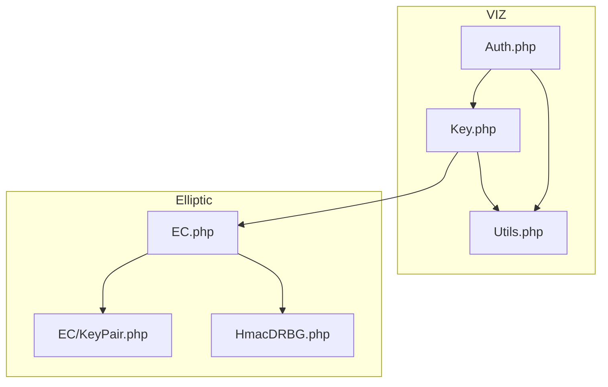
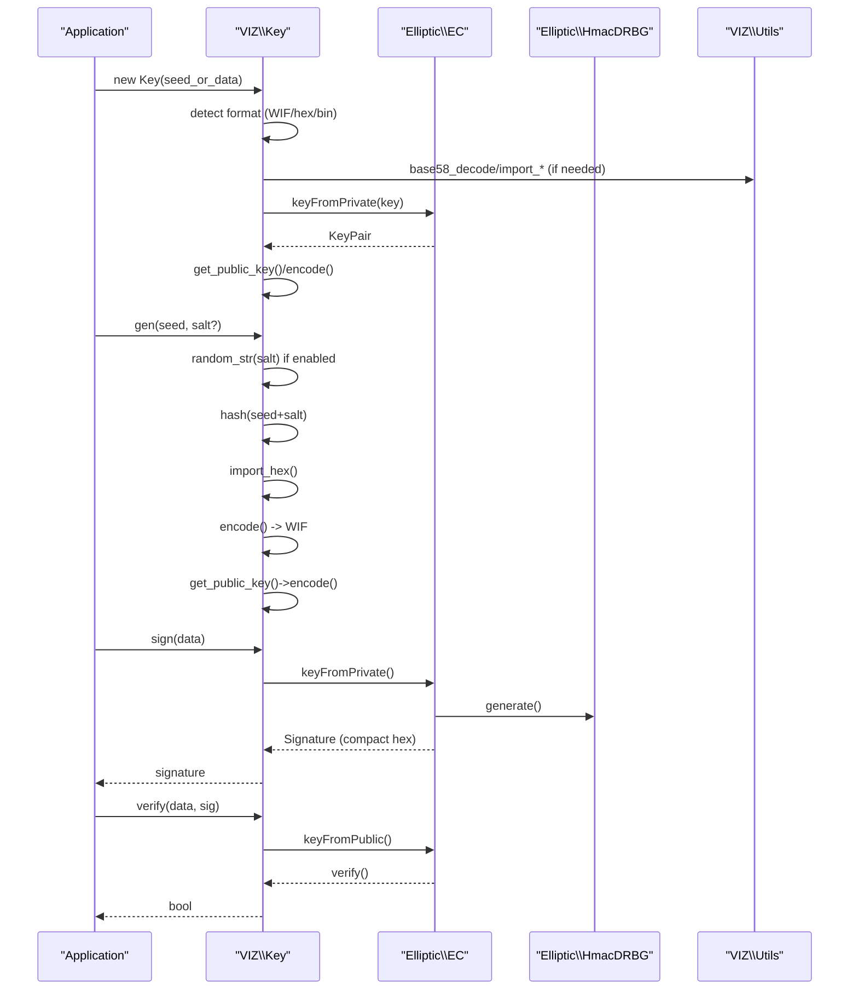
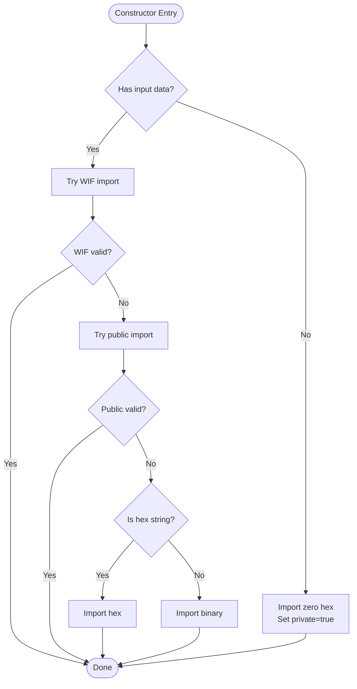
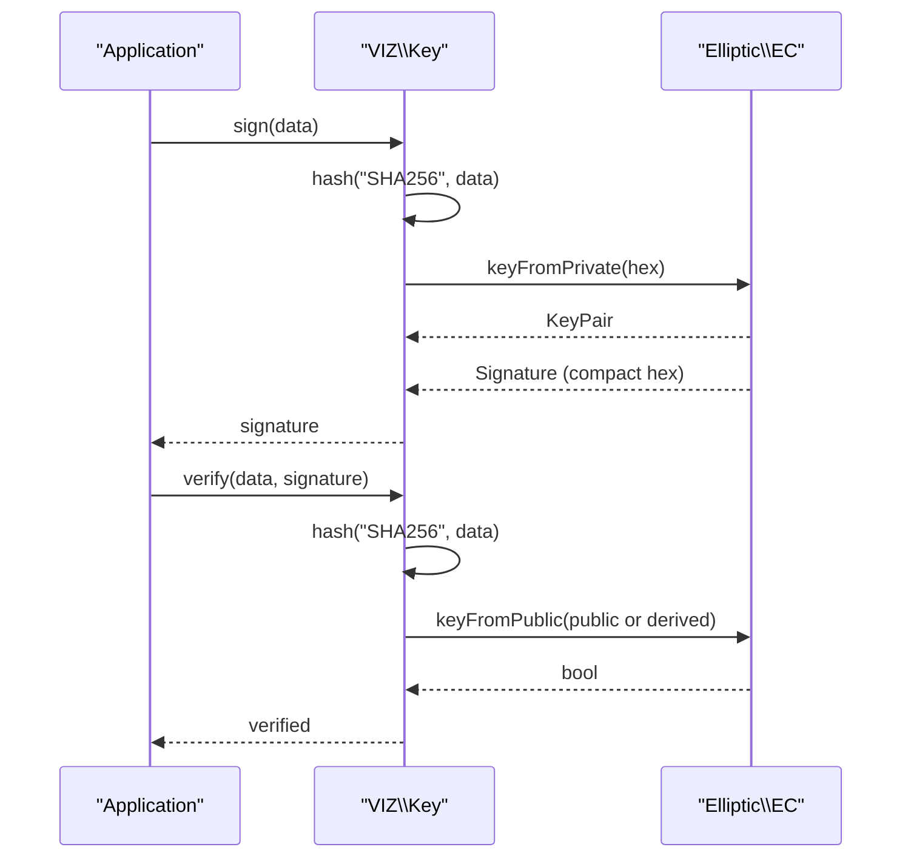
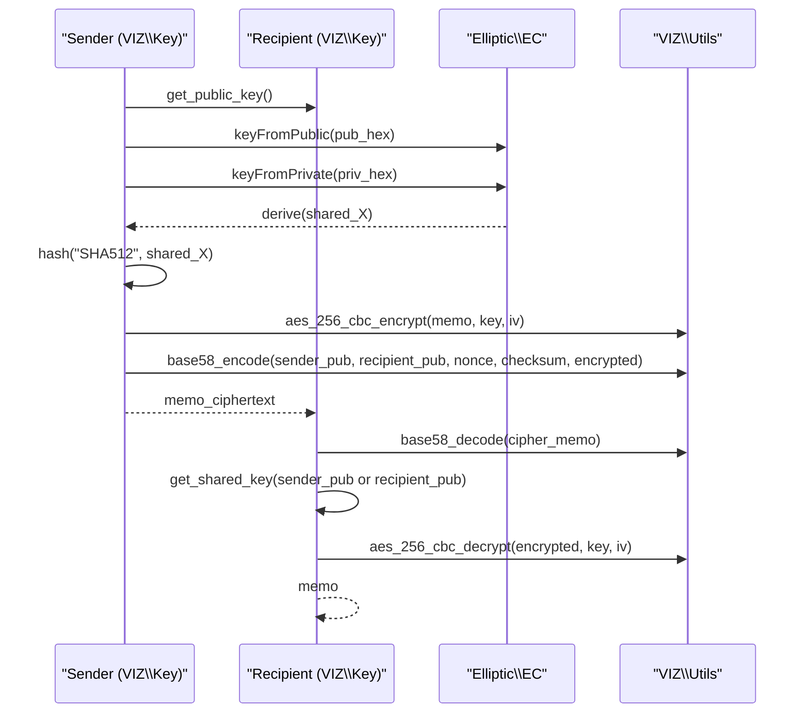
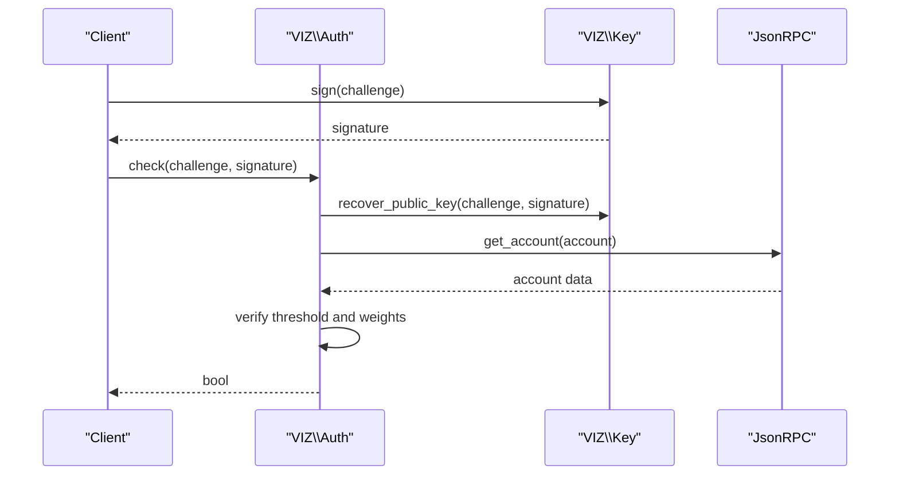
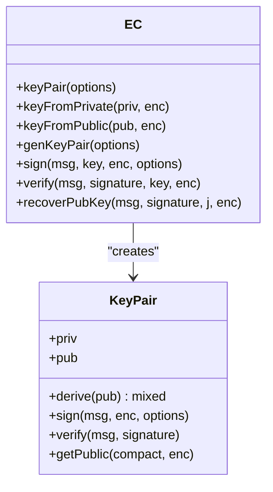
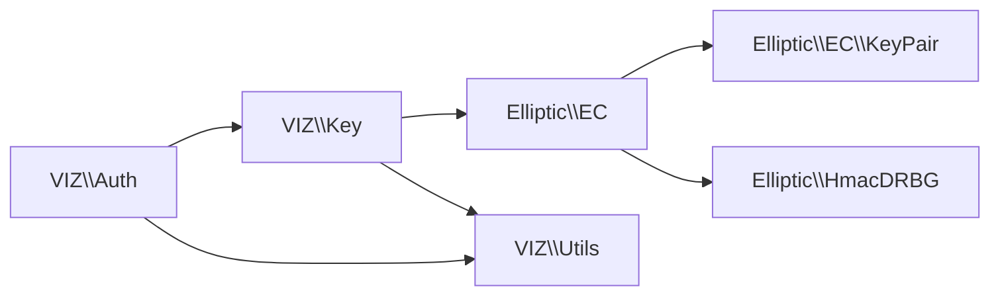

# Key Generation and Import

<cite>
**Referenced Files in This Document**
- [Key.php](file://class/VIZ/Key.php)
- [EC.php](file://class/Elliptic/EC.php)
- [KeyPair.php](file://class/Elliptic/EC/KeyPair.php)
- [HmacDRBG.php](file://class/Elliptic/HmacDRBG.php)
- [Utils.php](file://class/VIZ/Utils.php)
- [Auth.php](file://class/VIZ/Auth.php)
- [TestKeys.php](file://tests/TestKeys.php)
- [README.md](file://README.md)
- [composer.json](file://composer.json)
</cite>

## Table of Contents
1. [Introduction](#introduction)
2. [Project Structure](#project-structure)
3. [Core Components](#core-components)
4. [Architecture Overview](#architecture-overview)
5. [Detailed Component Analysis](#detailed-component-analysis)
6. [Dependency Analysis](#dependency-analysis)
7. [Performance Considerations](#performance-considerations)
8. [Troubleshooting Guide](#troubleshooting-guide)
9. [Conclusion](#conclusion)
10. [Appendices](#appendices)

## Introduction
This document explains the complete lifecycle of cryptographic key generation and import for the VIZ PHP library. It covers:
- Random key generation using deterministic seed hashing and optional salt
- Seed-based key derivation
- Importing keys from multiple formats (WIF, hex, binary)
- Constructor auto-detection of key formats
- Underlying cryptographic operations (ECDSA/secp256k1, ECDH, AES-256-CBC, SHA/Ripemd checksums)
- Practical examples for generating new keys, importing existing keys, and handling different key formats
- Security considerations for key generation, salt usage, and best practices for key storage and management

## Project Structure
The key functionality resides in the VIZ namespace with elliptic curve cryptography provided by the Elliptic library. The primary entry point for key operations is the Key class, which integrates with EC, KeyPair, and Utils for cryptographic primitives and encoding.

**Diagram sources**
- [Key.php](file://class/VIZ/Key.php#L1-L353)
- [EC.php](file://class/Elliptic/EC.php#L1-L272)
- [KeyPair.php](file://class/Elliptic/EC/KeyPair.php#L1-L138)
- [HmacDRBG.php](file://class/Elliptic/HmacDRBG.php#L1-L132)
- [Utils.php](file://class/VIZ/Utils.php#L1-L413)
- [Auth.php](file://class/VIZ/Auth.php#L1-L70)

**Section sources**
- [composer.json](file://composer.json#L19-L29)
- [README.md](file://README.md#L1-L455)

## Core Components
- VIZ\Key: Central class for key lifecycle, import, encoding, signing, verification, ECDH shared key computation, and memo encryption/decryption.
- Elliptic\EC: Provides ECDSA and ECDH operations, deterministic keypair generation via HMAC_DRBG, and signature verification/recovery.
- Elliptic\EC\KeyPair: Low-level key pair abstraction for private/public keys and derive/sign/verify operations.
- Elliptic\HmacDRBG: Deterministic random bit generator used for secure key generation and nonce selection.
- VIZ\Utils: Encoding/decoding utilities (Base58), AES-256-CBC, VLQ helpers, and cross-chain address helpers.
- VIZ\Auth: Passwordless authentication workflow using recovered public keys and account authority checks.

**Section sources**
- [Key.php](file://class/VIZ/Key.php#L1-L353)
- [EC.php](file://class/Elliptic/EC.php#L1-L272)
- [KeyPair.php](file://class/Elliptic/EC/KeyPair.php#L1-L138)
- [HmacDRBG.php](file://class/Elliptic/HmacDRBG.php#L1-L132)
- [Utils.php](file://class/VIZ/Utils.php#L1-L413)
- [Auth.php](file://class/VIZ/Auth.php#L1-L70)

## Architecture Overview
The key lifecycle is orchestrated by VIZ\Key, which delegates to Elliptic\EC for cryptographic operations and VIZ\Utils for encoding/decoding and symmetric encryption. The Auth class consumes signatures and recovered public keys to validate credentials against blockchain authorities.

**Diagram sources**
- [Key.php](file://class/VIZ/Key.php#L14-L32)
- [Key.php](file://class/VIZ/Key.php#L185-L210)
- [Key.php](file://class/VIZ/Key.php#L302-L322)
- [EC.php](file://class/Elliptic/EC.php#L54-L75)
- [EC.php](file://class/Elliptic/EC.php#L112-L124)
- [HmacDRBG.php](file://class/Elliptic/HmacDRBG.php#L98-L131)
- [Utils.php](file://class/VIZ/Utils.php#L212-L290)

## Detailed Component Analysis

### VIZ\Key: Constructor and Auto-Detection
- Initializes secp256k1 elliptic curve context.
- If data is provided, attempts to import in order:
  - WIF decoding and validation
  - Public key import and validation
  - Hex string detection (alphanumeric)
  - Binary fallback
- If no data is provided, defaults to a zero private key and imports it as hex.
- Supports both private and public key modes; private mode enables signing and deriving public keys.

**Diagram sources**
- [Key.php](file://class/VIZ/Key.php#L14-L32)
- [Key.php](file://class/VIZ/Key.php#L211-L260)

**Section sources**
- [Key.php](file://class/VIZ/Key.php#L14-L32)
- [Key.php](file://class/VIZ/Key.php#L211-L260)

### VIZ\Key: Import Methods
- WIF import:
  - Decodes Base58
  - Validates version byte and double SHA256 checksum
  - Extracts private key bytes and marks as private
- Public key import:
  - Decodes Base58
  - Validates RIPEMD160 checksum over decoded payload
  - Sets private=false and stores hex
- Hex import:
  - Converts hex to binary and stores both forms
- Binary import:
  - Stores raw bytes and converts to hex

Security notes:
- WIF import validates version and checksum before accepting the key.
- Public import validates checksum before accepting the key.
- Hex/binary imports do not validate format; ensure correct length and encoding.

**Section sources**
- [Key.php](file://class/VIZ/Key.php#L219-L242)
- [Key.php](file://class/VIZ/Key.php#L243-L260)
- [Key.php](file://class/VIZ/Key.php#L211-L218)
- [Utils.php](file://class/VIZ/Utils.php#L251-L290)

### VIZ\Key: Random Key Generation and Seed-Based Derivation
- gen(seed, salt=true):
  - Generates a random salt if salt is true
  - Concatenates seed and salt, hashes with SHA256
  - Imports the hash as hex, sets private=true
  - Encodes private key to WIF and derives public key
  - Returns seed, WIF, encoded public key, and public key object
- gen_pair(seed, salt=''):
  - Similar to gen but uses salt+seed order
  - Returns WIF, encoded public key, and public key object

Notes:
- gen_pair is useful when you want to derive a key pair deterministically from a seed and optional salt.
- gen is suitable when you need to preserve the original seed for later regeneration.

**Section sources**
- [Key.php](file://class/VIZ/Key.php#L185-L210)
- [Key.php](file://class/VIZ/Key.php#L177-L184)

### VIZ\Key: Signing and Verification
- sign(data):
  - Hashes data with SHA256
  - Uses EC keyFromPrivate to sign with canonical signature selection
  - Returns compact hex signature
- verify(data, signature):
  - Hashes data with SHA256
  - If self is private, derives public key first
  - Uses EC keyFromPublic to verify signature
- recover_public_key(data, signature):
  - Recovers public key from signature and message hash
  - Returns encoded public key string

**Diagram sources**
- [Key.php](file://class/VIZ/Key.php#L302-L322)
- [EC.php](file://class/Elliptic/EC.php#L89-L177)

**Section sources**
- [Key.php](file://class/VIZ/Key.php#L302-L322)
- [EC.php](file://class/Elliptic/EC.php#L89-L177)

### VIZ\Key: ECDH Shared Key and Memo Encryption
- get_shared_key(other_public_key_encoded):
  - Derives shared X coordinate using ECDH
  - Returns SHA512 hash of the shared point’s hex representation
- encode_memo(to_public_key, memo):
  - Computes shared key with the recipient’s public key
  - Prepares sender and recipient public keys (compressed)
  - Generates random 8-byte nonce and computes encryption key via SHA512(nonce || shared_key)
  - Computes checksum and AES-256-CBC encrypts memo with IV derived from encryption key
  - Encodes result with VLQ metadata and Base58
- decode_memo(cipher_memo):
  - Decodes Base58 payload
  - Extracts sender and recipient public keys, nonce, and checksum
  - Recomputes encryption key and verifies checksum
  - Decrypts and strips VLQ metadata

**Diagram sources**
- [Key.php](file://class/VIZ/Key.php#L33-L44)
- [Key.php](file://class/VIZ/Key.php#L45-L86)
- [Key.php](file://class/VIZ/Key.php#L87-L176)
- [Utils.php](file://class/VIZ/Utils.php#L291-L320)
- [Utils.php](file://class/VIZ/Utils.php#L322-L341)

**Section sources**
- [Key.php](file://class/VIZ/Key.php#L33-L44)
- [Key.php](file://class/VIZ/Key.php#L45-L86)
- [Key.php](file://class/VIZ/Key.php#L87-L176)
- [Utils.php](file://class/VIZ/Utils.php#L291-L341)

### VIZ\Auth: Passwordless Authentication Workflow
- Constructs challenge data from domain, action, account, authority, time, and nonce
- Signs the challenge with the private key
- Recovered public key is validated against account authority thresholds and weights
- Returns whether the signature is valid for the given parameters

**Diagram sources**
- [Auth.php](file://class/VIZ/Auth.php#L25-L69)
- [Key.php](file://class/VIZ/Key.php#L323-L338)

**Section sources**
- [Auth.php](file://class/VIZ/Auth.php#L1-L70)
- [Key.php](file://class/VIZ/Key.php#L323-L338)

### Elliptic\EC and KeyPair: Cryptographic Primitives
- EC provides:
  - keyFromPrivate/keyFromPublic
  - sign with HMAC_DRBG-backed nonce generation
  - verify and recoverPubKey
  - genKeyPair using HMAC_DRBG with entropy and nonce
- KeyPair encapsulates:
  - Private and public points
  - derive (ECDH shared X)
  - sign/verify
  - getPublic with compressed/uncompressed encodings

**Diagram sources**
- [EC.php](file://class/Elliptic/EC.php#L42-L75)
- [EC.php](file://class/Elliptic/EC.php#L89-L177)
- [KeyPair.php](file://class/Elliptic/EC/KeyPair.php#L12-L46)
- [KeyPair.php](file://class/Elliptic/EC/KeyPair.php#L117-L128)

**Section sources**
- [EC.php](file://class/Elliptic/EC.php#L1-L272)
- [KeyPair.php](file://class/Elliptic/EC/KeyPair.php#L1-L138)

### Elliptic\HmacDRBG: Deterministic Randomness
- HMAC_DRBG instantiated with hash, entropy, nonce, and personalization
- generate produces deterministic random bytes sized to curve order
- Used by EC.sign and EC.genKeyPair for nonces and private key generation

**Section sources**
- [HmacDRBG.php](file://class/Elliptic/HmacDRBG.php#L1-L132)
- [EC.php](file://class/Elliptic/EC.php#L54-L75)
- [EC.php](file://class/Elliptic/EC.php#L112-L124)

### VIZ\Utils: Encoding, Encryption, and Cross-Chain Helpers
- Base58 encode/decode for WIF and public key encoding
- AES-256-CBC encrypt/decrypt with optional IV
- VLQ helpers for variable-length quantity encoding/decoding
- Address helpers for Bitcoin/Litecoin/Ethereum/TRON compatibility

**Section sources**
- [Utils.php](file://class/VIZ/Utils.php#L212-L290)
- [Utils.php](file://class/VIZ/Utils.php#L291-L320)
- [Utils.php](file://class/VIZ/Utils.php#L322-L383)

## Dependency Analysis
- VIZ\Key depends on:
  - Elliptic\EC for ECDSA/ECDH operations
  - VIZ\Utils for Base58, AES, and VLQ
- Elliptic\EC depends on:
  - Elliptic\EC\KeyPair for key representation
  - Elliptic\HmacDRBG for deterministic randomness
- VIZ\Auth depends on:
  - VIZ\Key for signing and public key recovery
  - VIZ\JsonRPC for account data retrieval

**Diagram sources**
- [Key.php](file://class/VIZ/Key.php#L1-L353)
- [EC.php](file://class/Elliptic/EC.php#L1-L272)
- [KeyPair.php](file://class/Elliptic/EC/KeyPair.php#L1-L138)
- [HmacDRBG.php](file://class/Elliptic/HmacDRBG.php#L1-L132)
- [Utils.php](file://class/VIZ/Utils.php#L1-L413)
- [Auth.php](file://class/VIZ/Auth.php#L1-L70)

**Section sources**
- [Key.php](file://class/VIZ/Key.php#L1-L353)
- [EC.php](file://class/Elliptic/EC.php#L1-L272)
- [Auth.php](file://class/VIZ/Auth.php#L1-L70)

## Performance Considerations
- Key generation:
  - gen/gen_pair compute SHA256 and import hex; negligible overhead compared to EC operations.
- Signing:
  - EC.sign uses HMAC_DRBG to generate nonces; cost scales with curve order size.
- ECDH and AES:
  - get_shared_key and memo operations involve SHA512 and AES-256-CBC; performance dominated by OpenSSL crypto.
- Base58 and VLQ:
  - Encode/decode and VLQ operations are linear in payload size.

[No sources needed since this section provides general guidance]

## Troubleshooting Guide
Common issues and resolutions:
- WIF import fails:
  - Verify Base58 validity and checksum; ensure leading version byte matches expectations.
- Public key import fails:
  - Confirm RIPEMD160 checksum matches the payload.
- Signature verification fails:
  - Ensure data matches exactly; canonical signature selection may require retry.
- Memo decryption fails:
  - Verify checksum and that the correct private key is used to derive the shared key.
- Auth check fails:
  - Confirm account exists, authority weight thresholds, and time window alignment.

**Section sources**
- [Key.php](file://class/VIZ/Key.php#L219-L242)
- [Key.php](file://class/VIZ/Key.php#L243-L260)
- [Key.php](file://class/VIZ/Key.php#L312-L322)
- [Key.php](file://class/VIZ/Key.php#L87-L176)
- [Auth.php](file://class/VIZ/Auth.php#L25-L69)

## Conclusion
The VIZ PHP library provides a robust, secure, and flexible key lifecycle implementation:
- Automatic format detection for WIF, hex, and binary inputs
- Deterministic seed-based key derivation with optional salt
- Full cryptographic suite for signing, verification, ECDH, and memo encryption
- Utilities for encoding, encryption, and cross-chain compatibility
Follow the security and best practices outlined below to ensure safe key handling in production environments.

[No sources needed since this section summarizes without analyzing specific files]

## Appendices

### Practical Examples and Usage Patterns
- Generate a new key pair from a seed:
  - Use gen or gen_pair with a strong seed and salt; capture returned WIF and public key.
- Import an existing key:
  - Pass WIF, hex, or binary to the constructor; it auto-detects and imports accordingly.
- Sign and verify:
  - Use sign to produce a canonical signature; verify with the derived or provided public key.
- Encrypt/decrypt memo:
  - Use encode_memo and decode_memo with shared keys derived from two parties’ key pairs.
- Passwordless authentication:
  - Use auth to generate challenge data and signature; validate with VIZ\Auth.

**Section sources**
- [README.md](file://README.md#L137-L162)
- [README.md](file://README.md#L164-L205)
- [README.md](file://README.md#L207-L222)
- [TestKeys.php](file://tests/TestKeys.php#L9-L27)

### Security Considerations and Best Practices
- Salt usage:
  - Always enable salt in gen and gen_pair to prevent deterministic key reuse across seeds.
- Key storage:
  - Store WIF or hex securely; avoid plaintext logs.
  - Prefer hardware security modules or encrypted vaults for private keys.
- Randomness:
  - Rely on built-in HMAC_DRBG for deterministic randomness; avoid weak PRNGs.
- Checksums:
  - Validate WIF and public key checksums during import to prevent corrupted keys.
- Memo encryption:
  - Use shared keys derived from both parties; ensure nonce uniqueness and correct IV handling.
- Authority thresholds:
  - Ensure account authority weights meet thresholds before relying on recovered public keys.

[No sources needed since this section provides general guidance]