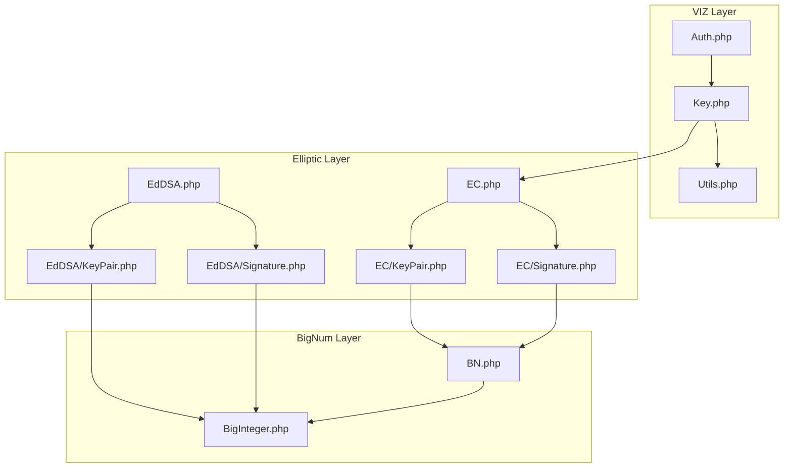
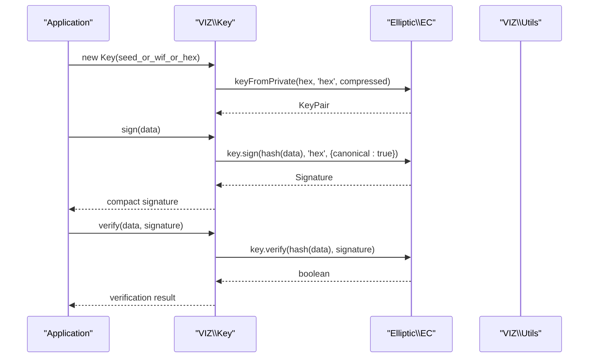
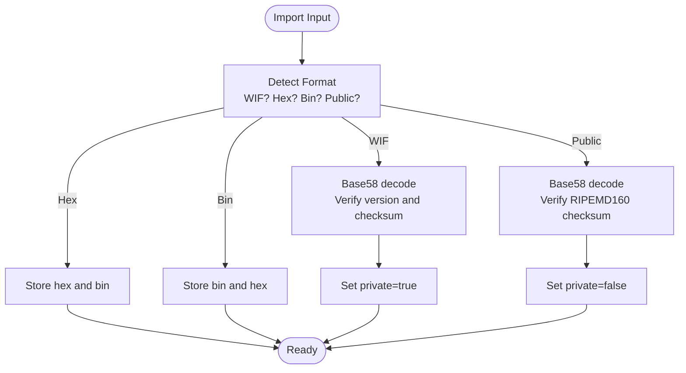
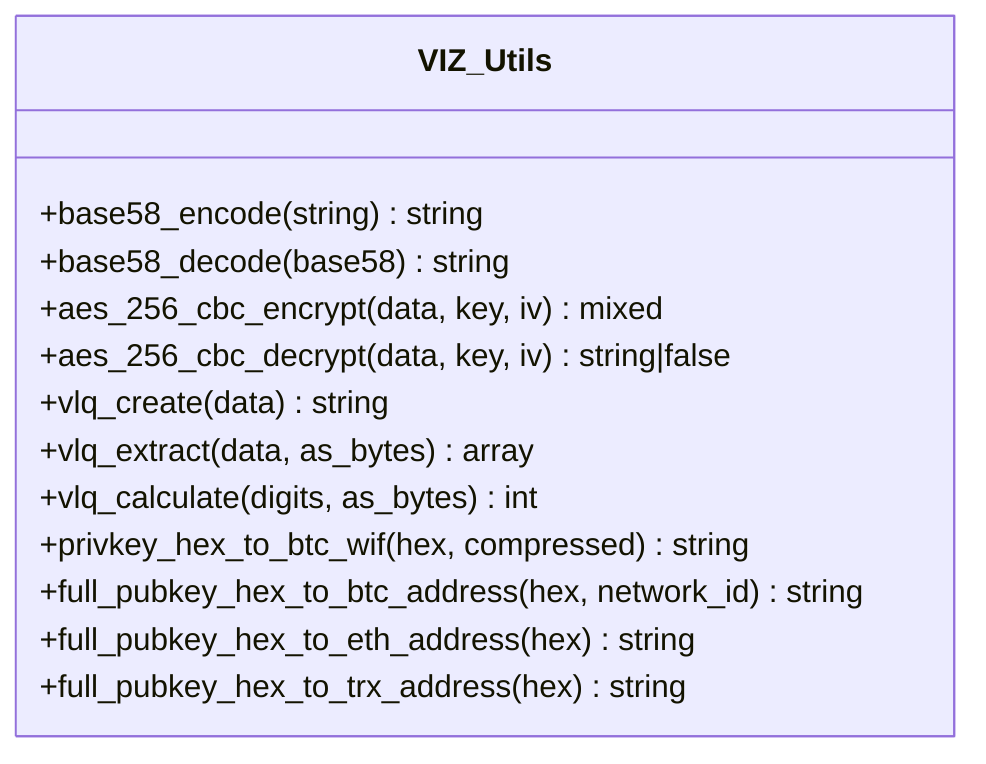
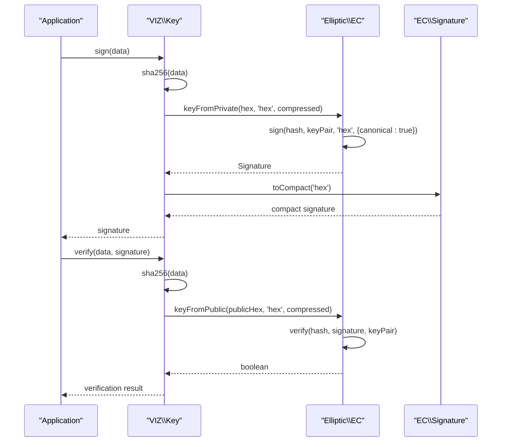
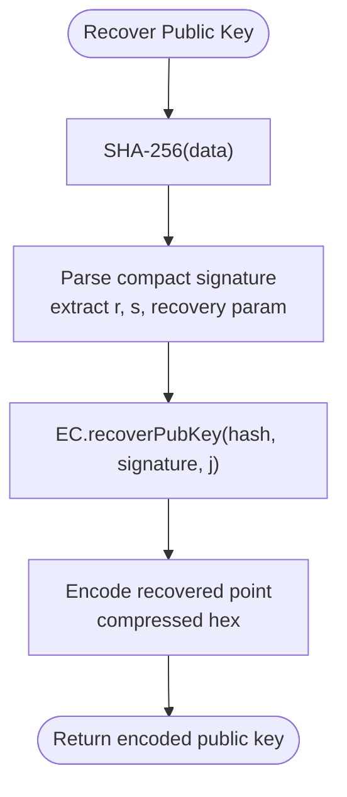
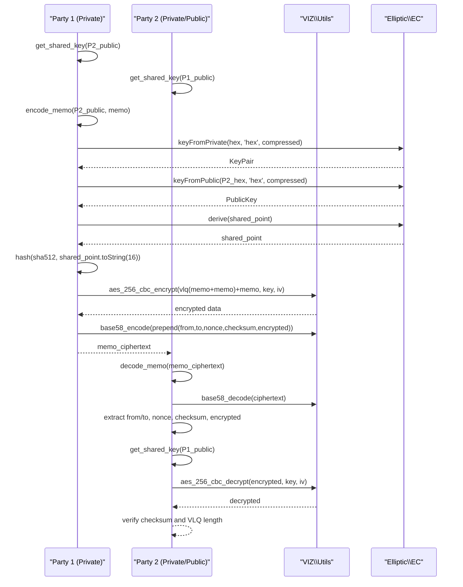
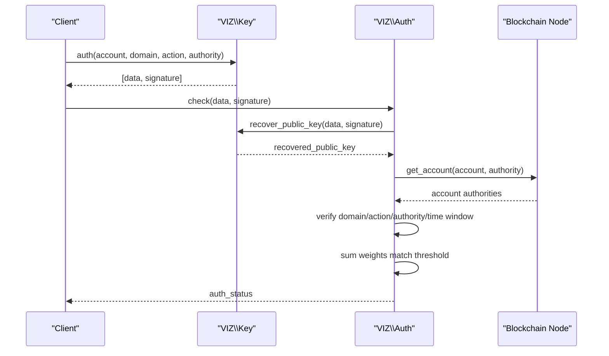
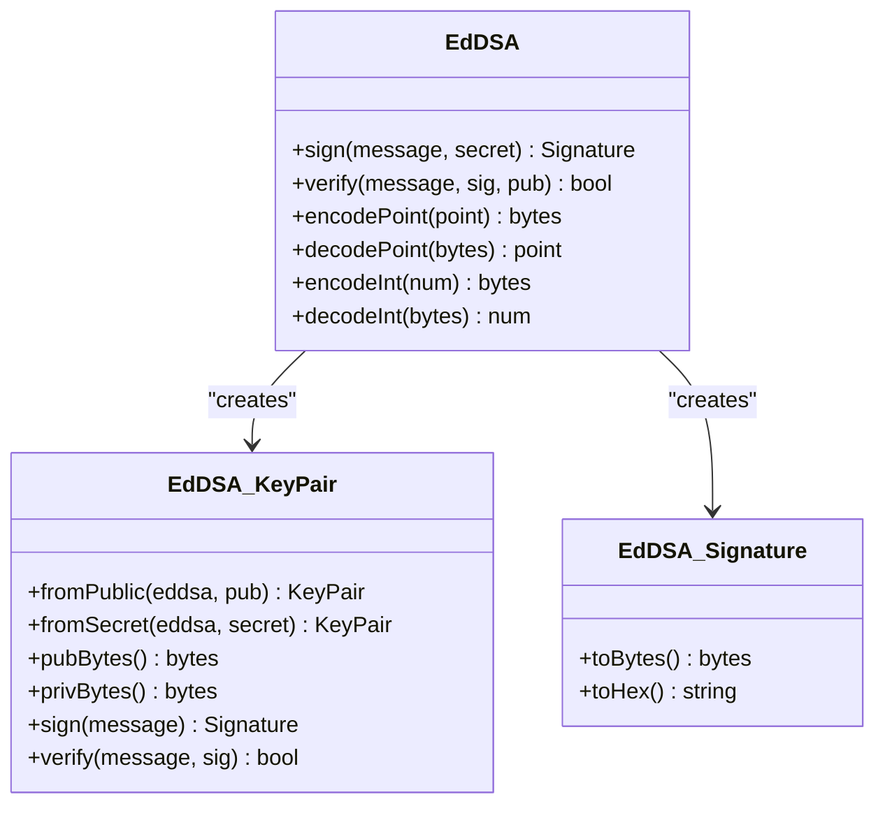
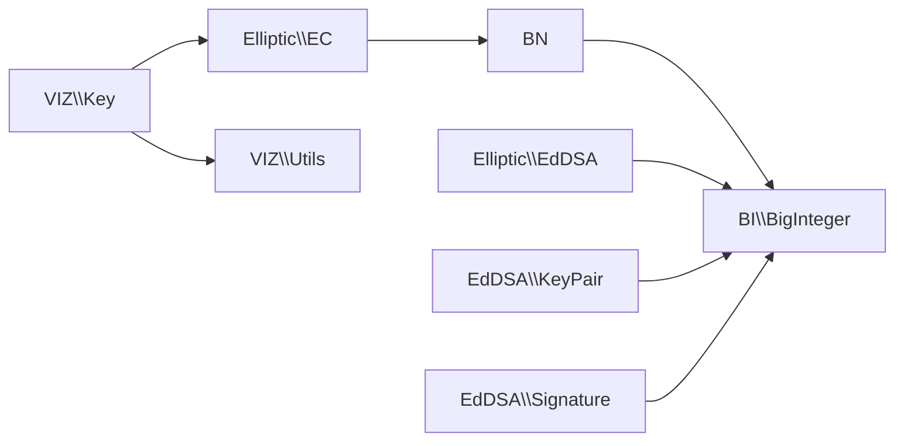

# Key Management System

<cite>
**Referenced Files in This Document**
- [Key.php](file://class/VIZ/Key.php)
- [Utils.php](file://class/VIZ/Utils.php)
- [Auth.php](file://class/VIZ/Auth.php)
- [EC.php](file://class/Elliptic/EC.php)
- [EC/KeyPair.php](file://class/Elliptic/EC/KeyPair.php)
- [EC/Signature.php](file://class/Elliptic/EC/Signature.php)
- [EdDSA.php](file://class/Elliptic/EdDSA.php)
- [EdDSA/KeyPair.php](file://class/Elliptic/EdDSA/KeyPair.php)
- [EdDSA/Signature.php](file://class/Elliptic/EdDSA/Signature.php)
- [BigInteger.php](file://class/BI/BigInteger.php)
- [BN.php](file://class/BN/BN.php)
- [TestKeys.php](file://tests/TestKeys.php)
- [README.md](file://README.md)
</cite>

## Table of Contents
1. [Introduction](#introduction)
2. [Project Structure](#project-structure)
3. [Core Components](#core-components)
4. [Architecture Overview](#architecture-overview)
5. [Detailed Component Analysis](#detailed-component-analysis)
6. [Dependency Analysis](#dependency-analysis)
7. [Performance Considerations](#performance-considerations)
8. [Troubleshooting Guide](#troubleshooting-guide)
9. [Conclusion](#conclusion)
10. [Appendices](#appendices)

## Introduction
This document describes the Key Management System of the VIZ PHP Library, focusing on the complete key lifecycle: generation, import/export, encoding/decoding, and cryptographic operations. It explains supported key formats (WIF, hex, compressed/uncompressed), encoding standards, and security considerations. It covers ECDSA signature creation and verification, public key recovery, shared key derivation for memo encryption, and integration with external tools. Practical examples, best practices, and troubleshooting guidance are included for each key operation.

## Project Structure
The Key Management System spans several core modules:
- VIZ namespace: Key, Utils, Auth, and Transaction classes
- Elliptic namespace: EC and EdDSA implementations with KeyPair and Signature classes
- BigInteger and BN wrappers for big integer arithmetic

**Diagram sources**
- [Key.php](file://class/VIZ/Key.php#L1-L353)
- [Utils.php](file://class/VIZ/Utils.php#L1-L413)
- [Auth.php](file://class/VIZ/Auth.php#L1-L70)
- [EC.php](file://class/Elliptic/EC.php#L1-L272)
- [EC/KeyPair.php](file://class/Elliptic/EC/KeyPair.php#L1-L138)
- [EC/Signature.php](file://class/Elliptic/EC/Signature.php#L1-L208)
- [EdDSA.php](file://class/Elliptic/EdDSA.php#L1-L122)
- [EdDSA/KeyPair.php](file://class/Elliptic/EdDSA/KeyPair.php#L1-L126)
- [EdDSA/Signature.php](file://class/Elliptic/EdDSA/Signature.php#L1-L82)
- [BigInteger.php](file://class/BI/BigInteger.php#L1-L200)
- [BN.php](file://class/BN/BN.php#L1-L200)

**Section sources**
- [README.md](file://README.md#L1-L455)

## Core Components
- Key: central class managing EC private/public keys, WIF import/export, public key derivation, ECDSA signing/verification, public key recovery, shared key derivation, and memo encryption/decryption.
- EC: elliptic curve cryptography provider for ECDSA, key generation, signing, verification, and public key recovery.
- EC KeyPair and Signature: low-level EC key pair and signature handling with DER/compact encodings.
- EdDSA and EdDSA KeyPair/Signature: Ed25519 implementation for signatures.
- Utils: encoding/decoding utilities (Base58), AES-256-CBC, VLQ helpers, and cross-chain address helpers.
- Auth: passwordless authentication verifier using recovered public keys and account authorities.

**Section sources**
- [Key.php](file://class/VIZ/Key.php#L1-L353)
- [EC.php](file://class/Elliptic/EC.php#L1-L272)
- [EC/KeyPair.php](file://class/Elliptic/EC/KeyPair.php#L1-L138)
- [EC/Signature.php](file://class/Elliptic/EC/Signature.php#L1-L208)
- [EdDSA.php](file://class/Elliptic/EdDSA.php#L1-L122)
- [EdDSA/KeyPair.php](file://class/Elliptic/EdDSA/KeyPair.php#L1-L126)
- [EdDSA/Signature.php](file://class/Elliptic/EdDSA/Signature.php#L1-L82)
- [Utils.php](file://class/VIZ/Utils.php#L1-L413)
- [Auth.php](file://class/VIZ/Auth.php#L1-L70)

## Architecture Overview
The Key Management System integrates VIZ-specific key handling with the Elliptic library for ECDSA and EdDSA operations. It provides:
- Key import from WIF, hex, and raw binary
- Public key derivation (compressed and uncompressed)
- ECDSA signing with canonical compact format
- Signature verification and public key recovery
- Shared key derivation via ECDH for memo encryption
- Memo encryption/decryption compatible with the JavaScript library
- Cross-format utilities for Bitcoin, Litecoin, Ethereum, Tron addresses

**Diagram sources**
- [Key.php](file://class/VIZ/Key.php#L302-L322)
- [EC.php](file://class/Elliptic/EC.php#L89-L177)
- [EC/Signature.php](file://class/Elliptic/EC/Signature.php#L188-L207)

## Detailed Component Analysis

### Key Lifecycle and Formats
- Import formats:
  - WIF: Base58-decoded with version and checksum validation; marks key as private.
  - Hex: raw private key hex string.
  - Binary: raw private key bytes.
  - Public import: Base58-decoded with RIPEMD160 checksum validation; marks key as public.
- Export formats:
  - WIF for private keys (version byte, private key, double SHA-256 checksum).
  - Encoded public keys with prefix and Base58 with RIPEMD160 checksum.
- Key representations:
  - Compressed (33-byte): x02/x03 + x
  - Uncompressed (65-byte): x04 + x + y

**Diagram sources**
- [Key.php](file://class/VIZ/Key.php#L14-L32)
- [Key.php](file://class/VIZ/Key.php#L219-L260)

**Section sources**
- [Key.php](file://class/VIZ/Key.php#L14-L32)
- [Key.php](file://class/VIZ/Key.php#L211-L260)
- [Utils.php](file://class/VIZ/Utils.php#L209-L290)

### Encoding Standards and Cross-Chain Utilities
- Base58 encoding/decoding with custom alphabet and leading zero handling.
- Address generation helpers for Bitcoin, Litecoin, Ethereum, and Tron using keccak hashing and checksums.
- AES-256-CBC encryption/decryption with IV handling.
- Variable-length quantity (VLQ) encoding for memo framing.

**Diagram sources**
- [Utils.php](file://class/VIZ/Utils.php#L209-L413)

**Section sources**
- [Utils.php](file://class/VIZ/Utils.php#L209-L413)

### ECDSA Operations
- Signing: SHA-256 hash of data, deterministic nonce generation, canonical signature enforcement, compact encoding.
- Verification: SHA-256 hash of data, signature parsing, public key validation, point arithmetic.
- Public key recovery: from signature recovery parameter and message hash.

**Diagram sources**
- [Key.php](file://class/VIZ/Key.php#L302-L322)
- [EC.php](file://class/Elliptic/EC.php#L89-L177)
- [EC/Signature.php](file://class/Elliptic/EC/Signature.php#L188-L207)

**Section sources**
- [Key.php](file://class/VIZ/Key.php#L302-L322)
- [EC.php](file://class/Elliptic/EC.php#L89-L177)
- [EC/Signature.php](file://class/Elliptic/EC/Signature.php#L1-L208)

### Public Key Recovery
- Extracts recovery parameter from compact signature header, recovers candidate public key, and returns encoded public key string.

**Diagram sources**
- [Key.php](file://class/VIZ/Key.php#L323-L338)
- [EC.php](file://class/Elliptic/EC.php#L221-L249)

**Section sources**
- [Key.php](file://class/VIZ/Key.php#L323-L338)
- [EC.php](file://class/Elliptic/EC.php#L221-L249)

### Shared Key Derivation and Memo Encryption
- ECDH shared secret derived from private key and peer public key.
- Memo encryption:
  - Uses shared key to derive encryption key via SHA-512, splits into AES key and IV.
  - Prepends sender/receiver public keys, random nonce, and 4-byte checksum.
  - VLQ-encodes payload length and data, encrypts with AES-256-CBC, Base58-encodes result.
- Memo decryption mirrors encryption steps, validates checksum, and decrypts payload.

**Diagram sources**
- [Key.php](file://class/VIZ/Key.php#L33-L44)
- [Key.php](file://class/VIZ/Key.php#L45-L86)
- [Key.php](file://class/VIZ/Key.php#L87-L176)
- [Utils.php](file://class/VIZ/Utils.php#L291-L320)
- [Utils.php](file://class/VIZ/Utils.php#L322-L383)

**Section sources**
- [Key.php](file://class/VIZ/Key.php#L33-L86)
- [Key.php](file://class/VIZ/Key.php#L87-L176)
- [Utils.php](file://class/VIZ/Utils.php#L291-L383)

### Passwordless Authentication Integration
- Generates domain-action-account-authority-time-nonce data string.
- Signs with private key; server-side verifier recovers public key, checks domain/action/authority/time window, and validates against account’s active authority threshold.

**Diagram sources**
- [Key.php](file://class/VIZ/Key.php#L339-L352)
- [Auth.php](file://class/VIZ/Auth.php#L25-L69)

**Section sources**
- [Key.php](file://class/VIZ/Key.php#L339-L352)
- [Auth.php](file://class/VIZ/Auth.php#L1-L70)

### EdDSA (Ed25519) Support
- Provides EdDSA key pairs, signatures, and encoding/decoding helpers.
- Used for Ed25519 signatures alongside ECDSA.

**Diagram sources**
- [EdDSA.php](file://class/Elliptic/EdDSA.php#L1-L122)
- [EdDSA/KeyPair.php](file://class/Elliptic/EdDSA/KeyPair.php#L1-L126)
- [EdDSA/Signature.php](file://class/Elliptic/EdDSA/Signature.php#L1-L82)

**Section sources**
- [EdDSA.php](file://class/Elliptic/EdDSA.php#L1-L122)
- [EdDSA/KeyPair.php](file://class/Elliptic/EdDSA/KeyPair.php#L1-L126)
- [EdDSA/Signature.php](file://class/Elliptic/EdDSA/Signature.php#L1-L82)

## Dependency Analysis
- VIZ Key depends on Elliptic EC for ECDSA operations and on VIZ Utils for Base58 and AES utilities.
- EC KeyPair and Signature depend on BN and BigInteger for big integer arithmetic.
- EdDSA depends on Elliptic curves and uses BigInteger for hashing and encoding.

**Diagram sources**
- [Key.php](file://class/VIZ/Key.php#L1-L353)
- [EC.php](file://class/Elliptic/EC.php#L1-L272)
- [EdDSA.php](file://class/Elliptic/EdDSA.php#L1-L122)
- [BigInteger.php](file://class/BI/BigInteger.php#L1-L200)
- [BN.php](file://class/BN/BN.php#L1-L200)

**Section sources**
- [Key.php](file://class/VIZ/Key.php#L1-L353)
- [EC.php](file://class/Elliptic/EC.php#L1-L272)
- [EdDSA.php](file://class/Elliptic/EdDSA.php#L1-L122)
- [BigInteger.php](file://class/BI/BigInteger.php#L1-L200)
- [BN.php](file://class/BN/BN.php#L1-L200)

## Performance Considerations
- Prefer compressed public keys for reduced bandwidth and storage.
- Use canonical signatures to minimize ambiguity and improve interoperability.
- Reuse shared keys for memo encryption sessions to avoid repeated ECDH computations.
- Ensure sufficient entropy for nonce generation and random bytes for AES IVs.
- Validate inputs early to avoid unnecessary cryptographic operations.

## Troubleshooting Guide
Common issues and resolutions:
- WIF import fails:
  - Verify Base58 validity and checksum; ensure version byte matches expected format.
  - Check that the decoded key length and checksum match expectations.
- Public key import fails:
  - Confirm RIPEMD160 checksum matches the decoded public key.
- Signature verification fails:
  - Ensure SHA-256 hash of the original data is used.
  - Verify signature format and that the public key corresponds to the private key used for signing.
- Public key recovery returns false:
  - Validate the compact signature header and recovery parameter.
  - Confirm the message hash and signature are correct.
- Memo encryption/decryption errors:
  - Verify shared key derivation from correct parties.
  - Ensure nonce and checksum are preserved and validated.
  - Confirm AES key and IV extraction from SHA-512 of shared key.
- Authentication failures:
  - Check time window and ensure server timezone adjustments are considered.
  - Verify domain, action, authority, and account existence.
  - Confirm authority weights meet threshold.

**Section sources**
- [Key.php](file://class/VIZ/Key.php#L219-L260)
- [Key.php](file://class/VIZ/Key.php#L302-L322)
- [Key.php](file://class/VIZ/Key.php#L323-L338)
- [Key.php](file://class/VIZ/Key.php#L45-L176)
- [Auth.php](file://class/VIZ/Auth.php#L25-L69)

## Conclusion
The VIZ PHP Library provides a robust Key Management System with comprehensive support for ECDSA and EdDSA operations, secure key import/export, encoding/decoding, and memo encryption compatible with external tools. By following the best practices and troubleshooting guidance herein, developers can implement secure and reliable cryptographic workflows for VIZ applications.

## Appendices

### Practical Examples Index
- Initialize key from hex and encode to WIF, derive public key, sign and verify data, recover public key from signature.
- Generate keys with seeds and salts, encode WIF and public keys, and execute transactions.
- Derive shared keys and perform AES-256-CBC encryption/decryption for memo exchange.
- Create and verify passwordless authentication data for domain actions.

**Section sources**
- [README.md](file://README.md#L36-L222)
- [TestKeys.php](file://tests/TestKeys.php#L1-L29)