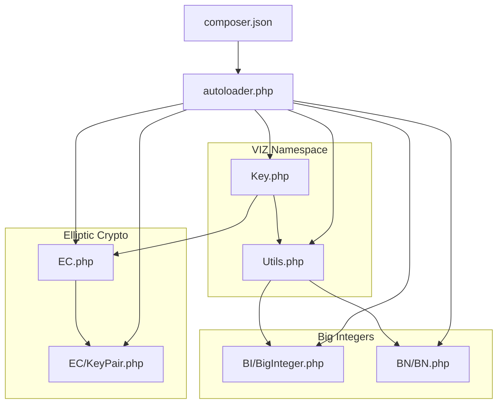
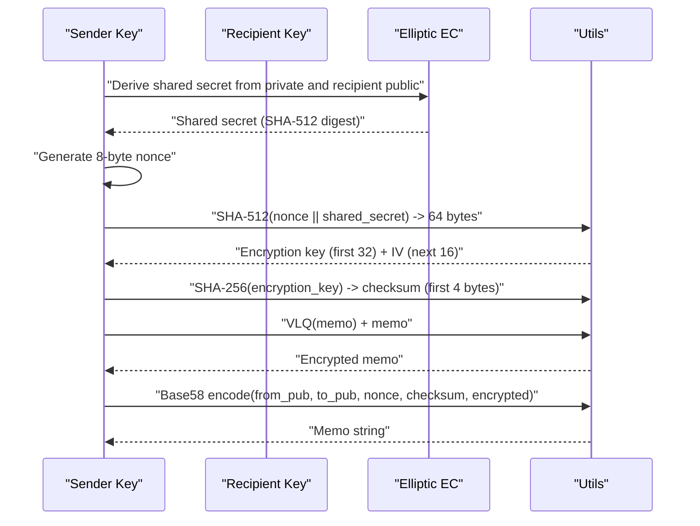
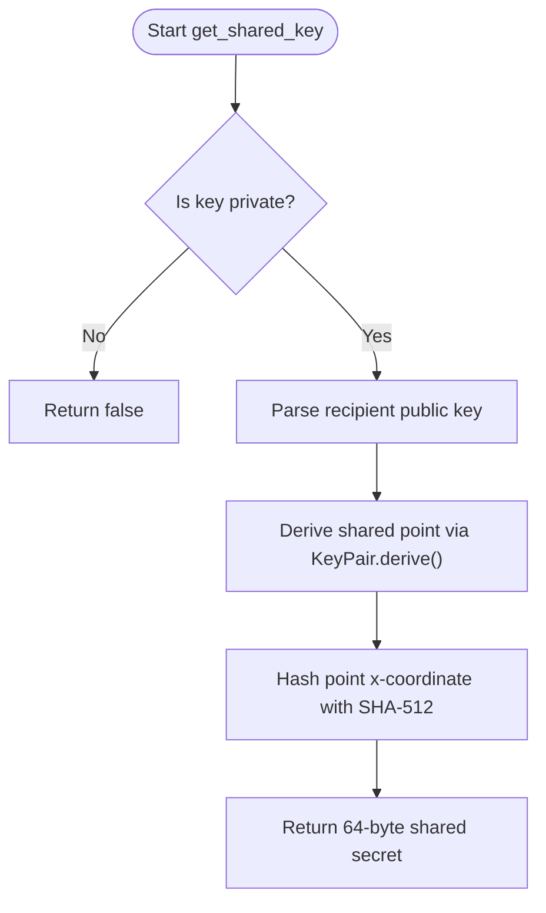
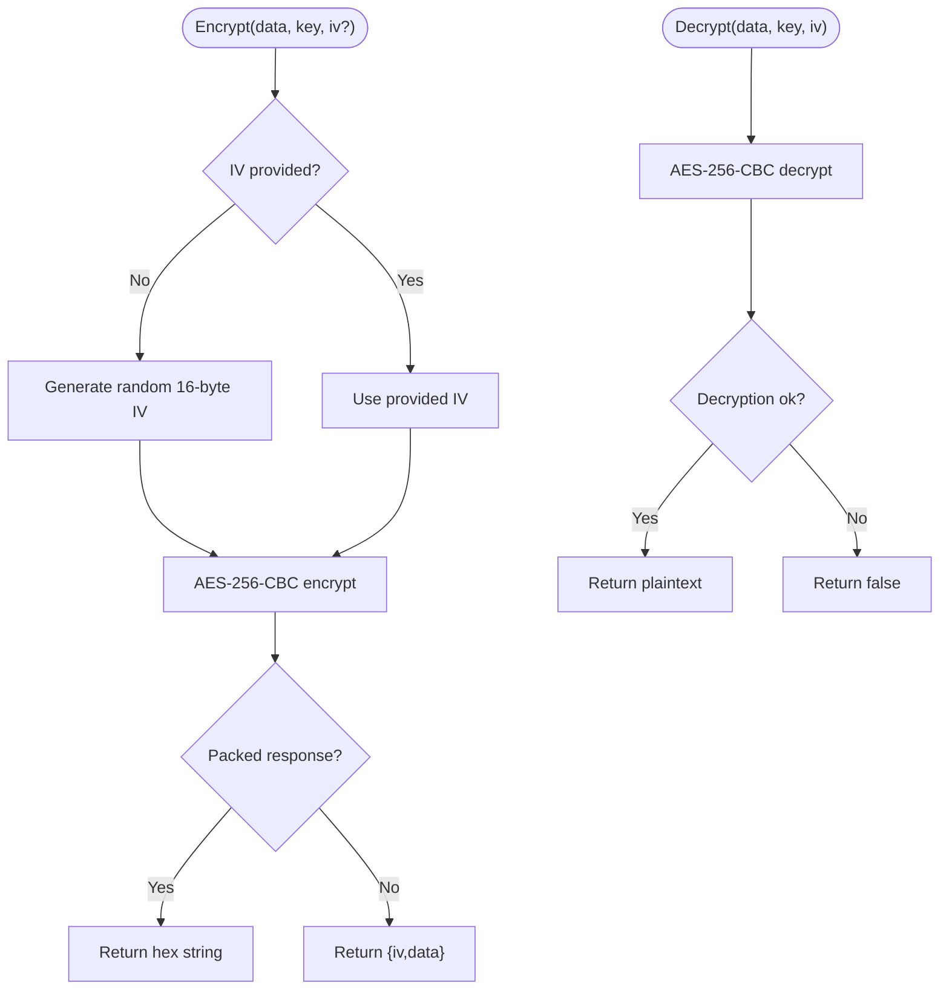
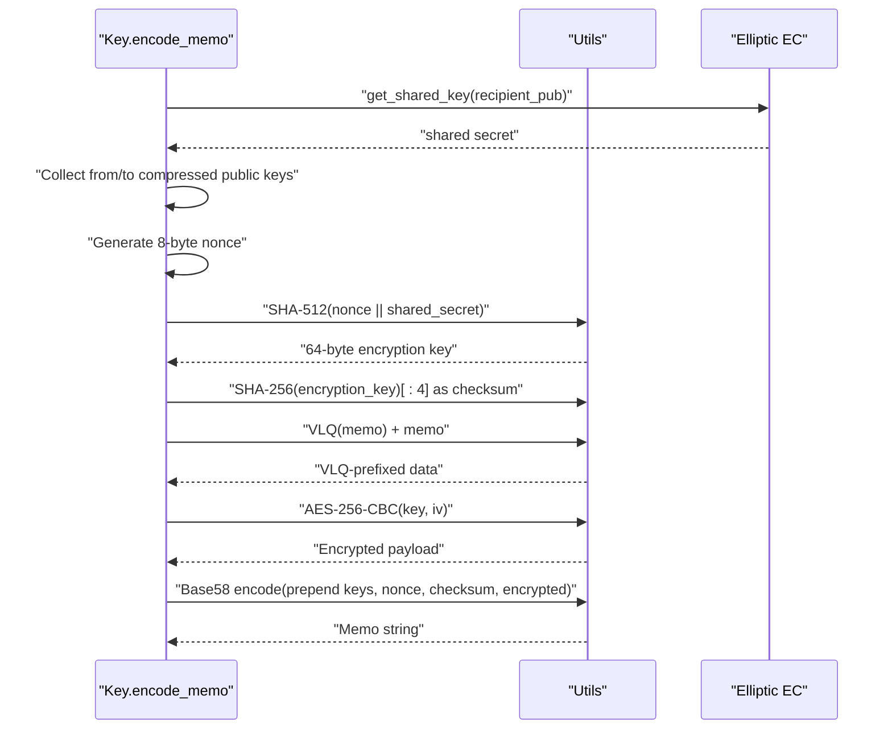
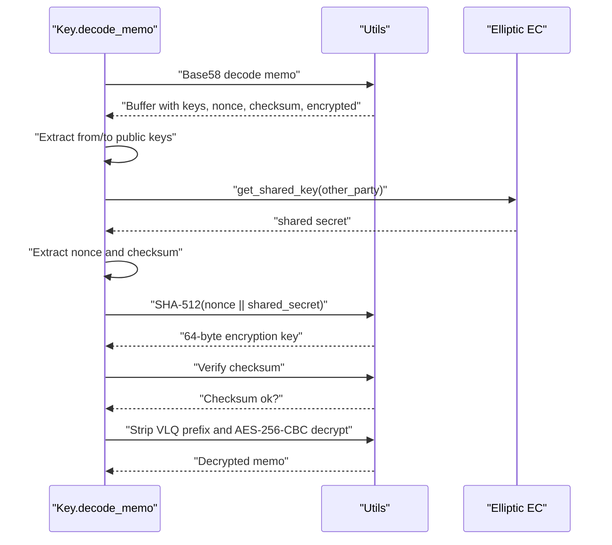
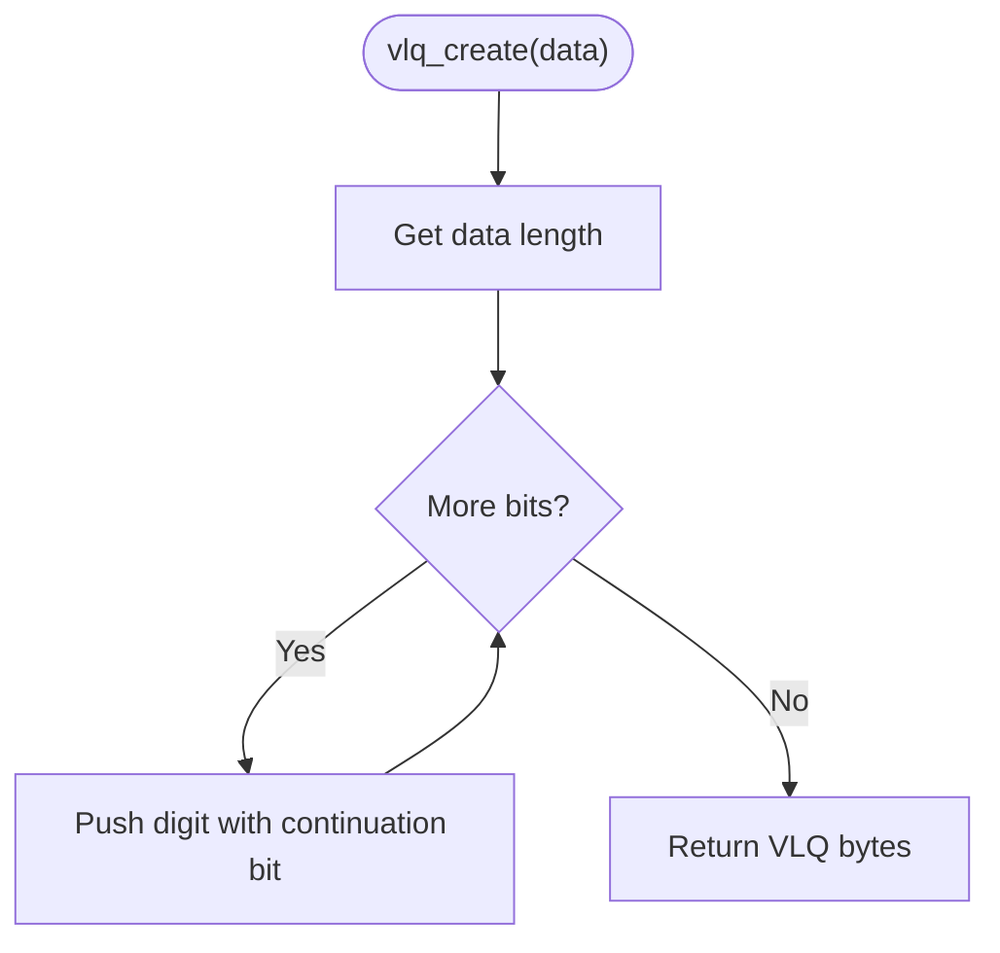
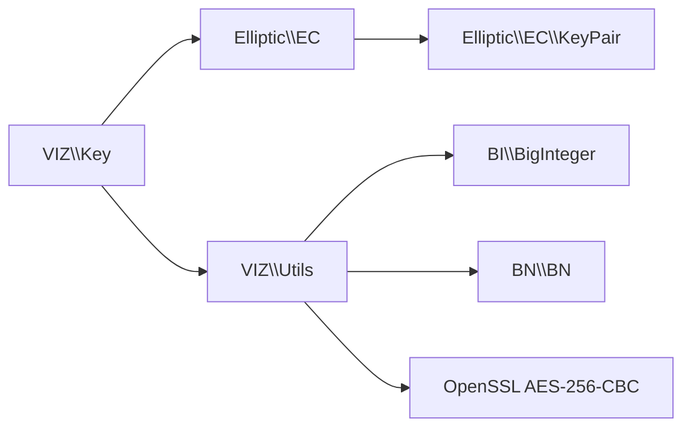

# Memo Encryption and Decryption

<cite>
**Referenced Files in This Document**
- [README.md](file://README.md)
- [composer.json](file://composer.json)
- [class/autoloader.php](file://class/autoloader.php)
- [class/VIZ/Key.php](file://class/VIZ/Key.php)
- [class/VIZ/Utils.php](file://class/VIZ/Utils.php)
- [class/Elliptic/EC.php](file://class/Elliptic/EC.php)
- [class/Elliptic/EC/KeyPair.php](file://class/Elliptic/EC/KeyPair.php)
- [class/BI/BigInteger.php](file://class/BI/BigInteger.php)
- [class/BN/BN.php](file://class/BN/BN.php)
</cite>

## Table of Contents
1. [Introduction](#introduction)
2. [Project Structure](#project-structure)
3. [Core Components](#core-components)
4. [Architecture Overview](#architecture-overview)
5. [Detailed Component Analysis](#detailed-component-analysis)
6. [Dependency Analysis](#dependency-analysis)
7. [Performance Considerations](#performance-considerations)
8. [Troubleshooting Guide](#troubleshooting-guide)
9. [Conclusion](#conclusion)
10. [Appendices](#appendices)

## Introduction
This document explains the memo encryption and decryption system used in VIZ blockchain messaging. It covers the Elliptic Curve Diffie-Hellman (ECDH) key exchange for deriving shared secrets, AES-256-CBC encryption and decryption, and the complete memo encoding/decoding workflow. It also documents shared key derivation via get_shared_key(), nonce generation and handling, checksum validation, and Variable-Length Quantity (VLQ) encoding for variable-length data. Practical examples, cross-language compatibility notes, and troubleshooting guidance are included.

## Project Structure
The library is organized around cryptographic primitives and VIZ-specific utilities:
- VIZ namespace: Key, Utils, Transaction, Auth, JsonRPC
- Elliptic: EC, EC.KeyPair, curves and helpers
- BI/BN: Arbitrary precision arithmetic for big integers and field arithmetic
- Autoloader and Composer configuration enable PSR-4 loading

**Diagram sources**
- [class/VIZ/Key.php](file://class/VIZ/Key.php#L1-L353)
- [class/VIZ/Utils.php](file://class/VIZ/Utils.php#L1-L413)
- [class/Elliptic/EC.php](file://class/Elliptic/EC.php#L1-L272)
- [class/Elliptic/EC/KeyPair.php](file://class/Elliptic/EC/KeyPair.php#L1-L138)
- [class/BI/BigInteger.php](file://class/BI/BigInteger.php#L1-L634)
- [class/BN/BN.php](file://class/BN/BN.php#L1-L765)
- [class/autoloader.php](file://class/autoloader.php#L1-L14)
- [composer.json](file://composer.json#L1-L32)

**Section sources**
- [README.md](file://README.md#L1-L455)
- [composer.json](file://composer.json#L1-L32)
- [class/autoloader.php](file://class/autoloader.php#L1-L14)

## Core Components
- Key: Implements ECDH shared secret derivation, memo encoding, and memo decoding. Uses secp256k1 via Elliptic/EC and Elliptic/EC/KeyPair.
- Utils: Provides AES-256-CBC encrypt/decrypt, Base58 encode/decode, and VLQ encoding/decoding utilities.
- Elliptic/EC and EC/KeyPair: Provide curve operations, key derivation, and signature primitives.
- BI/BigInteger and BN/BN: Provide arbitrary precision arithmetic used by elliptic math and Base58 conversions.

Key responsibilities:
- Shared secret derivation: get_shared_key()
- Memo encoding: encode_memo()
- Memo decoding: decode_memo()
- Encryption/decryption: aes_256_cbc_encrypt()/aes_256_cbc_decrypt()
- VLQ: vlq_create()/vlq_extract()/vlq_calculate()

**Section sources**
- [class/VIZ/Key.php](file://class/VIZ/Key.php#L33-L176)
- [class/VIZ/Utils.php](file://class/VIZ/Utils.php#L291-L383)
- [class/Elliptic/EC.php](file://class/Elliptic/EC.php#L46-L52)
- [class/Elliptic/EC/KeyPair.php](file://class/Elliptic/EC/KeyPair.php#L116-L119)
- [class/BI/BigInteger.php](file://class/BI/BigInteger.php#L1-L634)
- [class/BN/BN.php](file://class/BN/BN.php#L1-L765)

## Architecture Overview
The memo encryption pipeline:
- Sender derives a shared secret using ECDH with recipient’s public key and sender’s private key.
- A random 8-byte nonce is generated and combined with the shared secret to produce a 64-byte encryption key via SHA-512.
- A 4-byte checksum is derived from the encryption key using SHA-256 and stored with the memo.
- The memo text is VLQ-encoded with its own length prefix, then AES-256-CBC encrypted using the first 32 bytes as the key and next 16 bytes as the IV.
- The resulting ciphertext is prefixed with the sender’s and recipient’s public keys (compressed, 33 bytes each), the nonce, and the checksum, then Base58-encoded.

**Diagram sources**
- [class/VIZ/Key.php](file://class/VIZ/Key.php#L33-L86)
- [class/VIZ/Utils.php](file://class/VIZ/Utils.php#L291-L320)
- [class/Elliptic/EC.php](file://class/Elliptic/EC.php#L46-L52)

## Detailed Component Analysis

### ECDH Shared Secret Derivation
- Purpose: Derive a shared secret between two parties using secp256k1.
- Implementation:
  - Private key is imported and represented as an EC key pair.
  - Public key is parsed from encoded form.
  - KeyPair.derive(public) multiplies the private scalar with the public point, returning an x-coordinate.
  - The x-coordinate is hashed with SHA-512 to produce a 64-byte shared secret.

**Diagram sources**
- [class/VIZ/Key.php](file://class/VIZ/Key.php#L33-L44)
- [class/Elliptic/EC/KeyPair.php](file://class/Elliptic/EC/KeyPair.php#L116-L119)
- [class/Elliptic/EC.php](file://class/Elliptic/EC.php#L46-L52)

**Section sources**
- [class/VIZ/Key.php](file://class/VIZ/Key.php#L33-L44)
- [class/Elliptic/EC/KeyPair.php](file://class/Elliptic/EC/KeyPair.php#L116-L119)
- [class/Elliptic/EC.php](file://class/Elliptic/EC.php#L46-L52)

### AES-256-CBC Encryption and Decryption
- Encryption:
  - Accepts raw binary data, key (32 bytes), and optional IV (16 bytes).
  - If no IV is provided, a random IV is generated.
  - Returns either a packed hex string (when IV preset) or an object with iv and data fields.
- Decryption:
  - Requires explicit IV; returns decrypted plaintext or false on failure.

**Diagram sources**
- [class/VIZ/Utils.php](file://class/VIZ/Utils.php#L291-L320)

**Section sources**
- [class/VIZ/Utils.php](file://class/VIZ/Utils.php#L291-L320)

### Memo Encoding Workflow
- Inputs:
  - Recipient’s public key (encoded).
  - Memo text.
- Steps:
  1. Derive shared secret using get_shared_key().
  2. Capture current sender’s public key (compressed, 33 bytes) and recipient’s public key (compressed, 33 bytes).
  3. Generate 8-byte nonce and compute encryption key via SHA-512(nonce || shared_secret).
  4. Compute 4-byte checksum as SHA-256(encryption_key)[:4].
  5. Split encryption_key into 32-byte key and 16-byte IV.
  6. VLQ-encode memo text with its own length prefix.
  7. Encrypt VLQ(memo) + memo using AES-256-CBC.
  8. Prepend sender public key, recipient public key, nonce, checksum, and VLQ-prefixed ciphertext.
  9. Base58-encode the entire buffer.

**Diagram sources**
- [class/VIZ/Key.php](file://class/VIZ/Key.php#L45-L86)
- [class/VIZ/Utils.php](file://class/VIZ/Utils.php#L291-L320)
- [class/VIZ/Utils.php](file://class/VIZ/Utils.php#L322-L341)

**Section sources**
- [class/VIZ/Key.php](file://class/VIZ/Key.php#L45-L86)
- [class/VIZ/Utils.php](file://class/VIZ/Utils.php#L322-L341)

### Memo Decoding Workflow
- Inputs:
  - Encoded memo string.
- Steps:
  1. Base58-decode the memo to reconstruct the buffer.
  2. Extract sender and recipient public keys (33 bytes each).
  3. Determine current user’s public key and compute shared secret accordingly.
  4. Extract 8-byte nonce and 4-byte checksum.
  5. Compute encryption key as SHA-512(nonce || shared_secret) and derive key/IV.
  6. Verify checksum against SHA-256(encryption_key)[:4].
  7. Strip VLQ prefix from ciphertext and decrypt with AES-256-CBC.
  8. Return decrypted memo text.

**Diagram sources**
- [class/VIZ/Key.php](file://class/VIZ/Key.php#L87-L176)
- [class/VIZ/Utils.php](file://class/VIZ/Utils.php#L313-L320)
- [class/VIZ/Utils.php](file://class/VIZ/Utils.php#L322-L341)

**Section sources**
- [class/VIZ/Key.php](file://class/VIZ/Key.php#L87-L176)
- [class/VIZ/Utils.php](file://class/VIZ/Utils.php#L313-L320)
- [class/VIZ/Utils.php](file://class/VIZ/Utils.php#L322-L341)

### VLQ (Variable-Length Quantity) Encoding
- Purpose: Prefix variable-length data with a VLQ-encoded length, enabling safe parsing.
- Implementation:
  - vlq_create(): Computes digits using 7-bit chunks with continuation bits.
  - vlq_extract(): Parses digits until a chunk lacks continuation bit.
  - vlq_calculate(): Reconstructs original length from VLQ digits.

**Diagram sources**
- [class/VIZ/Utils.php](file://class/VIZ/Utils.php#L322-L341)

**Section sources**
- [class/VIZ/Utils.php](file://class/VIZ/Utils.php#L322-L341)

### Nonce Generation and Handling
- Nonce is a random 8-byte value generated per memo.
- It is concatenated with the shared secret before hashing to derive the encryption key.
- During decoding, the nonce is extracted and used to recompute the encryption key and verify the checksum.

**Section sources**
- [class/VIZ/Key.php](file://class/VIZ/Key.php#L62-L64)
- [class/VIZ/Key.php](file://class/VIZ/Key.php#L115-L119)
- [class/VIZ/Key.php](file://class/VIZ/Key.php#L144-L146)

### Checksum Validation
- A 4-byte checksum is computed as the first 4 bytes of SHA-256 of the encryption key.
- During decoding, the checksum is recomputed and compared to the stored value; mismatch results in rejection.

**Section sources**
- [class/VIZ/Key.php](file://class/VIZ/Key.php#L63-L65)
- [class/VIZ/Key.php](file://class/VIZ/Key.php#L148-L150)
- [class/VIZ/Key.php](file://class/VIZ/Key.php#L152-L153)

### Practical Examples
- End-to-end memo encryption and decryption:
  - Generate two key pairs.
  - Derive shared secrets from each side.
  - Encrypt memo using AES-256-CBC with derived keys.
  - Encode memo with encode_memo() and decode with decode_memo().
- Handling different key combinations:
  - Use either party’s private key to derive the shared secret; the system detects the correct direction during decoding.
- Cross-language compatibility:
  - The memo structure is compatible with the JavaScript implementation referenced in the code comments.

For runnable examples and expected outcomes, refer to the example usage in the repository README.

**Section sources**
- [README.md](file://README.md#L164-L205)
- [class/VIZ/Key.php](file://class/VIZ/Key.php#L180-L205)

## Dependency Analysis
- Key depends on Elliptic/EC and Elliptic/EC/KeyPair for ECDH and public key operations.
- Utils depends on BI/BigInteger and BN/BN for Base58 conversions and VLQ calculations.
- OpenSSL is used for AES-256-CBC operations.

**Diagram sources**
- [class/VIZ/Key.php](file://class/VIZ/Key.php#L1-L353)
- [class/VIZ/Utils.php](file://class/VIZ/Utils.php#L1-L413)
- [class/Elliptic/EC.php](file://class/Elliptic/EC.php#L1-L272)
- [class/Elliptic/EC/KeyPair.php](file://class/Elliptic/EC/KeyPair.php#L1-L138)
- [class/BI/BigInteger.php](file://class/BI/BigInteger.php#L1-L634)
- [class/BN/BN.php](file://class/BN/BN.php#L1-L765)

**Section sources**
- [class/VIZ/Key.php](file://class/VIZ/Key.php#L1-L353)
- [class/VIZ/Utils.php](file://class/VIZ/Utils.php#L1-L413)
- [class/Elliptic/EC.php](file://class/Elliptic/EC.php#L1-L272)
- [class/Elliptic/EC/KeyPair.php](file://class/Elliptic/EC/KeyPair.php#L1-L138)
- [class/BI/BigInteger.php](file://class/BI/BigInteger.php#L1-L634)
- [class/BN/BN.php](file://class/BN/BN.php#L1-L765)

## Performance Considerations
- ECDH and SHA-512/SHA-256 are constant-time per operation; overall cost is dominated by AES-256-CBC encryption/decryption.
- VLQ overhead is minimal and proportional to memo length.
- Base58 encoding adds negligible overhead compared to cryptographic operations.
- For bulk operations, reuse precomputed public keys and avoid repeated Base58 conversions.

[No sources needed since this section provides general guidance]

## Troubleshooting Guide
Common issues and resolutions:
- Decryption fails:
  - Verify the correct private key is used for decoding.
  - Ensure the memo string is intact and not truncated.
  - Confirm checksum verification passes.
- Wrong recipient:
  - The system automatically selects the correct shared secret depending on whether the current user’s public key matches the memo’s “from” or “to” field.
- AES errors:
  - Ensure the IV is correctly handled; decoding requires the exact IV used during encryption.
  - Confirm the key length is 32 bytes and IV length is 16 bytes.
- VLQ mismatches:
  - Ensure the VLQ prefix is stripped before decryption and reconstructed after encryption.

**Section sources**
- [class/VIZ/Key.php](file://class/VIZ/Key.php#L106-L113)
- [class/VIZ/Key.php](file://class/VIZ/Key.php#L152-L153)
- [class/VIZ/Utils.php](file://class/VIZ/Utils.php#L313-L320)

## Conclusion
The VIZ memo encryption system combines ECDH-derived shared secrets, AES-256-CBC, VLQ-encoded lengths, and Base58 encoding to deliver secure, interoperable messaging. The provided components in this library implement the full workflow and are compatible with the referenced JavaScript counterpart.

[No sources needed since this section summarizes without analyzing specific files]

## Appendices

### JavaScript Compatibility and Interoperability Notes
- The memo structure follows the same format as the JavaScript library referenced in the code comments.
- Ensure identical handling of:
  - ECDH shared secret derivation using secp256k1.
  - SHA-512 for key derivation and SHA-256 for checksum.
  - AES-256-CBC with PKCS#7 padding.
  - VLQ length prefixes.
  - Base58 encoding/decoding.

**Section sources**
- [class/VIZ/Key.php](file://class/VIZ/Key.php#L57-L58)