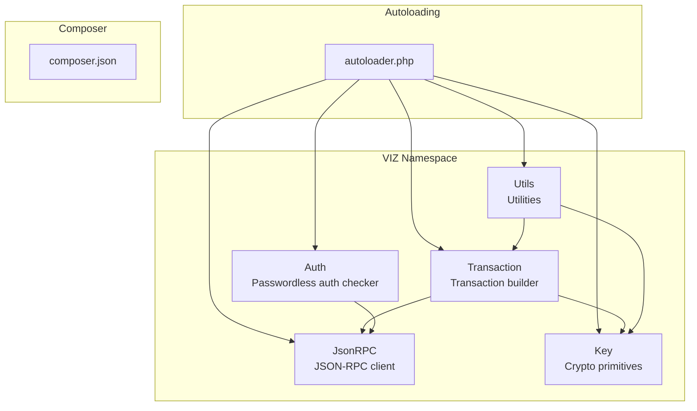
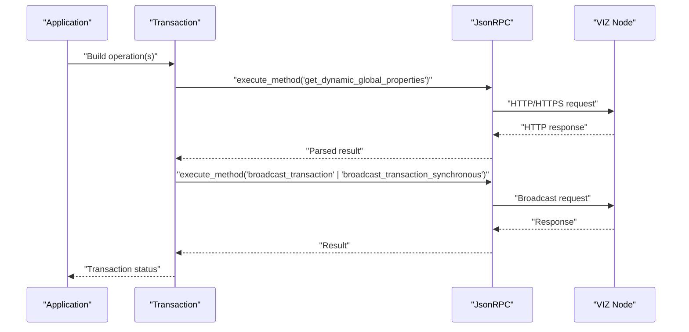
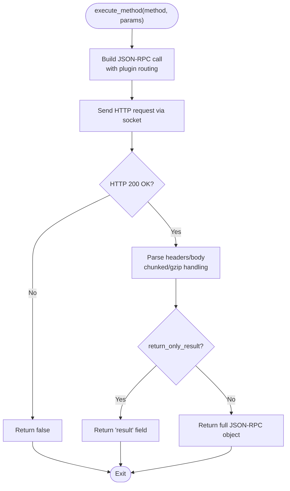
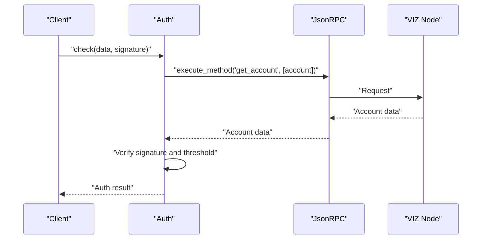
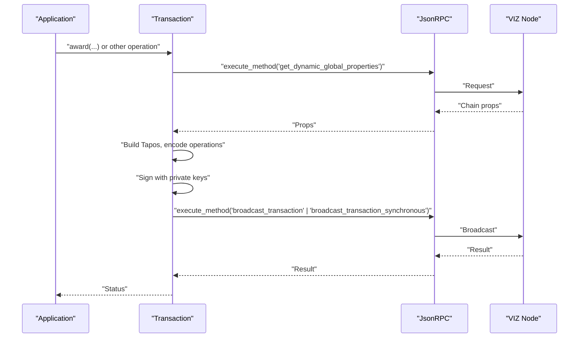
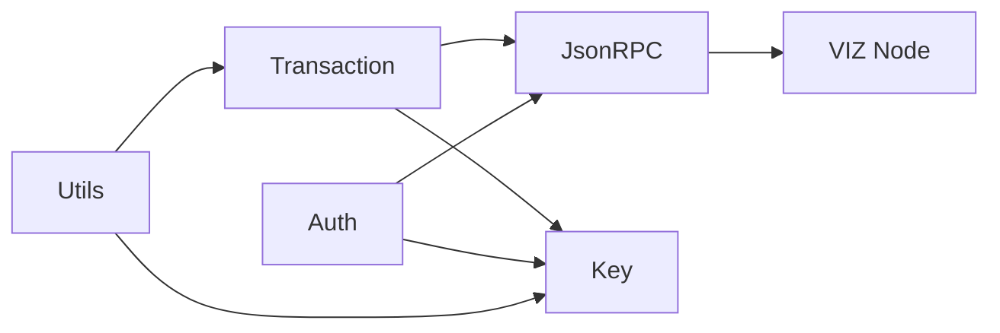

# Node Communication

<cite>
**Referenced Files in This Document**
- [JsonRPC.php](file://class/VIZ/JsonRPC.php)
- [Auth.php](file://class/VIZ/Auth.php)
- [Transaction.php](file://class/VIZ/Transaction.php)
- [Key.php](file://class/VIZ/Key.php)
- [Utils.php](file://class/VIZ/Utils.php)
- [autoloader.php](file://class/autoloader.php)
- [README.md](file://README.md)
- [composer.json](file://composer.json)
</cite>

## Table of Contents
1. [Introduction](#introduction)
2. [Project Structure](#project-structure)
3. [Core Components](#core-components)
4. [Architecture Overview](#architecture-overview)
5. [Detailed Component Analysis](#detailed-component-analysis)
6. [Dependency Analysis](#dependency-analysis)
7. [Performance Considerations](#performance-considerations)
8. [Troubleshooting Guide](#troubleshooting-guide)
9. [Conclusion](#conclusion)
10. [Appendices](#appendices)

## Introduction
This document explains the Node Communication subsystem implemented in the library, focusing on the JSON-RPC client used to communicate with VIZ blockchain nodes. It covers connection management, method execution, plugin routing, response parsing, endpoint configuration, SSL/TLS support, timeouts, error handling, and integration patterns with VIZ nodes. Practical examples and performance optimization techniques are included, along with troubleshooting guidance for common network connectivity issues.

## Project Structure
The Node Communication layer centers around the JSON-RPC client and its integration with higher-level components such as authentication and transaction builders. The library follows a namespace-based structure under VIZ and includes a simple autoloader for class discovery.

**Diagram sources**
- [JsonRPC.php](file://class/VIZ/JsonRPC.php#L1-L354)
- [Transaction.php](file://class/VIZ/Transaction.php#L1-L24)
- [Auth.php](file://class/VIZ/Auth.php#L1-L70)
- [Key.php](file://class/VIZ/Key.php#L1-L353)
- [Utils.php](file://class/VIZ/Utils.php#L1-L413)
- [autoloader.php](file://class/autoloader.php#L1-L14)
- [composer.json](file://composer.json#L1-L32)

**Section sources**
- [README.md](file://README.md#L1-L455)
- [composer.json](file://composer.json#L1-L32)
- [autoloader.php](file://class/autoloader.php#L1-L14)

## Core Components
- JSON-RPC Client: Low-level HTTP/HTTPS socket client that builds and sends JSON-RPC 2.0 requests to VIZ nodes, parses responses, and manages timeouts and SSL/TLS.
- Plugin Routing: A mapping of API method names to plugin namespaces used by the node’s RPC router.
- Authentication Helper: Validates passwordless authentication signatures against on-chain account authorities.
- Transaction Builder: Uses the JSON-RPC client to fetch chain data and broadcast signed transactions.

Key capabilities:
- Endpoint configuration via URL (HTTP/HTTPS/WSS).
- SSL/TLS verification toggles.
- Request/response parsing with chunked transfer decoding and gzip decompression.
- Timeout control and debug logging.
- Automatic header management and optional gzip compression.

**Section sources**
- [JsonRPC.php](file://class/VIZ/JsonRPC.php#L1-L354)
- [Auth.php](file://class/VIZ/Auth.php#L1-L70)
- [Transaction.php](file://class/VIZ/Transaction.php#L1-L24)

## Architecture Overview
The JSON-RPC client encapsulates all transport logic and exposes a simple method execution interface. Higher-level components rely on it for chain interactions.

**Diagram sources**
- [Transaction.php](file://class/VIZ/Transaction.php#L53-L60)
- [JsonRPC.php](file://class/VIZ/JsonRPC.php#L311-L353)

## Detailed Component Analysis

### JSON-RPC Client
Responsibilities:
- Endpoint configuration and URL parsing.
- SSL/TLS negotiation and peer verification controls.
- Request construction and response parsing.
- Timeout enforcement and redirect handling.
- Plugin routing via method-to-plugin mapping.

Key behaviors:
- Endpoint selection: Supports http://, https://, and wss:// URLs. Port resolution and SSL socket prefixing handled automatically.
- Header management: Host, Content-Type, Connection, optional gzip encoding, and custom headers.
- Request building: JSON-RPC 2.0 call with params ["plugin", "method", [args]].
- Response parsing: Splits headers and body, handles chunked transfer and gzip, validates HTTP status.
- Error handling: Returns false on socket errors, timeouts, or non-200 responses; supports extended mode to return full JSON-RPC envelope.

Configuration and runtime flags:
- Endpoint URL.
- Debug mode for request/response capture.
- Header overrides.
- Accept gzip responses.
- SSL verification toggle.
- Read timeout in seconds.
- Result-only vs full JSON-RPC response mode.

Plugin routing:
- A private mapping associates API method names to plugin namespaces. This enables automatic routing to the correct node plugin without manual specification.

Timeout and retries:
- Socket connect timeout is controlled by stream context creation.
- Read timeout is enforced during socket reads.
- No automatic retry logic is implemented in the client.

**Diagram sources**
- [JsonRPC.php](file://class/VIZ/JsonRPC.php#L258-L353)

**Section sources**
- [JsonRPC.php](file://class/VIZ/JsonRPC.php#L1-L354)

### Plugin Routing Mechanism
The client maintains a method-to-plugin mapping that defines how API calls are routed to node plugins. This mapping is internal and ensures correct plugin invocation without requiring explicit plugin names from callers.

Examples of mapped methods:
- Database API: get_block, get_account, get_dynamic_global_properties, etc.
- Network Broadcast API: broadcast_transaction, broadcast_transaction_synchronous.
- Account History API: get_account_history.
- Witness API: get_active_witnesses, get_witness_schedule.
- Invite API: get_invite_by_id, get_invites_list.
- Paid Subscription API: get_paid_subscriptions.
- Operation History API: get_ops_in_block, get_transaction.
- Committee API: get_committee_request, get_committee_requests_list.
- Custom Protocol API: get_account.

This mechanism simplifies API usage by abstracting plugin selection.

**Section sources**
- [JsonRPC.php](file://class/VIZ/JsonRPC.php#L29-L121)

### Authentication Integration
The Auth helper uses the JSON-RPC client to fetch account data and validate signatures against on-chain authorities. It checks domain/action/authority/time window and verifies signature weight thresholds.

**Diagram sources**
- [Auth.php](file://class/VIZ/Auth.php#L25-L69)
- [JsonRPC.php](file://class/VIZ/JsonRPC.php#L311-L353)

**Section sources**
- [Auth.php](file://class/VIZ/Auth.php#L1-L70)

### Transaction Builder Integration
The Transaction builder composes operations, fetches chain props (e.g., dynamic global properties), constructs Tapos references, signs transactions, and broadcasts them via the JSON-RPC client.

**Diagram sources**
- [Transaction.php](file://class/VIZ/Transaction.php#L53-L60)
- [JsonRPC.php](file://class/VIZ/JsonRPC.php#L311-L353)

**Section sources**
- [Transaction.php](file://class/VIZ/Transaction.php#L1-L24)

## Dependency Analysis
- JsonRPC depends on PHP streams for socket I/O and basic HTTP parsing.
- Transaction depends on JsonRPC, Key, and Utils for cryptographic operations and encoding.
- Auth depends on JsonRPC and Key for signature recovery and account authority checks.
- Utils provides helpers for Voice protocol posts and encryption utilities.

**Diagram sources**
- [JsonRPC.php](file://class/VIZ/JsonRPC.php#L1-L354)
- [Transaction.php](file://class/VIZ/Transaction.php#L1-L24)
- [Auth.php](file://class/VIZ/Auth.php#L1-L70)
- [Key.php](file://class/VIZ/Key.php#L1-L353)
- [Utils.php](file://class/VIZ/Utils.php#L1-L413)

**Section sources**
- [JsonRPC.php](file://class/VIZ/JsonRPC.php#L1-L354)
- [Transaction.php](file://class/VIZ/Transaction.php#L1-L24)
- [Auth.php](file://class/VIZ/Auth.php#L1-L70)
- [Key.php](file://class/VIZ/Key.php#L1-L353)
- [Utils.php](file://class/VIZ/Utils.php#L1-L413)

## Performance Considerations
- Connection reuse: The client caches DNS lookups per host to reduce repeated DNS resolution overhead.
- Compression: Enabling gzip can reduce payload sizes for large responses.
- Chunked transfer: The client handles chunked responses transparently.
- Timeouts: Tune read_timeout to balance responsiveness and reliability for your environment.
- Batch operations: Use the Transaction queue mode to combine multiple operations into a single broadcast, reducing round trips.

[No sources needed since this section provides general guidance]

## Troubleshooting Guide
Common issues and resolutions:
- SSL/TLS verification failures: Disable peer verification only for testing; enable strict verification in production.
- Socket timeouts: Increase read_timeout or switch to a closer node endpoint.
- Non-200 responses: Inspect HTTP headers and server status; ensure endpoint URL is correct.
- Redirects: The client follows Location headers automatically; verify final URL resolves.
- Gzip decoding: Ensure server supports gzip; otherwise disable accept_gzip.
- Method not found: Verify the method exists in the plugin mapping and the node exposes the corresponding plugin.

Operational tips:
- Enable debug mode to capture raw requests and responses.
- Validate endpoint URLs (http/https/wss) and ports.
- Confirm firewall and network policies allow outbound connections to the node.

**Section sources**
- [JsonRPC.php](file://class/VIZ/JsonRPC.php#L122-L257)
- [JsonRPC.php](file://class/VIZ/JsonRPC.php#L311-L353)

## Conclusion
The Node Communication layer provides a robust, low-level JSON-RPC client tailored for VIZ blockchain integration. It abstracts transport details, enforces secure defaults, and integrates cleanly with higher-level components for authentication and transaction broadcasting. By leveraging the plugin routing mechanism and following the performance and troubleshooting guidance, applications can reliably interact with VIZ nodes.

[No sources needed since this section summarizes without analyzing specific files]

## Appendices

### Practical Examples
- Initialize JSON-RPC client and fetch dynamic global properties.
- Switch endpoints dynamically and retrieve account data.
- Execute a transaction with synchronous broadcast.
- Use the Auth helper for passwordless authentication checks.

Refer to the examples in the repository documentation for working code samples.

**Section sources**
- [README.md](file://README.md#L69-L95)
- [README.md](file://README.md#L97-L135)
- [README.md](file://README.md#L207-L222)

### Endpoint Configuration and SSL/TLS
- Endpoint URL: Supports http://, https://, and wss://.
- SSL verification: Controlled via a flag; can be disabled for testing.
- Port handling: Defaults to 80 for http, 443 for https/wss; custom ports supported.

**Section sources**
- [JsonRPC.php](file://class/VIZ/JsonRPC.php#L175-L187)
- [JsonRPC.php](file://class/VIZ/JsonRPC.php#L189-L195)

### Timeout Management
- Connect timeout: Controlled by stream context creation.
- Read timeout: Enforced during socket reads; configurable via a property.

**Section sources**
- [JsonRPC.php](file://class/VIZ/JsonRPC.php#L196-L197)
- [JsonRPC.php](file://class/VIZ/JsonRPC.php#L199-L205)

### Error Handling Strategies
- Socket errors and timeouts: Return false; inspect debug logs for details.
- Non-200 HTTP status: Return false; parse headers for diagnostics.
- JSON-RPC errors: In extended mode, full JSON-RPC envelope is returned for inspection.

**Section sources**
- [JsonRPC.php](file://class/VIZ/JsonRPC.php#L214-L217)
- [JsonRPC.php](file://class/VIZ/JsonRPC.php#L332-L347)