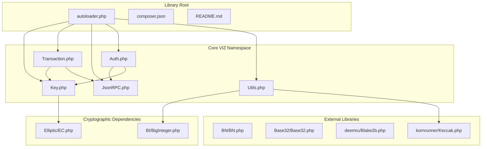
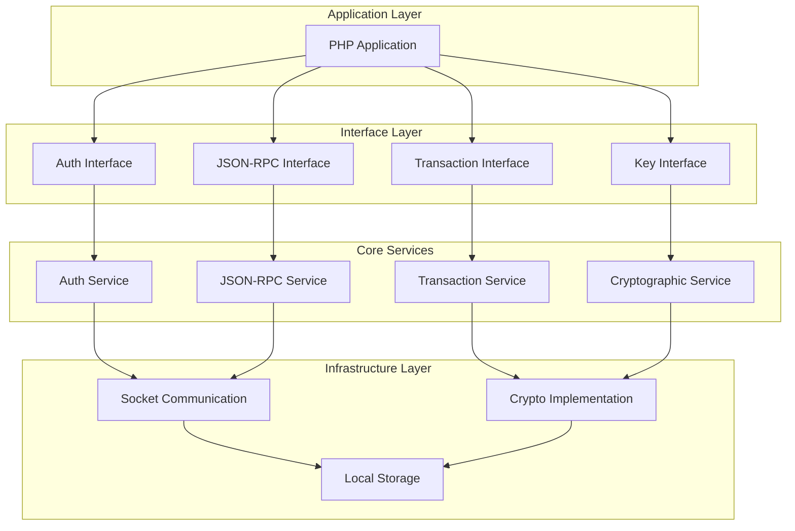
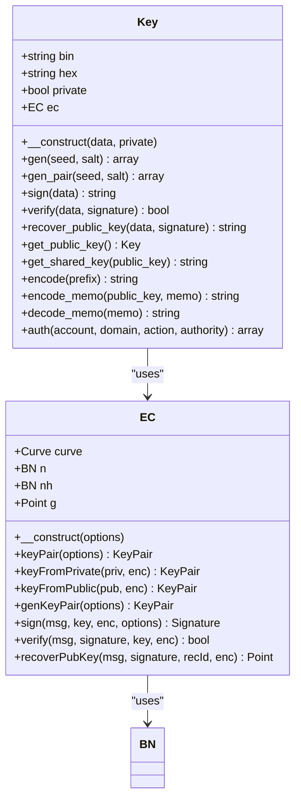
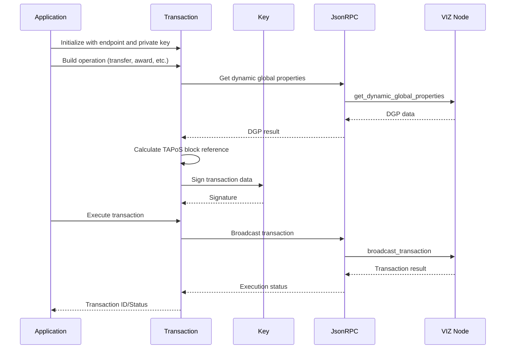
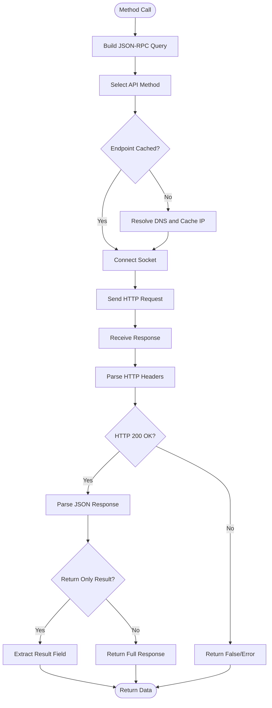
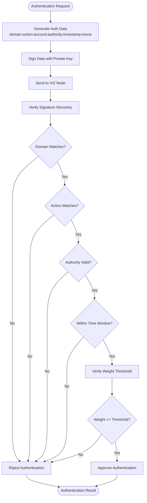
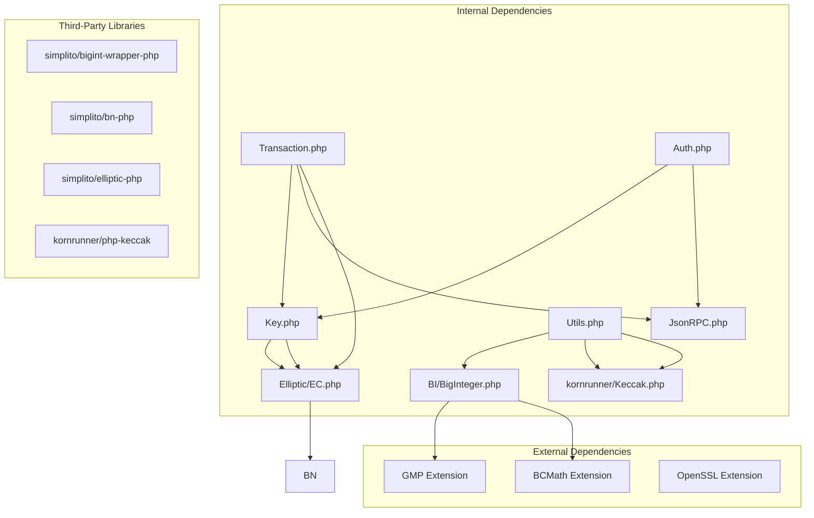

# Project Overview

<cite>
**Referenced Files in This Document**
- [README.md](file://README.md)
- [composer.json](file://composer.json)
- [class/VIZ/Auth.php](file://class/VIZ/Auth.php)
- [class/VIZ/JsonRPC.php](file://class/VIZ/JsonRPC.php)
- [class/VIZ/Transaction.php](file://class/VIZ/Transaction.php)
- [class/VIZ/Key.php](file://class/VIZ/Key.php)
- [class/VIZ/Utils.php](file://class/VIZ/Utils.php)
- [class/autoloader.php](file://class/autoloader.php)
- [class/Elliptic/EC.php](file://class/Elliptic/EC.php)
- [class/BI/BigInteger.php](file://class/BI/BigInteger.php)
</cite>

## Table of Contents
1. [Introduction](#introduction)
2. [Project Structure](#project-structure)
3. [Core Components](#core-components)
4. [Architecture Overview](#architecture-overview)
5. [Detailed Component Analysis](#detailed-component-analysis)
6. [Dependency Analysis](#dependency-analysis)
7. [Performance Considerations](#performance-considerations)
8. [Troubleshooting Guide](#troubleshooting-guide)
9. [Conclusion](#conclusion)

## Introduction

The VIZ PHP Library is a comprehensive native PHP implementation designed to enable seamless interaction with the VIZ blockchain ecosystem. This library serves as a complete toolkit for developers seeking to integrate VIZ blockchain functionality into PHP applications, providing native cryptographic operations, transaction building capabilities, JSON-RPC communication, and a robust authentication system.

The library's primary purpose is to bridge the gap between PHP applications and the VIZ blockchain by offering a unified interface for blockchain operations. It supports all 38 standard VIZ operations, enabling everything from basic transfers to complex multi-signature transactions and specialized operations like account creation and witness voting.

## Project Structure

The VIZ PHP Library follows a modular architecture organized around core blockchain interaction components:

**Diagram sources**
- [class/autoloader.php](file://class/autoloader.php#L1-L14)
- [composer.json](file://composer.json#L19-L29)

**Section sources**
- [README.md](file://README.md#L1-L455)
- [composer.json](file://composer.json#L1-L32)

## Core Components

The VIZ PHP Library consists of five fundamental components that work together to provide comprehensive blockchain interaction capabilities:

### Cryptographic Operations (Key Management)
The Key class provides complete cryptographic functionality including private/public key generation, WIF encoding/decoding, signature creation and verification, and public key recovery. It supports multiple key formats and includes advanced features like shared key derivation for encrypted messaging.

### Transaction Building System
The Transaction class handles the complete lifecycle of blockchain transactions, from construction through signing and broadcasting. It manages TAPoS (Transaction as Proof of Stake) block references, expiration handling, multi-signature support, and queue-based operation batching.

### JSON-RPC Communication Layer
The JsonRPC class implements native socket-based communication with VIZ nodes, supporting all API methods, SSL/TLS connections, hostname caching, and comprehensive error handling. It provides both simplified and extended result modes for different use cases.

### Authentication Framework
The Auth class enables passwordless authentication through domain-based authorization, supporting multi-authority validation and configurable time windows for security.

### Utility Functions
The Utils class offers specialized functions for Voice protocol integration, encryption/decryption operations, address generation for multiple blockchain networks, and various cryptographic helpers.

**Section sources**
- [class/VIZ/Key.php](file://class/VIZ/Key.php#L1-L353)
- [class/VIZ/Transaction.php](file://class/VIZ/Transaction.php#L1-L800)
- [class/VIZ/JsonRPC.php](file://class/VIZ/JsonRPC.php#L1-L354)
- [class/VIZ/Auth.php](file://class/VIZ/Auth.php#L1-L70)
- [class/VIZ/Utils.php](file://class/VIZ/Utils.php#L1-L413)

## Architecture Overview

The VIZ PHP Library implements a layered architecture that separates concerns while maintaining tight integration between components:

**Diagram sources**
- [class/VIZ/Auth.php](file://class/VIZ/Auth.php#L9-L24)
- [class/VIZ/JsonRPC.php](file://class/VIZ/JsonRPC.php#L4-L22)
- [class/VIZ/Transaction.php](file://class/VIZ/Transaction.php#L10-L24)
- [class/VIZ/Key.php](file://class/VIZ/Key.php#L9-L16)

The architecture philosophy centers on:

- **Modularity**: Each component has a single responsibility and can be used independently
- **Extensibility**: New operations and authentication methods can be easily added
- **Performance**: Native PHP implementation minimizes overhead compared to external dependencies
- **Security**: Comprehensive cryptographic operations with proper key management
- **Compatibility**: PSR-4 autoloading and standardized interfaces

## Detailed Component Analysis

### Cryptographic Operations Analysis

The Key class implements a sophisticated cryptographic system built on the secp256k1 elliptic curve:

**Diagram sources**
- [class/VIZ/Key.php](file://class/VIZ/Key.php#L9-L353)
- [class/Elliptic/EC.php](file://class/Elliptic/EC.php#L9-L200)

The cryptographic system supports:
- Private/public key pair generation with deterministic seeds
- WIF (Wallet Import Format) encoding/decoding
- ECDSA signatures with canonical form compliance
- Public key recovery from signatures
- Shared key derivation for encrypted messaging
- Multi-chain address compatibility (Bitcoin, Ethereum, Tron)

**Section sources**
- [class/VIZ/Key.php](file://class/VIZ/Key.php#L1-L353)
- [class/Elliptic/EC.php](file://class/Elliptic/EC.php#L1-L200)

### Transaction Building Workflow

The Transaction class provides a comprehensive framework for constructing and executing blockchain operations:

**Diagram sources**
- [class/VIZ/Transaction.php](file://class/VIZ/Transaction.php#L61-L157)
- [class/VIZ/JsonRPC.php](file://class/VIZ/JsonRPC.php#L311-L353)

The transaction system features:
- Automatic TAPoS block reference calculation
- Multi-signature support with flexible authority structures
- Queue-based operation batching for atomic transactions
- Comprehensive operation coverage (38 standard operations)
- Extension point for custom operations
- Synchronous and asynchronous execution modes

**Section sources**
- [class/VIZ/Transaction.php](file://class/VIZ/Transaction.php#L1-L800)

### JSON-RPC Communication Architecture

The JsonRPC class implements a native socket-based communication layer:

**Diagram sources**
- [class/VIZ/JsonRPC.php](file://class/VIZ/JsonRPC.php#L122-L353)

Key communication features:
- Native socket implementation without cURL dependencies
- Automatic API method routing to appropriate plugin endpoints
- SSL/TLS support with certificate verification
- Hostname caching for improved performance
- Comprehensive error handling and timeout management
- Both simplified and extended result modes

**Section sources**
- [class/VIZ/JsonRPC.php](file://class/VIZ/JsonRPC.php#L1-L354)

### Authentication System Design

The Auth class provides passwordless authentication through domain-based authorization:

**Diagram sources**
- [class/VIZ/Auth.php](file://class/VIZ/Auth.php#L25-L69)

The authentication system supports:
- Configurable time windows for security
- Multi-authority validation (active, regular, master)
- Domain-based authorization scopes
- Server timezone offset handling
- Flexible authority structure validation

**Section sources**
- [class/VIZ/Auth.php](file://class/VIZ/Auth.php#L1-L70)

## Dependency Analysis

The VIZ PHP Library maintains minimal external dependencies while leveraging essential cryptographic primitives:

**Diagram sources**
- [class/VIZ/Key.php](file://class/VIZ/Key.php#L6-L8)
- [class/VIZ/Transaction.php](file://class/VIZ/Transaction.php#L4-L8)
- [class/VIZ/JsonRPC.php](file://class/VIZ/JsonRPC.php#L1-L10)
- [class/VIZ/Utils.php](file://class/VIZ/Utils.php#L4-L5)

The dependency strategy emphasizes:
- **Minimal external dependencies**: Only essential PHP extensions (GMP/BCMath)
- **Self-contained cryptography**: Modified third-party libraries integrated directly
- **Performance optimization**: Native implementations where possible
- **Flexibility**: Support for multiple backend cryptographic libraries

**Section sources**
- [README.md](file://README.md#L20-L35)
- [composer.json](file://composer.json#L19-L31)

## Performance Considerations

The VIZ PHP Library is optimized for performance through several key strategies:

### Memory Management
- Efficient binary data handling using packed structures
- Minimal object instantiation during cryptographic operations
- Optimized buffer management for large transactions

### Network Optimization
- DNS hostname caching to reduce resolution overhead
- Persistent connection patterns where beneficial
- Chunked transfer decoding for large responses

### Cryptographic Efficiency
- Native PHP implementations with optimized algorithms
- Minimal memory allocation during key operations
- Efficient big integer arithmetic using GMP/BCMath backends

### Caching Strategies
- Endpoint and IP address caching for repeated requests
- Operation result caching for frequently accessed data
- Transaction signature caching for multi-signature scenarios

## Troubleshooting Guide

### Common Issues and Solutions

**Cryptographic Backend Issues**
- **Problem**: BigInteger initialization failures
- **Solution**: Ensure either GMP or BCMath PHP extensions are installed and enabled
- **Verification**: Check PHP configuration for required extensions

**Network Connectivity Problems**
- **Problem**: Socket connection timeouts or SSL certificate errors
- **Solution**: Verify network connectivity and SSL certificate configuration
- **Debugging**: Enable debug mode in JsonRPC class for detailed logging

**Transaction Broadcasting Failures**
- **Problem**: Transactions rejected by nodes
- **Solution**: Verify TAPoS block references and expiration times
- **Validation**: Check authority structures and weight thresholds

**Authentication Verification Errors**
- **Problem**: Passwordless authentication failures
- **Solution**: Verify domain configuration and time synchronization
- **Troubleshooting**: Check authority weight threshold compliance

### Debugging Tools

The library provides comprehensive debugging capabilities:
- Detailed request/response logging in JsonRPC class
- Step-by-step transaction construction tracing
- Cryptographic operation verification points
- Network communication diagnostics

**Section sources**
- [class/VIZ/JsonRPC.php](file://class/VIZ/JsonRPC.php#L17-L22)
- [class/VIZ/Transaction.php](file://class/VIZ/Transaction.php#L61-L157)
- [class/VIZ/Auth.php](file://class/VIZ/Auth.php#L16-L24)

## Conclusion

The VIZ PHP Library represents a comprehensive solution for integrating VIZ blockchain functionality into PHP applications. Its native implementation, combined with robust cryptographic operations and extensive API coverage, makes it an ideal choice for developers building blockchain-powered applications.

The library's architecture emphasizes modularity, performance, and security while maintaining ease of use through PSR-4 autoloading and intuitive interfaces. Its support for all 38 standard VIZ operations, combined with specialized features like Voice protocol integration and multi-signature support, positions it as a complete toolkit for blockchain development.

Key strengths include:
- **Native PHP Implementation**: No external process dependencies
- **Comprehensive Coverage**: All standard VIZ operations supported
- **Robust Security**: Industry-standard cryptographic implementations
- **Flexible Architecture**: Modular design enabling selective usage
- **Production Ready**: Extensive testing and real-world deployment experience

The library serves as a cornerstone for the VIZ ecosystem, enabling PHP developers to participate in the decentralized future while maintaining the reliability and performance expectations of enterprise-grade applications.