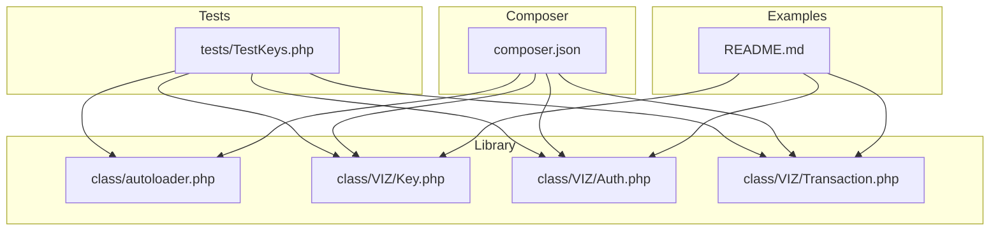
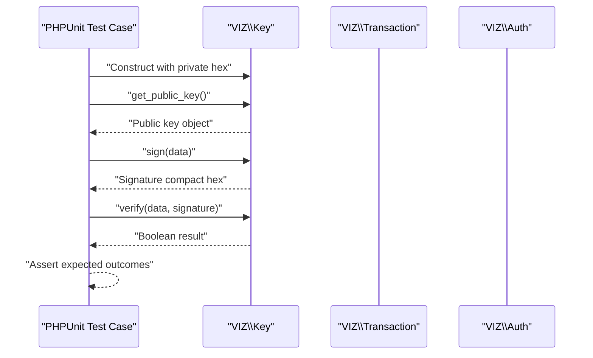
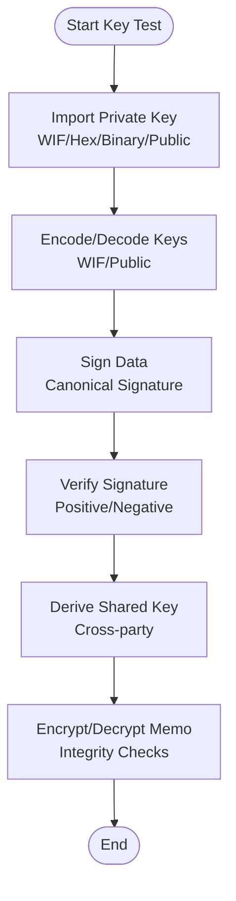
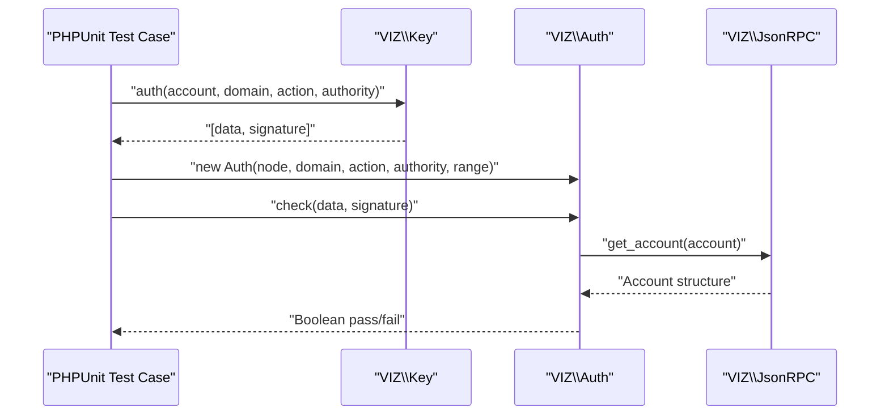
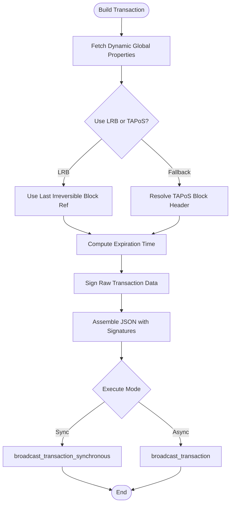
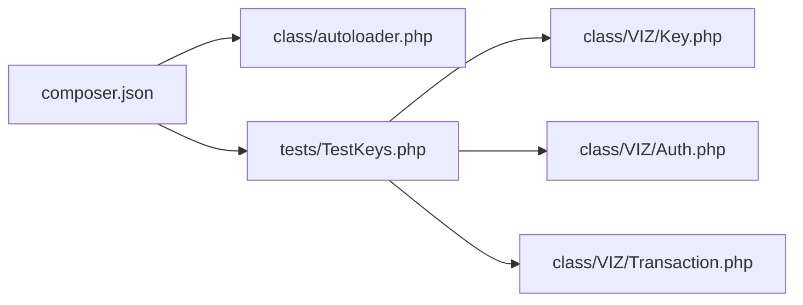

# Testing and Quality Assurance

<cite>
**Referenced Files in This Document**
- [README.md](file://README.md)
- [composer.json](file://composer.json)
- [class/autoloader.php](file://class/autoloader.php)
- [tests/TestKeys.php](file://tests/TestKeys.php)
- [class/VIZ/Key.php](file://class/VIZ/Key.php)
- [class/VIZ/Auth.php](file://class/VIZ/Auth.php)
- [class/VIZ/Transaction.php](file://class/VIZ/Transaction.php)
</cite>

## Table of Contents
1. [Introduction](#introduction)
2. [Project Structure](#project-structure)
3. [Core Components](#core-components)
4. [Architecture Overview](#architecture-overview)
5. [Detailed Component Analysis](#detailed-component-analysis)
6. [Dependency Analysis](#dependency-analysis)
7. [Performance Considerations](#performance-considerations)
8. [Troubleshooting Guide](#troubleshooting-guide)
9. [Conclusion](#conclusion)
10. [Appendices](#appendices)

## Introduction
This document describes the Testing and Quality Assurance practices for the project. It covers the current unit testing framework, recommended testing methodologies for cryptographic keys, authentication, transactions, and integration-like checks against remote nodes, and provides guidance for extending the test suite, writing effective tests, and maintaining quality standards. The repository currently includes a small but focused unit test suite and demonstrates practical usage patterns for key generation, signing, verification, and transaction building.

## Project Structure
The testing-related assets and core components are organized as follows:
- Tests: located under tests/TestKeys.php, using PHPUnit via Composer autoload.
- Core library: under class/, with namespaces VIZ, BN, BI, Elliptic.
- Autoloading: class autoloader.php registers classmap-based loading; composer.json configures PSR-4 and classmap autoload.
- Examples and usage: README.md provides runnable examples for keys, JSON-RPC, and transactions.

**Diagram sources**
- [tests/TestKeys.php](file://tests/TestKeys.php#L1-L29)
- [class/autoloader.php](file://class/autoloader.php#L1-L14)
- [composer.json](file://composer.json#L19-L31)
- [README.md](file://README.md#L42-L111)

**Section sources**
- [tests/TestKeys.php](file://tests/TestKeys.php#L1-L29)
- [class/autoloader.php](file://class/autoloader.php#L1-L14)
- [composer.json](file://composer.json#L19-L31)
- [README.md](file://README.md#L42-L111)

## Core Components
- Unit testing framework: PHPUnit-based tests under tests/. The existing suite validates key derivation and signature verification.
- Cryptographic primitives: VIZ/Key provides key import, encoding, signing, verification, and authentication data generation.
- Authentication verification: VIZ/Auth performs passwordless authentication checks against blockchain authority structures.
- Transaction lifecycle: VIZ/Transaction builds operations, constructs transactions, signs with private keys, and executes via JSON-RPC.

Recommended testing focus areas:
- Key operations: import, export, encoding/decoding, signing, verification, shared key derivation, memo encryption/decryption.
- Authentication: domain/action/authority/time window validation and authority threshold checks.
- Transactions: TAPoS resolution, expiration handling, multi-signature assembly, broadcast outcomes.
- Integration: remote node connectivity and response parsing for transaction execution.

**Section sources**
- [tests/TestKeys.php](file://tests/TestKeys.php#L7-L28)
- [class/VIZ/Key.php](file://class/VIZ/Key.php#L9-L353)
- [class/VIZ/Auth.php](file://class/VIZ/Auth.php#L9-L70)
- [class/VIZ/Transaction.php](file://class/VIZ/Transaction.php#L10-L157)

## Architecture Overview
The test suite interacts with the library components to validate correctness and resilience. The flow below illustrates how a typical unit test invokes library classes and asserts outcomes.

**Diagram sources**
- [tests/TestKeys.php](file://tests/TestKeys.php#L9-L27)
- [class/VIZ/Key.php](file://class/VIZ/Key.php#L268-L322)

## Detailed Component Analysis

### Unit Testing Framework and Organization
- Test class layout: tests/TestKeys.php extends the PHPUnit TestCase base class and includes the autoloader.
- Test methods:
  - Public key derivation from private key and assertion of expected encoded public key.
  - Signature creation and verification, including negative verification with altered data.
- Execution: PHPUnit discovers and runs tests via Composer autoload configuration.

Best practices derived from the current setup:
- Use deterministic fixtures (known private keys and expected outputs) for reproducibility.
- Separate concerns: keep cryptographic assertions in dedicated test methods.
- Leverage strict typing and explicit assertions for clarity.

**Section sources**
- [tests/TestKeys.php](file://tests/TestKeys.php#L7-L28)
- [class/autoloader.php](file://class/autoloader.php#L1-L14)

### Key Operations Testing
Focus areas:
- Import/export: WIF decoding, hex import, binary import, public key import.
- Encoding/decoding: WIF encoding, public key encoding with prefixes.
- Signing and verification: canonical signatures, signature recovery.
- Shared key and memo encryption/decryption: cross-key compatibility and integrity checks.

Recommended test cases:
- Import known WIF and verify decoded hex and public key.
- Encode a generated key and verify against expected WIF/public string.
- Sign arbitrary data and verify with original public key; fail with altered data.
- Derive shared key between two parties and derive compatible memo encryption keys.
- Encrypt and decrypt memo between paired keys; validate checksums and lengths.

**Diagram sources**
- [class/VIZ/Key.php](file://class/VIZ/Key.php#L185-L210)
- [class/VIZ/Key.php](file://class/VIZ/Key.php#L287-L301)
- [class/VIZ/Key.php](file://class/VIZ/Key.php#L302-L322)
- [class/VIZ/Key.php](file://class/VIZ/Key.php#L33-L44)
- [class/VIZ/Key.php](file://class/VIZ/Key.php#L45-L86)
- [class/VIZ/Key.php](file://class/VIZ/Key.php#L87-L176)

**Section sources**
- [class/VIZ/Key.php](file://class/VIZ/Key.php#L185-L210)
- [class/VIZ/Key.php](file://class/VIZ/Key.php#L287-L301)
- [class/VIZ/Key.php](file://class/VIZ/Key.php#L302-L322)
- [class/VIZ/Key.php](file://class/VIZ/Key.php#L33-L44)
- [class/VIZ/Key.php](file://class/VIZ/Key.php#L45-L86)
- [class/VIZ/Key.php](file://class/VIZ/Key.php#L87-L176)

### Authentication Verification Testing
Focus areas:
- Data construction: domain, action, account, authority, timestamp, nonce.
- Signature generation and recovery.
- Authority threshold validation against blockchain account structure.
- Time window validation and timezone handling.

Recommended test cases:
- Generate authentication data and signature; verify recovery of public key.
- Validate acceptance within acceptable time range and rejection outside range.
- Confirm authority threshold met for recovered key weights.
- Reject invalid domains/actions/authorities or mismatched account names.

**Diagram sources**
- [class/VIZ/Key.php](file://class/VIZ/Key.php#L339-L352)
- [class/VIZ/Auth.php](file://class/VIZ/Auth.php#L17-L24)
- [class/VIZ/Auth.php](file://class/VIZ/Auth.php#L25-L69)

**Section sources**
- [class/VIZ/Key.php](file://class/VIZ/Key.php#L339-L352)
- [class/VIZ/Auth.php](file://class/VIZ/Auth.php#L17-L69)

### Transaction Testing
Focus areas:
- TAPoS block selection and reference number/prefix computation.
- Expiration time encoding and timezone handling.
- Operation building and raw serialization.
- Multi-signature assembly and signature concatenation.
- Broadcast execution and synchronous/asynchronous modes.

Recommended test cases:
- Build a single operation transaction and assert JSON structure and signature count.
- Queue multiple operations and verify aggregated JSON and raw data.
- Add additional signatures to partially signed transactions.
- Execute transactions via broadcast endpoints and assert outcomes.

**Diagram sources**
- [class/VIZ/Transaction.php](file://class/VIZ/Transaction.php#L61-L157)
- [class/VIZ/Transaction.php](file://class/VIZ/Transaction.php#L158-L190)
- [class/VIZ/Transaction.php](file://class/VIZ/Transaction.php#L53-L60)

**Section sources**
- [class/VIZ/Transaction.php](file://class/VIZ/Transaction.php#L61-L157)
- [class/VIZ/Transaction.php](file://class/VIZ/Transaction.php#L158-L190)
- [class/VIZ/Transaction.php](file://class/VIZ/Transaction.php#L53-L60)

### Integration Testing Guidelines
While the repository does not include dedicated integration tests, practical integration-style checks can be performed using the examples in README.md:
- JSON-RPC connectivity and method execution.
- Transaction broadcasting and result interpretation.
- Authentication verification against live nodes.

Guidelines:
- Use stable testnet or public endpoints for integration checks.
- Validate response shapes and error handling for missing resources.
- Parameterize endpoints and credentials for reproducible runs.

**Section sources**
- [README.md](file://README.md#L71-L95)
- [README.md](file://README.md#L97-L135)
- [README.md](file://README.md#L207-L222)

## Dependency Analysis
The test suite depends on:
- PHPUnit via Composer autoload.
- VIZ classes for key, authentication, and transaction logic.
- Autoloader for class discovery.

**Diagram sources**
- [composer.json](file://composer.json#L19-L31)
- [class/autoloader.php](file://class/autoloader.php#L1-L14)
- [tests/TestKeys.php](file://tests/TestKeys.php#L1-L6)

**Section sources**
- [composer.json](file://composer.json#L19-L31)
- [class/autoloader.php](file://class/autoloader.php#L1-L14)
- [tests/TestKeys.php](file://tests/TestKeys.php#L1-L6)

## Performance Considerations
- Avoid repeated expensive operations in tight loops (e.g., repeated signing or hashing).
- Use deterministic inputs for reproducible performance baselines.
- Prefer batched operations where applicable (e.g., queueing multiple operations).
- Minimize network calls in unit tests; stub or mock JSON-RPC when measuring pure logic performance.

## Troubleshooting Guide
Common issues and resolutions:
- Missing dependencies: Ensure GMP or BCMath PHP extensions are enabled as noted in README.md.
- Autoloader failures: Confirm classmap registration and namespace alignment.
- Signature canonicalization: Some curves require canonical signatures; retry signing with incremented nonce if necessary.
- Authentication timeouts: Account for server timezone offsets and adjust ranges accordingly.

**Section sources**
- [README.md](file://README.md#L20-L28)
- [class/autoloader.php](file://class/autoloader.php#L1-L14)
- [class/VIZ/Key.php](file://class/VIZ/Key.php#L302-L311)
- [class/VIZ/Auth.php](file://class/VIZ/Auth.php#L28-L31)

## Conclusion
The project’s current testing foundation is concise yet practical, focusing on cryptographic correctness and basic integration patterns. Extending the suite should emphasize comprehensive key and transaction scenarios, robust authentication validation, and controlled integration checks against remote nodes. Adopting the recommended practices will improve reliability, maintainability, and confidence in the library.

## Appendices

### Best Practices Checklist
- Use deterministic fixtures and explicit assertions.
- Mock external dependencies (JSON-RPC) for unit tests.
- Validate error paths and boundary conditions.
- Keep tests isolated and fast; reserve integration tests for selected scenarios.
- Maintain clear separation between setup, execution, and assertion phases.

### Recommended Test Coverage Areas
- Key import/export and encoding/decoding.
- Signing and verification with canonical signatures.
- Shared key derivation and memo encryption/decryption.
- Authentication data generation and verification.
- Transaction building, signing, and execution.
- Edge cases: invalid inputs, malformed signatures, missing authorities.