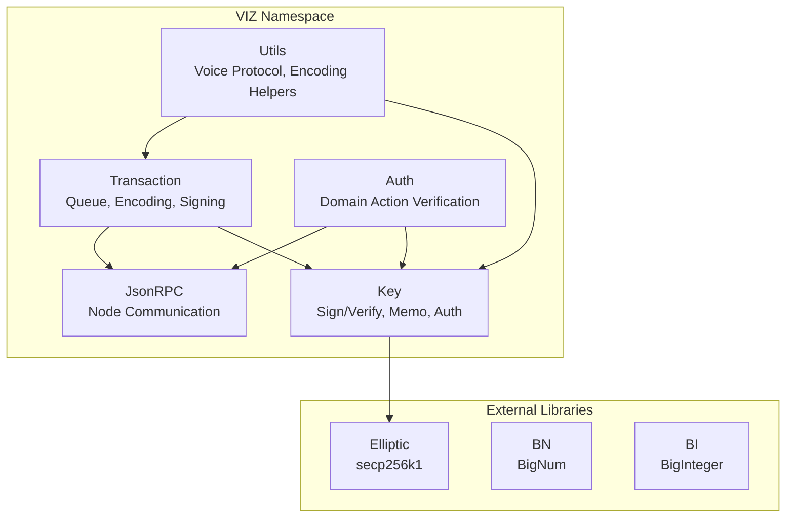
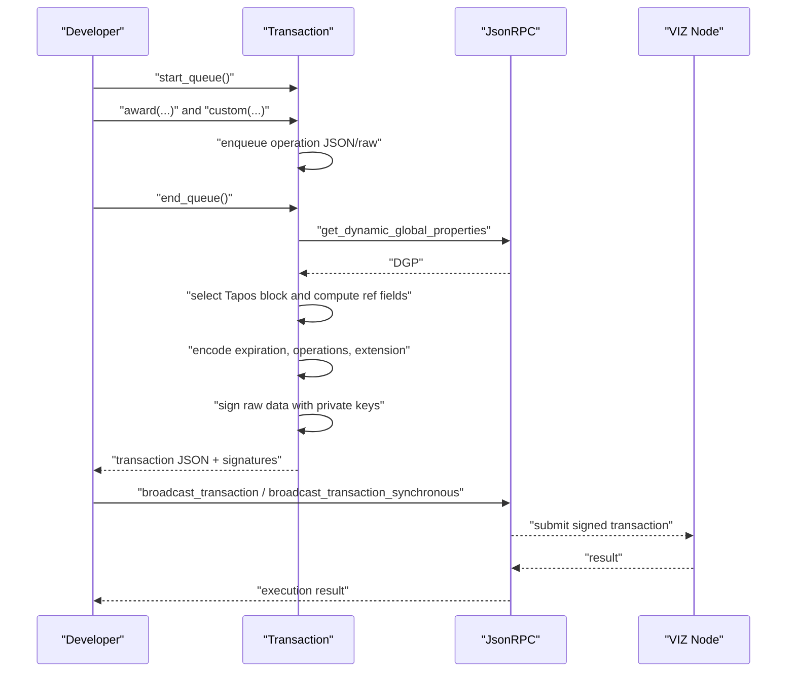
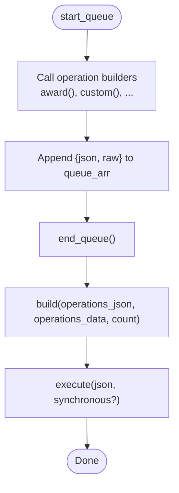
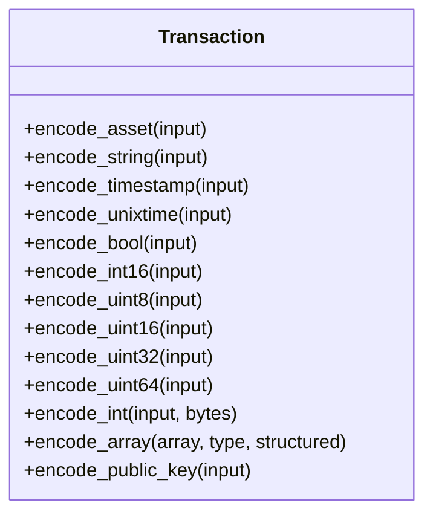
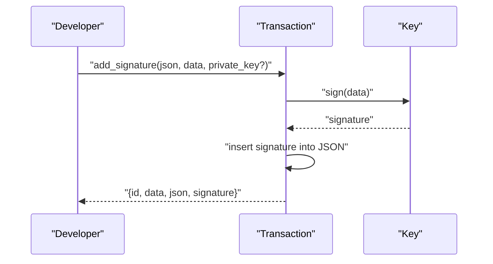
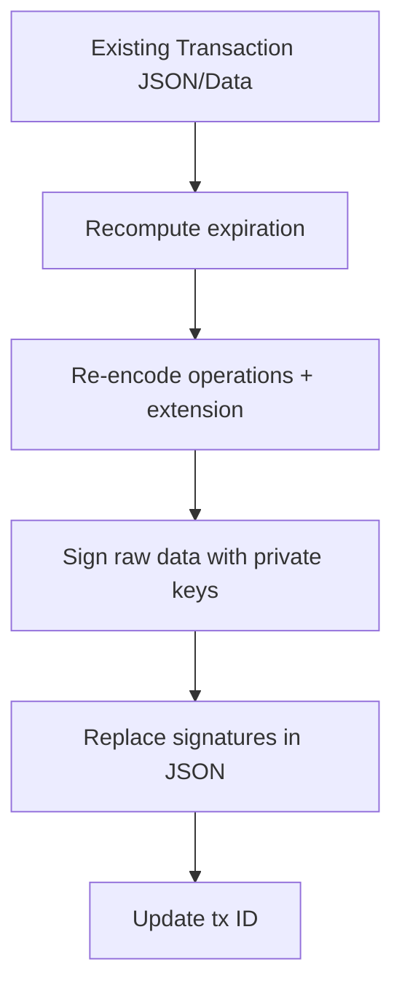
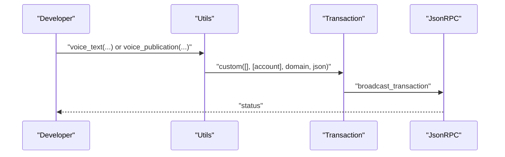
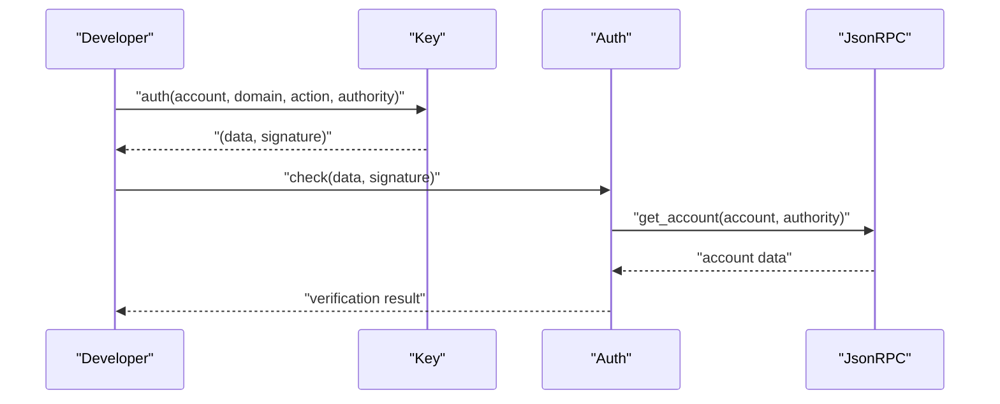
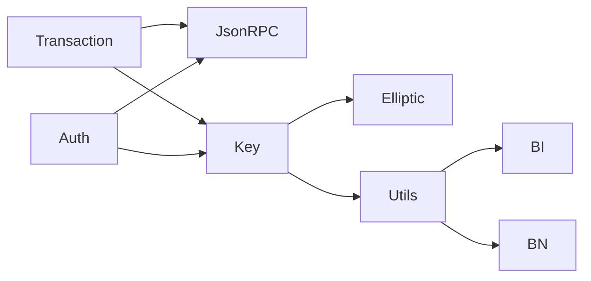

# Advanced Features

<cite>
**Referenced Files in This Document**
- [Transaction.php](file://class/VIZ/Transaction.php)
- [Key.php](file://class/VIZ/Key.php)
- [Utils.php](file://class/VIZ/Utils.php)
- [Auth.php](file://class/VIZ/Auth.php)
- [JsonRPC.php](file://class/VIZ/JsonRPC.php)
- [README.md](file://README.md)
- [composer.json](file://composer.json)
- [autoloader.php](file://class/autoloader.php)
</cite>

## Table of Contents
1. [Introduction](#introduction)
2. [Project Structure](#project-structure)
3. [Core Components](#core-components)
4. [Architecture Overview](#architecture-overview)
5. [Detailed Component Analysis](#detailed-component-analysis)
6. [Dependency Analysis](#dependency-analysis)
7. [Performance Considerations](#performance-considerations)
8. [Troubleshooting Guide](#troubleshooting-guide)
9. [Conclusion](#conclusion)
10. [Appendices](#appendices)

## Introduction
This document explains advanced transaction features implemented in the VIZ PHP library, focusing on queue-based processing, multi-operation transactions, raw data manipulation, signature addition, and extension fields. It also covers advanced encoding formats, custom extensions, and integration patterns for complex blockchain interactions. The goal is to enable developers to assemble, batch, sign, and broadcast sophisticated transactions while leveraging extensibility points such as custom operations and memo encryption.

## Project Structure
The library is organized around four primary namespaces:
- VIZ: cryptographic keys, transactions, JSON-RPC client, and utilities
- BN: big number arithmetic
- BI: big integer wrappers
- Elliptic: elliptic curve cryptography

**Diagram sources**
- [Transaction.php](file://class/VIZ/Transaction.php#L1-L1416)
- [Key.php](file://class/VIZ/Key.php#L1-L353)
- [Utils.php](file://class/VIZ/Utils.php#L1-L413)
- [Auth.php](file://class/VIZ/Auth.php#L1-L70)
- [JsonRPC.php](file://class/VIZ/JsonRPC.php#L1-L354)

**Section sources**
- [composer.json](file://composer.json#L19-L29)
- [autoloader.php](file://class/autoloader.php#L1-L14)

## Core Components
- Transaction: constructs, encodes, signs, and executes blockchain transactions; supports queueing multiple operations and adding signatures.
- Key: manages private/public keys, signatures, shared secrets, memo encryption/decryption, and authentication data generation.
- Utils: provides helpers for Voice protocol posts, memo encryption, variable-length quantity encoding, and address conversions.
- Auth: verifies domain-action-authenticated messages against account authorities.
- JsonRPC: low-level JSON-RPC client to interact with VIZ nodes.

**Section sources**
- [Transaction.php](file://class/VIZ/Transaction.php#L10-L24)
- [Key.php](file://class/VIZ/Key.php#L9-L32)
- [Utils.php](file://class/VIZ/Utils.php#L7-L10)
- [Auth.php](file://class/VIZ/Auth.php#L9-L24)
- [JsonRPC.php](file://class/VIZ/JsonRPC.php#L4-L22)

## Architecture Overview
The transaction lifecycle integrates queueing, encoding, signing, and broadcasting:

**Diagram sources**
- [Transaction.php](file://class/VIZ/Transaction.php#L42-L52)
- [Transaction.php](file://class/VIZ/Transaction.php#L1310-L1328)
- [Transaction.php](file://class/VIZ/Transaction.php#L61-L157)
- [JsonRPC.php](file://class/VIZ/JsonRPC.php#L311-L353)

## Detailed Component Analysis

### Queue-Based Processing and Multi-Operation Transactions
- Queue activation: start_queue toggles queue mode and collects operations via magic call routing.
- Operation collection: each operation call builds a JSON and raw payload and appends to an internal queue array.
- Batch assembly: end_queue concatenates queued operations into a single transaction and invokes build to finalize.

**Diagram sources**
- [Transaction.php](file://class/VIZ/Transaction.php#L42-L52)
- [Transaction.php](file://class/VIZ/Transaction.php#L1310-L1328)

**Section sources**
- [Transaction.php](file://class/VIZ/Transaction.php#L13-L24)
- [Transaction.php](file://class/VIZ/Transaction.php#L42-L52)
- [Transaction.php](file://class/VIZ/Transaction.php#L1310-L1328)
- [README.md](file://README.md#L113-L135)

### Raw Data Manipulation and Encoding Formats
- Encoding primitives: integers, booleans, timestamps, assets, strings, arrays, and public keys.
- Asset encoding: number, precision, and asset symbol bytes.
- VLQ encoding: used for variable-length strings in raw payloads.
- Extension field: currently a constant zero byte in transactions.

**Diagram sources**
- [Transaction.php](file://class/VIZ/Transaction.php#L1329-L1415)

**Section sources**
- [Transaction.php](file://class/VIZ/Transaction.php#L1329-L1415)
- [Utils.php](file://class/VIZ/Utils.php#L321-L382)

### Signature Addition Mechanisms
- Pre-built signature addition: add_signature injects a newly created signature into an existing transaction JSON and updates the transaction ID accordingly.
- Multi-signature support: build iteratively signs the same raw data with multiple private keys and aggregates signatures.

**Diagram sources**
- [Transaction.php](file://class/VIZ/Transaction.php#L158-L190)
- [Key.php](file://class/VIZ/Key.php#L302-L311)

**Section sources**
- [Transaction.php](file://class/VIZ/Transaction.php#L158-L190)
- [Key.php](file://class/VIZ/Key.php#L302-L311)

### Transaction Modification Techniques
- Re-signing: rebuild computes new expiration and re-signs the raw data with current private keys.
- Signature augmentation: add_signature augments an existing transaction without regenerating operations.
- Extension fields: build reserves an extension slot; currently set to a constant zero byte.

**Diagram sources**
- [Transaction.php](file://class/VIZ/Transaction.php#L61-L157)

**Section sources**
- [Transaction.php](file://class/VIZ/Transaction.php#L61-L157)
- [Transaction.php](file://class/VIZ/Transaction.php#L115-L116)

### Advanced Encoding Formats and Custom Extensions
- Asset encoding: encodes amount, precision, and asset symbol into a fixed-width raw field.
- String encoding: VLQ length-prefixed UTF-8 bytes.
- Arrays: count-prefixed sequences of encoded elements.
- Public keys: stored as hex strings for compactness.
- Extensions: reserved in operations and transactions; custom operations can leverage op extensions.

**Section sources**
- [Transaction.php](file://class/VIZ/Transaction.php#L1329-L1415)
- [Utils.php](file://class/VIZ/Utils.php#L321-L382)

### Integration Patterns for Complex Scenarios
- Batch processing: queue multiple operations and broadcast as one transaction.
- Custom operations: use custom to embed arbitrary JSON under a custom domain and required authorizations.
- Memo encryption: encode_memo/decode_memo for secure per-user messaging compatible with JS libraries.
- Voice protocol: Utils helpers to create Voice text/publication/event objects and manage long content via events.

**Diagram sources**
- [Utils.php](file://class/VIZ/Utils.php#L36-L73)
- [Utils.php](file://class/VIZ/Utils.php#L111-L148)
- [Utils.php](file://class/VIZ/Utils.php#L156-L208)
- [Transaction.php](file://class/VIZ/Transaction.php#L1061-L1085)

**Section sources**
- [Utils.php](file://class/VIZ/Utils.php#L36-L73)
- [Utils.php](file://class/VIZ/Utils.php#L111-L148)
- [Utils.php](file://class/VIZ/Utils.php#L156-L208)
- [Transaction.php](file://class/VIZ/Transaction.php#L1061-L1085)

### Authentication and Authorization
- Domain-action-authentication: Key.auth generates canonical data and signature for passwordless auth.
- Authority verification: Auth.check validates domain, action, authority, time window, and account authority weights.

**Diagram sources**
- [Key.php](file://class/VIZ/Key.php#L339-L352)
- [Auth.php](file://class/VIZ/Auth.php#L25-L69)

**Section sources**
- [Key.php](file://class/VIZ/Key.php#L339-L352)
- [Auth.php](file://class/VIZ/Auth.php#L25-L69)

## Dependency Analysis
- Transaction depends on JsonRPC for node queries, Key for signing, and Utils for encoding helpers.
- Key depends on Elliptic secp256k1 for EC operations and Utils for base58 and AES.
- Utils depends on BigInteger and Keccak for cross-chain compatibility and VLQ/AES helpers.
- Auth depends on JsonRPC and Key for verification.

**Diagram sources**
- [Transaction.php](file://class/VIZ/Transaction.php#L4-L8)
- [Key.php](file://class/VIZ/Key.php#L6-L7)
- [Utils.php](file://class/VIZ/Utils.php#L4-L5)
- [Auth.php](file://class/VIZ/Auth.php#L4-L7)

**Section sources**
- [composer.json](file://composer.json#L23-L28)

## Performance Considerations
- Queueing reduces network round-trips by batching operations into a single transaction.
- Canonical signature generation may retry until a valid signature is produced; batching minimizes repeated signing overhead.
- VLQ and binary encoding are efficient for raw payloads; avoid unnecessary conversions.
- Memo encryption/decryption adds CPU cost; use only when required.

## Troubleshooting Guide
- Queue mode not working: ensure start_queue is called before operation builders and end_queue is invoked afterward.
- Signature errors: verify private keys are set and canonical signature generation succeeds; use add_signature for multi-sig augmentation.
- Encoding mismatches: confirm asset precision and string lengths; ensure arrays are count-prefixed.
- Node timeouts: adjust JsonRPC read timeout and SSL verification flags if needed.
- Authority verification failures: check domain, action, authority, time range, and account authority thresholds.

**Section sources**
- [Transaction.php](file://class/VIZ/Transaction.php#L1310-L1328)
- [Transaction.php](file://class/VIZ/Transaction.php#L158-L190)
- [Transaction.php](file://class/VIZ/Transaction.php#L1329-L1415)
- [JsonRPC.php](file://class/VIZ/JsonRPC.php#L16-L22)
- [Auth.php](file://class/VIZ/Auth.php#L25-L69)

## Conclusion
The VIZ PHP library provides robust, extensible primitives for advanced transaction workflows. Queue-based batching, multi-signature support, raw data encoding, and custom operations enable complex, production-grade integrations. Combined with memo encryption and Voice protocol utilities, developers can build secure, scalable blockchain applications.

## Appendices

### Example Workflows from Documentation
- Multi-operation batch with synchronous execution and signature augmentation.
- Custom operation broadcasting with domain-scoped IDs.
- Account creation with flexible authority structures.
- Voice protocol long content splitting via add events.

**Section sources**
- [README.md](file://README.md#L113-L135)
- [README.md](file://README.md#L224-L239)
- [README.md](file://README.md#L241-L283)
- [README.md](file://README.md#L384-L453)