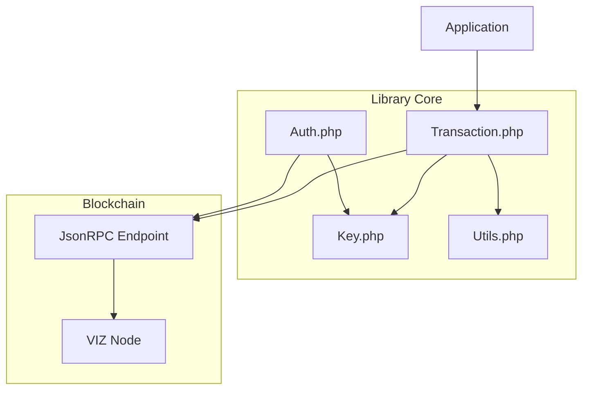
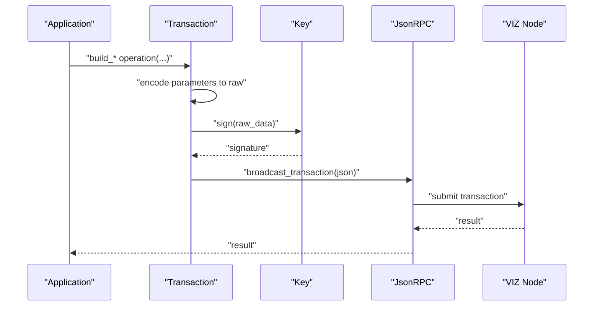
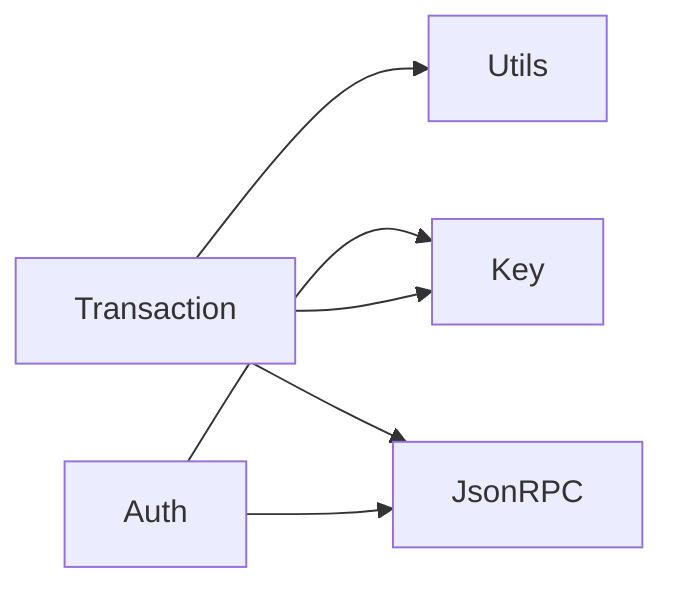

# Account Operations

<cite>
**Referenced Files in This Document**
- [README.md](file://README.md)
- [Transaction.php](file://class/VIZ/Transaction.php)
- [Auth.php](file://class/VIZ/Auth.php)
- [Key.php](file://class/VIZ/Key.php)
- [Utils.php](file://class/VIZ/Utils.php)
</cite>

## Table of Contents
1. [Introduction](#introduction)
2. [Project Structure](#project-structure)
3. [Core Components](#core-components)
4. [Architecture Overview](#architecture-overview)
5. [Detailed Component Analysis](#detailed-component-analysis)
6. [Dependency Analysis](#dependency-analysis)
7. [Performance Considerations](#performance-considerations)
8. [Troubleshooting Guide](#troubleshooting-guide)
9. [Conclusion](#conclusion)

## Introduction
This document explains account-related operations implemented in the library, focusing on account creation, updates, metadata management, recovery procedures, and witness voting. It covers required parameters, optional fields, JSON structure formats, and raw data encoding specifications. Practical examples demonstrate authority structures, multi-signature configurations, and recovery workflows. Parameter validation rules and data type requirements are derived from the implementation.

## Project Structure
The account operations are primarily implemented in the Transaction class, with auxiliary support from Key and Auth classes for cryptographic operations and verification. Utility functions assist with encoding and memo handling.

**Diagram sources**
- [Transaction.php](file://class/VIZ/Transaction.php#L1-L157)
- [Key.php](file://class/VIZ/Key.php#L1-L353)
- [Auth.php](file://class/VIZ/Auth.php#L1-L70)

**Section sources**
- [README.md](file://README.md#L1-L455)
- [Transaction.php](file://class/VIZ/Transaction.php#L1-L157)

## Core Components
- Transaction: Builds and signs account operations, encodes raw data, and executes transactions.
- Key: Manages private/public keys, signatures, and authentication helpers.
- Auth: Verifies passwordless authentication against blockchain authority thresholds.
- Utils: Provides encoding utilities used by Transaction for asset amounts, strings, timestamps, and arrays.

Key responsibilities for account operations:
- Build account_create, account_update, account_metadata, change_recovery_account, request_account_recovery, recover_account, and account_witness_vote operations.
- Encode parameters into raw binary format according to VIZ operation specifications.
- Sign transactions with required private keys and broadcast via JsonRPC.

**Section sources**
- [Transaction.php](file://class/VIZ/Transaction.php#L191-L698)
- [Key.php](file://class/VIZ/Key.php#L302-L352)
- [Auth.php](file://class/VIZ/Auth.php#L25-L69)

## Architecture Overview
The account operation workflow consists of:
- Preparing operation parameters and building JSON payload.
- Encoding parameters into raw binary data using type-specific encoders.
- Signing the raw transaction data with private keys.
- Broadcasting the signed transaction to the node.

**Diagram sources**
- [Transaction.php](file://class/VIZ/Transaction.php#L61-L157)
- [Key.php](file://class/VIZ/Key.php#L302-L322)

## Detailed Component Analysis

### Operation: account_create
Purpose: Create a new account with master, active, and regular authorities, memo key, metadata, and optional referrer.

Required parameters:
- fee: Asset amount string (e.g., "0.000 VIZ").
- delegation: Delegation amount string (e.g., "10.000000 SHARES").
- creator: Account name of the creator.
- new_account_name: New account name to create.
- master: Public key or authority structure.
- active: Public key or authority structure.
- regular: Public key or authority structure.

Optional parameters:
- memo_key: Encoded public key string (default empty key).
- json_metadata: JSON metadata string.
- referrer: Referrer account name.

Authority structure:
- weight_threshold: Integer threshold for signatures.
- account_auths: Array of ["account", weight].
- key_auths: Array of ["public_key", weight].

JSON structure:
- "fee": Asset string.
- "delegation": Asset string.
- "creator": String.
- "new_account_name": String.
- "master": Authority object.
- "active": Authority object.
- "regular": Authority object.
- "memo_key": String.
- "json_metadata": String.
- "referrer": String.

Raw data encoding:
- Encodes fee and delegation as assets.
- Encodes creator, new_account_name, memo_key, json_metadata, referrer as strings.
- Encodes authority thresholds and arrays of account_auths and key_auths.

Validation rules:
- If master/active/regular are provided as strings, they are treated as single-key authorities with weight_threshold defaulted to 1.
- Arrays must be properly formatted; key_auths must be sorted consistently.

Practical example:
- See README example for constructing account_create with authority structures and broadcasting.

**Section sources**
- [Transaction.php](file://class/VIZ/Transaction.php#L191-L350)
- [README.md](file://README.md#L241-L283)

### Operation: account_update
Purpose: Update an existing account’s authorities, memo key, and metadata.

Required parameters:
- account: Account name to update.
- master: Public key or authority structure.
- active: Public key or authority structure.
- regular: Public key or authority structure.

Optional parameters:
- memo_key: Encoded public key string (default empty key).
- json_metadata: JSON metadata string.

JSON structure:
- "account": String.
- "master": Authority object.
- "active": Authority object.
- "regular": Authority object.
- "memo_key": String.
- "json_metadata": String.

Raw data encoding:
- Encodes account as string.
- Encodes authority thresholds and arrays of account_auths and key_auths.
- Encodes memo_key and json_metadata as strings.

Validation rules:
- Same authority structure rules as account_create apply.

Practical example:
- Use the same authority structure patterns as account_create.

**Section sources**
- [Transaction.php](file://class/VIZ/Transaction.php#L351-L502)

### Operation: account_metadata
Purpose: Update an account’s JSON metadata.

Required parameters:
- account: Account name.
- json_metadata: JSON metadata string.

JSON structure:
- "account": String.
- "json_metadata": String.

Raw data encoding:
- Encodes account and json_metadata as strings.

**Section sources**
- [Transaction.php](file://class/VIZ/Transaction.php#L665-L675)

### Operation: change_recovery_account
Purpose: Change the recovery account for another account.

Required parameters:
- account_to_recover: Account whose recovery account is changing.
- new_recovery_account: New recovery account name.

JSON structure:
- "account_to_recover": String.
- "new_recovery_account": String.

Raw data encoding:
- Encodes both account names as strings.

**Section sources**
- [Transaction.php](file://class/VIZ/Transaction.php#L689-L698)

### Operation: request_account_recovery
Purpose: Request account recovery by proposing a new master authority.

Required parameters:
- recovery_account: Account authorized to process the recovery.
- account_to_recover: Target account to recover.
- new_master: New master authority structure.

JSON structure:
- "recovery_account": String.
- "account_to_recover": String.
- "new_master_authority": Authority object.

Raw data encoding:
- Encodes account names as strings.
- Encodes authority threshold and arrays similarly to account_create.

**Section sources**
- [Transaction.php](file://class/VIZ/Transaction.php#L503-L560)

### Operation: recover_account
Purpose: Execute account recovery using new and recent master authorities.

Required parameters:
- account_to_recover: Target account to recover.
- new_master: Proposed new master authority.
- recent_master: Recent master authority used for verification.

JSON structure:
- "account_to_recover": String.
- "new_master": Authority object.
- "recent_master_authority": Authority object.

Raw data encoding:
- Encodes account name and both authority structures.

**Section sources**
- [Transaction.php](file://class/VIZ/Transaction.php#L562-L663)

### Operation: account_witness_vote
Purpose: Vote for or unvote a witness.

Required parameters:
- account: Voter account.
- witness: Witness account.
- approve: Boolean (true to vote, false to unvote).

JSON structure:
- "account": String.
- "witness": String.
- "approve": Boolean.

Raw data encoding:
- Encodes account and witness as strings.
- Encodes approve as boolean.

**Section sources**
- [Transaction.php](file://class/VIZ/Transaction.php#L676-L688)

### Authority Weight Thresholds and Multi-signature Configurations
- Each authority (master, active, regular) defines:
  - weight_threshold: Minimum combined weight required to satisfy the authority.
  - account_auths: Accounts that can contribute weights.
  - key_auths: Public keys and their associated weights.
- The library validates that the total weight of provided signatures meets or exceeds the threshold during authentication checks.

Verification flow:
- Recover public key from signature.
- Fetch account data from the node.
- Sum weights of recovered key among key_auths.
- Compare sum to weight_threshold.

**Section sources**
- [Auth.php](file://class/VIZ/Auth.php#L47-L59)
- [Key.php](file://class/VIZ/Key.php#L323-L338)

### Parameter Validation and Data Types
- Asset strings: Must include amount and symbol (e.g., "1.000 VIZ", "10.000000 SHARES"). Encoded via asset encoder.
- Strings: VLQ-prefixed and length-prefixed.
- Timestamps: ISO-like strings converted to Unix time.
- Booleans: Encoded as single-byte 0 or 1.
- Arrays: Count-prefixed sequences of encoded elements.
- Public keys: Encoded as hex strings.

Encoding specifics:
- encode_asset: Packs amount, precision, and asset symbol.
- encode_string: Uses VLQ for length and hex for content.
- encode_timestamp/encode_unixtime: 32-bit unsigned integers.
- encode_bool: Single byte.
- encode_int/encode_int16/encode_uint8/encode_uint16/encode_uint32/encode_uint64: Fixed-width binary packing.
- encode_array: Iterates over types and encodes nested structures.

**Section sources**
- [Transaction.php](file://class/VIZ/Transaction.php#L1329-L1415)

### Practical Examples

#### Account Creation with Authority Structures
- Prepare fee, delegation, creator, new_account_name.
- Define master, active, regular authorities either as single public keys or full structures with account_auths and key_auths.
- Provide memo_key and json_metadata.
- Build and execute the transaction.

References:
- [README.md](file://README.md#L241-L283)
- [Transaction.php](file://class/VIZ/Transaction.php#L191-L350)

#### Updating Account Authorities and Metadata
- Use account_update with desired master, active, and regular authorities.
- Optionally update memo_key and json_metadata.

References:
- [Transaction.php](file://class/VIZ/Transaction.php#L351-L502)

#### Witness Voting
- Use account_witness_vote with approve true to vote for a witness, false to unvote.

References:
- [Transaction.php](file://class/VIZ/Transaction.php#L676-L688)

#### Account Recovery Procedures
- Request recovery: request_account_recovery proposes a new master authority.
- Execute recovery: recover_account applies the new master authority using recent master verification.

References:
- [Transaction.php](file://class/VIZ/Transaction.php#L503-L560)
- [Transaction.php](file://class/VIZ/Transaction.php#L562-L663)

## Dependency Analysis
- Transaction depends on Key for signing and on Utils for encoding helpers.
- Auth depends on JsonRPC to fetch account data and on Key for signature recovery.
- Encoding functions are centralized in Transaction to ensure consistent raw data construction.

**Diagram sources**
- [Transaction.php](file://class/VIZ/Transaction.php#L1-L157)
- [Key.php](file://class/VIZ/Key.php#L1-L353)
- [Auth.php](file://class/VIZ/Auth.php#L1-L70)

**Section sources**
- [Transaction.php](file://class/VIZ/Transaction.php#L1-L157)
- [Key.php](file://class/VIZ/Key.php#L1-L353)
- [Auth.php](file://class/VIZ/Auth.php#L1-L70)

## Performance Considerations
- Multi-signature signing loops until a canonical signature is produced; retries increment nonce internally.
- Building transactions involves multiple API calls to fetch dynamic global properties and block headers; batching operations reduces latency.
- Memo encryption/decryption and AES operations are computationally intensive; avoid unnecessary re-encryptions.

## Troubleshooting Guide
Common issues and resolutions:
- Invalid authority structure:
  - Ensure weight_threshold is present and numeric.
  - Verify account_auths and key_auths arrays are correctly formatted.
  - Confirm key_auths are sorted consistently; nodes may reject mismatched order.
- Asset format errors:
  - Use correct symbol and precision (e.g., "1.000 VIZ", "10.000000 SHARES").
- Signature canonical failure:
  - Retrying signing may resolve; ensure private keys are valid WIF or hex.
- Authentication failures:
  - Verify domain, action, authority, and time window match the server-side expectations.
  - Confirm recovered public key matches an authority key and total weight meets threshold.

**Section sources**
- [Auth.php](file://class/VIZ/Auth.php#L25-L69)
- [Key.php](file://class/VIZ/Key.php#L302-L352)
- [Transaction.php](file://class/VIZ/Transaction.php#L119-L144)

## Conclusion
The library provides robust, low-level primitives for VIZ account operations with explicit JSON and raw binary encodings. By adhering to authority structures, asset formats, and encoding rules, applications can reliably create accounts, update authorities, manage metadata, and handle recovery and witness voting. Proper validation and multi-signature handling ensure secure and compliant transactions.