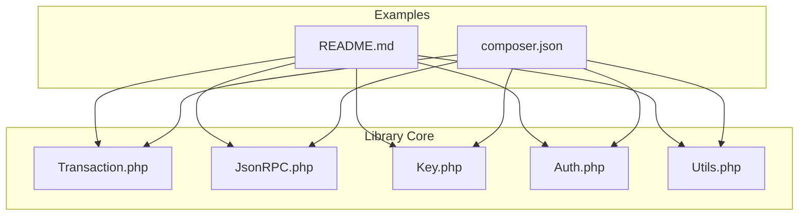
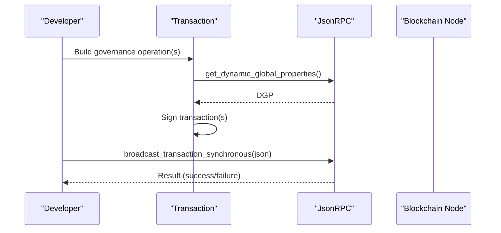
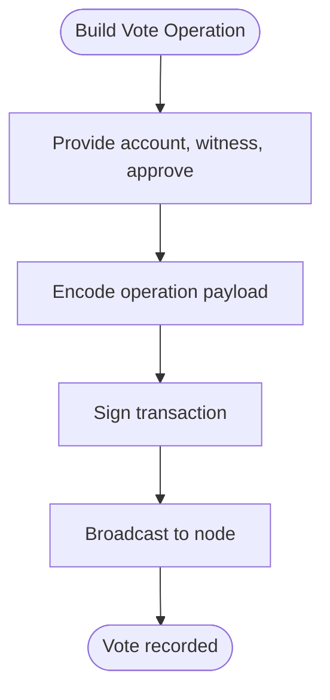
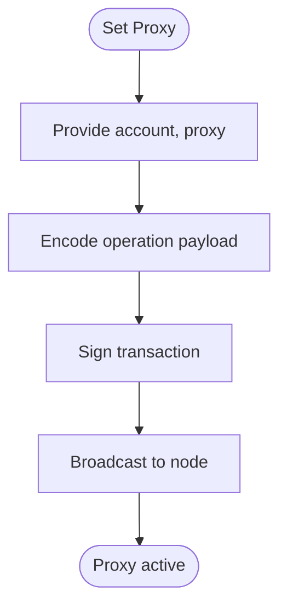
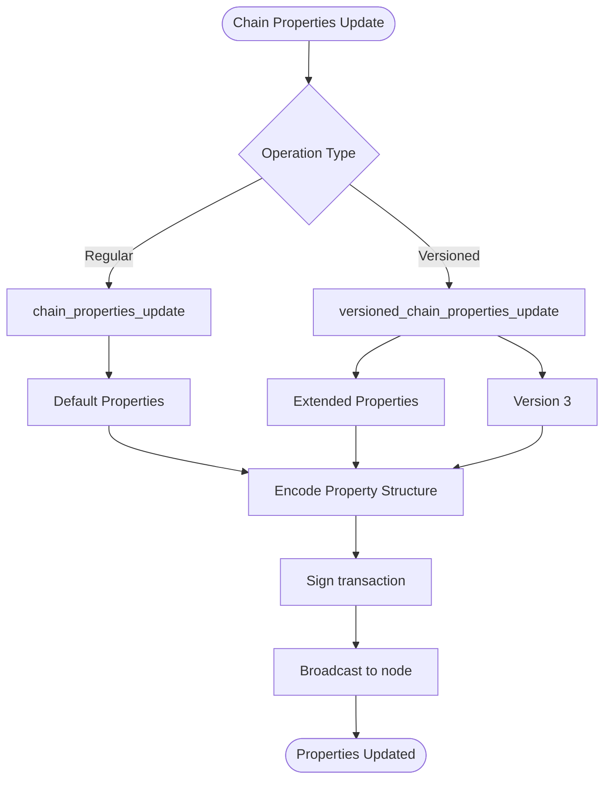
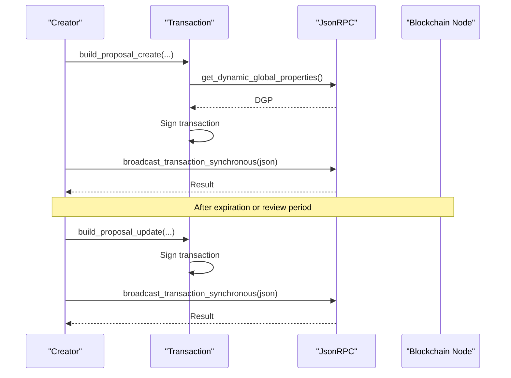
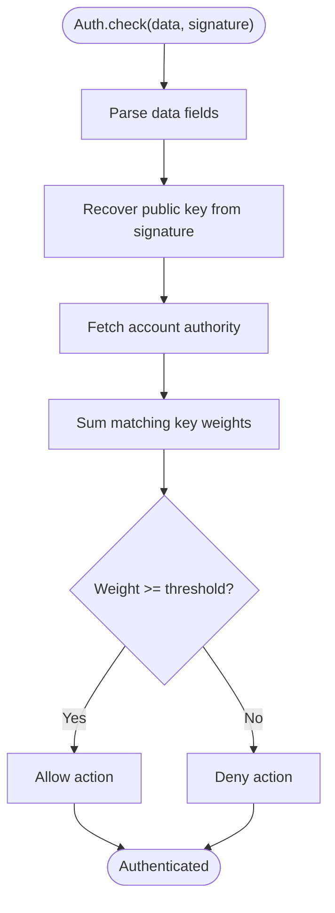
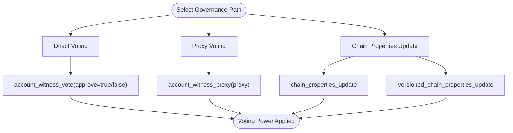
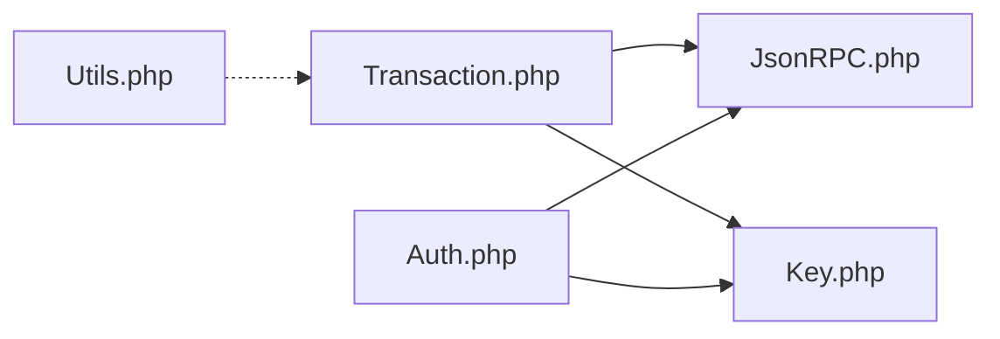

# Governance Operations

<cite>
**Referenced Files in This Document**
- [README.md](file://README.md)
- [composer.json](file://composer.json)
- [class/VIZ/Transaction.php](file://class/VIZ/Transaction.php)
- [class/VIZ/JsonRPC.php](file://class/VIZ/JsonRPC.php)
- [class/VIZ/Key.php](file://class/VIZ/Key.php)
- [class/VIZ/Auth.php](file://class/VIZ/Auth.php)
- [class/VIZ/Utils.php](file://class/VIZ/Utils.php)
</cite>

## Update Summary
**Changes Made**
- Added documentation for new chain properties update operations
- Enhanced governance operations section to cover both regular and versioned chain properties updates
- Updated transaction building workflow to include chain properties operations
- Added examples for constructing and executing governance-related blockchain operations

## Table of Contents
1. [Introduction](#introduction)
2. [Project Structure](#project-structure)
3. [Core Components](#core-components)
4. [Architecture Overview](#architecture-overview)
5. [Detailed Component Analysis](#detailed-component-analysis)
6. [Dependency Analysis](#dependency-analysis)
7. [Performance Considerations](#performance-considerations)
8. [Troubleshooting Guide](#troubleshooting-guide)
9. [Conclusion](#conclusion)

## Introduction
This document explains governance operations on the VIZ blockchain as implemented in the library, focusing on:
- Witness voting via account_witness_vote
- Proxy voting via account_witness_proxy
- Proposal creation and voting via proposal_create and proposal_update
- Chain properties updates via chain_properties_update and versioned_chain_properties_update

It covers how to calculate voting weights, select proxies, manage proposal lifecycles, update blockchain parameters, and validate authorities. It also provides practical examples for participating in governance through direct voting, proxy delegation, proposal creation, and blockchain parameter updates.

## Project Structure
The library is organized around cryptographic primitives, JSON-RPC communication, and transaction building. Governance operations are exposed through the Transaction class, which constructs operations and signs transactions. Authority validation for passwordless authentication is handled by the Auth class.

**Diagram sources**
- [README.md](file://README.md#L36-L455)
- [composer.json](file://composer.json#L19-L31)

**Section sources**
- [README.md](file://README.md#L1-L455)
- [composer.json](file://composer.json#L1-L32)

## Core Components
- Transaction: Builds and signs blockchain operations, including governance operations (witness vote, proxy, proposals, and chain properties updates).
- JsonRPC: Provides low-level access to blockchain APIs for reading state and broadcasting transactions.
- Key: Handles key derivation, signing, verification, and passwordless authentication data generation.
- Auth: Validates passwordless authentication requests against account authorities.
- Utils: Utility functions for Voice protocol and encoding helpers.

**Section sources**
- [class/VIZ/Transaction.php](file://class/VIZ/Transaction.php#L1-L1458)
- [class/VIZ/JsonRPC.php](file://class/VIZ/JsonRPC.php#L1-L354)
- [class/VIZ/Key.php](file://class/VIZ/Key.php#L1-L353)
- [class/VIZ/Auth.php](file://class/VIZ/Auth.php#L1-L70)
- [class/VIZ/Utils.php](file://class/VIZ/Utils.php#L1-L413)

## Architecture Overview
The governance workflow integrates transaction construction, signing, and broadcast with blockchain state queries. Authority checks ensure only authorized parties can act on behalf of accounts. Chain properties updates provide a mechanism for community-driven parameter modifications.

**Diagram sources**
- [class/VIZ/Transaction.php](file://class/VIZ/Transaction.php#L61-L157)
- [class/VIZ/JsonRPC.php](file://class/VIZ/JsonRPC.php#L311-L353)

## Detailed Component Analysis

### Witness Voting: account_witness_vote
- Operation: account_witness_vote(account, witness, approve)
- Purpose: Approve or remove approval for a given witness.
- Behavior: approve=true adds approval; approve=false removes it.
- Encoding: The operation is built with a numeric operation code and encodes account, witness, and boolean approve flag.

**Diagram sources**
- [class/VIZ/Transaction.php](file://class/VIZ/Transaction.php#L676-L688)

**Section sources**
- [class/VIZ/Transaction.php](file://class/VIZ/Transaction.php#L676-L688)

### Proxy Voting: account_witness_proxy
- Operation: account_witness_proxy(account, proxy)
- Purpose: Delegate witness voting power to another account (proxy).
- Behavior: Setting a proxy replaces any prior proxy for the account.
- Encoding: Encodes account and proxy strings.

**Diagram sources**
- [class/VIZ/Transaction.php](file://class/VIZ/Transaction.php#L700-L710)

**Section sources**
- [class/VIZ/Transaction.php](file://class/VIZ/Transaction.php#L700-L710)

### Chain Properties Updates

#### Regular Chain Properties Update: chain_properties_update
- Operation: chain_properties_update(owner, props)
- Purpose: Update blockchain parameters with default property values.
- Properties include: account_creation_fee, maximum_block_size, create_account_delegation_ratio, create_account_delegation_time, min_delegation, min_curation_percent, max_curation_percent, bandwidth_reserve_percent, bandwidth_reserve_below, flag_energy_additional_cost, vote_accounting_min_rshares, committee_request_approve_min_percent.
- Encoding: Uses default property structure with type validation.

#### Versioned Chain Properties Update: versioned_chain_properties_update
- Operation: versioned_chain_properties_update(owner, props)
- Purpose: Update blockchain parameters with versioned property values.
- Version: Currently set to 3, indicating the version of the property structure.
- Extended Properties: Includes all regular properties plus inflation parameters, witness penalties, fees, and additional governance parameters.
- Encoding: Adds version prefix to property structure with comprehensive type validation.

**Diagram sources**
- [class/VIZ/Transaction.php](file://class/VIZ/Transaction.php#L992-L1101)

**Section sources**
- [class/VIZ/Transaction.php](file://class/VIZ/Transaction.php#L992-L1101)

### Proposal Operations
Proposal lifecycle includes creation, updates (approvals/removals), and deletion.

- Creation: proposal_create(author, title, memo, expiration_time, proposed_operations[], review_period_time?)
- Update: proposal_update(author, title, active_approvals_to_add, active_approvals_to_remove, master_approvals_to_add, master_approvals_to_remove, regular_approvals_to_add, regular_approvals_to_remove, key_approvals_to_add, key_approvals_to_remove)
- Deletion: proposal_delete(author, title, requester)

**Diagram sources**
- [class/VIZ/Transaction.php](file://class/VIZ/Transaction.php#L1235-L1268)
- [class/VIZ/Transaction.php](file://class/VIZ/Transaction.php#L1270-L1294)
- [class/VIZ/Transaction.php](file://class/VIZ/Transaction.php#L1296-L1307)
- [class/VIZ/Transaction.php](file://class/VIZ/Transaction.php#L61-L157)
- [class/VIZ/JsonRPC.php](file://class/VIZ/JsonRPC.php#L311-L353)

**Section sources**
- [class/VIZ/Transaction.php](file://class/VIZ/Transaction.php#L1235-L1307)

### Authority Requirements and Validation
- Passwordless authentication: The Key class generates signed data for domain actions. The Auth class validates the signature against the account's authority thresholds and keys.
- Thresholds: The validation sums weights of keys present in the chosen authority (active/master/regular) and compares to weight_threshold.

**Diagram sources**
- [class/VIZ/Auth.php](file://class/VIZ/Auth.php#L25-L69)

**Section sources**
- [class/VIZ/Auth.php](file://class/VIZ/Auth.php#L1-L70)

### Voting Weight Calculations and Proxy Selection
- Voting weight: Determined by account's VESTS delegated to it (directly or via proxy). The library exposes operations to set proxies and vote for witnesses; the actual weight calculation is performed by the blockchain based on delegated stake.
- Proxy selection: Choose a trusted account that aligns with your governance preferences. Use account_witness_proxy to delegate voting power.
- Direct voting: Use account_witness_vote with approve=true to support a witness; approve=false to remove support.

[No sources needed since this diagram shows conceptual workflow, not actual code structure]

## Dependency Analysis
The Transaction class depends on JsonRPC for state queries and Key for signing. Auth depends on JsonRPC to fetch account data and Key to recover public keys.

**Diagram sources**
- [class/VIZ/Transaction.php](file://class/VIZ/Transaction.php#L1-L1458)
- [class/VIZ/JsonRPC.php](file://class/VIZ/JsonRPC.php#L1-L354)
- [class/VIZ/Key.php](file://class/VIZ/Key.php#L1-L353)
- [class/VIZ/Auth.php](file://class/VIZ/Auth.php#L1-L70)
- [class/VIZ/Utils.php](file://class/VIZ/Utils.php#L1-L413)

**Section sources**
- [class/VIZ/Transaction.php](file://class/VIZ/Transaction.php#L1-L1458)
- [class/VIZ/JsonRPC.php](file://class/VIZ/JsonRPC.php#L1-L354)
- [class/VIZ/Key.php](file://class/VIZ/Key.php#L1-L353)
- [class/VIZ/Auth.php](file://class/VIZ/Auth.php#L1-L70)
- [class/VIZ/Utils.php](file://class/VIZ/Utils.php#L1-L413)

## Performance Considerations
- Transaction building: Uses dynamic global properties and Tapos blocks; ensure network latency is considered when setting expiration.
- Signing: Each private key involved in a transaction must sign the raw transaction data; batching operations reduces overhead.
- Authority checks: Fetching account data for validation is O(1) per call; batch where possible.
- Chain properties updates: Versioned updates include additional parameters and require more complex encoding but provide enhanced governance capabilities.

[No sources needed since this section provides general guidance]

## Troubleshooting Guide
- Transaction fails to broadcast: Verify endpoint connectivity and that the transaction is within expiration. Check signatures and required authorities.
- Authority mismatch: Ensure the signing key matches the authority (active/master/regular) and that total weight meets threshold.
- Proposal not passing: Confirm approvals meet thresholds and that the proposal is submitted before expiration.
- Chain properties update failure: Verify owner account has sufficient authority and that property values are within acceptable ranges.

**Section sources**
- [class/VIZ/JsonRPC.php](file://class/VIZ/JsonRPC.php#L311-L353)
- [class/VIZ/Auth.php](file://class/VIZ/Auth.php#L25-L69)

## Conclusion
This library provides a complete toolkit for VIZ governance participation:
- Direct voting with account_witness_vote
- Proxy delegation with account_witness_proxy
- Proposal creation, updates, and deletion
- Chain properties updates with both regular and versioned variants
- Authority validation for secure operations

By combining these operations with proper authority management and careful proposal lifecycle planning, participants can effectively influence blockchain governance and parameter modifications. The addition of chain properties update operations enhances the library's capability to support community-driven governance initiatives and parameter adjustments.