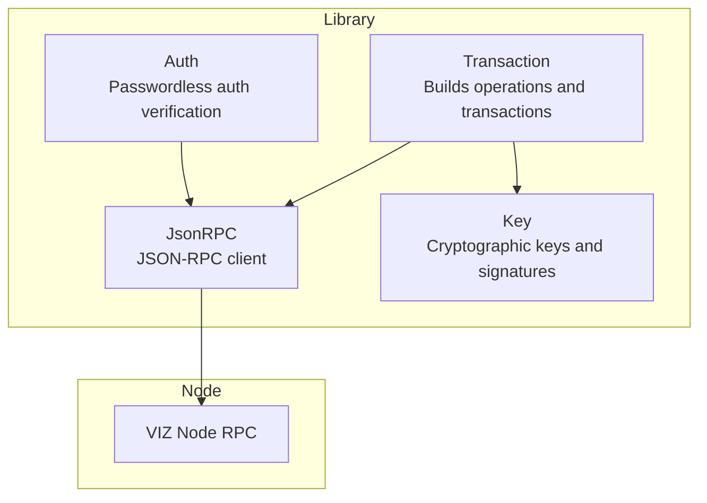
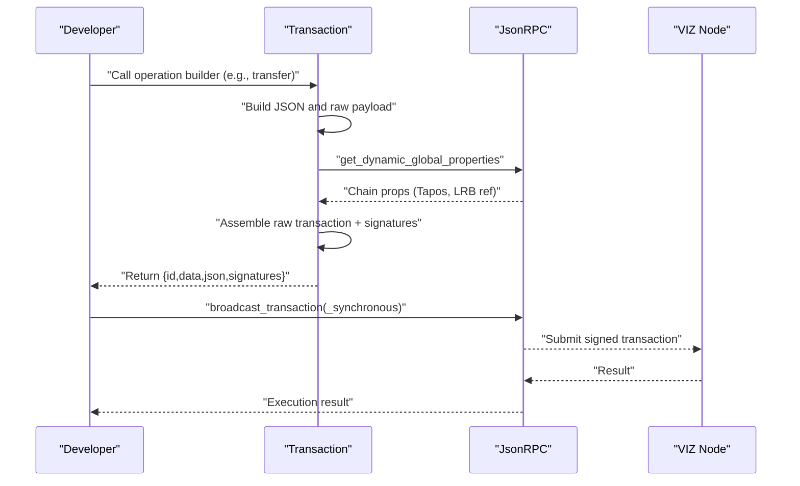
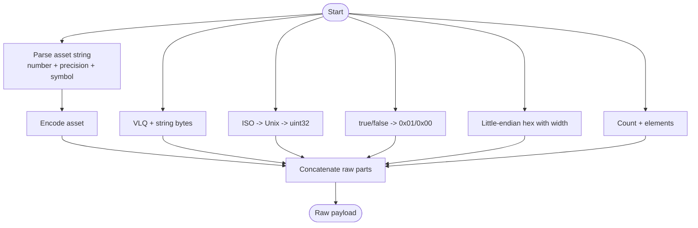
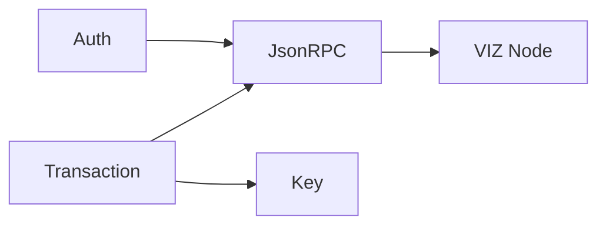

# Operation Types

<cite>
**Referenced Files in This Document**
- [README.md](file://README.md)
- [Transaction.php](file://class/VIZ/Transaction.php)
- [JsonRPC.php](file://class/VIZ/JsonRPC.php)
- [Key.php](file://class/VIZ/Key.php)
- [Auth.php](file://class/VIZ/Auth.php)
- [autoloader.php](file://class/autoloader.php)
- [composer.json](file://composer.json)
</cite>

## Table of Contents
1. [Introduction](#introduction)
2. [Project Structure](#project-structure)
3. [Core Components](#core-components)
4. [Architecture Overview](#architecture-overview)
5. [Detailed Component Analysis](#detailed-component-analysis)
6. [Dependency Analysis](#dependency-analysis)
7. [Performance Considerations](#performance-considerations)
8. [Troubleshooting Guide](#troubleshooting-guide)
9. [Conclusion](#conclusion)

## Introduction
This document describes all 38 supported operation types in the VIZ blockchain as implemented by the viz-php-lib. It explains each operation builder method, required and optional parameters, JSON structure, and raw data encoding format. Practical examples are included for common operations such as transfers, account management, and governance actions. Parameter validation, data type requirements, and encoding specifications are documented to help developers integrate with the VIZ blockchain reliably.

## Project Structure
The library is organized around three primary classes:
- Transaction: Builds operations and transactions, encodes raw data, and executes via JsonRPC.
- JsonRPC: Provides low-level JSON-RPC communication with VIZ nodes.
- Key and Auth: Manage cryptographic keys, signatures, and passwordless authentication checks.

**Diagram sources**
- [Transaction.php](file://class/VIZ/Transaction.php#L10-L24)
- [JsonRPC.php](file://class/VIZ/JsonRPC.php#L4-L354)
- [Key.php](file://class/VIZ/Key.php#L9-L353)
- [Auth.php](file://class/VIZ/Auth.php#L9-L70)

**Section sources**
- [README.md](file://README.md#L9-L18)
- [composer.json](file://composer.json#L19-L31)
- [autoloader.php](file://class/autoloader.php#L1-L14)

## Core Components
- Transaction: Central class for building operations and transactions. It supports multi-operation queues, Tapos resolution, expiration calculation, and multi-signature assembly. It also exposes builder methods for all 38 operation types.
- JsonRPC: Encapsulates JSON-RPC calls to VIZ nodes, including broadcasting transactions and retrieving chain data.
- Key: Handles key generation, encoding/decoding, signing, verification, and shared-key derivation for encrypted memos.
- Auth: Validates passwordless authentication requests against on-chain authority thresholds.

**Section sources**
- [Transaction.php](file://class/VIZ/Transaction.php#L10-L24)
- [JsonRPC.php](file://class/VIZ/JsonRPC.php#L258-L353)
- [Key.php](file://class/VIZ/Key.php#L9-L353)
- [Auth.php](file://class/VIZ/Auth.php#L9-L70)

## Architecture Overview
The Transaction class composes with JsonRPC and Key to assemble signed transactions. It fetches dynamic global properties for Tapos, constructs raw binary payloads, signs with private keys, and produces JSON-ready transaction objects for broadcast.

**Diagram sources**
- [Transaction.php](file://class/VIZ/Transaction.php#L61-L157)
- [JsonRPC.php](file://class/VIZ/JsonRPC.php#L311-L353)

## Detailed Component Analysis

### Operation Builder Methods and Encoding Specifications
Below is a categorized summary of all 38 operation types supported by the Transaction class. Each entry documents:
- Builder method name
- Required and optional parameters
- JSON structure fields
- Raw encoding format (hex)
- Notes on validation and data types

#### Account Operations
- account_create
  - Parameters: fee, delegation, creator, new_account_name, master, active, regular, memo_key, json_metadata, referrer
  - JSON fields: fee, delegation, creator, new_account_name, master, active, regular, memo_key, json_metadata, referrer
  - Raw encoding: asset, asset, string, string, authority, authority, authority, pubkey, string, string
  - Notes: Authority arrays must be sorted; memo_key defaults to empty key if omitted.

- account_update
  - Parameters: account, master, active, regular, memo_key, json_metadata
  - JSON fields: account, master, active, regular, memo_key, json_metadata
  - Raw encoding: string, authority, authority, authority, pubkey, string
  - Notes: Same authority rules as account_create.

- request_account_recovery
  - Parameters: recovery_account, account_to_recover, new_master
  - JSON fields: recovery_account, account_to_recover, new_master_authority
  - Raw encoding: string, string, authority

- recover_account
  - Parameters: account_to_recover, new_master, recent_master
  - JSON fields: account_to_recover, new_master, recent_master_authority
  - Raw encoding: string, authority, authority

- account_metadata
  - Parameters: account, json_metadata
  - JSON fields: account, json_metadata
  - Raw encoding: string, string

- account_witness_vote
  - Parameters: account, witness, approve
  - JSON fields: account, witness, approve
  - Raw encoding: string, string, bool

- account_witness_proxy
  - Parameters: account, proxy
  - JSON fields: account, proxy
  - Raw encoding: string, string

- change_recovery_account
  - Parameters: account_to_recover, new_recovery_account
  - JSON fields: account_to_recover, new_recovery_account
  - Raw encoding: string, string

- set_withdraw_vesting_route
  - Parameters: from_account, to_account, percent, auto_vest
  - JSON fields: from_account, to_account, percent, auto_vest
  - Raw encoding: string, string, int16, bool

- delegate_vesting_shares
  - Parameters: delegator, delegatee, vesting_shares
  - JSON fields: delegator, delegatee, vesting_shares
  - Raw encoding: string, string, asset

- buy_account
  - Parameters: buyer, account, account_offer_price, account_authorities_key, tokens_to_shares
  - JSON fields: buyer, account, account_offer_price, account_authorities_key, tokens_to_shares
  - Raw encoding: string, string, asset, pubkey, asset

- set_account_price
  - Parameters: account, account_seller, account_offer_price, account_on_sale
  - JSON fields: account, account_seller, account_offer_price, account_on_sale
  - Raw encoding: string, string, asset, bool

- target_account_sale
  - Parameters: account, account_seller, target_buyer, account_offer_price, account_on_sale
  - JSON fields: account, account_seller, target_buyer, account_offer_price, account_on_sale
  - Raw encoding: string, string, string, asset, bool

- set_subaccount_price
  - Parameters: account, subaccount_seller, subaccount_offer_price, subaccount_on_sale
  - JSON fields: account, subaccount_seller, subaccount_offer_price, subaccount_on_sale
  - Raw encoding: string, string, asset, bool

#### Transfer and Vesting
- transfer
  - Parameters: from, to, amount, memo
  - JSON fields: from, to, amount, memo
  - Raw encoding: string, string, asset, string

- transfer_to_vesting
  - Parameters: from, to, amount
  - JSON fields: from, to, amount
  - Raw encoding: string, string, asset

- withdraw_vesting
  - Parameters: account, vesting_shares
  - JSON fields: account, vesting_shares
  - Raw encoding: string, asset

#### Governance and Proposals
- proposal_create
  - Parameters: author, title, memo, expiration_time, proposed_operations[], review_period_time?
  - JSON fields: author, title, memo, expiration_time, proposed_operations, review_period_time?
  - Raw encoding: string, string, string, timestamp, uint8 + ops, optional timestamp, 0x00
  - Notes: proposed_operations must be pre-built via build_* methods.

- proposal_update
  - Parameters: author, title, active_approvals_to_add, active_approvals_to_remove, master_approvals_to_add, master_approvals_to_remove, regular_approvals_to_add, regular_approvals_to_remove, key_approvals_to_add, key_approvals_to_remove
  - JSON fields: author, title, plus arrays for approvals to add/remove
  - Raw encoding: string, string, arrays of strings for each approval category, 0x00

- proposal_delete
  - Parameters: author, title, requester
  - JSON fields: author, title, requester
  - Raw encoding: string, string, string, 0x00

- committee_worker_create_request
  - Parameters: creator, url, worker, required_amount_min, required_amount_max, duration
  - JSON fields: creator, url, worker, required_amount_min, required_amount_max, duration
  - Raw encoding: string, string, string, asset, asset, uint32

- committee_worker_cancel_request
  - Parameters: creator, request_id
  - JSON fields: creator, request_id
  - Raw encoding: string, uint32

- committee_vote_request
  - Parameters: creator, request_id, vote_percent
  - JSON fields: creator, request_id, vote_percent
  - Raw encoding: string, uint32, int16

- versioned_chain_properties_update
  - Parameters: owner, props (array of property-value pairs)
  - JSON fields: owner, props (version, map of defaults overridden)
  - Raw encoding: string, uint8 + array of typed values

#### Witnesses and Authority Updates
- witness_update
  - Parameters: owner, url, block_signing_key
  - JSON fields: owner, url, block_signing_key
  - Raw encoding: string, string, pubkey

#### Awards and Invites
- award
  - Parameters: initiator, receiver, energy, custom_sequence, memo, beneficiaries[]
  - JSON fields: initiator, receiver, energy, custom_sequence, memo, beneficiaries
  - Raw encoding: string, string, int16, int64, string, array of string+int16

- fixed_award
  - Parameters: initiator, receiver, reward_amount, max_energy, custom_sequence, memo, beneficiaries[]
  - JSON fields: initiator, receiver, reward_amount, max_energy, custom_sequence, memo, beneficiaries
  - Raw encoding: string, string, asset, int16, int64, string, array of string+int16

- create_invite
  - Parameters: creator, balance, invite_key
  - JSON fields: creator, balance, invite_key
  - Raw encoding: string, asset, pubkey

- claim_invite_balance
  - Parameters: initiator, receiver, invite_secret
  - JSON fields: initiator, receiver, invite_secret
  - Raw encoding: string, string, string

- invite_registration
  - Parameters: initiator, new_account_name, invite_secret, new_account_key
  - JSON fields: initiator, new_account_name, invite_secret, new_account_key
  - Raw encoding: string, string, string, pubkey

- use_invite_balance
  - Parameters: initiator, receiver, invite_secret
  - JSON fields: initiator, receiver, invite_secret
  - Raw encoding: string, string, string

#### Escrow
- escrow_transfer
  - Parameters: from, to, token_amount, escrow_id, agent, fee, json_metadata, ratification_deadline, escrow_expiration
  - JSON fields: from, to, token_amount, escrow_id, agent, fee, json_metadata, ratification_deadline, escrow_expiration
  - Raw encoding: string, string, asset, uint32, string, asset, string, timestamp, timestamp

- escrow_dispute
  - Parameters: from, to, agent, who, escrow_id
  - JSON fields: from, to, agent, who, escrow_id
  - Raw encoding: string, string, string, string, uint32

- escrow_release
  - Parameters: from, to, agent, who, receiver, escrow_id, token_amount
  - JSON fields: from, to, agent, who, receiver, escrow_id, token_amount
  - Raw encoding: string, string, string, string, string, uint32, asset

- escrow_approve
  - Parameters: from, to, agent, who, escrow_id, approve
  - JSON fields: from, to, agent, who, escrow_id, approve
  - Raw encoding: string, string, string, string, uint32, bool

#### Paid Subscriptions
- set_paid_subscription
  - Parameters: account, url, levels, amount, period
  - JSON fields: account, url, levels, amount, period
  - Raw encoding: string, string, uint16, asset, uint16

- paid_subscribe
  - Parameters: subscriber, account, level, amount, period, auto_renewal
  - JSON fields: subscriber, account, level, amount, period, auto_renewal
  - Raw encoding: string, string, uint16, asset, uint16, bool

#### Custom
- custom
  - Parameters: required_active_auths[], required_regular_auths[], id, json_str
  - JSON fields: required_active_auths, required_regular_auths, id, json
  - Raw encoding: array[string], array[string], string, string

#### Encoding Reference
- Asset: number (as integer with fractional digits removed), precision byte, asset string (padded to 14 hex chars)
- String: VLQ length + bytes
- Timestamp: Unix time as uint32
- Boolean: 0x00 or 0x01
- Integers: Little-endian hex with specified byte width
- Arrays: Count byte + encoded elements
- Public key: Hex-encoded public key string

**Section sources**
- [Transaction.php](file://class/VIZ/Transaction.php#L191-L350)
- [Transaction.php](file://class/VIZ/Transaction.php#L351-L502)
- [Transaction.php](file://class/VIZ/Transaction.php#L503-L664)
- [Transaction.php](file://class/VIZ/Transaction.php#L665-L725)
- [Transaction.php](file://class/VIZ/Transaction.php#L726-L775)
- [Transaction.php](file://class/VIZ/Transaction.php#L776-L811)
- [Transaction.php](file://class/VIZ/Transaction.php#L812-L865)
- [Transaction.php](file://class/VIZ/Transaction.php#L866-L901)
- [Transaction.php](file://class/VIZ/Transaction.php#L902-L913)
- [Transaction.php](file://class/VIZ/Transaction.php#L914-L953)
- [Transaction.php](file://class/VIZ/Transaction.php#L954-L991)
- [Transaction.php](file://class/VIZ/Transaction.php#L992-L1060)
- [Transaction.php](file://class/VIZ/Transaction.php#L1061-L1086)
- [Transaction.php](file://class/VIZ/Transaction.php#L1087-L1098)
- [Transaction.php](file://class/VIZ/Transaction.php#L1099-L1132)
- [Transaction.php](file://class/VIZ/Transaction.php#L1133-L1192)
- [Transaction.php](file://class/VIZ/Transaction.php#L1193-L1227)
- [Transaction.php](file://class/VIZ/Transaction.php#L1228-L1295)
- [Transaction.php](file://class/VIZ/Transaction.php#L1296-L1308)
- [Transaction.php](file://class/VIZ/Transaction.php#L1329-L1416)

### Practical Examples

- Transfer
  - Build: transfer(from, to, amount, memo)
  - JSON: from, to, amount, memo
  - Raw: string, string, asset, string
  - Example usage: See README example invoking award operation builder and execution.

- Account Management
  - Create account: account_create(fee, delegation, creator, new_account_name, master, active, regular, memo_key, json_metadata, referrer)
  - Update account: account_update(account, master, active, regular, memo_key, json_metadata)
  - Example usage: See README example for account_create operation builder.

- Governance Actions
  - Proposal creation: proposal_create(author, title, memo, expiration_time, proposed_operations[], review_period_time?)
  - Proposal update: proposal_update(author, title, active_approvals_to_add, ..., key_approvals_to_remove)
  - Example usage: See README example for proposal operations.

- Custom Operations
  - custom(required_active_auths[], required_regular_auths[], id, json_str)
  - Example usage: See README example for custom operation builder.

- Specialized Operations
  - Award/fixed_award: award(initiator, receiver, energy, custom_sequence, memo, beneficiaries[])
  - Invite operations: create_invite, claim_invite_balance, invite_registration, use_invite_balance
  - Escrow: escrow_transfer, escrow_dispute, escrow_release, escrow_approve
  - Witnesses: account_witness_vote, account_witness_proxy, witness_update
  - Subscriptions: set_paid_subscription, paid_subscribe
  - Chain properties: versioned_chain_properties_update(owner, props)

**Section sources**
- [README.md](file://README.md#L97-L162)
- [README.md](file://README.md#L241-L283)
- [README.md](file://README.md#L285-L308)
- [README.md](file://README.md#L224-L239)

### Parameter Validation and Data Type Requirements
- Asset amounts: Must be formatted as "<amount> <symbol>" (e.g., "1.000 VIZ"). The encoder parses number and precision.
- Strings: VLQ-prefixed UTF-8 sequences; ensure proper encoding.
- Timestamps: ISO-like "YYYY-MM-DDTHH:mm:ss" parsed to Unix time.
- Boolean: true/false mapped to 0x01/0x00.
- Integer widths: Use appropriate encode_* methods (int16, uint32, uint64) to match operation specs.
- Authorities: weight_threshold defaults to 1 if omitted; account_auths and key_auths arrays must be present; ensure key_auths are sorted lexicographically to avoid rejection by nodes.
- Beneficiaries: array of objects with account and weight; weight is int16.

**Section sources**
- [Transaction.php](file://class/VIZ/Transaction.php#L1329-L1416)
- [Transaction.php](file://class/VIZ/Transaction.php#L191-L350)

### Raw Data Encoding Flow

**Diagram sources**
- [Transaction.php](file://class/VIZ/Transaction.php#L1329-L1416)

## Dependency Analysis
- Transaction depends on JsonRPC for chain data and broadcasting, and on Key for signing.
- Auth depends on JsonRPC to fetch account data and on Key for signature recovery.
- The autoloader maps namespaces to class files, enabling PSR-4-style loading.

**Diagram sources**
- [Transaction.php](file://class/VIZ/Transaction.php#L10-L24)
- [JsonRPC.php](file://class/VIZ/JsonRPC.php#L4-L354)
- [Key.php](file://class/VIZ/Key.php#L9-L353)
- [Auth.php](file://class/VIZ/Auth.php#L9-L70)

**Section sources**
- [composer.json](file://composer.json#L19-L31)
- [autoloader.php](file://class/autoloader.php#L1-L14)

## Performance Considerations
- Multi-signature assembly iterates over private keys; keep the number of keys minimal.
- Batch operations via queue mode reduces network round trips.
- Asset parsing and VLQ encoding are O(n) per field; avoid excessive nested arrays.
- Use synchronous broadcast only when you need immediate block confirmation.

## Troubleshooting Guide
- Broadcasting failures: Verify Tapos block retrieval and expiration window. Ensure signatures are present and valid.
- Authority errors: Confirm authority weights and key sorting. Nodes enforce strict ordering for key_auths.
- Asset format errors: Ensure amounts include the correct symbol and decimal precision.
- Memo encryption/decryption: Shared key derivation requires correct sender/receiver roles; checksum mismatch indicates wrong key or tampering.

**Section sources**
- [Transaction.php](file://class/VIZ/Transaction.php#L61-L157)
- [Key.php](file://class/VIZ/Key.php#L33-L176)

## Conclusion
The viz-php-lib provides comprehensive support for all 38 VIZ blockchain operations. By leveraging the Transaction builder methods, JSON-RPC integration, and cryptographic primitives, developers can construct, encode, sign, and broadcast transactions reliably. Adhering to the documented parameter formats, data types, and encoding rules ensures compatibility with VIZ nodes and smooth execution of governance, transfers, and specialized operations.