# Specialized Operations

<cite>
**Referenced Files in This Document**
- [README.md](file://README.md)
- [composer.json](file://composer.json)
- [class/autoloader.php](file://class/autoloader.php)
- [class/VIZ/Transaction.php](file://class/VIZ/Transaction.php)
- [class/VIZ/Utils.php](file://class/VIZ/Utils.php)
- [class/VIZ/JsonRPC.php](file://class/VIZ/JsonRPC.php)
- [class/VIZ/Key.php](file://class/VIZ/Key.php)
</cite>

## Table of Contents
1. [Introduction](#introduction)
2. [Project Structure](#project-structure)
3. [Core Components](#core-components)
4. [Architecture Overview](#architecture-overview)
5. [Award Operations](#award-operations)
6. [Invite System](#invite-system)
7. [Vesting Routes](#vesting-routes)
8. [Custom Operations](#custom-operations)
9. [Account Recovery](#account-recovery)
10. [Voice Protocol Integration](#voice-protocol-integration)
11. [Energy Mechanics](#energy-mechanics)
12. [Advanced Blockchain Features](#advanced-blockchain-features)
13. [Examples and Use Cases](#examples-and-use-cases)
14. [Troubleshooting Guide](#troubleshooting-guide)
15. [Conclusion](#conclusion)

## Introduction

The VIZ PHP Library provides comprehensive functionality for interacting with the VIZ blockchain network. This documentation focuses on specialized operations including award/fixed_award mechanisms, invite creation, vesting routes configuration, and custom operations. The library supports advanced blockchain features including energy mechanics, voice protocol integration, and sophisticated reward systems.

The library offers native PHP classes for cryptographic operations, transaction building, and JSON-RPC communication with VIZ blockchain nodes. It includes support for multi-signature transactions, queued operations, and various specialized blockchain operations.

## Project Structure

The VIZ PHP Library follows a modular architecture with clear separation of concerns:

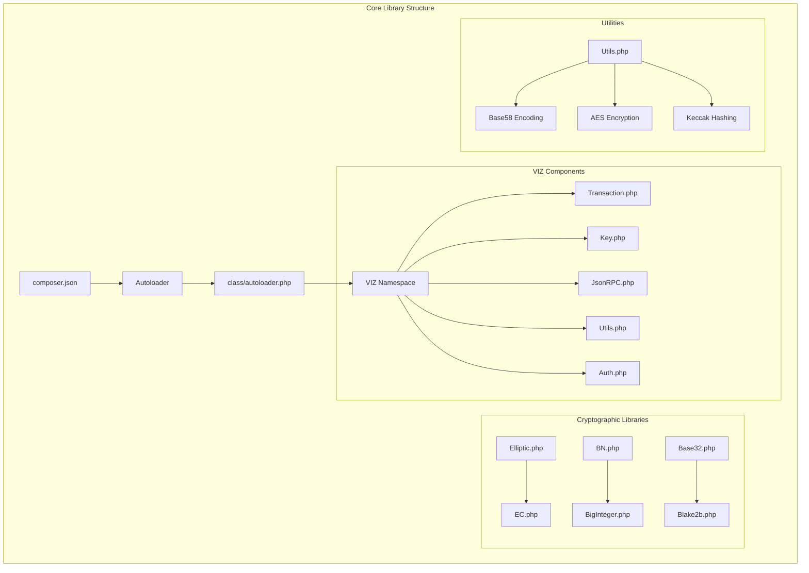

**Diagram sources**
- [composer.json](file://composer.json#L19-L28)
- [class/autoloader.php](file://class/autoloader.php#L1-L14)

**Section sources**
- [composer.json](file://composer.json#L1-L32)
- [class/autoloader.php](file://class/autoloader.php#L1-L14)

## Core Components

The VIZ PHP Library consists of several core components that work together to provide blockchain functionality:

### Transaction Builder
The Transaction class serves as the primary interface for creating and executing blockchain operations. It supports:
- Multi-operation queuing
- Automatic transaction building
- Signature management
- TAPoS (Transaction as Proof of Stake) block reference
- Multi-signature support

### Cryptographic Operations
The Key class provides comprehensive cryptographic functionality:
- Private/public key generation
- WIF (Wallet Import Format) encoding/decoding
- ECDSA signature creation and verification
- Public key recovery from signatures
- Shared key derivation for secure messaging

### JSON-RPC Communication
The JsonRPC class handles communication with VIZ blockchain nodes:
- Automatic API method routing
- Plugin-based API resolution
- Request/response handling
- Error management and debugging

### Utility Functions
The Utils class provides various helper functions:
- Voice protocol integration
- Base58 encoding/decoding
- AES encryption/decryption
- Variable-length quantity encoding
- Cross-chain address generation

**Section sources**
- [class/VIZ/Transaction.php](file://class/VIZ/Transaction.php#L10-L52)
- [class/VIZ/Key.php](file://class/VIZ/Key.php#L9-L32)
- [class/VIZ/JsonRPC.php](file://class/VIZ/JsonRPC.php#L4-L121)
- [class/VIZ/Utils.php](file://class/VIZ/Utils.php#L7-L413)

## Architecture Overview

The VIZ PHP Library implements a layered architecture designed for blockchain interaction:

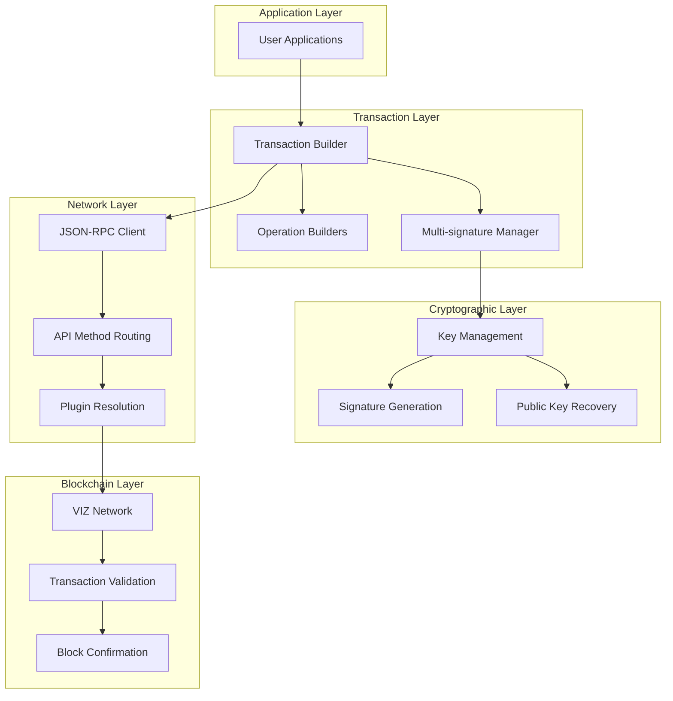

**Diagram sources**
- [class/VIZ/Transaction.php](file://class/VIZ/Transaction.php#L21-L52)
- [class/VIZ/JsonRPC.php](file://class/VIZ/JsonRPC.php#L29-L121)

The architecture ensures clear separation between transaction building, cryptographic operations, and network communication, while providing extensible support for various blockchain operations.

## Award Operations

The award system in VIZ provides sophisticated reward mechanisms for social features and content creation. The library supports two primary award operation types:

### Award Operation (Energy-Based Rewards)

The award operation allows initiators to distribute energy-based rewards to receivers with optional beneficiaries:

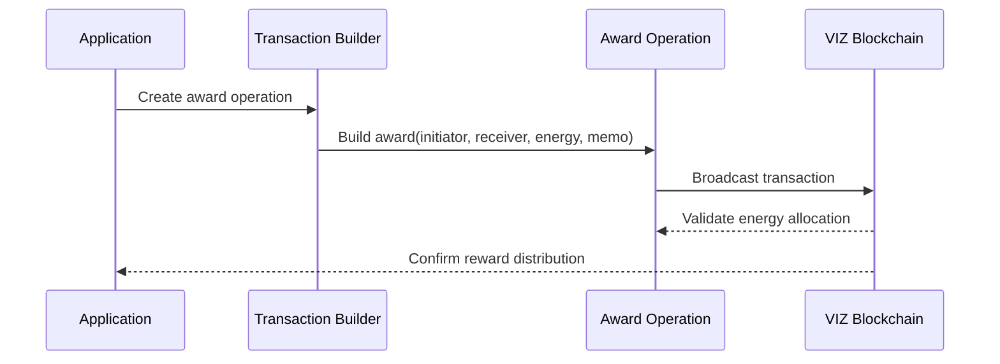

**Diagram sources**
- [class/VIZ/Transaction.php](file://class/VIZ/Transaction.php#L726-L748)

**Award Operation Parameters:**
- `initiator`: Account initiating the award
- `receiver`: Account receiving the award
- `energy`: Energy amount to distribute (integer)
- `custom_sequence`: Optional sequence number (default: 0)
- `memo`: Optional memo message
- `beneficiaries`: Array of beneficiary accounts with weights

### Fixed Award Operation (Token-Based Rewards)

The fixed_award operation provides token-based rewards with configurable maximum energy:

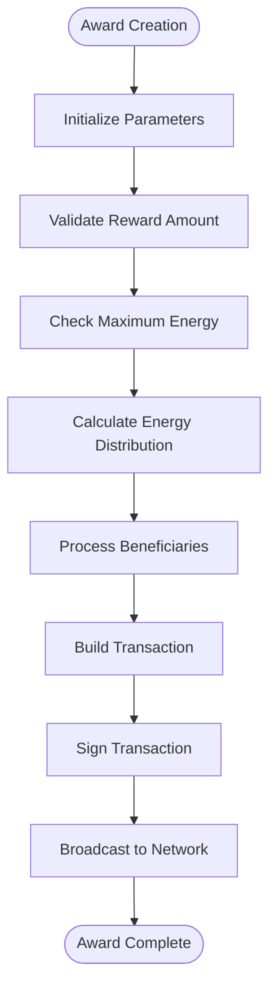

**Diagram sources**
- [class/VIZ/Transaction.php](file://class/VIZ/Transaction.php#L750-L774)

**Fixed Award Operation Parameters:**
- `initiator`: Account initiating the award
- `receiver`: Account receiving the award
- `reward_amount`: Token amount to distribute (formatted string)
- `max_energy`: Maximum energy allocation (integer)
- `custom_sequence`: Optional sequence number (default: 0)
- `memo`: Optional memo message
- `beneficiaries`: Array of beneficiary accounts with weights

**Section sources**
- [class/VIZ/Transaction.php](file://class/VIZ/Transaction.php#L726-L774)
- [README.md](file://README.md#L97-L135)

## Invite System

The invite system enables account creation through invitation keys, facilitating network growth and user acquisition:

### Create Invite Operation

The create_invite operation generates invitation keys for new user registration:

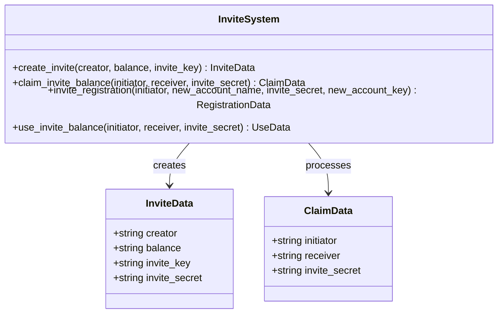

**Diagram sources**
- [class/VIZ/Transaction.php](file://class/VIZ/Transaction.php#L776-L786)
- [class/VIZ/Transaction.php](file://class/VIZ/Transaction.php#L954-L990)

**Invite Operation Parameters:**
- `creator`: Account creating the invite
- `balance`: Initial VIZ balance for the invite
- `invite_key`: Public key associated with the invite

**Invite Lifecycle:**
1. **Creation**: Creator generates invite with specified balance
2. **Distribution**: Invite key distributed to potential users
3. **Claim**: Recipient claims the invite using secret
4. **Registration**: New account created with invite parameters

**Section sources**
- [class/VIZ/Transaction.php](file://class/VIZ/Transaction.php#L776-L786)
- [class/VIZ/Transaction.php](file://class/VIZ/Transaction.php#L954-L990)
- [README.md](file://README.md#L137-L162)

## Vesting Routes

Vesting routes control how withdrawn VIZ tokens are distributed over time, enabling automated reward distribution:

### Set Withdraw Vesting Route Operation

The set_withdraw_vesting_route operation configures automatic distribution of withdrawn tokens:

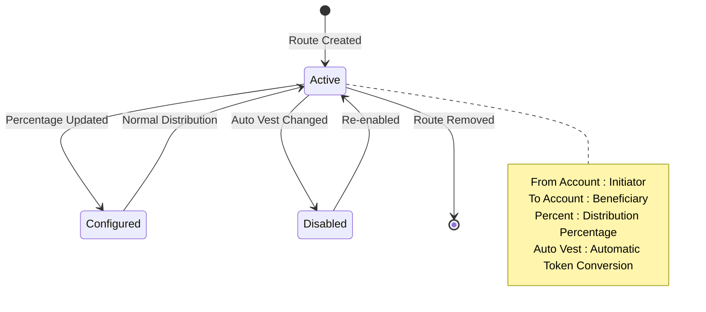

**Diagram sources**
- [class/VIZ/Transaction.php](file://class/VIZ/Transaction.php#L711-L724)

**Route Configuration Parameters:**
- `from_account`: Account initiating withdrawals
- `to_account`: Account receiving distributed tokens
- `percent`: Percentage of withdrawal (0-10000, representing 0%-100%)
- `auto_vest`: Boolean for automatic token conversion to VESTS

**Vesting Route Benefits:**
- Automated reward distribution
- Flexible percentage allocation
- Automatic token conversion
- Long-term reward mechanisms

**Section sources**
- [class/VIZ/Transaction.php](file://class/VIZ/Transaction.php#L711-L724)

## Custom Operations

Custom operations enable flexible blockchain interaction for specialized use cases:

### Custom Operation Builder

The custom operation system allows arbitrary data transmission on the blockchain:

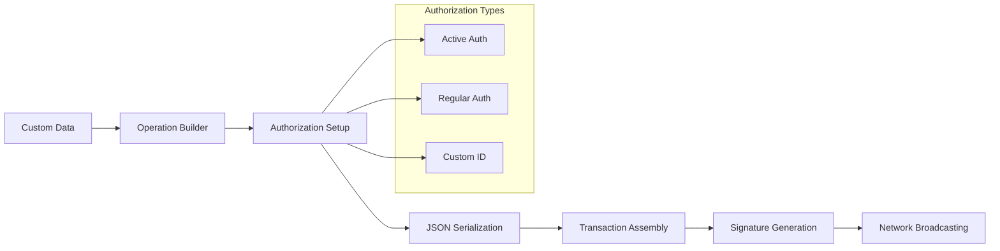

**Diagram sources**
- [class/VIZ/Transaction.php](file://class/VIZ/Transaction.php#L1061-L1085)

**Custom Operation Parameters:**
- `required_active_auths`: Array of accounts requiring active authority
- `required_regular_auths`: Array of accounts requiring regular authority
- `id`: Custom operation identifier
- `json_str`: JSON-encoded data payload

**Voice Protocol Integration:**
The library includes specialized voice protocol operations for social media functionality:

**Section sources**
- [class/VIZ/Transaction.php](file://class/VIZ/Transaction.php#L1061-L1085)
- [class/VIZ/Utils.php](file://class/VIZ/Utils.php#L36-L208)

## Account Recovery

The account recovery system provides security mechanisms for recovering compromised accounts:

### Change Recovery Account Operation

The change_recovery_account operation updates recovery account assignments:

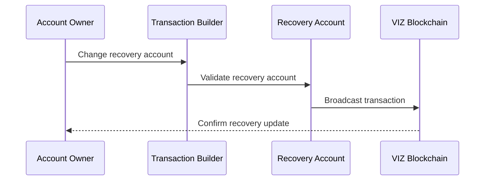

**Diagram sources**
- [class/VIZ/Transaction.php](file://class/VIZ/Transaction.php#L689-L698)

**Recovery Operation Parameters:**
- `account_to_recover`: Account requiring recovery
- `new_recovery_account`: New recovery account assignment

**Recovery Workflow:**
1. **Request Recovery**: Recovery account initiates recovery process
2. **Authority Verification**: Existing authorities must approve
3. **New Authority Setup**: Temporary authority granted
4. **Account Restoration**: Account restored with new permissions

**Section sources**
- [class/VIZ/Transaction.php](file://class/VIZ/Transaction.php#L689-L698)

## Voice Protocol Integration

The voice protocol enables decentralized social media functionality built directly on the blockchain:

### Voice Text Operations

Voice text operations create social posts with metadata and optional rewards:

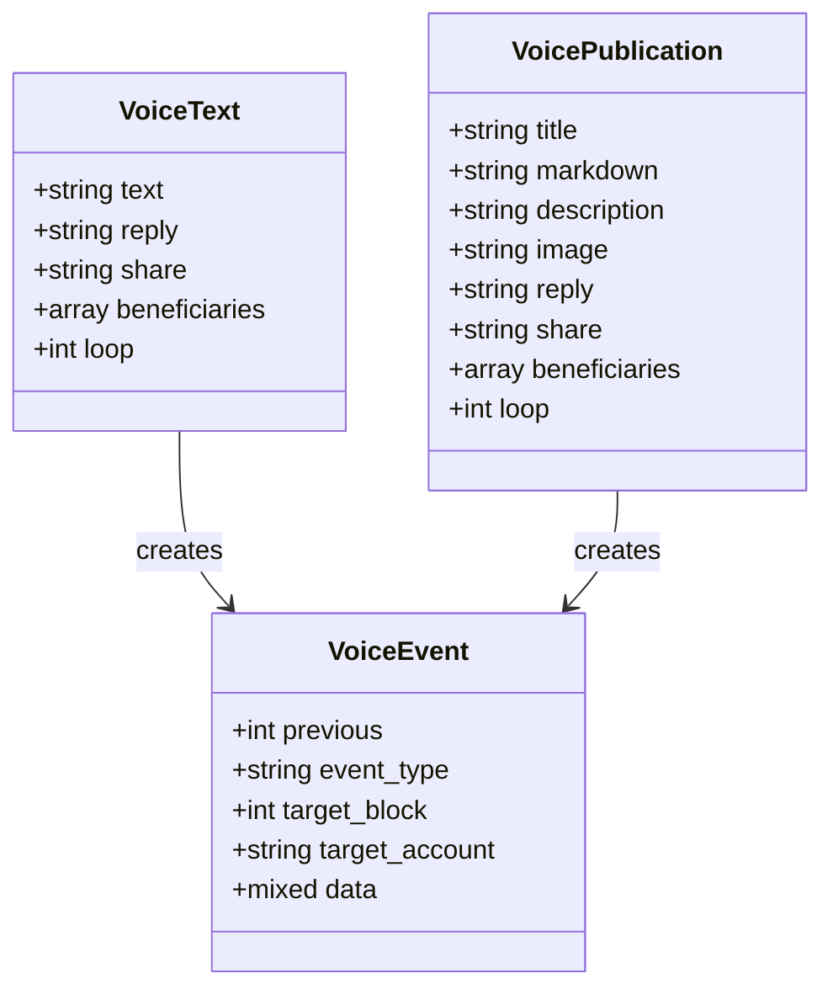

**Diagram sources**
- [class/VIZ/Utils.php](file://class/VIZ/Utils.php#L8-L27)
- [class/VIZ/Utils.php](file://class/VIZ/Utils.php#L74-L101)
- [class/VIZ/Utils.php](file://class/VIZ/Utils.php#L149-L155)

**Voice Protocol Features:**
- **Text Posts**: Simple text-based social content
- **Publications**: Rich markdown content with metadata
- **Events**: Content modification and interaction tracking
- **Beneficiaries**: Automatic reward distribution to content creators
- **Loop Functionality**: Content threading and context preservation

**Section sources**
- [class/VIZ/Utils.php](file://class/VIZ/Utils.php#L36-L208)
- [README.md](file://README.md#L310-L400)

## Energy Mechanics

The VIZ blockchain implements an energy-based reward system that controls resource consumption:

### Energy Allocation System

Energy mechanics regulate transaction costs and content creation incentives:

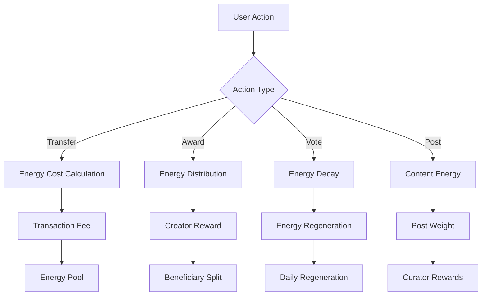

**Diagram sources**
- [class/VIZ/Transaction.php](file://class/VIZ/Transaction.php#L726-L748)

**Energy System Components:**
- **Energy Decay**: Energy decreases over time
- **Regeneration**: Energy regenerates based on VESTS holdings
- **Allocation**: Energy determines voting power and posting capacity
- **Distribution**: Energy-based rewards for content creators

**Section sources**
- [class/VIZ/Transaction.php](file://class/VIZ/Transaction.php#L726-L748)

## Advanced Blockchain Features

The VIZ PHP Library supports numerous advanced blockchain features:

### Multi-Signature Transactions

Multi-signature support enables collaborative account management:

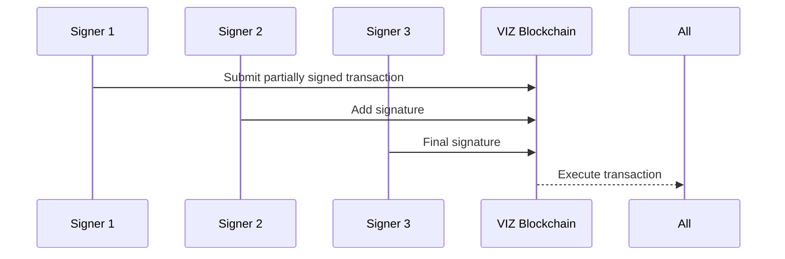

**Diagram sources**
- [class/VIZ/Transaction.php](file://class/VIZ/Transaction.php#L158-L190)

### Queued Operations

Batch operation processing for efficient transaction management:

**Section sources**
- [class/VIZ/Transaction.php](file://class/VIZ/Transaction.php#L1310-L1328)
- [class/VIZ/Transaction.php](file://class/VIZ/Transaction.php#L42-L52)

## Examples and Use Cases

### Social Media Reward System

Implementing a decentralized social platform with automatic reward distribution:

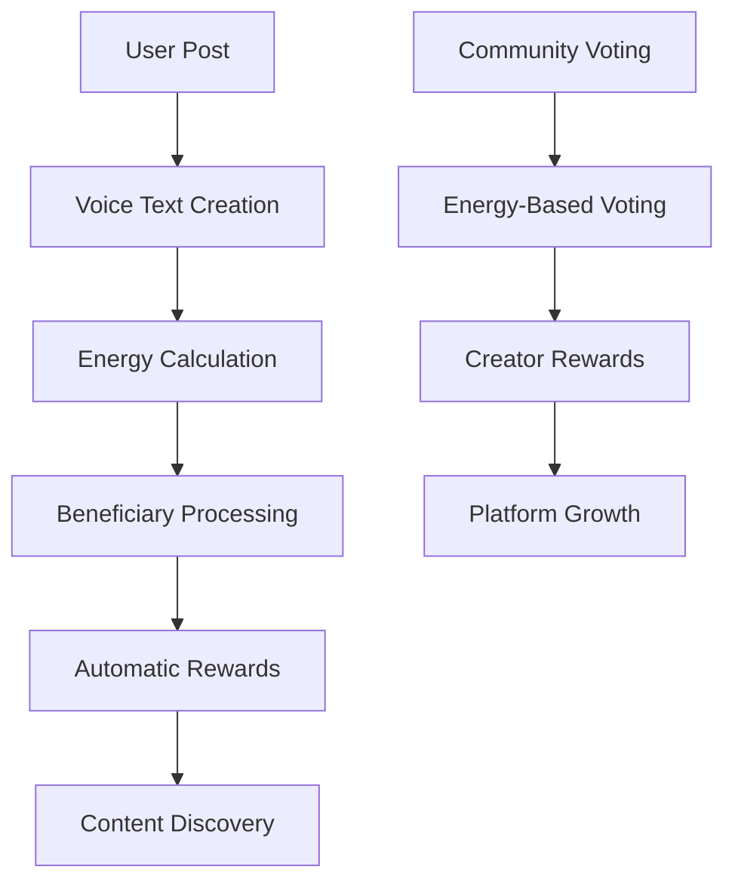

### Invitation-Based User Acquisition

Creating referral programs with automatic reward distribution:

**Section sources**
- [README.md](file://README.md#L137-L162)

### Automated Reward Distribution

Setting up recurring reward systems for content creators:

**Section sources**
- [README.md](file://README.md#L97-L135)

## Troubleshooting Guide

### Common Issues and Solutions

**Transaction Validation Errors:**
- Verify TAPoS block reference validity
- Check transaction expiration timestamps
- Ensure proper signature format

**Energy Calculation Issues:**
- Validate energy decay calculations
- Check VESTS-to-energy conversion rates
- Monitor daily energy regeneration

**Multi-Signature Problems:**
- Verify required signature thresholds
- Check authority weight validation
- Ensure proper key encoding

**Network Connectivity:**
- Verify JSON-RPC endpoint accessibility
- Check SSL/TLS certificate validation
- Monitor API method availability

**Section sources**
- [class/VIZ/Transaction.php](file://class/VIZ/Transaction.php#L61-L156)
- [class/VIZ/JsonRPC.php](file://class/VIZ/JsonRPC.php#L311-L353)

## Conclusion

The VIZ PHP Library provides comprehensive support for specialized blockchain operations including award systems, invite management, vesting routes, and custom operations. The library's modular architecture enables developers to build sophisticated applications leveraging VIZ blockchain capabilities.

Key strengths include:
- **Flexible Operation Building**: Extensive support for specialized blockchain operations
- **Energy Mechanics**: Sophisticated reward distribution systems
- **Voice Protocol Integration**: Decentralized social media functionality
- **Multi-Signature Support**: Collaborative account management
- **Cryptographic Security**: Robust key management and signature verification

The library serves as a foundation for building next-generation decentralized applications on the VIZ blockchain, enabling innovative social platforms, reward systems, and community-driven networks.