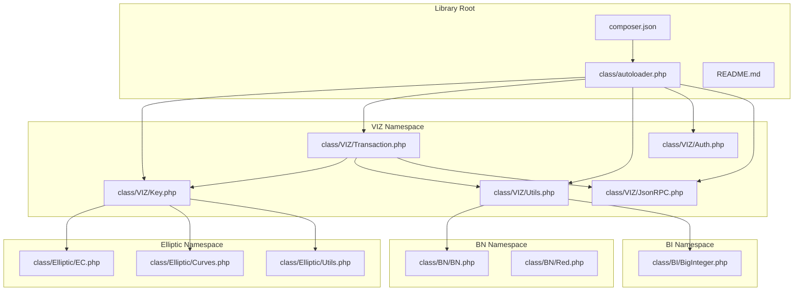
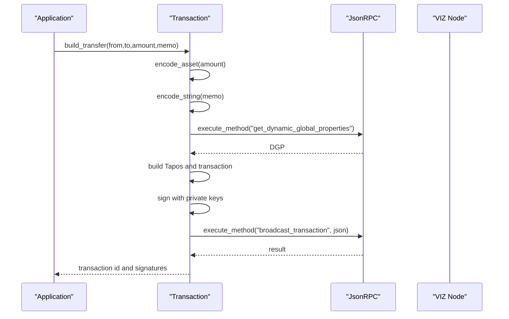
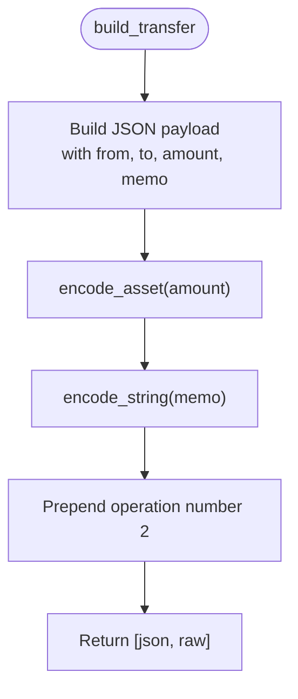
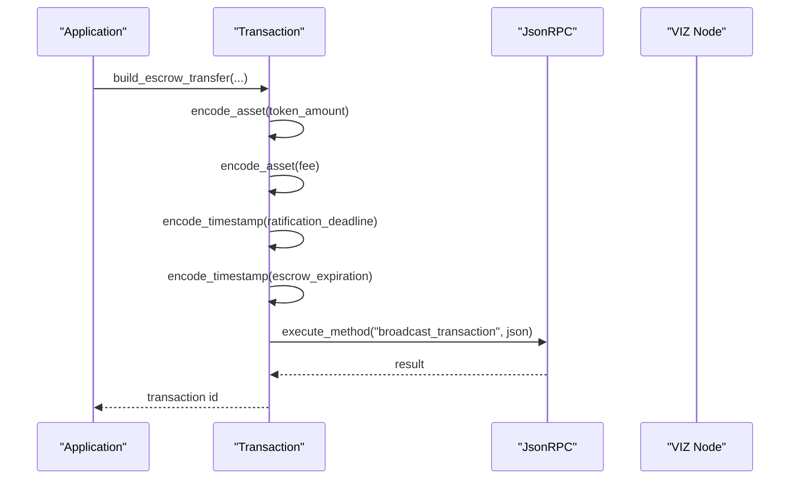
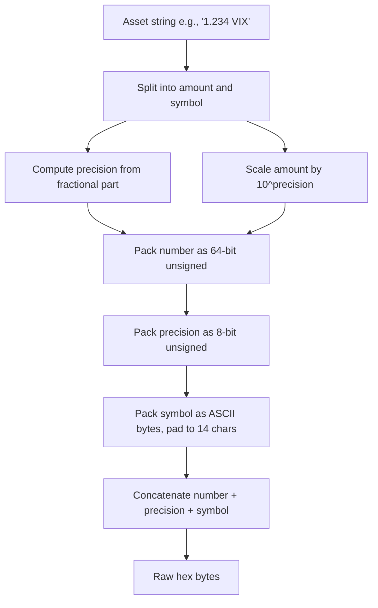
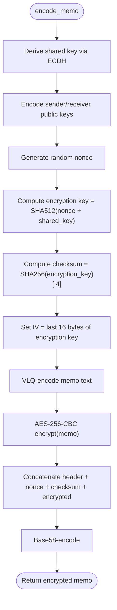
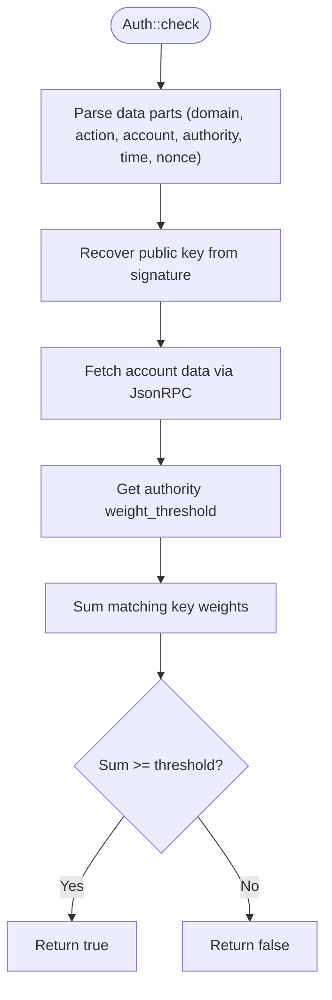
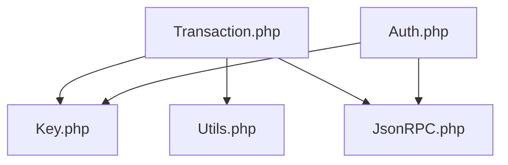

# Transfer Operations

<cite>
**Referenced Files in This Document**
- [README.md](file://README.md)
- [composer.json](file://composer.json)
- [class/autoloader.php](file://class/autoloader.php)
- [class/VIZ/Transaction.php](file://class/VIZ/Transaction.php)
- [class/VIZ/Key.php](file://class/VIZ/Key.php)
- [class/VIZ/Utils.php](file://class/VIZ/Utils.php)
- [class/VIZ/Auth.php](file://class/VIZ/Auth.php)
- [class/VIZ/JsonRPC.php](file://class/VIZ/JsonRPC.php)
</cite>

## Table of Contents
1. [Introduction](#introduction)
2. [Project Structure](#project-structure)
3. [Core Components](#core-components)
4. [Architecture Overview](#architecture-overview)
5. [Detailed Component Analysis](#detailed-component-analysis)
6. [Dependency Analysis](#dependency-analysis)
7. [Performance Considerations](#performance-considerations)
8. [Troubleshooting Guide](#troubleshooting-guide)
9. [Conclusion](#conclusion)
10. [Appendices](#appendices)

## Introduction
This document explains transfer-related operations in the VIZ PHP Library, focusing on:
- Basic transfers
- Escrow transfers
- Delegation operations
- Transfer operation builder parameters (sender, receiver, amount, memo)
- Asset encoding formats
- Memo encryption mechanisms
- Transfer validation requirements
- Examples for simple token transfers, multi-signature transfers, and complex transfer scenarios with escrow mechanisms

It consolidates the implementation details from the Transaction, Key, Utils, Auth, and JsonRPC components to help both technical and non-technical users understand how to construct, sign, and broadcast transfer operations on the VIZ blockchain.

## Project Structure
The library is organized around four primary namespaces:
- VIZ: cryptographic keys, transactions, JSON-RPC client, and utilities
- BN: big number arithmetic
- BI: big integer wrappers
- Elliptic: elliptic curve cryptography

The autoloader enables PSR-4 loading for these namespaces, and Composer configuration defines classmap and PSR-4 autoload rules.

**Diagram sources**
- [class/autoloader.php](file://class/autoloader.php#L1-L14)
- [composer.json](file://composer.json#L19-L28)
- [class/VIZ/Transaction.php](file://class/VIZ/Transaction.php#L1-L24)
- [class/VIZ/Key.php](file://class/VIZ/Key.php#L1-L32)

**Section sources**
- [README.md](file://README.md#L1-L18)
- [composer.json](file://composer.json#L19-L28)
- [class/autoloader.php](file://class/autoloader.php#L1-L14)

## Core Components
This section highlights the components essential for transfer operations.

- Transaction: Builds and signs operations, encodes assets and strings, constructs transactions, and executes them via JSON-RPC.
- Key: Manages private/public keys, signatures, shared secrets, and memo encryption/decryption compatible with the VIZ JS library.
- Utils: Provides Base58 encoding/decoding, AES-256-CBC encryption/decryption, VLQ encoding, and other cryptographic helpers.
- Auth: Validates passwordless authentication data against chain authority thresholds.
- JsonRPC: Wraps JSON-RPC calls to the VIZ node for dynamic global properties, account data, and broadcasting.

Key transfer-related methods:
- Transfer builder: build_transfer
- Escrow builders: build_escrow_transfer, build_escrow_dispute, build_escrow_release, build_escrow_approve
- Delegation: build_delegate_vesting_shares
- Asset encoding: encode_asset
- String encoding: encode_string
- Memo encryption/decryption: Key::encode_memo, Key::decode_memo
- Transaction building and signing: Transaction::build, Transaction::execute

**Section sources**
- [class/VIZ/Transaction.php](file://class/VIZ/Transaction.php#L866-L879)
- [class/VIZ/Transaction.php](file://class/VIZ/Transaction.php#L788-L811)
- [class/VIZ/Transaction.php](file://class/VIZ/Transaction.php#L812-L847)
- [class/VIZ/Transaction.php](file://class/VIZ/Transaction.php#L848-L865)
- [class/VIZ/Transaction.php](file://class/VIZ/Transaction.php#L902-L913)
- [class/VIZ/Transaction.php](file://class/VIZ/Transaction.php#L1329-L1345)
- [class/VIZ/Transaction.php](file://class/VIZ/Transaction.php#L1350-L1353)
- [class/VIZ/Key.php](file://class/VIZ/Key.php#L45-L86)
- [class/VIZ/Key.php](file://class/VIZ/Key.php#L87-L176)
- [class/VIZ/JsonRPC.php](file://class/VIZ/JsonRPC.php#L311-L353)

## Architecture Overview
The transfer workflow spans several components:
- Application constructs a transfer operation using Transaction::build_transfer
- Transaction encodes parameters and assets
- Transaction retrieves Tapos data and builds the transaction envelope
- Private keys sign the transaction
- Transaction::execute broadcasts via JsonRPC

**Diagram sources**
- [class/VIZ/Transaction.php](file://class/VIZ/Transaction.php#L866-L879)
- [class/VIZ/Transaction.php](file://class/VIZ/Transaction.php#L61-L157)
- [class/VIZ/JsonRPC.php](file://class/VIZ/JsonRPC.php#L311-L353)

## Detailed Component Analysis

### Transfer Operation Builder
The transfer builder creates a transfer operation with the following parameters:
- from: sender account
- to: receiver account
- amount: asset string in the form "<amount> <symbol>"
- memo: memo string

Implementation details:
- JSON payload construction with quoted fields
- Raw binary encoding using encode_asset for amount and encode_string for memo
- Operation number 2 is prepended to raw data

Validation and encoding:
- Amount must be a valid asset string with symbol and precision
- Memo is VLQ-encoded and then hex-encoded
- Sender and receiver must be valid account names

**Diagram sources**
- [class/VIZ/Transaction.php](file://class/VIZ/Transaction.php#L866-L879)

**Section sources**
- [class/VIZ/Transaction.php](file://class/VIZ/Transaction.php#L866-L879)

### Escrow Transfer Operations
Escrow operations enable multi-party mediated transfers. The library supports:
- Escrow transfer creation
- Dispute resolution
- Release of funds
- Approval of escrow

Parameters and encoding:
- Escrow transfer requires from, to, token_amount, escrow_id, agent, fee, json_metadata, ratification_deadline, escrow_expiration
- All amounts are encoded via encode_asset
- Timestamps are encoded via encode_timestamp or encode_unixtime
- Strings are encoded via encode_string

**Diagram sources**
- [class/VIZ/Transaction.php](file://class/VIZ/Transaction.php#L788-L811)
- [class/VIZ/JsonRPC.php](file://class/VIZ/JsonRPC.php#L311-L353)

**Section sources**
- [class/VIZ/Transaction.php](file://class/VIZ/Transaction.php#L788-L811)
- [class/VIZ/Transaction.php](file://class/VIZ/Transaction.php#L812-L847)
- [class/VIZ/Transaction.php](file://class/VIZ/Transaction.php#L848-L865)

### Delegation Operations
Delegation allows transferring vesting shares from one account to another. The builder:
- Encodes delegator, delegatee, and vesting_shares using encode_asset
- Prepends operation number 19

Validation:
- Delegator must have sufficient vesting shares
- Delegatee must be a valid account

**Section sources**
- [class/VIZ/Transaction.php](file://class/VIZ/Transaction.php#L902-L913)

### Asset Encoding Format
Assets are encoded as:
- Number (scaled by precision)
- Precision byte
- Asset symbol bytes (padded to fixed length)

The encoder extracts symbol and precision from the asset string and packs them accordingly.

**Diagram sources**
- [class/VIZ/Transaction.php](file://class/VIZ/Transaction.php#L1329-L1345)

**Section sources**
- [class/VIZ/Transaction.php](file://class/VIZ/Transaction.php#L1329-L1345)

### Memo Encryption Mechanism
Memo encryption uses a shared secret derived from ephemeral keys and AES-256-CBC:
- Derive shared key using ECDH
- Construct encrypted memo header with sender and receiver public keys
- Generate random nonce and compute encryption key from nonce + shared key
- Compute checksum and IV from encryption key
- Encrypt memo with VLQ length and memo text
- Base58-encode the entire structure

Decryption reverses the process:
- Decode Base58
- Extract sender/receiver keys, nonce, checksum, and encrypted payload
- Recompute encryption key and verify checksum
- Decrypt payload and strip VLQ length

**Diagram sources**
- [class/VIZ/Key.php](file://class/VIZ/Key.php#L45-L86)

**Section sources**
- [class/VIZ/Key.php](file://class/VIZ/Key.php#L45-L86)
- [class/VIZ/Key.php](file://class/VIZ/Key.php#L87-L176)
- [class/VIZ/Utils.php](file://class/VIZ/Utils.php#L291-L320)
- [class/VIZ/Utils.php](file://class/VIZ/Utils.php#L322-L383)

### Transfer Authorization Requirements
Authorization is validated by:
- Recovering the public key from the signed data
- Fetching the account’s authority thresholds and key weights
- Verifying that the recovered key weight meets the threshold for the specified authority

**Diagram sources**
- [class/VIZ/Auth.php](file://class/VIZ/Auth.php#L25-L69)
- [class/VIZ/JsonRPC.php](file://class/VIZ/JsonRPC.php#L311-L353)

**Section sources**
- [class/VIZ/Auth.php](file://class/VIZ/Auth.php#L25-L69)
- [class/VIZ/JsonRPC.php](file://class/VIZ/JsonRPC.php#L311-L353)

## Dependency Analysis
The following diagram shows key dependencies among components involved in transfer operations.

**Diagram sources**
- [class/VIZ/Transaction.php](file://class/VIZ/Transaction.php#L1-L24)
- [class/VIZ/Key.php](file://class/VIZ/Key.php#L1-L32)
- [class/VIZ/Utils.php](file://class/VIZ/Utils.php#L1-L7)
- [class/VIZ/JsonRPC.php](file://class/VIZ/JsonRPC.php#L1-L17)
- [class/VIZ/Auth.php](file://class/VIZ/Auth.php#L1-L24)

**Section sources**
- [class/VIZ/Transaction.php](file://class/VIZ/Transaction.php#L1-L24)
- [class/VIZ/Key.php](file://class/VIZ/Key.php#L1-L32)
- [class/VIZ/Utils.php](file://class/VIZ/Utils.php#L1-L7)
- [class/VIZ/JsonRPC.php](file://class/VIZ/JsonRPC.php#L1-L17)
- [class/VIZ/Auth.php](file://class/VIZ/Auth.php#L1-L24)

## Performance Considerations
- Asset encoding and memo encryption involve hashing and symmetric encryption; performance depends on OpenSSL availability and hardware acceleration.
- Multi-signature transactions increase signing overhead proportionally to the number of private keys.
- Broadcasting via JSON-RPC introduces network latency; consider batching operations using queue mode to reduce round trips.

[No sources needed since this section provides general guidance]

## Troubleshooting Guide
Common issues and resolutions:
- Asset format errors: Ensure amount includes symbol and correct precision; use the format "<amount> <symbol>".
- Memo decryption failures: Verify the correct private key is used; confirm Base58 decoding succeeds and checksum matches.
- Transaction broadcast failures: Confirm Tapos block retrieval succeeded and expiration is in the future; verify signatures are canonical.
- Authority validation failures: Ensure the account’s authority threshold is met by the recovered public key weights.

**Section sources**
- [class/VIZ/Transaction.php](file://class/VIZ/Transaction.php#L1329-L1345)
- [class/VIZ/Key.php](file://class/VIZ/Key.php#L87-L176)
- [class/VIZ/JsonRPC.php](file://class/VIZ/JsonRPC.php#L311-L353)
- [class/VIZ/Auth.php](file://class/VIZ/Auth.php#L25-L69)

## Conclusion
The VIZ PHP Library provides robust primitives for constructing and validating transfer operations:
- Transfer builder with sender, receiver, amount, and memo
- Escrow operations for multi-party mediated transfers
- Delegation of vesting shares
- Secure memo encryption compatible with the VIZ ecosystem
- Transaction building, signing, and broadcasting via JSON-RPC
- Authority validation aligned with chain thresholds

These components collectively enable secure, flexible, and auditable transfer workflows across simple and complex scenarios.

[No sources needed since this section summarizes without analyzing specific files]

## Appendices

### Example Scenarios

- Simple token transfer
  - Use Transaction::build_transfer with from, to, amount, and memo
  - Sign and broadcast via Transaction::execute

- Multi-signature transfer
  - Activate queue mode, add multiple operations, end queue, then sign additional signatures using Transaction::add_signature

- Escrow transfer
  - Use Transaction::build_escrow_transfer with from, to, token_amount, escrow_id, agent, fee, json_metadata, ratification_deadline, escrow_expiration
  - Optionally dispute or approve via build_escrow_dispute/build_escrow_approve and release via build_escrow_release

- Memo encryption
  - Use Key::encode_memo(sender_public_key, memo) to encrypt
  - Use Key::decode_memo(encrypted_memo) to decrypt with the corresponding private key

**Section sources**
- [class/VIZ/Transaction.php](file://class/VIZ/Transaction.php#L866-L879)
- [class/VIZ/Transaction.php](file://class/VIZ/Transaction.php#L788-L811)
- [class/VIZ/Transaction.php](file://class/VIZ/Transaction.php#L812-L847)
- [class/VIZ/Transaction.php](file://class/VIZ/Transaction.php#L848-L865)
- [class/VIZ/Key.php](file://class/VIZ/Key.php#L45-L86)
- [class/VIZ/Key.php](file://class/VIZ/Key.php#L87-L176)
- [README.md](file://README.md#L97-L135)