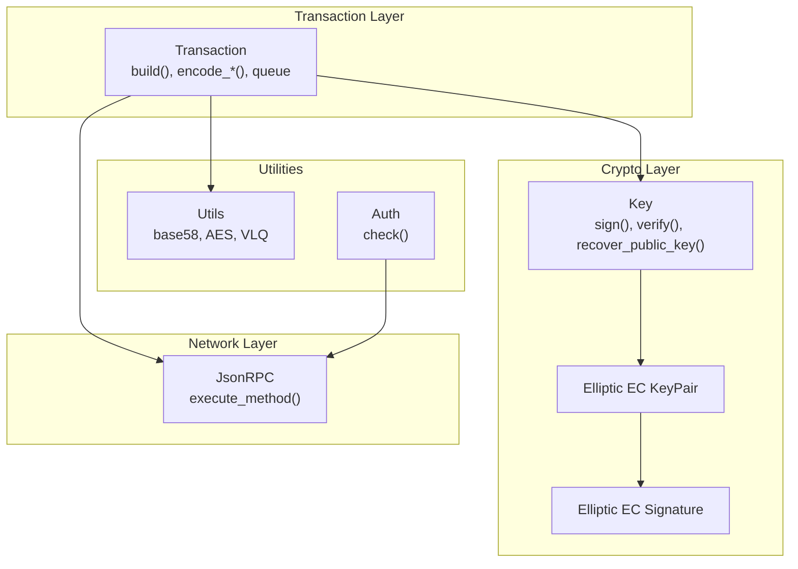
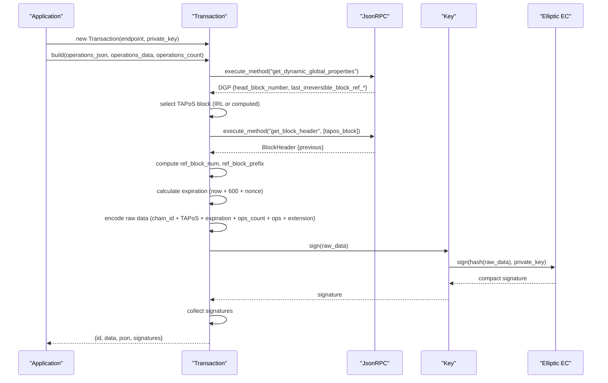
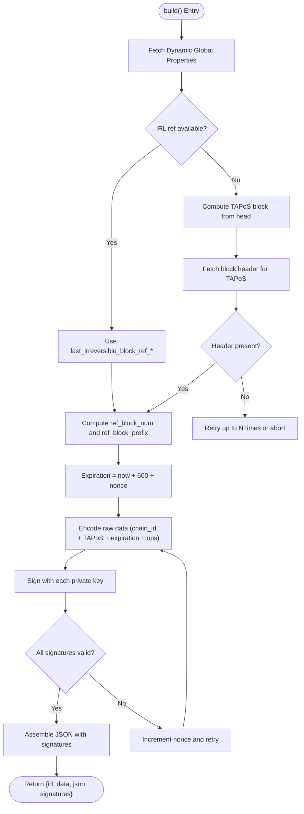
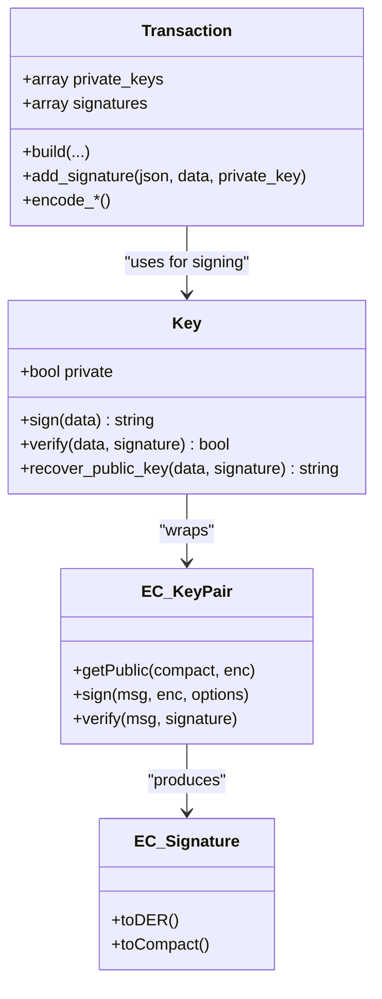
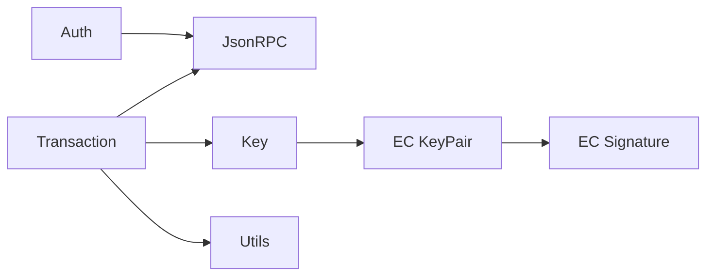

# Transaction Construction

<cite>
**Referenced Files in This Document**
- [Transaction.php](file://class/VIZ/Transaction.php)
- [Key.php](file://class/VIZ/Key.php)
- [JsonRPC.php](file://class/VIZ/JsonRPC.php)
- [Utils.php](file://class/VIZ/Utils.php)
- [Auth.php](file://class/VIZ/Auth.php)
- [KeyPair.php](file://class/Elliptic/EC/KeyPair.php)
- [Signature.php](file://class/Elliptic/EC/Signature.php)
- [README.md](file://README.md)
</cite>

## Table of Contents
1. [Introduction](#introduction)
2. [Project Structure](#project-structure)
3. [Core Components](#core-components)
4. [Architecture Overview](#architecture-overview)
5. [Detailed Component Analysis](#detailed-component-analysis)
6. [Dependency Analysis](#dependency-analysis)
7. [Performance Considerations](#performance-considerations)
8. [Troubleshooting Guide](#troubleshooting-guide)
9. [Conclusion](#conclusion)

## Introduction
This document explains the complete transaction construction workflow in the VIZ PHP library, from initialization to signature generation. It covers the build() method, TAPoS block reference handling, expiration time calculation, raw data encoding, transaction header structure, multi-signature support, private key management, and signature aggregation. Practical examples demonstrate basic transaction construction, error handling during signing, and nonce-based retry mechanisms for signature generation.

## Project Structure
The transaction construction logic is primarily implemented in the Transaction class, with cryptographic signing handled by the Key class and elliptic curve primitives. JSON-RPC communication with the VIZ node is encapsulated in the JsonRPC class. Utility functions for encoding and encryption are provided by the Utils class. Authentication helpers are in the Auth class.

**Diagram sources**
- [Transaction.php](file://class/VIZ/Transaction.php#L61-L157)
- [Key.php](file://class/VIZ/Key.php#L302-L338)
- [JsonRPC.php](file://class/VIZ/JsonRPC.php#L311-L353)
- [Utils.php](file://class/VIZ/Utils.php#L209-L413)
- [Auth.php](file://class/VIZ/Auth.php#L25-L69)

**Section sources**
- [Transaction.php](file://class/VIZ/Transaction.php#L1-L157)
- [Key.php](file://class/VIZ/Key.php#L1-L353)
- [JsonRPC.php](file://class/VIZ/JsonRPC.php#L1-L354)
- [Utils.php](file://class/VIZ/Utils.php#L1-L413)
- [Auth.php](file://class/VIZ/Auth.php#L1-L70)

## Core Components
- Transaction: Orchestrates transaction building, TAPoS resolution, expiration calculation, raw data encoding, and signature aggregation. Supports single and multi-operation queues and manual signature addition.
- Key: Manages private/public keys, signing, verification, and public key recovery. Provides canonical compact signatures.
- JsonRPC: Handles node communication for dynamic global properties, block headers, and broadcasting transactions.
- Utils: Provides base58 encoding/decoding, AES-256-CBC encryption/decryption, and VLQ encoding for variable-length strings.
- Auth: Validates passwordless authentication data against account authorities.

**Section sources**
- [Transaction.php](file://class/VIZ/Transaction.php#L10-L24)
- [Key.php](file://class/VIZ/Key.php#L9-L32)
- [JsonRPC.php](file://class/VIZ/JsonRPC.php#L4-L22)
- [Utils.php](file://class/VIZ/Utils.php#L7-L27)
- [Auth.php](file://class/VIZ/Auth.php#L9-L24)

## Architecture Overview
The transaction construction pipeline integrates with the VIZ node to resolve TAPoS references, compute expiration, assemble raw transaction data, and produce signatures. The resulting transaction JSON includes the transaction header, operations, extensions, and aggregated signatures.

**Diagram sources**
- [Transaction.php](file://class/VIZ/Transaction.php#L61-L157)
- [JsonRPC.php](file://class/VIZ/JsonRPC.php#L311-L353)
- [Key.php](file://class/VIZ/Key.php#L302-L311)

## Detailed Component Analysis

### Transaction.build() Workflow
The build() method coordinates the entire transaction construction process:
- Retrieves dynamic global properties to determine TAPoS block and reference values.
- Resolves TAPoS block header to extract previous block hash for ref_block_prefix.
- Computes expiration time with a 10-minute buffer plus a nonce-based retry mechanism.
- Encodes raw transaction data using chain_id, TAPoS, expiration, operations count, operations payload, and extension.
- Signs the raw data with each configured private key and aggregates signatures.
- Produces the final transaction JSON with header fields and signatures.

**Diagram sources**
- [Transaction.php](file://class/VIZ/Transaction.php#L61-L157)

**Section sources**
- [Transaction.php](file://class/VIZ/Transaction.php#L61-L157)

### TAPoS Block Reference Handling
- If last_irreversible_block_ref_* fields are available, the transaction uses the irreversible reference directly.
- Otherwise, the TAPoS block is derived from the head block number, and the block header is fetched to extract the previous hash for ref_block_prefix.
- The ref_block_num is the lower 16 bits of the TAPoS block number.

**Section sources**
- [Transaction.php](file://class/VIZ/Transaction.php#L69-L113)

### Expiration Time Calculation
- Expiration is set to current Unix time plus 600 seconds (10 minutes) plus a nonce.
- The nonce increments automatically when a signature fails to be produced in canonical form, enabling a retry mechanism.

**Section sources**
- [Transaction.php](file://class/VIZ/Transaction.php#L117-L144)

### Raw Data Encoding
The raw transaction data is constructed as:
- chain_id (32 bytes)
- ref_block_num (2 bytes)
- ref_block_prefix (4 bytes)
- expiration (4 bytes)
- operations_count (1 byte)
- operations_data (variable length)
- extensions (1 byte, 0x00 for standard transactions)

Encoding helpers:
- encode_asset(): Encodes asset amounts with precision and symbol.
- encode_string(): Encodes strings with VLQ length prefix.
- encode_timestamp()/encode_unixtime(): Encodes timestamps as 32-bit integers.
- encode_bool()/encode_int16()/encode_uint8()/encode_uint16()/encode_uint32()/encode_uint64(): Encodes primitive types.
- encode_int(): Encodes fixed-width integers with byte order reversal.
- encode_array(): Recursively encodes arrays with type templates.

**Section sources**
- [Transaction.php](file://class/VIZ/Transaction.php#L1329-L1415)

### Transaction Header Structure
The transaction JSON header fields include:
- ref_block_num: Lower 16 bits of the TAPoS block number.
- ref_block_prefix: 4-byte prefix extracted from the previous hash of the TAPoS block header.
- expiration: ISO-like date string representing the expiration time.
- operations: Array of operation JSON objects.
- extensions: Array of extension objects (empty for standard transactions).
- signatures: Array of aggregated signatures.

**Section sources**
- [Transaction.php](file://class/VIZ/Transaction.php#L148-L156)

### Multi-Signature Support and Private Key Management
- Private keys are stored in an array and signed sequentially.
- Each signature is produced by hashing the raw transaction data and signing with the elliptic curve.
- Canonical compact signatures are enforced; if a signature cannot be produced in canonical form, the nonce is incremented and the signing loop retries.
- Manual signature addition is supported via add_signature(), allowing external keys to contribute signatures.

**Diagram sources**
- [Transaction.php](file://class/VIZ/Transaction.php#L17-L20)
- [Key.php](file://class/VIZ/Key.php#L302-L311)
- [KeyPair.php](file://class/Elliptic/EC/KeyPair.php#L122-L128)
- [Signature.php](file://class/Elliptic/EC/Signature.php#L188-L207)

**Section sources**
- [Transaction.php](file://class/VIZ/Transaction.php#L132-L144)
- [Key.php](file://class/VIZ/Key.php#L302-L311)
- [KeyPair.php](file://class/Elliptic/EC/KeyPair.php#L122-L128)
- [Signature.php](file://class/Elliptic/EC/Signature.php#L188-L207)

### Queue Mode and Multi-Operation Transactions
- Queue mode allows batching multiple operations into a single transaction.
- Operations are queued and then built together with a single expiration and signatures.
- The queue is ended by invoking end_queue(), which triggers build() with aggregated operations.

**Section sources**
- [Transaction.php](file://class/VIZ/Transaction.php#L1310-L1328)

### Practical Examples

#### Basic Transaction Construction
- Initialize a Transaction with an endpoint and private key.
- Build a single operation (e.g., award) and execute it.
- Inspect the returned transaction data, JSON, and signatures.

**Section sources**
- [README.md](file://README.md#L97-L112)

#### Multi-Operations and Multi-Signature
- Enable queue mode, add multiple operations, and end the queue to build a single transaction.
- Optionally add an additional signature using add_signature().

**Section sources**
- [README.md](file://README.md#L113-L135)

#### Account Creation with Authorities
- Construct an account creation transaction with master, active, and regular authorities.
- Provide public keys and weights; ensure proper sorting of key_auths.

**Section sources**
- [README.md](file://README.md#L241-L283)

#### Proposal Operations
- Build proposal_create with multiple proposed operations.
- Execute the proposal and later approve it with another account’s active key.

**Section sources**
- [README.md](file://README.md#L285-L309)

### Error Handling During Signing
- If a canonical signature cannot be produced, the nonce is incremented and signing is retried.
- The loop continues until all private keys produce valid signatures or an upper bound is reached.
- Manual signature addition returns false if signing fails.

**Section sources**
- [Transaction.php](file://class/VIZ/Transaction.php#L119-L144)
- [Transaction.php](file://class/VIZ/Transaction.php#L158-L190)

### Nonce-Based Retry Mechanism
- The nonce starts at zero and increments each time signing fails to produce a canonical signature.
- This ensures robustness against signature malleability and ECDSA variations.

**Section sources**
- [Transaction.php](file://class/VIZ/Transaction.php#L117-L144)

## Dependency Analysis
The Transaction class depends on JsonRPC for node queries, Key for cryptographic operations, and Utils for encoding utilities. The Key class wraps elliptic curve operations via EC KeyPair and Signature.

**Diagram sources**
- [Transaction.php](file://class/VIZ/Transaction.php#L1-L24)
- [JsonRPC.php](file://class/VIZ/JsonRPC.php#L1-L354)
- [Key.php](file://class/VIZ/Key.php#L1-L32)
- [KeyPair.php](file://class/Elliptic/EC/KeyPair.php#L1-L138)
- [Signature.php](file://class/Elliptic/EC/Signature.php#L1-L208)
- [Utils.php](file://class/VIZ/Utils.php#L1-L413)
- [Auth.php](file://class/VIZ/Auth.php#L1-L70)

**Section sources**
- [Transaction.php](file://class/VIZ/Transaction.php#L1-L24)
- [JsonRPC.php](file://class/VIZ/JsonRPC.php#L1-L354)
- [Key.php](file://class/VIZ/Key.php#L1-L32)
- [KeyPair.php](file://class/Elliptic/EC/KeyPair.php#L1-L138)
- [Signature.php](file://class/Elliptic/EC/Signature.php#L1-L208)
- [Utils.php](file://class/VIZ/Utils.php#L1-L413)
- [Auth.php](file://class/VIZ/Auth.php#L1-L70)

## Performance Considerations
- TAPoS resolution involves fetching block headers; caching or limiting retries can reduce latency.
- Batch operations in queue mode to minimize network round-trips.
- Canonical signature enforcement may require retries; consider batching multiple private keys to reduce total signing attempts.
- Base58 and AES operations are CPU-intensive; avoid unnecessary re-encoding.

## Troubleshooting Guide
- Node connectivity errors: Verify endpoint and SSL settings; check JsonRPC status codes and timeouts.
- Missing or invalid dynamic global properties: Ensure the node is synced and reachable.
- Signature generation failures: Confirm private keys are valid and canonical signatures are supported; review nonce-based retry behavior.
- Authority validation failures: Ensure account authorities match expected keys and weights for the target operation.

**Section sources**
- [JsonRPC.php](file://class/VIZ/JsonRPC.php#L311-L353)
- [Auth.php](file://class/VIZ/Auth.php#L25-L69)

## Conclusion
The VIZ PHP library provides a robust, modular transaction construction pipeline. The Transaction class centralizes TAPoS handling, expiration calculation, raw data encoding, and signature aggregation, while the Key class ensures secure and canonical signing. Queue mode enables efficient multi-operation transactions, and manual signature addition supports multi-signature workflows. The included examples and error-handling patterns facilitate reliable integration.