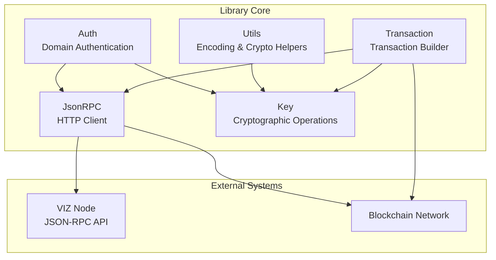
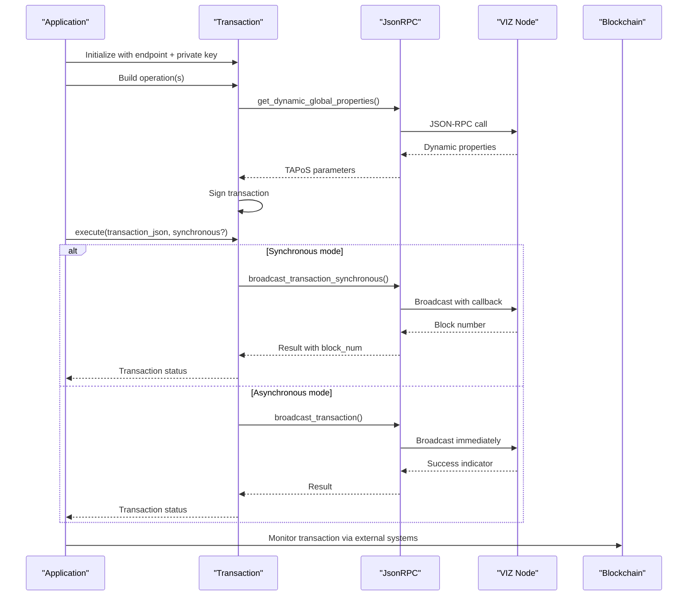
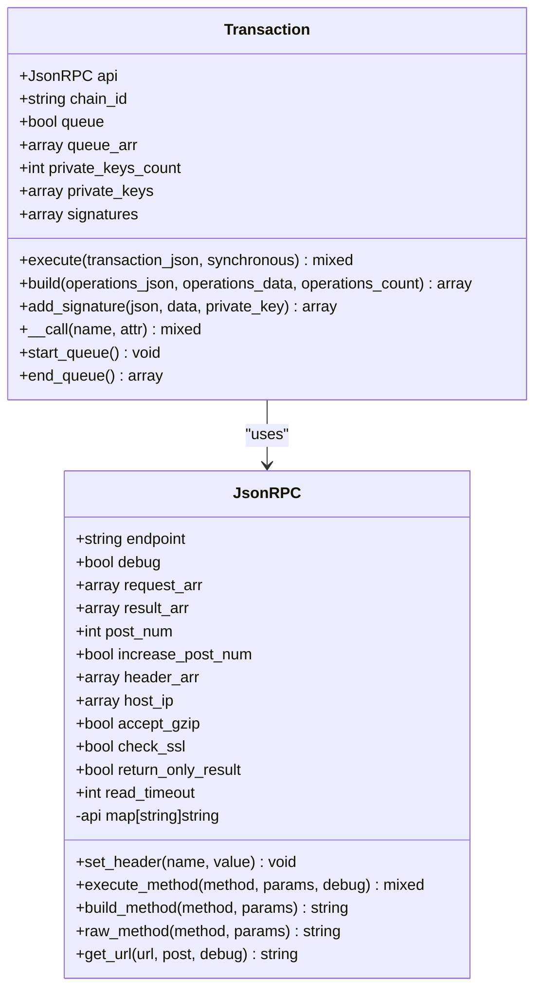
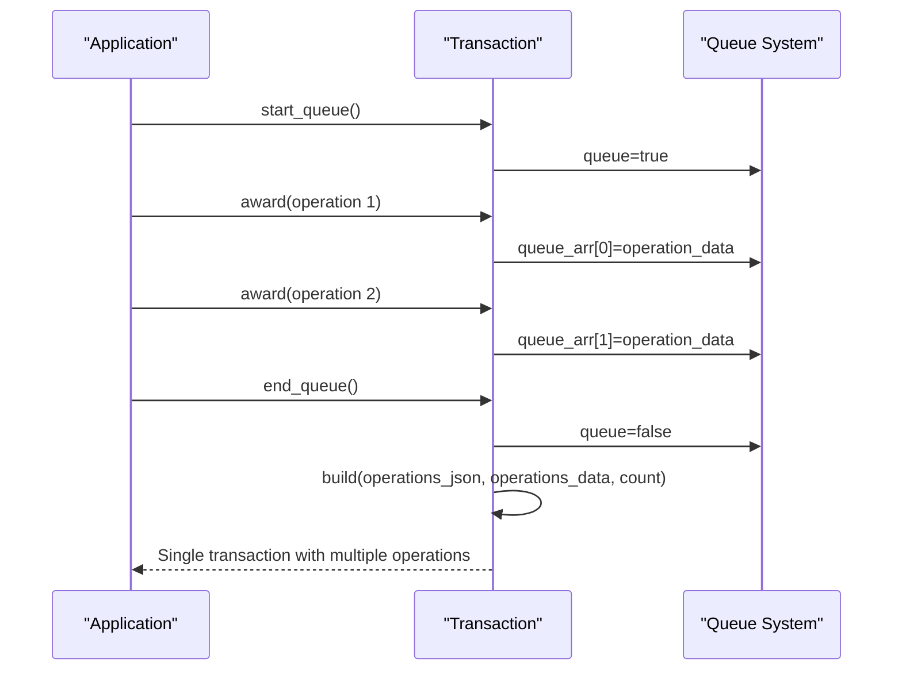
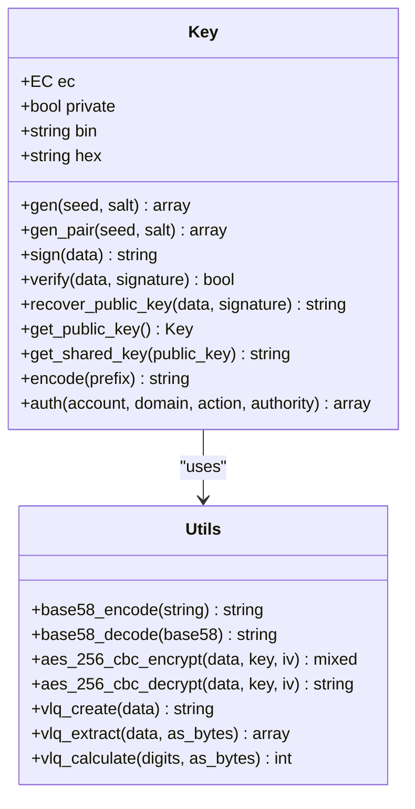
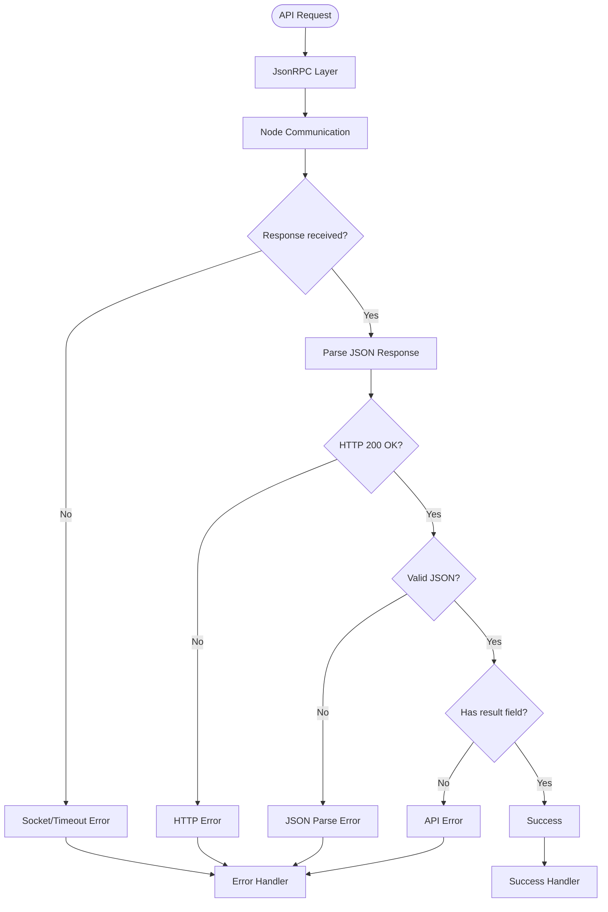
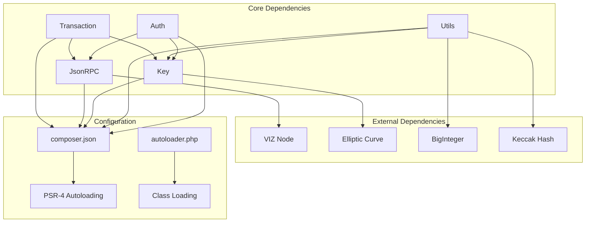

# Transaction Execution

<cite>
**Referenced Files in This Document**
- [Transaction.php](file://class/VIZ/Transaction.php)
- [JsonRPC.php](file://class/VIZ/JsonRPC.php)
- [Key.php](file://class/VIZ/Key.php)
- [Utils.php](file://class/VIZ/Utils.php)
- [Auth.php](file://class/VIZ/Auth.php)
- [README.md](file://README.md)
- [composer.json](file://composer.json)
- [autoloader.php](file://class/autoloader.php)
</cite>

## Table of Contents
1. [Introduction](#introduction)
2. [Project Structure](#project-structure)
3. [Core Components](#core-components)
4. [Architecture Overview](#architecture-overview)
5. [Detailed Component Analysis](#detailed-component-analysis)
6. [Dependency Analysis](#dependency-analysis)
7. [Performance Considerations](#performance-considerations)
8. [Troubleshooting Guide](#troubleshooting-guide)
9. [Conclusion](#conclusion)

## Introduction
This document provides comprehensive coverage of transaction execution in the VIZ PHP library, focusing on broadcasting mechanisms, synchronous versus asynchronous execution modes, and result processing. It explains the execute() method, JSON-RPC integration, error handling strategies, and transaction status monitoring. The relationship between Transaction and JsonRPC classes is clarified, along with automatic plugin routing and response parsing. Practical examples demonstrate different execution modes, error handling patterns, and integration with external systems.

## Project Structure
The library follows a modular structure with clear separation of concerns:
- VIZ namespace classes handle blockchain operations
- Utility classes provide cryptographic functions and helpers
- Composer configuration enables autoloading and PSR-4 compliance
- Examples in README demonstrate usage patterns



**Diagram sources**
- [Transaction.php](file://class/VIZ/Transaction.php#L10-L24)
- [JsonRPC.php](file://class/VIZ/JsonRPC.php#L4-L22)
- [Key.php](file://class/VIZ/Key.php#L9-L32)
- [Utils.php](file://class/VIZ/Utils.php#L7-L413)

**Section sources**
- [composer.json](file://composer.json#L19-L28)
- [autoloader.php](file://class/autoloader.php#L1-L14)

## Core Components
The transaction execution system centers around four primary components:

### Transaction Class
The Transaction class orchestrates the complete transaction lifecycle:
- Dynamic global property retrieval for TAPoS (Temporary Application Protocol on Steroids)
- Multi-operation queuing and batching
- Private key management and signature generation
- Transaction serialization and broadcasting

### JsonRPC Class
Provides native HTTP client functionality for VIZ node communication:
- Automatic plugin routing based on API method names
- JSON-RPC 2.0 protocol implementation
- Response parsing and error handling
- SSL/TLS support and timeout management

### Key Class
Handles cryptographic operations essential for transaction signing:
- Private/public key generation and management
- ECDSA signature creation and verification
- Public key recovery from signatures
- Domain authentication support

### Utils Class
Offers specialized utilities for Voice protocol and general operations:
- Voice text, publication, and event creation
- Base58 encoding/decoding
- AES-256-CBC encryption/decryption
- Variable-length quantity encoding

**Section sources**
- [Transaction.php](file://class/VIZ/Transaction.php#L10-L24)
- [JsonRPC.php](file://class/VIZ/JsonRPC.php#L4-L22)
- [Key.php](file://class/VIZ/Key.php#L9-L32)
- [Utils.php](file://class/VIZ/Utils.php#L7-L413)

## Architecture Overview
The transaction execution architecture implements a layered approach with clear boundaries between cryptographic operations, network communication, and blockchain-specific logic.



**Diagram sources**
- [Transaction.php](file://class/VIZ/Transaction.php#L53-L60)
- [JsonRPC.php](file://class/VIZ/JsonRPC.php#L311-L353)

The architecture demonstrates:
- Clear separation of concerns between transaction building and network communication
- Automatic plugin routing through the API method-to-plugin mapping
- Flexible execution modes supporting both immediate and callback-based verification
- Comprehensive error handling at multiple layers

## Detailed Component Analysis

### Transaction Execution Engine
The execute() method serves as the primary interface for transaction broadcasting, supporting both synchronous and asynchronous modes.

```mermaid
flowchart TD
Start([execute() called]) --> CheckSync{"synchronous parameter?"}
CheckSync --> |true| SyncMode["broadcast_transaction_synchronous"]
CheckSync --> |false| AsyncMode["broadcast_transaction"]
SyncMode --> RpcCall1["JsonRPC.execute_method()"]
AsyncMode --> RpcCall2["JsonRPC.execute_method()"]
RpcCall1 --> ParseResult1["Parse JSON-RPC response"]
RpcCall2 --> ParseResult2["Parse JSON-RPC response"]
ParseResult1 --> ReturnSync["Return result with block_num"]
ParseResult2 --> ReturnAsync["Return immediate result"]
ReturnSync --> End([Execution Complete])
ReturnAsync --> End
```

**Diagram sources**
- [Transaction.php](file://class/VIZ/Transaction.php#L53-L60)
- [JsonRPC.php](file://class/VIZ/JsonRPC.php#L311-L353)

#### Synchronous vs Asynchronous Execution
The execution modes differ fundamentally in their response characteristics:

**Asynchronous Mode (default)**:
- Immediate broadcast without waiting for confirmation
- Returns success/failure indicator quickly
- Suitable for high-throughput scenarios
- Requires external monitoring for finalization

**Synchronous Mode**:
- Waits for transaction inclusion in a block
- Returns block number where transaction was witnessed
- Provides immediate confirmation but with higher latency
- Ideal for critical operations requiring certainty

#### Broadcasting Mechanisms
The Transaction class delegates actual broadcasting to JsonRPC, which handles:
- Plugin routing based on API method names
- JSON-RPC 2.0 protocol compliance
- Response parsing and error extraction
- Timeout and SSL/TLS configuration

**Section sources**
- [Transaction.php](file://class/VIZ/Transaction.php#L53-L60)
- [JsonRPC.php](file://class/VIZ/JsonRPC.php#L311-L353)

### JSON-RPC Integration and Plugin Routing
The JsonRPC class implements automatic plugin routing through a comprehensive API method-to-plugin mapping.



**Diagram sources**
- [JsonRPC.php](file://class/VIZ/JsonRPC.php#L4-L354)
- [Transaction.php](file://class/VIZ/Transaction.php#L10-L24)

#### Automatic Plugin Routing
The API method-to-plugin mapping enables seamless routing to appropriate node plugins:

| API Method Category | Plugin Name | Example Methods |
|-------------------|-------------|----------------|
| Account Management | account_by_key | get_key_references |
| History Tracking | account_history | get_account_history |
| Committee Operations | committee_api | get_committee_request |
| Database Queries | database_api | get_dynamic_global_properties |
| Network Broadcasting | network_broadcast_api | broadcast_transaction |
| Operation History | operation_history | get_transaction |
| Paid Subscriptions | paid_subscription_api | get_paid_subscriptions |

This routing mechanism eliminates the need for explicit plugin specification, allowing developers to call API methods directly by name.

**Section sources**
- [JsonRPC.php](file://class/VIZ/JsonRPC.php#L29-L121)

### Transaction Building and Serialization
The Transaction class implements comprehensive transaction construction with multi-operation support and TAPoS integration.

```mermaid
flowchart TD
BuildStart([build() called]) --> GetDGP["get_dynamic_global_properties()"]
GetDGP --> CheckIRB{"Last irreversible block available?"}
CheckIRB --> |Yes| UseIRB["Use last_irreversible_block_ref_*"]
CheckIRB --> |No| CalcTAPoS["Calculate TAPoS parameters"]
UseIRB --> SetParams["Set ref_block_num/prefix"]
CalcTAPoS --> GetBlockHeader["get_block_header()"]
GetBlockHeader --> ExtractPrev["Extract previous block hash"]
ExtractPrev --> SetParams
SetParams --> CreateRaw["Create raw transaction data"]
CreateRaw --> SignData["Sign with private keys"]
SignData --> VerifySignatures{"All signatures valid?"}
VerifySignatures --> |No| RetryNonce["Increment nonce & retry"]
VerifySignatures --> |Yes| BuildJSON["Build JSON transaction"]
RetryNonce --> SignData
BuildJSON --> ReturnTx["Return transaction object"]
ReturnTx --> BuildEnd([Build Complete])
```

**Diagram sources**
- [Transaction.php](file://class/VIZ/Transaction.php#L61-L156)

#### Multi-Operation Queue System
The queue system enables batching multiple operations into a single transaction:



**Diagram sources**
- [Transaction.php](file://class/VIZ/Transaction.php#L1310-L1328)

#### Encoding and Serialization
The transaction builder implements comprehensive encoding for various data types:

| Data Type | Encoding Method | Purpose |
|-----------|----------------|---------|
| Assets | encode_asset() | Token amounts with precision |
| Strings | encode_string() | VLQ-encoded strings |
| Timestamps | encode_timestamp() | Unix timestamps |
| Booleans | encode_bool() | Boolean values |
| Integers | encode_int()/encode_uint*() | Fixed-width integers |
| Arrays | encode_array() | Complex nested structures |

**Section sources**
- [Transaction.php](file://class/VIZ/Transaction.php#L1329-L1415)

### Cryptographic Operations and Key Management
The Key class provides comprehensive cryptographic functionality essential for secure transaction signing.



**Diagram sources**
- [Key.php](file://class/VIZ/Key.php#L9-L353)
- [Utils.php](file://class/VIZ/Utils.php#L209-L413)

#### Signature Generation and Verification
The signing process incorporates multiple security measures:
- Canonical signature generation for deterministic outputs
- ECDSA secp256k1 curve for cryptographic strength
- Public key recovery capability for authentication
- Domain-specific authentication with time-based challenges

**Section sources**
- [Key.php](file://class/VIZ/Key.php#L302-L352)

### Error Handling Strategies
The system implements layered error handling across multiple components:



**Diagram sources**
- [JsonRPC.php](file://class/VIZ/JsonRPC.php#L311-L353)

#### Error Propagation Patterns
Errors propagate through the system with appropriate context:
- Socket/timeout errors return false from JsonRPC
- API method errors return false when result field missing
- JSON parsing failures handled gracefully
- Transaction building errors return false with validation failures

**Section sources**
- [JsonRPC.php](file://class/VIZ/JsonRPC.php#L311-L353)
- [Transaction.php](file://class/VIZ/Transaction.php#L62-L68)

### Integration with External Systems
The library provides multiple integration points for external system monitoring and verification:

#### Voice Protocol Integration
The Utils class offers comprehensive Voice protocol support:
- Text posts with reply/share/beneficiary support
- Publication posts with markdown rendering
- Event-based content modification (edit/add)
- Loop-based content organization

#### Authentication Integration
The Auth class enables domain-based authentication:
- Time-based challenge-response system
- Authority-specific validation (active/master/regular)
- Public key recovery from signatures
- Account authority weight threshold checking

**Section sources**
- [Utils.php](file://class/VIZ/Utils.php#L36-L208)
- [Auth.php](file://class/VIZ/Auth.php#L9-L70)

## Dependency Analysis
The transaction execution system exhibits well-structured dependencies with clear separation of concerns.



**Diagram sources**
- [composer.json](file://composer.json#L19-L28)
- [autoloader.php](file://class/autoloader.php#L1-L14)

### Coupling and Cohesion Analysis
- **Transaction class**: High cohesion around transaction building and execution, moderate coupling to JsonRPC
- **JsonRPC class**: High cohesion around network communication, low coupling to external systems
- **Key class**: High cohesion around cryptographic operations, moderate coupling to Utils
- **Utils class**: High cohesion around utility functions, low coupling to other components

### Potential Circular Dependencies
No circular dependencies detected in the current implementation. The design maintains clear unidirectional dependencies from Transaction → JsonRPC and Transaction → Key.

**Section sources**
- [composer.json](file://composer.json#L19-L28)
- [Transaction.php](file://class/VIZ/Transaction.php#L10-L24)

## Performance Considerations
Several factors impact transaction execution performance:

### Network Latency Optimization
- **Connection pooling**: JsonRPC caches resolved IP addresses to reduce DNS lookups
- **SSL/TLS optimization**: Reusable stream contexts for HTTPS connections
- **Timeout configuration**: Adjustable read timeouts for different network conditions

### Transaction Building Efficiency
- **Batch processing**: Queue system reduces network round trips for multiple operations
- **Lazy evaluation**: TAPoS parameters calculated only when needed
- **Memory management**: Efficient binary data handling for large transactions

### Cryptographic Performance
- **Curve selection**: secp256k1 provides optimal balance of security and performance
- **Canonical signatures**: Deterministic signature generation avoids retries
- **Shared key caching**: Efficient ECDH operations for memo encryption

## Troubleshooting Guide

### Common Transaction Execution Issues

#### Transaction Not Found After Broadcasting
**Symptoms**: execute() returns success but get_transaction() fails
**Causes**:
- Transaction expired (default 10-minute expiration)
- Incorrect chain ID configuration
- Network synchronization delays

**Solutions**:
- Verify dynamic global properties are current
- Check transaction expiration timestamp
- Confirm chain ID matches target network

#### Signature Validation Failures
**Symptoms**: Transactions rejected with signature errors
**Causes**:
- Non-canonical signatures
- Wrong private key for account
- Modified transaction data

**Solutions**:
- Ensure canonical signature generation
- Verify private key ownership
- Check transaction serialization integrity

#### Network Communication Errors
**Symptoms**: Socket timeouts or connection failures
**Causes**:
- Node unreachable or overloaded
- SSL certificate issues
- Firewall restrictions

**Solutions**:
- Test connectivity to VIZ node
- Configure SSL verification appropriately
- Adjust timeout settings

#### Authentication Failures
**Symptoms**: Domain authentication rejects valid signatures
**Causes**:
- Time drift between systems
- Wrong authority level
- Expired authentication data

**Solutions**:
- Synchronize system clocks
- Verify authority weight thresholds
- Regenerate authentication data

**Section sources**
- [Transaction.php](file://class/VIZ/Transaction.php#L118-L144)
- [JsonRPC.php](file://class/VIZ/JsonRPC.php#L169-L217)
- [Auth.php](file://class/VIZ/Auth.php#L25-L69)

## Conclusion
The VIZ PHP library provides a robust foundation for transaction execution with comprehensive support for both synchronous and asynchronous modes. The architecture demonstrates excellent separation of concerns, with clear boundaries between cryptographic operations, network communication, and blockchain-specific logic. The automatic plugin routing simplifies API interactions while maintaining flexibility for advanced use cases.

Key strengths of the implementation include:
- **Flexible execution modes** supporting both immediate and callback-based verification
- **Comprehensive error handling** at multiple layers with clear failure semantics
- **Efficient batch processing** capabilities for high-throughput scenarios
- **Robust cryptographic foundation** ensuring transaction security and authenticity
- **Extensible architecture** enabling integration with external monitoring systems

The library's design enables reliable transaction execution across diverse deployment scenarios while maintaining developer accessibility through clear APIs and comprehensive documentation.