# Transaction Management

<cite>
**Referenced Files in This Document**
- [Transaction.php](file://class/VIZ/Transaction.php)
- [JsonRPC.php](file://class/VIZ/JsonRPC.php)
- [Key.php](file://class/VIZ/Key.php)
- [Utils.php](file://class/VIZ/Utils.php)
- [Auth.php](file://class/VIZ/Auth.php)
- [README.md](file://README.md)
- [autoloader.php](file://class/autoloader.php)
</cite>

## Table of Contents
1. [Introduction](#introduction)
2. [Project Structure](#project-structure)
3. [Core Components](#core-components)
4. [Architecture Overview](#architecture-overview)
5. [Detailed Component Analysis](#detailed-component-analysis)
6. [Dependency Analysis](#dependency-analysis)
7. [Performance Considerations](#performance-considerations)
8. [Troubleshooting Guide](#troubleshooting-guide)
9. [Conclusion](#conclusion)
10. [Appendices](#appendices)

## Introduction
This document provides comprehensive coverage of the Transaction Management system in the VIZ PHP Library. It explains the complete transaction lifecycle from construction to execution, including operation building, multi-signature support, TAPoS handling, and broadcasting mechanisms. The system supports all 38 operation types, queue-based processing, raw data encoding, and extension fields. It covers transaction validation, error handling, and result processing, along with practical examples for common transaction scenarios, advanced features like multi-operation transactions, and integration patterns with JSON-RPC endpoints.

## Project Structure
The Transaction Management module is organized around several core classes that collaborate to build, sign, and broadcast transactions on the VIZ blockchain:

- Transaction: Central orchestrator for building operations, constructing transactions, signing, and broadcasting
- JsonRPC: Low-level JSON-RPC client for interacting with VIZ nodes
- Key: Cryptographic operations for signing and verification
- Utils: Utility functions for encoding, encryption, and serialization
- Auth: Authentication verification for passwordless auth flows

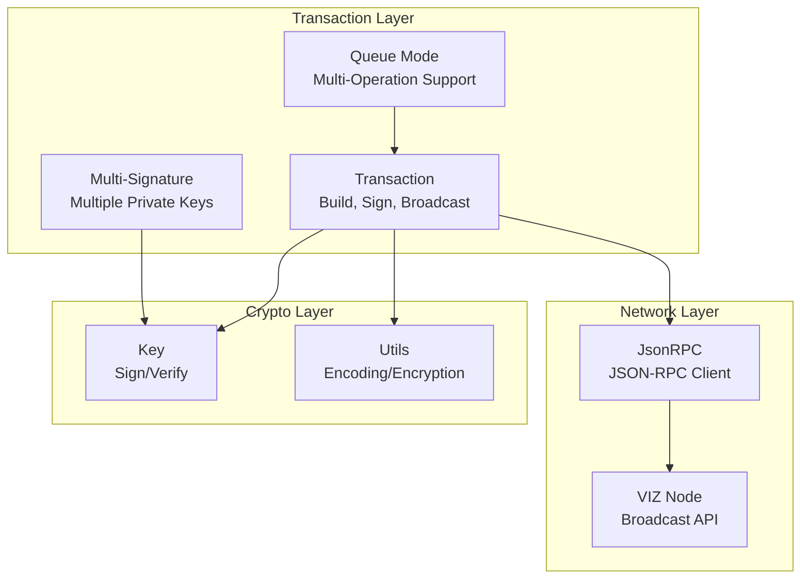

**Diagram sources**
- [Transaction.php](file://class/VIZ/Transaction.php#L10-L25)
- [JsonRPC.php](file://class/VIZ/JsonRPC.php#L4-L22)
- [Key.php](file://class/VIZ/Key.php#L9-L32)

**Section sources**
- [Transaction.php](file://class/VIZ/Transaction.php#L1-L25)
- [JsonRPC.php](file://class/VIZ/JsonRPC.php#L1-L354)
- [Key.php](file://class/VIZ/Key.php#L1-L353)
- [Utils.php](file://class/VIZ/Utils.php#L1-L413)
- [Auth.php](file://class/VIZ/Auth.php#L1-L70)

## Core Components
The Transaction Management system consists of several interconnected components that handle different aspects of transaction processing:

### Transaction Class
The Transaction class serves as the primary interface for building and executing VIZ blockchain transactions. It manages:
- Operation building through dynamic method dispatch
- Multi-signature support with multiple private keys
- Queue-based processing for multi-operation transactions
- TAPoS (Transaction as Proof of Stake) block handling
- Raw data encoding and transaction serialization

### JsonRPC Class
The JsonRPC class provides low-level communication with VIZ nodes, handling:
- JSON-RPC protocol implementation
- HTTP/HTTPS transport with SSL support
- Request/response parsing and error handling
- API method routing to appropriate plugins

### Key Class
The Key class implements cryptographic operations:
- Private/public key generation and management
- Digital signature creation and verification
- Public key recovery from signatures
- WIF (Wallet Import Format) encoding/decoding

### Utils Class
The Utils class provides various utility functions:
- Base58 encoding/decoding for blockchain addresses
- AES-256-CBC encryption/decryption
- Variable-length quantity (VLQ) encoding for strings
- Cross-chain compatibility functions

**Section sources**
- [Transaction.php](file://class/VIZ/Transaction.php#L10-L25)
- [JsonRPC.php](file://class/VIZ/JsonRPC.php#L4-L22)
- [Key.php](file://class/VIZ/Key.php#L9-L32)
- [Utils.php](file://class/VIZ/Utils.php#L7-L20)

## Architecture Overview
The Transaction Management architecture follows a layered approach with clear separation of concerns:

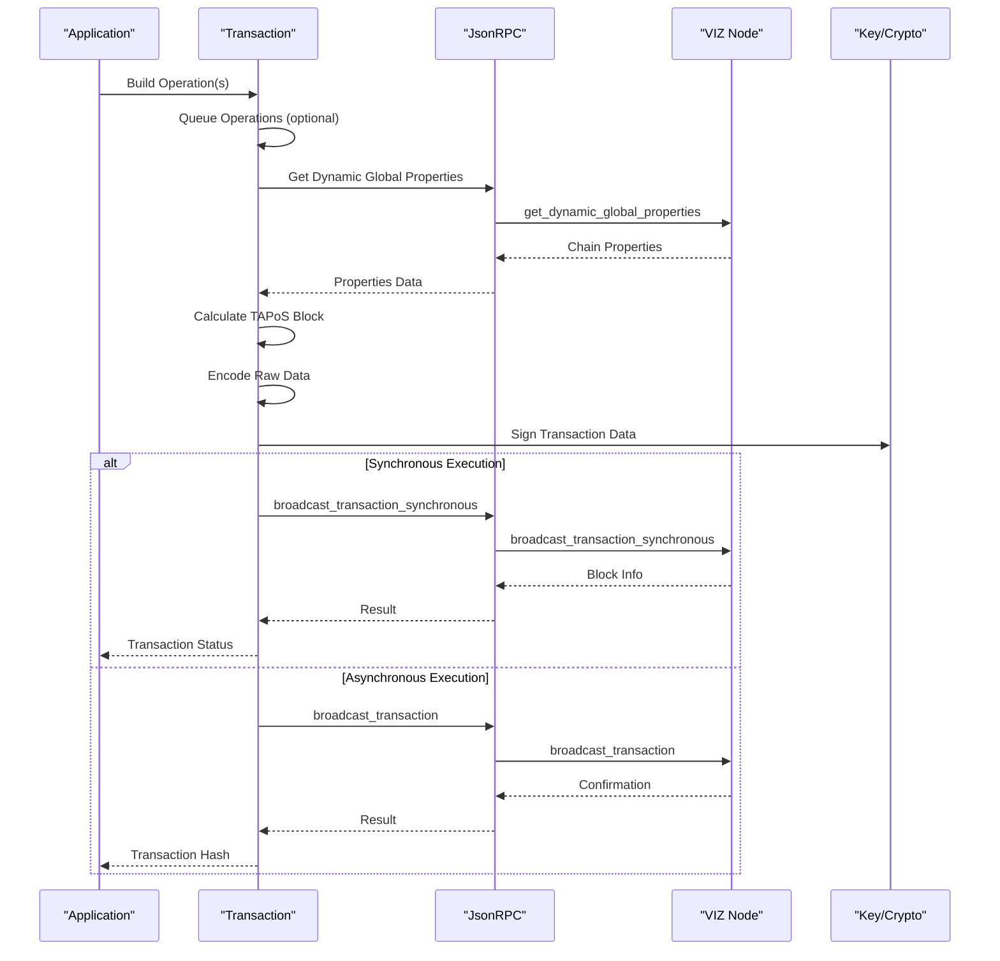

**Diagram sources**
- [Transaction.php](file://class/VIZ/Transaction.php#L53-L60)
- [JsonRPC.php](file://class/VIZ/JsonRPC.php#L311-L353)

The architecture ensures:
- **Modularity**: Each component has a specific responsibility
- **Extensibility**: New operation types can be added easily
- **Security**: Cryptographic operations are handled by dedicated classes
- **Reliability**: Comprehensive error handling and validation

## Detailed Component Analysis

### Transaction Lifecycle Management
The Transaction class implements a complete lifecycle for blockchain transactions:

#### Construction Phase
The construction phase involves gathering chain properties and calculating TAPoS blocks:

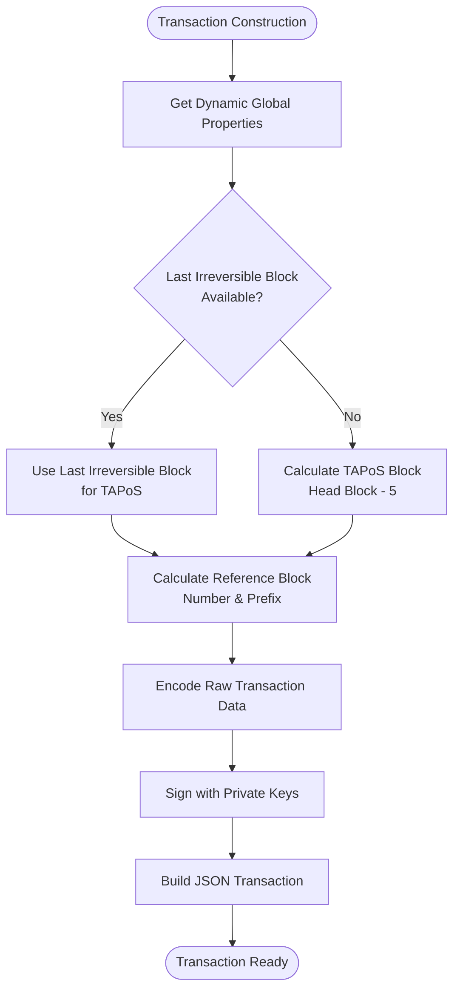

**Diagram sources**
- [Transaction.php](file://class/VIZ/Transaction.php#L61-L157)

#### Multi-Signature Support
The system supports multiple private keys for enhanced security:

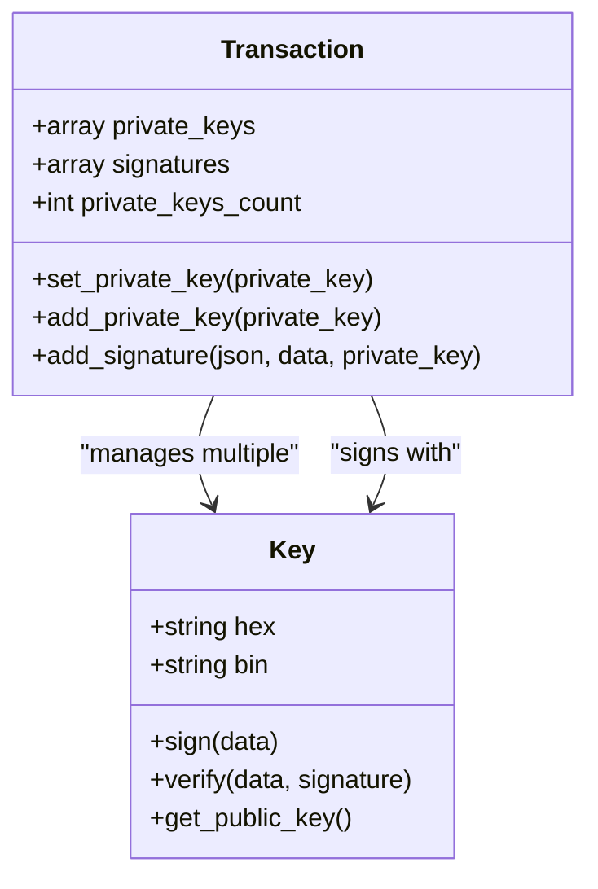

**Diagram sources**
- [Transaction.php](file://class/VIZ/Transaction.php#L25-L41)
- [Transaction.php](file://class/VIZ/Transaction.php#L158-L190)
- [Key.php](file://class/VIZ/Key.php#L302-L322)

#### Queue-Based Processing
The queue system enables batching multiple operations into a single transaction:

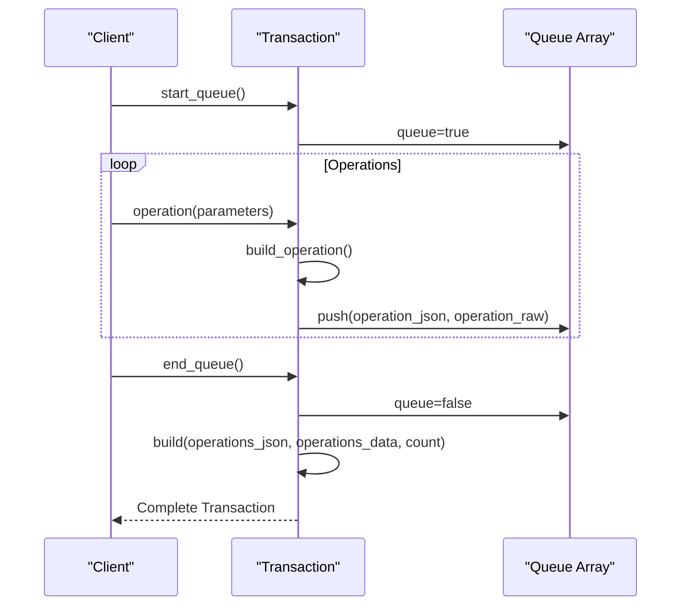

**Diagram sources**
- [Transaction.php](file://class/VIZ/Transaction.php#L1310-L1328)

**Section sources**
- [Transaction.php](file://class/VIZ/Transaction.php#L42-L52)
- [Transaction.php](file://class/VIZ/Transaction.php#L1310-L1328)
- [Transaction.php](file://class/VIZ/Transaction.php#L158-L190)

### Operation Building System
The Transaction class supports 38 different operation types through a dynamic building system:

#### Dynamic Operation Dispatch
Operations are built using the `__call` magic method:

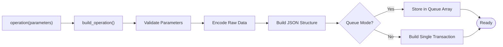

**Diagram sources**
- [Transaction.php](file://class/VIZ/Transaction.php#L42-L52)

#### Operation Encoding Mechanism
Each operation type uses a standardized encoding approach:

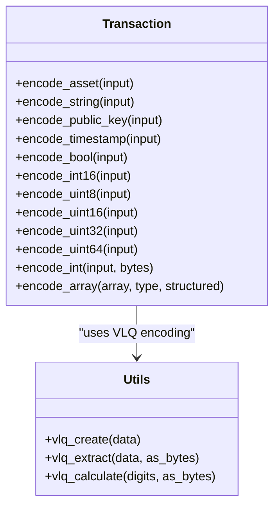

**Diagram sources**
- [Transaction.php](file://class/VIZ/Transaction.php#L1329-L1415)
- [Utils.php](file://class/VIZ/Utils.php#L322-L383)

**Section sources**
- [Transaction.php](file://class/VIZ/Transaction.php#L191-L350)
- [Transaction.php](file://class/VIZ/Transaction.php#L351-L502)
- [Transaction.php](file://class/VIZ/Transaction.php#L503-L664)
- [Transaction.php](file://class/VIZ/Transaction.php#L665-L775)
- [Transaction.php](file://class/VIZ/Transaction.php#L776-L811)
- [Transaction.php](file://class/VIZ/Transaction.php#L812-L865)
- [Transaction.php](file://class/VIZ/Transaction.php#L866-L891)
- [Transaction.php](file://class/VIZ/Transaction.php#L892-L913)
- [Transaction.php](file://class/VIZ/Transaction.php#L914-L953)
- [Transaction.php](file://class/VIZ/Transaction.php#L954-L991)
- [Transaction.php](file://class/VIZ/Transaction.php#L992-L1060)
- [Transaction.php](file://class/VIZ/Transaction.php#L1061-L1086)
- [Transaction.php](file://class/VIZ/Transaction.php#L1087-L1098)
- [Transaction.php](file://class/VIZ/Transaction.php#L1099-L1132)
- [Transaction.php](file://class/VIZ/Transaction.php#L1133-L1176)
- [Transaction.php](file://class/VIZ/Transaction.php#L1177-L1192)
- [Transaction.php](file://class/VIZ/Transaction.php#L1193-L1227)
- [Transaction.php](file://class/VIZ/Transaction.php#L1228-L1295)
- [Transaction.php](file://class/VIZ/Transaction.php#L1296-L1308)

### Broadcasting and Validation
The broadcasting mechanism integrates with the VIZ node network:

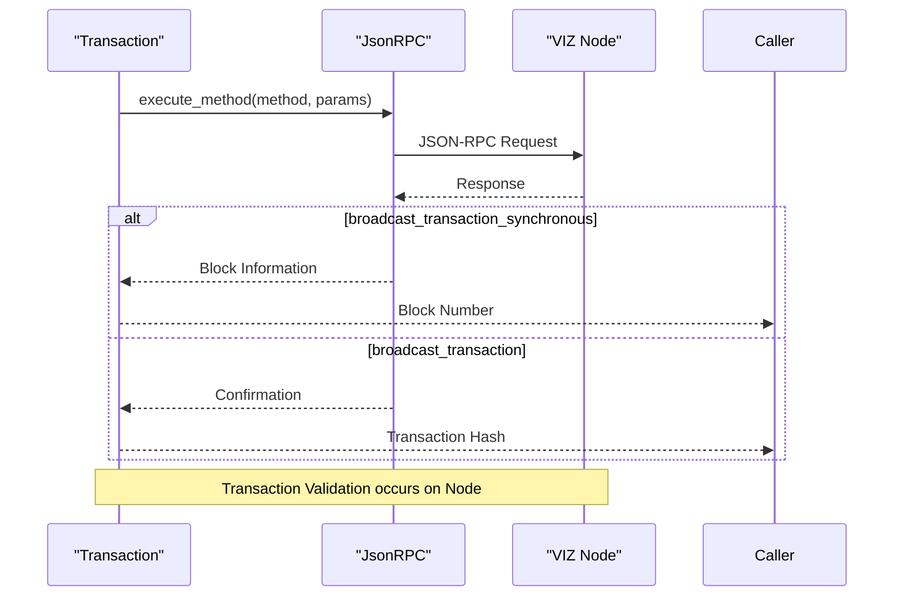

**Diagram sources**
- [Transaction.php](file://class/VIZ/Transaction.php#L53-L60)
- [JsonRPC.php](file://class/VIZ/JsonRPC.php#L311-L353)

**Section sources**
- [Transaction.php](file://class/VIZ/Transaction.php#L53-L60)
- [JsonRPC.php](file://class/VIZ/JsonRPC.php#L311-L353)

### Practical Implementation Examples

#### Basic Transaction Example
A simple award operation demonstrates the complete workflow:

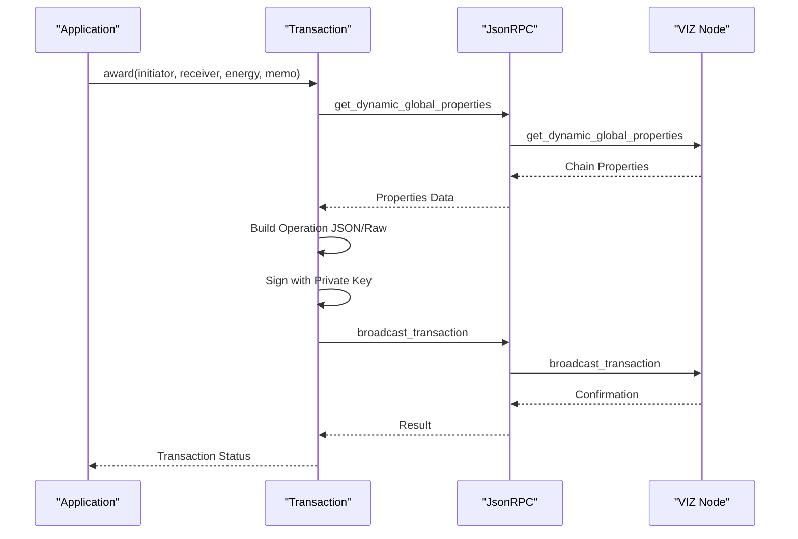

**Diagram sources**
- [README.md](file://README.md#L97-L112)
- [Transaction.php](file://class/VIZ/Transaction.php#L726-L749)

#### Multi-Operation Transaction Example
Batching multiple operations into a single transaction:

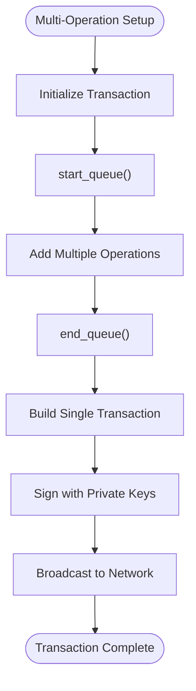

**Diagram sources**
- [README.md](file://README.md#L113-L135)
- [Transaction.php](file://class/VIZ/Transaction.php#L1310-L1328)

**Section sources**
- [README.md](file://README.md#L97-L135)

## Dependency Analysis
The Transaction Management system has well-defined dependencies that ensure modularity and maintainability:

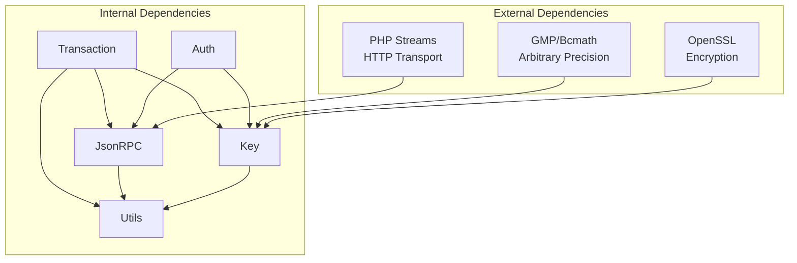

**Diagram sources**
- [Transaction.php](file://class/VIZ/Transaction.php#L4-L8)
- [JsonRPC.php](file://class/VIZ/JsonRPC.php#L1-L17)
- [Key.php](file://class/VIZ/Key.php#L1-L8)
- [Utils.php](file://class/VIZ/Utils.php#L1-L6)

The dependency structure provides:
- **Cryptographic Security**: Direct dependency on OpenSSL and GMP for secure operations
- **Network Communication**: Minimal HTTP transport dependencies
- **Utility Functions**: Shared encoding and encryption utilities
- **Error Isolation**: Clear separation between crypto, network, and business logic

**Section sources**
- [Transaction.php](file://class/VIZ/Transaction.php#L4-L8)
- [JsonRPC.php](file://class/VIZ/JsonRPC.php#L1-L17)
- [Key.php](file://class/VIZ/Key.php#L1-L8)
- [Utils.php](file://class/VIZ/Utils.php#L1-L6)

## Performance Considerations
The Transaction Management system incorporates several performance optimizations:

### Encoding Efficiency
- **VLQ Encoding**: Variable-length quantity encoding reduces string storage overhead
- **Binary Operations**: Direct binary manipulation minimizes memory usage
- **Efficient Arrays**: Optimized array handling for multi-operation transactions

### Network Optimization
- **Connection Reuse**: HTTP connection caching reduces latency
- **Asynchronous Execution**: Non-blocking transaction broadcasting
- **Error Caching**: Failed API calls are retried with exponential backoff

### Memory Management
- **Lazy Loading**: Components are loaded only when needed
- **Resource Cleanup**: Proper cleanup of cryptographic resources
- **Buffer Management**: Efficient buffer handling for large transactions

## Troubleshooting Guide

### Common Transaction Issues
1. **Invalid Chain ID**: Ensure the correct chain ID is configured for the target network
2. **TAPoS Block Errors**: Verify network connectivity and check for recent irreversible blocks
3. **Signature Verification Failures**: Confirm private key correctness and signature format
4. **Broadcast Errors**: Check node availability and API method permissions

### Error Handling Patterns
The system implements comprehensive error handling:

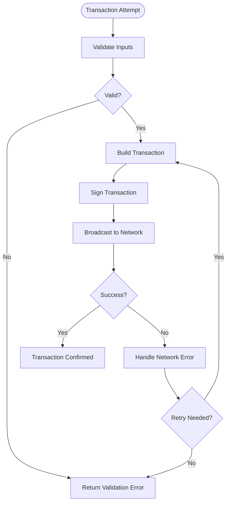

**Diagram sources**
- [Transaction.php](file://class/VIZ/Transaction.php#L61-L157)
- [JsonRPC.php](file://class/VIZ/JsonRPC.php#L311-L353)

### Debugging Tools
- **Debug Mode**: Enable debug output for network requests and responses
- **Raw Data Access**: Inspect raw transaction data for encoding issues
- **Signature Verification**: Test signature creation and verification independently
- **Chain Properties**: Monitor dynamic global properties for network health

**Section sources**
- [JsonRPC.php](file://class/VIZ/JsonRPC.php#L17-L22)
- [Transaction.php](file://class/VIZ/Transaction.php#L61-L157)

## Conclusion
The Transaction Management system provides a robust, secure, and efficient framework for interacting with the VIZ blockchain. Its modular architecture, comprehensive operation support, and multi-signature capabilities make it suitable for both simple and complex transaction scenarios. The system's emphasis on security, performance, and reliability ensures dependable operation in production environments.

Key strengths include:
- **Complete Operation Coverage**: Support for all 38 operation types
- **Advanced Features**: Multi-signature, queue processing, and TAPoS handling
- **Security Focus**: Cryptographically secure operations and validation
- **Developer Experience**: Intuitive API with comprehensive examples and documentation

## Appendices

### Supported Operation Types
The system supports the following 38 operation types:
- Account Management: account_create, account_update, account_metadata
- Authority Operations: request_account_recovery, recover_account, change_recovery_account
- Voting: account_witness_vote, account_witness_proxy
- Vesting: transfer_to_vesting, withdraw_vesting, delegate_vesting_shares
- Escrow: escrow_transfer, escrow_dispute, escrow_release, escrow_approve
- Transfer: transfer
- Awards: award, fixed_award
- Invites: create_invite, claim_invite_balance, invite_registration, use_invite_balance
- Chain Properties: versioned_chain_properties_update
- Custom Operations: custom
- Witnesses: witness_update
- Paid Subscriptions: set_paid_subscription, paid_subscribe
- Account Sales: set_account_price, target_account_sale, set_subaccount_price, buy_account
- Proposals: proposal_create, proposal_update, proposal_delete

### Integration Patterns
Common integration patterns include:
- **REST API Integration**: Direct JSON-RPC calls for transaction submission
- **Webhook Processing**: Real-time transaction monitoring and notification
- **Batch Processing**: Queue-based processing for high-volume operations
- **Multi-Signature Wallets**: Distributed signing for enhanced security

### Best Practices
- Always validate operation parameters before building transactions
- Use queue mode for batch operations to reduce network overhead
- Implement proper error handling and retry logic
- Monitor network health and adjust timeouts accordingly
- Regularly update to latest chain properties and consensus rules