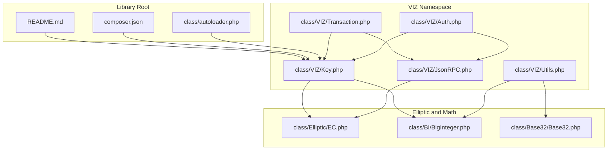
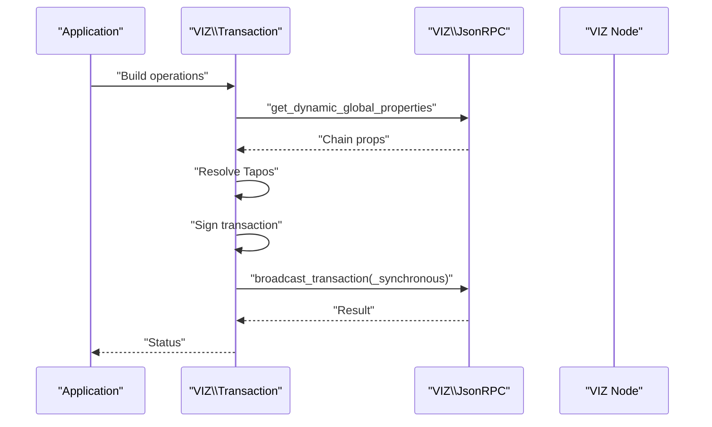
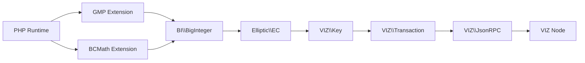

# Troubleshooting and FAQ

<cite>
**Referenced Files in This Document**
- [README.md](file://README.md)
- [composer.json](file://composer.json)
- [class/autoloader.php](file://class/autoloader.php)
- [class/VIZ/Auth.php](file://class/VIZ/Auth.php)
- [class/VIZ/JsonRPC.php](file://class/VIZ/JsonRPC.php)
- [class/VIZ/Key.php](file://class/VIZ/Key.php)
- [class/VIZ/Transaction.php](file://class/VIZ/Transaction.php)
- [class/VIZ/Utils.php](file://class/VIZ/Utils.php)
- [class/Elliptic/EC.php](file://class/Elliptic/EC.php)
- [class/BI/BigInteger.php](file://class/BI/BigInteger.php)
- [class/Base32/Base32.php](file://class/Base32/Base32.php)
- [tests/TestKeys.php](file://tests/TestKeys.php)
</cite>

## Table of Contents
1. [Introduction](#introduction)
2. [Project Structure](#project-structure)
3. [Core Components](#core-components)
4. [Architecture Overview](#architecture-overview)
5. [Detailed Component Analysis](#detailed-component-analysis)
6. [Dependency Analysis](#dependency-analysis)
7. [Performance Considerations](#performance-considerations)
8. [Troubleshooting Guide](#troubleshooting-guide)
9. [Conclusion](#conclusion)
10. [Appendices](#appendices)

## Introduction
This document provides comprehensive troubleshooting and FAQ guidance for the VIZ PHP Library. It focuses on installation issues, runtime errors, network connectivity problems, and performance concerns. It also covers frequent questions about usage, compatibility, migration, and technical specifications, with diagnostic procedures, debugging techniques, and step-by-step resolutions.

## Project Structure
The library is organized around a small set of core classes under the VIZ namespace, plus cryptographic and utility helpers. It uses a custom autoloader and PSR-4 mappings for namespaces. The README documents features, dependencies, and usage examples.

**Diagram sources**
- [README.md](file://README.md#L1-L455)
- [composer.json](file://composer.json#L1-L32)
- [class/autoloader.php](file://class/autoloader.php#L1-L14)
- [class/VIZ/Key.php](file://class/VIZ/Key.php#L1-L353)
- [class/VIZ/JsonRPC.php](file://class/VIZ/JsonRPC.php#L1-L354)
- [class/VIZ/Transaction.php](file://class/VIZ/Transaction.php#L1-L1416)
- [class/VIZ/Auth.php](file://class/VIZ/Auth.php#L1-L70)
- [class/VIZ/Utils.php](file://class/VIZ/Utils.php#L1-L413)
- [class/Elliptic/EC.php](file://class/Elliptic/EC.php#L1-L272)
- [class/BI/BigInteger.php](file://class/BI/BigInteger.php#L1-L634)
- [class/Base32/Base32.php](file://class/Base32/Base32.php#L1-L130)

**Section sources**
- [README.md](file://README.md#L1-L455)
- [composer.json](file://composer.json#L1-L32)
- [class/autoloader.php](file://class/autoloader.php#L1-L14)

## Core Components
- Key: Handles private/public key operations, WIF encoding, signatures, verification, and memo encryption/decryption.
- JsonRPC: Low-level JSON-RPC client over sockets with SSL/TLS support, timeouts, and result parsing.
- Transaction: Builds and executes blockchain transactions, Tapos resolution, multi-signature support, and queue mode.
- Auth: Passwordless authentication helper that validates domain-auth actions against the blockchain.
- Utils: Voice protocol helpers, base58/base32 encoders/decoders, AES-256-CBC, VLQ encoding, and address conversions.

**Section sources**
- [class/VIZ/Key.php](file://class/VIZ/Key.php#L1-L353)
- [class/VIZ/JsonRPC.php](file://class/VIZ/JsonRPC.php#L1-L354)
- [class/VIZ/Transaction.php](file://class/VIZ/Transaction.php#L1-L1416)
- [class/VIZ/Auth.php](file://class/VIZ/Auth.php#L1-L70)
- [class/VIZ/Utils.php](file://class/VIZ/Utils.php#L1-L413)

## Architecture Overview
The library composes cryptographic primitives (elliptic curves, big integers) with JSON-RPC communication to interact with the VIZ blockchain. Transactions are built locally and signed with local keys, then broadcast via RPC.

**Diagram sources**
- [class/VIZ/Transaction.php](file://class/VIZ/Transaction.php#L61-L157)
- [class/VIZ/JsonRPC.php](file://class/VIZ/JsonRPC.php#L311-L353)

## Detailed Component Analysis

### Installation and Environment Issues
Common symptoms:
- Autoloader fails to load classes.
- Missing GMP or BCMath extensions.
- Composer autoload not configured.

Resolution steps:
- Ensure the autoloader is included before using classes.
- Install and enable either GMP or BCMath PHP extensions.
- Verify PSR-4 mappings in composer.json and that vendor/autoload is present if applicable.

Diagnostic checklist:
- Confirm autoloader registration runs.
- Verify extension availability and version.
- Check composer autoload presence and namespaces.

**Section sources**
- [class/autoloader.php](file://class/autoloader.php#L1-L14)
- [README.md](file://README.md#L20-L28)
- [composer.json](file://composer.json#L19-L29)
- [class/BI/BigInteger.php](file://class/BI/BigInteger.php#L4-L16)

### Network Connectivity and JSON-RPC Errors
Symptoms:
- Socket connection failures.
- SSL/TLS handshake errors.
- Timeouts during reads.
- Non-200 HTTP responses.
- Unexpected JSON-RPC result structure.

Resolution steps:
- Validate endpoint URL scheme (http/https/wss).
- Disable SSL verification only for testing (not production).
- Increase read timeout if needed.
- Enable debug mode to inspect raw requests/results.
- Check server status codes and error messages.

Debugging techniques:
- Inspect request arrays and last URL.
- Parse headers and body separately.
- Use extended mode to capture error details.

**Section sources**
- [class/VIZ/JsonRPC.php](file://class/VIZ/JsonRPC.php#L17-L22)
- [class/VIZ/JsonRPC.php](file://class/VIZ/JsonRPC.php#L167-L221)
- [class/VIZ/JsonRPC.php](file://class/VIZ/JsonRPC.php#L311-L353)

### Transaction Building and Signing Problems
Symptoms:
- Tapos resolution failures.
- Signature generation returns false.
- Transaction ID mismatch.
- Broadcasting returns false.

Resolution steps:
- Ensure dynamic global properties are fetched successfully.
- Verify private keys are valid and imported correctly.
- Confirm Tapos block resolution and ref block prefix calculation.
- Retry signing if canonical signature is not found.
- Validate transaction JSON structure before broadcasting.

**Section sources**
- [class/VIZ/Transaction.php](file://class/VIZ/Transaction.php#L61-L157)
- [class/VIZ/Key.php](file://class/VIZ/Key.php#L302-L311)

### Key Management and Memo Encryption
Symptoms:
- WIF decoding fails.
- Public key encoding/verification issues.
- Memo encryption/decryption errors.
- Shared key derivation failure.

Resolution steps:
- Validate WIF checksum and version byte.
- Ensure public key import uses correct prefixes.
- Check memo structure and base58 encoding.
- Verify shared key length and hashing.

**Section sources**
- [class/VIZ/Key.php](file://class/VIZ/Key.php#L219-L260)
- [class/VIZ/Key.php](file://class/VIZ/Key.php#L45-L176)
- [class/VIZ/Utils.php](file://class/VIZ/Utils.php#L209-L290)

### Authentication Flow Issues
Symptoms:
- Domain/action mismatch.
- Out-of-range timestamps.
- Authority weight threshold not met.
- Account not found.

Resolution steps:
- Verify domain, action, and authority match expectations.
- Check server timezone offset adjustments.
- Ensure account authority contains the recovered public key.
- Confirm weight thresholds and key weights.

**Section sources**
- [class/VIZ/Auth.php](file://class/VIZ/Auth.php#L25-L69)

### Voice Protocol and Large Payloads
Symptoms:
- Transaction size exceeds limits.
- Voice text/publish returns false.
- Event creation fails.

Resolution steps:
- Measure transaction size and split long content.
- Use Voice events to append secondary parts.
- Ensure synchronous mode returns block numbers when needed.

**Section sources**
- [class/VIZ/Utils.php](file://class/VIZ/Utils.php#L36-L73)
- [class/VIZ/Utils.php](file://class/VIZ/Utils.php#L111-L148)
- [class/VIZ/Utils.php](file://class/VIZ/Utils.php#L156-L208)

## Dependency Analysis
The library depends on:
- PHP extensions: GMP or BCMath for big integer arithmetic.
- Third-party libraries: elliptic curve cryptography, big integer wrappers, Keccak hashing.
- Local classes: VIZ namespace components and base32 utilities.

**Diagram sources**
- [class/BI/BigInteger.php](file://class/BI/BigInteger.php#L4-L16)
- [class/Elliptic/EC.php](file://class/Elliptic/EC.php#L1-L272)
- [class/VIZ/Key.php](file://class/VIZ/Key.php#L1-L353)
- [class/VIZ/Transaction.php](file://class/VIZ/Transaction.php#L1-L1416)
- [class/VIZ/JsonRPC.php](file://class/VIZ/JsonRPC.php#L1-L354)

**Section sources**
- [README.md](file://README.md#L20-L35)
- [class/BI/BigInteger.php](file://class/BI/BigInteger.php#L4-L16)
- [class/Elliptic/EC.php](file://class/Elliptic/EC.php#L1-L272)

## Performance Considerations
- Big integer operations: Prefer GMP over BCMath for performance-sensitive environments.
- Transaction building: Batch operations using queue mode to reduce round trips.
- Memo encryption: AES-256-CBC adds overhead; consider payload size limits.
- Network I/O: Tune read timeouts and reuse connections where possible.

[No sources needed since this section provides general guidance]

## Troubleshooting Guide

### Installation and Setup
- Problem: Cannot load VIZ classes.
  - Ensure autoloader is registered before instantiating classes.
  - Verify file paths and namespaces match the autoloader logic.
  - Check that composer autoload is present if using Composer.

- Problem: Missing GMP or BCMath.
  - Install and enable the extension.
  - Verify extension availability at runtime.

- Problem: Composer autoload not working.
  - Confirm PSR-4 mappings in composer.json.
  - Regenerate autoload files if necessary.

**Section sources**
- [class/autoloader.php](file://class/autoloader.php#L1-L14)
- [composer.json](file://composer.json#L19-L29)
- [README.md](file://README.md#L20-L28)

### Network and JSON-RPC
- Problem: Socket connection fails.
  - Validate endpoint URL and scheme.
  - Check firewall and DNS resolution.
  - Temporarily disable SSL verification for diagnostics.

- Problem: SSL/TLS handshake errors.
  - Ensure CA certificates are up to date.
  - Avoid disabling verification in production.

- Problem: Timeouts.
  - Increase read timeout.
  - Retry with reduced load.

- Problem: Non-200 responses.
  - Inspect headers and error payloads.
  - Use extended mode to capture error details.

**Section sources**
- [class/VIZ/JsonRPC.php](file://class/VIZ/JsonRPC.php#L167-L221)
- [class/VIZ/JsonRPC.php](file://class/VIZ/JsonRPC.php#L311-L353)

### Transaction Building and Execution
- Problem: Tapos resolution fails.
  - Ensure dynamic global properties are fetched.
  - Verify block header retrieval succeeds.

- Problem: Signature generation returns false.
  - Retry signing; canonical signature may require retries.
  - Validate private key import.

- Problem: Broadcasting returns false.
  - Check transaction JSON structure.
  - Verify required signatures and authorities.

**Section sources**
- [class/VIZ/Transaction.php](file://class/VIZ/Transaction.php#L61-L157)
- [class/VIZ/Key.php](file://class/VIZ/Key.php#L302-L311)

### Key and Memo Operations
- Problem: WIF decoding fails.
  - Verify checksum and version byte.
  - Ensure correct base58 alphabet usage.

- Problem: Public key verification fails.
  - Confirm public key encoding/decoding.
  - Validate signature format.

- Problem: Memo encryption/decryption errors.
  - Check shared key derivation.
  - Verify IV and key lengths.

**Section sources**
- [class/VIZ/Key.php](file://class/VIZ/Key.php#L219-L260)
- [class/VIZ/Key.php](file://class/VIZ/Key.php#L45-L176)
- [class/VIZ/Utils.php](file://class/VIZ/Utils.php#L209-L290)

### Authentication
- Problem: Domain/action mismatch.
  - Verify inputs and authority.
  - Check server timezone offset.

- Problem: Weight threshold not met.
  - Ensure recovered public key matches authority.
  - Confirm account authority structure.

**Section sources**
- [class/VIZ/Auth.php](file://class/VIZ/Auth.php#L25-L69)

### Voice Protocol
- Problem: Transaction size exceeds limits.
  - Split content and use Voice events.
  - Measure raw transaction size.

- Problem: Voice text/publish returns false.
  - Validate account existence and custom sequence.
  - Use synchronous mode to get block numbers.

**Section sources**
- [class/VIZ/Utils.php](file://class/VIZ/Utils.php#L36-L73)
- [class/VIZ/Utils.php](file://class/VIZ/Utils.php#L111-L148)
- [class/VIZ/Utils.php](file://class/VIZ/Utils.php#L156-L208)

### Diagnostics and Debugging
- Enable debug mode in JsonRPC to log requests and responses.
- Inspect request arrays and last URL for failed calls.
- Use extended mode to capture error details from RPC responses.
- Validate signatures and public keys using provided helpers.

**Section sources**
- [class/VIZ/JsonRPC.php](file://class/VIZ/JsonRPC.php#L17-L22)
- [class/VIZ/JsonRPC.php](file://class/VIZ/JsonRPC.php#L311-L353)

## Conclusion
This guide consolidates common issues and their resolutions for the VIZ PHP Library. By validating environment prerequisites, checking network connectivity, ensuring correct transaction construction and signing, and leveraging built-in debugging capabilities, most problems can be quickly identified and resolved.

## Appendices

### Frequently Asked Questions
- Q: Which PHP extensions are required?
  - A: Either GMP or BCMath must be installed and enabled.

- Q: How do I enable debug logging?
  - A: Set the debug property on JsonRPC and review logged requests and responses.

- Q: Can I use this library with Composer?
  - A: The library defines classmap and PSR-4 mappings; ensure autoloading is configured.

- Q: How do I handle large Voice posts?
  - A: Split content and use Voice events to append secondary parts.

- Q: What should I do if signing fails?
  - A: Retry signing; canonical signature generation may require multiple attempts.

**Section sources**
- [README.md](file://README.md#L20-L28)
- [class/VIZ/JsonRPC.php](file://class/VIZ/JsonRPC.php#L17-L22)
- [composer.json](file://composer.json#L19-L29)
- [class/VIZ/Utils.php](file://class/VIZ/Utils.php#L36-L73)