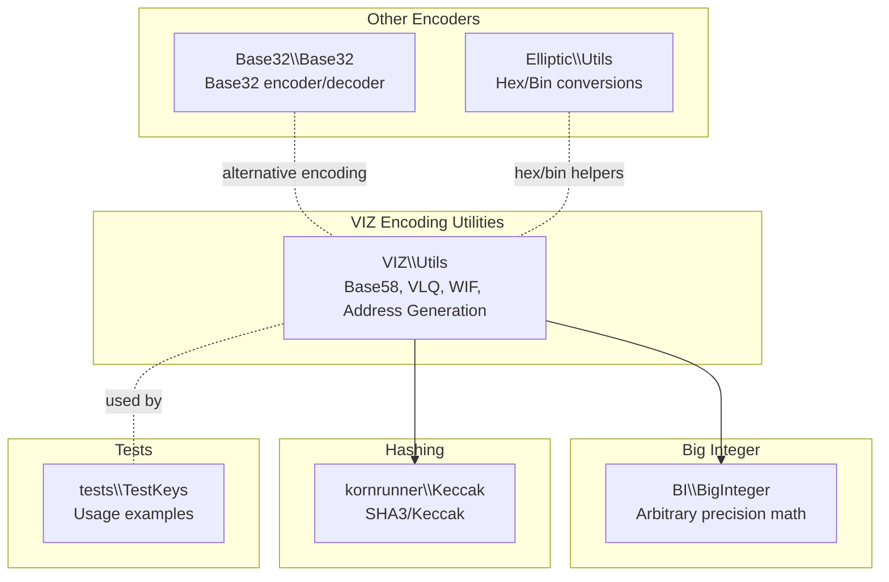
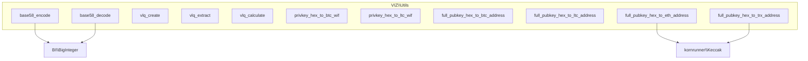
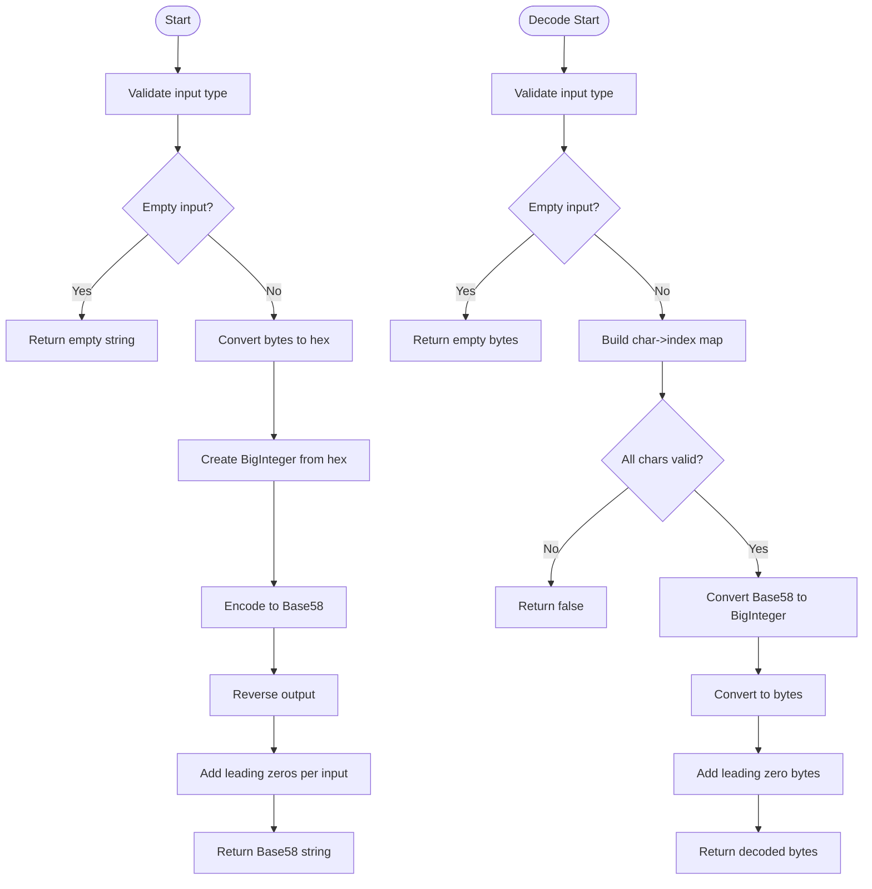
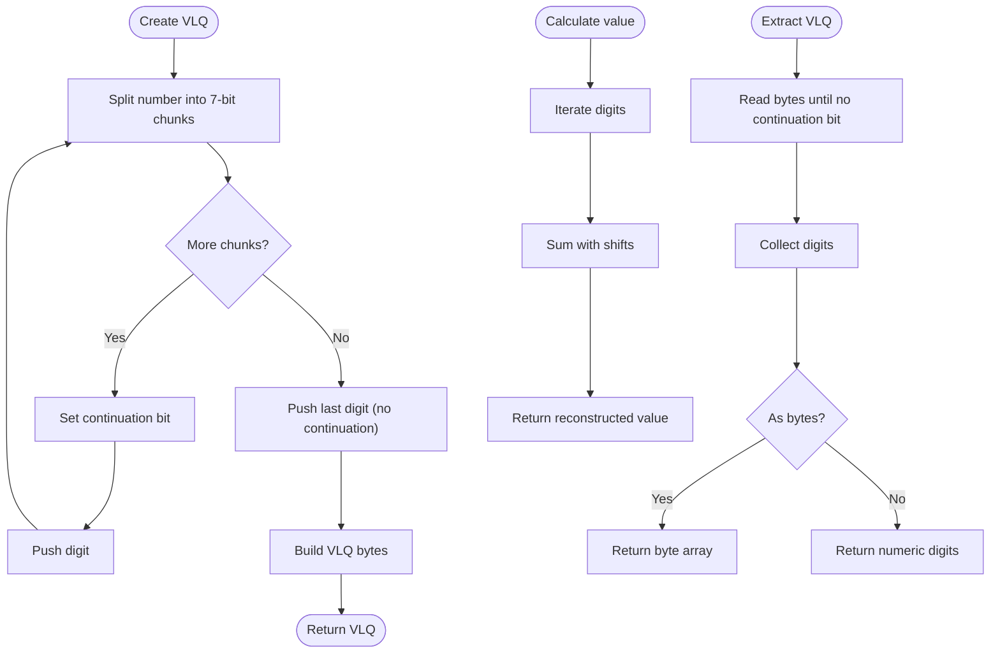
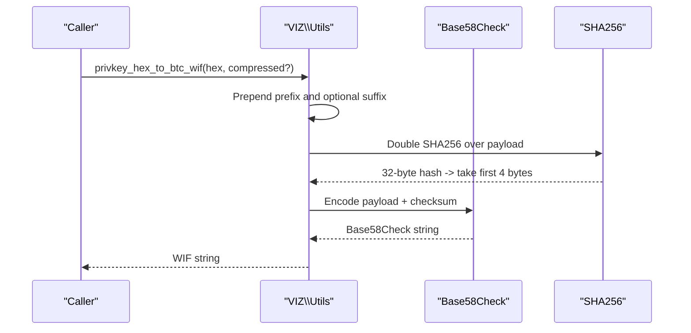
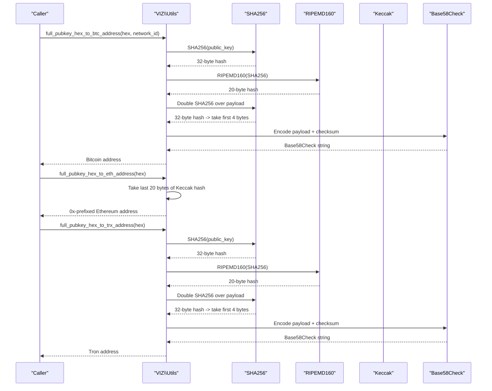
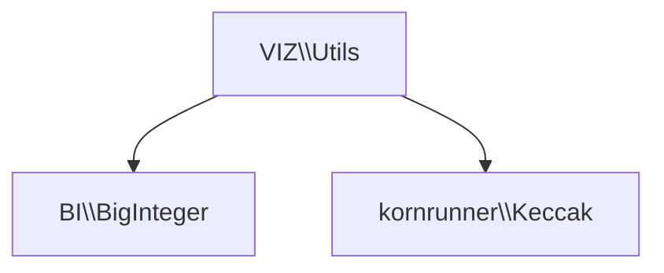

# Encoding and Decoding Utilities

<cite>
**Referenced Files in This Document**
- [VIZ Utils](file://class/VIZ/Utils.php)
- [BigInteger](file://class/BI/BigInteger.php)
- [Elliptic Utils](file://class/Elliptic/Utils.php)
- [Base32](file://class/Base32/Base32.php)
- [Keccak](file://class/kornrunner/Keccak.php)
- [TestKeys](file://tests/TestKeys.php)
</cite>

## Table of Contents
1. [Introduction](#introduction)
2. [Project Structure](#project-structure)
3. [Core Components](#core-components)
4. [Architecture Overview](#architecture-overview)
5. [Detailed Component Analysis](#detailed-component-analysis)
6. [Dependency Analysis](#dependency-analysis)
7. [Performance Considerations](#performance-considerations)
8. [Troubleshooting Guide](#troubleshooting-guide)
9. [Conclusion](#conclusion)
10. [Appendices](#appendices)

## Introduction
This document focuses on the Encoding and Decoding utilities implemented in the repository. It covers:
- Base58 encoding and decoding with configurable alphabets and checksum validation
- Variable-length quantity (VLQ) encoding for blockchain data serialization
- Wallet Import Format (WIF) conversions for Bitcoin and Litecoin
- Public key to address generation for Bitcoin, Litecoin, Ethereum, and Tron
- Practical usage patterns and cross-chain compatibility guidelines

The goal is to explain how these utilities work, how they are implemented, and how to use them safely and effectively across different blockchain networks.

## Project Structure
The encoding utilities are primarily implemented in the VIZ namespace utilities, with supporting cryptographic primitives and hashing functions located in dedicated classes. The structure relevant to encoding and decoding is shown below.

**Diagram sources**
- [VIZ Utils](file://class/VIZ/Utils.php#L209-L412)
- [BigInteger](file://class/BI/BigInteger.php#L24-L229)
- [Keccak](file://class/kornrunner/Keccak.php#L1-L307)
- [Base32](file://class/Base32/Base32.php#L1-L130)
- [Elliptic Utils](file://class/Elliptic/Utils.php#L1-L163)
- [TestKeys](file://tests/TestKeys.php#L1-L29)

**Section sources**
- [VIZ Utils](file://class/VIZ/Utils.php#L209-L412)
- [BigInteger](file://class/BI/BigInteger.php#L24-L229)
- [Keccak](file://class/kornrunner/Keccak.php#L1-L307)
- [Base32](file://class/Base32/Base32.php#L1-L130)
- [Elliptic Utils](file://class/Elliptic/Utils.php#L1-L163)
- [TestKeys](file://tests/TestKeys.php#L1-L29)

## Core Components
- Base58 encoding/decoding with configurable alphabet and checksum validation
- Variable-length quantity (VLQ) creation, extraction, and calculation
- WIF conversion for Bitcoin (compressed/uncompressed) and Litecoin
- Public key to address generation for Bitcoin, Litecoin, Ethereum, and Tron

Implementation highlights:
- Base58 uses an arbitrary-precision integer library for base conversion and supports leading zero handling
- VLQ encodes integers using continuation bits for variable-length sequences
- WIF and address generation apply SHA256 twice, RIPEMD160 hashing, and Base58 encoding with network prefixes

**Section sources**
- [VIZ Utils](file://class/VIZ/Utils.php#L209-L412)
- [BigInteger](file://class/BI/BigInteger.php#L24-L229)
- [Keccak](file://class/kornrunner/Keccak.php#L291-L297)

## Architecture Overview
The encoding utilities are cohesive and self-contained within the VIZ namespace. They rely on:
- Arbitrary-precision arithmetic via BI\BigInteger for Base58 conversions
- Cryptographic hashing via kornrunner\Keccak for Ethereum/Tron address derivation
- OpenSSL-compatible SHA256 and RIPEMD160 for Bitcoin/Litecoin address derivation and WIF checksums

**Diagram sources**
- [VIZ Utils](file://class/VIZ/Utils.php#L209-L412)
- [BigInteger](file://class/BI/BigInteger.php#L24-L229)
- [Keccak](file://class/kornrunner/Keccak.php#L291-L297)

## Detailed Component Analysis

### Base58 Encoding and Decoding
Base58 converts raw bytes to a human-readable string using a custom alphabet and validates correctness with a checksum. The implementation:
- Converts input bytes to an arbitrary-precision decimal
- Repeatedly divides by the base to build the encoded string
- Handles leading zeros by prepending the alphabet’s zero character
- Validates decode input against the alphabet and rejects invalid characters

Alphabet configuration:
- Default alphabet is compatible with Bitcoin/Litecoin Base58Check
- The alphabet is passed as a parameter to both encode and decode functions

Checksum validation:
- For WIF and address generation, the implementation computes a double SHA256 over the payload and takes the first four bytes as the checksum
- Base58Check strings are validated by re-computing the checksum and comparing it to the appended bytes

**Diagram sources**
- [VIZ Utils](file://class/VIZ/Utils.php#L212-L290)
- [BigInteger](file://class/BI/BigInteger.php#L24-L229)

**Section sources**
- [VIZ Utils](file://class/VIZ/Utils.php#L209-L290)
- [BigInteger](file://class/BI/BigInteger.php#L24-L229)

### Variable-Length Quantity (VLQ)
VLQ is used to serialize integers in a compact, variable-length format. The implementation:
- Creates VLQ sequences by splitting the integer into 7-bit chunks and setting continuation bits
- Extracts digits and reconstructs the original value by summing shifted chunks
- Supports returning digits as bytes or numeric values

**Diagram sources**
- [VIZ Utils](file://class/VIZ/Utils.php#L322-L383)

**Section sources**
- [VIZ Utils](file://class/VIZ/Utils.php#L322-L383)

### WIF Conversion (Bitcoin and Litecoin)
Wallet Import Format (WIF) wraps a private key with a network prefix, optional compression flag, and a checksum, then encodes the result using Base58Check.

Bitcoin WIF:
- Prefix: 0x80
- Optional compression suffix: 0x01
- Double SHA256 checksum over the concatenated bytes

Litecoin WIF:
- Prefix: 0xb0
- No compression flag
- Double SHA256 checksum over the concatenated bytes

**Diagram sources**
- [VIZ Utils](file://class/VIZ/Utils.php#L384-L393)

**Section sources**
- [VIZ Utils](file://class/VIZ/Utils.php#L384-L393)

### Public Key to Address Generation
The library supports generating addresses for multiple networks using public keys.

Bitcoin (P2PKH):
- Network ID: 0x00 (mainnet), 0x6f (testnet)
- Payload: network_id + RIPEMD160(SHA256(public_key))
- Double SHA256 checksum over the payload

Litecoin (P2PKH):
- Network ID: 0x30 (mainnet)
- Same process as Bitcoin with a different network prefix

Ethereum:
- Payload: Keccak-256(public_key) truncated to 20 bytes and prefixed with 0x
- No Base58 encoding; returns an EIP-55 mixed-case hex address

Tron:
- Prefix: 0x41
- Payload: 0x41 + RIPEMD160(SHA256(public_key))
- Double SHA256 checksum over the payload, then Base58Check encode

**Diagram sources**
- [VIZ Utils](file://class/VIZ/Utils.php#L394-L412)
- [Keccak](file://class/kornrunner/Keccak.php#L291-L297)

**Section sources**
- [VIZ Utils](file://class/VIZ/Utils.php#L394-L412)
- [Keccak](file://class/kornrunner/Keccak.php#L291-L297)

### Practical Examples and Usage Patterns
- Hexadecimal key conversion: Use helper utilities to convert between hex, binary, and arrays when preparing inputs for encoding functions
- Network-specific address generation: Choose the appropriate function for the target network and ensure correct network IDs/prefixes
- Cross-chain compatibility: Keep private keys and public keys consistent across chains; avoid mixing network prefixes and checksums

Example references:
- Private key to public key conversion and verification in tests
- Hex/binary conversions for encoding pipeline preparation

**Section sources**
- [Elliptic Utils](file://class/Elliptic/Utils.php#L9-L50)
- [TestKeys](file://tests/TestKeys.php#L9-L27)

## Dependency Analysis
The encoding utilities depend on:
- BI\BigInteger for base conversions and arithmetic
- kornrunner\Keccak for Ethereum/Tron address derivation
- Standard hashing functions for Bitcoin/Litecoin address and WIF checksums

**Diagram sources**
- [VIZ Utils](file://class/VIZ/Utils.php#L209-L412)
- [BigInteger](file://class/BI/BigInteger.php#L24-L229)
- [Keccak](file://class/kornrunner/Keccak.php#L291-L297)

**Section sources**
- [VIZ Utils](file://class/VIZ/Utils.php#L209-L412)
- [BigInteger](file://class/BI/BigInteger.php#L24-L229)
- [Keccak](file://class/kornrunner/Keccak.php#L291-L297)

## Performance Considerations
- Base58 conversion performance scales with input length and the magnitude of the underlying integer; for very long inputs, consider batching or streaming approaches
- VLQ encoding/decoding is linear in the number of digits; minimal overhead
- Keccak hashing is efficient but can be a bottleneck for bulk operations; cache intermediate hashes when generating multiple addresses
- SHA256 and RIPEMD160 are fast in modern PHP environments; ensure sufficient entropy for private keys and avoid repeated recomputation

## Troubleshooting Guide
Common issues and resolutions:
- Invalid Base58 input: Ensure the input string only contains characters from the configured alphabet; otherwise decoding returns false
- Incorrect checksum: Verify the payload and checksum computation match the expected network format
- Wrong network prefix: Using the wrong network ID or prefix leads to addresses on a different chain
- Compression mismatch: Bitcoin WIF requires the correct compression flag; uncompressed vs compressed keys produce different addresses
- Keccak vs SHA3: Ethereum addresses require Keccak-256, not SHA3-256; confirm the correct function is used

**Section sources**
- [VIZ Utils](file://class/VIZ/Utils.php#L251-L290)
- [VIZ Utils](file://class/VIZ/Utils.php#L384-L412)
- [Keccak](file://class/kornrunner/Keccak.php#L291-L297)

## Conclusion
The encoding utilities provide robust, cross-chain compatible tools for Base58 encoding/decoding, VLQ serialization, and address/WIF generation. By leveraging configurable alphabets, checksum validation, and cryptographic primitives, developers can reliably handle private/public keys and derive addresses across Bitcoin, Litecoin, Ethereum, and Tron networks.

## Appendices
- Alternative encoders: Base32 encoder/decoder is available for comparison and specialized use cases
- Hex/Bin conversions: Helper utilities support seamless conversion between hex, binary, and arrays for encoding pipelines

**Section sources**
- [Base32](file://class/Base32/Base32.php#L1-L130)
- [Elliptic Utils](file://class/Elliptic/Utils.php#L9-L50)