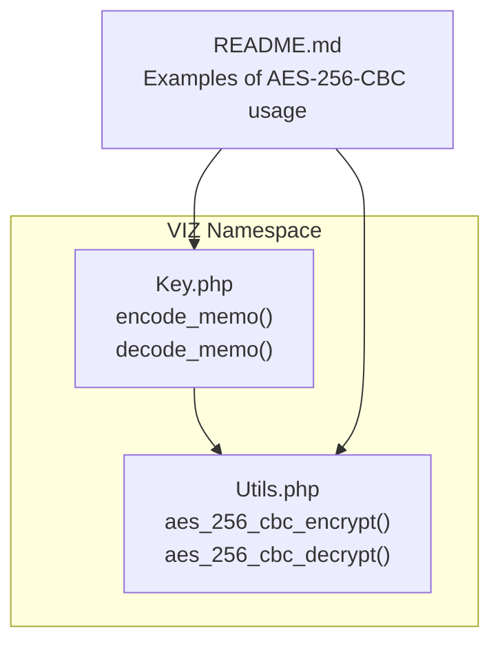
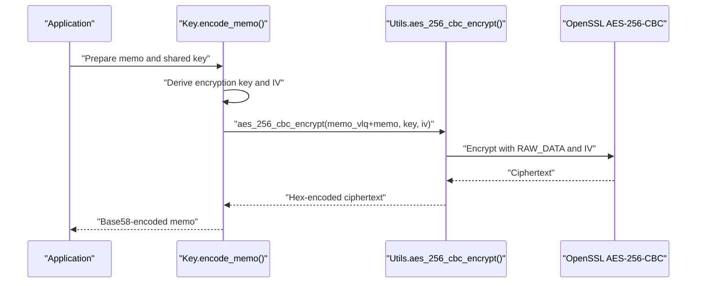
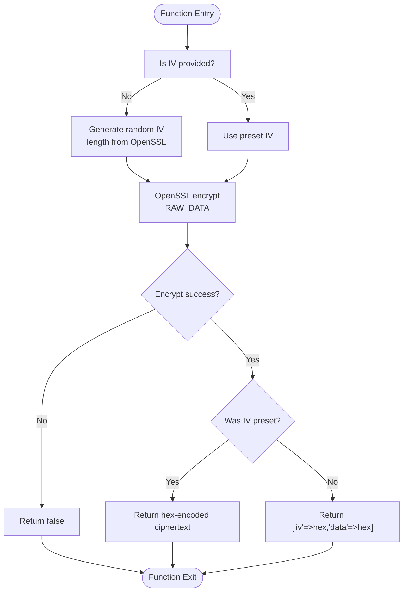
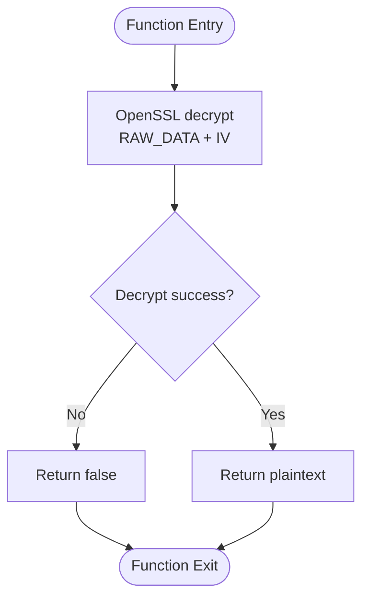
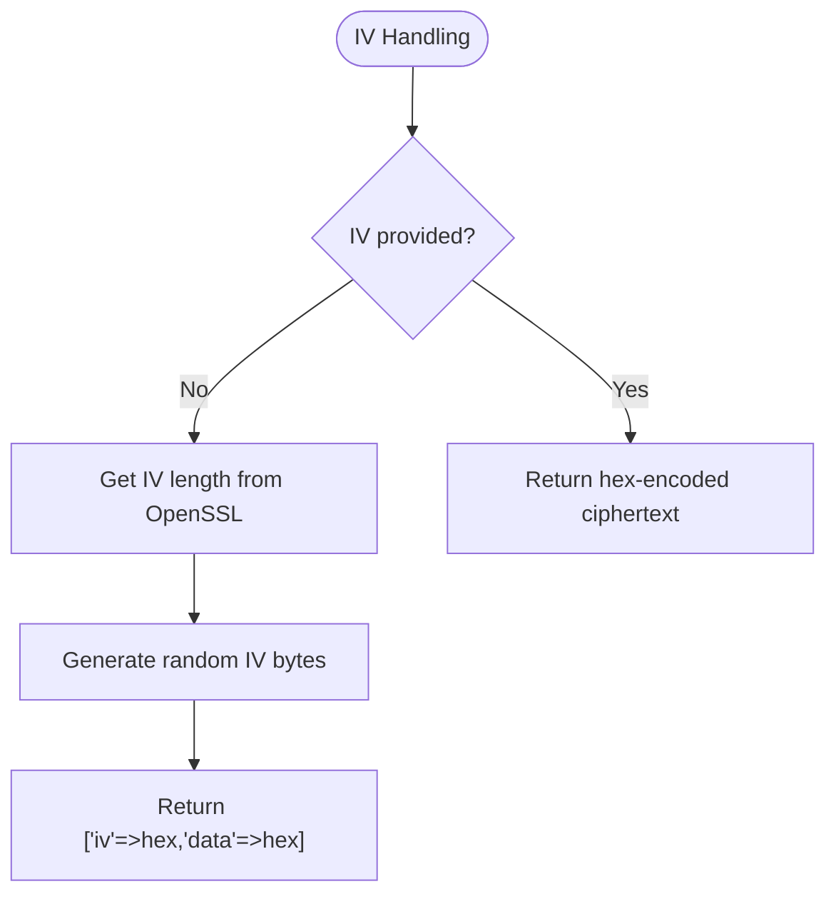
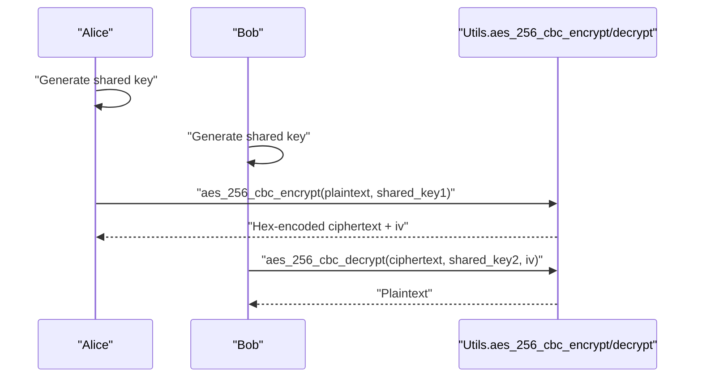
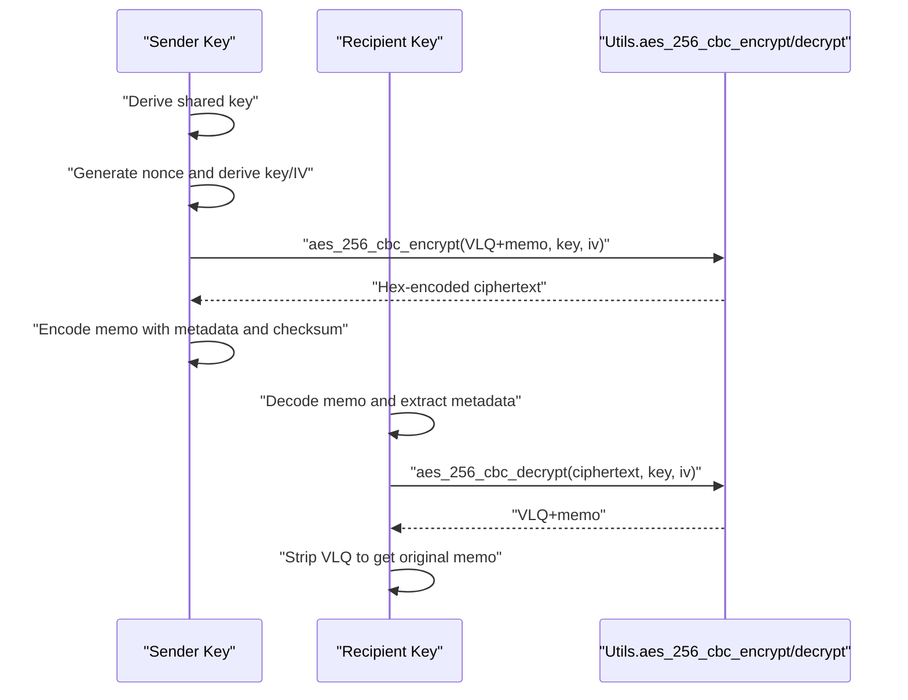
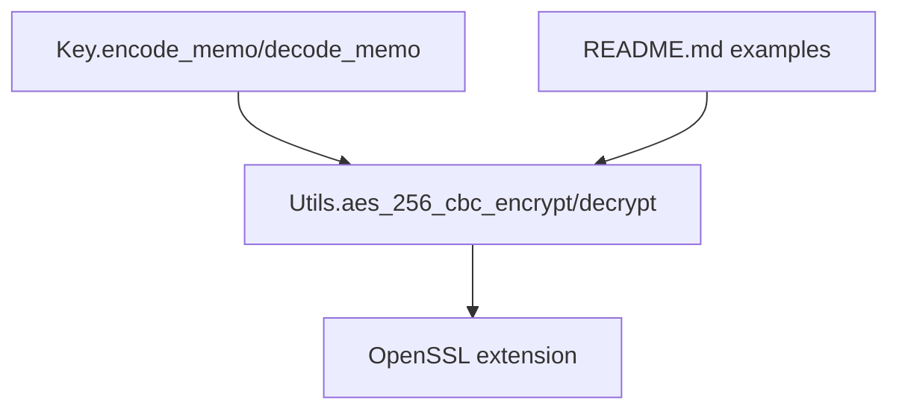

# Encryption and Decryption Functions

<cite>
**Referenced Files in This Document**
- [README.md](file://README.md)
- [Utils.php](file://class/VIZ/Utils.php)
- [Key.php](file://class/VIZ/Key.php)
- [composer.json](file://composer.json)
</cite>

## Table of Contents
1. [Introduction](#introduction)
2. [Project Structure](#project-structure)
3. [Core Components](#core-components)
4. [Architecture Overview](#architecture-overview)
5. [Detailed Component Analysis](#detailed-component-analysis)
6. [Dependency Analysis](#dependency-analysis)
7. [Performance Considerations](#performance-considerations)
8. [Troubleshooting Guide](#troubleshooting-guide)
9. [Conclusion](#conclusion)
10. [Appendices](#appendices)

## Introduction
This document explains the AES-256-CBC encryption and decryption implementation used by the library. It focuses on the two primary functions:
- aes_256_cbc_encrypt
- aes_256_cbc_decrypt

It covers initialization vector handling (random IV generation and preset IV scenarios), OpenSSL integration, raw data processing, error handling, and practical examples for secure data encryption, key management, and decryption workflows. Security considerations, performance implications, and best practices for cryptographic operations are also addressed.

## Project Structure
The encryption and decryption functionality is implemented in the VIZ namespace and is primarily used by the Key class for memo encryption/decryption and by examples in the README for general AES-256-CBC usage.

**Diagram sources**
- [Utils.php](file://class/VIZ/Utils.php#L291-L320)
- [Key.php](file://class/VIZ/Key.php#L45-L176)
- [README.md](file://README.md#L164-L205)

**Section sources**
- [Utils.php](file://class/VIZ/Utils.php#L291-L320)
- [Key.php](file://class/VIZ/Key.php#L45-L176)
- [README.md](file://README.md#L164-L205)

## Core Components
- aes_256_cbc_encrypt(data_bin, key_bin, iv=false)
  - Encrypts binary data using AES-256-CBC with OpenSSL.
  - If iv is omitted, a random IV is generated using a length appropriate for AES-256-CBC.
  - Returns either a hex-encoded ciphertext (when iv is preset) or an associative array containing iv and data when iv is generated internally.
  - Returns false on failure.
- aes_256_cbc_decrypt(data_bin, key_bin, iv)
  - Decrypts binary data using AES-256-CBC with OpenSSL.
  - Requires a valid IV.
  - Returns decrypted plaintext or false on failure.

These functions operate on raw binary data and return hex-encoded strings for transport or storage.

**Section sources**
- [Utils.php](file://class/VIZ/Utils.php#L291-L320)

## Architecture Overview
The encryption pipeline integrates with OpenSSL and is used by the Key class for memo encryption/decryption. The README demonstrates end-to-end usage of AES-256-CBC with shared keys.

**Diagram sources**
- [Key.php](file://class/VIZ/Key.php#L45-L86)
- [Utils.php](file://class/VIZ/Utils.php#L291-L312)

## Detailed Component Analysis

### AES-256-CBC Encryption Function
- Purpose: Encrypt binary data using AES-256-CBC with OpenSSL.
- Input:
  - data_bin: Binary data to encrypt.
  - key_bin: 32-byte key for AES-256.
  - iv: Optional. If false, a random IV is generated; otherwise, a preset IV is used.
- Behavior:
  - Determines IV length via OpenSSL’s cipher IV length for AES-256-CBC.
  - Generates a random IV if none is provided.
  - Calls OpenSSL to encrypt with OPENSSL_RAW_DATA.
  - Returns hex-encoded ciphertext.
  - If iv was preset, returns a hex string; if iv was generated, returns an array with iv and data.
- Output:
  - Hex-encoded ciphertext string or associative array with iv and data.
  - Returns false on failure.

**Diagram sources**
- [Utils.php](file://class/VIZ/Utils.php#L291-L312)

**Section sources**
- [Utils.php](file://class/VIZ/Utils.php#L291-L312)

### AES-256-CBC Decryption Function
- Purpose: Decrypt binary data using AES-256-CBC with OpenSSL.
- Input:
  - data_bin: Binary ciphertext to decrypt.
  - key_bin: 32-byte key for AES-256.
  - iv: Required IV used during encryption.
- Behavior:
  - Calls OpenSSL to decrypt with OPENSSL_RAW_DATA and the provided IV.
  - Returns decrypted plaintext or false on failure.
- Output:
  - Decrypted plaintext or false.

**Diagram sources**
- [Utils.php](file://class/VIZ/Utils.php#L313-L320)

**Section sources**
- [Utils.php](file://class/VIZ/Utils.php#L313-L320)

### Initialization Vector Handling
- Random IV Generation:
  - When iv is not provided, a random IV is generated using a length derived from OpenSSL’s cipher IV length for AES-256-CBC.
  - The generated IV is hex-encoded and included in the returned array alongside the ciphertext.
- Preset IV Scenarios:
  - When iv is provided, the function returns only the hex-encoded ciphertext.
  - This enables deterministic encryption when the same IV/key pair is reused, but it is strongly discouraged for security reasons.

**Diagram sources**
- [Utils.php](file://class/VIZ/Utils.php#L291-L306)

**Section sources**
- [Utils.php](file://class/VIZ/Utils.php#L291-L306)

### OpenSSL Integration and Raw Data Processing
- The functions rely on OpenSSL’s AES-256-CBC implementation.
- OPENSSL_RAW_DATA is used to process raw binary data without base64 encoding.
- IV length is queried dynamically from OpenSSL to ensure correctness for the selected cipher.

**Section sources**
- [Utils.php](file://class/VIZ/Utils.php#L293-L297)

### Error Handling Mechanisms
- Both functions return false on failure:
  - aes_256_cbc_encrypt returns false if OpenSSL encryption fails or if IV/key preparation fails.
  - aes_256_cbc_decrypt returns false if OpenSSL decryption fails.
- The Key class wraps these functions and adds additional checks for memo integrity and checksum verification.

**Section sources**
- [Utils.php](file://class/VIZ/Utils.php#L298-L320)
- [Key.php](file://class/VIZ/Key.php#L75-L85)
- [Key.php](file://class/VIZ/Key.php#L152-L175)

### Practical Examples

#### Secure Data Encryption with Shared Keys
- Demonstrates end-to-end encryption using shared keys and AES-256-CBC.
- Highlights the use of Utils::aes_256_cbc_encrypt and Utils::aes_256_cbc_decrypt.

**Diagram sources**
- [README.md](file://README.md#L164-L205)
- [Utils.php](file://class/VIZ/Utils.php#L291-L320)

**Section sources**
- [README.md](file://README.md#L164-L205)

#### Memo Encryption/Decryption Workflow
- The Key class demonstrates memo encryption using AES-256-CBC with a derived key and IV.
- It includes nonce generation, key derivation, checksum calculation, and Base58 encoding of the final memo structure.

**Diagram sources**
- [Key.php](file://class/VIZ/Key.php#L45-L86)
- [Key.php](file://class/VIZ/Key.php#L87-L176)
- [Utils.php](file://class/VIZ/Utils.php#L291-L320)

**Section sources**
- [Key.php](file://class/VIZ/Key.php#L45-L86)
- [Key.php](file://class/VIZ/Key.php#L87-L176)

## Dependency Analysis
- Internal dependencies:
  - Key class depends on Utils for AES-256-CBC encryption/decryption.
  - README examples depend on Utils for general AES-256-CBC usage.
- External dependencies:
  - OpenSSL extension is required for AES-256-CBC operations.
  - The project does not declare explicit PHP extensions in composer.json, but the README indicates that GMP or BCMath are commonly available on hosts.

**Diagram sources**
- [Utils.php](file://class/VIZ/Utils.php#L291-L320)
- [Key.php](file://class/VIZ/Key.php#L45-L176)
- [README.md](file://README.md#L164-L205)
- [composer.json](file://composer.json#L20-L27)

**Section sources**
- [composer.json](file://composer.json#L20-L27)
- [Utils.php](file://class/VIZ/Utils.php#L291-L320)
- [Key.php](file://class/VIZ/Key.php#L45-L176)
- [README.md](file://README.md#L164-L205)

## Performance Considerations
- OpenSSL operations are hardware-accelerated on most platforms, making AES-256-CBC efficient for typical payload sizes.
- Random IV generation uses cryptographically secure randomness; overhead is minimal compared to encryption cost.
- Using preset IVs avoids extra IV handling but introduces severe security risks and should be avoided.

## Troubleshooting Guide
- OpenSSL not available:
  - Ensure the OpenSSL extension is enabled in PHP. The library relies on OpenSSL for AES-256-CBC.
- Incorrect IV or key:
  - aes_256_cbc_decrypt requires the exact IV used during encryption. Mismatch leads to decryption failure.
- Wrong key size:
  - The key must be 32 bytes for AES-256-CBC. Ensure keys are properly derived and truncated/padded as needed.
- Preset IV misuse:
  - Reusing IVs with the same key compromises security. Prefer random IVs for each encryption operation.
- Error returns:
  - Both functions return false on failure. Check that inputs are binary and that OpenSSL is functioning correctly.

**Section sources**
- [Utils.php](file://class/VIZ/Utils.php#L291-L320)

## Conclusion
The AES-256-CBC implementation in this library provides a robust, OpenSSL-backed mechanism for symmetric encryption and decryption. Proper initialization vector handling (preferably random) and secure key management are essential for maintaining confidentiality and integrity. The Key class demonstrates advanced usage patterns, including derived keys, nonces, and checksums, while the README offers straightforward examples for general-purpose encryption tasks.

## Appendices

### Security Best Practices
- Always use random IVs for each encryption operation.
- Never reuse IVs with the same key.
- Derive keys securely (e.g., using shared ECDH and hashing) and keep them secret.
- Verify integrity (e.g., checksums) when applicable, as demonstrated in memo encryption.
- Store and transmit keys and IVs securely; avoid logging sensitive values.

### Performance Tips
- For bulk encryption, consider batching operations and reusing prepared keys.
- Avoid unnecessary conversions between binary and hex; pass raw binary data where possible.
- Ensure OpenSSL is compiled with hardware acceleration for optimal performance.