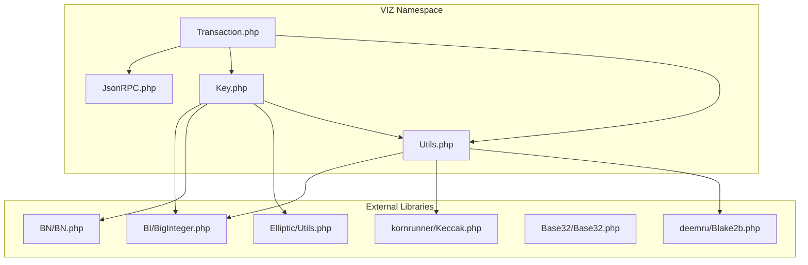
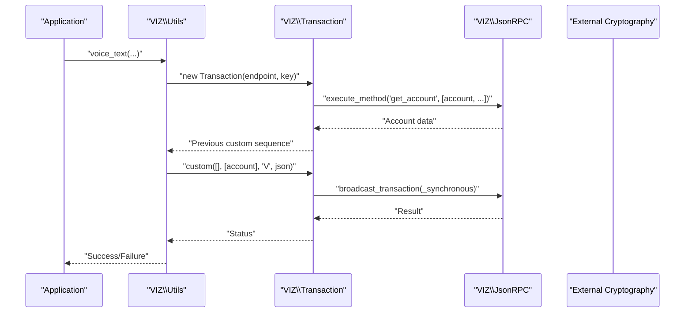
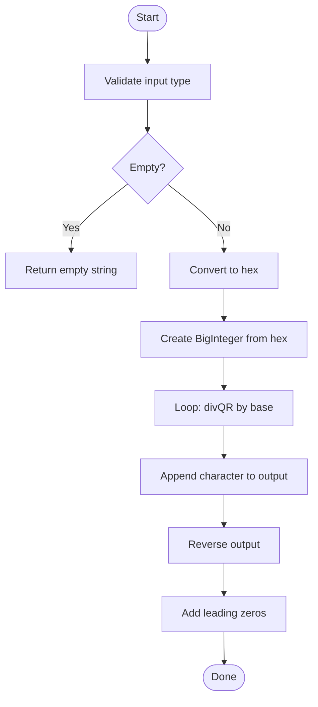
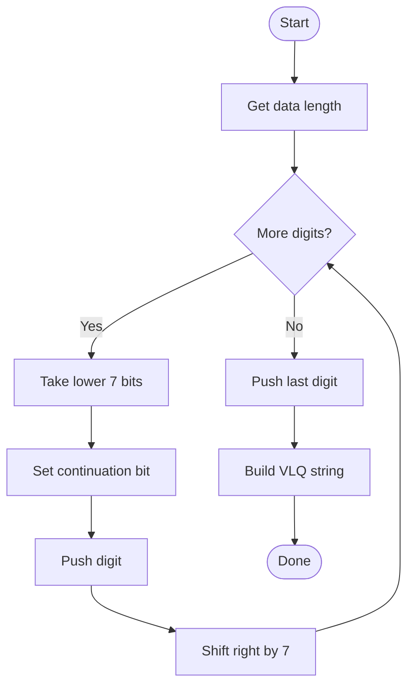
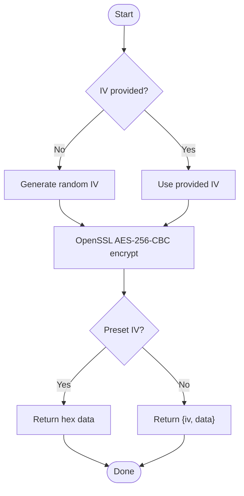
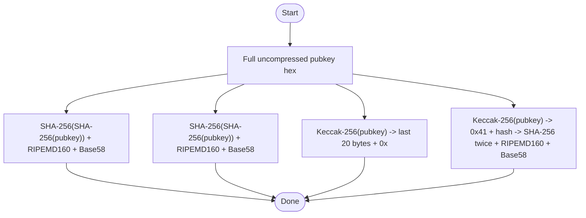
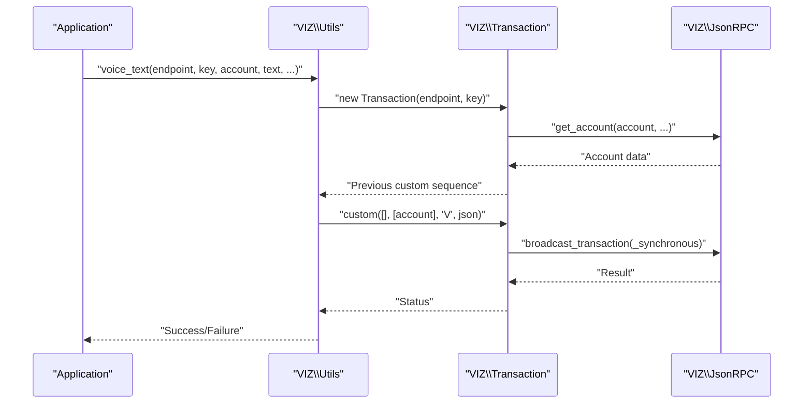
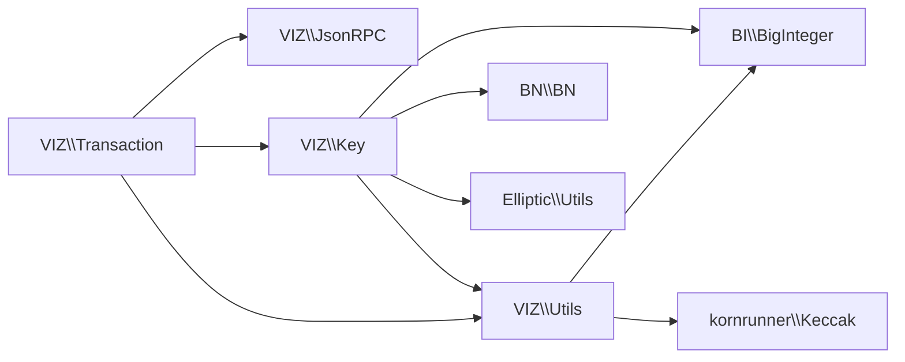

# Utility Functions

<cite>
**Referenced Files in This Document**
- [README.md](file://README.md)
- [composer.json](file://composer.json)
- [class/VIZ/Utils.php](file://class/VIZ/Utils.php)
- [class/VIZ/Transaction.php](file://class/VIZ/Transaction.php)
- [class/VIZ/JsonRPC.php](file://class/VIZ/JsonRPC.php)
- [class/VIZ/Key.php](file://class/VIZ/Key.php)
- [class/Base32/Base32.php](file://class/Base32/Base32.php)
- [class/deemru/Blake2b.php](file://class/deemru/Blake2b.php)
- [class/kornrunner/Keccak.php](file://class/kornrunner/Keccak.php)
- [class/Elliptic/Utils.php](file://class/Elliptic/Utils.php)
- [class/BI/BigInteger.php](file://class/BI/BigInteger.php)
- [class/BN/BN.php](file://class/BN/BN.php)
</cite>

## Table of Contents
1. [Introduction](#introduction)
2. [Project Structure](#project-structure)
3. [Core Components](#core-components)
4. [Architecture Overview](#architecture-overview)
5. [Detailed Component Analysis](#detailed-component-analysis)
6. [Dependency Analysis](#dependency-analysis)
7. [Performance Considerations](#performance-considerations)
8. [Troubleshooting Guide](#troubleshooting-guide)
9. [Conclusion](#conclusion)
10. [Appendices](#appendices)

## Introduction
This document focuses on the Utility Functions within the VIZ PHP Library. It covers:
- Base58 encoding/decoding
- Variable-length quantity (VLQ) encoding/decoding
- AES-256-CBC encryption/decryption
- Cross-chain address generation (Bitcoin, Litecoin, Ethereum, Tron)
- Voice protocol integration (text objects, publication objects, voice events, transaction size management)

It explains how these utilities are implemented, how they integrate with external cryptographic libraries, and provides practical usage guidance and compatibility considerations.

## Project Structure
The utility functions are primarily implemented in the VIZ namespace and rely on third-party cryptographic libraries for hashing and elliptic curve operations. The project’s autoload configuration maps namespaces to class directories, enabling seamless usage.

**Diagram sources**
- [class/VIZ/Utils.php](file://class/VIZ/Utils.php#L1-L413)
- [class/VIZ/Transaction.php](file://class/VIZ/Transaction.php#L1-L800)
- [class/VIZ/JsonRPC.php](file://class/VIZ/JsonRPC.php#L1-L354)
- [class/VIZ/Key.php](file://class/VIZ/Key.php#L1-L353)
- [class/BI/BigInteger.php](file://class/BI/BigInteger.php#L1-L200)
- [class/BN/BN.php](file://class/BN/BN.php#L1-L200)
- [class/kornrunner/Keccak.php](file://class/kornrunner/Keccak.php#L1-L307)
- [class/deemru/Blake2b.php](file://class/deemru/Blake2b.php#L1-L326)
- [class/Base32/Base32.php](file://class/Base32/Base32.php#L1-L130)
- [class/Elliptic/Utils.php](file://class/Elliptic/Utils.php#L1-L163)

**Section sources**
- [README.md](file://README.md#L1-L455)
- [composer.json](file://composer.json#L1-L32)

## Core Components
- Base58 encoding/decoding: Implemented in Utils with BigInteger wrapper support for arbitrary precision conversions.
- Variable-length quantity (VLQ): Implemented in Utils for compact length encoding/decoding.
- AES-256-CBC: Implemented in Utils using OpenSSL with IV handling and preset IV support.
- Cross-chain address generation: Implemented in Utils using Keccak and RIPEMD160, plus Base58 encoding.
- Voice protocol integration: Implemented in Utils for constructing Voice text/publication objects and Voice events, integrated with Transaction and JsonRPC for broadcasting.

**Section sources**
- [class/VIZ/Utils.php](file://class/VIZ/Utils.php#L209-L413)
- [class/VIZ/Transaction.php](file://class/VIZ/Transaction.php#L1-L800)
- [class/VIZ/JsonRPC.php](file://class/VIZ/JsonRPC.php#L1-L354)
- [class/VIZ/Key.php](file://class/VIZ/Key.php#L1-L353)

## Architecture Overview
The utility functions are layered:
- Low-level cryptography and math: BI/BigInteger, BN/BN, Keccak, Blake2b
- Elliptic curve utilities: Elliptic/Utils
- VIZ-specific utilities: VIZ/Utils (Base58, VLQ, AES, Voice protocol)
- Key and transaction orchestration: VIZ/Key, VIZ/Transaction, VIZ/JsonRPC

**Diagram sources**
- [class/VIZ/Utils.php](file://class/VIZ/Utils.php#L36-L73)
- [class/VIZ/Transaction.php](file://class/VIZ/Transaction.php#L53-L60)
- [class/VIZ/JsonRPC.php](file://class/VIZ/JsonRPC.php#L311-L353)

## Detailed Component Analysis

### Base58 Encoding/Decoding
- Purpose: Convert binary data to Base58 strings and back, with configurable alphabets.
- Implementation highlights:
  - Uses BI\BigInteger for arbitrary precision arithmetic during base conversions.
  - Handles leading zeros and validates character sets.
  - Supports custom alphabets for compatibility.
- Practical usage:
  - Encode private keys and public keys for blockchain addresses.
  - Decode Base58-encoded keys and verify checksums.

**Diagram sources**
- [class/VIZ/Utils.php](file://class/VIZ/Utils.php#L212-L250)
- [class/BI/BigInteger.php](file://class/BI/BigInteger.php#L1-L200)

**Section sources**
- [class/VIZ/Utils.php](file://class/VIZ/Utils.php#L209-L290)
- [class/BI/BigInteger.php](file://class/BI/BigInteger.php#L1-L200)

### Variable-Length Quantity (VLQ)
- Purpose: Compactly encode lengths for variable-sized data streams.
- Implementation highlights:
  - Encodes length digits with continuation bits.
  - Extracts digits and calculates original length.
  - Supports byte-wise digit extraction.
- Practical usage:
  - Used in memo encryption to encode lengths of VLQ-encoded data.

**Diagram sources**
- [class/VIZ/Utils.php](file://class/VIZ/Utils.php#L322-L383)

**Section sources**
- [class/VIZ/Utils.php](file://class/VIZ/Utils.php#L321-L383)

### AES-256-CBC Encryption/Decryption
- Purpose: Symmetric encryption for secure memo exchange and data protection.
- Implementation highlights:
  - Uses OpenSSL with AES-256-CBC.
  - Generates random IV when not provided.
  - Returns IV and ciphertext separately or concatenated depending on IV preset.
- Practical usage:
  - Encrypt/decrypt memo payloads using shared ECDH keys.
  - Encrypt arbitrary binary data with provided key and IV.

**Diagram sources**
- [class/VIZ/Utils.php](file://class/VIZ/Utils.php#L291-L320)

**Section sources**
- [class/VIZ/Utils.php](file://class/VIZ/Utils.php#L291-L320)

### Cross-Chain Address Generation
- Purpose: Generate addresses for Bitcoin, Litecoin, Ethereum, and Tron using cryptographic primitives.
- Implementation highlights:
  - Bitcoin/Litecoin: SHA-256(SHA-256()) checksum, RIPEMD160(pubkey), Base58 encoding.
  - Ethereum: Keccak-256 of uncompressed public key, take last 20 bytes, prefix with 0x.
  - Tron: Keccak-256 of uncompressed public key, prefix with 0x41, apply SHA-256 twice and RIPEMD160 for checksum, Base58 encode.
- Practical usage:
  - Convert public keys to addresses for supported blockchains.
  - Verify address formats and checksums.

**Diagram sources**
- [class/VIZ/Utils.php](file://class/VIZ/Utils.php#L384-L412)
- [class/kornrunner/Keccak.php](file://class/kornrunner/Keccak.php#L1-L307)

**Section sources**
- [class/VIZ/Utils.php](file://class/VIZ/Utils.php#L384-L412)
- [class/kornrunner/Keccak.php](file://class/kornrunner/Keccak.php#L1-L307)

### Voice Protocol Integration
- Purpose: Post Voice text/publication objects and manage Voice events (hide/edit/add) on the VIZ blockchain.
- Implementation highlights:
  - Text object: constructs a minimal object with type “t” and optional reply/share/beneficiaries.
  - Publication object: constructs an object with type “p” and metadata (title, markdown, description, image).
  - Event object: constructs an event with type “e” and target block, with optional data for edit/add.
  - Integration: Uses VIZ\Transaction and VIZ\Key to sign and broadcast transactions, with optional synchronous execution.
  - Transaction size management: Provides a mechanism to check raw transaction size and split long content into main object plus add events.

**Diagram sources**
- [class/VIZ/Utils.php](file://class/VIZ/Utils.php#L36-L73)
- [class/VIZ/Transaction.php](file://class/VIZ/Transaction.php#L53-L60)
- [class/VIZ/JsonRPC.php](file://class/VIZ/JsonRPC.php#L311-L353)

**Section sources**
- [class/VIZ/Utils.php](file://class/VIZ/Utils.php#L8-L27)
- [class/VIZ/Utils.php](file://class/VIZ/Utils.php#L28-L35)
- [class/VIZ/Utils.php](file://class/VIZ/Utils.php#L74-L102)
- [class/VIZ/Utils.php](file://class/VIZ/Utils.php#L103-L110)
- [class/VIZ/Utils.php](file://class/VIZ/Utils.php#L111-L148)
- [class/VIZ/Utils.php](file://class/VIZ/Utils.php#L149-L155)
- [class/VIZ/Utils.php](file://class/VIZ/Utils.php#L156-L208)
- [README.md](file://README.md#L310-L453)

## Dependency Analysis
- VIZ/Utils depends on:
  - BI/BigInteger for Base58 conversions
  - kornrunner/Keccak for Ethereum/Tron address generation
  - VIZ/Transaction and VIZ/JsonRPC for Voice protocol broadcasting
- VIZ/Key depends on:
  - BI/BigInteger and BN/BN for big integer operations
  - Elliptic/Utils for utility helpers
  - VIZ/Utils for Base58 and AES operations
- Autoloading:
  - Composer maps namespaces to class directories for VIZ, BN, BI, and Elliptic.

**Diagram sources**
- [class/VIZ/Utils.php](file://class/VIZ/Utils.php#L1-L413)
- [class/VIZ/Key.php](file://class/VIZ/Key.php#L1-L353)
- [class/VIZ/Transaction.php](file://class/VIZ/Transaction.php#L1-L800)
- [class/VIZ/JsonRPC.php](file://class/VIZ/JsonRPC.php#L1-L354)
- [composer.json](file://composer.json#L19-L29)

**Section sources**
- [composer.json](file://composer.json#L19-L29)
- [class/VIZ/Utils.php](file://class/VIZ/Utils.php#L1-L413)
- [class/VIZ/Key.php](file://class/VIZ/Key.php#L1-L353)
- [class/VIZ/Transaction.php](file://class/VIZ/Transaction.php#L1-L800)
- [class/VIZ/JsonRPC.php](file://class/VIZ/JsonRPC.php#L1-L354)

## Performance Considerations
- Base58 and VLQ operations are linear in input size; negligible overhead for typical payloads.
- AES-256-CBC performance depends on OpenSSL availability; ensure OpenSSL is enabled for optimal speed.
- Keccak hashing is computationally intensive; prefer buffered operations and reuse instances where possible.
- Voice protocol broadcasting:
  - Synchronous execution returns block number; asynchronous returns immediately.
  - For large content, pre-check transaction size and split into main object plus add events to stay within limits.

[No sources needed since this section provides general guidance]

## Troubleshooting Guide
- Base58 decoding fails:
  - Ensure input is a valid Base58 string and alphabet matches expectations.
  - Verify checksum calculation and leading zero handling.
- AES decryption fails:
  - Confirm IV matches the one used for encryption.
  - Ensure key length is 32 bytes and IV length is 16 bytes.
- Keccak hash errors:
  - Verify output size is supported (224/256/384/512).
  - Ensure input is a string and not malformed.
- Voice protocol errors:
  - Check account existence and custom sequence values.
  - Validate transaction size against network limits; split content if necessary.
  - Ensure endpoint is reachable and JSON-RPC plugin is enabled.

**Section sources**
- [class/VIZ/Utils.php](file://class/VIZ/Utils.php#L251-L290)
- [class/VIZ/Utils.php](file://class/VIZ/Utils.php#L313-L320)
- [class/kornrunner/Keccak.php](file://class/kornrunner/Keccak.php#L291-L297)
- [class/VIZ/JsonRPC.php](file://class/VIZ/JsonRPC.php#L311-L353)

## Conclusion
The VIZ PHP Library’s utility functions provide robust, interoperable tools for blockchain operations:
- Base58 and VLQ enable compact and compatible data encoding.
- AES-256-CBC secures memo and sensitive data.
- Cross-chain address generation supports multiple ecosystems.
- Voice protocol utilities streamline content creation and lifecycle management on VIZ.

These utilities integrate seamlessly with the broader VIZ ecosystem and external cryptographic libraries, offering both ease of use and strong performance characteristics.

[No sources needed since this section summarizes without analyzing specific files]

## Appendices

### Practical Usage Examples (by reference)
- Base58 encoding/decoding: See Base58 methods in [class/VIZ/Utils.php](file://class/VIZ/Utils.php#L212-L290).
- AES-256-CBC: See AES methods in [class/VIZ/Utils.php](file://class/VIZ/Utils.php#L291-L320).
- VLQ: See VLQ methods in [class/VIZ/Utils.php](file://class/VIZ/Utils.php#L322-L383).
- Cross-chain addresses: See address methods in [class/VIZ/Utils.php](file://class/VIZ/Utils.php#L384-L412).
- Voice protocol:
  - Text object: [class/VIZ/Utils.php](file://class/VIZ/Utils.php#L8-L35)
  - Publication object: [class/VIZ/Utils.php](file://class/VIZ/Utils.php#L74-L110)
  - Events: [class/VIZ/Utils.php](file://class/VIZ/Utils.php#L149-L208)
  - Size management example: [README.md](file://README.md#L402-L453)

**Section sources**
- [class/VIZ/Utils.php](file://class/VIZ/Utils.php#L8-L208)
- [class/VIZ/Utils.php](file://class/VIZ/Utils.php#L212-L412)
- [README.md](file://README.md#L402-L453)