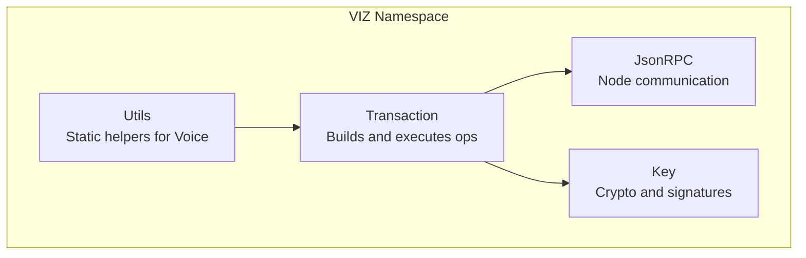
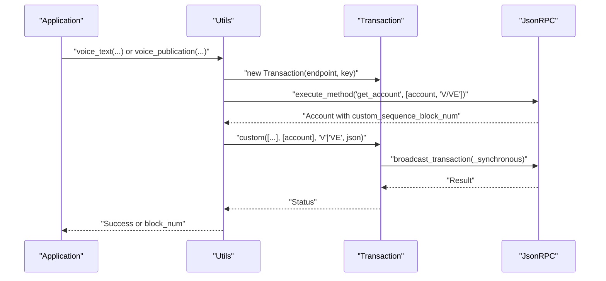
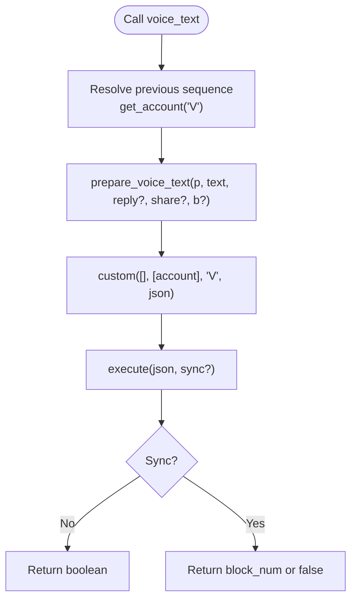
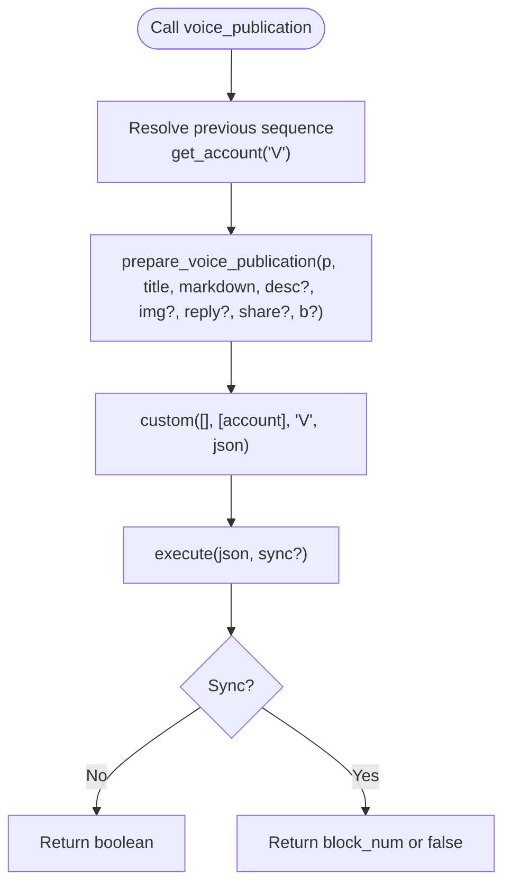
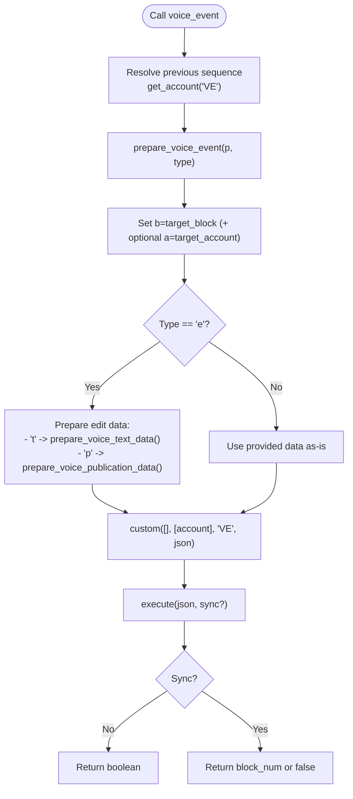
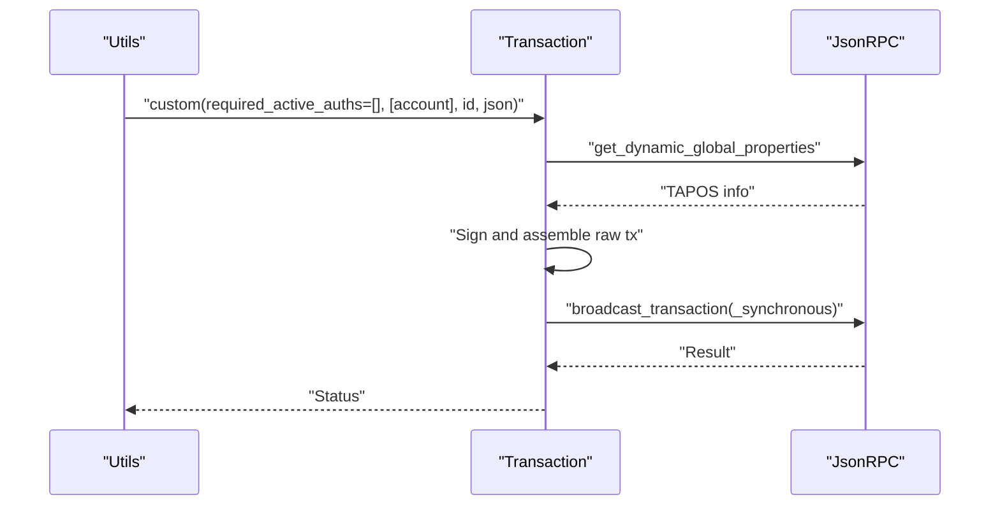
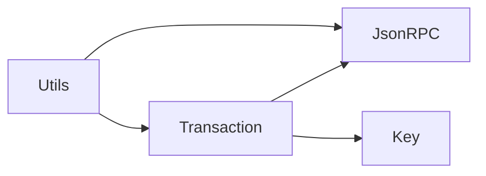

# Voice Protocol Integration

<cite>
**Referenced Files in This Document**
- [README.md](file://README.md)
- [Utils.php](file://class/VIZ/Utils.php)
- [Transaction.php](file://class/VIZ/Transaction.php)
- [JsonRPC.php](file://class/VIZ/JsonRPC.php)
- [Key.php](file://class/VIZ/Key.php)
</cite>

## Table of Contents
1. [Introduction](#introduction)
2. [Project Structure](#project-structure)
3. [Core Components](#core-components)
4. [Architecture Overview](#architecture-overview)
5. [Detailed Component Analysis](#detailed-component-analysis)
6. [Dependency Analysis](#dependency-analysis)
7. [Performance Considerations](#performance-considerations)
8. [Troubleshooting Guide](#troubleshooting-guide)
9. [Conclusion](#conclusion)
10. [Appendices](#appendices)

## Introduction
This document explains the Voice Protocol integration in the VIZ PHP library. It covers the Voice protocol’s text and publication objects, Voice Events, and the helper functions that prepare and submit them to the VIZ blockchain via custom operations. It also documents parameter validation, account sequence handling, transaction construction, event types, data formats, beneficiary configurations, and synchronous/asynchronous execution modes. Practical examples demonstrate social media integration, content publishing, and event-driven interactions.

## Project Structure
The Voice Protocol features are implemented in the VIZ namespace under class/VIZ. The primary integration surface is exposed via static helpers in the Utils class, which construct Voice objects and delegate transaction building and broadcasting to the Transaction class. The JsonRPC class handles communication with the VIZ node, while Key supports cryptographic operations.

**Diagram sources**
- [Utils.php](file://class/VIZ/Utils.php#L1-L413)
- [Transaction.php](file://class/VIZ/Transaction.php#L1-L1416)
- [JsonRPC.php](file://class/VIZ/JsonRPC.php#L1-L354)
- [Key.php](file://class/VIZ/Key.php#L1-L353)

**Section sources**
- [README.md](file://README.md#L1-L455)
- [Utils.php](file://class/VIZ/Utils.php#L1-L413)
- [Transaction.php](file://class/VIZ/Transaction.php#L1-L1416)
- [JsonRPC.php](file://class/VIZ/JsonRPC.php#L1-L354)
- [Key.php](file://class/VIZ/Key.php#L1-L353)

## Core Components
- Voice text preparation and submission:
  - prepare_voice_text_data: builds the Voice text payload.
  - prepare_voice_text: wraps the payload with previous sequence and type.
  - voice_text: resolves the account’s custom sequence, constructs a custom operation, and broadcasts it.
- Voice publication preparation and submission:
  - prepare_voice_publication_data: builds the Voice publication payload.
  - prepare_voice_publication: wraps the payload with previous sequence and type marker.
  - voice_publication: resolves the account’s custom sequence, constructs a custom operation, and broadcasts it.
- Voice Events:
  - prepare_voice_event: builds the Voice event object with target and optional account.
  - voice_event: validates event type, prepares event-specific data (edit/add), constructs a custom operation, and broadcasts it.
- Account sequence handling:
  - Uses get_account with a custom protocol scope to fetch custom_sequence_block_num for proper sequencing.
- Synchronous vs asynchronous execution:
  - execute supports broadcast_transaction and broadcast_transaction_synchronous.
- Beneficiary configuration:
  - Both text and publication payloads accept an optional beneficiaries array of account-weight pairs.

**Section sources**
- [Utils.php](file://class/VIZ/Utils.php#L7-L208)
- [Transaction.php](file://class/VIZ/Transaction.php#L53-L60)
- [JsonRPC.php](file://class/VIZ/JsonRPC.php#L44-L46)

## Architecture Overview
The Voice Protocol integrates with the VIZ blockchain through custom operations. The flow is:
- Prepare Voice object data (text/publication) or event metadata.
- Resolve the account’s previous custom sequence.
- Build a custom operation with the Voice payload or event metadata.
- Sign and broadcast the transaction (optionally synchronously).

**Diagram sources**
- [Utils.php](file://class/VIZ/Utils.php#L36-L73)
- [Utils.php](file://class/VIZ/Utils.php#L111-L148)
- [Utils.php](file://class/VIZ/Utils.php#L156-L208)
- [Transaction.php](file://class/VIZ/Transaction.php#L53-L60)
- [JsonRPC.php](file://class/VIZ/JsonRPC.php#L44-L46)

## Detailed Component Analysis

### Text Objects
- Data preparation:
  - prepare_voice_text_data: accepts text, optional reply, share, and beneficiaries. Produces a compact object with keys for text, optional reply/share, and optional beneficiaries.
  - prepare_voice_text: adds p (previous sequence) and t (type default to text) and embeds the prepared data.
- Submission:
  - voice_text: resolves previous sequence from get_account, builds a custom operation with id 'V', and broadcasts. Supports synchronous mode returning the block number.

**Diagram sources**
- [Utils.php](file://class/VIZ/Utils.php#L36-L73)
- [Transaction.php](file://class/VIZ/Transaction.php#L53-L60)

**Section sources**
- [Utils.php](file://class/VIZ/Utils.php#L7-L35)
- [Utils.php](file://class/VIZ/Utils.php#L36-L73)
- [README.md](file://README.md#L310-L328)

### Publication Objects
- Data preparation:
  - prepare_voice_publication_data: accepts title, markdown, optional description/image, reply/share, and optional beneficiaries. Produces a compact object with keys for title, markdown, and optional fields.
  - prepare_voice_publication: adds p (previous sequence), t='p' (type marker), and embeds the prepared data.
- Submission:
  - voice_publication: resolves previous sequence from get_account, builds a custom operation with id 'V', and broadcasts. Supports synchronous mode returning the block number.

**Diagram sources**
- [Utils.php](file://class/VIZ/Utils.php#L74-L110)
- [Utils.php](file://class/VIZ/Utils.php#L111-L148)
- [Transaction.php](file://class/VIZ/Transaction.php#L53-L60)

**Section sources**
- [Utils.php](file://class/VIZ/Utils.php#L74-L110)
- [Utils.php](file://class/VIZ/Utils.php#L111-L148)
- [README.md](file://README.md#L330-L382)

### Voice Events
- Event types:
  - 'e' (edit): modifies existing Voice text or publication. Requires data_type to specify whether editing text ('t') or publication ('p').
  - 'a' (add): appends data to an existing Voice object (e.g., long text splitting).
  - 'h' (hide): hides a Voice object; see examples.
- Data formats:
  - For 'e' with data_type='t': data must include text, optional reply, share, and beneficiaries.
  - For 'e' with data_type='p': data must include title, markdown, optional description/image, reply/share, and beneficiaries.
  - For 'a': data is passed as-is (raw) to the event payload.
- Targeting:
  - target_account is optional; if provided and differs from the signer account, it is included in the event object.
  - target_block identifies the Voice object being targeted.
- Submission:
  - voice_event: resolves previous sequence from get_account with 'VE', builds a custom operation with id 'VE', and broadcasts. Supports synchronous mode returning the block number.

**Diagram sources**
- [Utils.php](file://class/VIZ/Utils.php#L149-L208)
- [Utils.php](file://class/VIZ/Utils.php#L7-L27)
- [Utils.php](file://class/VIZ/Utils.php#L74-L102)
- [Transaction.php](file://class/VIZ/Transaction.php#L53-L60)

**Section sources**
- [Utils.php](file://class/VIZ/Utils.php#L149-L208)
- [README.md](file://README.md#L384-L453)

### Parameter Validation and Account Sequence Handling
- Key parameter normalization:
  - voice_text, voice_publication, and voice_event accept either a Key object or a WIF-encoded key; non-Key objects are rejected.
- Account sequence resolution:
  - get_account is called with a protocol scope that includes the Voice protocol fields. The previous sequence is taken from custom_sequence_block_num.
- Beneficiaries:
  - Both text and publication payloads accept an optional array of account-weight pairs. Validation is implicit in the payload construction; malformed arrays are not handled by the helpers.

**Section sources**
- [Utils.php](file://class/VIZ/Utils.php#L36-L73)
- [Utils.php](file://class/VIZ/Utils.php#L111-L148)
- [Utils.php](file://class/VIZ/Utils.php#L156-L208)
- [JsonRPC.php](file://class/VIZ/JsonRPC.php#L44-L46)

### Transaction Construction and Broadcasting
- Custom operation:
  - The Voice helpers build a custom operation with required_active_auths=[], required_regular_auths=[account], id 'V' or 'VE', and the Voice JSON payload.
- Execution modes:
  - Asynchronous: broadcast_transaction returns immediately.
  - Synchronous: broadcast_transaction_synchronous returns the block number upon witnessing.
- Signing and TAPOS:
  - Transaction.build handles TAPOS resolution, expiration, and signature generation. The helpers pass the built JSON to execute.

**Diagram sources**
- [Utils.php](file://class/VIZ/Utils.php#L36-L73)
- [Utils.php](file://class/VIZ/Utils.php#L111-L148)
- [Utils.php](file://class/VIZ/Utils.php#L156-L208)
- [Transaction.php](file://class/VIZ/Transaction.php#L61-L156)
- [JsonRPC.php](file://class/VIZ/JsonRPC.php#L91-L96)

**Section sources**
- [Transaction.php](file://class/VIZ/Transaction.php#L61-L156)
- [JsonRPC.php](file://class/VIZ/JsonRPC.php#L91-L96)

## Dependency Analysis
- Utils depends on:
  - Transaction for constructing and broadcasting custom operations.
  - JsonRPC for node queries and transaction broadcasting.
  - Key for signature verification and encoding when needed.
- Transaction depends on:
  - JsonRPC for TAPOS and broadcasting.
  - Key for signing.
- Data flow:
  - Utils.prepare_* helpers produce JSON payloads consumed by Transaction.custom.
  - Transaction.execute delegates to JsonRPC broadcast methods.

**Diagram sources**
- [Utils.php](file://class/VIZ/Utils.php#L1-L413)
- [Transaction.php](file://class/VIZ/Transaction.php#L1-L1416)
- [JsonRPC.php](file://class/VIZ/JsonRPC.php#L1-L354)
- [Key.php](file://class/VIZ/Key.php#L1-L353)

**Section sources**
- [Utils.php](file://class/VIZ/Utils.php#L1-L413)
- [Transaction.php](file://class/VIZ/Transaction.php#L1-L1416)
- [JsonRPC.php](file://class/VIZ/JsonRPC.php#L1-L354)
- [Key.php](file://class/VIZ/Key.php#L1-L353)

## Performance Considerations
- Transaction size limits:
  - The examples demonstrate checking transaction length against a limit and splitting long content into a main Voice object plus add events. This avoids exceeding node limits.
- Synchronous execution:
  - Using synchronous mode increases latency as the client waits for block production; asynchronous mode is recommended for higher throughput.
- Beneficiary serialization:
  - Beneficiaries are embedded as part of the Voice payload; keep the array minimal to reduce payload size.

[No sources needed since this section provides general guidance]

## Troubleshooting Guide
- Invalid key type:
  - Passing a non-Key object to voice_text, voice_publication, or voice_event returns false. Ensure a Key object or WIF-encoded key is provided.
- Account not found or insufficient data:
  - get_account may fail if the account does not exist or the node does not return the Voice protocol fields. The helpers return false in such cases.
- Synchronous mode:
  - In synchronous mode, the helpers return the block number if successful; otherwise false. Inspect the node response for errors.
- Event targeting:
  - Ensure target_block corresponds to an existing Voice object. For cross-account edits, include target_account to differentiate the author.

**Section sources**
- [Utils.php](file://class/VIZ/Utils.php#L36-L73)
- [Utils.php](file://class/VIZ/Utils.php#L111-L148)
- [Utils.php](file://class/VIZ/Utils.php#L156-L208)
- [JsonRPC.php](file://class/VIZ/JsonRPC.php#L311-L353)

## Conclusion
The Voice Protocol integration in the VIZ PHP library provides a concise, high-level interface for creating Voice text and publication objects, appending events, and hiding content. The helpers encapsulate payload preparation, account sequence resolution, and transaction construction, delegating cryptographic signing and broadcasting to the Transaction and JsonRPC layers. By leveraging synchronous and asynchronous execution modes and following the examples for long content splitting, applications can integrate Voice Protocol features reliably and efficiently.

[No sources needed since this section summarizes without analyzing specific files]

## Appendices

### Practical Examples Index
- Social media integration:
  - Post a Voice text object: [README.md](file://README.md#L320-L328)
  - Post a Voice publication object: [README.md](file://README.md#L343-L382)
- Event-driven interactions:
  - Hide a Voice object: [README.md](file://README.md#L393-L400)
  - Split long text and append via add event: [README.md](file://README.md#L414-L453)

**Section sources**
- [README.md](file://README.md#L310-L453)